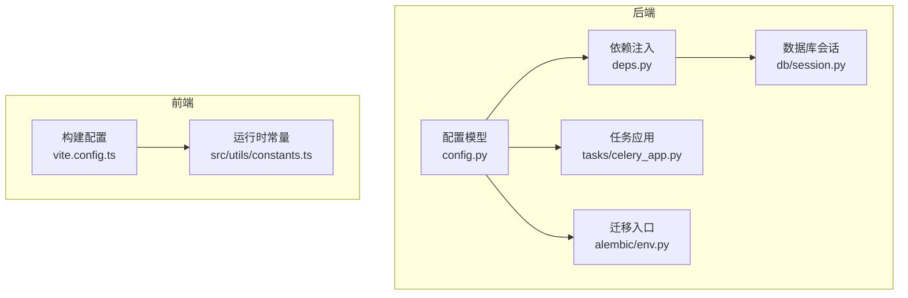
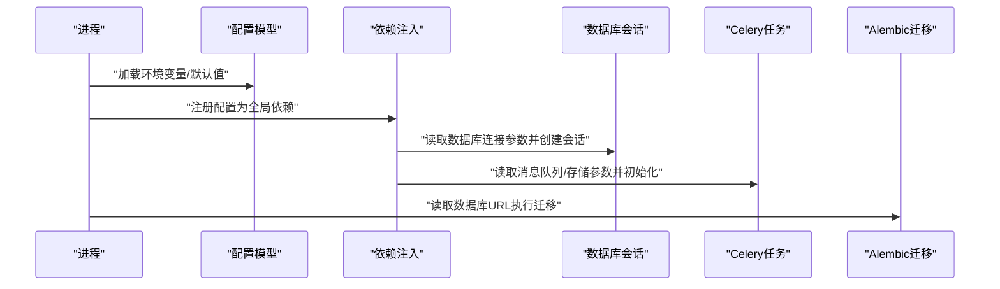
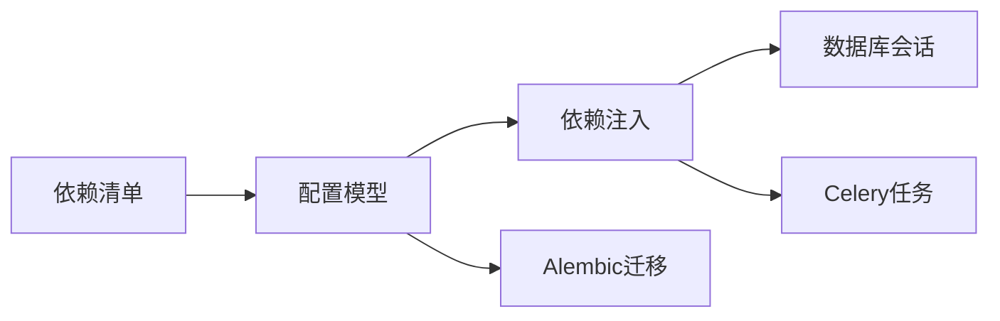

# 配置管理与环境

<cite>
**本文引用的文件**   
- [backend/app/core/config.py](file://backend/app/core/config.py)
- [backend/app/core/deps.py](file://backend/app/core/deps.py)
- [backend/app/db/session.py](file://backend/app/db/session.py)
- [backend/app/tasks/celery_app.py](file://backend/app/tasks/celery_app.py)
- [backend/alembic/env.py](file://backend/alembic/env.py)
- [backend/requirements.txt](file://backend/requirements.txt)
- [frontend/vite.config.ts](file://frontend/vite.config.ts)
- [frontend/src/utils/constants.ts](file://frontend/src/utils/constants.ts)
</cite>

## 目录
1. [简介](#简介)
2. [项目结构](#项目结构)
3. [核心组件](#核心组件)
4. [架构总览](#架构总览)
5. [详细组件分析](#详细组件分析)
6. [依赖关系分析](#依赖关系分析)
7. [性能考虑](#性能考虑)
8. [故障排查指南](#故障排查指南)
9. [结论](#结论)
10. [附录](#附录)

## 简介
本指南面向AI助教系统的配置管理与环境配置，覆盖以下主题：
- 应用配置管理系统设计：配置分层、环境变量管理、动态配置更新
- 多环境策略：开发、测试、生产的差异化配置
- 第三方服务配置：数据库连接、Redis缓存、消息队列、外部API密钥
- 配置验证、默认值处理、热重载机制
- 容器化与Kubernetes ConfigMap集成、配置中心对接方案
- 配置安全：敏感信息加密、审计日志

## 项目结构
后端采用基于Pydantic的配置模型与环境变量加载，结合FastAPI依赖注入；数据迁移使用Alembic；任务调度使用Celery。前端通过构建期常量注入运行时配置。

图表来源
- [backend/app/core/config.py](file://backend/app/core/config.py)
- [backend/app/core/deps.py](file://backend/app/core/deps.py)
- [backend/app/db/session.py](file://backend/app/db/session.py)
- [backend/app/tasks/celery_app.py](file://backend/app/tasks/celery_app.py)
- [backend/alembic/env.py](file://backend/alembic/env.py)
- [frontend/vite.config.ts](file://frontend/vite.config.ts)
- [frontend/src/utils/constants.ts](file://frontend/src/utils/constants.ts)

章节来源
- [backend/app/core/config.py](file://backend/app/core/config.py)
- [backend/app/core/deps.py](file://backend/app/core/deps.py)
- [backend/app/db/session.py](file://backend/app/db/session.py)
- [backend/app/tasks/celery_app.py](file://backend/app/tasks/celery_app.py)
- [backend/alembic/env.py](file://backend/alembic/env.py)
- [frontend/vite.config.ts](file://frontend/vite.config.ts)
- [frontend/src/utils/constants.ts](file://frontend/src/utils/constants.ts)

## 核心组件
- 配置模型与加载：集中定义配置项、类型校验、默认值与来源（环境变量）
- 依赖注入：在FastAPI中提供统一配置访问点，避免散落的getenv调用
- 数据库会话：从配置读取连接参数并初始化引擎与会话
- Celery任务：从配置读取Broker/Backend等任务相关参数
- Alembic迁移：从配置读取数据库URL以执行迁移
- 前端构建期常量：将必要的前端配置在构建时注入到常量模块

章节来源
- [backend/app/core/config.py](file://backend/app/core/config.py)
- [backend/app/core/deps.py](file://backend/app/core/deps.py)
- [backend/app/db/session.py](file://backend/app/db/session.py)
- [backend/app/tasks/celery_app.py](file://backend/app/tasks/celery_app.py)
- [backend/alembic/env.py](file://backend/alembic/env.py)
- [frontend/vite.config.ts](file://frontend/vite.config.ts)
- [frontend/src/utils/constants.ts](file://frontend/src/utils/constants.ts)

## 架构总览
下图展示配置在启动期的装配流程：进程启动→加载配置→注入依赖→初始化子系统（DB、Celery、Alembic）。

图表来源
- [backend/app/core/config.py](file://backend/app/core/config.py)
- [backend/app/core/deps.py](file://backend/app/core/deps.py)
- [backend/app/db/session.py](file://backend/app/db/session.py)
- [backend/app/tasks/celery_app.py](file://backend/app/tasks/celery_app.py)
- [backend/alembic/env.py](file://backend/alembic/env.py)

## 详细组件分析

### 配置模型与加载（config.py）
- 设计要点
  - 分层：基础默认值 + 环境变量覆盖 + 可选的外部配置源（如配置文件或配置中心）
  - 类型校验：利用强类型字段进行输入校验，缺失或非法值在启动期快速失败
  - 默认值：为所有关键键提供合理默认值，降低部署门槛
  - 命名规范：统一前缀与大小写约定，便于跨语言/工具识别
- 建议的键空间（示例，按领域分组）
  - 应用：端口、调试开关、日志级别、时区
  - 数据库：驱动、主机、端口、库名、用户、密码、池大小、超时
  - Redis：地址、端口、库号、密码、连接池
  - 消息队列：Broker URL、结果后端URL、并发数、重试策略
  - 外部API：LLM提供商、鉴权密钥、超时、重试次数
  - 安全：JWT密钥、Cookie域、CORS白名单
  - 前端可见：仅暴露非敏感域名/版本等
- 动态更新与热重载
  - 启动期一次性加载，保证一致性
  - 对可热更新的键（如日志级别、功能开关），可通过内部事件总线或HTTP接口触发局部刷新
  - 对不可热更新的键（如数据库连接串），需优雅重启或滚动升级

章节来源
- [backend/app/core/config.py](file://backend/app/core/config.py)

### 依赖注入（deps.py）
- 作用
  - 将配置对象作为FastAPI依赖，供路由与服务层统一获取
  - 封装配置访问细节，屏蔽环境变量读取逻辑
- 最佳实践
  - 避免在业务代码中直接读取环境变量
  - 对需要变更的配置项提供只读视图，防止误改

章节来源
- [backend/app/core/deps.py](file://backend/app/core/deps.py)

### 数据库会话（db/session.py）
- 从配置读取连接参数，创建引擎与会话工厂
- 连接池与超时：根据负载调整池大小与超时，避免资源耗尽
- 健康检查：启动时尝试建立连接，失败则快速失败

章节来源
- [backend/app/db/session.py](file://backend/app/db/session.py)

### Celery任务（tasks/celery_app.py）
- 从配置读取Broker与结果后端URL、并发度、重试策略
- 与主应用共享配置模型，确保一致的环境语义

章节来源
- [backend/app/tasks/celery_app.py](file://backend/app/tasks/celery_app.py)

### Alembic迁移（alembic/env.py）
- 从配置读取数据库URL，用于迁移脚本执行
- 支持在CI/CD流水线中以只读方式校验迁移幂等性

章节来源
- [backend/alembic/env.py](file://backend/alembic/env.py)

### 前端构建期常量（vite.config.ts, constants.ts）
- 构建期注入：在构建阶段将必要的非敏感配置写入常量模块
- 运行期读取：业务代码通过常量模块访问，避免运行时读取环境变量
- 注意：不要在前端暴露任何敏感信息

章节来源
- [frontend/vite.config.ts](file://frontend/vite.config.ts)
- [frontend/src/utils/constants.ts](file://frontend/src/utils/constants.ts)

## 依赖关系分析
- 耦合与内聚
  - 配置模型高内聚，被多个子系统消费，形成松耦合的依赖注入模式
  - 数据库、任务、迁移均通过配置抽象，替换实现成本低
- 外部依赖
  - 数据库驱动、Redis客户端、消息队列客户端、外部API SDK
  - 通过requirements锁定版本，确保可重现构建

图表来源
- [backend/app/core/config.py](file://backend/app/core/config.py)
- [backend/app/core/deps.py](file://backend/app/core/deps.py)
- [backend/app/db/session.py](file://backend/app/db/session.py)
- [backend/app/tasks/celery_app.py](file://backend/app/tasks/celery_app.py)
- [backend/alembic/env.py](file://backend/alembic/env.py)
- [backend/requirements.txt](file://backend/requirements.txt)

章节来源
- [backend/requirements.txt](file://backend/requirements.txt)

## 性能考虑
- 连接池与超时：根据QPS与延迟目标调优数据库与Redis连接池大小、读写超时
- 懒加载与预热：对冷路径配置项按需加载；启动时预建连接池
- 批量与批处理：消息队列消费者批量拉取，减少网络往返
- 缓存策略：热点配置项本地缓存，设置TTL与失效回退
- 监控指标：暴露配置加载耗时、连接池利用率、错误率

## 故障排查指南
- 启动期失败
  - 检查必填环境变量是否缺失或格式错误
  - 查看配置校验错误堆栈，定位具体字段
- 连接问题
  - 核对数据库/Redis/Celery的连接字符串与网络可达性
  - 确认凭据权限与防火墙规则
- 行为异常
  - 对比当前环境与期望环境的配置差异
  - 开启更详细的日志级别，观察配置生效路径
- 前端不生效
  - 确认构建产物包含正确的常量
  - 清理浏览器缓存，重新构建部署

## 结论
通过统一的配置模型与依赖注入，系统实现了清晰的分层与可维护的环境管理。配合严格的类型校验、合理的默认值、以及针对热更新与安全性的设计，可在多环境中稳定交付。后续可引入配置中心与密钥管理服务，进一步提升可观测性与安全性。

## 附录

### 环境变量清单（建议）
- 应用
  - APP_PORT、APP_DEBUG、APP_LOG_LEVEL、APP_TIMEZONE
- 数据库
  - DB_DRIVER、DB_HOST、DB_PORT、DB_NAME、DB_USER、DB_PASSWORD、DB_POOL_SIZE、DB_TIMEOUT
- Redis
  - REDIS_HOST、REDIS_PORT、REDIS_DB、REDIS_PASSWORD、REDIS_POOL_SIZE
- 消息队列
  - CELERY_BROKER_URL、CELERY_RESULT_BACKEND、CELERY_WORKER_CONCURRENCY、CELERY_TASK_RETRIES
- 外部API
  - LLM_PROVIDER、LLM_API_KEY、LLM_BASE_URL、LLM_TIMEOUT、LLM_MAX_RETRIES
- 安全
  - JWT_SECRET、COOKIE_DOMAIN、CORS_ORIGINS
- 前端可见
  - APP_PUBLIC_BASE_URL、APP_VERSION

说明：以上为建议键名，实际以配置模型为准。

### 多环境策略
- 开发
  - 启用调试、详细日志、宽松CORS、本地数据库/Redis
- 测试
  - 隔离数据库与缓存、固定随机种子、禁用外部真实调用（使用Mock）
- 生产
  - 关闭调试、收紧CORS、最小权限凭据、启用连接池与限流、开启审计日志

### 容器化与Kubernetes
- Docker
  - 使用多阶段构建，镜像内不包含敏感信息
  - 通过环境变量或挂载卷注入配置
- Kubernetes
  - 使用ConfigMap存放非敏感配置
  - 使用Secret存放敏感信息（密钥、证书）
  - 通过环境变量或Volume挂载至Pod
  - 使用InitContainer执行数据库迁移

### 配置中心与密钥管理
- 配置中心
  - 启动时拉取远程配置，合并本地默认值
  - 监听变更事件，触发局部热更新
- 密钥管理
  - 使用KMS/Secrets Manager托管密钥
  - 应用侧通过SDK或Sidecar注入，避免明文落盘

### 配置验证与默认值
- 启动期校验：缺失必填项或类型不符立即失败
- 默认值：为所有键提供合理默认值，降低部署成本
- 灰度与回滚：对可热更新配置提供灰度发布与一键回滚

### 配置热重载机制
- 可热更新项：日志级别、功能开关、速率限制阈值
- 不可热更新项：数据库连接、加密密钥、TLS证书
- 实现建议：基于事件总线或HTTP回调触发局部刷新，保持状态一致性

### 配置安全与审计
- 敏感信息
  - 禁止硬编码与日志输出
  - 使用加密存储与传输（TLS）
- 审计日志
  - 记录配置加载来源、变更时间、操作者
  - 保留变更前后快照，便于追溯