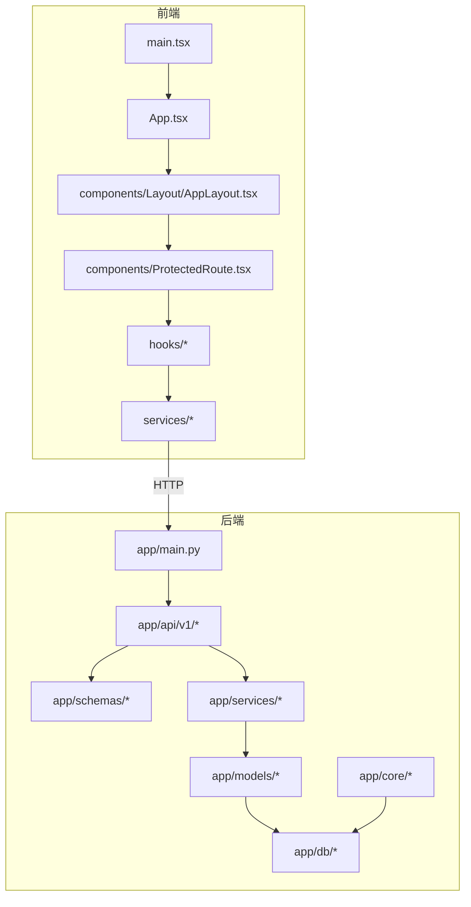
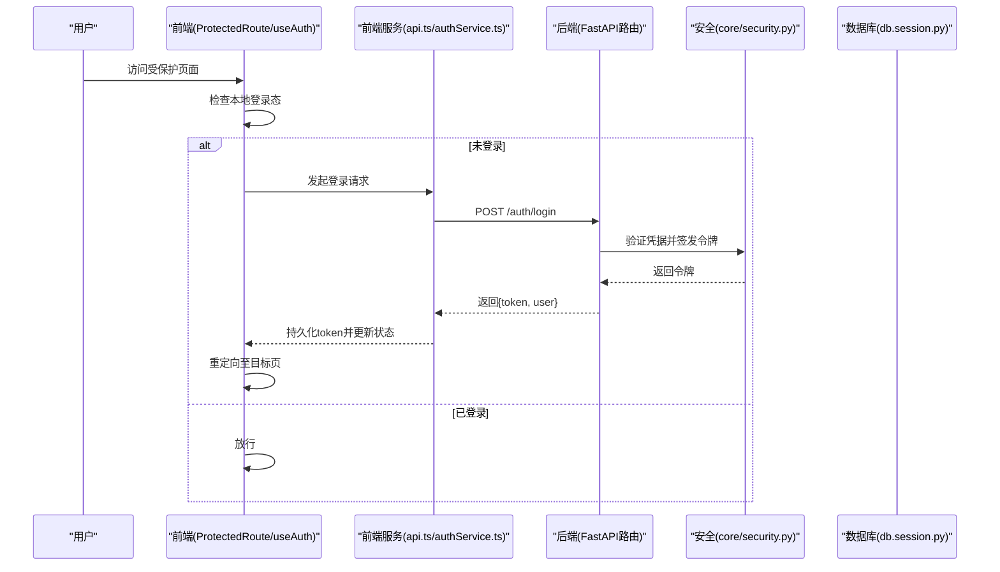
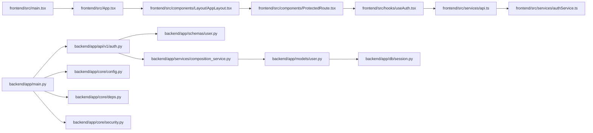

# 代码规范

<cite>
**本文引用的文件**   
- [backend/app/main.py](file://backend/app/main.py)
- [backend/app/core/config.py](file://backend/app/core/config.py)
- [backend/app/core/deps.py](file://backend/app/core/deps.py)
- [backend/app/core/security.py](file://backend/app/core/security.py)
- [backend/app/db/base.py](file://backend/app/db/base.py)
- [backend/app/db/session.py](file://backend/app/db/session.py)
- [backend/app/models/user.py](file://backend/app/models/user.py)
- [backend/app/models/question.py](file://backend/app/models/question.py)
- [backend/app/schemas/user.py](file://backend/app/schemas/user.py)
- [backend/app/api/v1/auth.py](file://backend/app/api/v1/auth.py)
- [backend/app/services/composition_service.py](file://backend/app/services/composition_service.py)
- [frontend/src/App.tsx](file://frontend/src/App.tsx)
- [frontend/src/main.tsx](file://frontend/src/main.tsx)
- [frontend/src/components/Layout/AppLayout.tsx](file://frontend/src/components/Layout/AppLayout.tsx)
- [frontend/src/components/ProtectedRoute.tsx](file://frontend/src/components/ProtectedRoute.tsx)
- [frontend/src/hooks/useAuth.tsx](file://frontend/src/hooks/useAuth.tsx)
- [frontend/src/services/api.ts](file://frontend/src/services/api.ts)
- [frontend/src/services/authService.ts](file://frontend/src/services/authService.ts)
- [frontend/package.json](file://frontend/package.json)
- [frontend/tsconfig.json](file://frontend/tsconfig.json)
- [frontend/vite.config.ts](file://frontend/vite.config.ts)
</cite>

## 目录
1. [简介](#简介)
2. [项目结构](#项目结构)
3. [核心组件](#核心组件)
4. [架构总览](#架构总览)
5. [详细组件分析](#详细组件分析)
6. [依赖分析](#依赖分析)
7. [性能考虑](#性能考虑)
8. [故障排查指南](#故障排查指南)
9. [结论](#结论)
10. [附录](#附录)

## 简介
本规范面向AI助教系统的前后端开发，统一前端TypeScript与React、后端Python（FastAPI + SQLAlchemy）的编码约定与实践，覆盖命名、组件结构、接口定义、错误处理、Hooks使用、状态管理、样式组织、服务层架构、Git提交与分支策略、代码审查清单以及ESLint/Prettier配置与自动化检查流程。目标是提升可读性、可维护性与协作效率，降低回归风险。

## 项目结构
- 前端采用Vite + React + TypeScript，按功能域划分src目录：components、hooks、pages、services、utils等；通过路由与布局组件组织页面。
- 后端采用FastAPI应用，分层清晰：api（路由）、schemas（Pydantic模型）、models（SQLAlchemy ORM）、services（业务逻辑）、core（配置/依赖注入/安全）、db（数据库会话与基类）。

图表来源
- [frontend/src/main.tsx](file://frontend/src/main.tsx)
- [frontend/src/App.tsx](file://frontend/src/App.tsx)
- [frontend/src/components/Layout/AppLayout.tsx](file://frontend/src/components/Layout/AppLayout.tsx)
- [frontend/src/components/ProtectedRoute.tsx](file://frontend/src/components/ProtectedRoute.tsx)
- [backend/app/main.py](file://backend/app/main.py)
- [backend/app/api/v1/auth.py](file://backend/app/api/v1/auth.py)
- [backend/app/schemas/user.py](file://backend/app/schemas/user.py)
- [backend/app/models/user.py](file://backend/app/models/user.py)
- [backend/app/db/session.py](file://backend/app/db/session.py)

章节来源
- [frontend/src/main.tsx](file://frontend/src/main.tsx)
- [frontend/src/App.tsx](file://frontend/src/App.tsx)
- [backend/app/main.py](file://backend/app/main.py)

## 核心组件
本节给出前后端关键模块的职责边界与交互方式，作为后续规范的落地依据。

- 前端入口与路由
  - main.tsx：应用启动与根节点挂载。
  - App.tsx：全局路由与布局装配。
  - Layout/AppLayout.tsx：页面级布局容器。
  - ProtectedRoute.tsx：受保护路由守卫，结合认证Hook进行鉴权。
- 前端服务层
  - services/api.ts：统一请求封装（基础URL、拦截器、错误归一化）。
  - services/authService.ts：认证相关API调用。
  - hooks/useAuth.tsx：认证状态与登录态管理。
- 后端应用
  - app/main.py：FastAPI应用实例、中间件与路由注册。
  - core/config.py：环境变量与配置加载。
  - core/deps.py：依赖注入（如DB会话、认证上下文）。
  - core/security.py：密码哈希、令牌签发与校验。
  - db/base.py、db/session.py：ORM基类与会话生命周期。
  - models/*：数据模型定义。
  - schemas/*：请求/响应数据结构。
  - api/v1/*：REST路由实现，调用服务层。
  - services/*：领域服务编排与外部工具集成。

章节来源
- [frontend/src/main.tsx](file://frontend/src/main.tsx)
- [frontend/src/App.tsx](file://frontend/src/App.tsx)
- [frontend/src/components/Layout/AppLayout.tsx](file://frontend/src/components/Layout/AppLayout.tsx)
- [frontend/src/components/ProtectedRoute.tsx](file://frontend/src/components/ProtectedRoute.tsx)
- [frontend/src/services/api.ts](file://frontend/src/services/api.ts)
- [frontend/src/services/authService.ts](file://frontend/src/services/authService.ts)
- [frontend/src/hooks/useAuth.tsx](file://frontend/src/hooks/useAuth.tsx)
- [backend/app/main.py](file://backend/app/main.py)
- [backend/app/core/config.py](file://backend/app/core/config.py)
- [backend/app/core/deps.py](file://backend/app/core/deps.py)
- [backend/app/core/security.py](file://backend/app/core/security.py)
- [backend/app/db/base.py](file://backend/app/db/base.py)
- [backend/app/db/session.py](file://backend/app/db/session.py)
- [backend/app/models/user.py](file://backend/app/models/user.py)
- [backend/app/schemas/user.py](file://backend/app/schemas/user.py)
- [backend/app/api/v1/auth.py](file://backend/app/api/v1/auth.py)

## 架构总览
下图展示一次典型的用户登录流程，涵盖前端到后端的完整链路，体现认证、授权与错误处理的规范实践。

图表来源
- [frontend/src/components/ProtectedRoute.tsx](file://frontend/src/components/ProtectedRoute.tsx)
- [frontend/src/hooks/useAuth.tsx](file://frontend/src/hooks/useAuth.tsx)
- [frontend/src/services/api.ts](file://frontend/src/services/api.ts)
- [frontend/src/services/authService.ts](file://frontend/src/services/authService.ts)
- [backend/app/api/v1/auth.py](file://backend/app/api/v1/auth.py)
- [backend/app/core/security.py](file://backend/app/core/security.py)
- [backend/app/db/session.py](file://backend/app/db/session.py)

## 详细组件分析

### 前端TypeScript编码规范
- 变量与函数命名
  - 使用小驼峰命名变量与函数，常量使用全大写下划线分隔。
  - 布尔值以is/has/can前缀表达语义。
  - 异步函数名以动词开头，如fetchXxx、updateXxx。
- 组件结构规范
  - 每个组件独立文件，文件名与组件名一致且首字母大写。
  - 组件职责单一，复杂页面拆分为子组件组合。
  - 类型定义与组件同目录或types目录集中管理。
- 接口定义标准
  - 所有对外暴露的接口使用interface或type明确声明。
  - 可选字段使用?，枚举使用enum或字面量联合类型。
  - 网络请求与响应结构在services中集中定义。
- 错误处理模式
  - 统一在请求封装层捕获异常，转换为标准化错误对象。
  - 区分网络错误、业务错误与未知错误，提供友好提示。
  - 敏感信息不上报，保留必要上下文便于定位问题。

章节来源
- [frontend/src/services/api.ts](file://frontend/src/services/api.ts)
- [frontend/src/components/ProtectedRoute.tsx](file://frontend/src/components/ProtectedRoute.tsx)
- [frontend/src/hooks/useAuth.tsx](file://frontend/src/hooks/useAuth.tsx)

### React开发规范
- 函数式组件最佳实践
  - 优先使用函数式组件与纯函数思维，避免不必要的类组件。
  - 将UI与逻辑解耦，复杂逻辑下沉至自定义Hook。
- Hooks使用规范
  - useState用于简单状态，useReducer用于复杂状态机。
  - useEffect仅用于副作用，清理函数必须释放资源。
  - useCallback/useMemo仅在性能瓶颈处使用，避免过度优化。
- 状态管理模式
  - 局部状态由组件自身管理，跨组件共享通过Context或状态库。
  - 服务端状态通过服务层缓存与失效策略管理。
- 样式组织方式
  - 推荐使用CSS Modules或styled-components，避免全局样式污染。
  - 主题与通用样式集中在design tokens文件中。

章节来源
- [frontend/src/App.tsx](file://frontend/src/App.tsx)
- [frontend/src/components/Layout/AppLayout.tsx](file://frontend/src/components/Layout/AppLayout.tsx)
- [frontend/src/hooks/useAuth.tsx](file://frontend/src/hooks/useAuth.tsx)

### 后端Python编码规范
- PEP8遵循
  - 严格遵循PEP8风格，使用一致的缩进、空行与导入顺序。
  - 单行长度限制，长表达式合理换行。
- FastAPI路由设计
  - 路由按领域拆分，路径简洁且具描述性。
  - 请求/响应使用Pydantic schema强类型约束。
  - 统一错误码与消息体格式。
- SQLAlchemy模型定义
  - 模型与表映射清晰，字段类型与约束准确。
  - 外键关系与索引合理设置，避免N+1查询。
- 服务层架构模式
  - 路由层只做参数校验与调度，业务逻辑下沉至services。
  - 依赖注入通过core/deps.py统一管理，保证可测试性。

章节来源
- [backend/app/api/v1/auth.py](file://backend/app/api/v1/auth.py)
- [backend/app/schemas/user.py](file://backend/app/schemas/user.py)
- [backend/app/models/user.py](file://backend/app/models/user.py)
- [backend/app/services/composition_service.py](file://backend/app/services/composition_service.py)
- [backend/app/core/deps.py](file://backend/app/core/deps.py)

### Git提交规范
- 提交信息格式
  - 类型：feat/fix/docs/style/refactor/perf/test/build/ci/chore/revert
  - 作用域：模块或功能域（如api、auth、ai-question）
  - 主题：简短描述变更目的，不超过50字符
  - 正文：说明动机、影响范围与注意事项
  - 示例：feat(auth): 增加刷新令牌机制
- 分支管理策略
  - main：生产分支，需通过CI与评审合并
  - develop：集成分支，日常开发合并
  - feature/*：功能分支，从develop创建，完成后合入develop
  - hotfix/*：紧急修复，从main创建，合入main与develop
  - release/*：发布候选，从develop创建，打标签后合入main
- 代码审查清单
  - 需求对齐：是否满足PR描述与验收标准
  - 代码质量：是否符合本规范，是否存在明显缺陷
  - 安全性：敏感信息、权限控制、输入校验
  - 可测试性：单元测试覆盖率与用例有效性
  - 文档与注释：关键逻辑是否有说明，变更是否更新文档

[本节为通用流程说明，不直接分析具体文件]

### ESLint与Prettier配置说明
- 规则建议
  - 启用严格TS规则，关闭宽松默认项
  - 强制分号与单引号，统一缩进与行宽
  - 禁止console.log在生产环境输出
  - 组件与Hook命名一致性检查
- 配置文件位置
  - package.json中scripts与devDependencies
  - tsconfig.json中编译选项与路径别名
  - vite.config.ts中插件与构建优化
- 自动化检查流程
  - pre-commit钩子执行lint与格式化
  - CI流水线执行lint、test与build
  - 失败阻断合并，确保主干质量

章节来源
- [frontend/package.json](file://frontend/package.json)
- [frontend/tsconfig.json](file://frontend/tsconfig.json)
- [frontend/vite.config.ts](file://frontend/vite.config.ts)

## 依赖分析
前后端模块间依赖关系如下，强调低耦合与高内聚原则。

图表来源
- [frontend/src/main.tsx](file://frontend/src/main.tsx)
- [frontend/src/App.tsx](file://frontend/src/App.tsx)
- [frontend/src/components/Layout/AppLayout.tsx](file://frontend/src/components/Layout/AppLayout.tsx)
- [frontend/src/components/ProtectedRoute.tsx](file://frontend/src/components/ProtectedRoute.tsx)
- [frontend/src/hooks/useAuth.tsx](file://frontend/src/hooks/useAuth.tsx)
- [frontend/src/services/api.ts](file://frontend/src/services/api.ts)
- [frontend/src/services/authService.ts](file://frontend/src/services/authService.ts)
- [backend/app/main.py](file://backend/app/main.py)
- [backend/app/api/v1/auth.py](file://backend/app/api/v1/auth.py)
- [backend/app/schemas/user.py](file://backend/app/schemas/user.py)
- [backend/app/services/composition_service.py](file://backend/app/services/composition_service.py)
- [backend/app/models/user.py](file://backend/app/models/user.py)
- [backend/app/db/session.py](file://backend/app/db/session.py)
- [backend/app/core/config.py](file://backend/app/core/config.py)
- [backend/app/core/deps.py](file://backend/app/core/deps.py)
- [backend/app/core/security.py](file://backend/app/core/security.py)

章节来源
- [frontend/src/main.tsx](file://frontend/src/main.tsx)
- [backend/app/main.py](file://backend/app/main.py)

## 性能考虑
- 前端
  - 按需加载与路由懒加载，减少首屏体积
  - 列表虚拟化与分页，避免一次性渲染大量DOM
  - 图片与静态资源压缩与CDN加速
- 后端
  - 数据库查询优化，合理使用索引与预加载
  - 缓存热点数据，降低重复计算与IO开销
  - 异步任务与队列处理耗时操作，避免阻塞请求

[本节为通用指导，不直接分析具体文件]

## 故障排查指南
- 前端
  - 网络错误：检查api.ts中的错误归一化与重试策略
  - 认证失败：确认ProtectedRoute与useAuth的状态同步与token存储
  - 路由守卫：核对受保护路由的条件判断与跳转逻辑
- 后端
  - 认证异常：核查security.py的令牌签发与校验逻辑
  - 会话问题：检查deps.py与session.py的生命周期管理
  - 模型错误：确认schema与model字段映射与约束

章节来源
- [frontend/src/services/api.ts](file://frontend/src/services/api.ts)
- [frontend/src/components/ProtectedRoute.tsx](file://frontend/src/components/ProtectedRoute.tsx)
- [frontend/src/hooks/useAuth.tsx](file://frontend/src/hooks/useAuth.tsx)
- [backend/app/core/security.py](file://backend/app/core/security.py)
- [backend/app/core/deps.py](file://backend/app/core/deps.py)
- [backend/app/db/session.py](file://backend/app/db/session.py)

## 结论
本规范围绕AI助教系统的工程实践，明确了前后端编码约定、架构分层、依赖管理与质量保障流程。通过统一的命名、结构与错误处理模式，配合严格的Git与审查制度，以及ESLint/Prettier自动化检查，可有效提升团队协作效率与代码质量。建议在迭代中持续完善与落地，形成团队共识与习惯。

## 附录
- 术语
  - 服务层：封装领域逻辑，协调模型与外部依赖
  - 依赖注入：通过统一入口提供运行时依赖，增强可测试性
  - 受保护路由：基于认证状态的页面访问控制
- 参考
  - PEP8官方文档
  - FastAPI官方文档
  - React官方文档与最佳实践

[本节为补充说明，不直接分析具体文件]