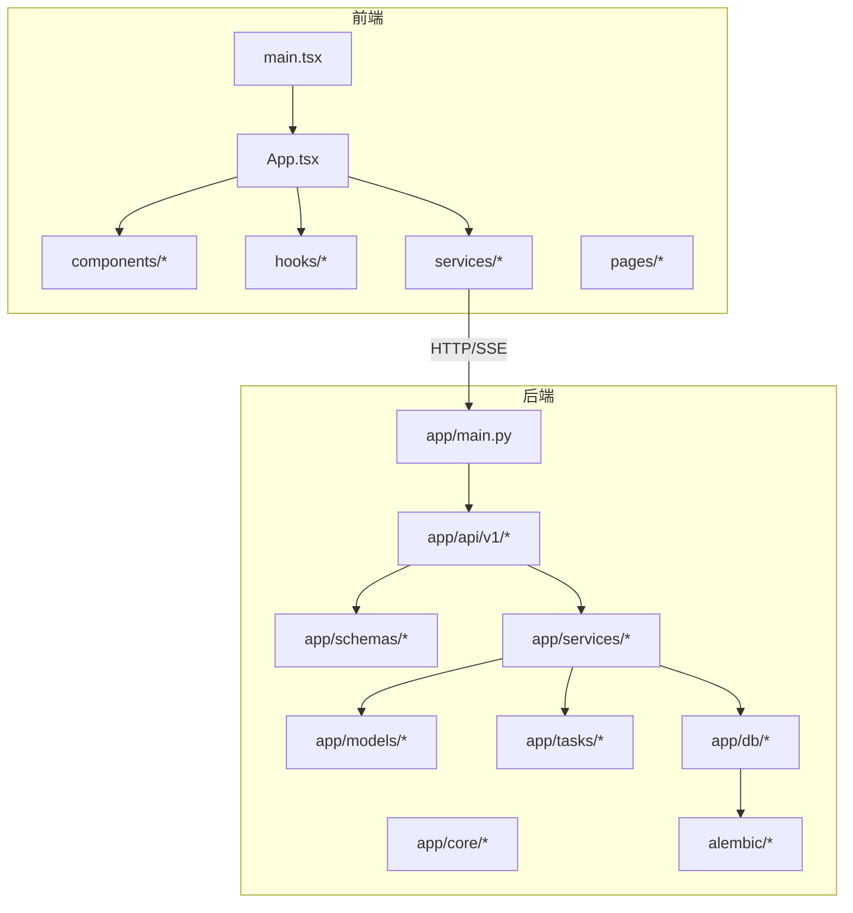
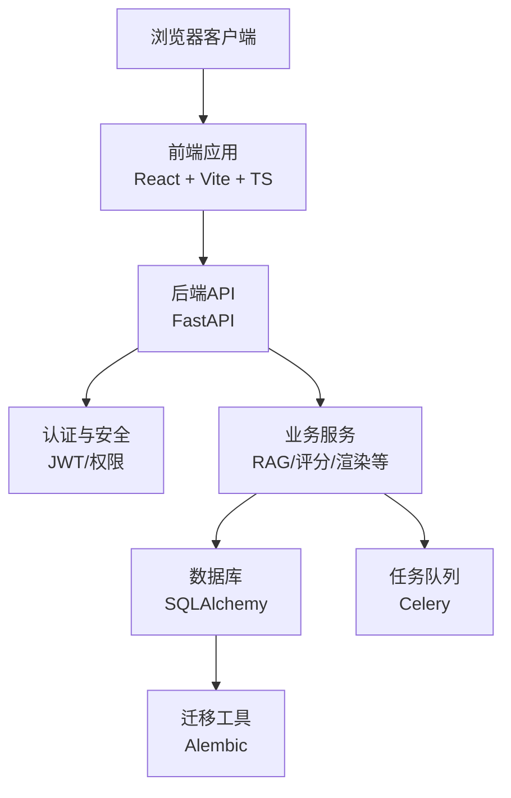
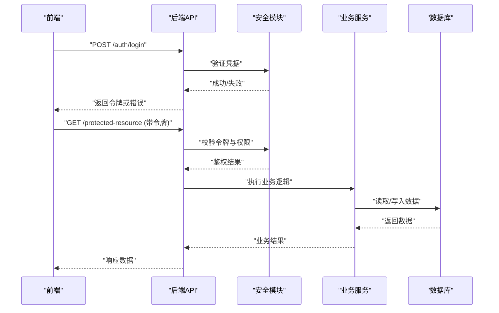
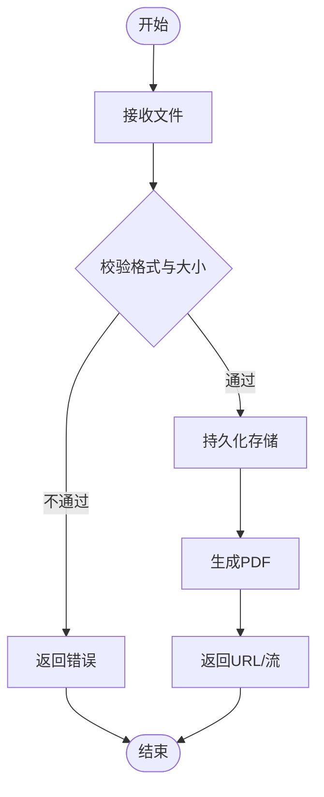
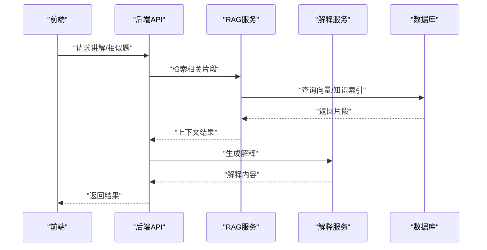
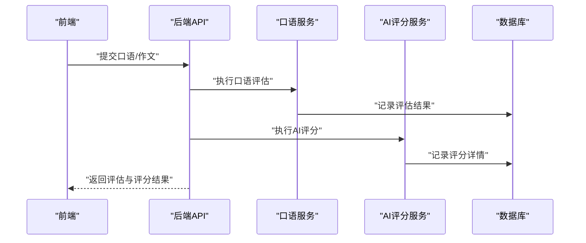
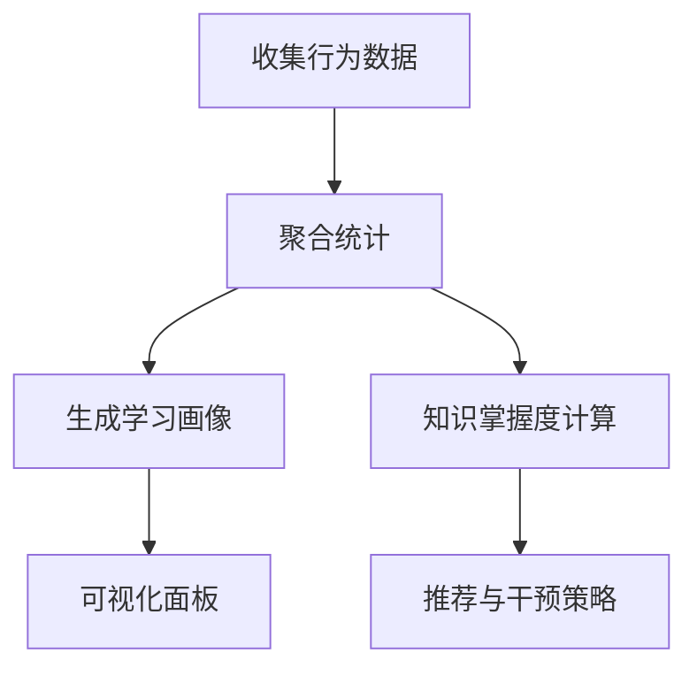
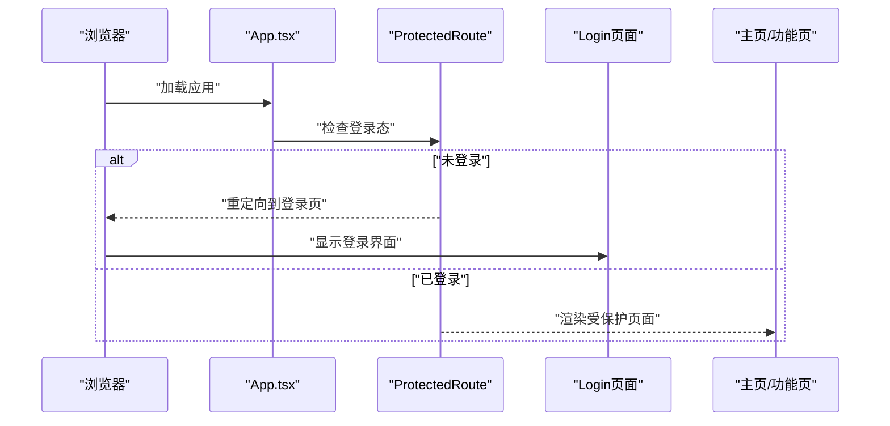
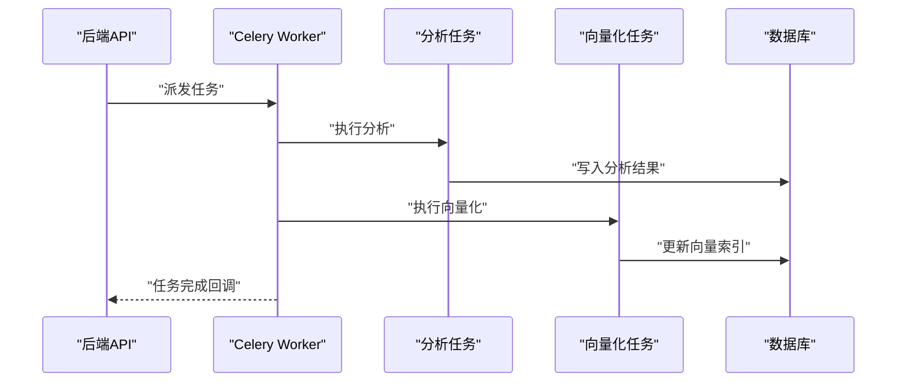
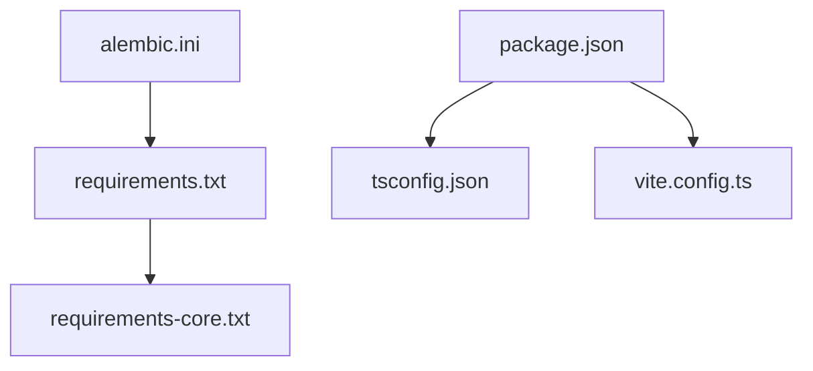

# 开发指南

<cite>
**本文引用的文件**   
- [backend/app/main.py](file://backend/app/main.py)
- [backend/app/core/config.py](file://backend/app/core/config.py)
- [backend/app/core/deps.py](file://backend/app/core/deps.py)
- [backend/app/core/security.py](file://backend/app/core/security.py)
- [backend/app/db/base.py](file://backend/app/db/base.py)
- [backend/app/db/session.py](file://backend/app/db/session.py)
- [backend/alembic.ini](file://backend/alembic.ini)
- [backend/alembic/env.py](file://backend/alembic/env.py)
- [backend/requirements.txt](file://backend/requirements.txt)
- [backend/requirements-core.txt](file://backend/requirements-core.txt)
- [backend/app/api/v1/auth.py](file://backend/app/api/v1/auth.py)
- [backend/app/api/v1/questions.py](file://backend/app/api/v1/questions.py)
- [backend/app/api/v1/compositions.py](file://backend/app/api/v1/compositions.py)
- [backend/app/api/v1/conversations.py](file://backend/app/api/v1/conversations.py)
- [backend/app/api/v1/analytics.py](file://backend/app/api/v1/analytics.py)
- [backend/app/models/user.py](file://backend/app/models/user.py)
- [backend/app/models/question.py](file://backend/app/models/question.py)
- [backend/app/models/composition.py](file://backend/app/models/composition.py)
- [backend/app/models/conversation.py](file://backend/app/models/conversation.py)
- [backend/app/schemas/user.py](file://backend/app/schemas/user.py)
- [backend/app/schemas/question.py](file://backend/app/schemas/question.py)
- [backend/app/schemas/composition.py](file://backend/app/schemas/composition.py)
- [backend/app/schemas/conversation.py](file://backend/app/schemas/conversation.py)
- [backend/app/services/file_upload.py](file://backend/app/services/file_upload.py)
- [backend/app/services/pdf_renderer.py](file://backend/app/services/pdf_renderer.py)
- [backend/app/services/rag_service.py](file://backend/app/services/rag_service.py)
- [backend/app/services/explain_service.py](file://backend/app/services/explain_service.py)
- [backend/app/services/oral_service.py](file://backend/app/services/oral_service.py)
- [backend/app/services/ai_grader.py](file://backend/app/services/ai_grader.py)
- [backend/app/services/knowledge_tracker.py](file://backend/app/services/knowledge_tracker.py)
- [backend/app/services/similar_generator.py](file://backend/app/services/similar_generator.py)
- [backend/app/services/analytics_aggregator.py](file://backend/app/services/analytics_aggregator.py)
- [backend/app/tasks/celery_app.py](file://backend/app/tasks/celery_app.py)
- [backend/app/tasks/analysis_tasks.py](file://backend/app/tasks/analysis_tasks.py)
- [backend/app/tasks/vector_tasks.py](file://backend/app/tasks/vector_tasks.py)
- [frontend/package.json](file://frontend/package.json)
- [frontend/tsconfig.json](file://frontend/tsconfig.json)
- [frontend/vite.config.ts](file://frontend/vite.config.ts)
- [frontend/src/main.tsx](file://frontend/src/main.tsx)
- [frontend/src/App.tsx](file://frontend/src/App.tsx)
- [frontend/src/components/Layout/AppLayout.tsx](file://frontend/src/components/Layout/AppLayout.tsx)
- [frontend/src/components/Layout/Header.tsx](file://frontend/src/components/Layout/Header.tsx)
- [frontend/src/components/ProtectedRoute.tsx](file://frontend/src/components/ProtectedRoute.tsx)
- [frontend/src/hooks/useAuth.tsx](file://frontend/src/hooks/useAuth.tsx)
- [frontend/src/hooks/useSSE.ts](file://frontend/src/hooks/useSSE.ts)
- [frontend/src/services/api.ts](file://frontend/src/services/api.ts)
- [frontend/src/services/authService.ts](file://frontend/src/services/authService.ts)
- [frontend/src/services/aiTutorService.ts](file://frontend/src/services/aiTutorService.ts)
- [frontend/src/pages/Login/index.tsx](file://frontend/src/pages/Login/index.tsx)
- [frontend/src/pages/Composition/index.tsx](file://frontend/src/pages/Composition/index.tsx)
- [frontend/src/pages/LearningAnalytics/index.tsx](file://frontend/src/pages/LearningAnalytics/index.tsx)
</cite>

## 目录
1. [简介](#简介)
2. [项目结构](#项目结构)
3. [核心组件](#核心组件)
4. [架构总览](#架构总览)
5. [详细组件分析](#详细组件分析)
6. [依赖分析](#依赖分析)
7. [性能考虑](#性能考虑)
8. [故障排除指南](#故障排除指南)
9. [结论](#结论)
10. [附录](#附录)

## 简介
本指南面向AI助教系统的开发者，覆盖从环境搭建、代码规范、Git与审查流程，到前后端开发约定、调试与性能分析、新功能开发流程、第三方库集成与插件扩展、以及常见问题排查。目标是帮助团队以一致的方式高效协作，保证系统质量与可维护性。

## 项目结构
仓库采用前后端分离的模块化组织方式：
- 后端（Python/FastAPI）：按领域分层，包含API路由、数据模型、Pydantic Schema、服务层、任务队列与迁移工具。
- 前端（React/Vite/TypeScript）：按功能域划分页面与组件，统一的服务层封装HTTP与SSE调用。



图表来源
- [frontend/src/main.tsx:1-50](file://frontend/src/main.tsx#L1-L50)
- [frontend/src/App.tsx:1-50](file://frontend/src/App.tsx#L1-L50)
- [backend/app/main.py:1-50](file://backend/app/main.py#L1-L50)
- [backend/app/api/v1/auth.py:1-50](file://backend/app/api/v1/auth.py#L1-L50)
- [backend/app/db/session.py:1-50](file://backend/app/db/session.py#L1-L50)
- [backend/alembic/env.py:1-50](file://backend/alembic/env.py#L1-L50)

章节来源
- [frontend/package.json:1-50](file://frontend/package.json#L1-L50)
- [frontend/tsconfig.json:1-50](file://frontend/tsconfig.json#L1-L50)
- [frontend/vite.config.ts:1-50](file://frontend/vite.config.ts#L1-L50)
- [backend/app/main.py:1-50](file://backend/app/main.py#L1-L50)
- [backend/requirements.txt:1-50](file://backend/requirements.txt#L1-L50)

## 核心组件
- 后端入口与配置
  - FastAPI应用初始化、中间件与路由挂载位于后端主模块。
  - 配置集中管理，环境变量驱动敏感信息与外部服务接入。
  - 安全模块提供鉴权与权限校验能力。
- 数据库与迁移
  - 基于SQLAlchemy的ORM模型定义与Session生命周期管理。
  - Alembic用于版本化迁移与环境初始化。
- API层
  - 按业务域拆分路由，输入输出使用Pydantic Schema进行校验与文档生成。
- 服务层
  - 聚合业务逻辑，协调模型、外部服务与任务队列。
- 任务队列
  - Celery应用与异步任务处理长耗时操作（如分析、向量化）。
- 前端应用
  - React+Vite构建，TypeScript类型约束，统一服务层封装HTTP与SSE。
  - 布局与受保护路由确保导航与鉴权一致性。

章节来源
- [backend/app/main.py:1-50](file://backend/app/main.py#L1-L50)
- [backend/app/core/config.py:1-50](file://backend/app/core/config.py#L1-L50)
- [backend/app/core/security.py:1-50](file://backend/app/core/security.py#L1-L50)
- [backend/app/db/base.py:1-50](file://backend/app/db/base.py#L1-L50)
- [backend/app/db/session.py:1-50](file://backend/app/db/session.py#L1-L50)
- [backend/alembic/env.py:1-50](file://backend/alembic/env.py#L1-L50)
- [backend/app/api/v1/auth.py:1-50](file://backend/app/api/v1/auth.py#L1-L50)
- [backend/app/api/v1/questions.py:1-50](file://backend/app/api/v1/questions.py#L1-L50)
- [backend/app/api/v1/compositions.py:1-50](file://backend/app/api/v1/compositions.py#L1-L50)
- [backend/app/api/v1/conversations.py:1-50](file://backend/app/api/v1/conversations.py#L1-L50)
- [backend/app/api/v1/analytics.py:1-50](file://backend/app/api/v1/analytics.py#L1-L50)
- [backend/app/services/file_upload.py:1-50](file://backend/app/services/file_upload.py#L1-L50)
- [backend/app/services/pdf_renderer.py:1-50](file://backend/app/services/pdf_renderer.py#L1-L50)
- [backend/app/services/rag_service.py:1-50](file://backend/app/services/rag_service.py#L1-L50)
- [backend/app/services/explain_service.py:1-50](file://backend/app/services/explain_service.py#L1-L50)
- [backend/app/services/oral_service.py:1-50](file://backend/app/services/oral_service.py#L1-L50)
- [backend/app/services/ai_grader.py:1-50](file://backend/app/services/ai_grader.py#L1-L50)
- [backend/app/services/knowledge_tracker.py:1-50](file://backend/app/services/knowledge_tracker.py#L1-L50)
- [backend/app/services/similar_generator.py:1-50](file://backend/app/services/similar_generator.py#L1-L50)
- [backend/app/services/analytics_aggregator.py:1-50](file://backend/app/services/analytics_aggregator.py#L1-L50)
- [backend/app/tasks/celery_app.py:1-50](file://backend/app/tasks/celery_app.py#L1-L50)
- [backend/app/tasks/analysis_tasks.py:1-50](file://backend/app/tasks/analysis_tasks.py#L1-L50)
- [backend/app/tasks/vector_tasks.py:1-50](file://backend/app/tasks/vector_tasks.py#L1-L50)
- [frontend/src/main.tsx:1-50](file://frontend/src/main.tsx#L1-L50)
- [frontend/src/App.tsx:1-50](file://frontend/src/App.tsx#L1-L50)
- [frontend/src/components/Layout/AppLayout.tsx:1-50](file://frontend/src/components/Layout/AppLayout.tsx#L1-L50)
- [frontend/src/components/Layout/Header.tsx:1-50](file://frontend/src/components/Layout/Header.tsx#L1-L50)
- [frontend/src/components/ProtectedRoute.tsx:1-50](file://frontend/src/components/ProtectedRoute.tsx#L1-L50)
- [frontend/src/hooks/useAuth.tsx:1-50](file://frontend/src/hooks/useAuth.tsx#L1-L50)
- [frontend/src/hooks/useSSE.ts:1-50](file://frontend/src/hooks/useSSE.ts#L1-L50)
- [frontend/src/services/api.ts:1-50](file://frontend/src/services/api.ts#L1-L50)
- [frontend/src/services/authService.ts:1-50](file://frontend/src/services/authService.ts#L1-L50)
- [frontend/src/services/aiTutorService.ts:1-50](file://frontend/src/services/aiTutorService.ts#L1-L50)

## 架构总览
系统采用前后端分离架构，前端通过REST与SSE与后端交互；后端基于FastAPI暴露API，使用SQLAlchemy访问数据库，Celery执行异步任务，Alembic管理数据库迁移。



图表来源
- [backend/app/main.py:1-50](file://backend/app/main.py#L1-L50)
- [backend/app/core/security.py:1-50](file://backend/app/core/security.py#L1-L50)
- [backend/app/db/session.py:1-50](file://backend/app/db/session.py#L1-L50)
- [backend/app/tasks/celery_app.py:1-50](file://backend/app/tasks/celery_app.py#L1-L50)
- [backend/alembic/env.py:1-50](file://backend/alembic/env.py#L1-L50)
- [frontend/src/services/api.ts:1-50](file://frontend/src/services/api.ts#L1-L50)
- [frontend/src/hooks/useSSE.ts:1-50](file://frontend/src/hooks/useSSE.ts#L1-L50)

## 详细组件分析

### 后端API与鉴权流程
- 登录与令牌签发：前端调用认证接口，后端验证凭据并返回令牌；后续请求携带令牌进行鉴权。
- 受保护资源访问：路由依赖注入鉴权上下文，校验用户身份与权限后执行业务逻辑。



图表来源
- [backend/app/api/v1/auth.py:1-50](file://backend/app/api/v1/auth.py#L1-L50)
- [backend/app/core/security.py:1-50](file://backend/app/core/security.py#L1-L50)
- [backend/app/api/v1/questions.py:1-50](file://backend/app/api/v1/questions.py#L1-L50)
- [backend/app/api/v1/compositions.py:1-50](file://backend/app/api/v1/compositions.py#L1-L50)
- [backend/app/api/v1/conversations.py:1-50](file://backend/app/api/v1/conversations.py#L1-L50)
- [backend/app/api/v1/analytics.py:1-50](file://backend/app/api/v1/analytics.py#L1-L50)

章节来源
- [backend/app/api/v1/auth.py:1-50](file://backend/app/api/v1/auth.py#L1-L50)
- [backend/app/core/security.py:1-50](file://backend/app/core/security.py#L1-L50)
- [backend/app/api/v1/questions.py:1-50](file://backend/app/api/v1/questions.py#L1-L50)
- [backend/app/api/v1/compositions.py:1-50](file://backend/app/api/v1/compositions.py#L1-L50)
- [backend/app/api/v1/conversations.py:1-50](file://backend/app/api/v1/conversations.py#L1-L50)
- [backend/app/api/v1/analytics.py:1-50](file://backend/app/api/v1/analytics.py#L1-L50)

### 数据模型与Schema关系
- 模型定义：用户、题目、作文、对话等实体在models中声明字段与关系。
- Schema校验：schemas中定义请求/响应结构，确保API契约稳定。

```mermaid
classDiagram
class User {
+id
+username
+email
+created_at
+updated_at
}
class Question {
+id
+title
+content
+author_id
+created_at
}
class Composition {
+id
+user_id
+content
+status
+created_at
}
class Conversation {
+id
+user_id
+messages
+created_at
}
User ||--o{ Question : "拥有"
User ||--o{ Composition : "提交"
User ||--o{ Conversation : "发起"
```

图表来源
- [backend/app/models/user.py:1-50](file://backend/app/models/user.py#L1-L50)
- [backend/app/models/question.py:1-50](file://backend/app/models/question.py#L1-L50)
- [backend/app/models/composition.py:1-50](file://backend/app/models/composition.py#L1-L50)
- [backend/app/models/conversation.py:1-50](file://backend/app/models/conversation.py#L1-L50)
- [backend/app/schemas/user.py:1-50](file://backend/app/schemas/user.py#L1-L50)
- [backend/app/schemas/question.py:1-50](file://backend/app/schemas/question.py#L1-L50)
- [backend/app/schemas/composition.py:1-50](file://backend/app/schemas/composition.py#L1-L50)
- [backend/app/schemas/conversation.py:1-50](file://backend/app/schemas/conversation.py#L1-L50)

章节来源
- [backend/app/models/user.py:1-50](file://backend/app/models/user.py#L1-L50)
- [backend/app/models/question.py:1-50](file://backend/app/models/question.py#L1-L50)
- [backend/app/models/composition.py:1-50](file://backend/app/models/composition.py#L1-L50)
- [backend/app/models/conversation.py:1-50](file://backend/app/models/conversation.py#L1-L50)
- [backend/app/schemas/user.py:1-50](file://backend/app/schemas/user.py#L1-L50)
- [backend/app/schemas/question.py:1-50](file://backend/app/schemas/question.py#L1-L50)
- [backend/app/schemas/composition.py:1-50](file://backend/app/schemas/composition.py#L1-L50)
- [backend/app/schemas/conversation.py:1-50](file://backend/app/schemas/conversation.py#L1-L50)

### 文件上传与PDF渲染流程
- 上传：前端将文件发送至后端，服务层保存并解析元信息。
- 渲染：根据内容生成PDF，供下载或预览。



图表来源
- [backend/app/services/file_upload.py:1-50](file://backend/app/services/file_upload.py#L1-L50)
- [backend/app/services/pdf_renderer.py:1-50](file://backend/app/services/pdf_renderer.py#L1-L50)

章节来源
- [backend/app/services/file_upload.py:1-50](file://backend/app/services/file_upload.py#L1-L50)
- [backend/app/services/pdf_renderer.py:1-50](file://backend/app/services/pdf_renderer.py#L1-L50)

### RAG检索与解释服务
- RAG：结合向量检索与知识库，为问答与讲解提供上下文。
- 解释：对答案或知识点进行结构化解释，提升学习体验。



图表来源
- [backend/app/services/rag_service.py:1-50](file://backend/app/services/rag_service.py#L1-L50)
- [backend/app/services/explain_service.py:1-50](file://backend/app/services/explain_service.py#L1-L50)

章节来源
- [backend/app/services/rag_service.py:1-50](file://backend/app/services/rag_service.py#L1-L50)
- [backend/app/services/explain_service.py:1-50](file://backend/app/services/explain_service.py#L1-L50)

### 口语评估与AI评分
- 口语评估：采集音频或文本，调用评估服务进行分析。
- AI评分：对作文或答案进行自动评分与反馈。



图表来源
- [backend/app/services/oral_service.py:1-50](file://backend/app/services/oral_service.py#L1-L50)
- [backend/app/services/ai_grader.py:1-50](file://backend/app/services/ai_grader.py#L1-L50)

章节来源
- [backend/app/services/oral_service.py:1-50](file://backend/app/services/oral_service.py#L1-L50)
- [backend/app/services/ai_grader.py:1-50](file://backend/app/services/ai_grader.py#L1-L50)

### 学习分析与知识追踪
- 分析聚合：汇总作业、错题、练习数据，生成学习画像。
- 知识追踪：跟踪知识点掌握度，支持个性化推荐。



图表来源
- [backend/app/services/analytics_aggregator.py:1-50](file://backend/app/services/analytics_aggregator.py#L1-L50)
- [backend/app/services/knowledge_tracker.py:1-50](file://backend/app/services/knowledge_tracker.py#L1-L50)
- [backend/app/api/v1/analytics.py:1-50](file://backend/app/api/v1/analytics.py#L1-L50)

章节来源
- [backend/app/services/analytics_aggregator.py:1-50](file://backend/app/services/analytics_aggregator.py#L1-L50)
- [backend/app/services/knowledge_tracker.py:1-50](file://backend/app/services/knowledge_tracker.py#L1-L50)
- [backend/app/api/v1/analytics.py:1-50](file://backend/app/api/v1/analytics.py#L1-L50)

### 前端路由与受保护页面
- 根入口与全局状态：应用启动、主题与路由初始化。
- 受保护路由：未登录时重定向至登录页，登录后进入目标页面。
- 布局与头部：统一导航与用户信息展示。



图表来源
- [frontend/src/App.tsx:1-50](file://frontend/src/App.tsx#L1-L50)
- [frontend/src/components/ProtectedRoute.tsx:1-50](file://frontend/src/components/ProtectedRoute.tsx#L1-L50)
- [frontend/src/pages/Login/index.tsx:1-50](file://frontend/src/pages/Login/index.tsx#L1-L50)
- [frontend/src/components/Layout/AppLayout.tsx:1-50](file://frontend/src/components/Layout/AppLayout.tsx#L1-L50)
- [frontend/src/components/Layout/Header.tsx:1-50](file://frontend/src/components/Layout/Header.tsx#L1-L50)

章节来源
- [frontend/src/App.tsx:1-50](file://frontend/src/App.tsx#L1-L50)
- [frontend/src/components/ProtectedRoute.tsx:1-50](file://frontend/src/components/ProtectedRoute.tsx#L1-L50)
- [frontend/src/pages/Login/index.tsx:1-50](file://frontend/src/pages/Login/index.tsx#L1-L50)
- [frontend/src/components/Layout/AppLayout.tsx:1-50](file://frontend/src/components/Layout/AppLayout.tsx#L1-L50)
- [frontend/src/components/Layout/Header.tsx:1-50](file://frontend/src/components/Layout/Header.tsx#L1-L50)

### 异步任务与向量化
- 任务队列：Celery应用注册任务，消费队列消息。
- 分析任务：离线分析作业与错题，生成报告。
- 向量化任务：对文本或内容进行嵌入，更新检索索引。



图表来源
- [backend/app/tasks/celery_app.py:1-50](file://backend/app/tasks/celery_app.py#L1-L50)
- [backend/app/tasks/analysis_tasks.py:1-50](file://backend/app/tasks/analysis_tasks.py#L1-L50)
- [backend/app/tasks/vector_tasks.py:1-50](file://backend/app/tasks/vector_tasks.py#L1-L50)

章节来源
- [backend/app/tasks/celery_app.py:1-50](file://backend/app/tasks/celery_app.py#L1-L50)
- [backend/app/tasks/analysis_tasks.py:1-50](file://backend/app/tasks/analysis_tasks.py#L1-L50)
- [backend/app/tasks/vector_tasks.py:1-50](file://backend/app/tasks/vector_tasks.py#L1-L50)

## 依赖分析
- 后端依赖
  - 运行期依赖与核心依赖分别维护，便于最小化镜像与按需安装。
  - Alembic配置文件与迁移脚本集中管理。
- 前端依赖
  - package.json定义构建、开发与生产依赖。
  - tsconfig与vite配置控制编译与打包行为。



图表来源
- [backend/requirements.txt:1-50](file://backend/requirements.txt#L1-L50)
- [backend/requirements-core.txt:1-50](file://backend/requirements-core.txt#L1-L50)
- [backend/alembic.ini:1-50](file://backend/alembic.ini#L1-L50)
- [frontend/package.json:1-50](file://frontend/package.json#L1-L50)
- [frontend/tsconfig.json:1-50](file://frontend/tsconfig.json#L1-L50)
- [frontend/vite.config.ts:1-50](file://frontend/vite.config.ts#L1-L50)

章节来源
- [backend/requirements.txt:1-50](file://backend/requirements.txt#L1-L50)
- [backend/requirements-core.txt:1-50](file://backend/requirements-core.txt#L1-L50)
- [backend/alembic.ini:1-50](file://backend/alembic.ini#L1-L50)
- [frontend/package.json:1-50](file://frontend/package.json#L1-L50)
- [frontend/tsconfig.json:1-50](file://frontend/tsconfig.json#L1-L50)
- [frontend/vite.config.ts:1-50](file://frontend/vite.config.ts#L1-L50)

## 性能考虑
- 后端
  - 数据库连接池与会话复用，避免频繁创建销毁。
  - 热点查询增加缓存层（如Redis），降低数据库压力。
  - 大对象处理（PDF、图片）采用流式传输与分块上传。
  - 异步任务削峰填谷，合理设置并发与重试策略。
- 前端
  - 组件懒加载与路由级代码分割，减少首屏体积。
  - SSE长连接需做断线重连与心跳保活。
  - 列表与表格虚拟化渲染，优化大数据量展示。
  - 静态资源CDN与缓存策略，提升加载速度。

[本节为通用指导，无需特定文件引用]

## 故障排除指南
- 后端
  - 启动失败：检查端口占用、数据库连接、环境变量配置。
  - 鉴权异常：确认令牌有效期、签名算法与密钥一致性。
  - 任务堆积：查看Celery日志与队列长度，调整worker数量。
  - 迁移冲突：对比本地与远程版本，必要时手动合并。
- 前端
  - 跨域问题：确认CORS配置与代理规则。
  - SSE无法连接：检查服务端事件流与网络代理。
  - 构建报错：核对TypeScript与Vite配置兼容性。
- 日志与监控
  - 统一日志格式与级别，关键路径添加traceId。
  - 指标埋点：QPS、延迟、错误率、任务成功率。

章节来源
- [backend/app/core/config.py:1-50](file://backend/app/core/config.py#L1-L50)
- [backend/app/core/security.py:1-50](file://backend/app/core/security.py#L1-L50)
- [backend/app/tasks/celery_app.py:1-50](file://backend/app/tasks/celery_app.py#L1-L50)
- [backend/alembic/env.py:1-50](file://backend/alembic/env.py#L1-L50)
- [frontend/src/hooks/useSSE.ts:1-50](file://frontend/src/hooks/useSSE.ts#L1-L50)
- [frontend/vite.config.ts:1-50](file://frontend/vite.config.ts#L1-L50)

## 结论
本指南提供了AI助教系统的整体开发框架与实践建议。遵循统一的规范与流程，有助于提升团队协作效率与系统稳定性。建议在迭代过程中持续完善文档与自动化测试，保障交付质量。

[本节为总结性内容，无需特定文件引用]

## 附录

### 开发环境搭建
- 后端
  - 安装Python与虚拟环境，依据requirements安装依赖。
  - 配置数据库连接与Alembic迁移，执行初始化。
  - 启动FastAPI服务，访问API文档进行验证。
- 前端
  - 安装Node.js与包管理器，安装依赖。
  - 配置Vite代理与环境变量，启动开发服务器。
  - 使用TypeScript编译器与ESLint/Prettier进行代码检查与格式化。

章节来源
- [backend/requirements.txt:1-50](file://backend/requirements.txt#L1-L50)
- [backend/alembic.ini:1-50](file://backend/alembic.ini#L1-L50)
- [backend/alembic/env.py:1-50](file://backend/alembic/env.py#L1-L50)
- [frontend/package.json:1-50](file://frontend/package.json#L1-L50)
- [frontend/tsconfig.json:1-50](file://frontend/tsconfig.json#L1-L50)
- [frontend/vite.config.ts:1-50](file://frontend/vite.config.ts#L1-L50)

### 代码规范
- 前端
  - TypeScript：严格模式开启，统一类型定义与泛型使用。
  - React组件：函数组件优先，Hooks组合清晰，避免深层嵌套。
  - ESLint与Prettier：统一规则与格式化，CI中强制检查。
- 后端
  - Python风格：遵循PEP8，使用类型注解与文档字符串。
  - API设计：RESTful命名，统一错误码与分页参数。
  - 数据库操作：使用ORM事务与批量操作，避免N+1查询。
  - 单元测试：覆盖核心逻辑与边界条件，使用pytest与mock。

章节来源
- [frontend/tsconfig.json:1-50](file://frontend/tsconfig.json#L1-L50)
- [frontend/package.json:1-50](file://frontend/package.json#L1-L50)
- [backend/app/api/v1/auth.py:1-50](file://backend/app/api/v1/auth.py#L1-L50)
- [backend/app/api/v1/questions.py:1-50](file://backend/app/api/v1/questions.py#L1-L50)
- [backend/app/db/session.py:1-50](file://backend/app/db/session.py#L1-L50)

### Git工作流与代码审查
- 分支策略：主干稳定，功能分支独立，合并前通过CI检查。
- 提交规范：语义化提交信息，关联需求或问题编号。
- 代码审查：至少一人审查，关注可读性、安全性与性能。
- 发布流程：标签化版本，变更日志与回滚预案。

[本节为通用流程说明，无需特定文件引用]

### 调试技巧与日志分析
- 后端
  - 启用详细日志与请求追踪，定位慢查询与异常堆栈。
  - 使用调试器附加进程，逐步排查复杂逻辑。
- 前端
  - 浏览器开发者工具网络面板与性能面板分析。
  - 控制台日志与错误上报，结合traceId串联前后端日志。

章节来源
- [backend/app/core/config.py:1-50](file://backend/app/core/config.py#L1-L50)
- [frontend/src/services/api.ts:1-50](file://frontend/src/services/api.ts#L1-L50)

### 性能分析方法
- 后端
  - 压测工具模拟高并发，观察CPU、内存与I/O瓶颈。
  - 数据库慢查询分析与索引优化。
- 前端
  - 首屏时间、包体大小与资源加载瀑布图分析。
  - 用户交互路径的性能采样与优化。

[本节为通用方法说明，无需特定文件引用]

### 新功能开发流程
- 需求分析：明确目标用户与价值，梳理用例与约束。
- 设计文档：输出架构图、接口契约与数据模型变更。
- 代码实现：遵循规范，编写单测与集成测试。
- 测试验证：本地与CI环境验证，回归测试通过。
- 文档更新：API文档、用户手册与运维手册同步更新。

[本节为通用流程说明，无需特定文件引用]

### 第三方库集成指南
- 后端
  - 新增依赖纳入requirements，评估许可证与安全风险。
  - 配置外部服务（向量库、对象存储、消息队列）的环境变量。
- 前端
  - 引入UI库与工具库，统一版本管理与按需加载。
  - 注意跨域与CORS配置，确保生产环境可用。

章节来源
- [backend/requirements.txt:1-50](file://backend/requirements.txt#L1-L50)
- [backend/app/core/config.py:1-50](file://backend/app/core/config.py#L1-L50)
- [frontend/package.json:1-50](file://frontend/package.json#L1-L50)

### 插件开发与扩展点
- 后端
  - 服务层抽象接口，允许替换实现（如不同评分引擎）。
  - 任务队列可扩展新任务类型，保持解耦。
- 前端
  - 组件插槽与主题定制，支持动态加载模块。
  - 路由与菜单配置化，便于扩展功能入口。

章节来源
- [backend/app/services/ai_grader.py:1-50](file://backend/app/services/ai_grader.py#L1-L50)
- [backend/app/tasks/celery_app.py:1-50](file://backend/app/tasks/celery_app.py#L1-L50)
- [frontend/src/App.tsx:1-50](file://frontend/src/App.tsx#L1-L50)

### 常见问题解答
- 为什么登录成功后仍被重定向？
  - 检查令牌存储与过期时间，确认受保护路由的鉴权逻辑。
- 为什么SSE无法收到事件？
  - 检查服务端事件流是否持续输出，网络代理是否阻断长连接。
- 为什么迁移失败？
  - 对比当前版本与目标版本，必要时手动编辑迁移脚本。

章节来源
- [frontend/src/components/ProtectedRoute.tsx:1-50](file://frontend/src/components/ProtectedRoute.tsx#L1-L50)
- [frontend/src/hooks/useSSE.ts:1-50](file://frontend/src/hooks/useSSE.ts#L1-L50)
- [backend/alembic/env.py:1-50](file://backend/alembic/env.py#L1-L50)