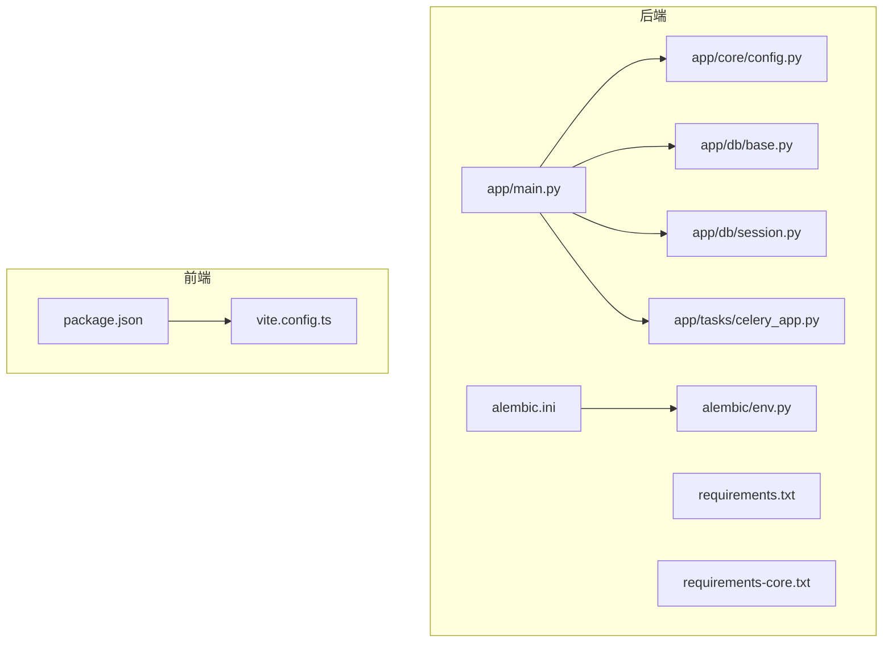
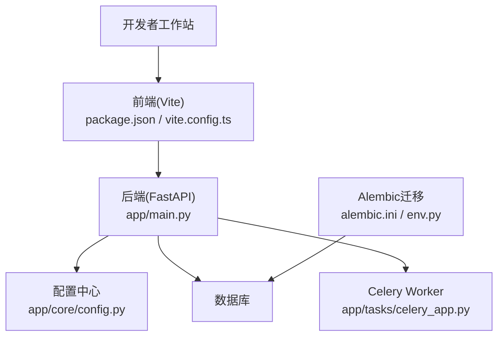
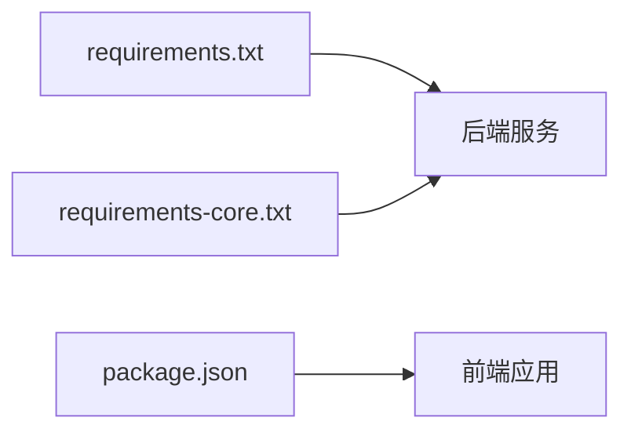

# 开发环境配置

<cite>
**本文引用的文件**   
- [backend/requirements.txt](file://backend/requirements.txt)
- [backend/requirements-core.txt](file://backend/requirements-core.txt)
- [backend/app/core/config.py](file://backend/app/core/config.py)
- [backend/app/db/base.py](file://backend/app/db/base.py)
- [backend/app/db/session.py](file://backend/app/db/session.py)
- [backend/alembic.ini](file://backend/alembic.ini)
- [backend/alembic/env.py](file://backend/alembic/env.py)
- [backend/app/tasks/celery_app.py](file://backend/app/tasks/celery_app.py)
- [backend/app/main.py](file://backend/app/main.py)
- [frontend/package.json](file://frontend/package.json)
- [frontend/vite.config.ts](file://frontend/vite.config.ts)
- [start_dev.bat](file://start_dev.bat)
</cite>

## 目录
1. [简介](#简介)
2. [项目结构](#项目结构)
3. [核心组件](#核心组件)
4. [架构总览](#架构总览)
5. [详细组件分析](#详细组件分析)
6. [依赖分析](#依赖分析)
7. [性能考虑](#性能考虑)
8. [故障排除指南](#故障排除指南)
9. [结论](#结论)
10. [附录](#附录) 

## 简介
本指南面向AI助教系统的开发者，提供从零搭建前后端开发环境的完整步骤。内容涵盖：
- Python与Node.js环境准备
- 数据库安装与初始化（含迁移）
- 后端依赖管理（pip + requirements.txt）
- 前端依赖管理（npm + package.json）
- 环境变量与配置文件管理
- IDE推荐与调试、热重载设置
- 常见问题与排错方法

## 项目结构
仓库采用前后端分离的目录组织方式：
- backend：FastAPI后端服务、Alembic数据迁移、Celery任务等
- frontend：Vite + React + TypeScript前端应用
- start_dev.bat：Windows一键启动脚本（用于本地联调）

图表来源
- [backend/app/main.py](file://backend/app/main.py)
- [backend/app/core/config.py](file://backend/app/core/config.py)
- [backend/app/db/base.py](file://backend/app/db/base.py)
- [backend/app/db/session.py](file://backend/app/db/session.py)
- [backend/alembic.ini](file://backend/alembic.ini)
- [backend/alembic/env.py](file://backend/alembic/env.py)
- [backend/app/tasks/celery_app.py](file://backend/app/tasks/celery_app.py)
- [backend/requirements.txt](file://backend/requirements.txt)
- [backend/requirements-core.txt](file://backend/requirements-core.txt)
- [frontend/package.json](file://frontend/package.json)
- [frontend/vite.config.ts](file://frontend/vite.config.ts)

章节来源
- [backend/requirements.txt](file://backend/requirements.txt)
- [backend/requirements-core.txt](file://backend/requirements-core.txt)
- [backend/app/core/config.py](file://backend/app/core/config.py)
- [backend/app/db/base.py](file://backend/app/db/base.py)
- [backend/app/db/session.py](file://backend/app/db/session.py)
- [backend/alembic.ini](file://backend/alembic.ini)
- [backend/alembic/env.py](file://backend/alembic/env.py)
- [backend/app/tasks/celery_app.py](file://backend/app/tasks/celery_app.py)
- [backend/app/main.py](file://backend/app/main.py)
- [frontend/package.json](file://frontend/package.json)
- [frontend/vite.config.ts](file://frontend/vite.config.ts)

## 核心组件
- 后端服务入口与配置
  - 服务主入口位于后端应用模块中，负责注册路由、中间件、生命周期钩子等。
  - 配置中心集中读取环境变量与默认值，供各模块使用。
- 数据库与迁移
  - 数据库连接与会话管理由独立模块维护，统一暴露会话工厂。
  - Alembic用于版本化数据库变更，通过配置文件与环境变量控制连接信息。
- 异步任务
  - Celery应用定义在任务模块中，用于执行耗时或后台处理逻辑。
- 前端构建与代理
  - Vite作为开发与构建工具，package.json声明依赖与脚本命令，vite.config.ts可配置代理以联调后端。

章节来源
- [backend/app/main.py](file://backend/app/main.py)
- [backend/app/core/config.py](file://backend/app/core/config.py)
- [backend/app/db/base.py](file://backend/app/db/base.py)
- [backend/app/db/session.py](file://backend/app/db/session.py)
- [backend/alembic.ini](file://backend/alembic.ini)
- [backend/alembic/env.py](file://backend/alembic/env.py)
- [backend/app/tasks/celery_app.py](file://backend/app/tasks/celery_app.py)
- [frontend/package.json](file://frontend/package.json)
- [frontend/vite.config.ts](file://frontend/vite.config.ts)

## 架构总览
下图展示了开发环境下主要组件的交互关系：前端通过Vite启动并代理到后端；后端基于FastAPI提供服务，使用SQLAlchemy与Alembic进行数据访问与迁移；Celery用于后台任务。

图表来源
- [frontend/package.json](file://frontend/package.json)
- [frontend/vite.config.ts](file://frontend/vite.config.ts)
- [backend/app/main.py](file://backend/app/main.py)
- [backend/app/core/config.py](file://backend/app/core/config.py)
- [backend/alembic.ini](file://backend/alembic.ini)
- [backend/alembic/env.py](file://backend/alembic/env.py)
- [backend/app/tasks/celery_app.py](file://backend/app/tasks/celery_app.py)

## 详细组件分析

### 后端环境搭建（Python + FastAPI + Alembic + Celery）
- 环境要求
  - Python 3.x（建议使用与requirements一致的最小版本）
  - 虚拟环境（venv或conda均可）
- 依赖安装
  - 使用pip安装后端依赖，参考requirements.txt与requirements-core.txt。
- 数据库与迁移
  - 配置数据库连接字符串（建议通过环境变量注入）。
  - 使用Alembic进行初始化与迁移，配置文件为alembic.ini，运行时加载env.py。
- 启动服务
  - 通过后端主入口运行服务进程。
- 后台任务
  - 启动Celery worker，确保消息队列可用（如Redis/RabbitMQ，按实际配置）。

章节来源
- [backend/requirements.txt](file://backend/requirements.txt)
- [backend/requirements-core.txt](file://backend/requirements-core.txt)
- [backend/app/core/config.py](file://backend/app/core/config.py)
- [backend/app/db/base.py](file://backend/app/db/base.py)
- [backend/app/db/session.py](file://backend/app/db/session.py)
- [backend/alembic.ini](file://backend/alembic.ini)
- [backend/alembic/env.py](file://backend/alembic/env.py)
- [backend/app/tasks/celery_app.py](file://backend/app/tasks/celery_app.py)
- [backend/app/main.py](file://backend/app/main.py)

### 前端环境搭建（Node.js + Vite + React + TypeScript）
- 环境要求
  - Node.js LTS版本（与package.json引擎约束保持一致）
- 依赖安装
  - 使用npm安装依赖，参考package.json中的依赖与脚本命令。
- 开发服务器与代理
  - 通过Vite启动开发服务器，可在vite.config.ts中配置代理以转发至后端接口。
- 构建与打包
  - 使用npm脚本执行构建流程。

章节来源
- [frontend/package.json](file://frontend/package.json)
- [frontend/vite.config.ts](file://frontend/vite.config.ts)

### 环境变量与配置文件管理
- 后端配置
  - 配置中心模块负责读取环境变量并提供默认值，避免硬编码敏感信息。
  - Alembic通过配置文件与环境变量获取数据库连接信息。
- 前端配置
  - 通过Vite配置项与构建时变量管理不同环境的API地址等。

章节来源
- [backend/app/core/config.py](file://backend/app/core/config.py)
- [backend/alembic.ini](file://backend/alembic.ini)
- [backend/alembic/env.py](file://backend/alembic/env.py)
- [frontend/vite.config.ts](file://frontend/vite.config.ts)

### 数据库安装与初始化
- 选择并安装数据库（例如PostgreSQL/MySQL等，依据实际配置）。
- 创建数据库与用户，授予必要权限。
- 配置数据库连接字符串（建议通过环境变量注入）。
- 执行Alembic初始化与迁移，生成初始表结构。

章节来源
- [backend/app/db/base.py](file://backend/app/db/base.py)
- [backend/app/db/session.py](file://backend/app/db/session.py)
- [backend/alembic.ini](file://backend/alembic.ini)
- [backend/alembic/env.py](file://backend/alembic/env.py)

### 开发工具链与IDE设置
- VS Code扩展推荐
  - Python、Pylance、Ruff/Flake8、Black格式化、isort导入排序
  - ESLint、Prettier、TypeScript TSPlugin
  - REST Client或Thunder Client（用于接口调试）
- 调试器配置
  - 后端：使用VS Code Python调试器，设置工作目录与启动参数指向后端主入口。
  - 前端：使用Chrome/Edge调试器或VS Code Chrome Debugger，配合Vite开发服务器。
- 热重载
  - 后端：使用uvicorn或FastAPI内置热重载选项（--reload）。
  - 前端：Vite默认支持热更新，无需额外配置。

章节来源
- [backend/app/main.py](file://backend/app/main.py)
- [frontend/vite.config.ts](file://frontend/vite.config.ts)

### Windows一键启动
- 使用仓库根目录的批处理脚本快速启动开发环境（包含前后端相关命令）。
- 建议在已正确配置环境与依赖后执行该脚本进行联调。

章节来源
- [start_dev.bat](file://start_dev.bat)

## 依赖分析
- 后端依赖
  - requirements.txt：列出生产与开发所需的全部Python包。
  - requirements-core.txt：可能包含核心基础依赖，便于分层安装或最小化镜像。
- 前端依赖
  - package.json：声明JavaScript/TypeScript依赖与npm脚本命令。

图表来源
- [backend/requirements.txt](file://backend/requirements.txt)
- [backend/requirements-core.txt](file://backend/requirements-core.txt)
- [frontend/package.json](file://frontend/package.json)

章节来源
- [backend/requirements.txt](file://backend/requirements.txt)
- [backend/requirements-core.txt](file://backend/requirements-core.txt)
- [frontend/package.json](file://frontend/package.json)

## 性能考虑
- 数据库连接池
  - 合理配置连接池大小与超时，避免连接耗尽。
- 缓存策略
  - 对热点查询结果进行缓存，降低数据库压力。
- 异步任务
  - 将耗时操作放入Celery后台任务，提升接口响应速度。
- 前端资源优化
  - 启用代码分割与懒加载，减少首屏体积。
- 日志与监控
  - 结构化日志输出，结合指标采集定位瓶颈。

[本节为通用指导，不直接分析具体文件]

## 故障排除指南
- 无法解析环境变量
  - 检查配置中心模块是否正确读取环境变量，确认环境变量名与默认值。
- 数据库连接失败
  - 校验数据库连接字符串、用户名密码、端口与网络连通性。
  - 确认Alembic配置文件与环境变量是否一致。
- 迁移失败
  - 查看迁移历史与当前版本，必要时回滚或修复迁移脚本。
- 后端启动异常
  - 检查依赖是否安装完整，端口占用情况，以及主入口配置。
- 前端代理无效
  - 核对vite.config.ts中的代理规则与后端实际路径。
- Celery任务未执行
  - 确认消息队列服务状态、Worker进程是否启动、任务队列名称是否匹配。

章节来源
- [backend/app/core/config.py](file://backend/app/core/config.py)
- [backend/alembic.ini](file://backend/alembic.ini)
- [backend/alembic/env.py](file://backend/alembic/env.py)
- [backend/app/main.py](file://backend/app/main.py)
- [frontend/vite.config.ts](file://frontend/vite.config.ts)
- [backend/app/tasks/celery_app.py](file://backend/app/tasks/celery_app.py)

## 结论
按照本指南完成Python与Node.js环境、数据库与迁移、依赖管理与环境变量配置后，即可顺利启动前后端并进行联调。建议结合IDE调试与热重载提升开发效率，并通过日志与监控保障问题快速定位。

## 附录
- 常用命令速查
  - 后端依赖安装：使用pip安装requirements.txt与requirements-core.txt
  - 数据库迁移：使用Alembic进行初始化与升级
  - 启动后端服务：运行后端主入口
  - 启动Celery Worker：根据celery_app配置启动
  - 前端依赖安装：使用npm安装package.json依赖
  - 启动前端开发服务器：使用Vite命令
  - Windows一键启动：执行start_dev.bat

章节来源
- [backend/requirements.txt](file://backend/requirements.txt)
- [backend/requirements-core.txt](file://backend/requirements-core.txt)
- [backend/alembic.ini](file://backend/alembic.ini)
- [backend/alembic/env.py](file://backend/alembic/env.py)
- [backend/app/main.py](file://backend/app/main.py)
- [backend/app/tasks/celery_app.py](file://backend/app/tasks/celery_app.py)
- [frontend/package.json](file://frontend/package.json)
- [frontend/vite.config.ts](file://frontend/vite.config.ts)
- [start_dev.bat](file://start_dev.bat)