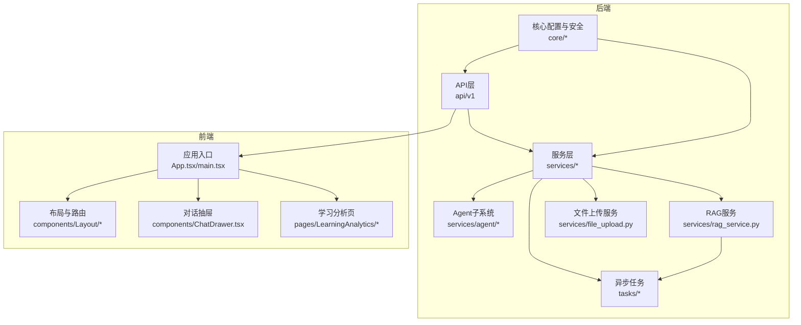
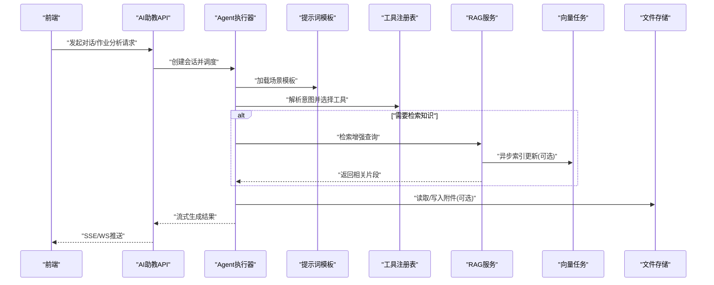
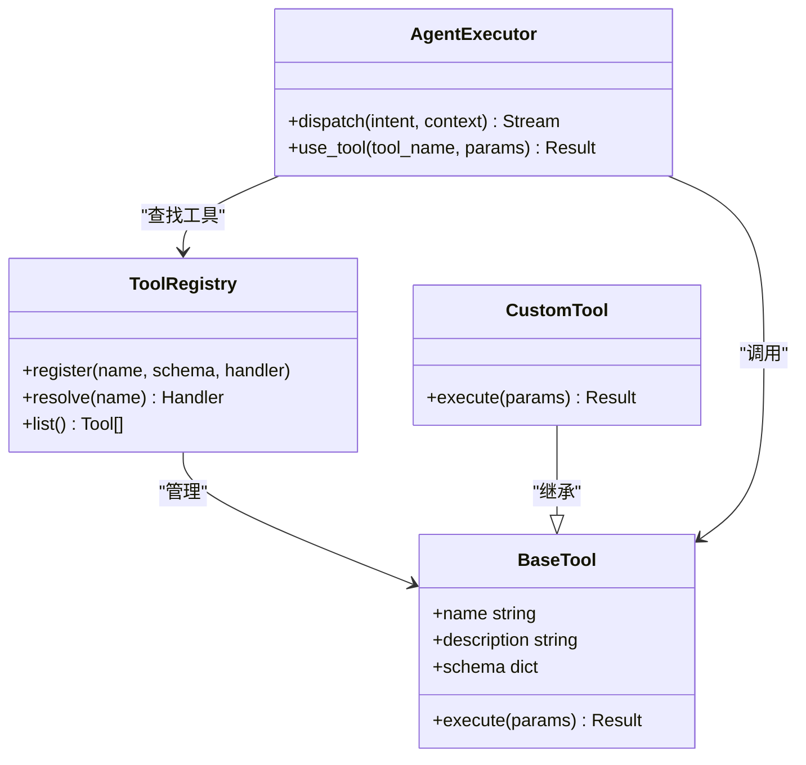
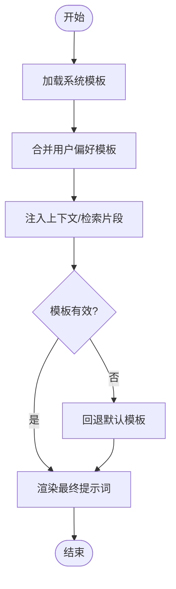
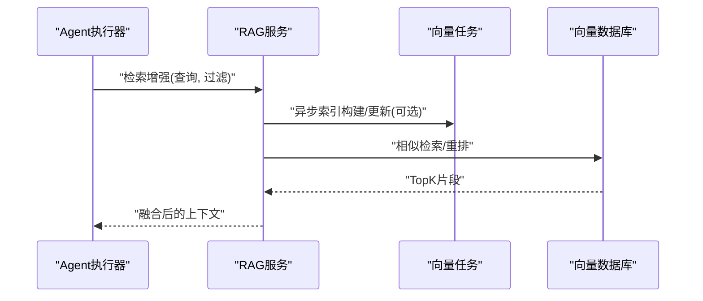
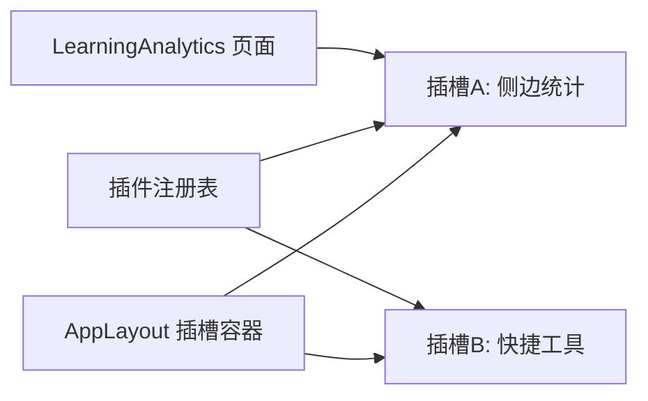
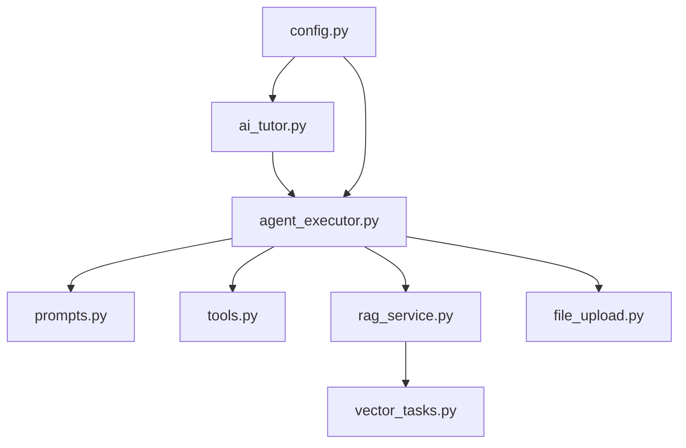

# 扩展开发指南

<cite>
**本文引用的文件**   
- [backend/app/services/agent/agent_executor.py](file://backend/app/services/agent/agent_executor.py)
- [backend/app/services/agent/prompts.py](file://backend/app/services/agent/prompts.py)
- [backend/app/services/agent/tools.py](file://backend/app/services/agent/tools.py)
- [backend/app/services/rag_service.py](file://backend/app/services/rag_service.py)
- [backend/app/services/file_upload.py](file://backend/app/services/file_upload.py)
- [backend/app/api/v1/ai_tutor.py](file://backend/app/api/v1/ai_tutor.py)
- [backend/app/core/config.py](file://backend/app/core/config.py)
- [backend/app/tasks/vector_tasks.py](file://backend/app/tasks/vector_tasks.py)
- [frontend/src/components/Layout/AppLayout.tsx](file://frontend/src/components/Layout/AppLayout.tsx)
- [frontend/src/components/ChatDrawer.tsx](file://frontend/src/components/ChatDrawer.tsx)
- [frontend/src/pages/LearningAnalytics/index.tsx](file://frontend/src/pages/LearningAnalytics/index.tsx)
</cite>

## 目录
1. [简介](#简介)
2. [项目结构](#项目结构)
3. [核心组件](#核心组件)
4. [架构总览](#架构总览)
5. [详细组件分析](#详细组件分析)
6. [依赖分析](#依赖分析)
7. [性能考虑](#性能考虑)
8. [故障排查指南](#故障排查指南)
9. [结论](#结论)
10. [附录](#附录)

## 简介
本指南面向希望在AI助教系统上进行二次开发与集成的工程师，围绕插件化架构与扩展点展开，覆盖以下主题：
- Agent工具扩展机制
- 提示词模板系统
- RAG检索增强扩展
- 前端组件插槽机制
- 第三方库集成（大语言模型提供商、向量数据库、文件存储）
- 自定义功能开发（评分算法、个性化学习路径、智能推荐）
- 扩展点API文档、示例代码路径、部署注意事项
- 最佳实践与性能优化建议

## 项目结构
后端采用分层与领域服务组织方式，Agent能力集中于services/agent目录；RAG与任务处理位于services与tasks；前端以组件与页面为粒度组织。

图表来源
- [backend/app/api/v1/ai_tutor.py](file://backend/app/api/v1/ai_tutor.py)
- [backend/app/services/agent/agent_executor.py](file://backend/app/services/agent/agent_executor.py)
- [backend/app/services/rag_service.py](file://backend/app/services/rag_service.py)
- [backend/app/services/file_upload.py](file://backend/app/services/file_upload.py)
- [backend/app/tasks/vector_tasks.py](file://backend/app/tasks/vector_tasks.py)
- [frontend/src/components/Layout/AppLayout.tsx](file://frontend/src/components/Layout/AppLayout.tsx)
- [frontend/src/components/ChatDrawer.tsx](file://frontend/src/components/ChatDrawer.tsx)
- [frontend/src/pages/LearningAnalytics/index.tsx](file://frontend/src/pages/LearningAnalytics/index.tsx)

章节来源
- [backend/app/api/v1/ai_tutor.py](file://backend/app/api/v1/ai_tutor.py)
- [backend/app/services/agent/agent_executor.py](file://backend/app/services/agent/agent_executor.py)
- [backend/app/services/rag_service.py](file://backend/app/services/rag_service.py)
- [backend/app/services/file_upload.py](file://backend/app/services/file_upload.py)
- [backend/app/tasks/vector_tasks.py](file://backend/app/tasks/vector_tasks.py)
- [frontend/src/components/Layout/AppLayout.tsx](file://frontend/src/components/Layout/AppLayout.tsx)
- [frontend/src/components/ChatDrawer.tsx](file://frontend/src/components/ChatDrawer.tsx)
- [frontend/src/pages/LearningAnalytics/index.tsx](file://frontend/src/pages/LearningAnalytics/index.tsx)

## 核心组件
- Agent执行器：负责编排工具调用、上下文管理、流式输出与错误恢复。
- 提示词模板：集中管理角色、任务、约束与输出格式，支持按场景切换。
- 工具注册表：提供统一的工具发现、参数校验与结果封装接口。
- RAG服务：统一检索增强流程，包括索引构建、查询重写、相似度检索与结果融合。
- 文件上传服务：抽象存储后端，支持本地、对象存储等实现。
- 向量任务：异步构建与维护向量索引，解耦主请求链路。
- 前端插槽：在布局与页面中预留可插拔区域，便于注入自定义UI。

章节来源
- [backend/app/services/agent/agent_executor.py](file://backend/app/services/agent/agent_executor.py)
- [backend/app/services/agent/prompts.py](file://backend/app/services/agent/prompts.py)
- [backend/app/services/agent/tools.py](file://backend/app/services/agent/tools.py)
- [backend/app/services/rag_service.py](file://backend/app/services/rag_service.py)
- [backend/app/services/file_upload.py](file://backend/app/services/file_upload.py)
- [backend/app/tasks/vector_tasks.py](file://backend/app/tasks/vector_tasks.py)
- [frontend/src/components/Layout/AppLayout.tsx](file://frontend/src/components/Layout/AppLayout.tsx)
- [frontend/src/components/ChatDrawer.tsx](file://frontend/src/components/ChatDrawer.tsx)

## 架构总览
下图展示从前端到后端的端到端扩展点分布，以及Agent、RAG、任务与配置的交互关系。

图表来源
- [backend/app/api/v1/ai_tutor.py](file://backend/app/api/v1/ai_tutor.py)
- [backend/app/services/agent/agent_executor.py](file://backend/app/services/agent/agent_executor.py)
- [backend/app/services/agent/prompts.py](file://backend/app/services/agent/prompts.py)
- [backend/app/services/agent/tools.py](file://backend/app/services/agent/tools.py)
- [backend/app/services/rag_service.py](file://backend/app/services/rag_service.py)
- [backend/app/tasks/vector_tasks.py](file://backend/app/tasks/vector_tasks.py)
- [backend/app/services/file_upload.py](file://backend/app/services/file_upload.py)

## 详细组件分析

### Agent工具扩展机制
目标：在不修改核心逻辑的前提下，新增或替换Agent可调用的工具。

- 设计要点
  - 工具注册表：通过统一接口声明工具名称、描述、输入Schema与执行函数。
  - 动态发现：启动时扫描已注册工具，供Agent根据用户意图自动选择。
  - 安全与限流：对工具执行进行鉴权、速率限制与超时控制。
  - 结果标准化：将不同工具的输出统一为结构化数据，便于后续拼接与缓存。

- 扩展步骤
  1) 在工具模块中定义新工具类/函数，遵循注册表约定的签名与元数据。
  2) 在初始化阶段完成注册，确保被Agent发现。
  3) 在提示词模板中增加对应工具的触发条件与使用示例。
  4) 编写单元测试验证输入校验、异常分支与边界条件。

- 关键文件与位置
  - 工具定义与注册：[backend/app/services/agent/tools.py](file://backend/app/services/agent/tools.py)
  - Agent执行器（调度与编排）：[backend/app/services/agent/agent_executor.py](file://backend/app/services/agent/agent_executor.py)

图表来源
- [backend/app/services/agent/tools.py](file://backend/app/services/agent/tools.py)
- [backend/app/services/agent/agent_executor.py](file://backend/app/services/agent/agent_executor.py)

章节来源
- [backend/app/services/agent/tools.py](file://backend/app/services/agent/tools.py)
- [backend/app/services/agent/agent_executor.py](file://backend/app/services/agent/agent_executor.py)

### 提示词模板系统
目标：将角色、任务、约束与输出格式从业务代码中抽离，支持多场景快速切换与A/B测试。

- 设计要点
  - 模板分类：按学科、题型、难度、评估维度划分。
  - 变量注入：支持上下文、历史对话、检索片段、用户画像等变量。
  - 版本管理：模板变更需具备版本标识与回滚能力。
  - 渲染管线：先合并系统级模板，再叠加用户级偏好。

- 扩展步骤
  1) 在模板文件中新增场景模板，定义变量占位符。
  2) 在Agent执行前加载模板并注入上下文。
  3) 为复杂场景提供“模板组合”策略。
  4) 建立模板质量度量指标（如稳定性、一致性）。

- 关键文件与位置
  - 提示词模板：[backend/app/services/agent/prompts.py](file://backend/app/services/agent/prompts.py)
  - Agent执行器（模板加载与注入）：[backend/app/services/agent/agent_executor.py](file://backend/app/services/agent/agent_executor.py)

图表来源
- [backend/app/services/agent/prompts.py](file://backend/app/services/agent/prompts.py)
- [backend/app/services/agent/agent_executor.py](file://backend/app/services/agent/agent_executor.py)

章节来源
- [backend/app/services/agent/prompts.py](file://backend/app/services/agent/prompts.py)
- [backend/app/services/agent/agent_executor.py](file://backend/app/services/agent/agent_executor.py)

### RAG检索增强扩展
目标：在生成答案前，基于知识库检索相关片段，提升准确性与可解释性。

- 设计要点
  - 索引构建：分块策略、嵌入模型、去重与元数据标注。
  - 查询重写：对用户问题做同义改写与关键词提取。
  - 检索融合：混合检索（稠密+稀疏）、重排序与截断策略。
  - 异步维护：后台任务增量更新索引，避免阻塞主链路。

- 扩展步骤
  1) 配置向量数据库连接与索引命名空间。
  2) 定义分块与嵌入策略，接入向量任务进行批量构建。
  3) 在Agent流程中插入检索节点，按需启用。
  4) 监控召回率、命中率与延迟指标。

- 关键文件与位置
  - RAG服务：[backend/app/services/rag_service.py](file://backend/app/services/rag_service.py)
  - 向量任务：[backend/app/tasks/vector_tasks.py](file://backend/app/tasks/vector_tasks.py)

图表来源
- [backend/app/services/rag_service.py](file://backend/app/services/rag_service.py)
- [backend/app/tasks/vector_tasks.py](file://backend/app/tasks/vector_tasks.py)

章节来源
- [backend/app/services/rag_service.py](file://backend/app/services/rag_service.py)
- [backend/app/tasks/vector_tasks.py](file://backend/app/tasks/vector_tasks.py)

### 前端组件插槽机制
目标：在不侵入现有页面的前提下，允许外部注入自定义UI区块（如侧边栏、统计卡片、快捷操作）。

- 设计要点
  - 插槽定义：在布局与页面中声明插槽名称与渲染契约。
  - 注册中心：前端维护插槽注册表，按优先级渲染。
  - 类型安全：使用TS接口约束插槽Props与返回值。
  - 权限控制：结合用户角色决定是否显示特定插槽。

- 扩展步骤
  1) 在布局组件中声明插槽挂载点。
  2) 在应用启动时注册自定义插槽组件。
  3) 在页面中按需消费插槽数据。
  4) 提供插槽开关与配置面板。

- 关键文件与位置
  - 应用布局：[frontend/src/components/Layout/AppLayout.tsx](file://frontend/src/components/Layout/AppLayout.tsx)
  - 对话抽屉（可作为插槽载体）：[frontend/src/components/ChatDrawer.tsx](file://frontend/src/components/ChatDrawer.tsx)
  - 学习分析页（示例消费插槽）：[frontend/src/pages/LearningAnalytics/index.tsx](file://frontend/src/pages/LearningAnalytics/index.tsx)

图表来源
- [frontend/src/components/Layout/AppLayout.tsx](file://frontend/src/components/Layout/AppLayout.tsx)
- [frontend/src/components/ChatDrawer.tsx](file://frontend/src/components/ChatDrawer.tsx)
- [frontend/src/pages/LearningAnalytics/index.tsx](file://frontend/src/pages/LearningAnalytics/index.tsx)

章节来源
- [frontend/src/components/Layout/AppLayout.tsx](file://frontend/src/components/Layout/AppLayout.tsx)
- [frontend/src/components/ChatDrawer.tsx](file://frontend/src/components/ChatDrawer.tsx)
- [frontend/src/pages/LearningAnalytics/index.tsx](file://frontend/src/pages/LearningAnalytics/index.tsx)

### 第三方库集成方法

#### 大语言模型提供商接入
- 接入思路
  - 抽象LLM客户端接口：统一消息格式、流式响应与错误码。
  - 配置驱动：通过配置文件选择提供商、模型与参数。
  - 重试与熔断：对不稳定接口进行指数退避与熔断保护。
- 关键文件与位置
  - 配置项：[backend/app/core/config.py](file://backend/app/core/config.py)
  - Agent执行器（调用LLM）：[backend/app/services/agent/agent_executor.py](file://backend/app/services/agent/agent_executor.py)

#### 向量数据库集成
- 接入思路
  - 抽象向量接口：增删改查、批量导入、相似度搜索。
  - 迁移脚本：在Alembic之外独立管理向量索引生命周期。
  - 健康检查：定期探测连通性与索引状态。
- 关键文件与位置
  - RAG服务：[backend/app/services/rag_service.py](file://backend/app/services/rag_service.py)
  - 向量任务：[backend/app/tasks/vector_tasks.py](file://backend/app/tasks/vector_tasks.py)

#### 文件存储服务扩展
- 接入思路
  - 抽象存储接口：上传、下载、删除、列表与URL生成。
  - 安全策略：访问令牌、白名单域名、大小限制。
  - 缓存策略：热点文件缓存与CDN回源。
- 关键文件与位置
  - 文件上传服务：[backend/app/services/file_upload.py](file://backend/app/services/file_upload.py)

章节来源
- [backend/app/core/config.py](file://backend/app/core/config.py)
- [backend/app/services/agent/agent_executor.py](file://backend/app/services/agent/agent_executor.py)
- [backend/app/services/rag_service.py](file://backend/app/services/rag_service.py)
- [backend/app/tasks/vector_tasks.py](file://backend/app/tasks/vector_tasks.py)
- [backend/app/services/file_upload.py](file://backend/app/services/file_upload.py)

### 自定义功能开发

#### 新的评分算法实现
- 设计要点
  - 评分策略抽象：定义输入规范、权重配置与输出结构。
  - 可插拔：通过配置选择评分策略，支持A/B对比。
  - 可观测：记录评分明细与耗时。
- 参考位置
  - 评分服务入口（示例）：[backend/app/services/ai_grader.py](file://backend/app/services/ai_grader.py)
  - 作文服务（可能包含评分逻辑）：[backend/app/services/composition_service.py](file://backend/app/services/composition_service.py)

#### 个性化学习路径生成
- 设计要点
  - 知识图谱：知识点、掌握度、薄弱项关联。
  - 路径规划：基于掌握度与目标难度生成序列。
  - 反馈闭环：练习结果反哺掌握度更新。
- 参考位置
  - 学习分析聚合：[backend/app/services/analytics_aggregator.py](file://backend/app/services/analytics_aggregator.py)
  - 学习分析API：[backend/app/api/v1/analytics.py](file://backend/app/api/v1/analytics.py)

#### 智能推荐功能
- 设计要点
  - 特征工程：题目属性、学生画像、历史行为。
  - 推荐策略：协同过滤、内容匹配、规则引擎。
  - 冷启动：基于热门与教师精选兜底。
- 参考位置
  - 相似题生成（可复用推荐思想）：[backend/app/services/similar_generator.py](file://backend/app/services/similar_generator.py)
  - 错题服务（推荐素材）：[backend/app/api/v1/error_questions.py](file://backend/app/api/v1/error_questions.py)

章节来源
- [backend/app/services/ai_grader.py](file://backend/app/services/ai_grader.py)
- [backend/app/services/composition_service.py](file://backend/app/services/composition_service.py)
- [backend/app/services/analytics_aggregator.py](file://backend/app/services/analytics_aggregator.py)
- [backend/app/api/v1/analytics.py](file://backend/app/api/v1/analytics.py)
- [backend/app/services/similar_generator.py](file://backend/app/services/similar_generator.py)
- [backend/app/api/v1/error_questions.py](file://backend/app/api/v1/error_questions.py)

## 依赖分析
- 耦合关系
  - API层仅依赖服务层，不直接访问基础设施。
  - Agent强依赖提示词与工具注册表，弱依赖RAG与存储。
  - RAG与向量任务解耦，通过任务队列异步协作。
- 外部依赖
  - LLM提供商：通过配置与客户端抽象隔离。
  - 向量数据库：通过RAG服务与任务抽象隔离。
  - 文件存储：通过上传服务抽象隔离。

图表来源
- [backend/app/api/v1/ai_tutor.py](file://backend/app/api/v1/ai_tutor.py)
- [backend/app/services/agent/agent_executor.py](file://backend/app/services/agent/agent_executor.py)
- [backend/app/services/agent/prompts.py](file://backend/app/services/agent/prompts.py)
- [backend/app/services/agent/tools.py](file://backend/app/services/agent/tools.py)
- [backend/app/services/rag_service.py](file://backend/app/services/rag_service.py)
- [backend/app/tasks/vector_tasks.py](file://backend/app/tasks/vector_tasks.py)
- [backend/app/services/file_upload.py](file://backend/app/services/file_upload.py)
- [backend/app/core/config.py](file://backend/app/core/config.py)

章节来源
- [backend/app/api/v1/ai_tutor.py](file://backend/app/api/v1/ai_tutor.py)
- [backend/app/services/agent/agent_executor.py](file://backend/app/services/agent/agent_executor.py)
- [backend/app/services/agent/prompts.py](file://backend/app/services/agent/prompts.py)
- [backend/app/services/agent/tools.py](file://backend/app/services/agent/tools.py)
- [backend/app/services/rag_service.py](file://backend/app/services/rag_service.py)
- [backend/app/tasks/vector_tasks.py](file://backend/app/tasks/vector_tasks.py)
- [backend/app/services/file_upload.py](file://backend/app/services/file_upload.py)
- [backend/app/core/config.py](file://backend/app/core/config.py)

## 性能考虑
- 流式输出：优先使用SSE/WS减少首字节延迟。
- 缓存策略：对高频提示词、检索片段与静态资源进行缓存。
- 批处理：向量索引构建与数据分析走异步任务。
- 限流与降级：对LLM与向量库调用设置QPS上限与熔断阈值。
- 索引优化：合理分块大小、去重与元数据裁剪，降低向量库压力。
- 前端优化：懒加载插槽组件、虚拟滚动长列表、图片压缩与CDN。

## 故障排查指南
- Agent无响应
  - 检查工具注册是否成功、提示词模板是否可用、LLM配置是否正确。
  - 查看Agent执行日志与超时设置。
- RAG检索为空
  - 确认向量索引是否构建完成、查询重写是否生效、相似度阈值是否过高。
- 文件上传失败
  - 校验存储后端连通性、权限与文件大小限制。
- 前端插槽未渲染
  - 检查插槽注册顺序、权限控制与类型契约是否匹配。

章节来源
- [backend/app/services/agent/agent_executor.py](file://backend/app/services/agent/agent_executor.py)
- [backend/app/services/agent/prompts.py](file://backend/app/services/agent/prompts.py)
- [backend/app/services/rag_service.py](file://backend/app/services/rag_service.py)
- [backend/app/services/file_upload.py](file://backend/app/services/file_upload.py)
- [frontend/src/components/Layout/AppLayout.tsx](file://frontend/src/components/Layout/AppLayout.tsx)

## 结论
通过工具注册表、提示词模板、RAG与前端插槽的解耦设计，系统具备良好的可扩展性与可维护性。建议在扩展过程中坚持“配置驱动、接口抽象、异步优先、可观测先行”的原则，并结合监控与压测持续优化。

## 附录

### 扩展点API速览（路径指引）
- Agent工具扩展
  - 工具定义与注册：[backend/app/services/agent/tools.py](file://backend/app/services/agent/tools.py)
  - Agent执行器：[backend/app/services/agent/agent_executor.py](file://backend/app/services/agent/agent_executor.py)
- 提示词模板
  - 模板管理：[backend/app/services/agent/prompts.py](file://backend/app/services/agent/prompts.py)
- RAG检索增强
  - RAG服务：[backend/app/services/rag_service.py](file://backend/app/services/rag_service.py)
  - 向量任务：[backend/app/tasks/vector_tasks.py](file://backend/app/tasks/vector_tasks.py)
- 文件存储
  - 上传服务：[backend/app/services/file_upload.py](file://backend/app/services/file_upload.py)
- 第三方配置
  - 配置中心：[backend/app/core/config.py](file://backend/app/core/config.py)
- 前端插槽
  - 布局插槽：[frontend/src/components/Layout/AppLayout.tsx](file://frontend/src/components/Layout/AppLayout.tsx)
  - 对话抽屉：[frontend/src/components/ChatDrawer.tsx](file://frontend/src/components/ChatDrawer.tsx)
  - 学习分析页：[frontend/src/pages/LearningAnalytics/index.tsx](file://frontend/src/pages/LearningAnalytics/index.tsx)

### 开发示例代码路径
- 新增工具示例：参见工具注册与调用位置
  - [backend/app/services/agent/tools.py](file://backend/app/services/agent/tools.py)
  - [backend/app/services/agent/agent_executor.py](file://backend/app/services/agent/agent_executor.py)
- 新增提示词模板示例：参见模板加载与注入位置
  - [backend/app/services/agent/prompts.py](file://backend/app/services/agent/prompts.py)
  - [backend/app/services/agent/agent_executor.py](file://backend/app/services/agent/agent_executor.py)
- 接入新LLM提供商示例：参见配置与调用位置
  - [backend/app/core/config.py](file://backend/app/core/config.py)
  - [backend/app/services/agent/agent_executor.py](file://backend/app/services/agent/agent_executor.py)
- 接入新向量数据库示例：参见RAG与任务位置
  - [backend/app/services/rag_service.py](file://backend/app/services/rag_service.py)
  - [backend/app/tasks/vector_tasks.py](file://backend/app/tasks/vector_tasks.py)
- 接入新文件存储示例：参见上传服务
  - [backend/app/services/file_upload.py](file://backend/app/services/file_upload.py)
- 前端插槽示例：参见布局与页面
  - [frontend/src/components/Layout/AppLayout.tsx](file://frontend/src/components/Layout/AppLayout.tsx)
  - [frontend/src/components/ChatDrawer.tsx](file://frontend/src/components/ChatDrawer.tsx)
  - [frontend/src/pages/LearningAnalytics/index.tsx](file://frontend/src/pages/LearningAnalytics/index.tsx)

### 部署注意事项
- 环境变量与密钥管理：将敏感配置放入环境变量或密钥管理服务。
- 向量库与对象存储：提前准备实例、网络白名单与备份策略。
- 任务队列：确保Celery/Worker进程数量与并发度与硬件匹配。
- 灰度发布：对新模板与新工具采用灰度与回滚策略。
- 监控告警：对LLM调用、RAG检索、任务堆积与错误率设置阈值告警。