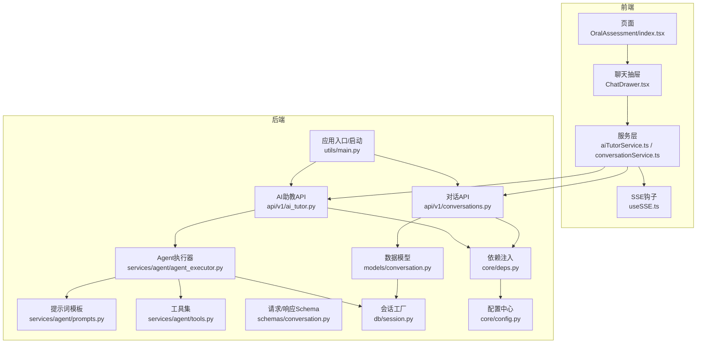
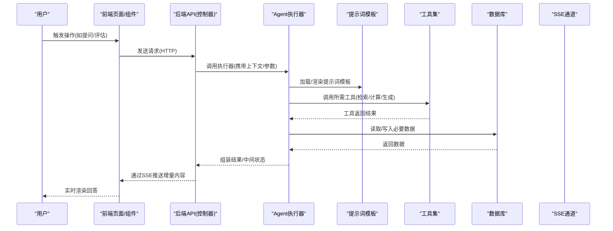
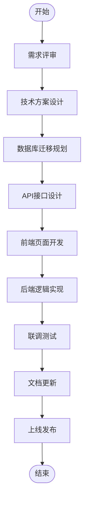
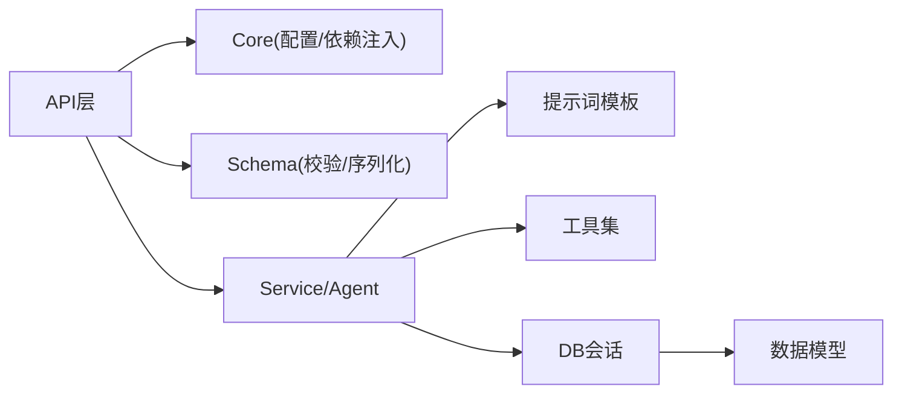

# 新功能开发流程

<cite>
**本文引用的文件**   
- [backend/app/api/v1/ai_tutor.py](file://backend/app/api/v1/ai_tutor.py)
- [backend/app/api/v1/conversations.py](file://backend/app/api/v1/conversations.py)
- [backend/app/models/conversation.py](file://backend/app/models/conversation.py)
- [backend/app/schemas/conversation.py](file://backend/app/schemas/conversation.py)
- [backend/app/services/agent/agent_executor.py](file://backend/app/services/agent/agent_executor.py)
- [backend/app/services/agent/prompts.py](file://backend/app/services/agent/prompts.py)
- [backend/app/services/agent/tools.py](file://backend/app/services/agent/tools.py)
- [backend/app/db/base.py](file://backend/app/db/base.py)
- [backend/app/db/session.py](file://backend/app/db/session.py)
- [backend/app/core/deps.py](file://backend/app/core/deps.py)
- [backend/app/core/config.py](file://backend/app/core/config.py)
- [backend/app/utils/main.py](file://backend/app/utils/main.py)
- [frontend/src/pages/OralAssessment/index.tsx](file://frontend/src/pages/OralAssessment/index.tsx)
- [frontend/src/components/ChatDrawer.tsx](file://frontend/src/components/ChatDrawer.tsx)
- [frontend/src/services/aiTutorService.ts](file://frontend/src/services/aiTutorService.ts)
- [frontend/src/services/conversationService.ts](file://frontend/src/services/conversationService.ts)
- [frontend/src/hooks/useSSE.ts](file://frontend/src/hooks/useSSE.ts)
</cite>

## 目录
1. [引言](#引言)
2. [项目结构](#项目结构)
3. [核心组件](#核心组件)
4. [架构总览](#架构总览)
5. [详细组件分析](#详细组件分析)
6. [依赖分析](#依赖分析)
7. [性能考虑](#性能考虑)
8. [故障排查指南](#故障排查指南)
9. [结论](#结论)
10. [附录](#附录)

## 引言
本指南面向AI助教系统的新功能开发，覆盖从需求评审到上线的完整周期：需求评审、技术方案设计、数据库迁移规划、API接口设计、前端页面开发、后端逻辑实现、联调测试、文档更新。在MVC分层模式下，明确Model层数据模型、View层UI组件、Controller层API实现与Service层业务封装的职责边界；同时提供Agent扩展开发规范（新工具注册、提示词模板添加、AI能力集成），并给出代码示例路径与最佳实践，确保新功能与现有系统良好集成。

## 项目结构
本项目采用前后端分离架构，后端基于Python FastAPI，使用SQLAlchemy进行ORM建模，Alembic管理数据库迁移；前端基于React+TypeScript，通过服务层调用后端REST/SSE接口。Agent子系统位于后端services/agent下，负责编排提示词、工具与执行器。

图表来源
- [backend/app/api/v1/ai_tutor.py](file://backend/app/api/v1/ai_tutor.py)
- [backend/app/api/v1/conversations.py](file://backend/app/api/v1/conversations.py)
- [backend/app/services/agent/agent_executor.py](file://backend/app/services/agent/agent_executor.py)
- [backend/app/services/agent/prompts.py](file://backend/app/services/agent/prompts.py)
- [backend/app/services/agent/tools.py](file://backend/app/services/agent/tools.py)
- [backend/app/models/conversation.py](file://backend/app/models/conversation.py)
- [backend/app/schemas/conversation.py](file://backend/app/schemas/conversation.py)
- [backend/app/db/session.py](file://backend/app/db/session.py)
- [backend/app/core/deps.py](file://backend/app/core/deps.py)
- [backend/app/core/config.py](file://backend/app/core/config.py)
- [backend/app/utils/main.py](file://backend/app/utils/main.py)
- [frontend/src/pages/OralAssessment/index.tsx](file://frontend/src/pages/OralAssessment/index.tsx)
- [frontend/src/components/ChatDrawer.tsx](file://frontend/src/components/ChatDrawer.tsx)
- [frontend/src/services/aiTutorService.ts](file://frontend/src/services/aiTutorService.ts)
- [frontend/src/services/conversationService.ts](file://frontend/src/services/conversationService.ts)
- [frontend/src/hooks/useSSE.ts](file://frontend/src/hooks/useSSE.ts)

章节来源
- [backend/app/utils/main.py](file://backend/app/utils/main.py)
- [backend/app/core/config.py](file://backend/app/core/config.py)
- [backend/app/core/deps.py](file://backend/app/core/deps.py)
- [backend/app/db/session.py](file://backend/app/db/session.py)
- [backend/app/models/conversation.py](file://backend/app/models/conversation.py)
- [backend/app/schemas/conversation.py](file://backend/app/schemas/conversation.py)
- [backend/app/api/v1/ai_tutor.py](file://backend/app/api/v1/ai_tutor.py)
- [backend/app/api/v1/conversations.py](file://backend/app/api/v1/conversations.py)
- [backend/app/services/agent/agent_executor.py](file://backend/app/services/agent/agent_executor.py)
- [backend/app/services/agent/prompts.py](file://backend/app/services/agent/prompts.py)
- [backend/app/services/agent/tools.py](file://backend/app/services/agent/tools.py)
- [frontend/src/pages/OralAssessment/index.tsx](file://frontend/src/pages/OralAssessment/index.tsx)
- [frontend/src/components/ChatDrawer.tsx](file://frontend/src/components/ChatDrawer.tsx)
- [frontend/src/services/aiTutorService.ts](file://frontend/src/services/aiTutorService.ts)
- [frontend/src/services/conversationService.ts](file://frontend/src/services/conversationService.ts)
- [frontend/src/hooks/useSSE.ts](file://frontend/src/hooks/useSSE.ts)

## 核心组件
- 数据模型层（Model）
  - 以SQLAlchemy定义持久化实体，如对话记录等，并通过Alembic进行版本化管理。
  - 参考路径：[backend/app/models/conversation.py](file://backend/app/models/conversation.py)、[backend/app/db/base.py](file://backend/app/db/base.py)、[backend/app/db/session.py](file://backend/app/db/session.py)
- 请求/响应模式（Schema）
  - 使用Pydantic对入参与出参进行校验与序列化。
  - 参考路径：[backend/app/schemas/conversation.py](file://backend/app/schemas/conversation.py)
- 控制器层（Controller/API）
  - 暴露REST接口，处理鉴权、参数校验、路由分发与错误码。
  - 参考路径：[backend/app/api/v1/ai_tutor.py](file://backend/app/api/v1/ai_tutor.py)、[backend/app/api/v1/conversations.py](file://backend/app/api/v1/conversations.py)
- 服务层（Service/Agent）
  - 封装业务逻辑与AI Agent编排：提示词模板、工具注册、执行器调度、流式输出。
  - 参考路径：[backend/app/services/agent/agent_executor.py](file://backend/app/services/agent/agent_executor.py)、[backend/app/services/agent/prompts.py](file://backend/app/services/agent/prompts.py)、[backend/app/services/agent/tools.py](file://backend/app/services/agent/tools.py)
- 前端视图与服务（View + Service）
  - 页面与组件负责展示与交互，服务层统一封装HTTP/SSE调用。
  - 参考路径：[frontend/src/pages/OralAssessment/index.tsx](file://frontend/src/pages/OralAssessment/index.tsx)、[frontend/src/components/ChatDrawer.tsx](file://frontend/src/components/ChatDrawer.tsx)、[frontend/src/services/aiTutorService.ts](file://frontend/src/services/aiTutorService.ts)、[frontend/src/services/conversationService.ts](file://frontend/src/services/conversationService.ts)、[frontend/src/hooks/useSSE.ts](file://frontend/src/hooks/useSSE.ts)

章节来源
- [backend/app/models/conversation.py](file://backend/app/models/conversation.py)
- [backend/app/schemas/conversation.py](file://backend/app/schemas/conversation.py)
- [backend/app/api/v1/ai_tutor.py](file://backend/app/api/v1/ai_tutor.py)
- [backend/app/api/v1/conversations.py](file://backend/app/api/v1/conversations.py)
- [backend/app/services/agent/agent_executor.py](file://backend/app/services/agent/agent_executor.py)
- [backend/app/services/agent/prompts.py](file://backend/app/services/agent/prompts.py)
- [backend/app/services/agent/tools.py](file://backend/app/services/agent/tools.py)
- [frontend/src/pages/OralAssessment/index.tsx](file://frontend/src/pages/OralAssessment/index.tsx)
- [frontend/src/components/ChatDrawer.tsx](file://frontend/src/components/ChatDrawer.tsx)
- [frontend/src/services/aiTutorService.ts](file://frontend/src/services/aiTutorService.ts)
- [frontend/src/services/conversationService.ts](file://frontend/src/services/conversationService.ts)
- [frontend/src/hooks/useSSE.ts](file://frontend/src/hooks/useSSE.ts)

## 架构总览
下图展示了“新增一个AI助教能力”的典型端到端流程：前端发起请求，后端控制器接收并委派给Agent服务，Agent组合提示词与工具，必要时读写数据库，并以SSE流式返回结果。

图表来源
- [backend/app/api/v1/ai_tutor.py](file://backend/app/api/v1/ai_tutor.py)
- [backend/app/services/agent/agent_executor.py](file://backend/app/services/agent/agent_executor.py)
- [backend/app/services/agent/prompts.py](file://backend/app/services/agent/prompts.py)
- [backend/app/services/agent/tools.py](file://backend/app/services/agent/tools.py)
- [backend/app/models/conversation.py](file://backend/app/models/conversation.py)
- [backend/app/db/session.py](file://backend/app/db/session.py)
- [frontend/src/services/aiTutorService.ts](file://frontend/src/services/aiTutorService.ts)
- [frontend/src/hooks/useSSE.ts](file://frontend/src/hooks/useSSE.ts)

## 详细组件分析

### 数据模型与数据库迁移（Model）
- 职责
  - 定义领域实体字段、关系与约束；提供统一的Session工厂；配合Alembic进行迁移。
- 关键要点
  - 新增字段或表时，优先在Model中声明变更，随后生成并审查迁移脚本，再在目标环境执行。
  - 为敏感字段增加加密或脱敏策略；为查询热点字段建立索引。
- 参考路径
  - [backend/app/models/conversation.py](file://backend/app/models/conversation.py)
  - [backend/app/db/base.py](file://backend/app/db/base.py)
  - [backend/app/db/session.py](file://backend/app/db/session.py)

章节来源
- [backend/app/models/conversation.py](file://backend/app/models/conversation.py)
- [backend/app/db/base.py](file://backend/app/db/base.py)
- [backend/app/db/session.py](file://backend/app/db/session.py)

### 请求/响应模式（Schema）
- 职责
  - 校验入参、定义出参结构，保证API契约稳定。
- 关键要点
  - 区分创建、更新、列表等不同场景的Schema；对枚举、范围、必填项做严格校验。
- 参考路径
  - [backend/app/schemas/conversation.py](file://backend/app/schemas/conversation.py)

章节来源
- [backend/app/schemas/conversation.py](file://backend/app/schemas/conversation.py)

### 控制器层（API）
- 职责
  - 路由定义、鉴权、参数校验、异常处理、分页/过滤、限流与日志。
- 关键要点
  - 保持薄控制器，复杂逻辑下沉至Service/Agent；统一错误码与消息格式。
- 参考路径
  - [backend/app/api/v1/ai_tutor.py](file://backend/app/api/v1/ai_tutor.py)
  - [backend/app/api/v1/conversations.py](file://backend/app/api/v1/conversations.py)

章节来源
- [backend/app/api/v1/ai_tutor.py](file://backend/app/api/v1/ai_tutor.py)
- [backend/app/api/v1/conversations.py](file://backend/app/api/v1/conversations.py)

### 服务层与Agent（Service/Agent）
- 职责
  - 封装业务编排：加载提示词、选择工具、调用外部AI能力、持久化中间态、流式输出。
- 关键要点
  - 提示词模板集中管理，支持按场景/角色切换；工具按需注册，具备幂等与重试；执行器支持超时与熔断。
- 参考路径
  - [backend/app/services/agent/agent_executor.py](file://backend/app/services/agent/agent_executor.py)
  - [backend/app/services/agent/prompts.py](file://backend/app/services/agent/prompts.py)
  - [backend/app/services/agent/tools.py](file://backend/app/services/agent/tools.py)

章节来源
- [backend/app/services/agent/agent_executor.py](file://backend/app/services/agent/agent_executor.py)
- [backend/app/services/agent/prompts.py](file://backend/app/services/agent/prompts.py)
- [backend/app/services/agent/tools.py](file://backend/app/services/agent/tools.py)

### 前端页面与组件（View）
- 职责
  - 组织页面布局、渲染AI对话界面、上传与进度反馈、错误提示。
- 关键要点
  - 将通用交互抽离为可复用组件；统一错误处理与空状态；对长耗时任务提供进度与取消能力。
- 参考路径
  - [frontend/src/pages/OralAssessment/index.tsx](file://frontend/src/pages/OralAssessment/index.tsx)
  - [frontend/src/components/ChatDrawer.tsx](file://frontend/src/components/ChatDrawer.tsx)

章节来源
- [frontend/src/pages/OralAssessment/index.tsx](file://frontend/src/pages/OralAssessment/index.tsx)
- [frontend/src/components/ChatDrawer.tsx](file://frontend/src/components/ChatDrawer.tsx)

### 前端服务与SSE（Service + Hooks）
- 职责
  - 封装HTTP/SSE调用，统一拦截器、重试、超时与错误上报；提供SSE连接管理。
- 关键要点
  - 断线重连、心跳检测、增量渲染；避免内存泄漏与重复订阅。
- 参考路径
  - [frontend/src/services/aiTutorService.ts](file://frontend/src/services/aiTutorService.ts)
  - [frontend/src/services/conversationService.ts](file://frontend/src/services/conversationService.ts)
  - [frontend/src/hooks/useSSE.ts](file://frontend/src/hooks/useSSE.ts)

章节来源
- [frontend/src/services/aiTutorService.ts](file://frontend/src/services/aiTutorService.ts)
- [frontend/src/services/conversationService.ts](file://frontend/src/services/conversationService.ts)
- [frontend/src/hooks/useSSE.ts](file://frontend/src/hooks/useSSE.ts)

### Agent扩展开发规范
- 新工具注册
  - 在工具集中新增函数/类，定义输入输出契约与错误语义；在注册表中登记名称与描述，供执行器发现。
  - 参考路径：[backend/app/services/agent/tools.py](file://backend/app/services/agent/tools.py)
- 提示词模板添加
  - 在模板文件中按场景/角色组织模板，支持变量替换与多轮上下文拼接；提供默认值与回退策略。
  - 参考路径：[backend/app/services/agent/prompts.py](file://backend/app/services/agent/prompts.py)
- AI能力集成
  - 在执行器中编排提示词与工具，控制并发、超时、重试与降级；对大模型调用增加速率限制与缓存。
  - 参考路径：[backend/app/services/agent/agent_executor.py](file://backend/app/services/agent/agent_executor.py)

章节来源
- [backend/app/services/agent/tools.py](file://backend/app/services/agent/tools.py)
- [backend/app/services/agent/prompts.py](file://backend/app/services/agent/prompts.py)
- [backend/app/services/agent/agent_executor.py](file://backend/app/services/agent/agent_executor.py)

### 端到端开发流程（从需求到上线）
- 需求评审
  - 明确用户故事、验收标准、风险与依赖；产出PRD与原型。
- 技术方案设计
  - 确定MVC分层改动点、Agent编排方案、数据流向与错误处理；绘制时序图与数据流图。
- 数据库迁移规划
  - 在Model中声明变更，生成并审查迁移脚本；制定回滚策略与灰度计划。
- API接口设计
  - 定义路由、方法、入参/出参、错误码与鉴权；编写OpenAPI文档与契约测试用例。
- 前端页面开发
  - 搭建页面与组件，对接服务层；实现SSE流式渲染与错误提示。
- 后端逻辑实现
  - 完成Controller/Service/Agent实现，接入提示词与工具，完善日志与监控。
- 联调测试
  - 单元/集成/端到端测试；压测与稳定性演练；安全与合规检查。
- 文档更新
  - 更新API文档、部署手册、运维手册与用户帮助文档。

[此图为概念流程图，不直接映射具体源码文件]

## 依赖分析
- 模块耦合
  - API层依赖Core配置与依赖注入；Service/Agent依赖提示词与工具；所有持久化访问通过Session工厂。
- 外部依赖
  - 大模型API、向量检索、对象存储等，建议通过配置中心与环境变量管理，便于多环境切换。
- 潜在循环依赖
  - 避免API直接引用Model，应通过Service/Schema解耦；Agent内部工具与提示词相互独立。

图表来源
- [backend/app/api/v1/ai_tutor.py](file://backend/app/api/v1/ai_tutor.py)
- [backend/app/api/v1/conversations.py](file://backend/app/api/v1/conversations.py)
- [backend/app/schemas/conversation.py](file://backend/app/schemas/conversation.py)
- [backend/app/services/agent/agent_executor.py](file://backend/app/services/agent/agent_executor.py)
- [backend/app/services/agent/prompts.py](file://backend/app/services/agent/prompts.py)
- [backend/app/services/agent/tools.py](file://backend/app/services/agent/tools.py)
- [backend/app/db/session.py](file://backend/app/db/session.py)
- [backend/app/models/conversation.py](file://backend/app/models/conversation.py)
- [backend/app/core/deps.py](file://backend/app/core/deps.py)
- [backend/app/core/config.py](file://backend/app/core/config.py)

章节来源
- [backend/app/core/deps.py](file://backend/app/core/deps.py)
- [backend/app/core/config.py](file://backend/app/core/config.py)
- [backend/app/db/session.py](file://backend/app/db/session.py)
- [backend/app/models/conversation.py](file://backend/app/models/conversation.py)
- [backend/app/schemas/conversation.py](file://backend/app/schemas/conversation.py)
- [backend/app/api/v1/ai_tutor.py](file://backend/app/api/v1/ai_tutor.py)
- [backend/app/api/v1/conversations.py](file://backend/app/api/v1/conversations.py)
- [backend/app/services/agent/agent_executor.py](file://backend/app/services/agent/agent_executor.py)
- [backend/app/services/agent/prompts.py](file://backend/app/services/agent/prompts.py)
- [backend/app/services/agent/tools.py](file://backend/app/services/agent/tools.py)

## 性能考虑
- 流式输出
  - 使用SSE逐步推送Token，降低首屏延迟；前端增量渲染，避免一次性加载大文本。
- 异步与队列
  - 将耗时任务（如批量分析、向量入库）放入任务队列，避免阻塞请求线程。
- 缓存与去重
  - 对相似问题与答案进行缓存；对工具调用结果设置合理TTL与键空间隔离。
- 资源与限流
  - 对大模型调用实施速率限制与熔断；对数据库连接池与线程池进行容量规划。
- 前端优化
  - 组件懒加载、图片与静态资源压缩、防抖节流、错误边界与降级展示。

[本节为通用指导，无需特定文件来源]

## 故障排查指南
- 常见问题定位
  - 鉴权失败：检查令牌有效期、权限策略与依赖注入配置。
  - 参数校验失败：核对Schema定义与前端传参类型。
  - Agent执行异常：查看提示词变量是否缺失、工具是否注册、外部API是否可用。
  - SSE中断：检查服务端推送是否持续、客户端重连逻辑是否正确。
- 日志与追踪
  - 在API入口与Agent关键步骤埋点，记录请求ID、耗时与错误堆栈；结合链路追踪定位瓶颈。
- 快速恢复
  - 启用降级模式（返回缓存或默认答案）、关闭非关键工具、扩容实例与提升超时阈值。

章节来源
- [backend/app/api/v1/ai_tutor.py](file://backend/app/api/v1/ai_tutor.py)
- [backend/app/api/v1/conversations.py](file://backend/app/api/v1/conversations.py)
- [backend/app/services/agent/agent_executor.py](file://backend/app/services/agent/agent_executor.py)
- [frontend/src/hooks/useSSE.ts](file://frontend/src/hooks/useSSE.ts)

## 结论
遵循本流程可在MVC分层与Agent编排框架内高效、可控地扩展AI助教能力。通过清晰的职责划分、严格的契约校验与完善的SSE流式体验，既能保障系统稳定性，又能快速交付高质量新功能。建议在每次迭代中同步完善文档与测试，确保知识沉淀与回归质量。

## 附录
- 代码示例路径（仅列出路径，不包含代码内容）
  - 控制器示例：[backend/app/api/v1/ai_tutor.py](file://backend/app/api/v1/ai_tutor.py)
  - 对话API示例：[backend/app/api/v1/conversations.py](file://backend/app/api/v1/conversations.py)
  - 数据模型示例：[backend/app/models/conversation.py](file://backend/app/models/conversation.py)
  - Schema示例：[backend/app/schemas/conversation.py](file://backend/app/schemas/conversation.py)
  - Agent执行器示例：[backend/app/services/agent/agent_executor.py](file://backend/app/services/agent/agent_executor.py)
  - 提示词模板示例：[backend/app/services/agent/prompts.py](file://backend/app/services/agent/prompts.py)
  - 工具集示例：[backend/app/services/agent/tools.py](file://backend/app/services/agent/tools.py)
  - 前端页面示例：[frontend/src/pages/OralAssessment/index.tsx](file://frontend/src/pages/OralAssessment/index.tsx)
  - 聊天组件示例：[frontend/src/components/ChatDrawer.tsx](file://frontend/src/components/ChatDrawer.tsx)
  - 前端服务示例：[frontend/src/services/aiTutorService.ts](file://frontend/src/services/aiTutorService.ts)、[frontend/src/services/conversationService.ts](file://frontend/src/services/conversationService.ts)
  - SSE钩子示例：[frontend/src/hooks/useSSE.ts](file://frontend/src/hooks/useSSE.ts)