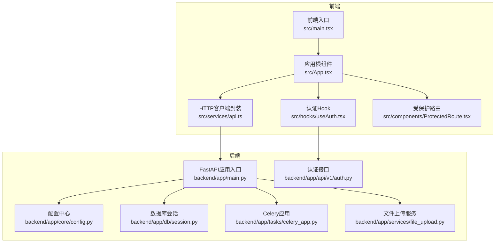
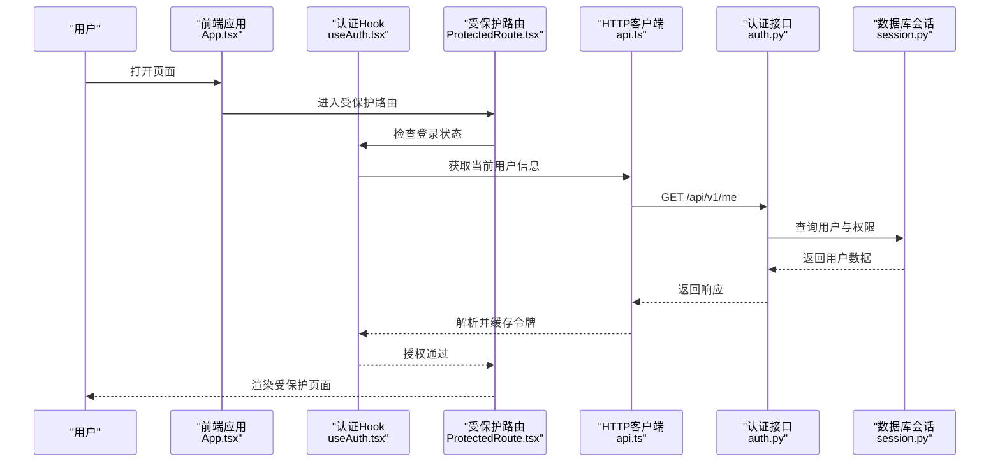
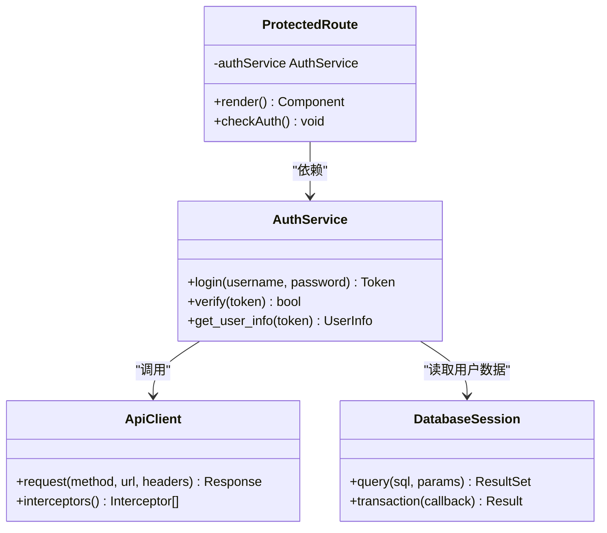
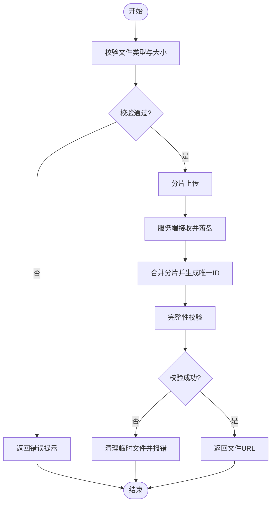
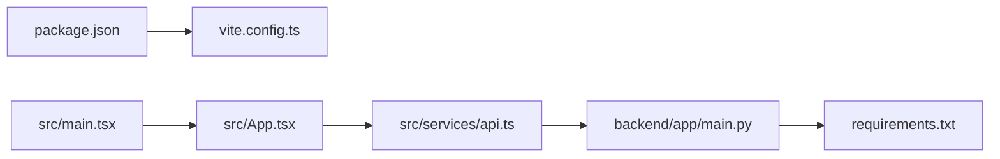

# 调试与测试

<cite>
**本文引用的文件**   
- [backend/app/main.py](file://backend/app/main.py)
- [backend/requirements.txt](file://backend/requirements.txt)
- [backend/app/core/config.py](file://backend/app/core/config.py)
- [backend/app/db/session.py](file://backend/app/db/session.py)
- [backend/app/tasks/celery_app.py](file://backend/app/tasks/celery_app.py)
- [backend/app/tasks/dev_runner.py](file://backend/app/tasks/dev_runner.py)
- [backend/app/api/v1/auth.py](file://backend/app/api/v1/auth.py)
- [backend/app/services/file_upload.py](file://backend/app/services/file_upload.py)
- [frontend/package.json](file://frontend/package.json)
- [frontend/vite.config.ts](file://frontend/vite.config.ts)
- [frontend/src/main.tsx](file://frontend/src/main.tsx)
- [frontend/src/App.tsx](file://frontend/src/App.tsx)
- [frontend/src/hooks/useAuth.tsx](file://frontend/src/hooks/useAuth.tsx)
- [frontend/src/services/api.ts](file://frontend/src/services/api.ts)
- [frontend/src/services/authService.ts](file://frontend/src/services/authService.ts)
- [frontend/src/components/ProtectedRoute.tsx](file://frontend/src/components/ProtectedRoute.tsx)
</cite>

## 目录
1. [简介](#简介)
2. [项目结构](#项目结构)
3. [核心组件](#核心组件)
4. [架构总览](#架构总览)
5. [详细组件分析](#详细组件分析)
6. [依赖分析](#依赖分析)
7. [性能考虑](#性能考虑)
8. [故障排查指南](#故障排查指南)
9. [结论](#结论)
10. [附录](#附录)

## 简介
本指南面向AI助教系统的开发与维护人员，聚焦前后端调试与测试实践。内容涵盖：
- 前端调试技巧：React DevTools、网络请求调试、性能分析工具、浏览器开发者工具高级用法
- 后端调试方法：FastAPI调试模式、数据库查询优化、Celery任务调试、日志分析方法
- 测试策略：单元测试编写规范、集成测试方案、端到端测试实现
- Mock数据生成、测试环境搭建、持续集成配置
- 常见问题调试思路与性能瓶颈定位方法

## 项目结构
系统采用前后端分离架构：
- 前端基于React + Vite，提供用户界面与服务调用封装
- 后端基于FastAPI，提供REST API、异步任务（Celery）、数据库访问（Alembic迁移）
- 关键入口与配置位于后端main模块与前端vite配置中

**图表来源**
- [frontend/src/main.tsx](file://frontend/src/main.tsx)
- [frontend/src/App.tsx](file://frontend/src/App.tsx)
- [frontend/src/services/api.ts](file://frontend/src/services/api.ts)
- [frontend/src/hooks/useAuth.tsx](file://frontend/src/hooks/useAuth.tsx)
- [frontend/src/components/ProtectedRoute.tsx](file://frontend/src/components/ProtectedRoute.tsx)
- [backend/app/main.py](file://backend/app/main.py)
- [backend/app/core/config.py](file://backend/app/core/config.py)
- [backend/app/db/session.py](file://backend/app/db/session.py)
- [backend/app/tasks/celery_app.py](file://backend/app/tasks/celery_app.py)
- [backend/app/api/v1/auth.py](file://backend/app/api/v1/auth.py)
- [backend/app/services/file_upload.py](file://backend/app/services/file_upload.py)

**章节来源**
- [frontend/src/main.tsx](file://frontend/src/main.tsx)
- [frontend/src/App.tsx](file://frontend/src/App.tsx)
- [frontend/src/services/api.ts](file://frontend/src/services/api.ts)
- [frontend/src/hooks/useAuth.tsx](file://frontend/src/hooks/useAuth.tsx)
- [frontend/src/components/ProtectedRoute.tsx](file://frontend/src/components/ProtectedRoute.tsx)
- [backend/app/main.py](file://backend/app/main.py)
- [backend/app/core/config.py](file://backend/app/core/config.py)
- [backend/app/db/session.py](file://backend/app/db/session.py)
- [backend/app/tasks/celery_app.py](file://backend/app/tasks/celery_app.py)
- [backend/app/api/v1/auth.py](file://backend/app/api/v1/auth.py)
- [backend/app/services/file_upload.py](file://backend/app/services/file_upload.py)

## 核心组件
- 前端入口与路由：负责初始化应用、挂载根组件、注册受保护路由与认证逻辑
- HTTP客户端封装：统一请求头、错误处理、重试与拦截器
- 认证流程：登录、令牌存储、鉴权拦截
- 后端主应用：注册中间件、路由、异常处理、CORS等
- 配置管理：环境变量加载、敏感信息隔离
- 数据库会话：连接池、事务上下文、SQL日志开关
- Celery任务：异步任务调度、开发运行器、结果持久化
- 文件上传服务：分片上传、校验、临时存储清理

**章节来源**
- [frontend/src/main.tsx](file://frontend/src/main.tsx)
- [frontend/src/App.tsx](file://frontend/src/App.tsx)
- [frontend/src/services/api.ts](file://frontend/src/services/api.ts)
- [frontend/src/hooks/useAuth.tsx](file://frontend/src/hooks/useAuth.tsx)
- [frontend/src/components/ProtectedRoute.tsx](file://frontend/src/components/ProtectedRoute.tsx)
- [backend/app/main.py](file://backend/app/main.py)
- [backend/app/core/config.py](file://backend/app/core/config.py)
- [backend/app/db/session.py](file://backend/app/db/session.py)
- [backend/app/tasks/celery_app.py](file://backend/app/tasks/celery_app.py)
- [backend/app/tasks/dev_runner.py](file://backend/app/tasks/dev_runner.py)
- [backend/app/services/file_upload.py](file://backend/app/services/file_upload.py)

## 架构总览
以下序列图展示一次典型的用户登录与受保护资源访问流程，包括前端鉴权拦截与后端认证接口交互。

**图表来源**
- [frontend/src/App.tsx](file://frontend/src/App.tsx)
- [frontend/src/hooks/useAuth.tsx](file://frontend/src/hooks/useAuth.tsx)
- [frontend/src/components/ProtectedRoute.tsx](file://frontend/src/components/ProtectedRoute.tsx)
- [frontend/src/services/api.ts](file://frontend/src/services/api.ts)
- [backend/app/api/v1/auth.py](file://backend/app/api/v1/auth.py)
- [backend/app/db/session.py](file://backend/app/db/session.py)

## 详细组件分析

### 前端调试技巧
- React DevTools使用
  - 安装与启用：在浏览器扩展市场安装React Developer Tools，并在开发模式下启动前端应用后自动识别
  - 常用面板：组件树、Props与State、Hooks、Profiler性能分析
  - 最佳实践：仅在开发环境启用；对复杂组件进行快照对比；结合Profiler定位重渲染热点
- 网络请求调试
  - 使用浏览器“网络”面板过滤XHR/Fetch请求，查看请求头、载荷、响应体与耗时
  - 针对认证相关请求，确认Authorization头与Cookie是否正确携带
  - 利用断点与条件断点跟踪特定URL或状态码
- 性能分析工具
  - 使用Performance面板录制时间线，关注长任务、布局抖动与内存增长
  - 结合React Profiler记录组件渲染成本，识别不必要的re-render
- 浏览器开发者工具高级用法
  - 控制台：使用console.table输出结构化数据；使用performance.mark/markEnd测量代码段耗时
  - 源映射：确保Vite已开启sourcemap以便调试TS/JS源码
  - 本地覆盖：在Sources面板直接修改CSS/JS进行快速验证（仅用于调试）

**章节来源**
- [frontend/vite.config.ts](file://frontend/vite.config.ts)
- [frontend/src/services/api.ts](file://frontend/src/services/api.ts)
- [frontend/src/hooks/useAuth.tsx](file://frontend/src/hooks/useAuth.tsx)

### 后端调试方法
- FastAPI调试模式
  - 使用uvicorn的reload参数在开发时自动重载；设置环境变量控制日志级别
  - 启用CORS与调试中间件，便于跨域与错误堆栈输出
- 数据库查询优化
  - 在数据库会话中开启SQL日志，观察慢查询与N+1问题
  - 使用连接池参数调优，避免连接泄漏；为高频查询添加索引
- Celery任务调试
  - 使用celery worker与flower监控任务队列与执行状态
  - 开发运行器支持本地模拟任务执行，便于联调
- 日志分析方法
  - 结构化日志输出到标准输出，配合容器日志收集
  - 按模块与级别划分日志，关键路径增加traceId便于追踪

**章节来源**
- [backend/app/main.py](file://backend/app/main.py)
- [backend/app/core/config.py](file://backend/app/core/config.py)
- [backend/app/db/session.py](file://backend/app/db/session.py)
- [backend/app/tasks/celery_app.py](file://backend/app/tasks/celery_app.py)
- [backend/app/tasks/dev_runner.py](file://backend/app/tasks/dev_runner.py)

### 测试策略
- 单元测试编写规范
  - 以功能为单位组织测试用例，遵循Arrange-Act-Assert结构
  - 对纯函数与业务逻辑进行隔离测试，避免外部依赖
- 集成测试方案
  - 使用TestClient对FastAPI接口进行端到端调用，准备测试数据库与种子数据
  - 对认证、权限、文件上传等关键路径进行集成验证
- 端到端测试实现
  - 使用Playwright或Selenium驱动浏览器，模拟用户操作流
  - 结合Mock服务与固定数据集，保证可重复性
- Mock数据生成
  - 使用工厂模式生成领域对象，避免硬编码
  - 对第三方服务（如向量库、LLM）使用Mock或沙箱
- 测试环境搭建
  - 独立数据库实例与Redis/Celery Broker
  - 环境变量隔离，避免污染生产配置
- 持续集成配置
  - 在CI流水线中并行运行单元与集成测试
  - 生成覆盖率报告与测试产物归档

[本节为通用指导，不直接分析具体文件]

### 认证与受保护路由流程（类图）

**图表来源**
- [frontend/src/hooks/useAuth.tsx](file://frontend/src/hooks/useAuth.tsx)
- [frontend/src/components/ProtectedRoute.tsx](file://frontend/src/components/ProtectedRoute.tsx)
- [frontend/src/services/api.ts](file://frontend/src/services/api.ts)
- [backend/app/api/v1/auth.py](file://backend/app/api/v1/auth.py)
- [backend/app/db/session.py](file://backend/app/db/session.py)

**章节来源**
- [frontend/src/hooks/useAuth.tsx](file://frontend/src/hooks/useAuth.tsx)
- [frontend/src/components/ProtectedRoute.tsx](file://frontend/src/components/ProtectedRoute.tsx)
- [frontend/src/services/api.ts](file://frontend/src/services/api.ts)
- [backend/app/api/v1/auth.py](file://backend/app/api/v1/auth.py)
- [backend/app/db/session.py](file://backend/app/db/session.py)

### 文件上传流程（流程图）

**图表来源**
- [backend/app/services/file_upload.py](file://backend/app/services/file_upload.py)

**章节来源**
- [backend/app/services/file_upload.py](file://backend/app/services/file_upload.py)

## 依赖分析
- 前端依赖
  - package.json定义构建与运行时依赖，vite.config.ts配置开发服务器、代理与插件
- 后端依赖
  - requirements.txt列出FastAPI、Uvicorn、SQLAlchemy、Alembic、Celery等核心包
- 耦合关系
  - 前端通过HTTP客户端与后端API通信，认证与权限由后端集中管理
  - 后端通过配置中心与环境变量解耦敏感信息，数据库与会话层抽象出统一访问

**图表来源**
- [frontend/package.json](file://frontend/package.json)
- [frontend/vite.config.ts](file://frontend/vite.config.ts)
- [frontend/src/main.tsx](file://frontend/src/main.tsx)
- [frontend/src/App.tsx](file://frontend/src/App.tsx)
- [frontend/src/services/api.ts](file://frontend/src/services/api.ts)
- [backend/app/main.py](file://backend/app/main.py)
- [backend/requirements.txt](file://backend/requirements.txt)

**章节来源**
- [frontend/package.json](file://frontend/package.json)
- [frontend/vite.config.ts](file://frontend/vite.config.ts)
- [frontend/src/main.tsx](file://frontend/src/main.tsx)
- [frontend/src/App.tsx](file://frontend/src/App.tsx)
- [frontend/src/services/api.ts](file://frontend/src/services/api.ts)
- [backend/app/main.py](file://backend/app/main.py)
- [backend/requirements.txt](file://backend/requirements.txt)

## 性能考虑
- 前端
  - 减少不必要重渲染：使用React.memo、useMemo、useCallback
  - 懒加载与代码分割：按需引入页面与组件
  - 图片与静态资源优化：压缩、CDN、缓存策略
- 后端
  - 数据库：为高频查询字段建立索引，避免SELECT *，合理使用分页
  - 连接池：调整最大连接数与超时，防止连接耗尽
  - 异步任务：将耗时操作放入Celery，避免阻塞请求线程
  - 缓存：对热点数据使用Redis缓存，降低数据库压力
- 全链路
  - 埋点与指标：采集P95/P99延迟、错误率与资源占用
  - 压测：使用JMeter或Locust进行负载测试，定位瓶颈

[本节为通用指导，不直接分析具体文件]

## 故障排查指南
- 前端常见问题
  - 跨域失败：检查CORS配置与请求头；确认代理转发规则
  - 认证失败：核对Token有效期与刷新机制；检查Cookie与Storage
  - 页面白屏：查看控制台错误与网络面板；关闭扩展干扰
- 后端常见问题
  - 接口500：查看应用日志与异常堆栈；确认数据库连接与迁移状态
  - 任务未执行：检查Celery Worker状态与Broker连通性；确认任务注册
  - 文件上传失败：检查磁盘空间与权限；验证分片合并逻辑
- 数据库问题
  - 慢查询：开启SQL日志，使用EXPLAIN分析执行计划
  - 死锁与锁等待：缩短事务范围，避免长时间持有锁
- 日志分析
  - 统一traceId贯穿请求链路；按模块与级别输出
  - 聚合与检索：使用ELK或类似平台进行可视化分析

**章节来源**
- [backend/app/main.py](file://backend/app/main.py)
- [backend/app/core/config.py](file://backend/app/core/config.py)
- [backend/app/db/session.py](file://backend/app/db/session.py)
- [backend/app/tasks/celery_app.py](file://backend/app/tasks/celery_app.py)
- [backend/app/services/file_upload.py](file://backend/app/services/file_upload.py)
- [frontend/src/services/api.ts](file://frontend/src/services/api.ts)
- [frontend/src/hooks/useAuth.tsx](file://frontend/src/hooks/useAuth.tsx)

## 结论
通过系统化的调试与测试实践，可以显著提升AI助教系统的稳定性与可维护性。建议团队在日常开发中：
- 固化前端与后端调试清单
- 完善单测与集成测试覆盖关键路径
- 在CI中自动化执行测试与性能回归
- 建立统一的日志与监控体系，快速定位问题

[本节为总结性内容，不直接分析具体文件]

## 附录
- 推荐工具
  - 前端：React DevTools、Chrome DevTools、Webpack/Vite插件
  - 后端：FastAPI TestClient、SQLAlchemy日志、Celery Flower、Postman/Insomnia
  - 测试：Pytest、Playwright、JMeter/Locust
- 参考配置
  - 前端：vite.config.ts中的代理与插件配置
  - 后端：main.py中的中间件与异常处理配置
  - 依赖：requirements.txt与package.json版本锁定

**章节来源**
- [frontend/vite.config.ts](file://frontend/vite.config.ts)
- [backend/app/main.py](file://backend/app/main.py)
- [backend/requirements.txt](file://backend/requirements.txt)
- [frontend/package.json](file://frontend/package.json)