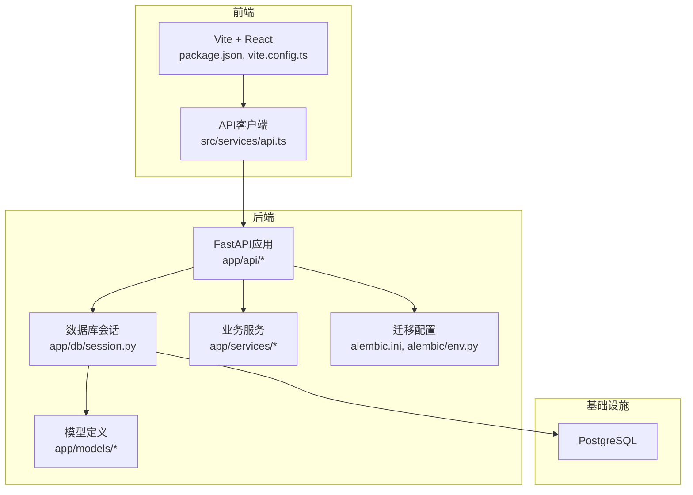
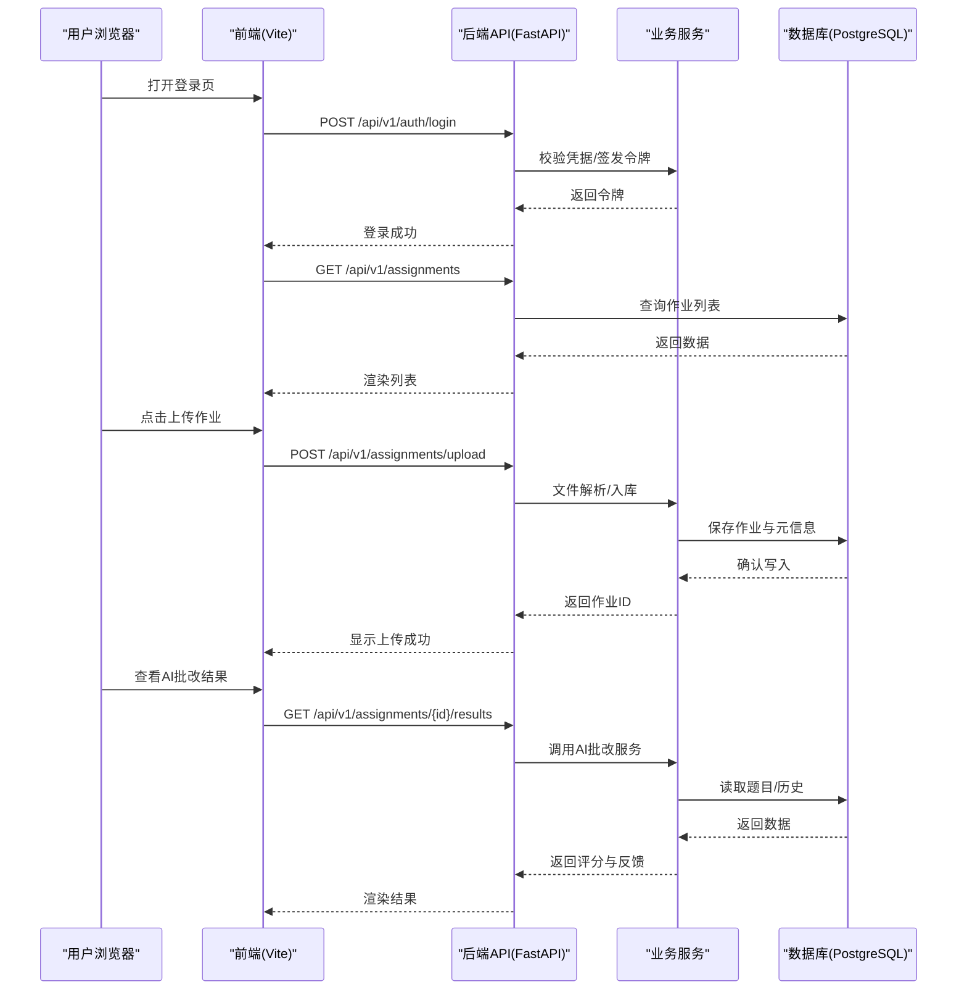
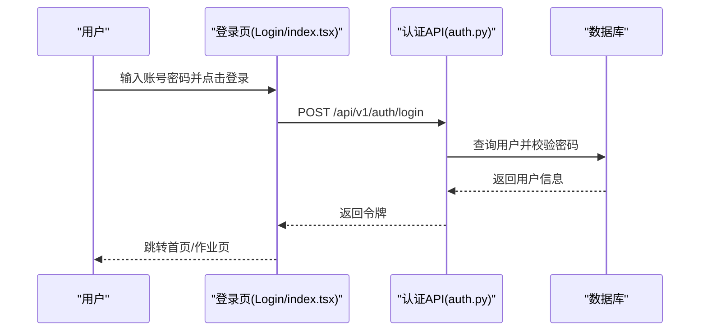
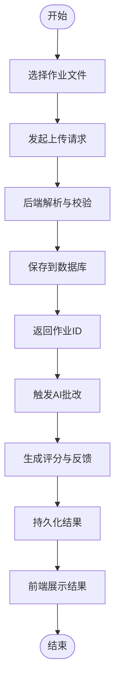
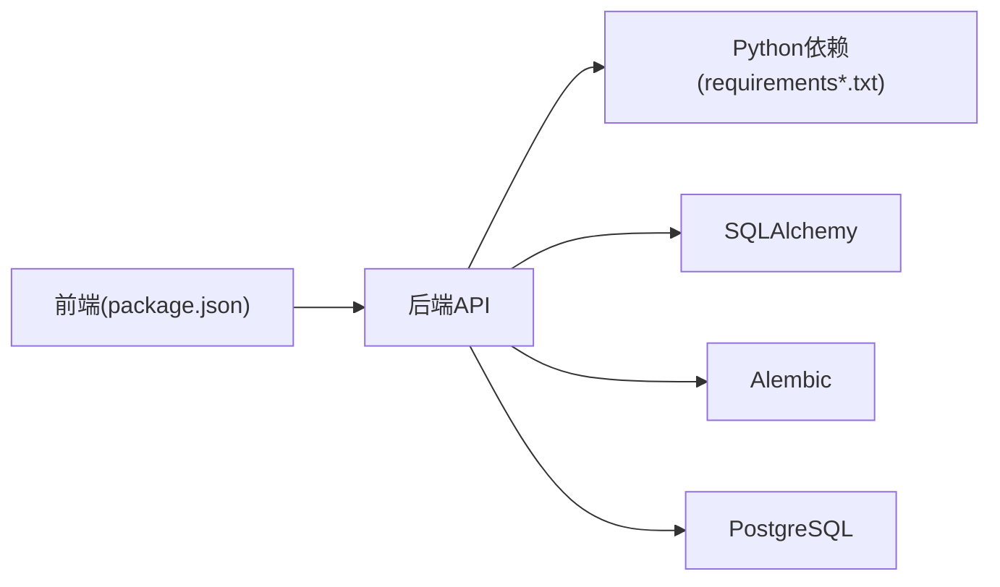

# 快速开始

<cite>
**本文引用的文件**   
- [start_dev.bat](file://start_dev.bat)
- [backend/requirements.txt](file://backend/requirements.txt)
- [backend/requirements-core.txt](file://backend/requirements-core.txt)
- [backend/app/core/config.py](file://backend/app/core/config.py)
- [backend/app/db/base.py](file://backend/app/db/base.py)
- [backend/app/db/session.py](file://backend/app/db/session.py)
- [backend/alembic.ini](file://backend/alembic.ini)
- [backend/alembic/env.py](file://backend/alembic/env.py)
- [frontend/package.json](file://frontend/package.json)
- [frontend/vite.config.ts](file://frontend/vite.config.ts)
- [frontend/src/services/api.ts](file://frontend/src/services/api.ts)
- [frontend/src/pages/Login/index.tsx](file://frontend/src/pages/Login/index.tsx)
- [frontend/src/components/UploadModal.tsx](file://frontend/src/components/UploadModal.tsx)
- [frontend/src/pages/AssignmentManagement/AssignmentRecords/index.tsx](file://frontend/src/pages/AssignmentManagement/AssignmentRecords/index.tsx)
- [frontend/src/pages/Composition/index.tsx](file://frontend/src/pages/Composition/index.tsx)
- [backend/app/api/auth.py](file://backend/app/api/auth.py)
- [backend/app/api/assignments.py](file://backend/app/api/assignments.py)
- [backend/app/api/compositions.py](file://backend/app/api/compositions.py)
- [backend/app/api/ai_tutor.py](file://backend/app/api/ai_tutor.py)
- [backend/app/services/file_upload.py](file://backend/app/services/file_upload.py)
- [backend/app/services/ai_grader.py](file://backend/app/services/ai_grader.py)
- [backend/app/services/composition_service.py](file://backend/app/services/composition_service.py)
</cite>

## 目录
1. [简介](#简介)
2. [项目结构](#项目结构)
3. [核心组件](#核心组件)
4. [架构总览](#架构总览)
5. [详细组件分析](#详细组件分析)
6. [依赖关系分析](#依赖关系分析)
7. [性能与扩展建议](#性能与扩展建议)
8. [故障排除指南](#故障排除指南)
9. [结论](#结论)
10. [附录：一键启动脚本说明](#附录一键启动脚本说明)

## 简介
本指南面向首次接触AI助教系统的用户，目标是在30分钟内完成环境准备、安装依赖、初始化数据库并成功运行前后端服务，体验“上传作业—AI批改—查看结果—AI辅导”的核心流程。文档同时提供常见问题排查方法，帮助你快速定位并解决问题。

## 项目结构
系统采用前后端分离架构：
- 后端（Python/FastAPI）：提供REST API、数据库迁移、异步任务与AI能力集成。
- 前端（React/Vite）：提供登录注册、作业上传、结果查看与AI辅导界面。
- 数据库（PostgreSQL）：持久化用户、作业、题目、对话等数据。
- 迁移工具（Alembic）：管理数据库版本与结构变更。

图表来源
- [frontend/package.json](file://frontend/package.json)
- [frontend/vite.config.ts](file://frontend/vite.config.ts)
- [frontend/src/services/api.ts](file://frontend/src/services/api.ts)
- [backend/app/db/session.py](file://backend/app/db/session.py)
- [backend/app/db/base.py](file://backend/app/db/base.py)
- [backend/alembic.ini](file://backend/alembic.ini)
- [backend/alembic/env.py](file://backend/alembic/env.py)

章节来源
- [frontend/package.json](file://frontend/package.json)
- [frontend/vite.config.ts](file://frontend/vite.config.ts)
- [backend/app/db/base.py](file://backend/app/db/base.py)
- [backend/app/db/session.py](file://backend/app/db/session.py)
- [backend/alembic.ini](file://backend/alembic.ini)
- [backend/alembic/env.py](file://backend/alembic/env.py)

## 核心组件
- 认证与授权：用户注册、登录、鉴权中间件。
- 作业管理：作业上传、解析、存储与列表查询。
- AI批改：基于服务的自动评分与反馈生成。
- 作文/口语评估：针对特定题型的处理服务。
- AI辅导：对话式辅导接口，支持上下文与提示词模板。
- 数据库与迁移：SQLAlchemy模型与Alembic迁移。
- 前端页面：登录页、作业记录、上传弹窗、AI辅导入口等。

章节来源
- [backend/app/api/auth.py](file://backend/app/api/auth.py)
- [backend/app/api/assignments.py](file://backend/app/api/assignments.py)
- [backend/app/api/compositions.py](file://backend/app/api/compositions.py)
- [backend/app/api/ai_tutor.py](file://backend/app/api/ai_tutor.py)
- [backend/app/services/ai_grader.py](file://backend/app/services/ai_grader.py)
- [backend/app/services/composition_service.py](file://backend/app/services/composition_service.py)
- [frontend/src/pages/Login/index.tsx](file://frontend/src/pages/Login/index.tsx)
- [frontend/src/components/UploadModal.tsx](file://frontend/src/components/UploadModal.tsx)
- [frontend/src/pages/AssignmentManagement/AssignmentRecords/index.tsx](file://frontend/src/pages/AssignmentManagement/AssignmentRecords/index.tsx)
- [frontend/src/pages/Composition/index.tsx](file://frontend/src/pages/Composition/index.tsx)

## 架构总览
下图展示从前端到后端的典型请求路径，以及关键服务与数据库的交互。

图表来源
- [frontend/src/pages/Login/index.tsx](file://frontend/src/pages/Login/index.tsx)
- [frontend/src/components/UploadModal.tsx](file://frontend/src/components/UploadModal.tsx)
- [frontend/src/pages/AssignmentManagement/AssignmentRecords/index.tsx](file://frontend/src/pages/AssignmentManagement/AssignmentRecords/index.tsx)
- [backend/app/api/auth.py](file://backend/app/api/auth.py)
- [backend/app/api/assignments.py](file://backend/app/api/assignments.py)
- [backend/app/services/ai_grader.py](file://backend/app/services/ai_grader.py)
- [backend/app/db/session.py](file://backend/app/db/session.py)

## 详细组件分析

### 环境与依赖要求
- Python
  - 建议使用Python 3.10+（以requirements中声明为准）。
  - 使用虚拟环境隔离依赖。
- Node.js
  - 建议使用Node.js 18+（以package.json engines或官方推荐为准）。
- PostgreSQL
  - 本地或远程均可，需创建空库并记录连接串。
- 可选：Redis/Celery（若启用异步任务）
  - 如后续开启Celery任务，请参照后端任务模块进行配置。

章节来源
- [backend/requirements.txt](file://backend/requirements.txt)
- [backend/requirements-core.txt](file://backend/requirements-core.txt)
- [frontend/package.json](file://frontend/package.json)

### 环境变量与配置
- 后端配置
  - 通过配置文件加载数据库、JWT、第三方服务等参数。
  - 常见键包括数据库URL、JWT密钥、CORS白名单、日志级别等。
- 前端配置
  - Vite构建配置与代理设置，便于开发时转发至后端。
  - API基础地址由前端服务统一维护。

章节来源
- [backend/app/core/config.py](file://backend/app/core/config.py)
- [frontend/vite.config.ts](file://frontend/vite.config.ts)
- [frontend/src/services/api.ts](file://frontend/src/services/api.ts)

### 数据库与迁移
- 数据库会话
  - 使用SQLAlchemy建立连接与会话生命周期管理。
- 迁移工具
  - Alembic负责DDL版本控制；env.py用于加载配置与引擎。
- 初始化步骤
  - 创建数据库与用户。
  - 执行迁移命令生成表结构。

章节来源
- [backend/app/db/base.py](file://backend/app/db/base.py)
- [backend/app/db/session.py](file://backend/app/db/session.py)
- [backend/alembic.ini](file://backend/alembic.ini)
- [backend/alembic/env.py](file://backend/alembic/env.py)

### 认证与登录流程
- 登录接口
  - 接收用户名/密码，校验成功后返回访问令牌。
- 前端登录页
  - 调用登录接口，保存令牌并在后续请求头携带。

图表来源
- [frontend/src/pages/Login/index.tsx](file://frontend/src/pages/Login/index.tsx)
- [backend/app/api/auth.py](file://backend/app/api/auth.py)
- [backend/app/db/session.py](file://backend/app/db/session.py)

章节来源
- [frontend/src/pages/Login/index.tsx](file://frontend/src/pages/Login/index.tsx)
- [backend/app/api/auth.py](file://backend/app/api/auth.py)

### 作业上传与AI批改
- 上传流程
  - 前端上传弹窗选择文件，调用后端上传接口。
  - 后端解析文件、落库并返回作业ID。
- AI批改
  - 根据作业内容调用AI批改服务，生成评分与反馈。
  - 结果可持久化并供前端展示。

图表来源
- [frontend/src/components/UploadModal.tsx](file://frontend/src/components/UploadModal.tsx)
- [backend/app/api/assignments.py](file://backend/app/api/assignments.py)
- [backend/app/services/file_upload.py](file://backend/app/services/file_upload.py)
- [backend/app/services/ai_grader.py](file://backend/app/services/ai_grader.py)
- [backend/app/db/session.py](file://backend/app/db/session.py)

章节来源
- [frontend/src/components/UploadModal.tsx](file://frontend/src/components/UploadModal.tsx)
- [backend/app/api/assignments.py](file://backend/app/api/assignments.py)
- [backend/app/services/file_upload.py](file://backend/app/services/file_upload.py)
- [backend/app/services/ai_grader.py](file://backend/app/services/ai_grader.py)

### 查看作业记录与结果
- 作业记录页
  - 列出当前用户的作业与状态。
  - 点击某条记录可查看AI批改详情。
- 数据来源
  - 后端提供作业列表与详情接口，前端按状态渲染。

章节来源
- [frontend/src/pages/AssignmentManagement/AssignmentRecords/index.tsx](file://frontend/src/pages/AssignmentManagement/AssignmentRecords/index.tsx)
- [backend/app/api/assignments.py](file://backend/app/api/assignments.py)

### AI辅导功能
- 作文/口语评估
  - 针对特定题型提供结构化评估与改进建议。
- 对话式辅导
  - 基于提示词与上下文，提供交互式答疑。

章节来源
- [frontend/src/pages/Composition/index.tsx](file://frontend/src/pages/Composition/index.tsx)
- [backend/app/api/compositions.py](file://backend/app/api/compositions.py)
- [backend/app/services/composition_service.py](file://backend/app/services/composition_service.py)
- [backend/app/api/ai_tutor.py](file://backend/app/api/ai_tutor.py)

## 依赖关系分析
- 后端依赖
  - FastAPI、SQLAlchemy、Alembic、Pydantic、认证相关库等。
- 前端依赖
  - React、Vite、TypeScript、HTTP客户端等。
- 外部依赖
  - PostgreSQL（必需），可选Redis/Celery（若启用异步任务）。

图表来源
- [frontend/package.json](file://frontend/package.json)
- [backend/requirements.txt](file://backend/requirements.txt)
- [backend/requirements-core.txt](file://backend/requirements-core.txt)
- [backend/app/db/session.py](file://backend/app/db/session.py)
- [backend/alembic.ini](file://backend/alembic.ini)

章节来源
- [frontend/package.json](file://frontend/package.json)
- [backend/requirements.txt](file://backend/requirements.txt)
- [backend/requirements-core.txt](file://backend/requirements-core.txt)

## 性能与扩展建议
- 数据库
  - 为高频查询字段添加索引；合理分页与缓存热点数据。
- 文件上传
  - 大文件分片上传与断点续传；限制单文件大小与类型。
- AI服务
  - 对耗时操作使用异步队列（如Celery）；实现重试与超时策略。
- 前端
  - 路由懒加载与图片压缩；合理使用缓存与去抖节流。

[本节为通用建议，不直接分析具体文件]

## 故障排除指南
- 无法连接数据库
  - 检查数据库URL、端口、用户名与密码是否正确。
  - 确认数据库已创建且权限允许。
- 迁移失败
  - 检查alembic配置与环境变量是否生效。
  - 清理重复迁移或回滚到稳定版本后再试。
- 登录失败
  - 确认用户是否存在、密码是否正确。
  - 检查JWT密钥与CORS配置。
- 上传报错
  - 检查文件格式与大小限制。
  - 查看后端日志中的解析错误堆栈。
- 前端无法访问后端
  - 检查Vite代理或API基础地址配置。
  - 确认后端服务已启动且监听端口可达。

章节来源
- [backend/app/core/config.py](file://backend/app/core/config.py)
- [backend/alembic.ini](file://backend/alembic.ini)
- [backend/alembic/env.py](file://backend/alembic/env.py)
- [frontend/vite.config.ts](file://frontend/vite.config.ts)
- [frontend/src/services/api.ts](file://frontend/src/services/api.ts)

## 结论
按照本指南完成环境准备、依赖安装、数据库初始化与服务启动后，你将能够在30分钟内体验AI助教系统的核心能力：注册登录、上传作业、查看AI批改结果与使用AI辅导。如遇问题，请参考故障排除部分逐步定位。

## 附录：一键启动脚本说明
- 脚本位置
  - 仓库根目录提供一键启动脚本，用于简化本地开发环境的启动流程。
- 使用方法
  - 双击运行脚本或在命令行执行，脚本会依次启动后端与前端服务。
  - 首次运行前请确保已完成数据库初始化与必要的环境变量配置。
- 注意事项
  - 若端口被占用，请在脚本或对应服务配置中修改端口。
  - 如需后台运行或容器化部署，请参考各服务的独立启动方式。

章节来源
- [start_dev.bat](file://start_dev.bat)