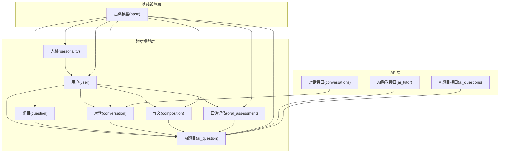
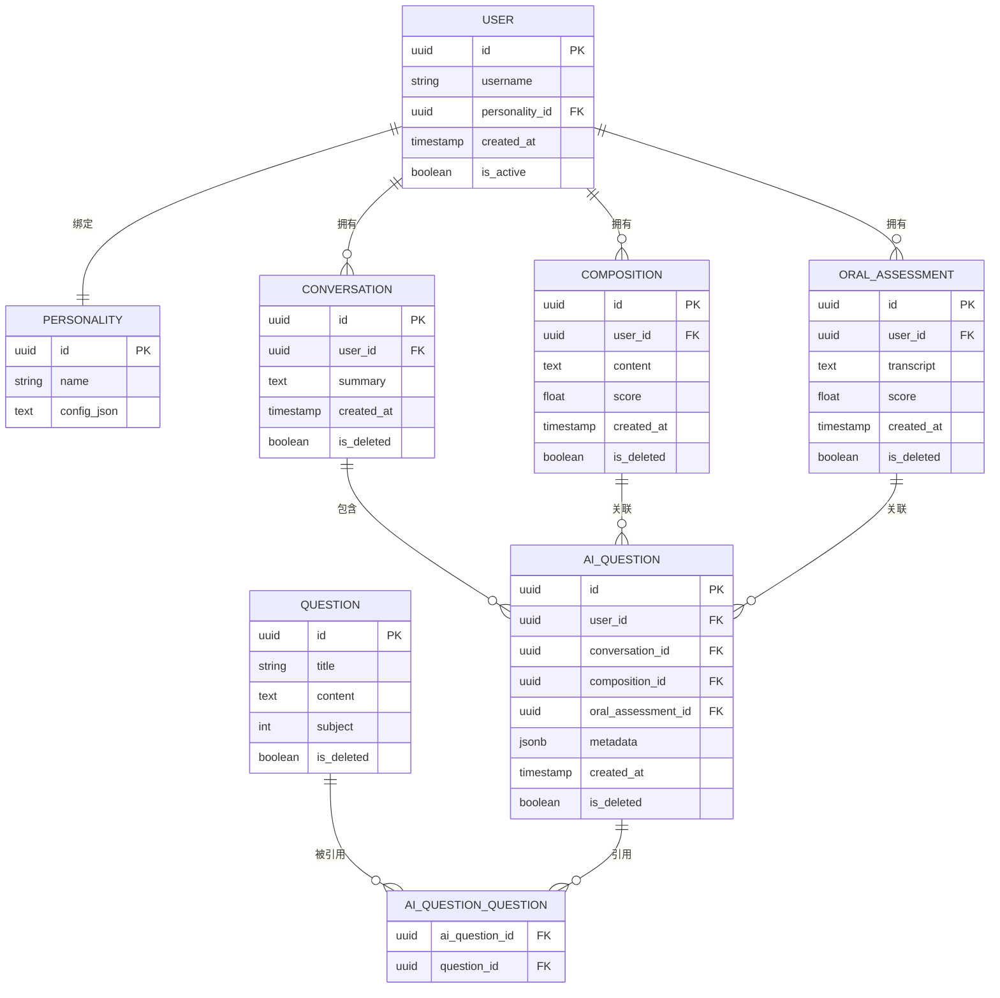
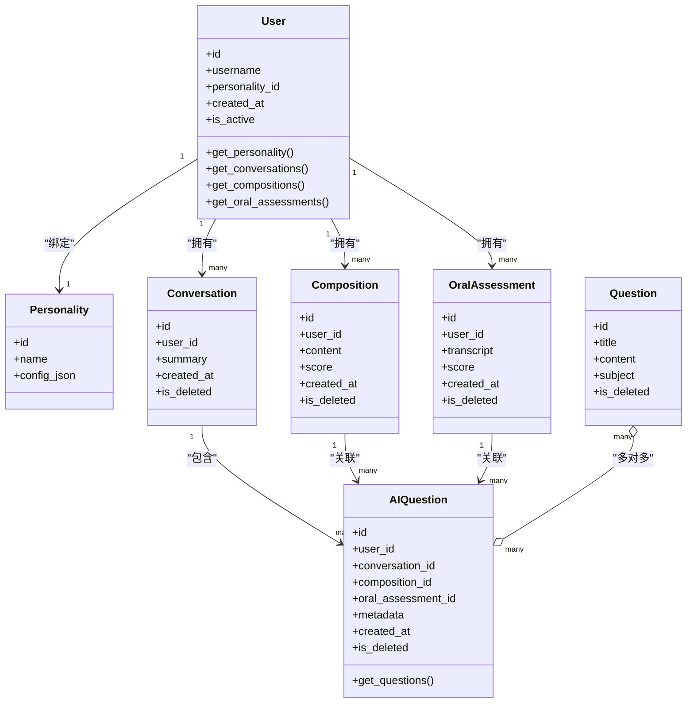
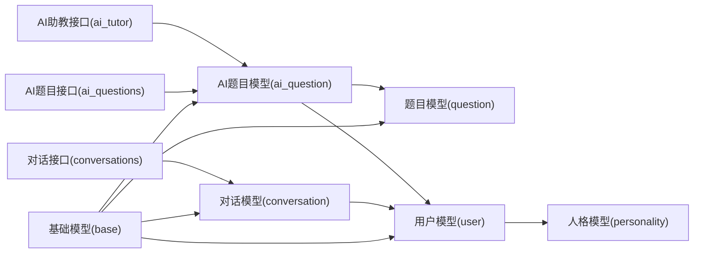

# 关系映射设计

<cite>
**本文引用的文件**   
- [backend/app/models/user.py](file://backend/app/models/user.py)
- [backend/app/models/ai_question.py](file://backend/app/models/ai_question.py)
- [backend/app/models/question.py](file://backend/app/models/question.py)
- [backend/app/models/conversation.py](file://backend/app/models/conversation.py)
- [backend/app/models/composition.py](file://backend/app/models/composition.py)
- [backend/app/models/oral_assessment.py](file://backend/app/models/oral_assessment.py)
- [backend/app/models/personality.py](file://backend/app/models/personality.py)
- [backend/app/models/__init__.py](file://backend/app/models/__init__.py)
- [backend/app/db/base.py](file://backend/app/db/base.py)
- [backend/app/api/v1/ai_tutor.py](file://backend/app/api/v1/ai_tutor.py)
- [backend/app/api/v1/ai_questions.py](file://backend/app/api/v1/ai_questions.py)
- [backend/app/api/v1/conversations.py](file://backend/app/api/v1/conversations.py)
</cite>

## 目录
1. [引言](#引言)
2. [项目结构](#项目结构)
3. [核心组件](#核心组件)
4. [架构总览](#架构总览)
5. [详细组件分析](#详细组件分析)
6. [依赖分析](#依赖分析)
7. [性能考虑](#性能考虑)
8. [故障排查指南](#故障排查指南)
9. [结论](#结论)
10. [附录](#附录)

## 引言
本文件聚焦于AI助教系统的“关系映射设计”，围绕实体间的一对一、一对多、多对多关联，外键约束与级联策略，SQLAlchemy的relationship()配置与反向引用backref，以及JOIN条件定义进行系统化说明。同时给出典型查询场景下的加载策略（lazy/eager/selectin），复杂查询的JOIN优化方案与N+1问题规避方法，并补充多租户隔离、软删除与历史版本管理的关系设计模式与调优建议。

## 项目结构
后端采用分层组织：models层定义ORM模型与关系；db层提供基础模型与会话；api层暴露接口并在服务中组合查询。关系映射主要位于backend/app/models下，结合base.py中的公共字段与约束实现统一的数据完整性控制。

图表来源
- [backend/app/models/user.py](file://backend/app/models/user.py)
- [backend/app/models/ai_question.py](file://backend/app/models/ai_question.py)
- [backend/app/models/question.py](file://backend/app/models/question.py)
- [backend/app/models/conversation.py](file://backend/app/models/conversation.py)
- [backend/app/models/composition.py](file://backend/app/models/composition.py)
- [backend/app/models/oral_assessment.py](file://backend/app/models/oral_assessment.py)
- [backend/app/models/personality.py](file://backend/app/models/personality.py)
- [backend/app/db/base.py](file://backend/app/db/base.py)
- [backend/app/api/v1/ai_tutor.py](file://backend/app/api/v1/ai_tutor.py)
- [backend/app/api/v1/ai_questions.py](file://backend/app/api/v1/ai_questions.py)
- [backend/app/api/v1/conversations.py](file://backend/app/api/v1/conversations.py)

章节来源
- [backend/app/models/__init__.py](file://backend/app/models/__init__.py)
- [backend/app/db/base.py](file://backend/app/db/base.py)

## 核心组件
本节从关系类型、外键与级联、relationship/backref、JOIN条件等维度梳理关键设计要点，并结合具体模型文件定位实现位置。

- 一对一关系
  - 用户与人格：一个用户对应一个人格配置，用于个性化提示词与交互风格。
  - 典型实现要点：在目标端使用ForeignKey指向主表主键，并通过relationship配置单向或双向访问；若需强一致性，可设置unique=True或唯一索引。
  - 参考路径
    - [backend/app/models/user.py](file://backend/app/models/user.py)
    - [backend/app/models/personality.py](file://backend/app/models/personality.py)

- 一对多关系
  - 用户到对话、用户到作文、用户到口语评估：一个用户可以产生多条对话记录、多篇作文、多次口语评估。
  - 典型实现要点：在子表通过外键引用父表主键；在父表使用relationship建立集合属性；必要时配置cascade以支持级联删除或更新。
  - 参考路径
    - [backend/app/models/conversation.py](file://backend/app/models/conversation.py)
    - [backend/app/models/composition.py](file://backend/app/models/composition.py)
    - [backend/app/models/oral_assessment.py](file://backend/app/models/oral_assessment.py)

- 多对多关系
  - AI题目与题目：一道AI题目可能由多个标准题目组合生成，一道标准题目也可能被多道AI题目复用。
  - 典型实现要点：引入中间表存储两表主键；在两端使用relationship配合secondary参数建立多对多；如需额外元数据（如权重、来源时间），可在中间表增加列并改为两个一对多关系。
  - 参考路径
    - [backend/app/models/ai_question.py](file://backend/app/models/ai_question.py)
    - [backend/app/models/question.py](file://backend/app/models/question.py)

- 外键约束与级联操作
  - 外键：确保引用完整性，避免孤儿记录。
  - 级联：根据业务选择ondelete/onupdate策略，例如删除用户时级联删除其对话、作文、评估；谨慎使用级联更新以避免大范围锁。
  - 参考路径
    - [backend/app/models/user.py](file://backend/app/models/user.py)
    - [backend/app/models/conversation.py](file://backend/app/models/conversation.py)
    - [backend/app/models/composition.py](file://backend/app/models/composition.py)
    - [backend/app/models/oral_assessment.py](file://backend/app/models/oral_assessment.py)

- relationship()与backref
  - 在父表定义relationship，指定子表类名与外键；使用backref在子表自动生成反向属性，简化双向访问。
  - 注意：避免在同一关系中重复声明backref与显式反向relationship，防止冲突。
  - 参考路径
    - [backend/app/models/user.py](file://backend/app/models/user.py)
    - [backend/app/models/ai_question.py](file://backend/app/models/ai_question.py)

- JOIN条件定义
  - 自定义join_condition可用于限定关联范围（如仅加载未删除的记录、仅加载当前租户数据）。
  - 在多租户场景下，建议在基类或会话层注入tenant_id过滤，或在relationship中通过primaryjoin附加条件。
  - 参考路径
    - [backend/app/db/base.py](file://backend/app/db/base.py)

章节来源
- [backend/app/models/user.py](file://backend/app/models/user.py)
- [backend/app/models/personality.py](file://backend/app/models/personality.py)
- [backend/app/models/conversation.py](file://backend/app/models/conversation.py)
- [backend/app/models/composition.py](file://backend/app/models/composition.py)
- [backend/app/models/oral_assessment.py](file://backend/app/models/oral_assessment.py)
- [backend/app/models/ai_question.py](file://backend/app/models/ai_question.py)
- [backend/app/models/question.py](file://backend/app/models/question.py)
- [backend/app/db/base.py](file://backend/app/db/base.py)

## 架构总览
下图展示AI助教系统核心实体及其关系，包括一对一、一对多与多对多，并标注了常见的外键与级联方向。

图表来源
- [backend/app/models/user.py](file://backend/app/models/user.py)
- [backend/app/models/personality.py](file://backend/app/models/personality.py)
- [backend/app/models/question.py](file://backend/app/models/question.py)
- [backend/app/models/ai_question.py](file://backend/app/models/ai_question.py)
- [backend/app/models/conversation.py](file://backend/app/models/conversation.py)
- [backend/app/models/composition.py](file://backend/app/models/composition.py)
- [backend/app/models/oral_assessment.py](file://backend/app/models/oral_assessment.py)

## 详细组件分析

### 用户与人格（一对一）
- 关系描述：每个用户绑定一个人格配置，人格作为全局或租户内共享的配置实体。
- 外键与约束：user.personality_id为唯一外键，保证一对一；可选添加唯一索引提升查询性能。
- 加载策略：默认懒加载；在需要批量渲染用户列表时，建议使用joinedload或selectinload预加载人格信息，避免N+1。
- 参考路径
  - [backend/app/models/user.py](file://backend/app/models/user.py)
  - [backend/app/models/personality.py](file://backend/app/models/personality.py)

章节来源
- [backend/app/models/user.py](file://backend/app/models/user.py)
- [backend/app/models/personality.py](file://backend/app/models/personality.py)

### 用户与对话、作文、口语评估（一对多）
- 关系描述：用户是主体，对话、作文、口语评估均为用户的产出物。
- 外键与级联：子表通过user_id外键引用用户；删除用户时可级联删除其所有相关记录，确保数据一致性。
- 加载策略：列表页通常只展示摘要，按需懒加载详情；详情页使用joinedload一次性加载完整对象树。
- 参考路径
  - [backend/app/models/conversation.py](file://backend/app/models/conversation.py)
  - [backend/app/models/composition.py](file://backend/app/models/composition.py)
  - [backend/app/models/oral_assessment.py](file://backend/app/models/oral_assessment.py)

章节来源
- [backend/app/models/conversation.py](file://backend/app/models/conversation.py)
- [backend/app/models/composition.py](file://backend/app/models/composition.py)
- [backend/app/models/oral_assessment.py](file://backend/app/models/oral_assessment.py)

### AI题目与题目（多对多）
- 关系描述：AI题目由若干标准题目组合而成，标准题目可被多个AI题目复用。
- 中间表：AI_QUESTION_QUESTION保存ai_question_id与question_id，可扩展字段如权重、来源时间等。
- 加载策略：获取AI题目详情时，使用selectinload加载其关联的标准题目集合，避免逐条查询。
- 参考路径
  - [backend/app/models/ai_question.py](file://backend/app/models/ai_question.py)
  - [backend/app/models/question.py](file://backend/app/models/question.py)

章节来源
- [backend/app/models/ai_question.py](file://backend/app/models/ai_question.py)
- [backend/app/models/question.py](file://backend/app/models/question.py)

### 关系图（代码级）

图表来源
- [backend/app/models/user.py](file://backend/app/models/user.py)
- [backend/app/models/personality.py](file://backend/app/models/personality.py)
- [backend/app/models/conversation.py](file://backend/app/models/conversation.py)
- [backend/app/models/composition.py](file://backend/app/models/composition.py)
- [backend/app/models/oral_assessment.py](file://backend/app/models/oral_assessment.py)
- [backend/app/models/question.py](file://backend/app/models/question.py)
- [backend/app/models/ai_question.py](file://backend/app/models/ai_question.py)

## 依赖分析
- 模块耦合
  - API层依赖models层进行数据读取与写入；models层依赖db.base的基础字段与约束。
  - 关系加载策略通常在API或服务层通过query选项控制，避免在模型内部硬编码加载方式。
- 外部依赖
  - SQLAlchemy ORM负责关系映射与SQL生成；数据库驱动负责执行与结果集返回。
- 潜在循环依赖
  - 避免在__init__.py中直接导入所有模型导致循环；推荐延迟导入或使用包级注册。

图表来源
- [backend/app/api/v1/ai_tutor.py](file://backend/app/api/v1/ai_tutor.py)
- [backend/app/api/v1/ai_questions.py](file://backend/app/api/v1/ai_questions.py)
- [backend/app/api/v1/conversations.py](file://backend/app/api/v1/conversations.py)
- [backend/app/models/ai_question.py](file://backend/app/models/ai_question.py)
- [backend/app/models/question.py](file://backend/app/models/question.py)
- [backend/app/models/conversation.py](file://backend/app/models/conversation.py)
- [backend/app/models/user.py](file://backend/app/models/user.py)
- [backend/app/models/personality.py](file://backend/app/models/personality.py)
- [backend/app/db/base.py](file://backend/app/db/base.py)

章节来源
- [backend/app/models/__init__.py](file://backend/app/models/__init__.py)
- [backend/app/db/base.py](file://backend/app/db/base.py)

## 性能考虑
- 加载策略
  - lazy loading：默认按需加载，适合小对象或低频访问；在列表页避免触发深层关系。
  - eager loading（joinedload）：单次JOIN拉取关联对象，减少往返次数；适合详情页或已知需要关联数据的场景。
  - selectin loading：分两次查询，先主后次，避免大表JOIN膨胀；适合一对多集合较大且需要分页的场景。
- N+1问题规避
  - 在批量查询用户与其人格、对话、作文、评估时，使用joinedload或selectinload预加载。
  - 多对多集合（AI题目与题目）优先selectinload，避免逐条查询题目内容。
- JOIN优化
  - 合理选择连接类型：INNER JOIN用于必须存在的关系，LEFT OUTER JOIN用于可选关系。
  - 在relationship中使用join_condition限制范围（如仅加载未删除记录），减少无效数据参与JOIN。
  - 为常用过滤字段建立索引（如user_id、conversation_id、is_deleted、subject等）。
- 事务与锁
  - 批量更新尽量分批提交，降低长事务持有锁的时间。
  - 谨慎使用级联更新，优先应用逻辑更新与审计字段。

[本节为通用性能指导，不直接分析具体文件]

## 故障排查指南
- 常见问题
  - N+1查询：列表页响应慢，检查是否缺少joinedload/selectinload。
  - 外键约束失败：插入或更新时报引用完整性错误，确认外键值是否存在。
  - 循环导入：启动时报ImportError，检查__init__.py与模型导入顺序。
  - 软删除污染：查询结果包含已删除记录，确认是否在查询或relationship中追加is_deleted=false条件。
- 调试建议
  - 开启SQL日志观察实际生成的SQL语句，定位多余JOIN或缺少预加载。
  - 使用explain分析复杂查询的执行计划，关注全表扫描与缺失索引。
  - 在单元测试中构造最小数据集验证关系加载行为与级联效果。

章节来源
- [backend/app/db/base.py](file://backend/app/db/base.py)
- [backend/app/models/user.py](file://backend/app/models/user.py)
- [backend/app/models/ai_question.py](file://backend/app/models/ai_question.py)
- [backend/app/models/conversation.py](file://backend/app/models/conversation.py)
- [backend/app/models/composition.py](file://backend/app/models/composition.py)
- [backend/app/models/oral_assessment.py](file://backend/app/models/oral_assessment.py)
- [backend/app/models/question.py](file://backend/app/models/question.py)

## 结论
本设计围绕用户、题目、AI题目、对话、作文、口语评估与人格等核心实体，构建了一对一、一对多与多对多的关系网络。通过明确的外键约束、合理的级联策略、灵活的relationship与backref配置，以及基于场景的加载策略与JOIN优化，系统在功能正确性与性能之间取得平衡。针对多租户隔离、软删除与历史版本管理等进阶需求，可通过基类字段、关系join_condition与版本化表结构进一步扩展。

[本节为总结性内容，不直接分析具体文件]

## 附录

### 典型查询场景与加载策略
- 用户列表+人格信息：selectinload(User.personality)
- 用户详情+全部对话：joinedload(User.conversations)
- AI题目详情+关联题目集合：selectinload(AIQuestion.questions)
- 按科目筛选题目并分页：在Question上添加subject索引，使用limit/offset或游标分页

章节来源
- [backend/app/api/v1/ai_tutor.py](file://backend/app/api/v1/ai_tutor.py)
- [backend/app/api/v1/ai_questions.py](file://backend/app/api/v1/ai_questions.py)
- [backend/app/api/v1/conversations.py](file://backend/app/api/v1/conversations.py)

### 多租户数据隔离
- 方案A：在每表增加tenant_id字段，查询时强制附加tenant_id条件。
- 方案B：在relationship的primaryjoin中附加tenant_id条件，自动隔离。
- 方案C：使用行级安全（RLS）在数据库侧强制隔离。

[本节为概念性说明，不直接分析具体文件]

### 软删除实现
- 在基类或各模型增加is_deleted布尔字段。
- 在查询与relationship中统一追加is_deleted=false条件。
- 删除操作改为标记删除，保留审计与恢复能力。

章节来源
- [backend/app/db/base.py](file://backend/app/db/base.py)
- [backend/app/models/question.py](file://backend/app/models/question.py)
- [backend/app/models/ai_question.py](file://backend/app/models/ai_question.py)
- [backend/app/models/conversation.py](file://backend/app/models/conversation.py)
- [backend/app/models/composition.py](file://backend/app/models/composition.py)
- [backend/app/models/oral_assessment.py](file://backend/app/models/oral_assessment.py)

### 历史版本管理
- 版本化表：为关键实体创建*_history表，记录变更快照。
- 触发器或应用层拦截：在INSERT/UPDATE/DELETE时同步写入历史表。
- 关系映射：在ORM中维护主表与历史表的映射，便于回溯与对比。

[本节为概念性说明，不直接分析具体文件]