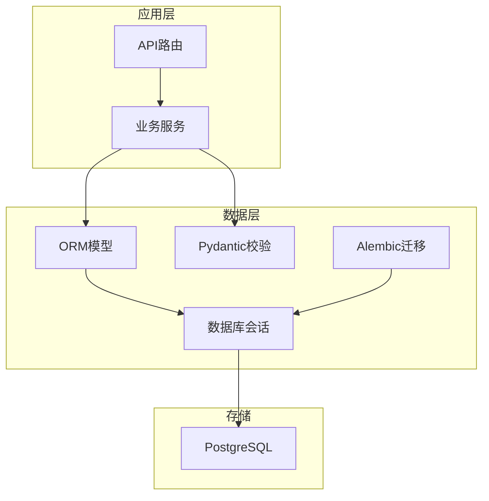
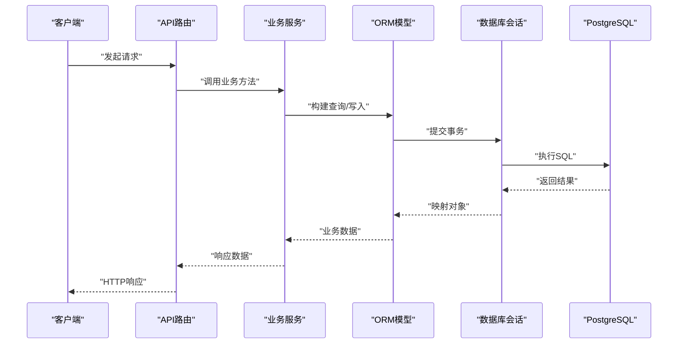
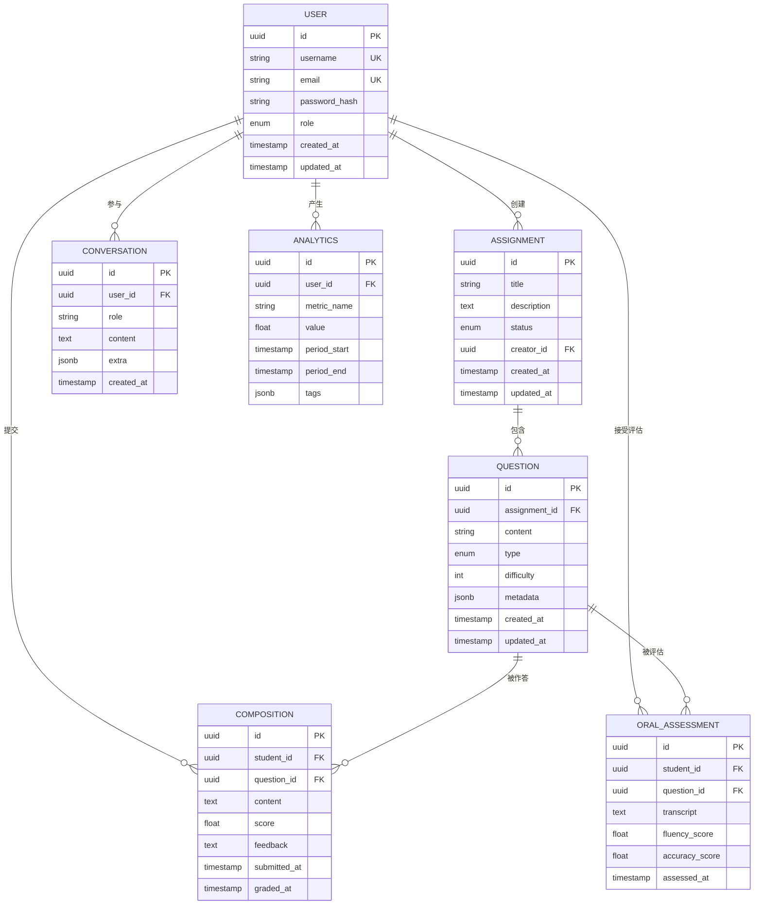
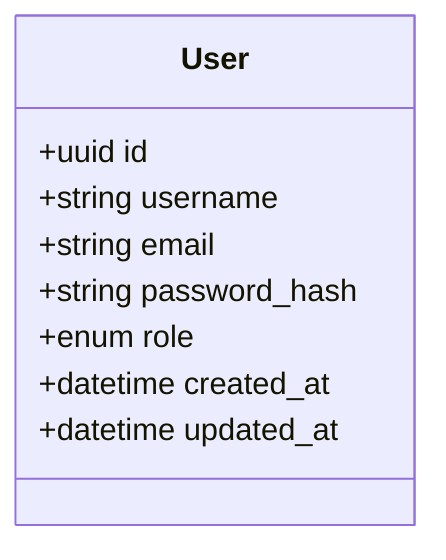
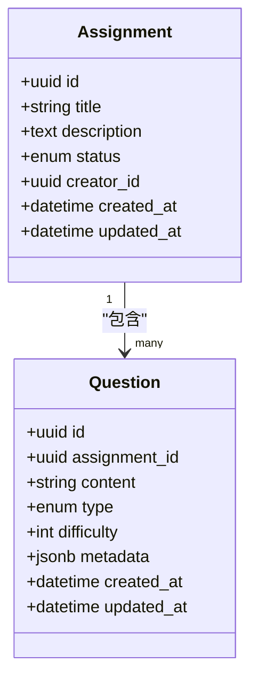
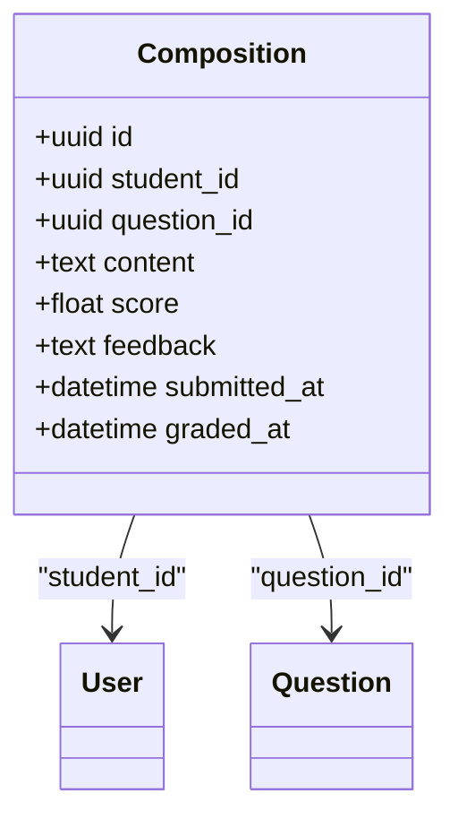
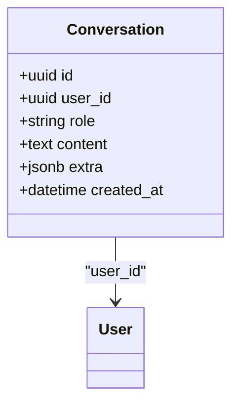
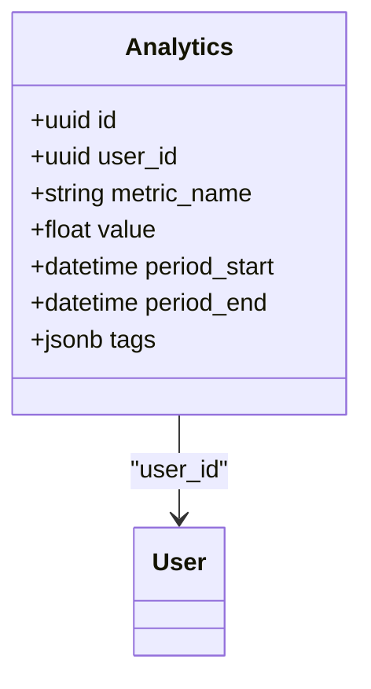
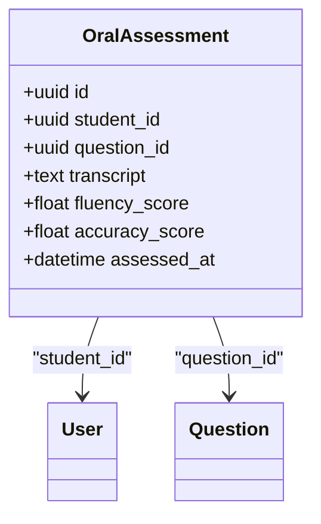
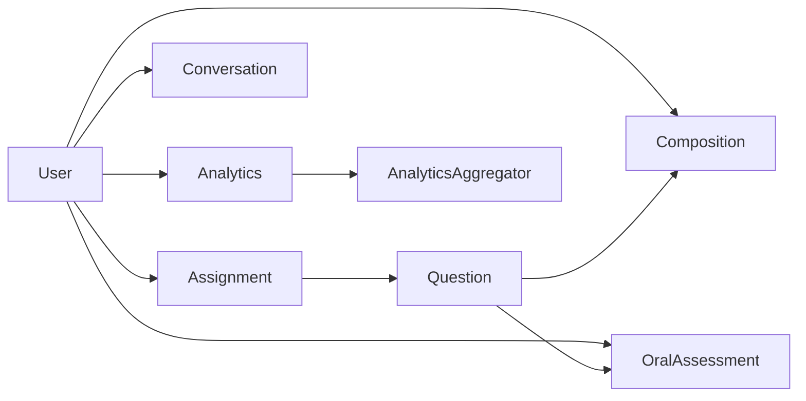

# 数据库设计

<cite>
**本文引用的文件**   
- [backend/app/models/user.py](file://backend/app/models/user.py)
- [backend/app/models/assignment.py](file://backend/app/models/assignment.py)
- [backend/app/models/question.py](file://backend/app/models/question.py)
- [backend/app/models/composition.py](file://backend/app/models/composition.py)
- [backend/app/models/conversation.py](file://backend/app/models/conversation.py)
- [backend/app/models/oral_assessment.py](file://backend/app/models/oral_assessment.py)
- [backend/app/schemas/analytics.py](file://backend/app/schemas/analytics.py)
- [backend/app/services/analytics_aggregator.py](file://backend/app/services/analytics_aggregator.py)
- [backend/app/db/base.py](file://backend/app/db/base.py)
- [backend/app/db/session.py](file://backend/app/db/session.py)
- [backend/alembic/env.py](file://backend/alembic/env.py)
- [backend/alembic.ini](file://backend/alembic.ini)
</cite>

## 目录
1. [引言](#引言)
2. [项目结构](#项目结构)
3. [核心组件](#核心组件)
4. [架构总览](#架构总览)
5. [详细组件分析](#详细组件分析)
6. [依赖关系分析](#依赖关系分析)
7. [性能考虑](#性能考虑)
8. [故障排查指南](#故障排查指南)
9. [结论](#结论)
10. [附录](#附录)

## 引言
本文件面向AI助教系统的数据库设计与实现，聚焦于基于PostgreSQL的持久化层。文档覆盖实体关系图（ERD）、表结构与字段定义、主外键与索引策略、查询优化、数据完整性约束与业务规则验证、数据生命周期管理、迁移策略（Alembic）、备份恢复方案、性能监控指标、数据访问模式、缓存策略以及分库分表考量。目标是帮助读者快速理解系统的数据模型与运维要点，并在实际工程中高效落地。

## 项目结构
后端采用分层架构：API层调用服务层，服务层通过SQLAlchemy ORM访问数据库；数据模型位于models目录，Pydantic校验在schemas目录，数据库会话与基类在db目录，迁移由Alembic管理。

图表来源
- [backend/app/api/v1/ai_tutor.py](file://backend/app/api/v1/ai_tutor.py)
- [backend/app/services/analytics_aggregator.py](file://backend/app/services/analytics_aggregator.py)
- [backend/app/models/user.py](file://backend/app/models/user.py)
- [backend/app/db/session.py](file://backend/app/db/session.py)
- [backend/alembic/env.py](file://backend/alembic/env.py)

章节来源
- [backend/app/db/base.py](file://backend/app/db/base.py)
- [backend/app/db/session.py](file://backend/app/db/session.py)
- [backend/alembic/env.py](file://backend/alembic/env.py)
- [backend/alembic.ini](file://backend/alembic.ini)

## 核心组件
本节概述六大核心数据模型及其职责：
- User用户模型：用户身份、角色与基础信息。
- Assignment作业模型：作业元数据、版本与状态。
- Question题目模型：题目内容、类型、难度与关联的作业。
- Composition作文模型：学生提交的作文文本、评分与反馈。
- Conversation对话模型：师生或人机交互消息序列。
- Analytics分析模型：学习行为与分析指标的聚合结果。

章节来源
- [backend/app/models/user.py](file://backend/app/models/user.py)
- [backend/app/models/assignment.py](file://backend/app/models/assignment.py)
- [backend/app/models/question.py](file://backend/app/models/question.py)
- [backend/app/models/composition.py](file://backend/app/models/composition.py)
- [backend/app/models/conversation.py](file://backend/app/models/conversation.py)
- [backend/app/schemas/analytics.py](file://backend/app/schemas/analytics.py)

## 架构总览
下图展示从API到数据库的整体数据流，包括会话管理与迁移入口。

图表来源
- [backend/app/api/v1/ai_tutor.py](file://backend/app/api/v1/ai_tutor.py)
- [backend/app/services/analytics_aggregator.py](file://backend/app/services/analytics_aggregator.py)
- [backend/app/db/session.py](file://backend/app/db/session.py)

## 详细组件分析

### 实体关系图（ERD）
以下ERD展示了核心实体及主要关系。为便于阅读，仅列出关键字段与关系。

图表来源
- [backend/app/models/user.py](file://backend/app/models/user.py)
- [backend/app/models/assignment.py](file://backend/app/models/assignment.py)
- [backend/app/models/question.py](file://backend/app/models/question.py)
- [backend/app/models/composition.py](file://backend/app/models/composition.py)
- [backend/app/models/conversation.py](file://backend/app/models/conversation.py)
- [backend/app/models/oral_assessment.py](file://backend/app/models/oral_assessment.py)
- [backend/app/schemas/analytics.py](file://backend/app/schemas/analytics.py)

#### 表结构与字段定义（摘要）
- 用户表（User）
  - 主键：id（UUID）
  - 唯一：username、email
  - 密码哈希：password_hash
  - 角色：role（如student/teacher/admin）
  - 时间戳：created_at、updated_at
- 作业表（Assignment）
  - 主键：id（UUID）
  - 标题、描述、状态
  - 创建者：creator_id（外键→User）
  - 时间戳：created_at、updated_at
- 题目表（Question）
  - 主键：id（UUID）
  - 所属作业：assignment_id（外键→Assignment）
  - 内容、类型、难度
  - 扩展元数据：metadata（JSONB）
  - 时间戳：created_at、updated_at
- 作文表（Composition）
  - 主键：id（UUID）
  - 学生：student_id（外键→User）
  - 题目：question_id（外键→Question）
  - 内容、分数、反馈
  - 提交与批改时间：submitted_at、graded_at
- 对话表（Conversation）
  - 主键：id（UUID）
  - 参与者：user_id（外键→User）
  - 角色：role（system/user/assistant）
  - 内容、扩展信息：extra（JSONB）
  - 时间戳：created_at
- 分析表（Analytics）
  - 主键：id（UUID）
  - 用户：user_id（外键→User）
  - 指标名、数值、周期起止、标签：tags（JSONB）
- 口语评估表（OralAssessment）
  - 主键：id（UUID）
  - 学生：student_id（外键→User）
  - 题目：question_id（外键→Question）
  - 转录文本、流利度与准确度分数、评估时间

章节来源
- [backend/app/models/user.py](file://backend/app/models/user.py)
- [backend/app/models/assignment.py](file://backend/app/models/assignment.py)
- [backend/app/models/question.py](file://backend/app/models/question.py)
- [backend/app/models/composition.py](file://backend/app/models/composition.py)
- [backend/app/models/conversation.py](file://backend/app/models/conversation.py)
- [backend/app/models/oral_assessment.py](file://backend/app/models/oral_assessment.py)
- [backend/app/schemas/analytics.py](file://backend/app/schemas/analytics.py)

#### 主键与外键关系
- 一对一/一对多
  - User → Assignment（一个用户可创建多个作业）
  - Assignment → Question（一个作业包含多个题目）
  - User → Composition（一个用户提交多篇作文）
  - Question → Composition（一道题对应多篇作文）
  - User → Conversation（一个用户有多条对话记录）
  - User → Analytics（一个用户有多个分析指标）
  - User → OralAssessment（一个用户有多次口语评估）
  - Question → OralAssessment（一道题可被多次评估）
- 约束建议
  - 所有外键均使用ON DELETE RESTRICT或CASCADE（根据业务语义选择），避免误删重要数据。
  - 对频繁查询的外键列建立索引。

章节来源
- [backend/app/models/user.py](file://backend/app/models/user.py)
- [backend/app/models/assignment.py](file://backend/app/models/assignment.py)
- [backend/app/models/question.py](file://backend/app/models/question.py)
- [backend/app/models/composition.py](file://backend/app/models/composition.py)
- [backend/app/models/conversation.py](file://backend/app/models/conversation.py)
- [backend/app/models/oral_assessment.py](file://backend/app/models/oral_assessment.py)

#### 索引设计策略
- 唯一索引
  - User.username、User.email
- 常用查询索引
  - Assignment.creator_id
  - Question.assignment_id
  - Composition.student_id、Composition.question_id
  - Conversation.user_id
  - Analytics.user_id、Analytics.metric_name、Analytics.period_start/end
  - OralAssessment.student_id、OralAssessment.question_id
- 复合索引
  - (Composition.student_id, Composition.submitted_at)
  - (Analytics.user_id, Analytics.metric_name, Analytics.period_start)
  - (Conversation.user_id, Conversation.created_at)
- JSONB索引
  - 针对metadata/tags等JSONB字段，按需建立GIN索引以支持包含/存在查询。

章节来源
- [backend/app/models/user.py](file://backend/app/models/user.py)
- [backend/app/models/assignment.py](file://backend/app/models/assignment.py)
- [backend/app/models/question.py](file://backend/app/models/question.py)
- [backend/app/models/composition.py](file://backend/app/models/composition.py)
- [backend/app/models/conversation.py](file://backend/app/models/conversation.py)
- [backend/app/models/oral_assessment.py](file://backend/app/models/oral_assessment.py)
- [backend/app/schemas/analytics.py](file://backend/app/schemas/analytics.py)

#### 查询优化方案
- 分页与游标
  - 对列表接口使用LIMIT/OFFSET或基于时间戳的游标分页，避免深分页性能问题。
- 预加载与N+1规避
  - 使用joinedload/selectinload预加载关联对象，减少额外查询。
- 统计与聚合
  - 将高频聚合指标沉淀至Analytics表，避免实时复杂计算。
- 全文检索
  - 对题目与作文内容使用PostgreSQL全文搜索或向量索引（结合外部向量库）。
- 读写分离
  - 读多写少场景下，可将分析报表查询路由至只读副本。

[本节为通用指导，不直接分析具体文件]

#### 数据完整性约束与业务规则验证
- 约束
  - NOT NULL：关键字段必须非空（如content、score等）。
  - CHECK：分数范围校验（如0~100）、日期先后顺序（period_start ≤ period_end）。
  - 唯一性：用户名与邮箱全局唯一。
- 业务规则
  - 作文提交需关联有效题目与用户。
  - 分析指标按周期聚合，禁止重复插入相同key的记录。
  - 对话角色限定为系统/用户/助手。
- Pydantic校验
  - 在schemas中定义输入输出校验，确保API边界安全。

章节来源
- [backend/app/schemas/analytics.py](file://backend/app/schemas/analytics.py)
- [backend/app/models/composition.py](file://backend/app/models/composition.py)
- [backend/app/models/conversation.py](file://backend/app/models/conversation.py)

#### 数据生命周期管理
- 软删除
  - 为敏感表增加is_deleted与deleted_at字段，默认false/null，逻辑删除优先。
- 归档与清理
  - 历史对话与分析明细按月归档至冷存储，保留策略可配置。
- 审计日志
  - 关键操作（创建/更新/删除）写入审计表，记录操作人、时间与变更摘要。

[本节为通用指导，不直接分析具体文件]

#### 数据迁移策略（Alembic）
- 环境配置
  - env.py负责加载数据库URL与目标元数据，script.py.mako提供生成脚本模板。
  - alembic.ini定义迁移目录与引擎参数。
- 最佳实践
  - 每次DDL变更生成独立迁移脚本，保持幂等与回滚能力。
  - 大表变更使用并发索引创建与分批数据迁移。
  - 生产环境迁移前进行预演与备份。

章节来源
- [backend/alembic/env.py](file://backend/alembic/env.py)
- [backend/alembic.ini](file://backend/alembic.ini)

#### 备份恢复方案
- 全量备份
  - 定期pg_dump导出逻辑备份，压缩并异地存储。
- 增量备份
  - 启用WAL归档，结合时间点恢复（PITR）。
- 恢复演练
  - 定期在测试环境演练恢复流程，验证RPO/RTO达标。

[本节为通用指导，不直接分析具体文件]

#### 性能监控指标
- 连接池
  - 活跃连接数、等待队列长度、最大连接数利用率。
- 慢查询
  - 超过阈值的查询数量与TOP N语句。
- 锁与死锁
  - 锁等待时长、死锁次数。
- I/O与缓存命中
  - 磁盘I/O吞吐、共享缓冲命中率。
- 复制延迟
  - 主从复制延迟秒数。

[本节为通用指导，不直接分析具体文件]

#### 数据访问模式与缓存策略
- 访问模式
  - 热点读：用户画像、题目详情、最近对话。
  - 批量写：分析指标聚合、日志写入。
- 缓存策略
  - Redis缓存热点数据（TTL控制），失效策略采用主动失效+过期双保险。
  - 分析报表使用物化视图或定时任务刷新。
- 一致性
  - 强一致场景走DB，最终一致场景允许短暂不一致。

[本节为通用指导，不直接分析具体文件]

#### 分库分表考虑
- 垂直拆分
  - 将高频与低频模块拆分至不同库（如用户与作业库、分析与日志库）。
- 水平拆分
  - 按用户ID或作业ID哈希分片，保证同会话数据在同一分片。
- 跨分片查询
  - 尽量通过路由键避免跨分片JOIN，必要时引入聚合层。

[本节为通用指导，不直接分析具体文件]

### 组件A分析：用户模型（User）
- 职责：承载用户身份、认证信息与角色权限。
- 关键字段：id、username、email、password_hash、role、时间戳。
- 关系：作为作业创建者、作文作者、对话参与者、分析主体、口语评估对象。
- 索引：username、email唯一索引；role用于过滤。
- 安全：密码哈希存储，禁止明文；敏感字段加密传输。

图表来源
- [backend/app/models/user.py](file://backend/app/models/user.py)

章节来源
- [backend/app/models/user.py](file://backend/app/models/user.py)

### 组件B分析：作业与题目（Assignment & Question）
- 职责：作业组织题目集合，题目承载内容与属性。
- 关键字段：
  - Assignment：id、title、description、status、creator_id、时间戳。
  - Question：id、assignment_id、content、type、difficulty、metadata、时间戳。
- 关系：Assignment → Question（一对多）。
- 索引：assignment_id、creator_id；metadata JSONB GIN索引。
- 查询优化：预加载题目列表，避免N+1。

图表来源
- [backend/app/models/assignment.py](file://backend/app/models/assignment.py)
- [backend/app/models/question.py](file://backend/app/models/question.py)

章节来源
- [backend/app/models/assignment.py](file://backend/app/models/assignment.py)
- [backend/app/models/question.py](file://backend/app/models/question.py)

### 组件C分析：作文模型（Composition）
- 职责：记录学生作答内容、评分与反馈。
- 关键字段：id、student_id、question_id、content、score、feedback、submitted_at、graded_at。
- 关系：Composition ← User（提交者）、Composition → Question（作答题目）。
- 索引：student_id、question_id、submitted_at；复合索引(student_id, submitted_at)。
- 业务规则：score范围校验；graded_at ≥ submitted_at。

图表来源
- [backend/app/models/composition.py](file://backend/app/models/composition.py)
- [backend/app/models/user.py](file://backend/app/models/user.py)
- [backend/app/models/question.py](file://backend/app/models/question.py)

章节来源
- [backend/app/models/composition.py](file://backend/app/models/composition.py)

### 组件D分析：对话模型（Conversation）
- 职责：保存师生或人机交互的消息序列。
- 关键字段：id、user_id、role、content、extra、created_at。
- 关系：Conversation → User。
- 索引：user_id、created_at；extra JSONB GIN索引。
- 查询优化：按用户与时间倒序分页拉取最近对话。

图表来源
- [backend/app/models/conversation.py](file://backend/app/models/conversation.py)
- [backend/app/models/user.py](file://backend/app/models/user.py)

章节来源
- [backend/app/models/conversation.py](file://backend/app/models/conversation.py)

### 组件E分析：分析模型（Analytics）
- 职责：聚合学习行为与分析指标，支撑看板与报表。
- 关键字段：id、user_id、metric_name、value、period_start、period_end、tags。
- 关系：Analytics → User。
- 索引：user_id、metric_name、(period_start, period_end)；tags JSONB GIN索引。
- 聚合策略：定时任务汇总，避免在线高负载。

图表来源
- [backend/app/schemas/analytics.py](file://backend/app/schemas/analytics.py)

章节来源
- [backend/app/schemas/analytics.py](file://backend/app/schemas/analytics.py)
- [backend/app/services/analytics_aggregator.py](file://backend/app/services/analytics_aggregator.py)

### 组件F分析：口语评估模型（OralAssessment）
- 职责：记录口语评测结果与转录文本。
- 关键字段：id、student_id、question_id、transcript、fluency_score、accuracy_score、assessed_at。
- 关系：OralAssessment → User、OralAssessment → Question。
- 索引：student_id、question_id、assessed_at。

图表来源
- [backend/app/models/oral_assessment.py](file://backend/app/models/oral_assessment.py)
- [backend/app/models/user.py](file://backend/app/models/user.py)
- [backend/app/models/question.py](file://backend/app/models/question.py)

章节来源
- [backend/app/models/oral_assessment.py](file://backend/app/models/oral_assessment.py)

## 依赖关系分析
- 模型依赖
  - 各模型通过外键形成层次化依赖：User为核心，Assignment与Composition围绕其展开，Question作为作业与作文的桥梁。
- 服务依赖
  - 分析聚合服务依赖Analytics模型与相关业务模型，定时任务驱动数据汇聚。
- 会话与迁移
  - db.session提供数据库会话，Alembic负责DDL演进。

图表来源
- [backend/app/models/user.py](file://backend/app/models/user.py)
- [backend/app/models/assignment.py](file://backend/app/models/assignment.py)
- [backend/app/models/question.py](file://backend/app/models/question.py)
- [backend/app/models/composition.py](file://backend/app/models/composition.py)
- [backend/app/models/conversation.py](file://backend/app/models/conversation.py)
- [backend/app/models/oral_assessment.py](file://backend/app/models/oral_assessment.py)
- [backend/app/schemas/analytics.py](file://backend/app/schemas/analytics.py)
- [backend/app/services/analytics_aggregator.py](file://backend/app/services/analytics_aggregator.py)

章节来源
- [backend/app/services/analytics_aggregator.py](file://backend/app/services/analytics_aggregator.py)

## 性能考虑
- 连接池调优：合理设置最大连接数与空闲超时，避免连接耗尽。
- 查询计划：定期ANALYZE更新统计信息，关注慢查询与缺失索引。
- 批量操作：使用bulk_insert/bulk_update提升写入吞吐。
- 冷热分离：热数据常驻内存/Redis，冷数据归档至低成本存储。
- 异步处理：耗时任务（如分析聚合、PDF渲染）放入Celery队列。

[本节为通用指导，不直接分析具体文件]

## 故障排查指南
- 常见问题
  - 连接失败：检查数据库URL、网络连通性与认证凭据。
  - 迁移冲突：确认当前版本与目标版本一致，必要时手动修复。
  - 死锁：分析长事务与锁竞争，优化事务粒度与索引。
- 诊断工具
  - pg_stat_statements：定位慢查询。
  - EXPLAIN/EXPLAIN ANALYZE：查看执行计划。
  - Alembic history/upgrade/downgrade：追踪迁移状态。

章节来源
- [backend/alembic/env.py](file://backend/alembic/env.py)
- [backend/alembic.ini](file://backend/alembic.ini)

## 结论
本设计以PostgreSQL为核心，围绕用户、作业、题目、作文、对话与分析等关键实体构建了清晰的数据模型。通过合理的索引与约束、Alembic迁移、备份恢复与性能监控，系统在可扩展性与稳定性方面具备良好基础。后续可根据业务增长逐步引入读写分离、缓存层与分库分表策略，持续提升整体性能与可用性。

## 附录
- 术语
  - RPO：恢复点目标，指可容忍的最大数据丢失时间。
  - RTO：恢复时间目标，指从故障到恢复服务的最大时间。
- 参考
  - SQLAlchemy官方文档、Alembic官方文档、PostgreSQL官方手册。