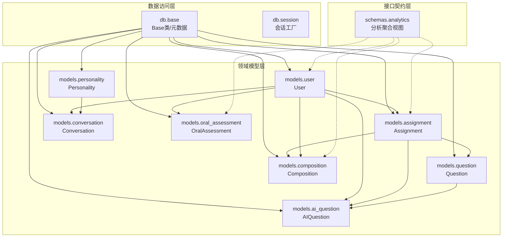
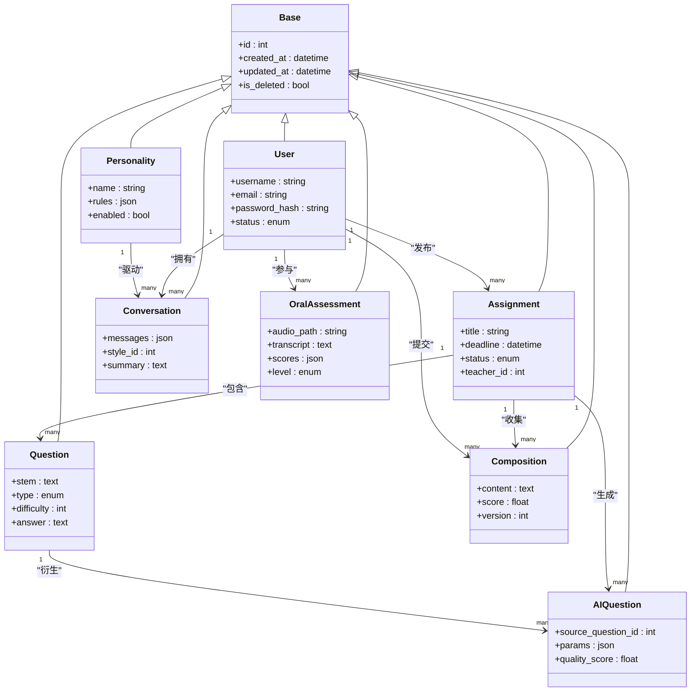
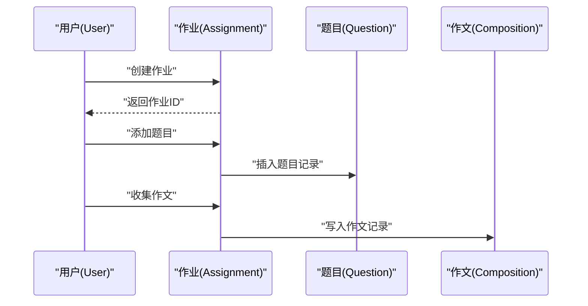
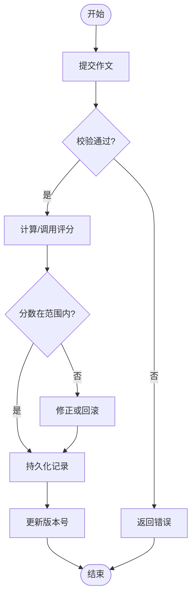
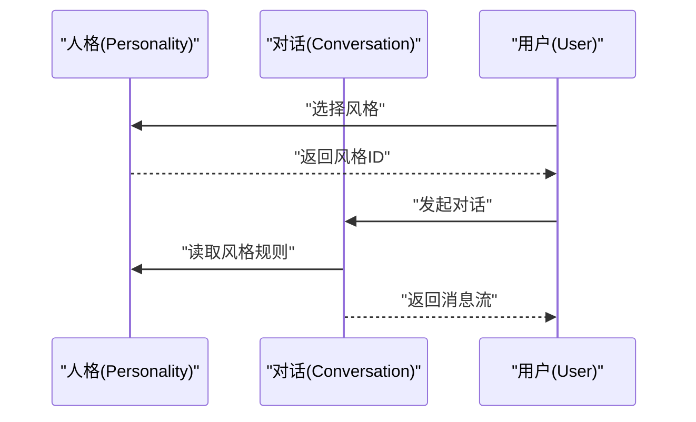
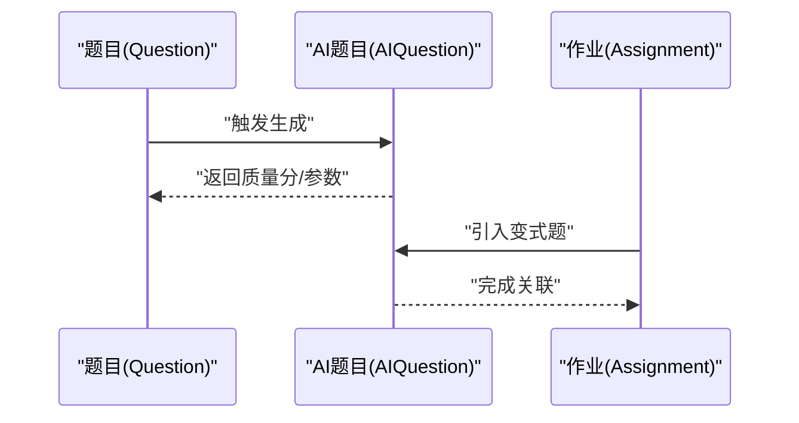
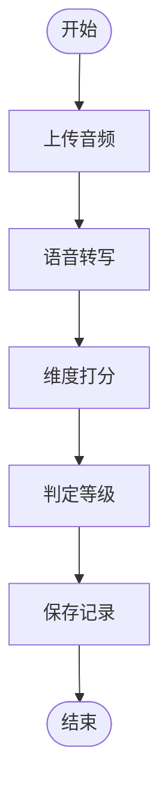
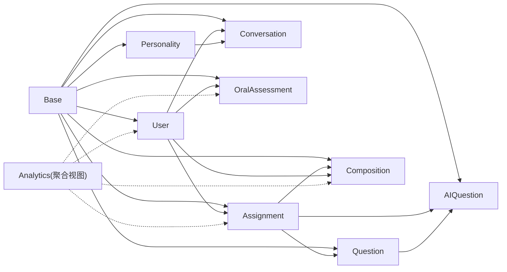

# 数据模型概览

<cite>
**本文引用的文件**   
- [backend/app/db/base.py](file://backend/app/db/base.py)
- [backend/app/models/user.py](file://backend/app/models/user.py)
- [backend/app/models/assignment.py](file://backend/app/models/assignment.py)
- [backend/app/models/question.py](file://backend/app/models/question.py)
- [backend/app/models/composition.py](file://backend/app/models/composition.py)
- [backend/app/models/conversation.py](file://backend/app/models/conversation.py)
- [backend/app/models/oral_assessment.py](file://backend/app/models/oral_assessment.py)
- [backend/app/models/personality.py](file://backend/app/models/personality.py)
- [backend/app/models/ai_question.py](file://backend/app/models/ai_question.py)
- [backend/app/schemas/analytics.py](file://backend/app/schemas/analytics.py)
</cite>

## 目录
1. [引言](#引言)
2. [项目结构](#项目结构)
3. [核心组件](#核心组件)
4. [架构总览](#架构总览)
5. [详细组件分析](#详细组件分析)
6. [依赖关系分析](#依赖关系分析)
7. [性能考量](#性能考量)
8. [故障排查指南](#故障排查指南)
9. [结论](#结论)
10. [附录](#附录)

## 引言
本文件面向AI助教系统的数据模型，系统性梳理数据库架构理念、核心实体与关系、基于SQLAlchemy ORM的建模策略（Base类继承、字段类型选择、约束定义）、模块划分与组织原则，并给出实体间的主要关联关系图与设计最佳实践。目标是帮助读者快速理解“用户-作业-题目-作文-对话-口语评估-人格配置-AI题目”等关键实体的结构与交互方式，为后续扩展与维护提供清晰指引。

## 项目结构
后端采用分层组织：
- db层：ORM基础与会话管理
- models层：领域实体映射
- schemas层：请求/响应校验与序列化
- api层：路由控制器
- services层：业务逻辑与外部服务集成
- tasks层：异步任务

图表来源
- [backend/app/db/base.py](file://backend/app/db/base.py)
- [backend/app/models/user.py](file://backend/app/models/user.py)
- [backend/app/models/assignment.py](file://backend/app/models/assignment.py)
- [backend/app/models/question.py](file://backend/app/models/question.py)
- [backend/app/models/composition.py](file://backend/app/models/composition.py)
- [backend/app/models/conversation.py](file://backend/app/models/conversation.py)
- [backend/app/models/oral_assessment.py](file://backend/app/models/oral_assessment.py)
- [backend/app/models/personality.py](file://backend/app/models/personality.py)
- [backend/app/models/ai_question.py](file://backend/app/models/ai_question.py)
- [backend/app/schemas/analytics.py](file://backend/app/schemas/analytics.py)

章节来源
- [backend/app/db/base.py](file://backend/app/db/base.py)
- [backend/app/models/user.py](file://backend/app/models/user.py)
- [backend/app/models/assignment.py](file://backend/app/models/assignment.py)
- [backend/app/models/question.py](file://backend/app/models/question.py)
- [backend/app/models/composition.py](file://backend/app/models/composition.py)
- [backend/app/models/conversation.py](file://backend/app/models/conversation.py)
- [backend/app/models/oral_assessment.py](file://backend/app/models/oral_assessment.py)
- [backend/app/models/personality.py](file://backend/app/models/personality.py)
- [backend/app/models/ai_question.py](file://backend/app/models/ai_question.py)
- [backend/app/schemas/analytics.py](file://backend/app/schemas/analytics.py)

## 核心组件
本节聚焦于各核心模型的职责与关键字段设计思路，强调字段类型选择与约束策略。

- User（用户）
  - 角色定位：系统主体，承载身份认证、学习档案与行为记录。
  - 典型字段：唯一标识、用户名/邮箱、密码哈希、状态与时间戳。
  - 约束要点：唯一性、非空、索引优化查询。
  - 关联方向：一对多到作业、作文、对话、口语评估、AI题目；多对一或一对一到人格配置。

- Assignment（作业）
  - 角色定位：教学任务容器，聚合题目与作文提交。
  - 典型字段：标题、描述、截止时间、状态、所属教师/班级等。
  - 约束要点：外键指向发布方、软删除标记、时间范围约束。
  - 关联方向：一对多到题目、作文；一对多到AI题目。

- Question（题目）
  - 角色定位：知识点载体，支撑练习与测评。
  - 典型字段：题干、题型、难度、知识点标签、答案/解析。
  - 约束要点：题型枚举、难度范围、内容非空。
  - 关联方向：多对一到作业；一对多到AI题目。

- Composition（作文）
  - 角色定位：学生作答产物，承载文本内容与评分结果。
  - 典型字段：正文、字数、评分、评语、版本控制。
  - 约束要点：长度限制、评分范围、版本号递增。
  - 关联方向：多对一到作业、多对一到用户。

- Conversation（对话）
  - 角色定位：师生/AI交互历史，支持个性化风格。
  - 典型字段：消息序列、上下文摘要、风格ID、时间线。
  - 约束要点：消息顺序、风格外键、归档策略。
  - 关联方向：多对一到用户、多对一到人格配置。

- OralAssessment（口语评估）
  - 角色定位：口语能力评测记录，包含维度分数与反馈。
  - 典型字段：音频路径、转写文本、维度得分、等级、建议。
  - 约束要点：评分区间、必填项校验、存储路径规范。
  - 关联方向：多对一到用户。

- Personality（人格配置）
  - 角色定位：对话风格与提示词模板集合。
  - 典型字段：名称、规则、提示词、启用状态。
  - 约束要点：唯一性、JSON/文本字段、开关状态。
  - 关联方向：一对多到对话。

- AIQuestion（AI题目）
  - 角色定位：由AI生成的变式题或拓展题，用于举一反三。
  - 典型字段：源题ID、生成参数、质量分、使用统计。
  - 约束要点：源题外键、质量阈值、去重策略。
  - 关联方向：多对一到作业、多对一到题目。

章节来源
- [backend/app/models/user.py](file://backend/app/models/user.py)
- [backend/app/models/assignment.py](file://backend/app/models/assignment.py)
- [backend/app/models/question.py](file://backend/app/models/question.py)
- [backend/app/models/composition.py](file://backend/app/models/composition.py)
- [backend/app/models/conversation.py](file://backend/app/models/conversation.py)
- [backend/app/models/oral_assessment.py](file://backend/app/models/oral_assessment.py)
- [backend/app/models/personality.py](file://backend/app/models/personality.py)
- [backend/app/models/ai_question.py](file://backend/app/models/ai_question.py)

## 架构总览
整体采用“领域模型+ORM映射”的分层设计：
- Base类集中定义通用列（如主键、创建/更新时间、软删除），所有模型统一继承，保证一致性。
- 字段类型遵循“最小够用”原则：数值型用整数/浮点，文本用可变长字符串，大文本用长文本，枚举用限定值，时间用带时区的时间戳。
- 约束优先在数据库层实现（NOT NULL、UNIQUE、CHECK、外键），配合应用层校验，确保数据完整性。
- 关系以“外键+关系属性”表达，避免循环引用，必要时通过中间表或视图解耦。

图表来源
- [backend/app/db/base.py](file://backend/app/db/base.py)
- [backend/app/models/user.py](file://backend/app/models/user.py)
- [backend/app/models/assignment.py](file://backend/app/models/assignment.py)
- [backend/app/models/question.py](file://backend/app/models/question.py)
- [backend/app/models/composition.py](file://backend/app/models/composition.py)
- [backend/app/models/conversation.py](file://backend/app/models/conversation.py)
- [backend/app/models/oral_assessment.py](file://backend/app/models/oral_assessment.py)
- [backend/app/models/personality.py](file://backend/app/models/personality.py)
- [backend/app/models/ai_question.py](file://backend/app/models/ai_question.py)

## 详细组件分析

### 用户与作业关系（一对多）
- 设计意图：一个用户可以发布多个作业，作业归属明确，便于权限与统计。
- 关键点：作业表维护发布者外键；用户侧可通过关系属性反向遍历其发布的作业。
- 约束建议：作业标题唯一性按班级/年级维度控制；截止时间晚于开始时间。

图表来源
- [backend/app/models/user.py](file://backend/app/models/user.py)
- [backend/app/models/assignment.py](file://backend/app/models/assignment.py)
- [backend/app/models/question.py](file://backend/app/models/question.py)
- [backend/app/models/composition.py](file://backend/app/models/composition.py)

章节来源
- [backend/app/models/user.py](file://backend/app/models/user.py)
- [backend/app/models/assignment.py](file://backend/app/models/assignment.py)
- [backend/app/models/question.py](file://backend/app/models/question.py)
- [backend/app/models/composition.py](file://backend/app/models/composition.py)

### 作文与评分流程（复杂逻辑）
- 设计意图：作文提交后进入评分流水线，可能触发AI批改、人工复核与版本回溯。
- 关键点：版本号控制变更；评分字段受范围约束；评语结构化存储以便检索。

图表来源
- [backend/app/models/composition.py](file://backend/app/models/composition.py)

章节来源
- [backend/app/models/composition.py](file://backend/app/models/composition.py)

### 对话与人格配置（风格驱动）
- 设计意图：对话记录绑定人格配置，使交互风格可插拔、可切换。
- 关键点：人格配置作为独立实体，避免硬编码；对话消息可采用JSON或明细表，视查询模式而定。

图表来源
- [backend/app/models/personality.py](file://backend/app/models/personality.py)
- [backend/app/models/conversation.py](file://backend/app/models/conversation.py)
- [backend/app/models/user.py](file://backend/app/models/user.py)

章节来源
- [backend/app/models/personality.py](file://backend/app/models/personality.py)
- [backend/app/models/conversation.py](file://backend/app/models/conversation.py)
- [backend/app/models/user.py](file://backend/app/models/user.py)

### AI题目生成链路（从题目到变式）
- 设计意图：基于原题生成高质量变式题，形成题库扩展与自适应练习。
- 关键点：保留生成参数与质量分，便于溯源与筛选；与作业建立关联，支持一键加入练习。

图表来源
- [backend/app/models/question.py](file://backend/app/models/question.py)
- [backend/app/models/ai_question.py](file://backend/app/models/ai_question.py)
- [backend/app/models/assignment.py](file://backend/app/models/assignment.py)

章节来源
- [backend/app/models/question.py](file://backend/app/models/question.py)
- [backend/app/models/ai_question.py](file://backend/app/models/ai_question.py)
- [backend/app/models/assignment.py](file://backend/app/models/assignment.py)

### 口语评估记录（多维评分）
- 设计意图：记录口语能力多维度评分与反馈，辅助学习诊断。
- 关键点：评分结构体需稳定；等级与分数存在映射；音频路径与转写分离存储。

图表来源
- [backend/app/models/oral_assessment.py](file://backend/app/models/oral_assessment.py)

章节来源
- [backend/app/models/oral_assessment.py](file://backend/app/models/oral_assessment.py)

## 依赖关系分析
- 内聚与耦合
  - 高内聚：每个模型聚焦单一领域概念，字段与方法围绕该概念组织。
  - 低耦合：通过外键与关系属性连接，避免跨层直接访问内部实现。
- 直接/间接依赖
  - 模型依赖Base类提供的通用列与元数据。
  - 分析视图（schemas.analytics）依赖多个模型进行聚合，但不修改底层结构。
- 外部依赖
  - 数据库方言与迁移工具（Alembic）负责DDL与版本演进。
  - 可选向量库用于相似题检索（不在本概览详述）。

图表来源
- [backend/app/db/base.py](file://backend/app/db/base.py)
- [backend/app/models/user.py](file://backend/app/models/user.py)
- [backend/app/models/assignment.py](file://backend/app/models/assignment.py)
- [backend/app/models/question.py](file://backend/app/models/question.py)
- [backend/app/models/composition.py](file://backend/app/models/composition.py)
- [backend/app/models/conversation.py](file://backend/app/models/conversation.py)
- [backend/app/models/oral_assessment.py](file://backend/app/models/oral_assessment.py)
- [backend/app/models/personality.py](file://backend/app/models/personality.py)
- [backend/app/models/ai_question.py](file://backend/app/models/ai_question.py)
- [backend/app/schemas/analytics.py](file://backend/app/schemas/analytics.py)

章节来源
- [backend/app/db/base.py](file://backend/app/db/base.py)
- [backend/app/schemas/analytics.py](file://backend/app/schemas/analytics.py)

## 性能考量
- 索引策略
  - 高频查询字段加索引：用户邮箱/用户名、作业发布时间、作文提交时间、对话创建时间。
  - 复合索引：按“作业ID+提交时间”、“用户ID+日期范围”组合查询场景。
- 读写分离与缓存
  - 读多写少场景（题目浏览、作业列表）考虑Redis缓存热点数据。
  - 大文本（作文正文、转写文本）采用对象存储，数据库仅存路径。
- 分页与懒加载
  - 列表接口强制分页；关系属性按需加载，避免N+1问题。
- 事务与批量
  - 批量导入作业/题目时使用批量插入；长事务拆分为短事务，降低锁竞争。

[本节为通用指导，不直接分析具体文件]

## 故障排查指南
- 常见异常
  - 外键约束冲突：检查父记录是否存在、是否被软删除。
  - 唯一性冲突：确认用户名/邮箱/作业标题等唯一字段重复。
  - 类型转换失败：核对输入格式与字段类型匹配（时间、数值、枚举）。
- 定位步骤
  - 查看最近一次迁移是否成功执行。
  - 检查日志中的SQL语句与参数，复现问题。
  - 针对慢查询，使用EXPLAIN分析执行计划，补充缺失索引。
- 恢复策略
  - 利用迁移版本回滚至稳定版本。
  - 对重要数据进行快照备份，防止误删。

[本节为通用指导，不直接分析具体文件]

## 结论
本概览明确了AI助教系统的核心数据模型与关系映射，阐述了基于SQLAlchemy的统一Base类、字段类型与约束策略，以及模块化的组织原则。通过清晰的实体关系图与流程图，读者可以快速把握“用户-作业-题目-作文-对话-口语评估-人格配置-AI题目”的整体架构，并在实践中遵循索引、缓存、事务与迁移等最佳实践，保障系统可扩展性与稳定性。

## 附录
- 建模原则
  - 单一职责：每个模型对应一个领域概念。
  - 显式约束：在数据库层声明NOT NULL、UNIQUE、CHECK与外键。
  - 可演进性：预留扩展字段与软删除，配合迁移平滑升级。
  - 可读性：命名规范一致，注释完善，避免魔法数字。
- 推荐实践
  - 使用枚举与字典表管理有限取值。
  - 大对象与二进制数据走对象存储，数据库仅存引用。
  - 对外暴露的API使用schemas层做输入输出契约，隔离模型变化。

[本节为通用指导，不直接分析具体文件]