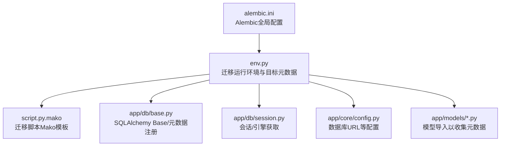
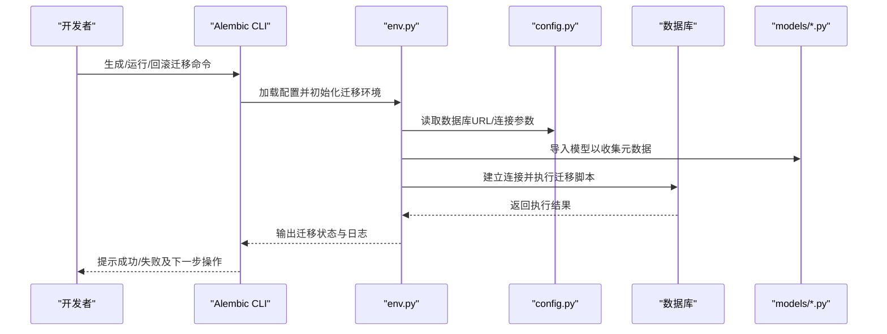
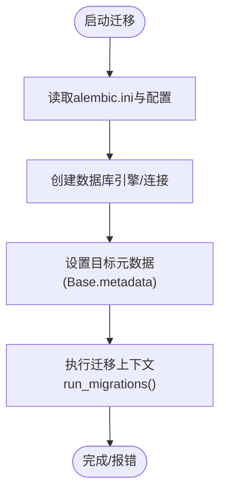
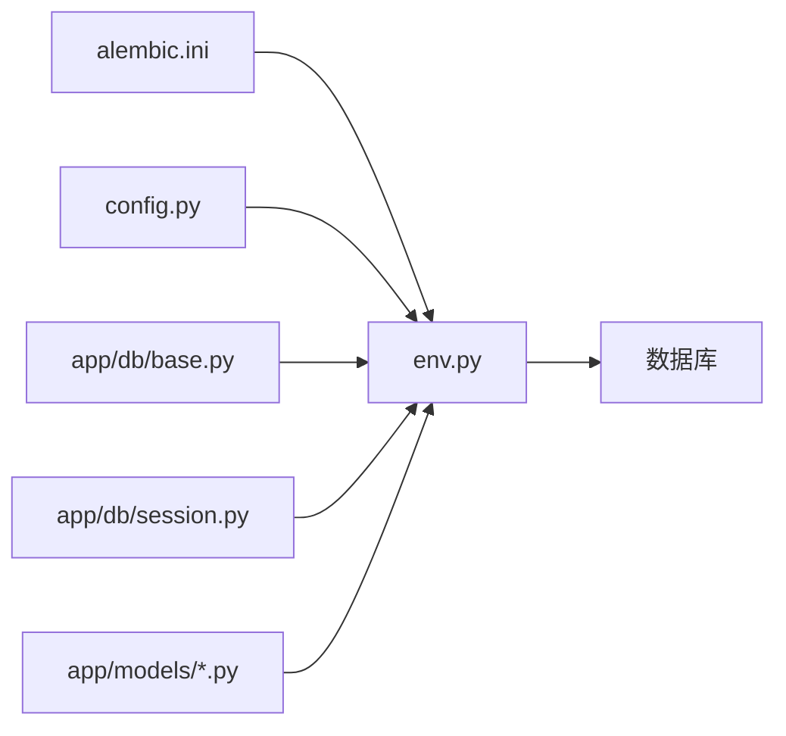

# 数据迁移管理

<cite>
**本文引用的文件**   
- [alembic.ini](file://backend/alembic.ini)
- [env.py](file://backend/alembic/env.py)
- [script.py.mako](file://backend/alembic/script.py.mako)
- [base.py](file://backend/app/db/base.py)
- [session.py](file://backend/app/db/session.py)
- [config.py](file://backend/app/core/config.py)
- [deps.py](file://backend/app/core/deps.py)
- [ai_question.py](file://backend/app/models/ai_question.py)
- [assignment.py](file://backend/app/models/assignment.py)
- [composition.py](file://backend/app/models/composition.py)
- [conversation.py](file://backend/app/models/conversation.py)
- [oral_assessment.py](file://backend/app/models/oral_assessment.py)
- [personality.py](file://backend/app/models/personality.py)
- [question.py](file://backend/app/models/question.py)
- [user.py](file://backend/app/models/user.py)
</cite>

## 目录
1. [简介](#简介)
2. [项目结构](#项目结构)
3. [核心组件](#核心组件)
4. [架构总览](#架构总览)
5. [详细组件分析](#详细组件分析)
6. [依赖关系分析](#依赖关系分析)
7. [性能考虑](#性能考虑)
8. [故障排查指南](#故障排查指南)
9. [结论](#结论)
10. [附录](#附录)

## 简介
本文件面向AI助教系统的数据迁移管理，聚焦于基于Alembic的数据库版本控制策略与落地实践。内容覆盖：
- 迁移脚本生成、版本管理与回滚机制
- 迁移文件结构与模板定制、环境配置
- 增量迁移、批量迁移与数据转换最佳实践
- 生产环境部署流程、零停机升级策略、备份恢复方案
- 冲突解决、依赖管理、并行开发协作工作流
- 迁移脚本编写规范、错误处理与日志记录
- 自动化测试集成、CI/CD流水线配置与回滚应急预案

## 项目结构
后端采用FastAPI + SQLAlchemy + Alembic的典型分层结构。与迁移相关的关键位置如下：
- alembic配置与运行时：backend/alembic.ini、backend/alembic/env.py、backend/alembic/script.py.mako
- 数据库连接与会话：backend/app/db/base.py、backend/app/db/session.py
- 应用配置与安全依赖：backend/app/core/config.py、backend/app/core/deps.py
- 模型定义（用于自动导入与元数据发现）：backend/app/models/*.py

图表来源
- [alembic.ini:1-200](file://backend/alembic.ini#L1-L200)
- [env.py:1-200](file://backend/alembic/env.py#L1-L200)
- [script.py.mako:1-200](file://backend/alembic/script.py.mako#L1-L200)
- [base.py:1-200](file://backend/app/db/base.py#L1-L200)
- [session.py:1-200](file://backend/app/db/session.py#L1-L200)
- [config.py:1-200](file://backend/app/core/config.py#L1-L200)

章节来源
- [alembic.ini:1-200](file://backend/alembic.ini#L1-L200)
- [env.py:1-200](file://backend/alembic/env.py#L1-L200)
- [script.py.mako:1-200](file://backend/alembic/script.py.mako#L1-L200)
- [base.py:1-200](file://backend/app/db/base.py#L1-L200)
- [session.py:1-200](file://backend/app/db/session.py#L1-L200)
- [config.py:1-200](file://backend/app/core/config.py#L1-L200)

## 核心组件
- Alembic配置与环境
  - alembic.ini：定义迁移仓库根、脚本目录、目标数据库URL、日志级别等。
  - env.py：Alembic运行时入口，负责加载配置、创建引擎、设置目标元数据、执行迁移上下文。
  - script.py.mako：迁移脚本的Mako模板，可定制生成的头部注释、导入语句与函数签名。
- 数据库连接与会话
  - base.py：定义SQLAlchemy Base对象，集中注册所有模型元数据，供Alembic进行autogenerate。
  - session.py：提供引擎/会话工厂，确保迁移与业务代码使用一致的连接参数与连接池策略。
- 应用配置与依赖注入
  - config.py：集中读取环境变量或配置文件，输出数据库URL、连接池大小、超时等。
  - deps.py：在应用中注入数据库会话；迁移通常不直接使用此模块，但需保持连接参数一致。
- 模型层
  - app/models/*.py：各业务模型的ORM映射，是Alembic autogenerate的输入源。

章节来源
- [alembic.ini:1-200](file://backend/alembic.ini#L1-L200)
- [env.py:1-200](file://backend/alembic/env.py#L1-L200)
- [script.py.mako:1-200](file://backend/alembic/script.py.mako#L1-L200)
- [base.py:1-200](file://backend/app/db/base.py#L1-L200)
- [session.py:1-200](file://backend/app/db/session.py#L1-L200)
- [config.py:1-200](file://backend/app/core/config.py#L1-L200)
- [deps.py:1-200](file://backend/app/core/deps.py#L1-L200)
- [ai_question.py:1-200](file://backend/app/models/ai_question.py#L1-L200)
- [assignment.py:1-200](file://backend/app/models/assignment.py#L1-L200)
- [composition.py:1-200](file://backend/app/models/composition.py#L1-L200)
- [conversation.py:1-200](file://backend/app/models/conversation.py#L1-L200)
- [oral_assessment.py:1-200](file://backend/app/models/oral_assessment.py#L1-L200)
- [personality.py:1-200](file://backend/app/models/personality.py#L1-L200)
- [question.py:1-200](file://backend/app/models/question.py#L1-L200)
- [user.py:1-200](file://backend/app/models/user.py#L1-L200)

## 架构总览
下图展示了从“开发者触发迁移”到“数据库变更生效”的整体流程，以及关键组件之间的交互。

图表来源
- [env.py:1-200](file://backend/alembic/env.py#L1-L200)
- [config.py:1-200](file://backend/app/core/config.py#L1-L200)
- [ai_question.py:1-200](file://backend/app/models/ai_question.py#L1-L200)
- [assignment.py:1-200](file://backend/app/models/assignment.py#L1-L200)
- [composition.py:1-200](file://backend/app/models/composition.py#L1-L200)
- [conversation.py:1-200](file://backend/app/models/conversation.py#L1-L200)
- [oral_assessment.py:1-200](file://backend/app/models/oral_assessment.py#L1-L200)
- [personality.py:1-200](file://backend/app/models/personality.py#L1-L200)
- [question.py:1-200](file://backend/app/models/question.py#L1-L200)
- [user.py:1-200](file://backend/app/models/user.py#L1-L200)

## 详细组件分析

### Alembic配置与环境
- alembic.ini
  - 作用：指定迁移脚本目录、目标数据库URL、日志级别、多环境分支等。
  - 关键点：确保数据库URL与业务服务一致；合理设置日志级别便于排障。
- env.py
  - 作用：Alembic运行时核心，负责：
    - 读取配置（优先从alembic.ini，也可结合环境变量）
    - 创建SQLAlchemy引擎与连接
    - 设置target_metadata为Base.metadata，以便autogenerate检测差异
    - 调用context.run_migrations()执行迁移
  - 建议：
    - 将数据库URL统一由config.py暴露，env.py通过读取配置获取，避免硬编码。
    - 在env.py中显式导入所有模型，确保元数据完整。
- script.py.mako
  - 作用：自定义迁移脚本模板，可统一添加头部注释、导入语句、函数签名风格。
  - 建议：
    - 增加作者、日期、变更说明占位符，便于审计。
    - 预置常用导入（如sa、op），减少手写成本。

图表来源
- [alembic.ini:1-200](file://backend/alembic.ini#L1-L200)
- [env.py:1-200](file://backend/alembic/env.py#L1-L200)
- [base.py:1-200](file://backend/app/db/base.py#L1-L200)

章节来源
- [alembic.ini:1-200](file://backend/alembic.ini#L1-L200)
- [env.py:1-200](file://backend/alembic/env.py#L1-L200)
- [script.py.mako:1-200](file://backend/alembic/script.py.mako#L1-L200)
- [base.py:1-200](file://backend/app/db/base.py#L1-L200)

### 数据库连接与会话
- base.py
  - 作用：定义Base对象，集中注册所有模型元数据，供Alembic autogenerate对比当前DDL与模型差异。
  - 建议：确保所有模型均被导入且注册，避免遗漏导致autogenerate无法识别变更。
- session.py
  - 作用：提供引擎/会话工厂，保证迁移与业务代码使用相同的连接参数、连接池与事务策略。
  - 建议：迁移阶段仅使用只读或最小权限账户，避免在生产误操作。

章节来源
- [base.py:1-200](file://backend/app/db/base.py#L1-L200)
- [session.py:1-200](file://backend/app/db/session.py#L1-L200)

### 应用配置与依赖注入
- config.py
  - 作用：集中管理数据库URL、连接池大小、超时、重试等参数。
  - 建议：支持多环境（dev/test/prod）切换，通过环境变量注入不同值。
- deps.py
  - 作用：在FastAPI中注入数据库会话；迁移一般不直接依赖此模块，但应保持连接参数一致。

章节来源
- [config.py:1-200](file://backend/app/core/config.py#L1-L200)
- [deps.py:1-200](file://backend/app/core/deps.py#L1-L200)

### 模型层与元数据
- models/*.py
  - 作用：定义业务表结构，作为Alembic autogenerate的输入。
  - 建议：
    - 每个模型明确主键、索引、外键约束与默认值。
    - 对大字段或JSON类型，谨慎评估迁移影响与兼容性。
    - 使用命名约定（表名、列名、索引名）提升可读性与一致性。

章节来源
- [ai_question.py:1-200](file://backend/app/models/ai_question.py#L1-L200)
- [assignment.py:1-200](file://backend/app/models/assignment.py#L1-L200)
- [composition.py:1-200](file://backend/app/models/composition.py#L1-L200)
- [conversation.py:1-200](file://backend/app/models/conversation.py#L1-L200)
- [oral_assessment.py:1-200](file://backend/app/models/oral_assessment.py#L1-L200)
- [personality.py:1-200](file://backend/app/models/personality.py#L1-L200)
- [question.py:1-200](file://backend/app/models/question.py#L1-L200)
- [user.py:1-200](file://backend/app/models/user.py#L1-L200)

## 依赖关系分析
- Alembic与配置
  - alembic.ini驱动env.py行为；env.py读取config.py提供的数据库URL与连接参数。
- Alembic与模型
  - env.py导入models包，收集Base.metadata，用于autogenerate对比。
- Alembic与数据库
  - env.py通过session.py创建的引擎访问数据库，执行迁移脚本。

图表来源
- [alembic.ini:1-200](file://backend/alembic.ini#L1-L200)
- [env.py:1-200](file://backend/alembic/env.py#L1-L200)
- [config.py:1-200](file://backend/app/core/config.py#L1-L200)
- [base.py:1-200](file://backend/app/db/base.py#L1-L200)
- [session.py:1-200](file://backend/app/db/session.py#L1-L200)
- [ai_question.py:1-200](file://backend/app/models/ai_question.py#L1-L200)
- [assignment.py:1-200](file://backend/app/models/assignment.py#L1-L200)
- [composition.py:1-200](file://backend/app/models/composition.py#L1-L200)
- [conversation.py:1-200](file://backend/app/models/conversation.py#L1-L200)
- [oral_assessment.py:1-200](file://backend/app/models/oral_assessment.py#L1-L200)
- [personality.py:1-200](file://backend/app/models/personality.py#L1-L200)
- [question.py:1-200](file://backend/app/models/question.py#L1-L200)
- [user.py:1-200](file://backend/app/models/user.py#L1-L200)

章节来源
- [alembic.ini:1-200](file://backend/alembic.ini#L1-L200)
- [env.py:1-200](file://backend/alembic/env.py#L1-L200)
- [config.py:1-200](file://backend/app/core/config.py#L1-L200)
- [base.py:1-200](file://backend/app/db/base.py#L1-L200)
- [session.py:1-200](file://backend/app/db/session.py#L1-L200)
- [ai_question.py:1-200](file://backend/app/models/ai_question.py#L1-L200)
- [assignment.py:1-200](file://backend/app/models/assignment.py#L1-L200)
- [composition.py:1-200](file://backend/app/models/composition.py#L1-L200)
- [conversation.py:1-200](file://backend/app/models/conversation.py#L1-L200)
- [oral_assessment.py:1-200](file://backend/app/models/oral_assessment.py#L1-L200)
- [personality.py:1-200](file://backend/app/models/personality.py#L1-L200)
- [question.py:1-200](file://backend/app/models/question.py#L1-L200)
- [user.py:1-200](file://backend/app/models/user.py#L1-L200)

## 性能考虑
- 连接池与并发
  - 根据生产负载调整连接池大小与最大溢出，避免迁移期间阻塞业务请求。
- 大表变更
  - 对大表增删列、加索引时，采用在线DDL或分批策略，降低锁等待与复制延迟。
- 迁移脚本粒度
  - 将复杂数据转换拆分为多个小迁移，提高可回滚性与可观测性。
- 只读副本与读写分离
  - 迁移尽量在主库执行，并确保只读副本能同步DDL变更。

[本节为通用指导，无需特定文件引用]

## 故障排查指南
- 常见问题定位
  - 数据库URL错误或权限不足：检查alembic.ini与config.py中的连接参数。
  - 未检测到模型变更：确认env.py已正确导入所有模型，Base.metadata包含全部表。
  - 迁移冲突：查看版本链是否断裂，必要时手动修复head指针或合并分支。
- 日志与调试
  - 在env.py中开启详细日志，记录迁移前后DDL差异与执行耗时。
  - 对数据转换类迁移，记录受影响行数与异常堆栈，便于快速回滚。
- 回滚策略
  - 优先使用Alembic downgrade至上一版本；若数据不一致，准备独立的数据修复脚本。

章节来源
- [alembic.ini:1-200](file://backend/alembic.ini#L1-L200)
- [env.py:1-200](file://backend/alembic/env.py#L1-L200)
- [config.py:1-200](file://backend/app/core/config.py#L1-L200)
- [base.py:1-200](file://backend/app/db/base.py#L1-L200)

## 结论
通过统一的Alembic配置、清晰的env.py职责划分、完善的模型元数据注册与模板定制，AI助教系统可实现稳健的数据库版本控制。配合严格的迁移编写规范、自动化测试与CI/CD流水线，可在保障数据安全的前提下实现高效迭代与零停机升级。

[本节为总结性内容，无需特定文件引用]

## 附录

### 迁移脚本生成与版本管理
- 生成迁移
  - 基于模型变更自动生成迁移脚本，随后人工审查与补充数据转换逻辑。
- 版本管理
  - 维护线性版本链，避免重复head；分支合并前确保目标版本一致。
- 回滚机制
  - 优先downgrade；对于不可逆数据变更，准备反向脚本与验证步骤。

章节来源
- [env.py:1-200](file://backend/alembic/env.py#L1-L200)
- [script.py.mako:1-200](file://backend/alembic/script.py.mako#L1-L200)

### 迁移文件结构与模板定制
- 文件结构
  - versions目录存放具体迁移脚本；env.py与script.py.mako提供运行期与生成期能力。
- 模板定制
  - 在script.py.mako中统一头部注释、导入与函数签名，提升团队一致性。

章节来源
- [env.py:1-200](file://backend/alembic/env.py#L1-L200)
- [script.py.mako:1-200](file://backend/alembic/script.py.mako#L1-L200)

### 环境配置与数据库连接
- 配置要点
  - 通过config.py集中管理数据库URL与连接参数；env.py读取配置并创建引擎。
- 连接策略
  - 迁移与业务保持一致的连接池与超时策略，避免环境差异导致的异常。

章节来源
- [config.py:1-200](file://backend/app/core/config.py#L1-L200)
- [env.py:1-200](file://backend/alembic/env.py#L1-L200)
- [session.py:1-200](file://backend/app/db/session.py#L1-L200)

### 增量迁移、批量迁移与数据转换最佳实践
- 增量迁移
  - 每次变更对应一个迁移，保持幂等与可回滚。
- 批量迁移
  - 对大表数据更新采用分批提交，控制事务大小与锁范围。
- 数据转换
  - 先写后切：新增字段/表，填充数据，再切换业务逻辑，最后清理旧字段。

章节来源
- [ai_question.py:1-200](file://backend/app/models/ai_question.py#L1-L200)
- [assignment.py:1-200](file://backend/app/models/assignment.py#L1-L200)
- [composition.py:1-200](file://backend/app/models/composition.py#L1-L200)
- [conversation.py:1-200](file://backend/app/models/conversation.py#L1-L200)
- [oral_assessment.py:1-200](file://backend/app/models/oral_assessment.py#L1-L200)
- [personality.py:1-200](file://backend/app/models/personality.py#L1-L200)
- [question.py:1-200](file://backend/app/models/question.py#L1-L200)
- [user.py:1-200](file://backend/app/models/user.py#L1-L200)

### 生产环境迁移部署流程与零停机升级
- 部署流程
  - 预检：校验版本链与依赖；备份数据库；灰度发布应用。
  - 执行：按顺序运行迁移；监控错误与慢查询。
  - 验证：运行健康检查与回归用例；观察业务指标。
- 零停机策略
  - 兼容双写：新旧结构并存，逐步切换读写路径；分阶段下线旧逻辑。

章节来源
- [alembic.ini:1-200](file://backend/alembic.ini#L1-L200)
- [env.py:1-200](file://backend/alembic/env.py#L1-L200)
- [config.py:1-200](file://backend/app/core/config.py#L1-L200)

### 数据备份与恢复方案
- 备份
  - 全量+增量备份；迁移前强制快照；保留至少N个历史版本。
- 恢复
  - 制定RTO/RPO目标；演练恢复流程；准备一键回滚脚本。

[本节为通用指导，无需特定文件引用]

### 迁移冲突解决、依赖管理与并行协作
- 冲突解决
  - 合并前先rebase至最新head；必要时手工编辑迁移头指针。
- 依赖管理
  - 跨服务共享DDL变更时，明确版本号与兼容性矩阵。
- 并行协作
  - 分支命名规范；PR审查包含迁移脚本与数据转换逻辑；自动化lint与测试。

章节来源
- [env.py:1-200](file://backend/alembic/env.py#L1-L200)
- [alembic.ini:1-200](file://backend/alembic.ini#L1-L200)

### 迁移脚本编写规范、错误处理与日志记录
- 编写规范
  - 单一职责、幂等、可回滚；明确注释变更原因与影响面。
- 错误处理
  - 捕获异常并记录上下文；对数据转换提供重试与补偿逻辑。
- 日志记录
  - 记录开始/结束时间、影响行数、异常堆栈；分级输出便于追踪。

章节来源
- [env.py:1-200](file://backend/alembic/env.py#L1-L200)
- [script.py.mako:1-200](file://backend/alembic/script.py.mako#L1-L200)

### 自动化测试集成与CI/CD流水线
- 测试集成
  - 单元测试：校验迁移脚本语法与幂等性。
  - 集成测试：在隔离数据库中执行迁移与回滚，断言DDL与数据一致性。
- CI/CD
  - 构建镜像前执行迁移lint与测试；发布前自动运行迁移并在金丝雀环境验证。

章节来源
- [env.py:1-200](file://backend/alembic/env.py#L1-L200)
- [alembic.ini:1-200](file://backend/alembic.ini#L1-L200)

### 回滚应急预案
- 预案要点
  - 明确触发条件（错误率阈值、数据不一致）；一键回滚至上一稳定版本。
- 操作步骤
  - 停止新流量；执行downgrade；恢复备份数据；验证后重新上线。

章节来源
- [env.py:1-200](file://backend/alembic/env.py#L1-L200)
- [alembic.ini:1-200](file://backend/alembic.ini#L1-L200)