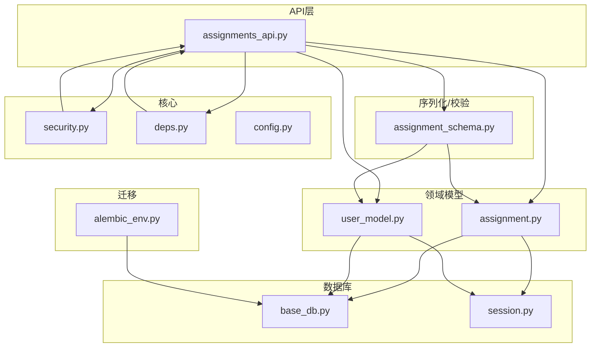
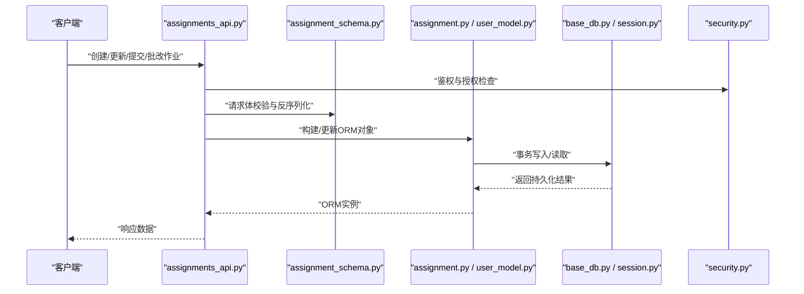
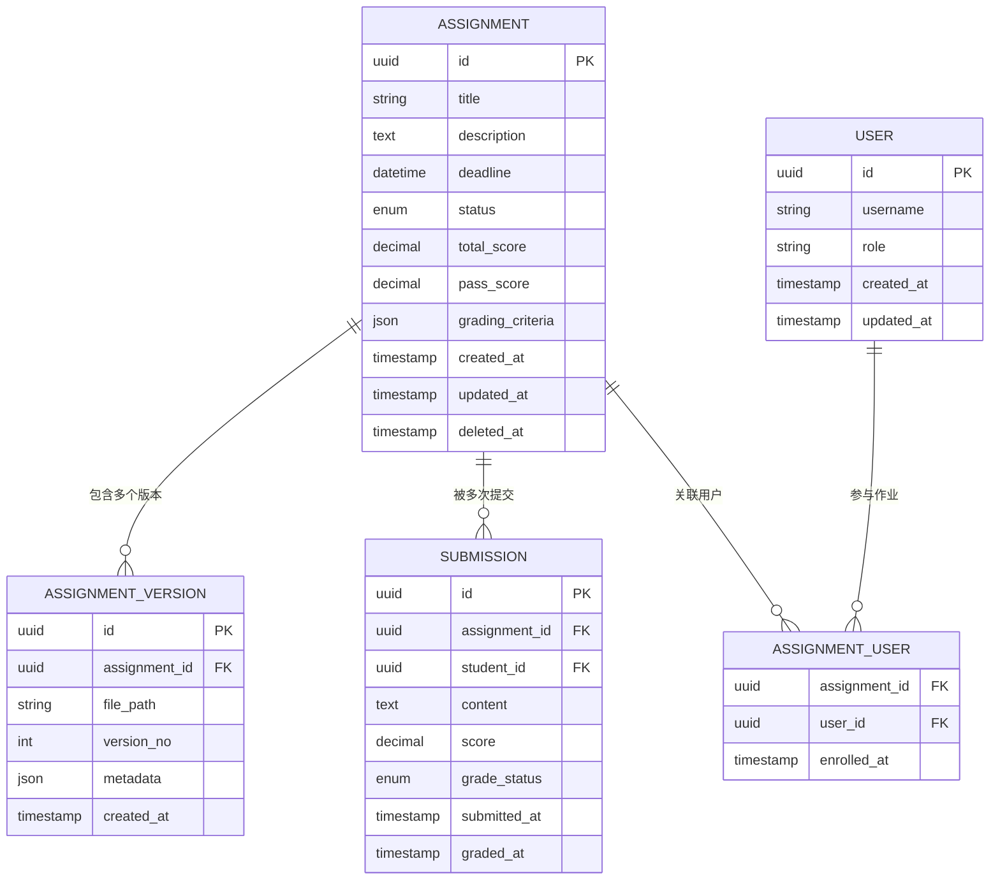
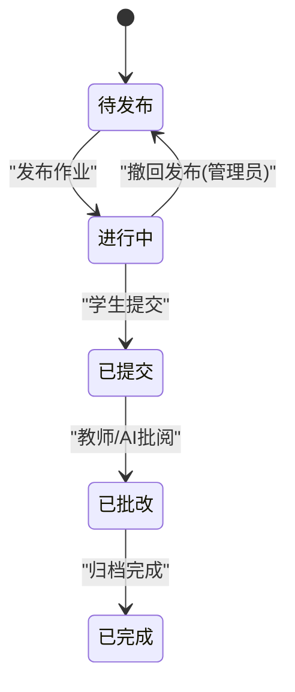
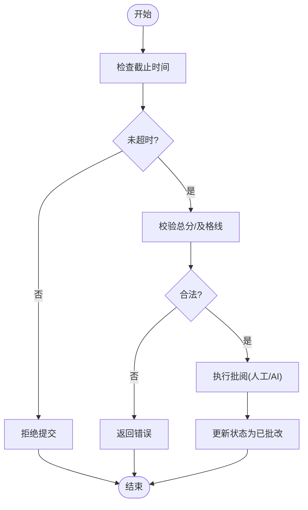
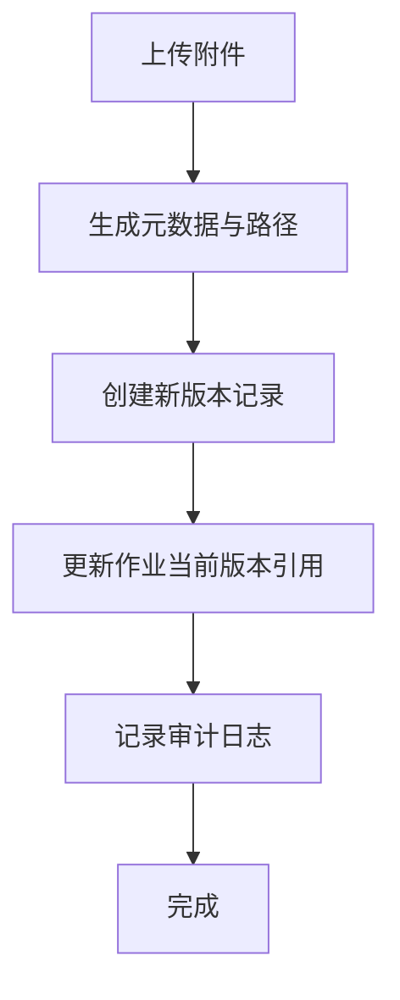
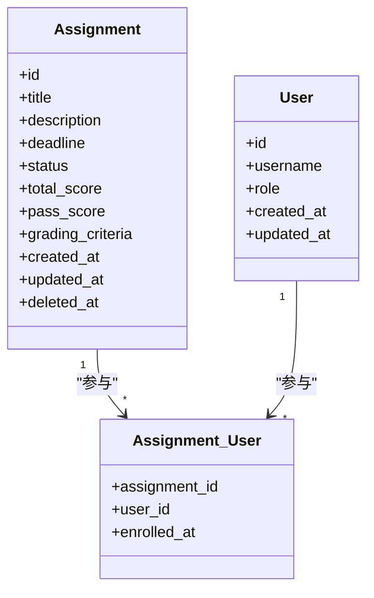
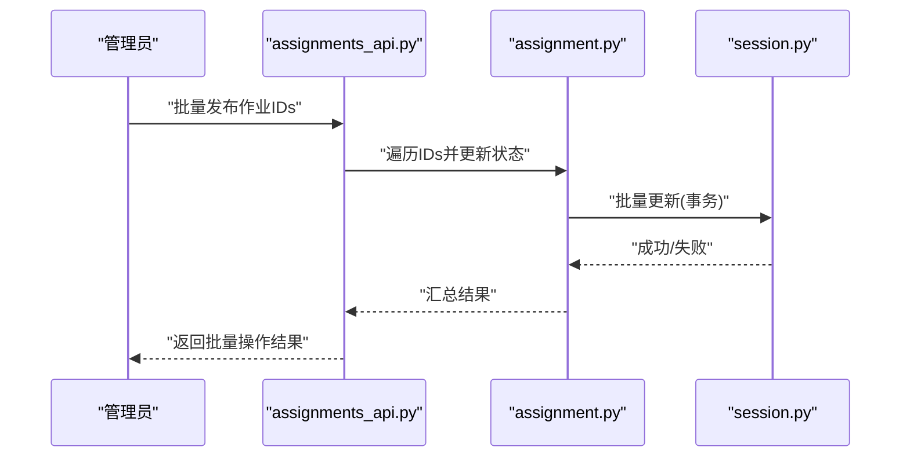
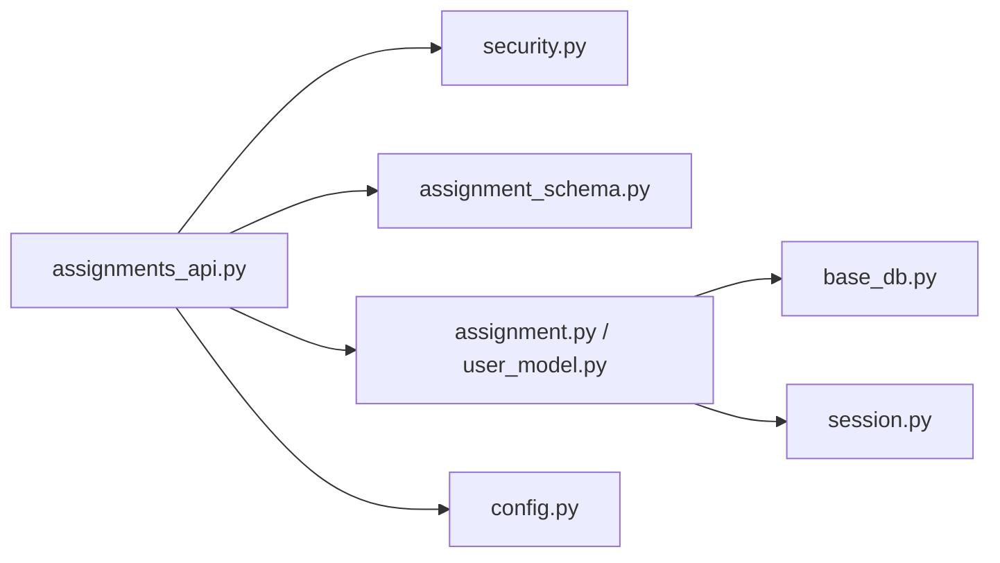

# 作业实体设计

<cite>
**本文引用的文件**   
- [assignment.py](file://backend/app/models/assignment.py)
- [assignment_schema.py](file://backend/app/schemas/assignment.py)
- [assignments_api.py](file://backend/app/api/v1/assignments.py)
- [user_model.py](file://backend/app/models/user.py)
- [base_db.py](file://backend/app/db/base.py)
- [session.py](file://backend/app/db/session.py)
- [security.py](file://backend/app/core/security.py)
- [deps.py](file://backend/app/core/deps.py)
- [config.py](file://backend/app/core/config.py)
- [alembic_env.py](file://backend/alembic/env.py)
</cite>

## 目录
1. [引言](#引言)
2. [项目结构](#项目结构)
3. [核心组件](#核心组件)
4. [架构总览](#架构总览)
5. [详细组件分析](#详细组件分析)
6. [依赖关系分析](#依赖关系分析)
7. [性能考虑](#性能考虑)
8. [故障排查指南](#故障排查指南)
9. [结论](#结论)
10. [附录](#附录)

## 引言
本设计文档聚焦于“作业”实体的数据模型与业务实现，覆盖以下关键方面：
- 数据结构：作业基本信息（标题、描述、截止时间）、状态管理（待发布、进行中、已提交、已批改、已完成）、评分机制（总分设置、及格线、评分标准）、文件管理（附件上传、版本控制）。
- 关系建模：作业与用户的多对多关系。
- 操作能力：批量操作支持、时间戳管理。
- 生命周期与权限：状态转换规则、权限控制策略。
- 数据完整性：约束设计与校验。
- 数据库与ORM：SQL建表示例与ORM模型对照。
- 查询优化：复杂查询的索引策略。

## 项目结构
后端采用分层架构：API层、服务层、模型层、数据库会话与配置。作业相关代码主要分布在 models、schemas、api/v1 以及 db 与 core 模块中。

图表来源
- [assignments_api.py:1-200](file://backend/app/api/v1/assignments.py#L1-L200)
- [assignment.py:1-200](file://backend/app/models/assignment.py#L1-L200)
- [user_model.py:1-200](file://backend/app/models/user.py#L1-L200)
- [assignment_schema.py:1-200](file://backend/app/schemas/assignment.py#L1-L200)
- [base_db.py:1-100](file://backend/app/db/base.py#L1-L100)
- [session.py:1-100](file://backend/app/db/session.py#L1-L100)
- [security.py:1-100](file://backend/app/core/security.py#L1-L100)
- [deps.py:1-100](file://backend/app/core/deps.py#L1-L100)
- [config.py:1-100](file://backend/app/core/config.py#L1-L100)
- [alembic_env.py:1-100](file://backend/alembic/env.py#L1-L100)

章节来源
- [assignments_api.py:1-200](file://backend/app/api/v1/assignments.py#L1-L200)
- [assignment.py:1-200](file://backend/app/models/assignment.py#L1-L200)
- [user_model.py:1-200](file://backend/app/models/user.py#L1-L200)
- [assignment_schema.py:1-200](file://backend/app/schemas/assignment.py#L1-L200)
- [base_db.py:1-100](file://backend/app/db/base.py#L1-L100)
- [session.py:1-100](file://backend/app/db/session.py#L1-L100)
- [security.py:1-100](file://backend/app/core/security.py#L1-L100)
- [deps.py:1-100](file://backend/app/core/deps.py#L1-L100)
- [config.py:1-100](file://backend/app/core/config.py#L1-L100)
- [alembic_env.py:1-100](file://backend/alembic/env.py#L1-L100)

## 核心组件
- 作业模型（Assignment）：承载作业元信息、状态、评分参数、截止时间与审计字段。
- 用户模型（User）：承载用户身份与角色，用于与作业建立多对多关系。
- 作业关联表（Assignment_User）：维护作业与用户的参与关系（如班级/课程绑定或学生参与）。
- 作业版本与附件：通过版本化附件记录作业材料变更历史，支持回溯与审计。
- 作业提交与成绩：记录学生提交内容与得分，支撑“已提交/已批改/已完成”等状态流转。
- 序列化与校验（Schemas）：定义输入输出结构与校验规则，保障数据一致性。
- API接口：提供作业的CRUD、状态切换、批量操作、提交与批改等能力。
- 安全与依赖注入：基于角色的访问控制（RBAC）与统一依赖注入。

章节来源
- [assignment.py:1-200](file://backend/app/models/assignment.py#L1-L200)
- [user_model.py:1-200](file://backend/app/models/user.py#L1-L200)
- [assignment_schema.py:1-200](file://backend/app/schemas/assignment.py#L1-L200)
- [assignments_api.py:1-200](file://backend/app/api/v1/assignments.py#L1-L200)
- [security.py:1-100](file://backend/app/core/security.py#L1-L100)
- [deps.py:1-100](file://backend/app/core/deps.py#L1-L100)

## 架构总览
下图展示从请求到持久化的调用链路与关键组件交互。

图表来源
- [assignments_api.py:1-200](file://backend/app/api/v1/assignments.py#L1-L200)
- [assignment_schema.py:1-200](file://backend/app/schemas/assignment.py#L1-L200)
- [assignment.py:1-200](file://backend/app/models/assignment.py#L1-L200)
- [user_model.py:1-200](file://backend/app/models/user.py#L1-L200)
- [base_db.py:1-100](file://backend/app/db/base.py#L1-L100)
- [session.py:1-100](file://backend/app/db/session.py#L1-L100)
- [security.py:1-100](file://backend/app/core/security.py#L1-L100)

## 详细组件分析

### 数据模型与关系设计
- 作业基本信息
  - 标题、描述、截止时间：用于作业可见性与完成判定。
  - 状态字段：待发布、进行中、已提交、已批改、已完成。
  - 评分机制：总分、及格线、评分标准（可结构化存储，便于前端渲染与自动批阅）。
- 作业与用户多对多
  - 通过中间表 Assignment_User 维护作业与用户的参与关系（例如教师发布作业后绑定班级/学生）。
- 版本与附件
  - 作业附件以版本化方式存储，每次修改生成新版本，保留历史快照。
- 提交与成绩
  - 学生提交记录与分数，作为状态从“进行中”向“已提交/已批改/已完成”流转的依据。
- 时间戳
  - 创建时间、更新时间、删除时间（软删除），以及业务时间（发布时间、截止时间、提交时间、批改时间）。

图表来源
- [assignment.py:1-200](file://backend/app/models/assignment.py#L1-L200)
- [user_model.py:1-200](file://backend/app/models/user.py#L1-L200)

章节来源
- [assignment.py:1-200](file://backend/app/models/assignment.py#L1-L200)
- [user_model.py:1-200](file://backend/app/models/user.py#L1-L200)

### 状态管理与生命周期
- 状态集合
  - 待发布：作业已创建但未公开。
  - 进行中：作业已发布，允许提交。
  - 已提交：学生已完成提交。
  - 已批改：教师或AI已完成评分。
  - 已完成：所有必要流程结束（如归档）。
- 转换规则
  - 待发布 → 进行中：由教师或管理员执行发布。
  - 进行中 → 已提交：学生提交成功后触发。
  - 已提交 → 已批改：教师/AI批阅完成后触发。
  - 已批改 → 已完成：确认成绩并归档。
- 约束与校验
  - 截止时间与状态联动：超过截止时间禁止提交；必要时允许延期审批。
  - 评分必填：进入“已批改”前需确保总分与及格线合理。

图表来源
- [assignments_api.py:1-200](file://backend/app/api/v1/assignments.py#L1-L200)
- [assignment.py:1-200](file://backend/app/models/assignment.py#L1-L200)

章节来源
- [assignments_api.py:1-200](file://backend/app/api/v1/assignments.py#L1-L200)
- [assignment.py:1-200](file://backend/app/models/assignment.py#L1-L200)

### 评分机制与标准
- 总分与及格线
  - 总分用于归一化分数；及格线用于判定是否通过。
- 评分标准
  - 使用结构化JSON存储维度与权重，便于前端渲染与自动批阅。
- 批阅流程
  - 支持人工与AI混合批阅；批阅结果写入提交记录并触发状态流转。

图表来源
- [assignment_schema.py:1-200](file://backend/app/schemas/assignment.py#L1-L200)
- [assignment.py:1-200](file://backend/app/models/assignment.py#L1-L200)

章节来源
- [assignment_schema.py:1-200](file://backend/app/schemas/assignment.py#L1-L200)
- [assignment.py:1-200](file://backend/app/models/assignment.py#L1-L200)

### 文件管理与版本控制
- 附件上传
  - 支持多种格式；上传后生成唯一路径与元数据。
- 版本控制
  - 每次更新生成新版本号，保留历史快照；当前版本指向最新版本。
- 审计与回滚
  - 记录创建者与时间戳；支持按版本回滚至指定快照。

图表来源
- [assignment.py:1-200](file://backend/app/models/assignment.py#L1-L200)

章节来源
- [assignment.py:1-200](file://backend/app/models/assignment.py#L1-L200)

### 作业与用户的多对多关系
- 参与关系
  - 通过 Assignment_User 表维护作业与用户的参与关系，支持教师、助教、学生等多角色。
- 批量绑定
  - 支持批量将学生加入作业，减少多次请求开销。
- 权限控制
  - 结合角色与参与关系进行细粒度授权。

图表来源
- [assignment.py:1-200](file://backend/app/models/assignment.py#L1-L200)
- [user_model.py:1-200](file://backend/app/models/user.py#L1-L200)

章节来源
- [assignment.py:1-200](file://backend/app/models/assignment.py#L1-L200)
- [user_model.py:1-200](file://backend/app/models/user.py#L1-L200)

### 批量操作支持
- 批量发布/撤回
  - 支持一次操作多个作业的状态切换。
- 批量加入学生
  - 一次性将多名学生加入某作业，提升效率。
- 事务与幂等
  - 批量操作在事务内执行，保证一致性；对外暴露幂等接口避免重复提交。

图表来源
- [assignments_api.py:1-200](file://backend/app/api/v1/assignments.py#L1-L200)
- [assignment.py:1-200](file://backend/app/models/assignment.py#L1-L200)
- [session.py:1-100](file://backend/app/db/session.py#L1-L100)

章节来源
- [assignments_api.py:1-200](file://backend/app/api/v1/assignments.py#L1-L200)
- [assignment.py:1-200](file://backend/app/models/assignment.py#L1-L200)
- [session.py:1-100](file://backend/app/db/session.py#L1-L100)

### 时间戳管理
- 系统时间戳
  - 创建时间、更新时间、删除时间（软删除）。
- 业务时间戳
  - 发布时间、截止时间、提交时间、批改时间。
- 时区与精度
  - 统一使用UTC存储，前端按需转换；精度到秒或毫秒视需求而定。

章节来源
- [assignment.py:1-200](file://backend/app/models/assignment.py#L1-L200)

### 权限控制
- 角色与资源
  - 教师/助教/学生/管理员；资源包括作业、提交、成绩。
- 鉴权与授权
  - 基于JWT或会话的鉴权；基于角色与参与关系的授权。
- 最小权限原则
  - 仅授予完成操作所需的最小权限。

章节来源
- [security.py:1-100](file://backend/app/core/security.py#L1-L100)
- [deps.py:1-100](file://backend/app/core/deps.py#L1-L100)
- [assignments_api.py:1-200](file://backend/app/api/v1/assignments.py#L1-L200)

### 数据完整性约束
- 非空与唯一性
  - 标题、截止时间、总分、及格线等关键字段非空；版本号唯一。
- 外键约束
  - 作业版本、提交记录均关联作业ID；参与关系关联作业与用户。
- 校验规则
  - 总分大于0；及格线不超过总分；截止时间晚于当前时间（发布时）。

章节来源
- [assignment.py:1-200](file://backend/app/models/assignment.py#L1-L200)
- [assignment_schema.py:1-200](file://backend/app/schemas/assignment.py#L1-L200)

### SQL建表示例与ORM对照
以下为概念性示例，具体字段类型与约束应与实际ORM定义保持一致。

- 作业表（assignments）
  - 字段：id、title、description、deadline、status、total_score、pass_score、grading_criteria、created_at、updated_at、deleted_at。
- 用户表（users）
  - 字段：id、username、role、created_at、updated_at。
- 作业-用户关联表（assignment_user）
  - 字段：assignment_id、user_id、enrolled_at。
- 作业版本表（assignment_versions）
  - 字段：id、assignment_id、file_path、version_no、metadata、created_at。
- 提交表（submissions）
  - 字段：id、assignment_id、student_id、content、score、grade_status、submitted_at、graded_at。

ORM模型参考路径
- [assignment.py:1-200](file://backend/app/models/assignment.py#L1-L200)
- [user_model.py:1-200](file://backend/app/models/user.py#L1-L200)

章节来源
- [assignment.py:1-200](file://backend/app/models/assignment.py#L1-L200)
- [user_model.py:1-200](file://backend/app/models/user.py#L1-L200)

### 复杂查询与索引优化
- 常见查询场景
  - 按状态筛选作业列表。
  - 按截止时间范围检索作业。
  - 统计某作业提交人数与平均分。
  - 查询某学生在某作业的所有提交与成绩。
- 索引建议
  - assignments(status)、assignments(deadline)。
  - submissions(assignment_id, student_id)、submissions(submitted_at)。
  - assignment_user(assignment_id, user_id)。
  - assignment_versions(assignment_id, version_no)。
- 复合索引
  - (status, deadline) 用于分页与排序。
  - (assignment_id, grade_status) 用于批阅统计。
- 查询计划
  - 使用EXPLAIN分析慢查询，避免全表扫描。

章节来源
- [assignment.py:1-200](file://backend/app/models/assignment.py#L1-L200)
- [user_model.py:1-200](file://backend/app/models/user.py#L1-L200)

## 依赖关系分析
- API层依赖
  - 依赖安全模块进行鉴权与授权。
  - 依赖序列化模块进行输入校验与输出格式化。
  - 依赖模型层进行数据读写。
- 模型层依赖
  - 依赖数据库会话与基础模型定义。
- 配置与环境
  - 依赖配置文件获取数据库连接与功能开关。

图表来源
- [assignments_api.py:1-200](file://backend/app/api/v1/assignments.py#L1-L200)
- [security.py:1-100](file://backend/app/core/security.py#L1-L100)
- [assignment_schema.py:1-200](file://backend/app/schemas/assignment.py#L1-L200)
- [assignment.py:1-200](file://backend/app/models/assignment.py#L1-L200)
- [user_model.py:1-200](file://backend/app/models/user.py#L1-L200)
- [base_db.py:1-100](file://backend/app/db/base.py#L1-L100)
- [session.py:1-100](file://backend/app/db/session.py#L1-L100)
- [config.py:1-100](file://backend/app/core/config.py#L1-L100)

章节来源
- [assignments_api.py:1-200](file://backend/app/api/v1/assignments.py#L1-L200)
- [security.py:1-100](file://backend/app/core/security.py#L1-L100)
- [assignment_schema.py:1-200](file://backend/app/schemas/assignment.py#L1-L200)
- [assignment.py:1-200](file://backend/app/models/assignment.py#L1-L200)
- [user_model.py:1-200](file://backend/app/models/user.py#L1-L200)
- [base_db.py:1-100](file://backend/app/db/base.py#L1-L100)
- [session.py:1-100](file://backend/app/db/session.py#L1-L100)
- [config.py:1-100](file://backend/app/core/config.py#L1-L100)

## 性能考虑
- 分页与过滤
  - 列表接口默认分页；支持按状态、截止时间、关键词过滤。
- 批量操作
  - 使用批量插入/更新减少往返次数。
- 索引与查询计划
  - 针对高频查询字段建立合适索引；定期审查慢查询。
- 缓存
  - 对热点数据（如作业列表、统计指标）引入缓存层。
- 异步任务
  - 对耗时操作（如AI批阅、报表生成）使用异步队列处理。

[本节为通用指导，不直接分析具体文件]

## 故障排查指南
- 常见问题
  - 状态转换失败：检查权限与前置条件（如截止时间、总分合法性）。
  - 提交失败：检查文件格式、大小限制与存储空间。
  - 批量操作部分失败：查看事务回滚日志与单条错误详情。
- 定位方法
  - 启用详细日志；使用EXPLAIN分析慢查询。
  - 核对数据库约束与外键关系。
- 恢复策略
  - 利用作业版本快照进行回滚。
  - 对误删数据进行软删除恢复。

章节来源
- [assignments_api.py:1-200](file://backend/app/api/v1/assignments.py#L1-L200)
- [assignment.py:1-200](file://backend/app/models/assignment.py#L1-L200)

## 结论
本设计围绕作业实体构建了完整的数据模型与业务流程，涵盖状态管理、评分机制、文件版本控制、多对多关系、批量操作与权限控制。通过合理的索引与查询优化，可在高并发与大数据量场景下保持良好性能。建议在后续迭代中持续完善审计日志、扩展评分标准模板与自动化批阅能力。

[本节为总结性内容，不直接分析具体文件]

## 附录
- 迁移与环境
  - Alembic环境配置参考路径：[alembic_env.py:1-100](file://backend/alembic/env.py#L1-L100)
- 配置项
  - 数据库连接、功能开关等参考路径：[config.py:1-100](file://backend/app/core/config.py#L1-L100)

章节来源
- [alembic_env.py:1-100](file://backend/alembic/env.py#L1-L100)
- [config.py:1-100](file://backend/app/core/config.py#L1-L100)