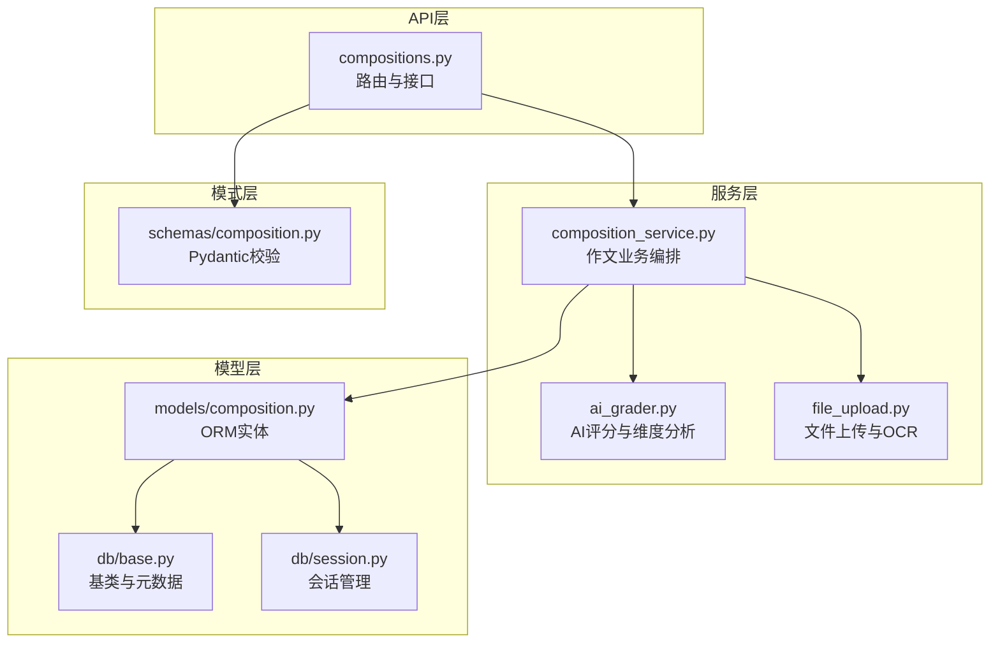
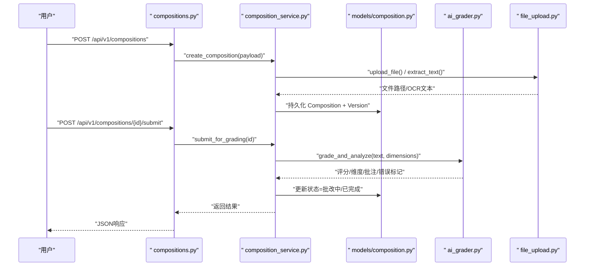
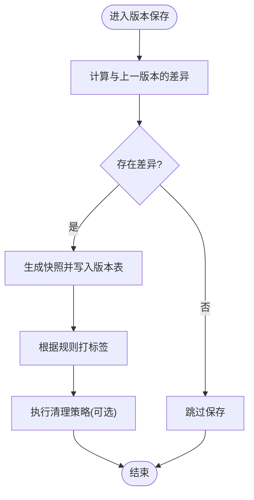
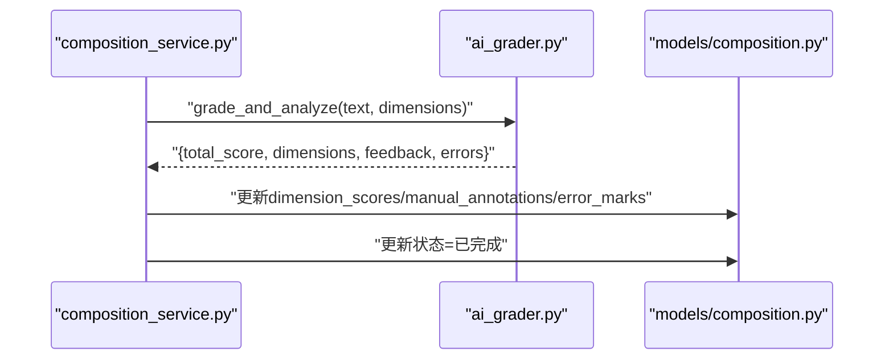
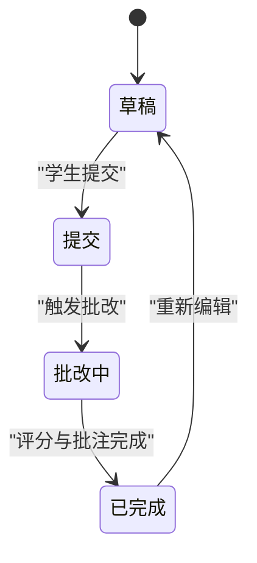
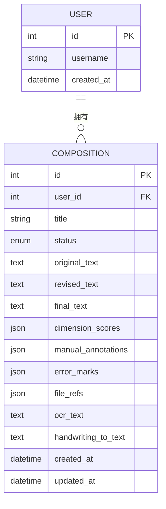
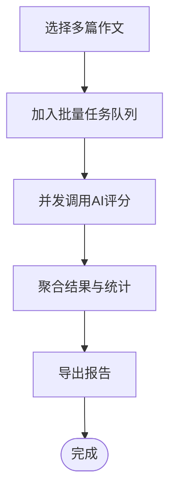
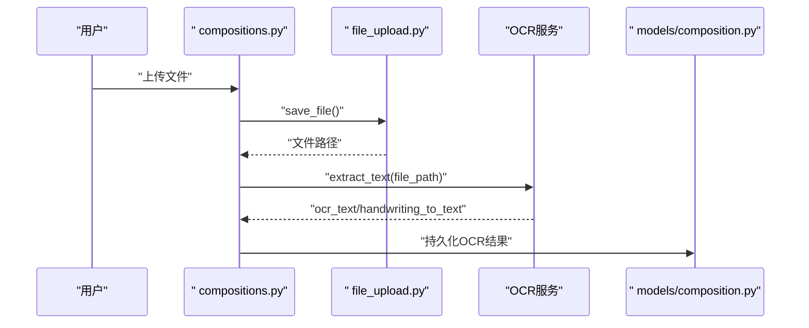
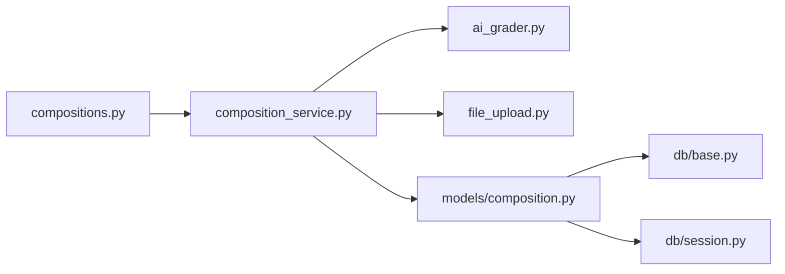

# 作文实体设计

<cite>
**本文引用的文件**   
- [backend/app/models/composition.py](file://backend/app/models/composition.py)
- [backend/app/schemas/composition.py](file://backend/app/schemas/composition.py)
- [backend/app/api/v1/compositions.py](file://backend/app/api/v1/compositions.py)
- [backend/app/services/composition_service.py](file://backend/app/services/composition_service.py)
- [backend/app/services/ai_grader.py](file://backend/app/services/ai_grader.py)
- [backend/app/services/file_upload.py](file://backend/app/services/file_upload.py)
- [backend/app/db/base.py](file://backend/app/db/base.py)
- [backend/app/db/session.py](file://backend/app/db/session.py)
</cite>

## 目录
1. [引言](#引言)
2. [项目结构](#项目结构)
3. [核心组件](#核心组件)
4. [架构总览](#架构总览)
5. [详细组件分析](#详细组件分析)
6. [依赖关系分析](#依赖关系分析)
7. [性能考虑](#性能考虑)
8. [故障排查指南](#故障排查指南)
9. [结论](#结论)
10. [附录](#附录)

## 引言
本设计文档聚焦于“作文”实体的数据模型与系统实现，覆盖以下关键目标：
- 数据结构设计：原文、修改稿、最终版本等版本管理；批改结果存储（AI评分、人工批注、语法错误标记）；评分维度分析（内容、结构、语言、创意）。
- 进度跟踪机制：草稿、提交、批改中、已完成。
- 关联关系：作文与用户的关系、版本历史管理、批量批改支持。
- 文件与OCR：作文文件存储策略、OCR识别结果、手写体转文本处理。
- 数据库与ORM：SQL建表示例与ORM模型对照，大文本字段优化与检索性能策略。

## 项目结构
后端采用分层架构：API层负责路由与请求校验，服务层封装业务逻辑，模型层定义ORM实体，Schema层定义Pydantic校验结构，任务与工具层提供异步处理与通用能力。



图表来源
- [backend/app/api/v1/compositions.py](file://backend/app/api/v1/compositions.py)
- [backend/app/services/composition_service.py](file://backend/app/services/composition_service.py)
- [backend/app/services/ai_grader.py](file://backend/app/services/ai_grader.py)
- [backend/app/services/file_upload.py](file://backend/app/services/file_upload.py)
- [backend/app/models/composition.py](file://backend/app/models/composition.py)
- [backend/app/db/base.py](file://backend/app/db/base.py)
- [backend/app/db/session.py](file://backend/app/db/session.py)
- [backend/app/schemas/composition.py](file://backend/app/schemas/composition.py)

章节来源
- [backend/app/api/v1/compositions.py](file://backend/app/api/v1/compositions.py)
- [backend/app/services/composition_service.py](file://backend/app/services/composition_service.py)
- [backend/app/models/composition.py](file://backend/app/models/composition.py)
- [backend/app/schemas/composition.py](file://backend/app/schemas/composition.py)
- [backend/app/db/base.py](file://backend/app/db/base.py)
- [backend/app/db/session.py](file://backend/app/db/session.py)

## 核心组件
- 作文实体（Composition）：承载作文的文本内容、版本信息、状态、评分与批注、文件引用、OCR结果等。
- 版本历史（CompositionVersion）：记录每次提交的差异快照，支持回溯与对比。
- 评分维度（ScoreDimension）：内容、结构、语言、创意四个维度的量化评分与评语。
- 批注与错误标记（Annotation & ErrorMark）：人工或AI生成的批注与语法错误定位。
- 文件与OCR（FileRef & OCRResult）：原始文件、中间产物与OCR识别文本。
- 用户关联（User）：作者与批改者角色分离，支持多对一或多对多扩展。

章节来源
- [backend/app/models/composition.py](file://backend/app/models/composition.py)
- [backend/app/schemas/composition.py](file://backend/app/schemas/composition.py)
- [backend/app/services/composition_service.py](file://backend/app/services/composition_service.py)

## 架构总览
作文从创建到完成的生命周期如下：
- 创建草稿：用户上传文件或输入文本，生成初始版本与OCR结果。
- 提交与批改：触发AI评分与维度分析，生成评分与批注；教师可补充人工批注。
- 版本迭代：学生基于反馈进行修改，形成新版本；最终版本归档。
- 批量批改：教师选择多篇作文，统一触发AI评分与报告生成。



图表来源
- [backend/app/api/v1/compositions.py](file://backend/app/api/v1/compositions.py)
- [backend/app/services/composition_service.py](file://backend/app/services/composition_service.py)
- [backend/app/models/composition.py](file://backend/app/models/composition.py)
- [backend/app/services/ai_grader.py](file://backend/app/services/ai_grader.py)
- [backend/app/services/file_upload.py](file://backend/app/services/file_upload.py)

## 详细组件分析

### 作文实体（Composition）数据模型
- 基本属性
  - id：主键
  - user_id：作者ID（外键）
  - title：标题
  - status：状态枚举（草稿、提交、批改中、已完成）
  - created_at/updated_at：时间戳
- 内容管理
  - original_text：原文
  - revised_text：修改稿
  - final_text：最终版本
  - current_version_id：当前版本外键
- 批改结果
  - ai_score：AI总分
  - ai_feedback：AI评语
  - manual_annotations：人工批注（JSON）
  - error_marks：语法错误标记（JSON）
- 评分维度
  - dimension_scores：JSON对象，包含内容、结构、语言、创意四维分数与评语
- 文件与OCR
  - file_refs：JSON数组，存储文件路径与类型
  - ocr_text：OCR识别文本
  - handwriting_to_text：手写体转文本结果
- 索引与约束
  - 对user_id、status、created_at建立索引以优化查询
  - 对title、original_text、revised_text、final_text使用全文检索或分词索引（视数据库能力）

```mermaid
classDiagram
class User {
+int id
+string username
+datetime created_at
}
class Composition {
+int id
+int user_id
+string title
+enum status
+text original_text
+text revised_text
+text final_text
+json dimension_scores
+json manual_annotations
+json error_marks
+json file_refs
+text ocr_text
+text handwriting_to_text
+datetime created_at
+datetime updated_at
}
class CompositionVersion {
+int id
+int composition_id
+text content_snapshot
+string version_label
+datetime created_at
}
class ScoreDimension {
+int id
+int composition_id
+string name
+float score
+string comment
}
class Annotation {
+int id
+int composition_id
+string type
+json payload
+datetime created_at
}
class FileRef {
+int id
+int composition_id
+string file_path
+string file_type
}
class OCRResult {
+int id
+int composition_id
+text ocr_text
+text handwriting_to_text
+datetime processed_at
}
User ||--o{ Composition : "拥有"
Composition ||--o{ CompositionVersion : "包含多个版本"
Composition ||--o{ ScoreDimension : "多维评分"
Composition ||--o{ Annotation : "批注"
Composition ||--o{ FileRef : "文件引用"
Composition ||--o{ OCRResult : "OCR结果"
```

图表来源
- [backend/app/models/composition.py](file://backend/app/models/composition.py)
- [backend/app/db/base.py](file://backend/app/db/base.py)

章节来源
- [backend/app/models/composition.py](file://backend/app/models/composition.py)
- [backend/app/db/base.py](file://backend/app/db/base.py)

### 版本历史管理（CompositionVersion）
- 目的：保留每次提交的完整快照，支持对比与回溯。
- 字段：composition_id、content_snapshot、version_label、created_at。
- 策略：
  - 增量保存：仅保存变更部分与差异摘要，同时保留全量快照用于快速展示。
  - 标签化：为重要版本打标签（如“初稿”、“二稿”、“终稿”）。
  - 清理策略：超过阈值的旧版本归档或压缩。



图表来源
- [backend/app/services/composition_service.py](file://backend/app/services/composition_service.py)
- [backend/app/models/composition.py](file://backend/app/models/composition.py)

章节来源
- [backend/app/services/composition_service.py](file://backend/app/services/composition_service.py)
- [backend/app/models/composition.py](file://backend/app/models/composition.py)

### 批改结果与评分维度（AI评分、人工批注、语法错误标记）
- AI评分与维度分析
  - 输入：作文文本（优先使用final_text，否则revised_text，最后original_text）。
  - 输出：总分、各维度分数与评语、整体建议。
- 人工批注
  - 支持富文本与定位标记（段落、句子、词语级别）。
  - 与AI批注合并展示，区分来源。
- 语法错误标记
  - 结构化错误列表：位置、类型、建议修正。
  - 前端高亮显示，支持一键应用建议。



图表来源
- [backend/app/services/composition_service.py](file://backend/app/services/composition_service.py)
- [backend/app/services/ai_grader.py](file://backend/app/services/ai_grader.py)
- [backend/app/models/composition.py](file://backend/app/models/composition.py)

章节来源
- [backend/app/services/composition_service.py](file://backend/app/services/composition_service.py)
- [backend/app/services/ai_grader.py](file://backend/app/services/ai_grader.py)
- [backend/app/models/composition.py](file://backend/app/models/composition.py)

### 进度跟踪机制（草稿、提交、批改中、已完成）
- 状态流转
  - 草稿：创建后默认状态。
  - 提交：学生点击提交，状态变为“提交”，等待批改。
  - 批改中：触发AI评分或人工批改流程。
  - 已完成：评分与批注完成，可归档。
- 事件驱动
  - 通过消息队列或任务调度触发异步批改，避免阻塞请求。
  - 状态变更推送至前端（WebSocket或轮询）。



图表来源
- [backend/app/services/composition_service.py](file://backend/app/services/composition_service.py)
- [backend/app/models/composition.py](file://backend/app/models/composition.py)

章节来源
- [backend/app/services/composition_service.py](file://backend/app/services/composition_service.py)
- [backend/app/models/composition.py](file://backend/app/models/composition.py)

### 作文与用户的关联关系
- 一对多：一个用户可拥有多篇作文。
- 角色扩展：作者与批改者可分离，支持教师、助教等多角色。
- 权限控制：基于用户角色的访问控制（查看、编辑、批改）。



图表来源
- [backend/app/models/composition.py](file://backend/app/models/composition.py)

章节来源
- [backend/app/models/composition.py](file://backend/app/models/composition.py)

### 批量批改支持
- 选择范围：按班级、作业、日期筛选多篇作文。
- 并行处理：任务队列并发调用AI评分服务，限制并发度以避免过载。
- 进度汇总：实时统计已处理数量与失败重试次数。
- 结果导出：批量导出评分与批注为Excel或PDF。



图表来源
- [backend/app/services/composition_service.py](file://backend/app/services/composition_service.py)
- [backend/app/services/ai_grader.py](file://backend/app/services/ai_grader.py)

章节来源
- [backend/app/services/composition_service.py](file://backend/app/services/composition_service.py)
- [backend/app/services/ai_grader.py](file://backend/app/services/ai_grader.py)

### 文件存储策略与OCR处理
- 文件存储
  - 本地磁盘或对象存储（如MinIO/S3），按用户与日期组织目录。
  - 文件元数据与Composition关联，支持预览与下载。
- OCR与手写体转文本
  - 上传后异步进行OCR识别，结果存入ocr_text与handwriting_to_text。
  - 支持多格式（图片、PDF、扫描件），失败重试与降级策略。
  - 文本清洗与规范化，去除噪声字符，提升后续NLP处理质量。



图表来源
- [backend/app/api/v1/compositions.py](file://backend/app/api/v1/compositions.py)
- [backend/app/services/file_upload.py](file://backend/app/services/file_upload.py)
- [backend/app/models/composition.py](file://backend/app/models/composition.py)

章节来源
- [backend/app/services/file_upload.py](file://backend/app/services/file_upload.py)
- [backend/app/models/composition.py](file://backend/app/models/composition.py)

### SQL建表示例与ORM对照
以下为典型建表语句与ORM模型的对应关系（字段名与类型可根据实际数据库调整）：
- 作文表（compositions）
  - id: INT PRIMARY KEY
  - user_id: INT NOT NULL REFERENCES users(id)
  - title: VARCHAR(255)
  - status: ENUM('draft','submitted','grading','completed')
  - original_text: TEXT
  - revised_text: TEXT
  - final_text: TEXT
  - dimension_scores: JSON
  - manual_annotations: JSON
  - error_marks: JSON
  - file_refs: JSON
  - ocr_text: TEXT
  - handwriting_to_text: TEXT
  - created_at: TIMESTAMP
  - updated_at: TIMESTAMP
- 版本历史表（composition_versions）
  - id: INT PRIMARY KEY
  - composition_id: INT NOT NULL REFERENCES compositions(id)
  - content_snapshot: TEXT
  - version_label: VARCHAR(100)
  - created_at: TIMESTAMP
- 评分维度表（score_dimensions）
  - id: INT PRIMARY KEY
  - composition_id: INT NOT NULL REFERENCES compositions(id)
  - name: VARCHAR(50)
  - score: FLOAT
  - comment: TEXT
- 批注表（annotations）
  - id: INT PRIMARY KEY
  - composition_id: INT NOT NULL REFERENCES compositions(id)
  - type: VARCHAR(50)
  - payload: JSON
  - created_at: TIMESTAMP
- 文件引用表（file_refs）
  - id: INT PRIMARY KEY
  - composition_id: INT NOT NULL REFERENCES compositions(id)
  - file_path: VARCHAR(500)
  - file_type: VARCHAR(50)
- OCR结果表（ocr_results）
  - id: INT PRIMARY KEY
  - composition_id: INT NOT NULL REFERENCES compositions(id)
  - ocr_text: TEXT
  - handwriting_to_text: TEXT
  - processed_at: TIMESTAMP

ORM模型映射要点：
- 使用Base类继承与声明式定义（参见base.py）。
- 外键关系通过relationship配置，支持懒加载与级联操作。
- JSON字段使用数据库原生JSON类型，便于查询与索引。
- 时间戳字段使用UTC与时区转换。

章节来源
- [backend/app/models/composition.py](file://backend/app/models/composition.py)
- [backend/app/db/base.py](file://backend/app/db/base.py)

## 依赖关系分析
- API层依赖服务层：路由调用业务方法，参数经Schema校验。
- 服务层依赖模型层：读写数据库，编排AI与文件处理。
- 模型层依赖数据库会话：通过session管理事务与连接。
- 外部集成：AI评分服务、OCR服务、对象存储。



图表来源
- [backend/app/api/v1/compositions.py](file://backend/app/api/v1/compositions.py)
- [backend/app/services/composition_service.py](file://backend/app/services/composition_service.py)
- [backend/app/services/ai_grader.py](file://backend/app/services/ai_grader.py)
- [backend/app/services/file_upload.py](file://backend/app/services/file_upload.py)
- [backend/app/models/composition.py](file://backend/app/models/composition.py)
- [backend/app/db/base.py](file://backend/app/db/base.py)
- [backend/app/db/session.py](file://backend/app/db/session.py)

章节来源
- [backend/app/api/v1/compositions.py](file://backend/app/api/v1/compositions.py)
- [backend/app/services/composition_service.py](file://backend/app/services/composition_service.py)
- [backend/app/models/composition.py](file://backend/app/models/composition.py)
- [backend/app/db/base.py](file://backend/app/db/base.py)
- [backend/app/db/session.py](file://backend/app/db/session.py)

## 性能考虑
- 大文本字段优化
  - 分片存储：将超长文本拆分为片段，按需加载。
  - 压缩与去重：对重复内容进行压缩，减少存储占用。
  - 缓存热点：常用文本与评分结果缓存至Redis。
- 检索性能
  - 全文索引：对title、original_text、revised_text、final_text建立搜索引擎索引（如Elasticsearch）。
  - 分页与过滤：结合状态、时间、用户维度进行高效查询。
  - 异步处理：OCR与AI评分走异步任务，降低请求延迟。
- 并发与限流
  - 批量批改限制并发度，避免资源耗尽。
  - 失败重试与退避策略，保证可靠性。

[本节为通用指导，不直接分析具体文件]

## 故障排查指南
- 常见问题
  - OCR失败：检查文件格式与清晰度，确认OCR服务可用性。
  - AI评分超时：调整并发度与超时时间，查看日志与重试计数。
  - 文件上传异常：验证存储路径权限与大小限制。
- 诊断手段
  - 日志追踪：记录关键步骤与异常堆栈。
  - 指标监控：CPU、内存、队列长度、错误率。
  - 数据一致性：核对版本快照与最终文本的一致性。

章节来源
- [backend/app/services/composition_service.py](file://backend/app/services/composition_service.py)
- [backend/app/services/ai_grader.py](file://backend/app/services/ai_grader.py)
- [backend/app/services/file_upload.py](file://backend/app/services/file_upload.py)

## 结论
本设计围绕作文实体的全生命周期展开，涵盖版本管理、评分与批注、OCR与文件处理、批量批改与性能优化。通过清晰的层次结构与可扩展的数据模型，系统能够支撑复杂的教学场景与大规模数据处理需求。建议在后续迭代中引入更完善的搜索与可视化能力，进一步提升用户体验与分析深度。

[本节为总结性内容，不直接分析具体文件]

## 附录
- 术语表
  - 原文：学生首次提交的文本。
  - 修改稿：基于反馈修订后的文本。
  - 最终版本：定稿文本，用于归档与统计。
  - 批注：教师或AI对作文的点评与建议。
  - 错误标记：语法错误的定位与修正建议。
- 参考实现路径
  - API路由：[backend/app/api/v1/compositions.py](file://backend/app/api/v1/compositions.py)
  - 服务编排：[backend/app/services/composition_service.py](file://backend/app/services/composition_service.py)
  - AI评分：[backend/app/services/ai_grader.py](file://backend/app/services/ai_grader.py)
  - 文件与OCR：[backend/app/services/file_upload.py](file://backend/app/services/file_upload.py)
  - ORM模型：[backend/app/models/composition.py](file://backend/app/models/composition.py)
  - 数据库基础：[backend/app/db/base.py](file://backend/app/db/base.py)、[backend/app/db/session.py](file://backend/app/db/session.py)