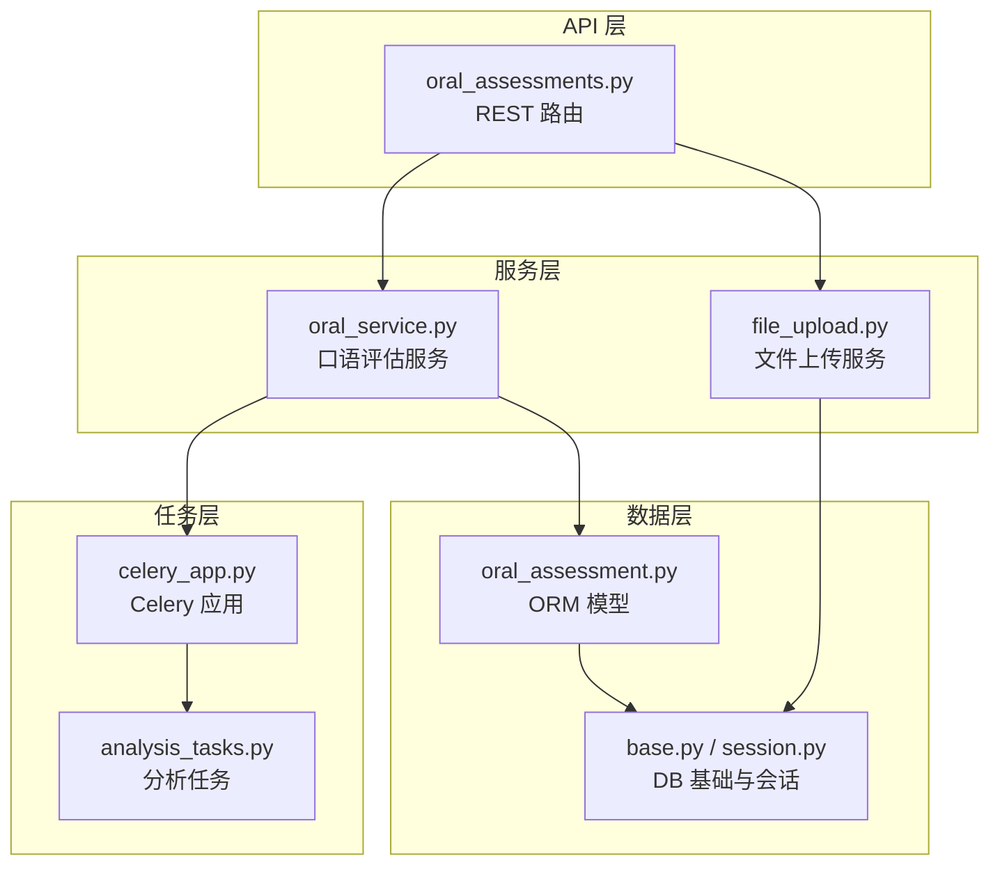
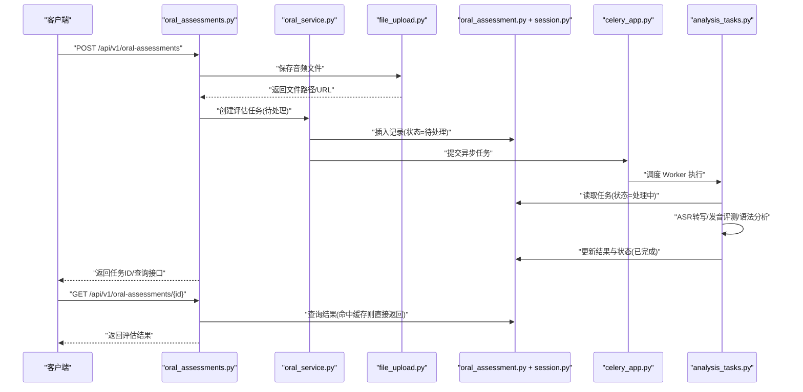
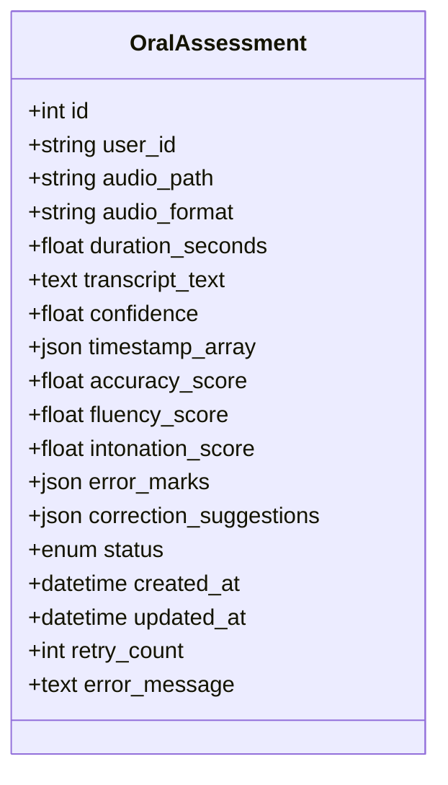
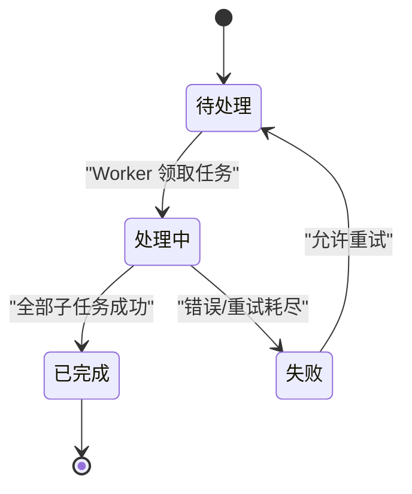
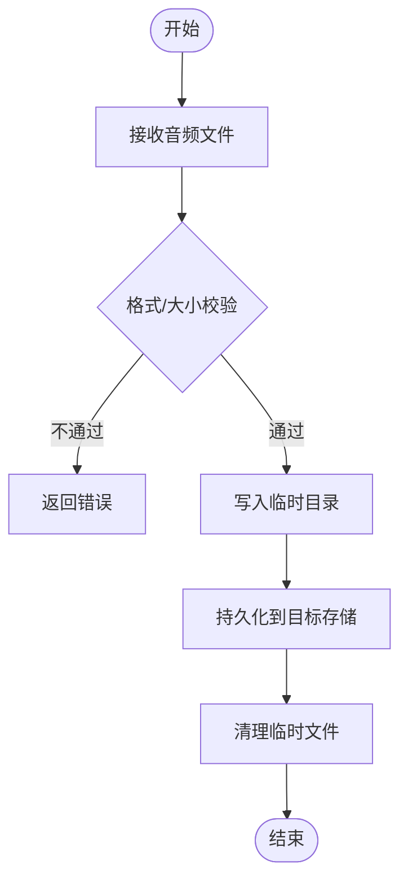
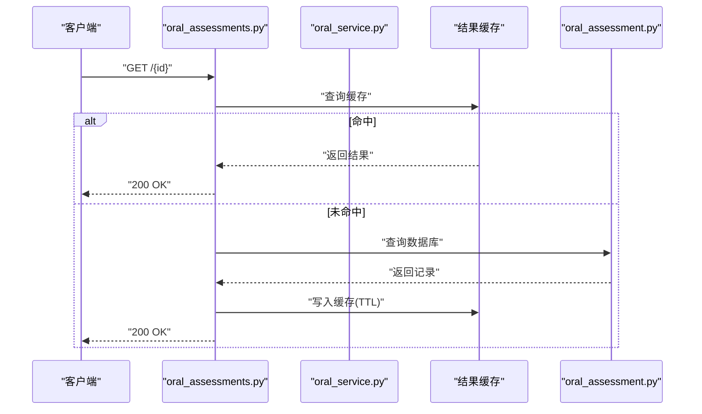
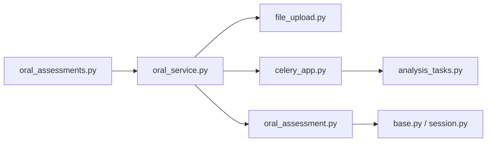

# 口语评估实体设计

<cite>
**本文引用的文件**   
- [oral_assessment.py](file://backend/app/models/oral_assessment.py)
- [oral_assessments.py](file://backend/app/api/v1/oral_assessments.py)
- [oral_service.py](file://backend/app/services/oral_service.py)
- [file_upload.py](file://backend/app/services/file_upload.py)
- [celery_app.py](file://backend/app/tasks/celery_app.py)
- [analysis_tasks.py](file://backend/app/tasks/analysis_tasks.py)
- [base.py](file://backend/app/db/base.py)
- [session.py](file://backend/app/db/session.py)
</cite>

## 目录
1. [引言](#引言)
2. [项目结构](#项目结构)
3. [核心组件](#核心组件)
4. [架构总览](#架构总览)
5. [详细组件分析](#详细组件分析)
6. [依赖关系分析](#依赖关系分析)
7. [性能考虑](#性能考虑)
8. [故障排查指南](#故障排查指南)
9. [结论](#结论)
10. [附录](#附录)

## 引言
本设计文档围绕“口语评估”业务，系统化阐述 OralAssessment 实体的数据模型、状态流转、异步处理与缓存策略，并给出多媒体（音频）存储管理、临时文件清理与大文件传输优化方案。文档同时提供 SQL 建表示例与 ORM 模型对照，帮助读者快速理解从数据库到服务层再到 API 的完整链路。

## 项目结构
本项目采用分层架构：API 层暴露 REST 接口；服务层封装业务逻辑；任务层使用 Celery 执行耗时任务；数据访问层基于 SQLAlchemy ORM；配置与依赖注入位于 core 与 db 模块。



图表来源
- [oral_assessments.py](file://backend/app/api/v1/oral_assessments.py)
- [oral_service.py](file://backend/app/services/oral_service.py)
- [file_upload.py](file://backend/app/services/file_upload.py)
- [celery_app.py](file://backend/app/tasks/celery_app.py)
- [analysis_tasks.py](file://backend/app/tasks/analysis_tasks.py)
- [oral_assessment.py](file://backend/app/models/oral_assessment.py)
- [base.py](file://backend/app/db/base.py)
- [session.py](file://backend/app/db/session.py)

章节来源
- [oral_assessments.py](file://backend/app/api/v1/oral_assessments.py)
- [oral_service.py](file://backend/app/services/oral_service.py)
- [file_upload.py](file://backend/app/services/file_upload.py)
- [celery_app.py](file://backend/app/tasks/celery_app.py)
- [analysis_tasks.py](file://backend/app/tasks/analysis_tasks.py)
- [oral_assessment.py](file://backend/app/models/oral_assessment.py)
- [base.py](file://backend/app/db/base.py)
- [session.py](file://backend/app/db/session.py)

## 核心组件
- 数据模型：OralAssessment 实体承载语音文件信息、转写结果、发音评分、语法分析与任务状态等字段。
- 服务层：oral_service.py 负责创建评估任务、查询结果、触发异步处理与缓存命中。
- 任务层：Celery 任务用于离线执行 ASR 转写、发音评测与语法分析，避免阻塞请求。
- 文件服务：file_upload.py 负责音频文件的持久化、路径管理与生命周期清理。
- 数据访问：SQLAlchemy 模型映射至数据库表，配合 base.py 与 session.py 进行连接与会话管理。

章节来源
- [oral_assessment.py](file://backend/app/models/oral_assessment.py)
- [oral_service.py](file://backend/app/services/oral_service.py)
- [file_upload.py](file://backend/app/services/file_upload.py)
- [celery_app.py](file://backend/app/tasks/celery_app.py)
- [analysis_tasks.py](file://backend/app/tasks/analysis_tasks.py)
- [base.py](file://backend/app/db/base.py)
- [session.py](file://backend/app/db/session.py)

## 架构总览
下图展示一次完整的口语评估流程：前端上传音频，后端持久化并创建评估记录，随后将任务投递至 Celery 队列；后台 Worker 执行转写与评测，更新结果与状态；客户端通过轮询或事件机制获取最终结果。



图表来源
- [oral_assessments.py](file://backend/app/api/v1/oral_assessments.py)
- [oral_service.py](file://backend/app/services/oral_service.py)
- [file_upload.py](file://backend/app/services/file_upload.py)
- [oral_assessment.py](file://backend/app/models/oral_assessment.py)
- [session.py](file://backend/app/db/session.py)
- [celery_app.py](file://backend/app/tasks/celery_app.py)
- [analysis_tasks.py](file://backend/app/tasks/analysis_tasks.py)

## 详细组件分析

### 数据模型：OralAssessment 实体
该实体包含以下关键维度：
- 语音文件管理
  - 音频路径：本地或对象存储路径
  - 格式：如 mp3/wav/flac
  - 时长：秒级浮点
- 转写结果
  - 文本内容：ASR 输出
  - 置信度：0~1 浮点
  - 时间戳：词级或句级对齐数组
- 发音评估
  - 准确度：0~100 分
  - 流利度：0~100 分
  - 语调：0~100 分
- 语法分析
  - 错误标记：JSON 数组，含位置、类型、描述
  - 修正建议：JSON 字符串或结构化对象
- 任务状态
  - 枚举：待处理、处理中、已完成、失败
- 元数据
  - 用户标识、任务 ID、创建/更新时间、重试次数、错误信息等



图表来源
- [oral_assessment.py](file://backend/app/models/oral_assessment.py)

章节来源
- [oral_assessment.py](file://backend/app/models/oral_assessment.py)

### 状态管理与异步处理
- 状态机
  - 待处理：记录创建后进入
  - 处理中：Worker 领取任务后切换
  - 已完成：所有子任务成功
  - 失败：不可恢复错误或超过重试上限
- 异步机制
  - 使用 Celery 作为任务队列，支持延迟与重试
  - 任务粒度：ASR 转写、发音评测、语法分析可拆分为子任务
- 结果缓存
  - 在内存或 Redis 中缓存最近结果，键包含任务 ID 与版本
  - 设置 TTL 与失效策略，保证一致性



图表来源
- [oral_service.py](file://backend/app/services/oral_service.py)
- [celery_app.py](file://backend/app/tasks/celery_app.py)
- [analysis_tasks.py](file://backend/app/tasks/analysis_tasks.py)

章节来源
- [oral_service.py](file://backend/app/services/oral_service.py)
- [celery_app.py](file://backend/app/tasks/celery_app.py)
- [analysis_tasks.py](file://backend/app/tasks/analysis_tasks.py)

### 语音文件存储与生命周期管理
- 存储策略
  - 小文件：本地磁盘按日期/用户分桶
  - 大文件：对象存储（S3/OSS），服务端仅存路径与元数据
- 临时文件清理
  - 上传阶段生成临时文件，任务完成后统一清理
  - 定时任务扫描过期目录，删除超过阈值的残留
- 大文件传输优化
  - 断点续传、分片上传、并发校验
  - 流式写入减少内存占用



图表来源
- [file_upload.py](file://backend/app/services/file_upload.py)

章节来源
- [file_upload.py](file://backend/app/services/file_upload.py)

### API 与服务层交互
- 创建评估任务
  - 接收 multipart/form-data 或二进制流
  - 调用文件服务保存音频，创建评估记录，投递异步任务
- 查询评估结果
  - 优先查缓存，未命中再查数据库
  - 返回结构化结果（转写、评分、错误与建议）
- 重试与幂等
  - 基于任务 ID 去重，避免重复处理
  - 失败任务支持手动重试



图表来源
- [oral_assessments.py](file://backend/app/api/v1/oral_assessments.py)
- [oral_service.py](file://backend/app/services/oral_service.py)
- [oral_assessment.py](file://backend/app/models/oral_assessment.py)

章节来源
- [oral_assessments.py](file://backend/app/api/v1/oral_assessments.py)
- [oral_service.py](file://backend/app/services/oral_service.py)
- [oral_assessment.py](file://backend/app/models/oral_assessment.py)

## 依赖关系分析
- 低耦合高内聚
  - API 层仅做参数校验与响应组装，业务逻辑下沉至服务层
  - 任务层与数据层解耦，通过消息队列与数据库交互
- 外部依赖
  - Celery：任务调度与重试
  - 对象存储：音频文件持久化
  - 缓存：Redis 或内存字典
- 潜在循环依赖
  - 服务层不应直接导入任务层实现细节，应通过抽象接口或事件总线



图表来源
- [oral_assessments.py](file://backend/app/api/v1/oral_assessments.py)
- [oral_service.py](file://backend/app/services/oral_service.py)
- [file_upload.py](file://backend/app/services/file_upload.py)
- [celery_app.py](file://backend/app/tasks/celery_app.py)
- [analysis_tasks.py](file://backend/app/tasks/analysis_tasks.py)
- [oral_assessment.py](file://backend/app/models/oral_assessment.py)
- [base.py](file://backend/app/db/base.py)
- [session.py](file://backend/app/db/session.py)

章节来源
- [oral_assessments.py](file://backend/app/api/v1/oral_assessments.py)
- [oral_service.py](file://backend/app/services/oral_service.py)
- [file_upload.py](file://backend/app/services/file_upload.py)
- [celery_app.py](file://backend/app/tasks/celery_app.py)
- [analysis_tasks.py](file://backend/app/tasks/analysis_tasks.py)
- [oral_assessment.py](file://backend/app/models/oral_assessment.py)
- [base.py](file://backend/app/db/base.py)
- [session.py](file://backend/app/db/session.py)

## 性能考虑
- 数据库索引
  - 对 user_id、status、created_at 建立索引，加速列表与统计查询
  - 对 transcript_text 使用全文检索扩展（如 PostgreSQL pg_trgm/FTS）
- 缓存策略
  - 热点结果短期缓存，TTL 合理设置，避免脏读
  - 缓存键包含版本号，便于更新后失效
- I/O 优化
  - 大文件分块上传与并行校验
  - 流式写入与压缩存储，降低带宽与空间占用
- 任务批处理
  - 批量提交与合并结果，减少数据库往返
  - 任务优先级与限流，防止雪崩

[本节为通用指导，无需具体文件引用]

## 故障排查指南
- 常见问题
  - 任务长时间处于“处理中”：检查 Celery Worker 是否运行、队列是否堆积
  - 音频无法播放：确认存储路径权限与 URL 签名有效期
  - 结果不一致：核对缓存 TTL 与任务版本，必要时强制刷新
- 日志与追踪
  - 为每个任务分配唯一 ID，贯穿 API、服务、任务与数据库
  - 关键步骤打点，记录耗时与异常堆栈
- 回滚与重试
  - 失败任务自动重试，指数退避
  - 人工干预入口，支持重新入队与覆盖结果

章节来源
- [celery_app.py](file://backend/app/tasks/celery_app.py)
- [analysis_tasks.py](file://backend/app/tasks/analysis_tasks.py)
- [oral_service.py](file://backend/app/services/oral_service.py)

## 结论
本设计以 OralAssessment 为核心，构建了从上传、异步处理到结果查询的完整闭环。通过明确的状态机、合理的缓存策略与稳健的文件生命周期管理，系统在可扩展性与稳定性之间取得平衡。后续可引入更细粒度的指标与可视化面板，进一步提升用户体验与运维效率。

[本节为总结性内容，无需具体文件引用]

## 附录

### SQL 建表示例（PostgreSQL）
以下为 OralAssessment 表的参考定义，字段与类型对应 ORM 模型设计：

```sql
CREATE TABLE oral_assessments (
    id SERIAL PRIMARY KEY,
    user_id VARCHAR(64) NOT NULL,
    audio_path TEXT NOT NULL,
    audio_format VARCHAR(16),
    duration_seconds NUMERIC(10,3),
    transcript_text TEXT,
    confidence NUMERIC(5,4),
    timestamp_array JSONB,
    accuracy_score NUMERIC(5,2),
    fluency_score NUMERIC(5,2),
    intonation_score NUMERIC(5,2),
    error_marks JSONB,
    correction_suggestions JSONB,
    status VARCHAR(32) NOT NULL DEFAULT 'pending',
    created_at TIMESTAMP WITH TIME ZONE DEFAULT NOW(),
    updated_at TIMESTAMP WITH TIME ZONE DEFAULT NOW(),
    retry_count INTEGER DEFAULT 0,
    error_message TEXT
);

-- 常用索引
CREATE INDEX idx_oral_user_status ON oral_assessments(user_id, status);
CREATE INDEX idx_oral_created_at ON oral_assessments(created_at DESC);
```

[本节为概念性示例，无需具体文件引用]

### ORM 模型与 SQL 对照要点
- 主键：id → SERIAL/INT PK
- 外键：user_id → 关联用户表（由业务约束）
- 数值精度：duration_seconds/confidence/scores → NUMERIC
- JSON 字段：timestamp_array/error_marks/correction_suggestions → JSONB
- 状态枚举：status → VARCHAR 并在应用层约束取值
- 审计字段：created_at/updated_at → TIMESTAMP WITH TIME ZONE

章节来源
- [oral_assessment.py](file://backend/app/models/oral_assessment.py)
- [base.py](file://backend/app/db/base.py)
- [session.py](file://backend/app/db/session.py)