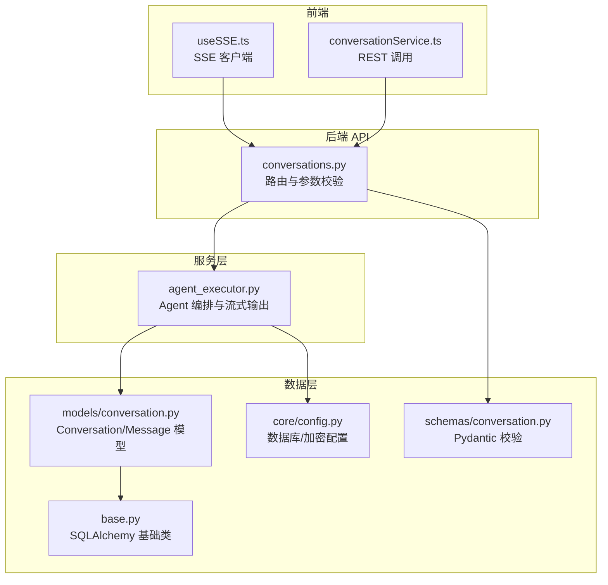
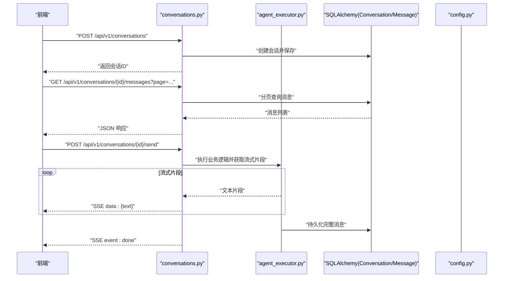
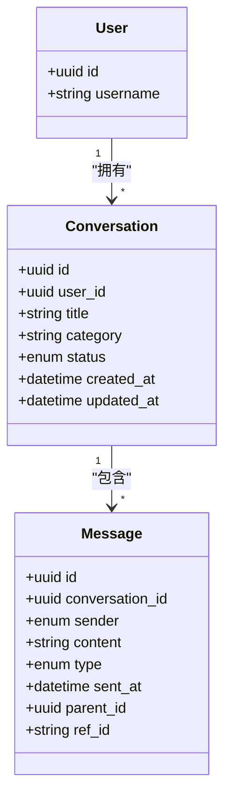
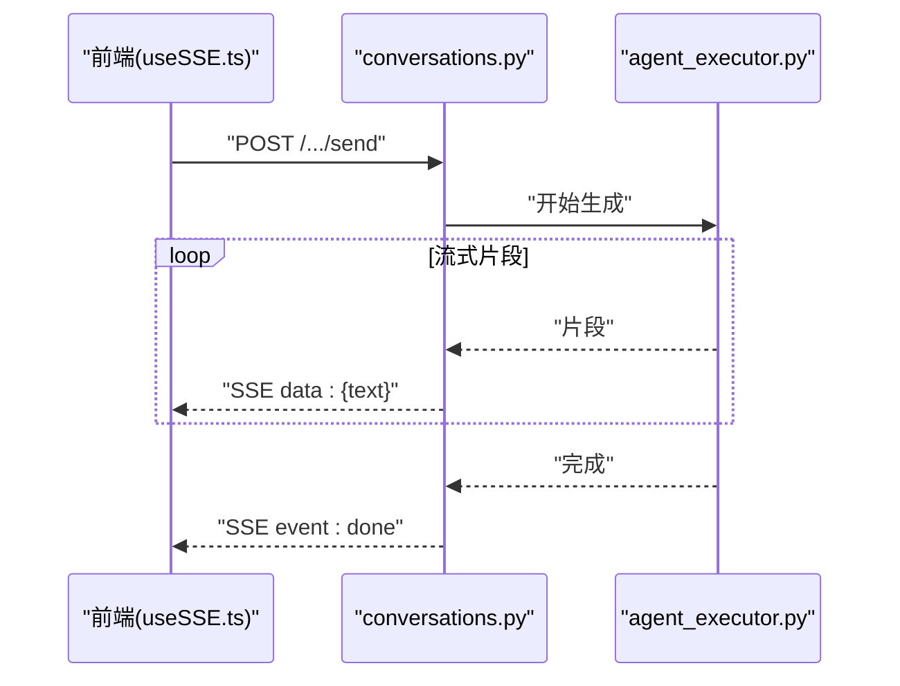
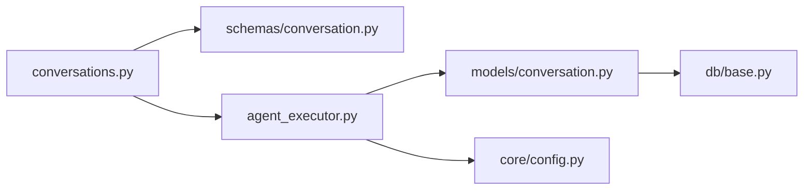

# 对话实体设计

<cite>
**本文引用的文件**   
- [backend/app/models/conversation.py](file://backend/app/models/conversation.py)
- [backend/app/schemas/conversation.py](file://backend/app/schemas/conversation.py)
- [backend/app/api/v1/conversations.py](file://backend/app/api/v1/conversations.py)
- [backend/app/services/agent/agent_executor.py](file://backend/app/services/agent/agent_executor.py)
- [backend/app/db/base.py](file://backend/app/db/base.py)
- [backend/app/core/config.py](file://backend/app/core/config.py)
- [frontend/src/hooks/useSSE.ts](file://frontend/src/hooks/useSSE.ts)
- [frontend/src/services/conversationService.ts](file://frontend/src/services/conversationService.ts)
</cite>

## 目录
1. [引言](#引言)
2. [项目结构](#项目结构)
3. [核心组件](#核心组件)
4. [架构总览](#架构总览)
5. [详细组件分析](#详细组件分析)
6. [依赖分析](#依赖分析)
7. [性能考虑](#性能考虑)
8. [故障排查指南](#故障排查指南)
9. [结论](#结论)
10. [附录](#附录)

## 引言
本设计文档围绕“对话实体”展开，聚焦 Conversation 模型的数据结构设计、会话与用户关联、消息记录与上下文维护、会话状态管理、分页加载、实时通信支持、持久化策略、加密存储与敏感信息过滤，并提供分表策略与查询优化建议。文档同时给出 SQL 建表示例与 ORM 模型对照，帮助读者从概念到实现全面理解。

## 项目结构
后端采用分层架构：API 层暴露 REST/SSE 接口；服务层封装业务逻辑（含 Agent 执行器）；数据访问层基于 SQLAlchemy 模型与迁移工具；前端通过 HTTP 与 SSE 与后端交互。

图表来源
- [backend/app/api/v1/conversations.py](file://backend/app/api/v1/conversations.py)
- [backend/app/services/agent/agent_executor.py](file://backend/app/services/agent/agent_executor.py)
- [backend/app/models/conversation.py](file://backend/app/models/conversation.py)
- [backend/app/schemas/conversation.py](file://backend/app/schemas/conversation.py)
- [backend/app/db/base.py](file://backend/app/db/base.py)
- [backend/app/core/config.py](file://backend/app/core/config.py)
- [frontend/src/hooks/useSSE.ts](file://frontend/src/hooks/useSSE.ts)
- [frontend/src/services/conversationService.ts](file://frontend/src/services/conversationService.ts)

章节来源
- [backend/app/models/conversation.py](file://backend/app/models/conversation.py)
- [backend/app/schemas/conversation.py](file://backend/app/schemas/conversation.py)
- [backend/app/api/v1/conversations.py](file://backend/app/api/v1/conversations.py)
- [backend/app/services/agent/agent_executor.py](file://backend/app/services/agent/agent_executor.py)
- [backend/app/db/base.py](file://backend/app/db/base.py)
- [backend/app/core/config.py](file://backend/app/core/config.py)
- [frontend/src/hooks/useSSE.ts](file://frontend/src/hooks/useSSE.ts)
- [frontend/src/services/conversationService.ts](file://frontend/src/services/conversationService.ts)

## 核心组件
- 会话模型 Conversation：承载会话元数据（会话ID、用户关联、主题分类、状态等）。
- 消息模型 Message：承载单条消息的发送者、内容、类型、时间戳、引用关系等。
- Schema 校验：使用 Pydantic 对入参与响应进行强类型校验。
- API 路由：提供会话创建、列表、详情、删除、历史消息分页、以及 SSE 流式回复。
- 服务层：Agent 执行器负责生成回复并流式推送。
- 数据层：SQLAlchemy 模型定义与数据库连接。

章节来源
- [backend/app/models/conversation.py](file://backend/app/models/conversation.py)
- [backend/app/schemas/conversation.py](file://backend/app/schemas/conversation.py)
- [backend/app/api/v1/conversations.py](file://backend/app/api/v1/conversations.py)
- [backend/app/services/agent/agent_executor.py](file://backend/app/services/agent/agent_executor.py)
- [backend/app/db/base.py](file://backend/app/db/base.py)

## 架构总览
下图展示了从前端发起请求到后端处理、落库与返回的关键路径，包括 SSE 实时通信流程。

图表来源
- [backend/app/api/v1/conversations.py](file://backend/app/api/v1/conversations.py)
- [backend/app/services/agent/agent_executor.py](file://backend/app/services/agent/agent_executor.py)
- [backend/app/models/conversation.py](file://backend/app/models/conversation.py)
- [backend/app/core/config.py](file://backend/app/core/config.py)
- [frontend/src/hooks/useSSE.ts](file://frontend/src/hooks/useSSE.ts)

## 详细组件分析

### 数据模型与字段设计
- 会话 Conversation
  - 标识与会话管理：会话ID（主键）、创建时间、更新时间。
  - 用户关联：外键指向用户表，支持一对一或多对一（取决于业务）。
  - 主题分类：用于检索与筛选（如学科、任务类型）。
  - 会话状态：活跃、归档、删除（软删除或硬删除）。
- 消息 Message
  - 发送者：user 或 system（AI）。
  - 内容：文本或结构化 JSON（根据类型决定）。
  - 类型：文本、图片、文件、系统提示等。
  - 时间戳：消息发送时间。
  - 引用关系：可包含父消息ID、引用外部资源ID等。
  - 上下文维护：通过会话ID聚合历史消息，按时间排序。

图表来源
- [backend/app/models/conversation.py](file://backend/app/models/conversation.py)

章节来源
- [backend/app/models/conversation.py](file://backend/app/models/conversation.py)

### 会话与用户的关联关系
- 一对多：一个用户可拥有多个会话，会话归属明确，便于权限控制与数据隔离。
- 索引与约束：在 user_id 上建立索引以加速用户维度查询；会话ID唯一且不可变。

章节来源
- [backend/app/models/conversation.py](file://backend/app/models/conversation.py)

### 消息记录与上下文维护
- 历史记录：按 conversation_id 与 sent_at 排序，形成线性上下文。
- 引用关系：parent_id 支持嵌套对话或分支；ref_id 支持跨会话或外部知识引用。
- 上下文窗口：服务端可按需截取最近 N 条消息作为 LLM 输入上下文。

章节来源
- [backend/app/models/conversation.py](file://backend/app/models/conversation.py)

### 会话状态管理
- 状态枚举：活跃（active）、归档（archived）、删除（deleted）。
- 生命周期：创建后为活跃；用户主动归档后不再出现在默认列表；删除可为软删除（标记 deleted=true）或硬删除。

章节来源
- [backend/app/models/conversation.py](file://backend/app/models/conversation.py)

### 分页加载与查询
- 分页参数：page、page_size、order_by（默认按时间倒序）。
- 查询优化：针对 (conversation_id, sent_at) 建立复合索引；大结果集使用游标分页或基于时间的范围查询。

章节来源
- [backend/app/api/v1/conversations.py](file://backend/app/api/v1/conversations.py)
- [backend/app/models/conversation.py](file://backend/app/models/conversation.py)

### 实时通信支持（SSE）
- 客户端：前端 useSSE.ts 订阅事件流，接收 text/done 事件。
- 服务端：conversations.py 中对应端点将 agent_executor.py 产生的片段逐条推送。
- 幂等与重连：客户端应处理断线重连与去重。

图表来源
- [frontend/src/hooks/useSSE.ts](file://frontend/src/hooks/useSSE.ts)
- [backend/app/api/v1/conversations.py](file://backend/app/api/v1/conversations.py)
- [backend/app/services/agent/agent_executor.py](file://backend/app/services/agent/agent_executor.py)

章节来源
- [frontend/src/hooks/useSSE.ts](file://frontend/src/hooks/useSSE.ts)
- [backend/app/api/v1/conversations.py](file://backend/app/api/v1/conversations.py)
- [backend/app/services/agent/agent_executor.py](file://backend/app/services/agent/agent_executor.py)

### 持久化策略与加密存储
- 持久化：所有会话与消息写入关系型数据库，使用事务保证一致性。
- 加密存储：敏感字段（如用户输入中的隐私信息）可使用对称加密（AES-GCM），密钥由 config.py 管理，密文入库。
- 脱敏：在日志与审计中避免明文输出敏感信息。

章节来源
- [backend/app/core/config.py](file://backend/app/core/config.py)
- [backend/app/models/conversation.py](file://backend/app/models/conversation.py)

### 敏感信息过滤
- 输入过滤：在写入前对消息内容进行正则/规则匹配，替换或掩码敏感信息（手机号、邮箱、身份证等）。
- 输出过滤：对外返回前再次过滤，确保不泄露敏感信息。
- 审计：记录过滤行为但不保留明文。

章节来源
- [backend/app/api/v1/conversations.py](file://backend/app/api/v1/conversations.py)
- [backend/app/models/conversation.py](file://backend/app/models/conversation.py)

### SQL 建表示例与 ORM 对照
以下为典型建表语句示例（MySQL 风格），并与 ORM 字段映射说明。请结合现有 models/conversation.py 与 schemas/conversation.py 对齐字段命名与类型。

- 会话表 conversations
  - id: UUID 主键
  - user_id: 外键，关联用户
  - title: 字符串，会话标题
  - category: 字符串，主题分类
  - status: 枚举，活跃/归档/删除
  - created_at: 时间戳
  - updated_at: 时间戳
- 消息表 messages
  - id: UUID 主键
  - conversation_id: 外键，关联会话
  - sender: 枚举，user/system
  - content: 文本或 JSON 文本
  - type: 枚举，文本/图片/文件/系统提示
  - sent_at: 时间戳
  - parent_id: 可选，父消息ID
  - ref_id: 可选，外部资源ID

ORM 对照要点
- 主键：UUID 类型，自动生成。
- 外键：conversation.user_id 与 message.conversation_id。
- 索引：
  - conversations(user_id, status)
  - messages(conversation_id, sent_at)
  - messages(parent_id)（如需快速定位子消息）
- 约束：非空、默认值、时间戳自动更新。

章节来源
- [backend/app/models/conversation.py](file://backend/app/models/conversation.py)
- [backend/app/schemas/conversation.py](file://backend/app/schemas/conversation.py)

### 大量消息数据的分表策略与查询优化
- 分表策略
  - 按时间分表：按月份或季度拆分 messages_YYYYMM 表，提升热点查询性能。
  - 按会话分片：当单用户会话量极大时，可引入哈希分片（如按 conversation_id 哈希），但会牺牲跨会话聚合查询能力。
  - 冷热分离：热数据保留在最近 N 个月，冷数据归档至历史表或对象存储。
- 查询优化
  - 索引：(conversation_id, sent_at) 复合索引；必要时增加 (sender, sent_at)。
  - 分页：优先使用基于时间的范围查询或游标分页，避免深分页。
  - 缓存：会话列表与热门会话的消息摘要可缓存（Redis）。
  - 读写分离：读多写少场景下，将历史消息查询下沉至只读副本。
  - 压缩与列存：对于超长文本，可启用行级压缩或使用列式存储（视数据库能力）。

章节来源
- [backend/app/models/conversation.py](file://backend/app/models/conversation.py)
- [backend/app/api/v1/conversations.py](file://backend/app/api/v1/conversations.py)

## 依赖分析
- 模块耦合
  - API 层依赖 Schema 校验与服务层；服务层依赖模型与配置；模型依赖数据库基础类。
- 外部依赖
  - 数据库驱动、加密库、SSE 框架（如 FastAPI StreamingResponse）。
- 潜在循环依赖
  - 避免服务层直接导入 API 层；保持单向依赖。

图表来源
- [backend/app/api/v1/conversations.py](file://backend/app/api/v1/conversations.py)
- [backend/app/schemas/conversation.py](file://backend/app/schemas/conversation.py)
- [backend/app/services/agent/agent_executor.py](file://backend/app/services/agent/agent_executor.py)
- [backend/app/models/conversation.py](file://backend/app/models/conversation.py)
- [backend/app/db/base.py](file://backend/app/db/base.py)
- [backend/app/core/config.py](file://backend/app/core/config.py)

章节来源
- [backend/app/api/v1/conversations.py](file://backend/app/api/v1/conversations.py)
- [backend/app/services/agent/agent_executor.py](file://backend/app/services/agent/agent_executor.py)
- [backend/app/models/conversation.py](file://backend/app/models/conversation.py)
- [backend/app/db/base.py](file://backend/app/db/base.py)
- [backend/app/core/config.py](file://backend/app/core/config.py)

## 性能考虑
- 索引与查询计划：确保高频查询具备合适索引，定期分析慢查询。
- 分页与游标：避免 OFFSET 深分页，改用基于时间的范围或游标。
- 流式传输：SSE 分段推送减少首字节延迟。
- 缓存与预取：会话列表、最近消息摘要可缓存；按需预取下一页。
- 压缩与存储：长文本启用压缩；冷热数据分层存储。

[本节为通用指导，无需特定文件来源]

## 故障排查指南
- SSE 断连
  - 检查服务端是否持续推送心跳或超时；确认客户端重连逻辑。
- 消息丢失
  - 核对事务提交时机；确认写入成功后再返回 done 事件。
- 加密失败
  - 校验密钥配置与算法版本；检查密文格式与填充模式。
- 敏感信息泄露
  - 审查输入/输出过滤规则；在日志中禁用明文打印。

章节来源
- [backend/app/api/v1/conversations.py](file://backend/app/api/v1/conversations.py)
- [backend/app/services/agent/agent_executor.py](file://backend/app/services/agent/agent_executor.py)
- [backend/app/core/config.py](file://backend/app/core/config.py)

## 结论
通过对 Conversation 与 Message 模型的精细化设计，配合合理的索引、分页、SSE 实时通信、加密与敏感信息过滤，可在保障数据安全与用户体验的同时，支撑大规模消息数据的高效存取。未来可根据业务增长引入分表与冷热分离，进一步提升系统可扩展性与稳定性。

[本节为总结性内容，无需特定文件来源]

## 附录
- 术语
  - SSE：服务器发送事件，用于服务端向客户端单向推送数据。
  - 游标分页：基于最后一条记录的键值进行下一页查询，避免深分页开销。
- 参考实现位置
  - 模型定义：[backend/app/models/conversation.py](file://backend/app/models/conversation.py)
  - 校验 Schema：[backend/app/schemas/conversation.py](file://backend/app/schemas/conversation.py)
  - API 路由：[backend/app/api/v1/conversations.py](file://backend/app/api/v1/conversations.py)
  - 服务层：[backend/app/services/agent/agent_executor.py](file://backend/app/services/agent/agent_executor.py)
  - 数据库基础：[backend/app/db/base.py](file://backend/app/db/base.py)
  - 配置中心：[backend/app/core/config.py](file://backend/app/core/config.py)
  - 前端 SSE：[frontend/src/hooks/useSSE.ts](file://frontend/src/hooks/useSSE.ts)
  - 前端服务：[frontend/src/services/conversationService.ts](file://frontend/src/services/conversationService.ts)