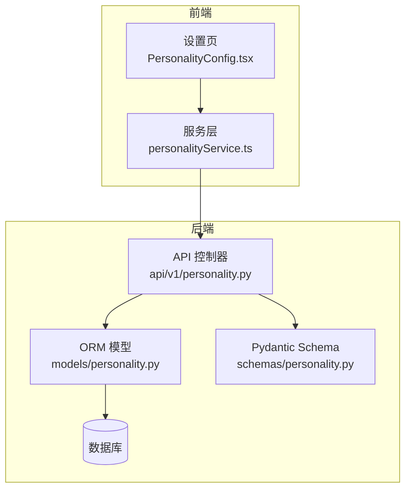
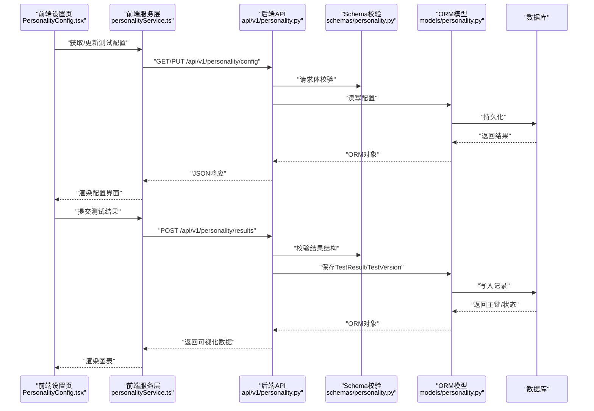
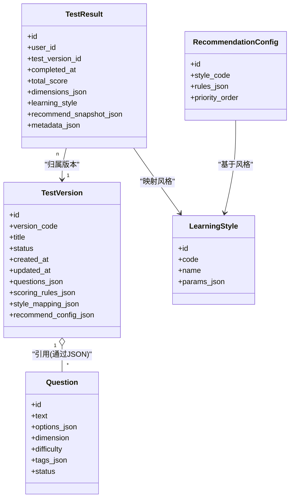
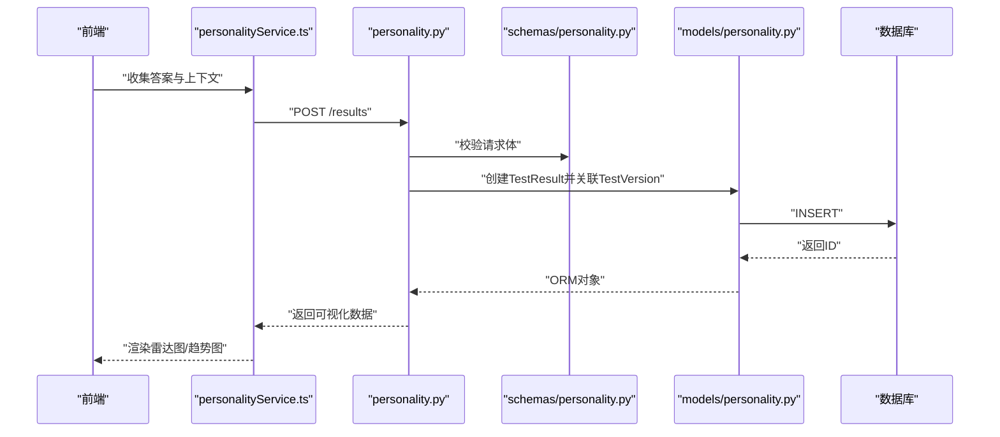
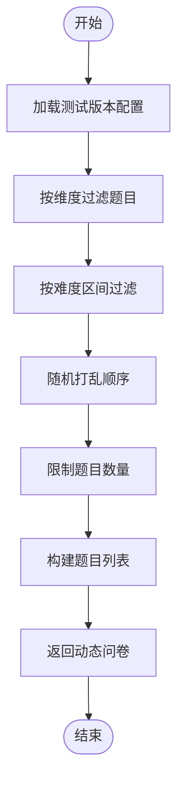
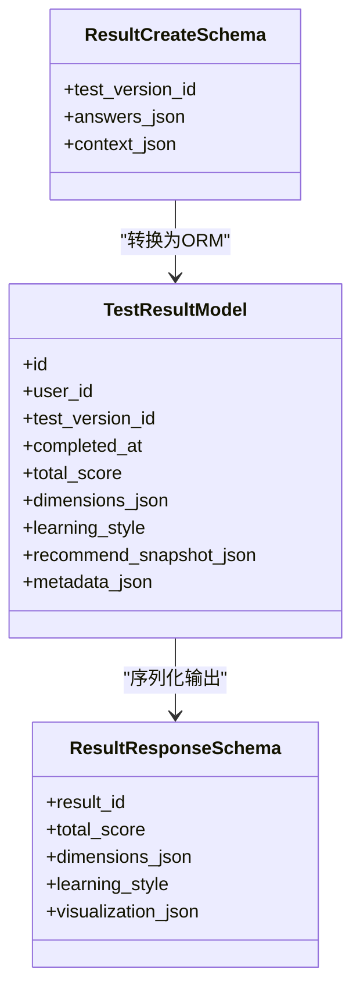
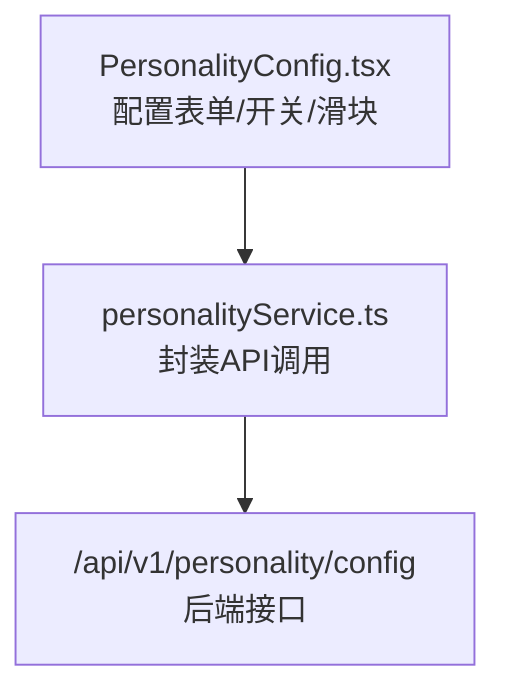
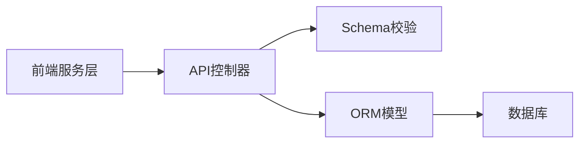

# 性格测试实体设计

<cite>
**本文引用的文件**   
- [backend/app/models/personality.py](file://backend/app/models/personality.py)
- [backend/app/schemas/personality.py](file://backend/app/schemas/personality.py)
- [backend/app/api/v1/personality.py](file://backend/app/api/v1/personality.py)
- [frontend/src/pages/Settings/PersonalityConfig.tsx](file://frontend/src/pages/Settings/PersonalityConfig.tsx)
- [frontend/src/services/personalityService.ts](file://frontend/src/services/personalityService.ts)
</cite>

## 目录
1. [引言](#引言)
2. [项目结构](#项目结构)
3. [核心组件](#核心组件)
4. [架构总览](#架构总览)
5. [详细组件分析](#详细组件分析)
6. [依赖分析](#依赖分析)
7. [性能考虑](#性能考虑)
8. [故障排查指南](#故障排查指南)
9. [结论](#结论)
10. [附录](#附录)

## 引言
本设计文档围绕“性格测试”领域，系统化阐述 Personality 模型的数据结构设计、版本控制与历史追踪、学习风格匹配、个性化推荐配置、题库管理与动态问卷生成、结果可视化数据结构等关键能力。文档同时提供面向数据库的建表建议、ORM 模型对照、复杂 JSON 存储与查询优化策略，帮助读者从概念到实现全面理解并落地该功能。

## 项目结构
本项目采用前后端分离架构：
- 后端（FastAPI + SQLAlchemy）：定义数据模型、API 接口、业务服务与迁移脚本。
- 前端（React + TypeScript）：提供设置页、服务层调用与页面交互。

与性格测试相关的核心位置如下：
- 后端模型与 Schema：models/personality.py、schemas/personality.py
- 后端 API：api/v1/personality.py
- 前端设置页：pages/Settings/PersonalityConfig.tsx
- 前端服务层：services/personalityService.ts

图表来源
- [backend/app/api/v1/personality.py](file://backend/app/api/v1/personality.py)
- [backend/app/models/personality.py](file://backend/app/models/personality.py)
- [backend/app/schemas/personality.py](file://backend/app/schemas/personality.py)
- [frontend/src/pages/Settings/PersonalityConfig.tsx](file://frontend/src/pages/Settings/PersonalityConfig.tsx)
- [frontend/src/services/personalityService.ts](file://frontend/src/services/personalityService.ts)

章节来源
- [backend/app/models/personality.py](file://backend/app/models/personality.py)
- [backend/app/schemas/personality.py](file://backend/app/schemas/personality.py)
- [backend/app/api/v1/personality.py](file://backend/app/api/v1/personality.py)
- [frontend/src/pages/Settings/PersonalityConfig.tsx](file://frontend/src/pages/Settings/PersonalityConfig.tsx)
- [frontend/src/services/personalityService.ts](file://frontend/src/services/personalityService.ts)

## 核心组件
本节聚焦 Personality 相关的数据结构与职责边界，为后续深入分析奠定基础。

- 测试结果记录（TestResult）
  - 负责持久化单次测试的完整结果，包括测试标识、用户关联、完成时间戳、总分与各维度得分、学习风格判定、推荐配置快照等。
  - 支持多版本测试的历史追踪与对比分析。

- 测试版本（TestVersion）
  - 管理不同版本的测试题目集合、评分规则、权重配置、学习风格映射与推荐策略。
  - 通过版本号或唯一键进行版本控制，确保结果可追溯。

- 题库与题目（QuestionBank / Question）
  - 维护题目元数据、选项、维度归属、难度、区分度等属性。
  - 支持按维度、标签、难度等条件动态抽取组成问卷。

- 学习风格与推荐配置（LearningStyle / RecommendationConfig）
  - 学习风格包含视觉型、听觉型、动觉型等类型及对应偏好参数。
  - 推荐配置用于将测试结果映射到个性化资源或教学策略。

- 结果可视化数据结构（VisualizationPayload）
  - 标准化输出给前端的图表数据格式，如雷达图、柱状图、趋势折线等。

章节来源
- [backend/app/models/personality.py](file://backend/app/models/personality.py)
- [backend/app/schemas/personality.py](file://backend/app/schemas/personality.py)
- [backend/app/api/v1/personality.py](file://backend/app/api/v1/personality.py)

## 架构总览
下图展示从前端设置与发起测试，到后端处理、持久化与返回可视化的端到端流程。

图表来源
- [backend/app/api/v1/personality.py](file://backend/app/api/v1/personality.py)
- [backend/app/schemas/personality.py](file://backend/app/schemas/personality.py)
- [backend/app/models/personality.py](file://backend/app/models/personality.py)
- [frontend/src/pages/Settings/PersonalityConfig.tsx](file://frontend/src/pages/Settings/PersonalityConfig.tsx)
- [frontend/src/services/personalityService.ts](file://frontend/src/services/personalityService.ts)

## 详细组件分析

### 模型与关系（类图）
以下类图展示了 Personality 域的核心实体及其关系，便于理解数据建模与约束。

图表来源
- [backend/app/models/personality.py](file://backend/app/models/personality.py)
- [backend/app/schemas/personality.py](file://backend/app/schemas/personality.py)

章节来源
- [backend/app/models/personality.py](file://backend/app/models/personality.py)
- [backend/app/schemas/personality.py](file://backend/app/schemas/personality.py)

### API 工作流（序列图）
以“提交测试结果”为例，展示从前端到后端的调用链路与数据流转。

图表来源
- [backend/app/api/v1/personality.py](file://backend/app/api/v1/personality.py)
- [backend/app/schemas/personality.py](file://backend/app/schemas/personality.py)
- [backend/app/models/personality.py](file://backend/app/models/personality.py)
- [frontend/src/services/personalityService.ts](file://frontend/src/services/personalityService.ts)

章节来源
- [backend/app/api/v1/personality.py](file://backend/app/api/v1/personality.py)
- [backend/app/schemas/personality.py](file://backend/app/schemas/personality.py)
- [backend/app/models/personality.py](file://backend/app/models/personality.py)
- [frontend/src/services/personalityService.ts](file://frontend/src/services/personalityService.ts)

### 复杂逻辑：动态问卷生成（流程图）
根据测试版本中的题目集合与筛选条件，动态生成问卷的流程如下。

图表来源
- [backend/app/models/personality.py](file://backend/app/models/personality.py)
- [backend/app/api/v1/personality.py](file://backend/app/api/v1/personality.py)

章节来源
- [backend/app/models/personality.py](file://backend/app/models/personality.py)
- [backend/app/api/v1/personality.py](file://backend/app/api/v1/personality.py)

### 面向对象组件：模型与校验（类图）
展示 ORM 模型与 Pydantic Schema 的协作关系，强调输入校验与数据转换。

图表来源
- [backend/app/schemas/personality.py](file://backend/app/schemas/personality.py)
- [backend/app/models/personality.py](file://backend/app/models/personality.py)

章节来源
- [backend/app/schemas/personality.py](file://backend/app/schemas/personality.py)
- [backend/app/models/personality.py](file://backend/app/models/personality.py)

### 前端设置与配置（组件图）
展示前端设置页与服务层的交互，以及配置项在界面的呈现方式。

图表来源
- [frontend/src/pages/Settings/PersonalityConfig.tsx](file://frontend/src/pages/Settings/PersonalityConfig.tsx)
- [frontend/src/services/personalityService.ts](file://frontend/src/services/personalityService.ts)
- [backend/app/api/v1/personality.py](file://backend/app/api/v1/personality.py)

章节来源
- [frontend/src/pages/Settings/PersonalityConfig.tsx](file://frontend/src/pages/Settings/PersonalityConfig.tsx)
- [frontend/src/services/personalityService.ts](file://frontend/src/services/personalityService.ts)
- [backend/app/api/v1/personality.py](file://backend/app/api/v1/personality.py)

## 依赖分析
- 模块耦合
  - API 层依赖 Schema 做请求/响应校验，依赖 Models 做数据持久化。
  - 前端服务层仅依赖 API 契约，屏蔽具体实现细节。
- 外部依赖
  - 数据库驱动（SQLAlchemy/迁移工具）用于模型变更与数据一致性。
- 潜在循环依赖
  - 当前分层清晰，未见循环导入；建议在新增模块时保持单向依赖。

图表来源
- [backend/app/api/v1/personality.py](file://backend/app/api/v1/personality.py)
- [backend/app/schemas/personality.py](file://backend/app/schemas/personality.py)
- [backend/app/models/personality.py](file://backend/app/models/personality.py)
- [frontend/src/services/personalityService.ts](file://frontend/src/services/personalityService.ts)

章节来源
- [backend/app/api/v1/personality.py](file://backend/app/api/v1/personality.py)
- [backend/app/schemas/personality.py](file://backend/app/schemas/personality.py)
- [backend/app/models/personality.py](file://backend/app/models/personality.py)
- [frontend/src/services/personalityService.ts](file://frontend/src/services/personalityService.ts)

## 性能考虑
- 索引策略
  - 对 user_id、test_version_id、completed_at 建立复合索引，加速按用户与时间的查询。
- JSON 字段优化
  - 使用数据库原生 JSON 操作函数进行维度与配置的检索与聚合。
  - 对高频查询字段（如 learning_style、total_score）建立冗余列或物化视图。
- 分页与裁剪
  - 结果列表采用游标分页，避免全量扫描。
  - 可视化数据按需裁剪，减少网络传输。
- 缓存策略
  - 测试版本配置与静态题库可缓存至 Redis，降低重复读取开销。
- 批量写入
  - 批量提交答案时使用事务与批量插入，提升吞吐。

[本节为通用性能指导，不直接分析具体文件]

## 故障排查指南
- 常见错误
  - 请求体校验失败：检查 Schema 字段类型与必填项。
  - 版本不存在：确认 test_version_id 有效且处于可用状态。
  - 维度缺失：验证 answers_json 中是否包含所有必要维度。
- 日志与定位
  - 在 API 层记录关键步骤与异常堆栈。
  - 对 JSON 解析失败场景增加结构化日志，便于快速定位。
- 回滚与恢复
  - 使用迁移脚本进行版本回滚。
  - 对损坏的结果记录进行清理或修复。

章节来源
- [backend/app/api/v1/personality.py](file://backend/app/api/v1/personality.py)
- [backend/app/schemas/personality.py](file://backend/app/schemas/personality.py)

## 结论
本设计围绕 Personality 模型构建了完整的测试生命周期：版本化管理、动态问卷生成、多维结果分析与可视化、学习风格匹配与个性化推荐。通过清晰的层次划分与严格的 Schema 校验，系统具备良好的可扩展性与可维护性。结合合理的索引与缓存策略，可在高并发场景下保持稳定性能。

[本节为总结性内容，不直接分析具体文件]

## 附录

### SQL 建表示例（参考）
以下为典型建表语句示例，供参考与对照实际 ORM 模型。

- 测试版本表
  - 字段：id、version_code、title、status、created_at、updated_at、questions_json、scoring_rules_json、style_mapping_json、recommend_config_json
  - 索引：version_code、status

- 测试结果表
  - 字段：id、user_id、test_version_id、completed_at、total_score、dimensions_json、learning_style、recommend_snapshot_json、metadata_json
  - 索引：user_id、test_version_id、completed_at

- 题目表
  - 字段：id、text、options_json、dimension、difficulty、tags_json、status
  - 索引：dimension、difficulty、status

- 学习风格表
  - 字段：id、code、name、params_json
  - 索引：code

- 推荐配置表
  - 字段：id、style_code、rules_json、priority_order
  - 索引：style_code

[本节为概念性示例，不直接分析具体文件]

### ORM 模型与 SQL 对照要点
- 字段映射
  - JSON 字段在 ORM 中使用字符串或专用 JSON 类型，并在应用层进行序列化/反序列化。
- 约束与默认值
  - 非空字段在数据库层添加 NOT NULL 约束，默认值在模型层设置。
- 外键关系
  - TestResult 与 TestVersion 通过外键关联，保证数据完整性。
- 审计字段
  - created_at、updated_at 由框架自动维护或在写入时显式赋值。

[本节为概念性说明，不直接分析具体文件]

### 复杂 JSON 存储与查询优化策略
- 存储
  - 将维度得分、评分规则、推荐快照等结构化但易变的数据存入 JSON 字段，提高灵活性。
- 查询
  - 使用数据库 JSON 函数提取与比较，例如按维度阈值筛选用户。
- 索引
  - 对 JSON 内常用路径建立生成列或虚拟列，并为其建立索引。
- 物化视图
  - 对高频聚合指标（如各维度平均分、风格分布）建立物化视图定时刷新。

[本节为概念性说明，不直接分析具体文件]