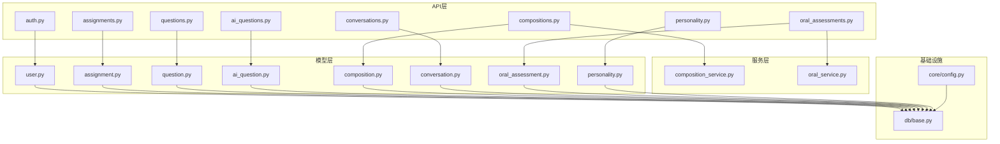
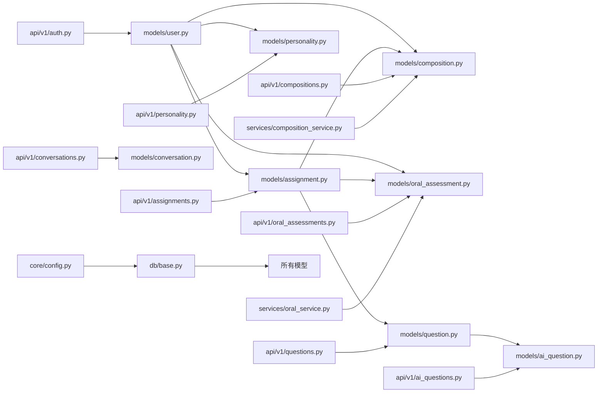

# 核心实体设计

<cite>
**本文引用的文件**   
- [backend/app/models/user.py](file://backend/app/models/user.py)
- [backend/app/schemas/user.py](file://backend/app/schemas/user.py)
- [backend/app/api/v1/auth.py](file://backend/app/api/v1/auth.py)
- [backend/app/models/assignment.py](file://backend/app/models/assignment.py)
- [backend/app/schemas/assignment.py](file://backend/app/schemas/assignment.py)
- [backend/app/api/v1/assignments.py](file://backend/app/api/v1/assignments.py)
- [backend/app/models/question.py](file://backend/app/models/question.py)
- [backend/app/models/ai_question.py](file://backend/app/models/ai_question.py)
- [backend/app/schemas/question.py](file://backend/app/schemas/question.py)
- [backend/app/schemas/ai_question.py](file://backend/app/schemas/ai_question.py)
- [backend/app/api/v1/questions.py](file://backend/app/api/v1/questions.py)
- [backend/app/api/v1/ai_questions.py](file://backend/app/api/v1/ai_questions.py)
- [backend/app/models/composition.py](file://backend/app/models/composition.py)
- [backend/app/schemas/composition.py](file://backend/app/schemas/composition.py)
- [backend/app/api/v1/compositions.py](file://backend/app/api/v1/compositions.py)
- [backend/app/services/composition_service.py](file://backend/app/services/composition_service.py)
- [backend/app/models/conversation.py](file://backend/app/models/conversation.py)
- [backend/app/schemas/conversation.py](file://backend/app/schemas/conversation.py)
- [backend/app/api/v1/conversations.py](file://backend/app/api/v1/conversations.py)
- [backend/app/models/oral_assessment.py](file://backend/app/models/oral_assessment.py)
- [backend/app/schemas/oral_assessment.py](file://backend/app/schemas/oral_assessment.py)
- [backend/app/api/v1/oral_assessments.py](file://backend/app/api/v1/oral_assessments.py)
- [backend/app/services/oral_service.py](file://backend/app/services/oral_service.py)
- [backend/app/models/personality.py](file://backend/app/models/personality.py)
- [backend/app/schemas/personality.py](file://backend/app/schemas/personality.py)
- [backend/app/api/v1/personality.py](file://backend/app/api/v1/personality.py)
- [backend/app/db/base.py](file://backend/app/db/base.py)
- [backend/app/core/config.py](file://backend/app/core/config.py)
</cite>

## 目录
1. [简介](#简介)
2. [项目结构](#项目结构)
3. [核心组件](#核心组件)
4. [架构总览](#架构总览)
5. [详细组件分析](#详细组件分析)
6. [依赖分析](#依赖分析)
7. [性能考虑](#性能考虑)
8. [故障排查指南](#故障排查指南)
9. [结论](#结论)
10. [附录](#附录)

## 简介
本文件聚焦AI助教系统的核心数据实体设计，覆盖用户、作业、题目（含AI生成题）、作文、对话、口语评估与性格测试等关键表。文档从业务含义、数据类型选择、默认值与约束、校验规则、特有业务逻辑出发，提供SQL建表示例与ORM模型对照，帮助读者快速理解并落地实现。

## 项目结构
后端采用分层架构：API层负责路由与参数校验，服务层封装业务逻辑，模型层定义数据库结构与关系，Schema层用于请求/响应数据契约。迁移工具使用Alembic管理DDL变更。



图表来源
- [backend/app/api/v1/auth.py](file://backend/app/api/v1/auth.py)
- [backend/app/api/v1/assignments.py](file://backend/app/api/v1/assignments.py)
- [backend/app/api/v1/questions.py](file://backend/app/api/v1/questions.py)
- [backend/app/api/v1/ai_questions.py](file://backend/app/api/v1/ai_questions.py)
- [backend/app/api/v1/compositions.py](file://backend/app/api/v1/compositions.py)
- [backend/app/api/v1/conversations.py](file://backend/app/api/v1/conversations.py)
- [backend/app/api/v1/oral_assessments.py](file://backend/app/api/v1/oral_assessments.py)
- [backend/app/api/v1/personality.py](file://backend/app/api/v1/personality.py)
- [backend/app/services/composition_service.py](file://backend/app/services/composition_service.py)
- [backend/app/services/oral_service.py](file://backend/app/services/oral_service.py)
- [backend/app/models/user.py](file://backend/app/models/user.py)
- [backend/app/models/assignment.py](file://backend/app/models/assignment.py)
- [backend/app/models/question.py](file://backend/app/models/question.py)
- [backend/app/models/ai_question.py](file://backend/app/models/ai_question.py)
- [backend/app/models/composition.py](file://backend/app/models/composition.py)
- [backend/app/models/conversation.py](file://backend/app/models/conversation.py)
- [backend/app/models/oral_assessment.py](file://backend/app/models/oral_assessment.py)
- [backend/app/models/personality.py](file://backend/app/models/personality.py)
- [backend/app/db/base.py](file://backend/app/db/base.py)
- [backend/app/core/config.py](file://backend/app/core/config.py)

章节来源
- [backend/app/db/base.py](file://backend/app/db/base.py)
- [backend/app/core/config.py](file://backend/app/core/config.py)

## 核心组件
本节概述各实体的职责与相互关系，为后续深入分析奠定基础。

- 用户User：账号、角色权限、个人信息、认证凭据。
- 作业Assignment：教师发布的任务，包含状态流转与评分汇总。
- 题目Question/AIQuestion：传统题库与AI生成题，支持题型分类与难度等级。
- 作文Composition：学生提交文本，记录批改结果与多维评分。
- 对话Conversation：会话管理与消息记录，支撑AI助教交互。
- 口语评估OralAssessment：语音转文字与发音评分，关联作业或课程。
- 性格测试Personality：测试结果与分析报告，辅助个性化学习路径。

章节来源
- [backend/app/models/user.py](file://backend/app/models/user.py)
- [backend/app/models/assignment.py](file://backend/app/models/assignment.py)
- [backend/app/models/question.py](file://backend/app/models/question.py)
- [backend/app/models/ai_question.py](file://backend/app/models/ai_question.py)
- [backend/app/models/composition.py](file://backend/app/models/composition.py)
- [backend/app/models/conversation.py](file://backend/app/models/conversation.py)
- [backend/app/models/oral_assessment.py](file://backend/app/models/oral_assessment.py)
- [backend/app/models/personality.py](file://backend/app/models/personality.py)

## 架构总览
下图展示核心实体之间的关系，包括外键关联与一对多/一对一关系。

```mermaid
erDiagram
USER {
uuid id PK
string username UK
string email UK
string password_hash
enum role
jsonb profile
timestamp created_at
timestamp updated_at
}
ASSIGNMENT {
uuid id PK
uuid teacher_id FK
string title
text description
enum status
jsonb settings
timestamp due_date
timestamp created_at
timestamp updated_at
}
QUESTION {
uuid id PK
string type
int difficulty
text content
jsonb options
jsonb answer
uuid assignment_id FK
timestamp created_at
timestamp updated_at
}
AI_QUESTION {
uuid id PK
uuid question_id FK
string prompt_template
jsonb generation_params
jsonb generated_content
timestamp created_at
}
COMPOSITION {
uuid id PK
uuid student_id FK
uuid assignment_id FK
text content
jsonb scores
text feedback
enum grading_status
timestamp submitted_at
timestamp graded_at
timestamp created_at
timestamp updated_at
}
CONVERSATION {
uuid id PK
uuid user_id FK
string title
jsonb metadata
timestamp last_message_at
timestamp created_at
timestamp updated_at
}
MESSAGE {
uuid id PK
uuid conversation_id FK
enum role
text content
jsonb extras
timestamp created_at
}
ORAL_ASSESSMENT {
uuid id PK
uuid student_id FK
uuid assignment_id FK
string audio_url
text transcript
jsonb pronunciation_scores
jsonb fluency_scores
jsonb overall_scores
enum status
timestamp submitted_at
timestamp processed_at
timestamp created_at
timestamp updated_at
}
PERSONALITY_TEST {
uuid id PK
uuid student_id FK
jsonb answers
jsonb results
jsonb analysis_report
timestamp completed_at
timestamp created_at
timestamp updated_at
}
USER ||--o{ ASSIGNMENT : "teacher publishes"
USER ||--o{ COMPOSITION : "student submits"
USER ||--o{ ORAL_ASSESSMENT : "student submits"
USER ||--o{ PERSONALITY_TEST : "student completes"
USER ||--o{ CONVERSATION : "owns"
ASSIGNMENT ||--o{ QUESTION : "contains"
ASSIGNMENT ||--o{ COMPOSITION : "has submissions"
ASSIGNMENT ||--o{ ORAL_ASSESSMENT : "has assessments"
QUESTION |||-- AI_QUESTION : "AI variant"
CONVERSATION ||--o{ MESSAGE : "contains"
```

图表来源
- [backend/app/models/user.py](file://backend/app/models/user.py)
- [backend/app/models/assignment.py](file://backend/app/models/assignment.py)
- [backend/app/models/question.py](file://backend/app/models/question.py)
- [backend/app/models/ai_question.py](file://backend/app/models/ai_question.py)
- [backend/app/models/composition.py](file://backend/app/models/composition.py)
- [backend/app/models/conversation.py](file://backend/app/models/conversation.py)
- [backend/app/models/oral_assessment.py](file://backend/app/models/oral_assessment.py)
- [backend/app/models/personality.py](file://backend/app/models/personality.py)

## 详细组件分析

### 用户User
- 字段与业务含义
  - id：主键，UUID，唯一标识用户。
  - username：用户名，唯一，用于登录与显示。
  - email：邮箱，唯一，用于通知与恢复密码。
  - password_hash：密码哈希，安全存储。
  - role：角色枚举，如管理员、教师、学生，控制访问与功能。
  - profile：JSONB，扩展个人信息（姓名、班级、头像URL等）。
  - created_at/updated_at：审计时间戳。
- 数据类型与默认值
  - UUID主键；字符串类型带长度限制；JSONB用于灵活扩展；时间戳默认当前时间。
- 验证规则
  - 用户名与邮箱唯一性；密码强度策略在服务层校验；角色取值受枚举约束。
- 业务逻辑与约束
  - 角色决定可访问的API与资源范围；个人档案更新需鉴权。
- SQL示例（参考）
  - CREATE TABLE users (id UUID PRIMARY KEY, username VARCHAR UNIQUE, email VARCHAR UNIQUE, password_hash VARCHAR NOT NULL, role VARCHAR CHECK (role IN ('admin','teacher','student')), profile JSONB DEFAULT '{}', created_at TIMESTAMP DEFAULT NOW(), updated_at TIMESTAMP DEFAULT NOW());
- ORM模型对照
  - 参见[backend/app/models/user.py](file://backend/app/models/user.py)
- Schema与API
  - 请求/响应契约见[backend/app/schemas/user.py](file://backend/app/schemas/user.py)
  - 认证流程入口见[backend/app/api/v1/auth.py](file://backend/app/api/v1/auth.py)

章节来源
- [backend/app/models/user.py](file://backend/app/models/user.py)
- [backend/app/schemas/user.py](file://backend/app/schemas/user.py)
- [backend/app/api/v1/auth.py](file://backend/app/api/v1/auth.py)

### 作业Assignment
- 字段与业务含义
  - id：主键，UUID。
  - teacher_id：发布教师ID，外键到users。
  - title/description：标题与描述。
  - status：状态机（草稿、已发布、进行中、已结束），驱动前端展示与操作。
  - settings：JSONB，作业配置（是否允许重交、截止时间、评分规则等）。
  - due_date：截止时间。
  - created_at/updated_at：审计时间戳。
- 数据类型与默认值
  - 状态枚举；JSONB承载可扩展设置；时间戳默认当前时间。
- 验证规则
  - 发布时间不得早于当前时间；截止时间为必填且晚于发布时间；状态转换受业务规则约束。
- 业务逻辑与约束
  - 仅教师可创建/编辑；学生只能查看与提交；状态变更触发通知与统计更新。
- SQL示例（参考）
  - CREATE TABLE assignments (id UUID PRIMARY KEY, teacher_id UUID REFERENCES users(id), title VARCHAR NOT NULL, description TEXT, status VARCHAR CHECK (status IN ('draft','published','active','closed')), settings JSONB DEFAULT '{}', due_date TIMESTAMP, created_at TIMESTAMP DEFAULT NOW(), updated_at TIMESTAMP DEFAULT NOW());
- ORM模型对照
  - 参见[backend/app/models/assignment.py](file://backend/app/models/assignment.py)
- API与服务
  - 作业接口见[backend/app/api/v1/assignments.py](file://backend/app/api/v1/assignments.py)
  - 作业Schema见[backend/app/schemas/assignment.py](file://backend/app/schemas/assignment.py)

章节来源
- [backend/app/models/assignment.py](file://backend/app/models/assignment.py)
- [backend/app/schemas/assignment.py](file://backend/app/schemas/assignment.py)
- [backend/app/api/v1/assignments.py](file://backend/app/api/v1/assignments.py)

### 题目Question与AI题目AIQuestion
- Question字段与业务含义
  - id：主键，UUID。
  - type：题型（单选、多选、填空、简答等）。
  - difficulty：难度等级（1-5）。
  - content：题干内容。
  - options/answer：JSONB，选项与标准答案。
  - assignment_id：所属作业，外键到assignments。
  - created_at/updated_at：审计时间戳。
- AIQuestion字段与业务含义
  - id：主键，UUID。
  - question_id：关联的题目ID，外键到questions。
  - prompt_template/generation_params：提示模板与生成参数。
  - generated_content：AI生成的变体内容（JSONB）。
  - created_at：生成时间。
- 数据类型与默认值
  - 题型与难度使用枚举/整数；JSONB存储结构化答案与选项；时间戳默认当前时间。
- 验证规则
  - 题型与难度取值受限；AI生成参数需符合模板要求；生成内容非空。
- 业务逻辑与约束
  - 题目归属作业；AI题目作为题目的变体存在，便于批量练习与自适应出题。
- SQL示例（参考）
  - CREATE TABLE questions (id UUID PRIMARY KEY, type VARCHAR CHECK (type IN ('single_choice','multiple_choice','fill_blank','short_answer')), difficulty INT CHECK (difficulty BETWEEN 1 AND 5), content TEXT, options JSONB, answer JSONB, assignment_id UUID REFERENCES assignments(id), created_at TIMESTAMP DEFAULT NOW(), updated_at TIMESTAMP DEFAULT NOW());
  - CREATE TABLE ai_questions (id UUID PRIMARY KEY, question_id UUID REFERENCES questions(id), prompt_template TEXT, generation_params JSONB, generated_content JSONB, created_at TIMESTAMP DEFAULT NOW());
- ORM模型对照
  - 参见[backend/app/models/question.py](file://backend/app/models/question.py)、[backend/app/models/ai_question.py](file://backend/app/models/ai_question.py)
- API与服务
  - 题目接口见[backend/app/api/v1/questions.py](file://backend/app/api/v1/questions.py)
  - AI题目接口见[backend/app/api/v1/ai_questions.py](file://backend/app/api/v1/ai_questions.py)
  - Schema见[backend/app/schemas/question.py](file://backend/app/schemas/question.py)、[backend/app/schemas/ai_question.py](file://backend/app/schemas/ai_question.py)

章节来源
- [backend/app/models/question.py](file://backend/app/models/question.py)
- [backend/app/models/ai_question.py](file://backend/app/models/ai_question.py)
- [backend/app/schemas/question.py](file://backend/app/schemas/question.py)
- [backend/app/schemas/ai_question.py](file://backend/app/schemas/ai_question.py)
- [backend/app/api/v1/questions.py](file://backend/app/api/v1/questions.py)
- [backend/app/api/v1/ai_questions.py](file://backend/app/api/v1/ai_questions.py)

### 作文Composition
- 字段与业务含义
  - id：主键，UUID。
  - student_id：提交学生ID，外键到users。
  - assignment_id：所属作业，外键到assignments。
  - content：学生提交的文本。
  - scores：JSONB，多维评分（语法、词汇、结构、连贯性等）。
  - feedback：AI或教师反馈文本。
  - grading_status：批改状态（待批、已批、复核中）。
  - submitted_at/graded_at：提交与批改时间。
  - created_at/updated_at：审计时间戳。
- 数据类型与默认值
  - JSONB承载评分维度；状态枚举；时间戳默认当前时间。
- 验证规则
  - 内容非空；评分维度完整；批改状态转换合法。
- 业务逻辑与约束
  - 支持自动批改与人工复核；批改完成后更新作业统计。
- SQL示例（参考）
  - CREATE TABLE compositions (id UUID PRIMARY KEY, student_id UUID REFERENCES users(id), assignment_id UUID REFERENCES assignments(id), content TEXT NOT NULL, scores JSONB DEFAULT '{}', feedback TEXT, grading_status VARCHAR CHECK (grading_status IN ('pending','graded','reviewing')), submitted_at TIMESTAMP DEFAULT NOW(), graded_at TIMESTAMP, created_at TIMESTAMP DEFAULT NOW(), updated_at TIMESTAMP DEFAULT NOW());
- ORM模型对照
  - 参见[backend/app/models/composition.py](file://backend/app/models/composition.py)
- API与服务
  - 作文接口见[backend/app/api/v1/compositions.py](file://backend/app/api/v1/compositions.py)
  - 批改服务见[backend/app/services/composition_service.py](file://backend/app/services/composition_service.py)
  - Schema见[backend/app/schemas/composition.py](file://backend/app/schemas/composition.py)

章节来源
- [backend/app/models/composition.py](file://backend/app/models/composition.py)
- [backend/app/schemas/composition.py](file://backend/app/schemas/composition.py)
- [backend/app/api/v1/compositions.py](file://backend/app/api/v1/compositions.py)
- [backend/app/services/composition_service.py](file://backend/app/services/composition_service.py)

### 对话Conversation与消息Message
- Conversation字段与业务含义
  - id：主键，UUID。
  - user_id：会话所有者ID，外键到users。
  - title：会话标题。
  - metadata：JSONB，会话元信息（主题、标签、上下文指针等）。
  - last_message_at：最后一条消息时间。
  - created_at/updated_at：审计时间戳。
- Message字段与业务含义
  - id：主键，UUID。
  - conversation_id：所属会话，外键到conversations。
  - role：消息角色（user/assistant/system）。
  - content：消息正文。
  - extras：JSONB，附加信息（引用、工具调用结果等）。
  - created_at：创建时间。
- 数据类型与默认值
  - JSONB用于灵活扩展；角色枚举；时间戳默认当前时间。
- 验证规则
  - 消息内容非空；角色取值受限；会话与消息关联一致。
- 业务逻辑与约束
  - 支持分页查询历史消息；按会话聚合统计；系统消息不可删除。
- SQL示例（参考）
  - CREATE TABLE conversations (id UUID PRIMARY KEY, user_id UUID REFERENCES users(id), title VARCHAR, metadata JSONB DEFAULT '{}', last_message_at TIMESTAMP, created_at TIMESTAMP DEFAULT NOW(), updated_at TIMESTAMP DEFAULT NOW());
  - CREATE TABLE messages (id UUID PRIMARY KEY, conversation_id UUID REFERENCES conversations(id), role VARCHAR CHECK (role IN ('user','assistant','system')), content TEXT NOT NULL, extras JSONB DEFAULT '{}', created_at TIMESTAMP DEFAULT NOW());
- ORM模型对照
  - 参见[backend/app/models/conversation.py](file://backend/app/models/conversation.py)
- API与服务
  - 对话接口见[backend/app/api/v1/conversations.py](file://backend/app/api/v1/conversations.py)
  - Schema见[backend/app/schemas/conversation.py](file://backend/app/schemas/conversation.py)

章节来源
- [backend/app/models/conversation.py](file://backend/app/models/conversation.py)
- [backend/app/schemas/conversation.py](file://backend/app/schemas/conversation.py)
- [backend/app/api/v1/conversations.py](file://backend/app/api/v1/conversations.py)

### 口语评估OralAssessment
- 字段与业务含义
  - id：主键，UUID。
  - student_id：提交学生ID，外键到users。
  - assignment_id：所属作业，外键到assignments。
  - audio_url：音频文件URL。
  - transcript：语音转写文本。
  - pronunciation_scores/fluency_scores/overall_scores：JSONB，发音、流利度、总体评分。
  - status：处理状态（待处理、已处理、失败）。
  - submitted_at/processed_at：提交与处理完成时间。
  - created_at/updated_at：审计时间戳。
- 数据类型与默认值
  - JSONB承载多维度评分；状态枚举；时间戳默认当前时间。
- 验证规则
  - 音频URL有效；转写文本非空；评分维度完整；状态转换合法。
- 业务逻辑与约束
  - 异步处理语音转写与评分；失败重试机制；结果回写至作业统计。
- SQL示例（参考）
  - CREATE TABLE oral_assessments (id UUID PRIMARY KEY, student_id UUID REFERENCES users(id), assignment_id UUID REFERENCES assignments(id), audio_url VARCHAR, transcript TEXT, pronunciation_scores JSONB DEFAULT '{}', fluency_scores JSONB DEFAULT '{}', overall_scores JSONB DEFAULT '{}', status VARCHAR CHECK (status IN ('pending','processed','failed')), submitted_at TIMESTAMP DEFAULT NOW(), processed_at TIMESTAMP, created_at TIMESTAMP DEFAULT NOW(), updated_at TIMESTAMP DEFAULT NOW());
- ORM模型对照
  - 参见[backend/app/models/oral_assessment.py](file://backend/app/models/oral_assessment.py)
- API与服务
  - 口语评估接口见[backend/app/api/v1/oral_assessments.py](file://backend/app/api/v1/oral_assessments.py)
  - 口语服务见[backend/app/services/oral_service.py](file://backend/app/services/oral_service.py)
  - Schema见[backend/app/schemas/oral_assessment.py](file://backend/app/schemas/oral_assessment.py)

章节来源
- [backend/app/models/oral_assessment.py](file://backend/app/models/oral_assessment.py)
- [backend/app/schemas/oral_assessment.py](file://backend/app/schemas/oral_assessment.py)
- [backend/app/api/v1/oral_assessments.py](file://backend/app/api/v1/oral_assessments.py)
- [backend/app/services/oral_service.py](file://backend/app/services/oral_service.py)

### 性格测试PersonalityTest
- 字段与业务含义
  - id：主键，UUID。
  - student_id：参与学生ID，外键到users。
  - answers：JSONB，答题记录。
  - results：JSONB，测试结果（维度得分、类型标签等）。
  - analysis_report：JSONB，分析报告（建议、学习路径推荐等）。
  - completed_at：完成时间。
  - created_at/updated_at：审计时间戳。
- 数据类型与默认值
  - JSONB承载复杂结果与报告；时间戳默认当前时间。
- 验证规则
  - 答题记录完整；结果与报告非空；完成时间合理。
- 业务逻辑与约束
  - 支持多次测试与版本化报告；结果可用于个性化推荐与教学干预。
- SQL示例（参考）
  - CREATE TABLE personality_tests (id UUID PRIMARY KEY, student_id UUID REFERENCES users(id), answers JSONB DEFAULT '{}', results JSONB DEFAULT '{}', analysis_report JSONB DEFAULT '{}', completed_at TIMESTAMP, created_at TIMESTAMP DEFAULT NOW(), updated_at TIMESTAMP DEFAULT NOW());
- ORM模型对照
  - 参见[backend/app/models/personality.py](file://backend/app/models/personality.py)
- API与服务
  - 性格测试接口见[backend/app/api/v1/personality.py](file://backend/app/api/v1/personality.py)
  - Schema见[backend/app/schemas/personality.py](file://backend/app/schemas/personality.py)

章节来源
- [backend/app/models/personality.py](file://backend/app/models/personality.py)
- [backend/app/schemas/personality.py](file://backend/app/schemas/personality.py)
- [backend/app/api/v1/personality.py](file://backend/app/api/v1/personality.py)

## 依赖分析
- 组件耦合与内聚
  - 模型层通过外键建立强一致性关系；API层依赖Schema进行输入校验；服务层封装跨表业务逻辑。
- 直接/间接依赖
  - Composition与OralAssessment均依赖Assignment；AIQuestion依赖Question；所有实体依赖User。
- 外部依赖与集成点
  - 配置文件提供数据库连接与特性开关；迁移脚本维护DDL演进。
- 接口契约与实现细节
  - Schema定义严格的请求/响应结构；API层将请求映射到服务与模型方法。



图表来源
- [backend/app/models/user.py](file://backend/app/models/user.py)
- [backend/app/models/assignment.py](file://backend/app/models/assignment.py)
- [backend/app/models/question.py](file://backend/app/models/question.py)
- [backend/app/models/ai_question.py](file://backend/app/models/ai_question.py)
- [backend/app/models/composition.py](file://backend/app/models/composition.py)
- [backend/app/models/conversation.py](file://backend/app/models/conversation.py)
- [backend/app/models/oral_assessment.py](file://backend/app/models/oral_assessment.py)
- [backend/app/models/personality.py](file://backend/app/models/personality.py)
- [backend/app/api/v1/auth.py](file://backend/app/api/v1/auth.py)
- [backend/app/api/v1/assignments.py](file://backend/app/api/v1/assignments.py)
- [backend/app/api/v1/questions.py](file://backend/app/api/v1/questions.py)
- [backend/app/api/v1/ai_questions.py](file://backend/app/api/v1/ai_questions.py)
- [backend/app/api/v1/compositions.py](file://backend/app/api/v1/compositions.py)
- [backend/app/api/v1/conversations.py](file://backend/app/api/v1/conversations.py)
- [backend/app/api/v1/oral_assessments.py](file://backend/app/api/v1/oral_assessments.py)
- [backend/app/api/v1/personality.py](file://backend/app/api/v1/personality.py)
- [backend/app/services/composition_service.py](file://backend/app/services/composition_service.py)
- [backend/app/services/oral_service.py](file://backend/app/services/oral_service.py)
- [backend/app/db/base.py](file://backend/app/db/base.py)
- [backend/app/core/config.py](file://backend/app/core/config.py)

章节来源
- [backend/app/db/base.py](file://backend/app/db/base.py)
- [backend/app/core/config.py](file://backend/app/core/config.py)

## 性能考虑
- 索引策略
  - 对频繁查询的外键列（如assignment_id、student_id、user_id）建立索引以提升JOIN性能。
  - 对时间戳列（created_at、updated_at、submitted_at、graded_at）建立索引以优化范围查询与排序。
- 分区与归档
  - 对于消息与评估等大表，可按时间分区以减少扫描成本。
- 缓存与异步
  - 作文与口语评估的评分结果可缓存；长耗时任务（转写、评分）使用异步队列。
- JSONB优化
  - 对常用JSONB字段建立GIN索引以加速条件查询。

## 故障排查指南
- 常见错误
  - 外键约束冲突：检查父表记录是否存在。
  - 枚举值非法：确认传入值在CHECK约束范围内。
  - JSONB格式错误：确保字段为合法JSON。
  - 时间戳异常：确认时区与默认值设置。
- 定位步骤
  - 查看API日志与错误堆栈；核对Schema校验失败原因；检查数据库约束报错信息。
- 恢复建议
  - 修正输入数据；必要时回滚迁移并修复数据；对异步任务进行重试与补偿。

## 结论
本设计围绕AI助教的核心业务场景，构建了清晰的数据实体与关系模型。通过严格的数据类型、默认值与约束，结合API与服务的分层组织，确保了系统的可维护性与扩展性。建议在后续迭代中持续完善索引策略与异步处理能力，提升整体性能与用户体验。

## 附录
- 术语说明
  - JSONB：PostgreSQL的二进制JSON类型，支持高效查询与索引。
  - 状态机：通过枚举与业务规则控制实体生命周期。
- 参考实现路径
  - 模型定义：backend/app/models/*.py
  - Schema契约：backend/app/schemas/*.py
  - API路由：backend/app/api/v1/*.py
  - 服务逻辑：backend/app/services/*.py
  - 基础配置：backend/app/db/base.py、backend/app/core/config.py