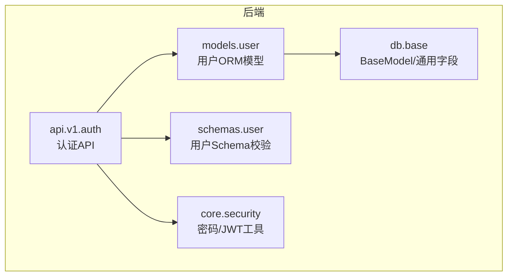
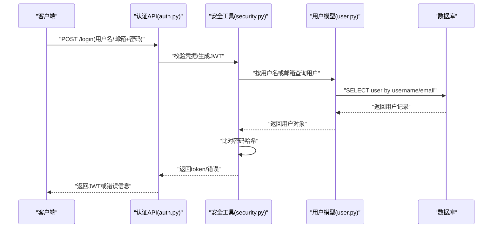
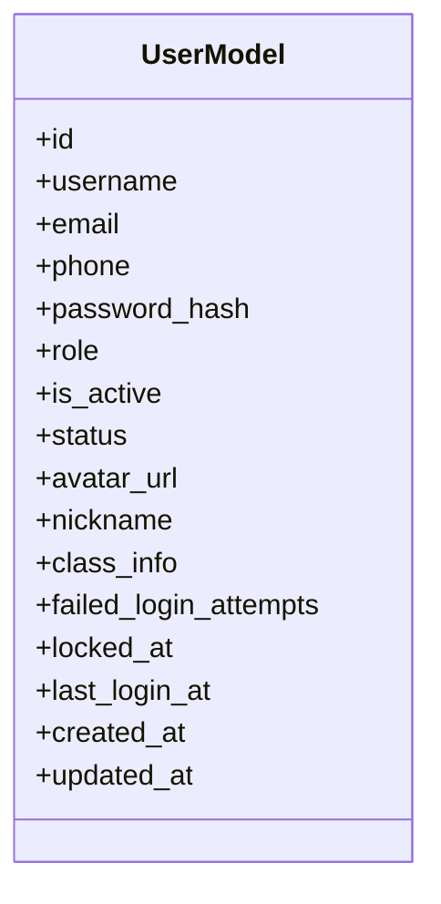
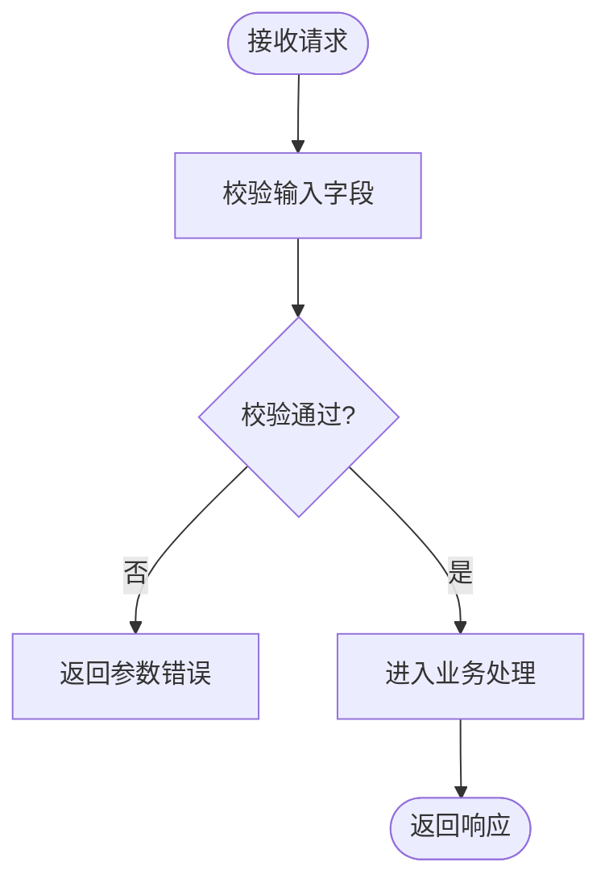
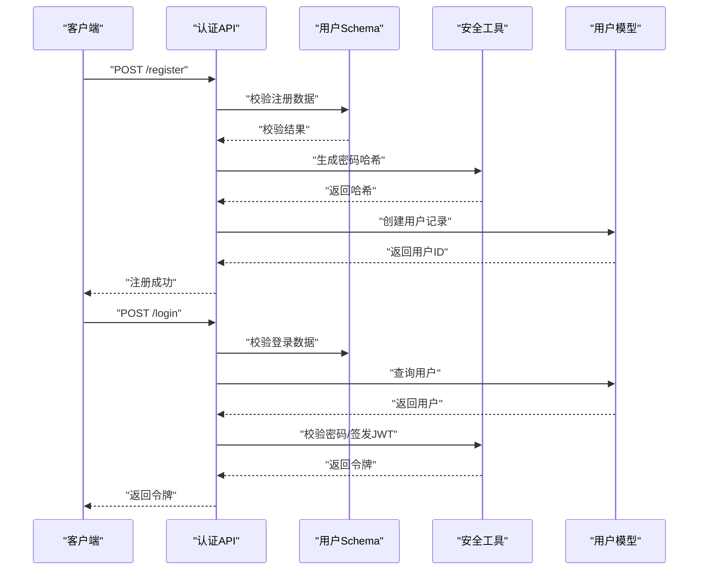
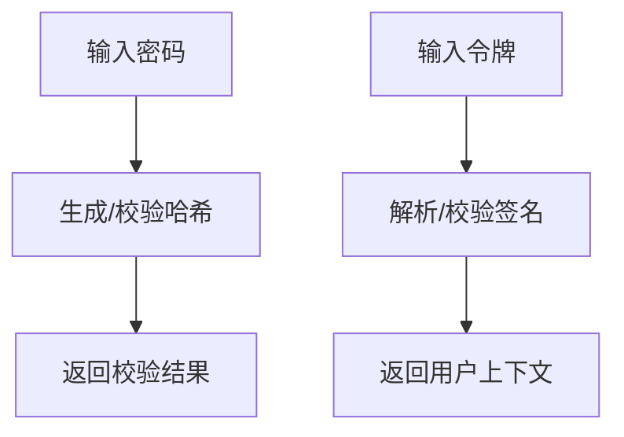
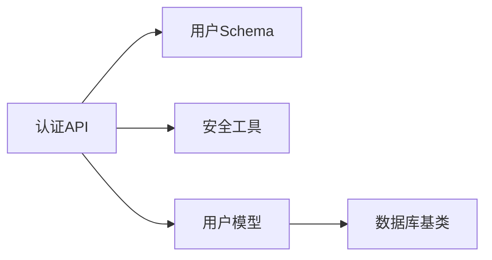

# 用户实体设计

<cite>
**本文引用的文件**   
- [backend/app/models/user.py](file://backend/app/models/user.py)
- [backend/app/schemas/user.py](file://backend/app/schemas/user.py)
- [backend/app/api/v1/auth.py](file://backend/app/api/v1/auth.py)
- [backend/app/core/security.py](file://backend/app/core/security.py)
- [backend/app/db/base.py](file://backend/app/db/base.py)
</cite>

## 目录
1. [引言](#引言)
2. [项目结构](#项目结构)
3. [核心组件](#核心组件)
4. [架构总览](#架构总览)
5. [详细组件分析](#详细组件分析)
6. [依赖分析](#依赖分析)
7. [性能考虑](#性能考虑)
8. [故障排查指南](#故障排查指南)
9. [结论](#结论)
10. [附录](#附录)

## 引言
本设计文档聚焦于“用户”实体的数据模型与相关安全机制，覆盖以下目标：
- 用户基本信息字段（用户名、邮箱、手机号）
- 角色权限系统（教师、学生、管理员）
- 账户状态管理（激活、禁用、锁定）
- 个人信息字段（头像、昵称、班级信息）
- 认证与安全（密码哈希存储、JWT令牌关联、登录历史）
- 数据库索引设计与查询优化策略
- SQL建表语句示例与ORM模型对照

## 项目结构
围绕用户实体，后端主要涉及如下模块：
- 数据模型层：定义用户表的ORM映射与字段约束
- 模式校验层：定义请求/响应数据的Pydantic校验规则
- 认证接口层：提供注册、登录、刷新等API
- 安全工具层：实现密码哈希、JWT签发与校验
- 数据库基类：提供通用字段与时间戳等基础能力



**图表来源**
- [backend/app/models/user.py](file://backend/app/models/user.py)
- [backend/app/schemas/user.py](file://backend/app/schemas/user.py)
- [backend/app/api/v1/auth.py](file://backend/app/api/v1/auth.py)
- [backend/app/core/security.py](file://backend/app/core/security.py)
- [backend/app/db/base.py](file://backend/app/db/base.py)

**章节来源**
- [backend/app/models/user.py](file://backend/app/models/user.py)
- [backend/app/schemas/user.py](file://backend/app/schemas/user.py)
- [backend/app/api/v1/auth.py](file://backend/app/api/v1/auth.py)
- [backend/app/core/security.py](file://backend/app/core/security.py)
- [backend/app/db/base.py](file://backend/app/db/base.py)

## 核心组件
本节从业务角度梳理用户实体所需字段与约束，并给出类型选择与默认值建议。以下为推荐的数据结构设计（以SQL为参考，ORM在后续章节对照说明）。

- 主键
  - id: 整数自增或UUID，作为唯一标识
- 基本信息
  - username: 字符串，长度限制，唯一索引；用于登录名展示
  - email: 字符串，唯一索引；用于账号恢复与通知
  - phone: 字符串，可选；用于短信验证与通知
- 认证与安全
  - password_hash: 字符串；存储密码哈希值（如bcrypt/argon2），禁止明文
  - failed_login_attempts: 整数；记录连续失败次数，达到阈值触发锁定
  - locked_at: 时间戳；账户锁定时间
  - last_login_at: 时间戳；最近一次成功登录时间
- 角色与权限
  - role: 枚举；教师、学生、管理员
- 账户状态
  - is_active: 布尔；是否激活
  - status: 枚举；激活、禁用、锁定
- 个人信息
  - avatar_url: 字符串；头像URL
  - nickname: 字符串；显示昵称
  - class_info: 字符串或JSON；班级信息（如年级、班级号）
- 审计字段
  - created_at, updated_at: 时间戳；创建与更新时间

字段校验与默认值建议：
- username/email/phone需进行格式与唯一性校验
- password_hash必须通过安全算法生成，不可由前端传入
- role默认为学生；status默认激活；is_active默认启用
- 敏感字段（password_hash）不得出现在响应中

**章节来源**
- [backend/app/models/user.py](file://backend/app/models/user.py)
- [backend/app/schemas/user.py](file://backend/app/schemas/user.py)

## 架构总览
下图展示了用户认证流程中的关键交互：客户端调用认证API，服务层使用安全工具完成密码校验与JWT签发，并通过ORM访问用户模型。



**图表来源**
- [backend/app/api/v1/auth.py](file://backend/app/api/v1/auth.py)
- [backend/app/core/security.py](file://backend/app/core/security.py)
- [backend/app/models/user.py](file://backend/app/models/user.py)

## 详细组件分析

### 用户模型（ORM）
- 职责
  - 映射用户表到Python对象
  - 定义字段类型、约束、索引与关系
- 关键字段与约束
  - 唯一性：username、email
  - 非空：username、password_hash
  - 枚举：role、status
  - 时间戳：created_at、updated_at
- 索引设计
  - 单列索引：username、email
  - 复合索引（可选）：(role, is_active) 用于按角色筛选活跃用户
- 安全注意
  - 不在序列化输出中包含password_hash
  - 对failed_login_attempts与locked_at的更新需原子化，避免竞态条件



**图表来源**
- [backend/app/models/user.py](file://backend/app/models/user.py)
- [backend/app/db/base.py](file://backend/app/db/base.py)

**章节来源**
- [backend/app/models/user.py](file://backend/app/models/user.py)
- [backend/app/db/base.py](file://backend/app/db/base.py)

### 用户Schema（请求/响应校验）
- 职责
  - 校验注册/登录/更新个人资料等请求体
  - 定义响应结构，屏蔽敏感字段
- 典型校验规则
  - 用户名：最小/最大长度、字符集限制
  - 邮箱：标准邮箱格式
  - 手机号：国家码与位数校验
  - 密码：最小长度、复杂度要求（在服务端校验）
  - 角色：限定为预设枚举值
  - 状态：仅服务端可修改
- 响应模型
  - 不包含password_hash
  - 可选择性包含头像、昵称、班级信息等



**图表来源**
- [backend/app/schemas/user.py](file://backend/app/schemas/user.py)

**章节来源**
- [backend/app/schemas/user.py](file://backend/app/schemas/user.py)

### 认证API（登录/注册/刷新）
- 职责
  - 暴露登录、注册、刷新令牌等接口
  - 协调Schema校验、安全工具与ORM操作
- 关键流程
  - 登录：根据用户名或邮箱查找用户，校验密码哈希，更新最后登录时间与失败计数，签发JWT
  - 注册：校验唯一性与格式，生成密码哈希，设置默认角色与状态
  - 刷新：基于当前令牌或会话信息签发新令牌
- 错误处理
  - 统一错误码与消息
  - 防止时序攻击（固定时间比较）
  - 防暴力破解（失败次数与锁定）



**图表来源**
- [backend/app/api/v1/auth.py](file://backend/app/api/v1/auth.py)
- [backend/app/schemas/user.py](file://backend/app/schemas/user.py)
- [backend/app/core/security.py](file://backend/app/core/security.py)
- [backend/app/models/user.py](file://backend/app/models/user.py)

**章节来源**
- [backend/app/api/v1/auth.py](file://backend/app/api/v1/auth.py)
- [backend/app/schemas/user.py](file://backend/app/schemas/user.py)
- [backend/app/core/security.py](file://backend/app/core/security.py)
- [backend/app/models/user.py](file://backend/app/models/user.py)

### 安全工具（密码哈希与JWT）
- 职责
  - 密码哈希：使用强哈希算法（如bcrypt/argon2）生成与校验
  - JWT：签发、解析、刷新令牌，支持过期与黑名单（可选）
- 关键点
  - 固定时间比较防止时序攻击
  - 令牌载荷最小化，避免敏感信息
  - 刷新令牌与短期访问令牌的组合策略（可选）



**图表来源**
- [backend/app/core/security.py](file://backend/app/core/security.py)

**章节来源**
- [backend/app/core/security.py](file://backend/app/core/security.py)

### 数据库索引与查询优化
- 索引建议
  - 唯一索引：username、email
  - 普通索引：phone（若频繁查询）
  - 复合索引：(role, is_active) 用于按角色筛选活跃用户列表
  - 审计字段：last_login_at（如需统计登录趋势）
- 查询优化
  - 登录路径优先按username或email精确匹配，避免LIKE前缀模糊
  - 分页与过滤结合索引，减少全表扫描
  - 对大文本字段（class_info）采用JSONB并按需建立GIN索引（视数据库类型而定）

**章节来源**
- [backend/app/models/user.py](file://backend/app/models/user.py)

## 依赖分析
- 模块耦合
  - 认证API依赖Schema校验与安全工具，间接依赖用户模型
  - 用户模型依赖数据库基类提供的通用字段
- 外部依赖
  - 密码哈希库（如bcrypt/argon2）
  - JWT库（如PyJWT）
  - 数据库驱动（如SQLAlchemy/异步驱动）



**图表来源**
- [backend/app/api/v1/auth.py](file://backend/app/api/v1/auth.py)
- [backend/app/schemas/user.py](file://backend/app/schemas/user.py)
- [backend/app/core/security.py](file://backend/app/core/security.py)
- [backend/app/models/user.py](file://backend/app/models/user.py)
- [backend/app/db/base.py](file://backend/app/db/base.py)

**章节来源**
- [backend/app/api/v1/auth.py](file://backend/app/api/v1/auth.py)
- [backend/app/schemas/user.py](file://backend/app/schemas/user.py)
- [backend/app/core/security.py](file://backend/app/core/security.py)
- [backend/app/models/user.py](file://backend/app/models/user.py)
- [backend/app/db/base.py](file://backend/app/db/base.py)

## 性能考虑
- 登录路径优化
  - 使用唯一索引快速定位用户
  - 避免在登录路径执行复杂计算
- 缓存策略
  - 对热点用户资料（头像、昵称）可引入短TTL缓存
- 批量操作
  - 导出或统计时尽量利用索引与分页，避免一次性加载大量数据
- 连接池与事务
  - 合理配置连接池大小，控制事务粒度，减少锁竞争

[本节为通用指导，不直接分析具体文件]

## 故障排查指南
- 常见问题
  - 登录失败：检查用户名/邮箱是否存在、密码哈希是否正确、账户是否被锁定
  - 注册冲突：检查用户名/邮箱唯一性约束
  - 令牌无效：检查JWT签名、过期时间、刷新逻辑
- 日志与监控
  - 记录登录尝试与失败次数
  - 监控锁定账户与异常登录IP
- 回滚与修复
  - 提供重置密码与解锁账户的管理接口
  - 审计字段（locked_at、last_login_at）用于问题回溯

**章节来源**
- [backend/app/api/v1/auth.py](file://backend/app/api/v1/auth.py)
- [backend/app/core/security.py](file://backend/app/core/security.py)
- [backend/app/models/user.py](file://backend/app/models/user.py)

## 结论
本设计围绕用户实体构建了完整的数据模型、校验规则与安全机制，确保在可扩展性与安全性之间取得平衡。通过合理的索引与查询优化，可在高并发场景下保持稳定的登录与注册性能。后续可根据业务扩展更多角色与权限维度，并完善登录历史与审计追踪。

[本节为总结，不直接分析具体文件]

## 附录

### SQL建表示例（参考）
以下为PostgreSQL风格的建表示例，便于理解字段与索引设计。实际迁移脚本请以项目Alembic版本为准。

```sql
CREATE TABLE users (
    id SERIAL PRIMARY KEY,
    username VARCHAR(64) NOT NULL UNIQUE,
    email VARCHAR(255) NOT NULL UNIQUE,
    phone VARCHAR(32),
    password_hash VARCHAR(255) NOT NULL,
    role VARCHAR(32) NOT NULL DEFAULT 'student',
    is_active BOOLEAN NOT NULL DEFAULT TRUE,
    status VARCHAR(32) NOT NULL DEFAULT 'active',
    avatar_url TEXT,
    nickname VARCHAR(128),
    class_info JSONB,
    failed_login_attempts INTEGER NOT NULL DEFAULT 0,
    locked_at TIMESTAMP WITH TIME ZONE,
    last_login_at TIMESTAMP WITH TIME ZONE,
    created_at TIMESTAMP WITH TIME ZONE NOT NULL DEFAULT NOW(),
    updated_at TIMESTAMP WITH TIME ZONE NOT NULL DEFAULT NOW()
);

-- 索引
CREATE INDEX idx_users_username ON users(username);
CREATE INDEX idx_users_email ON users(email);
CREATE INDEX idx_users_phone ON users(phone);
CREATE INDEX idx_users_role_is_active ON users(role, is_active);
```

### ORM模型与SQL对照要点
- 字段映射
  - username/email/phone/password_hash/role/is_active/status/avatar_url/nickname/class_info/failed_login_attempts/locked_at/last_login_at/created_at/updated_at
- 约束与默认值
  - 唯一性：username、email
  - 非空：username、password_hash
  - 默认值：role=student、is_active=true、status=active、failed_login_attempts=0
- 索引
  - 单列：username、email、phone
  - 复合：(role, is_active)

**章节来源**
- [backend/app/models/user.py](file://backend/app/models/user.py)
- [backend/app/db/base.py](file://backend/app/db/base.py)