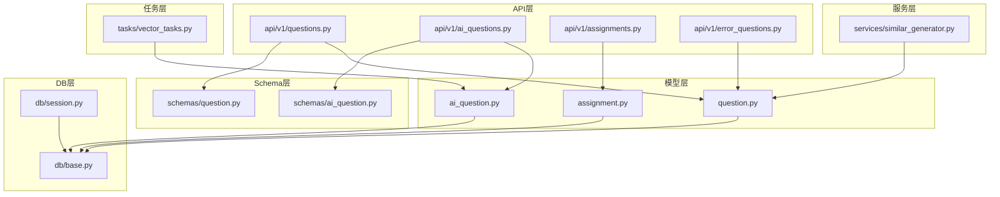
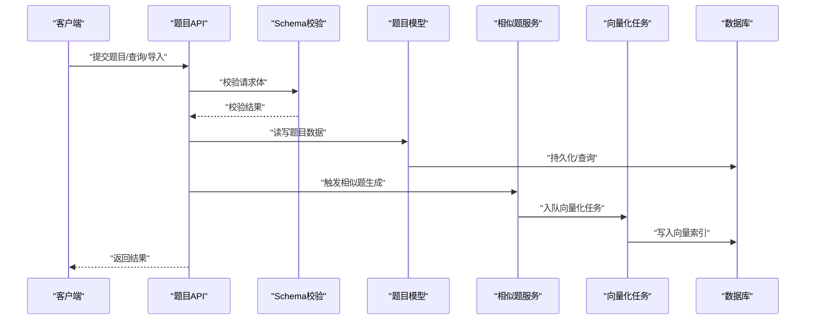
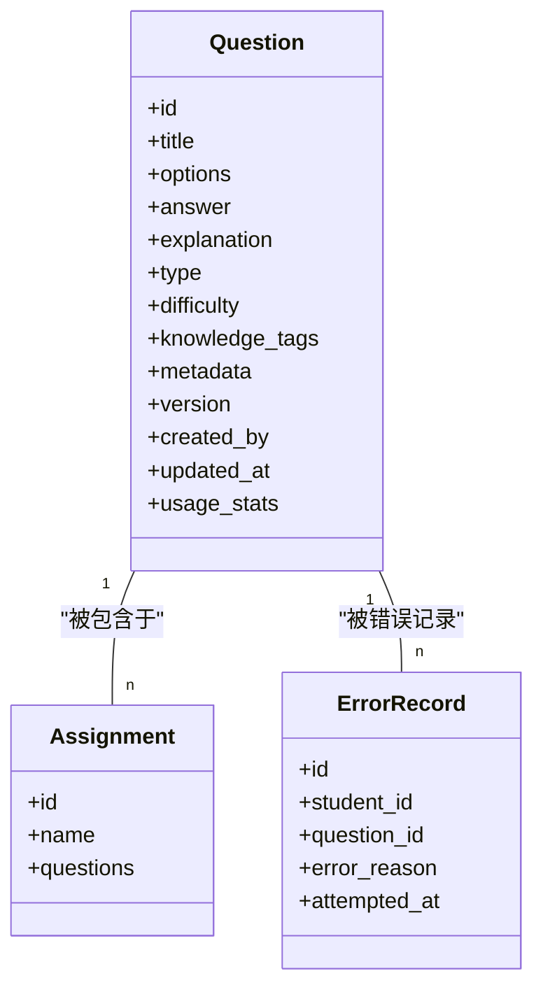
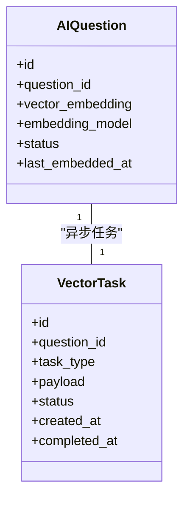
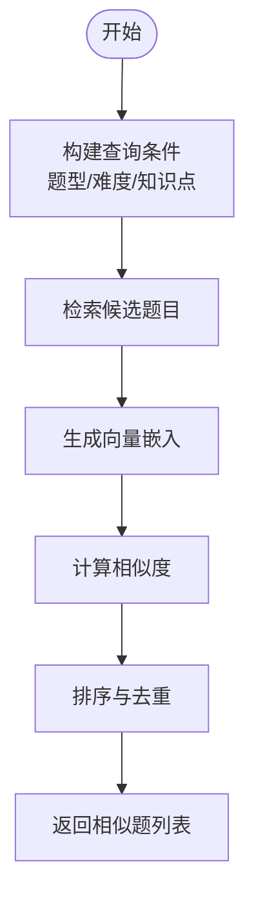
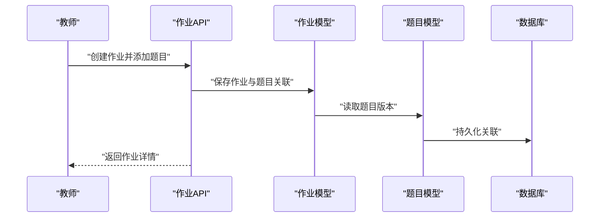
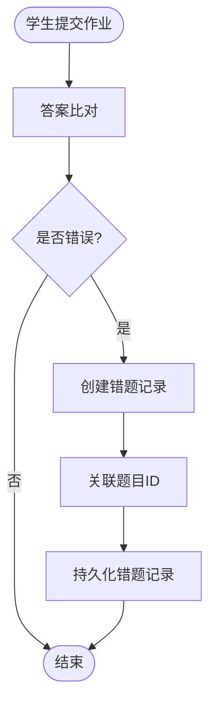
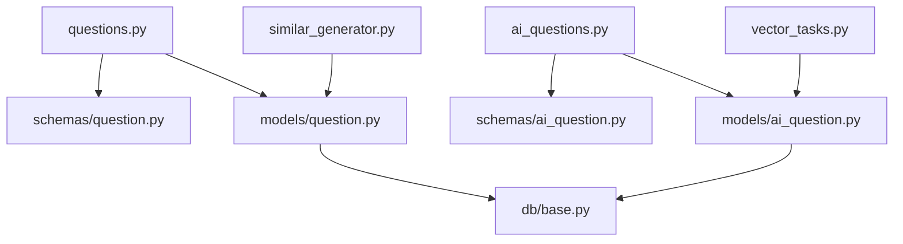

# 题目实体设计

<cite>
**本文引用的文件**   
- [backend/app/models/question.py](file://backend/app/models/question.py)
- [backend/app/schemas/question.py](file://backend/app/schemas/question.py)
- [backend/app/api/v1/questions.py](file://backend/app/api/v1/questions.py)
- [backend/app/models/ai_question.py](file://backend/app/models/ai_question.py)
- [backend/app/schemas/ai_question.py](file://backend/app/schemas/ai_question.py)
- [backend/app/api/v1/ai_questions.py](file://backend/app/api/v1/ai_questions.py)
- [backend/app/services/similar_generator.py](file://backend/app/services/similar_generator.py)
- [backend/app/tasks/vector_tasks.py](file://backend/app/tasks/vector_tasks.py)
- [backend/app/db/base.py](file://backend/app/db/base.py)
- [backend/app/db/session.py](file://backend/app/db/session.py)
- [backend/app/models/assignment.py](file://backend/app/models/assignment.py)
- [backend/app/api/v1/assignments.py](file://backend/app/api/v1/assignments.py)
- [backend/app/api/v1/error_questions.py](file://backend/app/api/v1/error_questions.py)
</cite>

## 目录
1. [引言](#引言)
2. [项目结构](#项目结构)
3. [核心组件](#核心组件)
4. [架构总览](#架构总览)
5. [详细组件分析](#详细组件分析)
6. [依赖关系分析](#依赖关系分析)
7. [性能考虑](#性能考虑)
8. [故障排查指南](#故障排查指南)
9. [结论](#结论)
10. [附录](#附录)

## 引言
本设计文档聚焦“题目实体”的数据模型与系统能力，覆盖题目内容管理（题干、选项、答案、解析）、题型分类（选择题、填空题、作文题、口语题）、难度等级体系（简单、中等、困难）、知识点标签关联、元数据管理（创建者、更新时间、使用统计）、版本控制机制、批量导入导出、与作业关联、错题收集机制、相似题目推荐算法的数据基础，以及全文搜索与向量检索的索引设计。文档同时提供SQL建表示例与ORM模型对照，帮助读者快速理解并落地实现。

## 项目结构
围绕题目实体的后端关键位置如下：
- 模型层：定义数据库表结构与字段约束
- Schema层：定义API请求/响应数据结构与校验规则
- API层：暴露题目相关接口（CRUD、导入导出、AI生成等）
- 服务层：封装业务逻辑（如相似题生成、向量化任务）
- 任务层：异步处理（如向量入库、索引更新）
- 数据库会话与基类：统一连接与会话管理

图表来源
- [backend/app/models/question.py](file://backend/app/models/question.py)
- [backend/app/schemas/question.py](file://backend/app/schemas/question.py)
- [backend/app/api/v1/questions.py](file://backend/app/api/v1/questions.py)
- [backend/app/models/ai_question.py](file://backend/app/models/ai_question.py)
- [backend/app/schemas/ai_question.py](file://backend/app/schemas/ai_question.py)
- [backend/app/api/v1/ai_questions.py](file://backend/app/api/v1/ai_questions.py)
- [backend/app/services/similar_generator.py](file://backend/app/services/similar_generator.py)
- [backend/app/tasks/vector_tasks.py](file://backend/app/tasks/vector_tasks.py)
- [backend/app/db/base.py](file://backend/app/db/base.py)
- [backend/app/db/session.py](file://backend/app/db/session.py)
- [backend/app/models/assignment.py](file://backend/app/models/assignment.py)
- [backend/app/api/v1/assignments.py](file://backend/app/api/v1/assignments.py)
- [backend/app/api/v1/error_questions.py](file://backend/app/api/v1/error_questions.py)

章节来源
- [backend/app/models/question.py](file://backend/app/models/question.py)
- [backend/app/schemas/question.py](file://backend/app/schemas/question.py)
- [backend/app/api/v1/questions.py](file://backend/app/api/v1/questions.py)
- [backend/app/models/ai_question.py](file://backend/app/models/ai_question.py)
- [backend/app/schemas/ai_question.py](file://backend/app/schemas/ai_question.py)
- [backend/app/api/v1/ai_questions.py](file://backend/app/api/v1/ai_questions.py)
- [backend/app/services/similar_generator.py](file://backend/app/services/similar_generator.py)
- [backend/app/tasks/vector_tasks.py](file://backend/app/tasks/vector_tasks.py)
- [backend/app/db/base.py](file://backend/app/db/base.py)
- [backend/app/db/session.py](file://backend/app/db/session.py)
- [backend/app/models/assignment.py](file://backend/app/models/assignment.py)
- [backend/app/api/v1/assignments.py](file://backend/app/api/v1/assignments.py)
- [backend/app/api/v1/error_questions.py](file://backend/app/api/v1/error_questions.py)

## 核心组件
本节从数据模型、类型与难度枚举、元数据、版本控制、导入导出、与作业关联、错题收集、相似题推荐等方面，系统化阐述题目实体的设计与实现要点。

- 题目内容管理
  - 题干与解析：支持富文本或结构化内容，便于渲染与检索
  - 选项：针对选择题的结构化存储，包含选项文本、是否正确答案、排序等
  - 答案：支持多模态答案（文本、数值、代码片段等），并与解析联动
  - 解析：可分步骤展示，支持引用知识点与相似题链接

- 题型分类系统
  - 选择题：含标准单选/多选模式
  - 填空题：支持占位符与答案映射
  - 作文题：支持评分维度与模板
  - 口语题：支持音频/视频素材与评分维度

- 难度等级体系
  - 简单、中等、困难三档，用于筛选与推荐策略

- 知识点标签关联
  - 通过多对多关系将题目与知识点标签关联，支撑知识图谱与个性化练习

- 元数据管理
  - 创建者、更新时间、使用次数、最近使用时间等，用于统计与分析

- 版本控制机制
  - 基于版本号或时间戳的题目快照，保证历史作业与成绩可追溯

- 批量导入导出
  - 支持Excel/CSV批量导入，自动校验与错误报告；支持按条件导出

- 与作业的关联关系
  - 作业包含若干题目，支持顺序、权重、分值配置

- 错题收集机制
  - 记录学生作答错误，形成错题集，支持重做与推送

- 相似题目推荐算法的数据基础
  - 基于题目文本、选项、解析的向量嵌入，结合知识点与难度进行相似度计算

章节来源
- [backend/app/models/question.py](file://backend/app/models/question.py)
- [backend/app/schemas/question.py](file://backend/app/schemas/question.py)
- [backend/app/api/v1/questions.py](file://backend/app/api/v1/questions.py)
- [backend/app/models/ai_question.py](file://backend/app/models/ai_question.py)
- [backend/app/schemas/ai_question.py](file://backend/app/schemas/ai_question.py)
- [backend/app/api/v1/ai_questions.py](file://backend/app/api/v1/ai_questions.py)
- [backend/app/services/similar_generator.py](file://backend/app/services/similar_generator.py)
- [backend/app/tasks/vector_tasks.py](file://backend/app/tasks/vector_tasks.py)
- [backend/app/models/assignment.py](file://backend/app/models/assignment.py)
- [backend/app/api/v1/assignments.py](file://backend/app/api/v1/assignments.py)
- [backend/app/api/v1/error_questions.py](file://backend/app/api/v1/error_questions.py)

## 架构总览
题目实体在系统中的交互流程如下：
- API层接收请求，调用Schema校验后访问模型层
- 模型层负责持久化到数据库，并通过会话管理连接
- 服务层执行复杂业务（如相似题生成）
- 任务层异步处理向量化与索引更新
- AI题目模块扩展了向量字段与异步任务

图表来源
- [backend/app/api/v1/questions.py](file://backend/app/api/v1/questions.py)
- [backend/app/schemas/question.py](file://backend/app/schemas/question.py)
- [backend/app/models/question.py](file://backend/app/models/question.py)
- [backend/app/services/similar_generator.py](file://backend/app/services/similar_generator.py)
- [backend/app/tasks/vector_tasks.py](file://backend/app/tasks/vector_tasks.py)
- [backend/app/db/base.py](file://backend/app/db/base.py)
- [backend/app/db/session.py](file://backend/app/db/session.py)

## 详细组件分析

### 题目模型与Schema
- 模型职责
  - 定义题目主表字段：题干、选项、答案、解析、题型、难度、知识点标签、元数据、版本信息
  - 维护与作业、错题记录的关联关系
- Schema职责
  - 定义API输入输出结构，包括必填字段、枚举值、长度限制、格式校验
  - 为导入导出提供统一的DTO结构

图表来源
- [backend/app/models/question.py](file://backend/app/models/question.py)
- [backend/app/models/assignment.py](file://backend/app/models/assignment.py)
- [backend/app/api/v1/error_questions.py](file://backend/app/api/v1/error_questions.py)

章节来源
- [backend/app/models/question.py](file://backend/app/models/question.py)
- [backend/app/schemas/question.py](file://backend/app/schemas/question.py)
- [backend/app/api/v1/questions.py](file://backend/app/api/v1/questions.py)
- [backend/app/models/assignment.py](file://backend/app/models/assignment.py)
- [backend/app/api/v1/error_questions.py](file://backend/app/api/v1/error_questions.py)

### AI题目模型与向量化
- 模型职责
  - 在题目基础上扩展向量字段，用于语义检索与相似题推荐
  - 与向量化任务协作，异步生成并更新向量索引
- Schema职责
  - 定义AI题目的输入输出结构，包括提示词、生成参数、质量评估指标

图表来源
- [backend/app/models/ai_question.py](file://backend/app/models/ai_question.py)
- [backend/app/schemas/ai_question.py](file://backend/app/schemas/ai_question.py)
- [backend/app/tasks/vector_tasks.py](file://backend/app/tasks/vector_tasks.py)

章节来源
- [backend/app/models/ai_question.py](file://backend/app/models/ai_question.py)
- [backend/app/schemas/ai_question.py](file://backend/app/schemas/ai_question.py)
- [backend/app/api/v1/ai_questions.py](file://backend/app/api/v1/ai_questions.py)
- [backend/app/tasks/vector_tasks.py](file://backend/app/tasks/vector_tasks.py)

### 相似题生成与服务编排
- 服务职责
  - 根据题目文本、选项、解析与知识点，计算相似度候选集
  - 结合难度与知识点匹配度进行排序与去重
- 任务职责
  - 异步执行向量化，写入向量索引，供检索服务使用

图表来源
- [backend/app/services/similar_generator.py](file://backend/app/services/similar_generator.py)
- [backend/app/tasks/vector_tasks.py](file://backend/app/tasks/vector_tasks.py)

章节来源
- [backend/app/services/similar_generator.py](file://backend/app/services/similar_generator.py)
- [backend/app/tasks/vector_tasks.py](file://backend/app/tasks/vector_tasks.py)

### 作业与题目关联
- 关联关系
  - 作业包含多个题目，支持顺序、权重、分值配置
  - 题目被多次作业引用，需保持版本一致性
- 数据流
  - 创建作业时选择题目，生成作业-题目中间表记录
  - 提交作业后，依据题目版本生成成绩与反馈

图表来源
- [backend/app/api/v1/assignments.py](file://backend/app/api/v1/assignments.py)
- [backend/app/models/assignment.py](file://backend/app/models/assignment.py)
- [backend/app/models/question.py](file://backend/app/models/question.py)

章节来源
- [backend/app/api/v1/assignments.py](file://backend/app/api/v1/assignments.py)
- [backend/app/models/assignment.py](file://backend/app/models/assignment.py)
- [backend/app/models/question.py](file://backend/app/models/question.py)

### 错题收集机制
- 功能要点
  - 记录学生作答错误的题目、错误原因、尝试时间
  - 支持错题集查看、重做与推送复习
- 数据流
  - 学生提交作业后，比对答案生成错题记录
  - 错题记录与题目建立外键关联，便于后续分析与推荐

图表来源
- [backend/app/api/v1/error_questions.py](file://backend/app/api/v1/error_questions.py)
- [backend/app/models/question.py](file://backend/app/models/question.py)

章节来源
- [backend/app/api/v1/error_questions.py](file://backend/app/api/v1/error_questions.py)
- [backend/app/models/question.py](file://backend/app/models/question.py)

## 依赖关系分析
- 直接依赖
  - API层依赖Schema与模型
  - 模型依赖数据库基类与会话
  - 服务层依赖模型与任务队列
  - 任务层依赖模型与外部向量库
- 间接依赖
  - 相似题推荐依赖向量索引与检索服务
  - 错题收集依赖作业提交与答案比对服务

图表来源
- [backend/app/api/v1/questions.py](file://backend/app/api/v1/questions.py)
- [backend/app/schemas/question.py](file://backend/app/schemas/question.py)
- [backend/app/models/question.py](file://backend/app/models/question.py)
- [backend/app/api/v1/ai_questions.py](file://backend/app/api/v1/ai_questions.py)
- [backend/app/schemas/ai_question.py](file://backend/app/schemas/ai_question.py)
- [backend/app/models/ai_question.py](file://backend/app/models/ai_question.py)
- [backend/app/services/similar_generator.py](file://backend/app/services/similar_generator.py)
- [backend/app/tasks/vector_tasks.py](file://backend/app/tasks/vector_tasks.py)
- [backend/app/db/base.py](file://backend/app/db/base.py)

章节来源
- [backend/app/api/v1/questions.py](file://backend/app/api/v1/questions.py)
- [backend/app/schemas/question.py](file://backend/app/schemas/question.py)
- [backend/app/models/question.py](file://backend/app/models/question.py)
- [backend/app/api/v1/ai_questions.py](file://backend/app/api/v1/ai_questions.py)
- [backend/app/schemas/ai_question.py](file://backend/app/schemas/ai_question.py)
- [backend/app/models/ai_question.py](file://backend/app/models/ai_question.py)
- [backend/app/services/similar_generator.py](file://backend/app/services/similar_generator.py)
- [backend/app/tasks/vector_tasks.py](file://backend/app/tasks/vector_tasks.py)
- [backend/app/db/base.py](file://backend/app/db/base.py)

## 性能考虑
- 索引设计
  - 全文搜索：对题干、解析建立全文索引，提升关键词检索效率
  - 向量检索：对向量字段建立近似最近邻索引，加速相似题检索
- 缓存策略
  - 热点题目与相似题结果缓存，降低重复计算开销
- 异步处理
  - 向量化与索引更新采用异步任务，避免阻塞主流程
- 批量操作
  - 导入导出使用批量插入与分页查询，减少数据库往返

[本节为通用性能建议，不直接分析具体文件]

## 故障排查指南
- 常见问题
  - 导入失败：检查Schema校验错误与数据格式
  - 向量入库失败：检查任务队列状态与外部向量库连通性
  - 相似题无结果：确认向量索引已更新且题目文本完整
- 定位方法
  - 查看任务日志与错误记录
  - 核对题目版本与作业版本一致性
  - 验证全文索引与向量索引状态

章节来源
- [backend/app/tasks/vector_tasks.py](file://backend/app/tasks/vector_tasks.py)
- [backend/app/api/v1/error_questions.py](file://backend/app/api/v1/error_questions.py)

## 结论
题目实体设计围绕内容管理、题型与难度、知识点标签、元数据与版本控制展开，并通过作业关联、错题收集与相似题推荐形成闭环。全文搜索与向量检索的索引设计提升了检索体验，异步任务保障了系统可扩展性与稳定性。建议在后续迭代中完善导入导出的错误报告与回滚机制，并持续优化相似题推荐的排序策略。

[本节为总结性内容，不直接分析具体文件]

## 附录

### SQL建表示例（参考）
以下为题目实体相关表的示例结构，便于对照ORM模型理解字段与约束：
- 题目主表
  - id：主键
  - title：题干
  - options：选项（JSON）
  - answer：答案（JSON）
  - explanation：解析
  - type：题型（枚举）
  - difficulty：难度（枚举）
  - knowledge_tags：知识点标签（JSON数组）
  - metadata：元数据（JSON）
  - version：版本号
  - created_by：创建者
  - updated_at：更新时间
  - usage_count：使用次数
  - last_used_at：最近使用时间
- AI题目扩展表
  - id：主键
  - question_id：外键
  - vector_embedding：向量字段
  - embedding_model：模型标识
  - status：任务状态
  - last_embedded_at：最后嵌入时间
- 作业-题目关联表
  - id：主键
  - assignment_id：外键
  - question_id：外键
  - order_index：顺序
  - weight：权重
  - score：分值
- 错题记录表
  - id：主键
  - student_id：学生ID
  - question_id：外键
  - error_reason：错误原因
  - attempted_at：尝试时间

[本节为概念性示例，不直接分析具体文件]

### ORM模型与SQL对照说明
- 字段映射
  - 字符串字段对应VARCHAR/TEXT
  - JSON字段对应JSON/JSONB
  - 枚举字段对应ENUM或CHECK约束
  - 时间戳字段对应TIMESTAMP
- 索引策略
  - 全文索引：对题干与解析列
  - 向量索引：对向量字段
  - 普通索引：对外键与常用查询列

[本节为概念性说明，不直接分析具体文件]