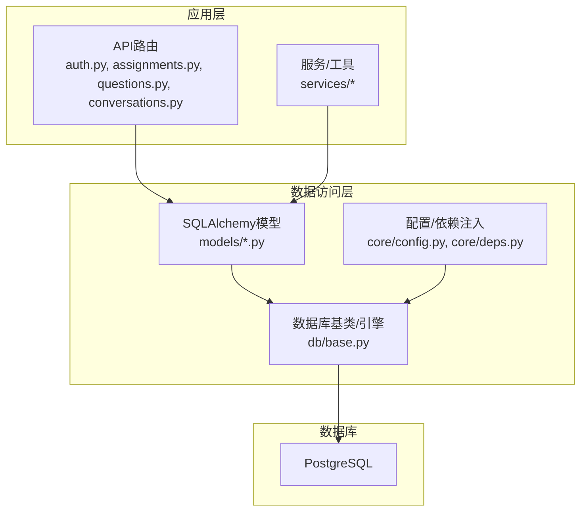
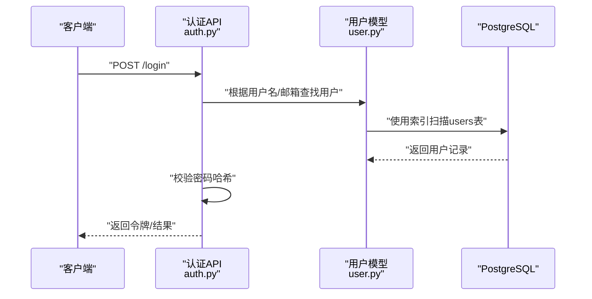
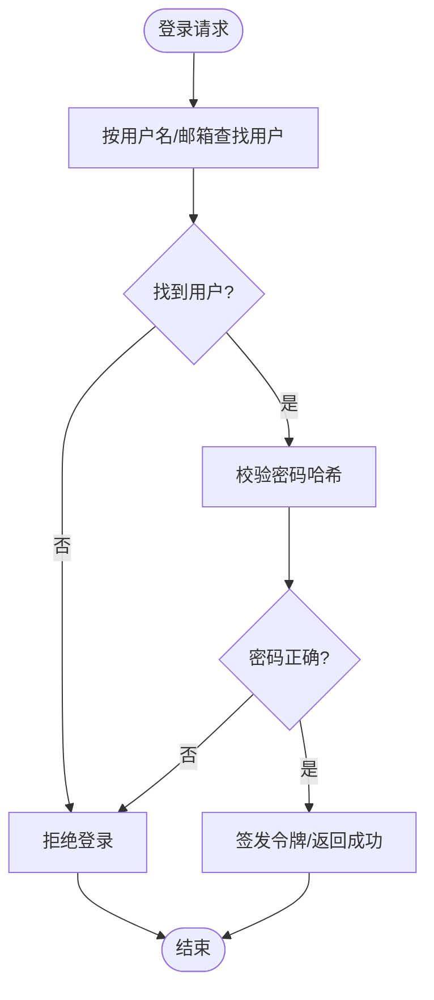
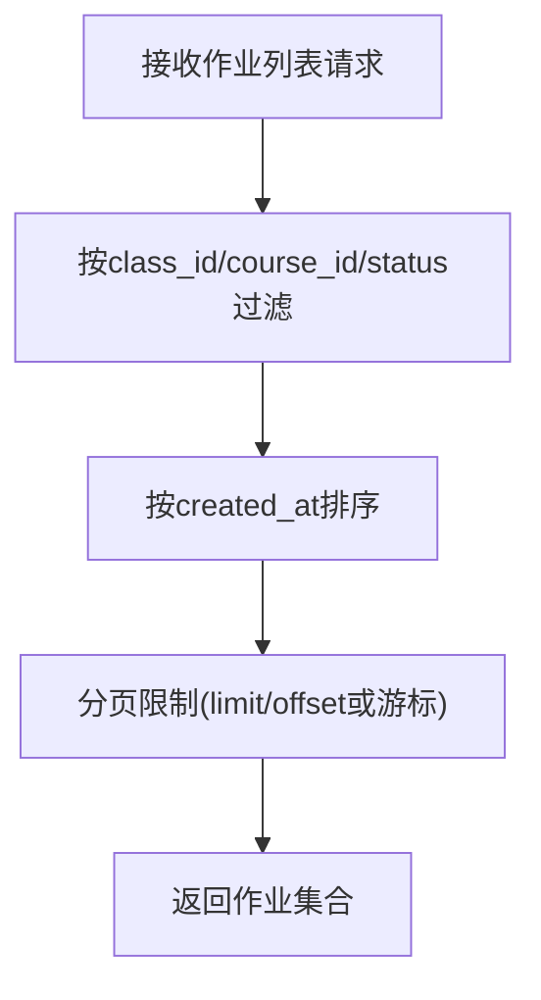
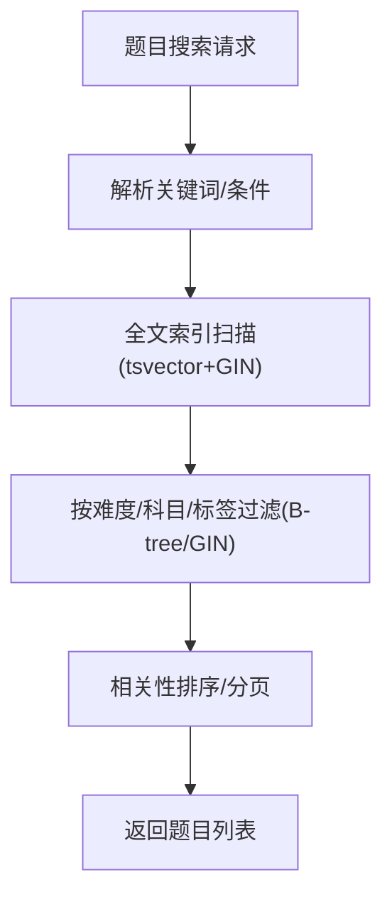
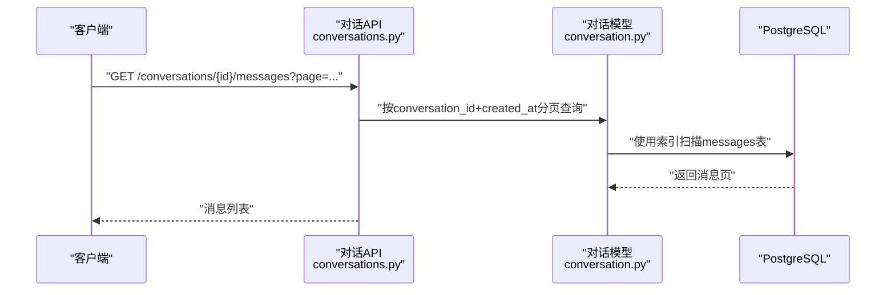
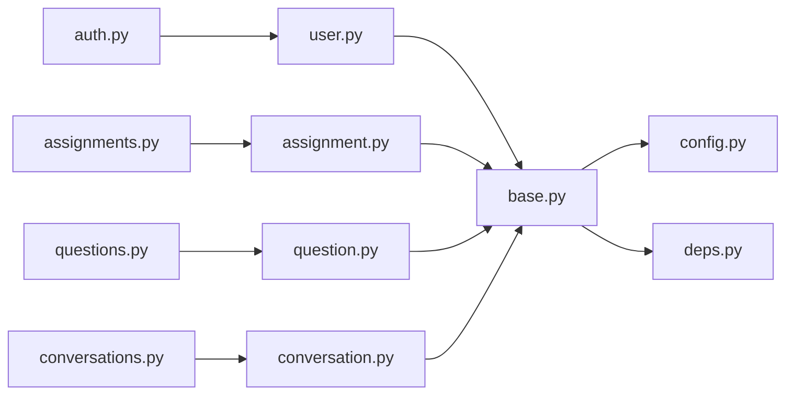

# 索引与性能优化

<cite>
**本文引用的文件**   
- [backend/app/db/base.py](file://backend/app/db/base.py)
- [backend/app/models/user.py](file://backend/app/models/user.py)
- [backend/app/models/assignment.py](file://backend/app/models/assignment.py)
- [backend/app/models/question.py](file://backend/app/models/question.py)
- [backend/app/models/conversation.py](file://backend/app/models/conversation.py)
- [backend/app/models/composition.py](file://backend/app/models/composition.py)
- [backend/app/models/oral_assessment.py](file://backend/app/models/oral_assessment.py)
- [backend/app/models/personality.py](file://backend/app/models/personality.py)
- [backend/app/models/ai_question.py](file://backend/app/models/ai_question.py)
- [backend/app/api/v1/auth.py](file://backend/app/api/v1/auth.py)
- [backend/app/api/v1/assignments.py](file://backend/app/api/v1/assignments.py)
- [backend/app/api/v1/questions.py](file://backend/app/api/v1/questions.py)
- [backend/app/api/v1/conversations.py](file://backend/app/api/v1/conversations.py)
- [backend/app/core/config.py](file://backend/app/core/config.py)
- [backend/app/core/deps.py](file://backend/app/core/deps.py)
</cite>

## 目录
1. [简介](#简介)
2. [项目结构](#项目结构)
3. [核心组件](#核心组件)
4. [架构总览](#架构总览)
5. [详细组件分析](#详细组件分析)
6. [依赖关系分析](#依赖关系分析)
7. [性能考量](#性能考量)
8. [故障排查指南](#故障排查指南)
9. [结论](#结论)
10. [附录](#附录)

## 简介
本文件面向AI助教系统的数据库层，聚焦于PostgreSQL的索引设计与性能优化。内容覆盖：
- 主键、唯一、复合索引的选择与应用场景
- 高频查询（用户登录认证、作业列表、题目搜索、对话记录检索）的索引优化方案
- PostgreSQL特有索引类型（B-tree、Hash、Gin、GiST）及适用场景
- 全文搜索索引、JSON字段索引、空间索引的配置方法
- 慢查询分析与EXPLAIN计划解读、执行时间监控
- 索引维护策略、统计信息更新、分区表设计考虑
- 性能基准测试方法与容量规划建议

## 项目结构
后端采用FastAPI + SQLAlchemy模型定义，数据访问通过会话管理。关键路径：
- 配置与会话：core/config.py、core/deps.py、db/base.py
- 领域模型：models/*.py
- API路由：api/v1/*.py

图表来源
- [backend/app/api/v1/auth.py](file://backend/app/api/v1/auth.py)
- [backend/app/api/v1/assignments.py](file://backend/app/api/v1/assignments.py)
- [backend/app/api/v1/questions.py](file://backend/app/api/v1/questions.py)
- [backend/app/api/v1/conversations.py](file://backend/app/api/v1/conversations.py)
- [backend/app/models/user.py](file://backend/app/models/user.py)
- [backend/app/models/assignment.py](file://backend/app/models/assignment.py)
- [backend/app/models/question.py](file://backend/app/models/question.py)
- [backend/app/models/conversation.py](file://backend/app/models/conversation.py)
- [backend/app/db/base.py](file://backend/app/db/base.py)
- [backend/app/core/config.py](file://backend/app/core/config.py)
- [backend/app/core/deps.py](file://backend/app/core/deps.py)

章节来源
- [backend/app/core/config.py](file://backend/app/core/config.py)
- [backend/app/core/deps.py](file://backend/app/core/deps.py)
- [backend/app/db/base.py](file://backend/app/db/base.py)

## 核心组件
- 用户认证：基于用户名/邮箱与密码哈希的登录流程，需对认证字段建立高效索引。
- 作业管理：按班级/课程/状态筛选的作业列表，需要复合索引以加速过滤与排序。
- 题目检索：支持关键词、难度、知识点等条件，适合全文或倒排索引。
- 对话记录：按会话ID分页检索消息，需针对会话维度的快速定位。
- 作文与口语评估：结构化+JSON混合存储，需结合JSON索引提升查询效率。
- AI题目与人格配置：辅助功能，关注写入吞吐与缓存命中。

章节来源
- [backend/app/models/user.py](file://backend/app/models/user.py)
- [backend/app/models/assignment.py](file://backend/app/models/assignment.py)
- [backend/app/models/question.py](file://backend/app/models/question.py)
- [backend/app/models/conversation.py](file://backend/app/models/conversation.py)
- [backend/app/models/composition.py](file://backend/app/models/composition.py)
- [backend/app/models/oral_assessment.py](file://backend/app/models/oral_assessment.py)
- [backend/app/models/personality.py](file://backend/app/models/personality.py)
- [backend/app/models/ai_question.py](file://backend/app/models/ai_question.py)

## 架构总览
从API到数据库的关键调用链如下：

图表来源
- [backend/app/api/v1/auth.py](file://backend/app/api/v1/auth.py)
- [backend/app/models/user.py](file://backend/app/models/user.py)

章节来源
- [backend/app/api/v1/auth.py](file://backend/app/api/v1/auth.py)
- [backend/app/models/user.py](file://backend/app/models/user.py)

## 详细组件分析

### 用户认证（登录）
- 目标：在海量用户下实现毫秒级登录验证。
- 关键索引建议：
  - 主键：用户ID（自增或UUID），用于关联与快速定位。
  - 唯一索引：用户名、邮箱，避免重复并加速登录查找。
  - 可选：若按地区/学校维度隔离，可加前缀复合索引（如“学校ID+用户名”）。
- 查询模式：按用户名或邮箱精确匹配，随后校验密码哈希。
- 注意事项：
  - 避免对密码字段建索引。
  - 确保连接池大小与并发登录峰值匹配。

章节来源
- [backend/app/api/v1/auth.py](file://backend/app/api/v1/auth.py)
- [backend/app/models/user.py](file://backend/app/models/user.py)

### 作业列表查询
- 目标：按班级、课程、状态、时间范围等多条件筛选，支持分页与排序。
- 关键索引建议：
  - 复合索引：(class_id, status, created_at DESC) 或 (course_id, class_id, status)。
  - 若频繁按教师/学生维度查看，增加(user_id, status)或(user_id, created_at DESC)。
- 查询模式：多条件过滤+排序+分页；避免全表扫描。
- 注意事项：
  - 选择选择性高的列作为前导列（如class_id > status）。
  - 对大结果集分页时，优先使用基于主键的游标分页。

章节来源
- [backend/app/api/v1/assignments.py](file://backend/app/api/v1/assignments.py)
- [backend/app/models/assignment.py](file://backend/app/models/assignment.py)

### 题目搜索
- 目标：支持关键词、难度、知识点、题型等多条件检索。
- 关键索引建议：
  - 全文搜索：对标题/题干/解析建立tsvector索引（GIN），配合to_tsquery进行中文分词检索。
  - 复合索引：(difficulty, subject, created_at DESC) 或 (tags[] -> GIN)。
  - JSON字段：若题目属性为JSONB，使用GIN索引(JSONB路径或表达式)。
- 查询模式：关键词模糊匹配+多维过滤；注意中文分词器配置。
- 注意事项：
  - 对高频过滤列建立B-tree索引，对文本列建立GIN全文索引。
  - 合理设置search_config，平衡召回率与性能。

章节来源
- [backend/app/api/v1/questions.py](file://backend/app/api/v1/questions.py)
- [backend/app/models/question.py](file://backend/app/models/question.py)

### 对话记录检索
- 目标：按会话ID分页获取消息，支持时间范围与关键字过滤。
- 关键索引建议：
  - 复合索引：(conversation_id, created_at DESC) 用于会话内分页。
  - 若需按用户维度聚合，增加(user_id, conversation_id)。
  - 如需全文检索消息内容，可对content建立GIN全文索引。
- 查询模式：会话内顺序读取+分页；高并发写入时需关注锁竞争。
- 注意事项：
  - 避免在大表中无索引地进行LIKE '%keyword%'。
  - 对热点会话可采用物化视图或缓存层。

图表来源
- [backend/app/api/v1/conversations.py](file://backend/app/api/v1/conversations.py)
- [backend/app/models/conversation.py](file://backend/app/models/conversation.py)

章节来源
- [backend/app/api/v1/conversations.py](file://backend/app/api/v1/conversations.py)
- [backend/app/models/conversation.py](file://backend/app/models/conversation.py)

### 作文与口语评估（JSON字段）
- 目标：结构化评分+扩展元数据（JSONB）的高效读写与查询。
- 关键索引建议：
  - JSONB GIN索引：对常用路径（如score_detail、feedback_tags）建立GIN。
  - 复合索引：(student_id, assignment_id, created_at DESC) 用于学习分析。
- 查询模式：按学生/作业聚合评分、提取反馈标签。
- 注意事项：
  - 谨慎选择JSON路径，避免过度索引导致写放大。
  - 对只读分析任务，考虑物化视图或定时汇总。

章节来源
- [backend/app/models/composition.py](file://backend/app/models/composition.py)
- [backend/app/models/oral_assessment.py](file://backend/app/models/oral_assessment.py)

### AI题目与人格配置
- 目标：AI生成题目的批量写入与配置项的快速读取。
- 关键索引建议：
  - 主键：自增ID或UUID。
  - 唯一索引：题目外部标识（如source_id）、配置键名。
  - 复合索引：(subject, difficulty, created_at DESC) 便于推荐与回溯。
- 注意事项：
  - 批量插入时关闭不必要的索引或使用COPY/批量事务。
  - 配置项可引入Redis缓存，降低热点读取压力。

章节来源
- [backend/app/models/ai_question.py](file://backend/app/models/ai_question.py)
- [backend/app/models/personality.py](file://backend/app/models/personality.py)

## 依赖关系分析
- API层依赖模型层进行数据访问，模型层依赖数据库引擎与连接配置。
- 配置模块提供数据库URL、连接池参数；依赖注入模块提供会话工厂。

图表来源
- [backend/app/api/v1/auth.py](file://backend/app/api/v1/auth.py)
- [backend/app/api/v1/assignments.py](file://backend/app/api/v1/assignments.py)
- [backend/app/api/v1/questions.py](file://backend/app/api/v1/questions.py)
- [backend/app/api/v1/conversations.py](file://backend/app/api/v1/conversations.py)
- [backend/app/models/user.py](file://backend/app/models/user.py)
- [backend/app/models/assignment.py](file://backend/app/models/assignment.py)
- [backend/app/models/question.py](file://backend/app/models/question.py)
- [backend/app/models/conversation.py](file://backend/app/models/conversation.py)
- [backend/app/db/base.py](file://backend/app/db/base.py)
- [backend/app/core/config.py](file://backend/app/core/config.py)
- [backend/app/core/deps.py](file://backend/app/core/deps.py)

章节来源
- [backend/app/core/config.py](file://backend/app/core/config.py)
- [backend/app/core/deps.py](file://backend/app/core/deps.py)
- [backend/app/db/base.py](file://backend/app/db/base.py)

## 性能考量

### 索引类型与适用场景
- B-tree：默认索引类型，适用于等值与范围查询、排序。广泛用于主键、外键、过滤列。
- Hash：仅支持等值查询，较少使用；在特定场景下比B-tree更快但不可排序。
- Gin：适用于数组、JSONB、全文搜索（tsvector）等复杂数据类型。
- GiST：适用于几何、范围、自定义操作符；空间索引与向量相似度检索可用。

### 全文搜索索引（中文）
- 使用tsvector与GIN索引，配合中文分词器（如jieba或pg_jieba）。
- 查询使用to_tsquery，结合权重与短语匹配提升相关性。
- 建议在标题、题干、解析字段建立tsvector列或表达式索引。

### JSON字段索引
- 对JSONB常用路径建立GIN索引，例如score_detail、feedback_tags。
- 使用表达式索引对计算字段（如JSON提取数值）进行加速。
- 避免对不常查询的路径建索引，控制写放大。

### 空间索引
- 使用GiST索引支持地理坐标、范围查询。
- 典型场景：校园地图、位置相关推荐。

### 慢查询分析与EXPLAIN计划解读
- 启用慢查询日志，记录超过阈值的SQL。
- 使用EXPLAIN ANALYZE观察实际执行计划，关注：
  - Seq Scan vs Index Scan vs Bitmap Index Scan
  - 行数估算与实际差异（statistics过时）
  - 排序/哈希/嵌套循环的成本
- 定期运行ANALYZE更新统计信息，必要时对热点表单独ANALYZE。

### 查询执行时间监控
- 使用pg_stat_statements扩展收集SQL统计（调用次数、平均耗时、总耗时）。
- 结合Prometheus/Grafana可视化监控关键指标。
- 对热点接口设置APM埋点，关联数据库慢查询。

### 索引维护策略
- 定期REINDEX重建碎片化索引。
- 监控索引大小与命中率，删除低效或重复索引。
- 大批量导入后重建索引或延迟创建索引以提升导入速度。

### 分区表设计考虑
- 按时间（如created_at）或租户（school_id）进行范围/列表分区。
- 将历史数据归档至冷分区，热数据保持在小分区中提高扫描效率。
- 注意分区键的选择与查询谓词的一致性，避免跨分区扫描。

### 性能基准测试方法
- 使用pgbench模拟OLTP负载，调整并发与事务比例。
- 针对业务热点构造压测脚本（登录、作业列表、题目搜索、对话分页）。
- 对比不同索引组合下的QPS与P99延迟，确定最优索引集。

### 容量规划建议
- 预估数据增长速率（用户、作业、题目、对话），预留磁盘与IOPS。
- 连接池大小与CPU核数、内存相匹配，避免上下文切换过多。
- 冷热数据分离，SSD承载热表，HDD承载归档。

[本节为通用指导，无需具体文件引用]

## 故障排查指南
- 登录失败或超时：检查用户唯一索引是否生效，确认连接池耗尽与锁等待。
- 作业列表缓慢：核对复合索引前导列是否符合查询谓词，避免回表过多。
- 题目搜索不准：检查中文分词器配置与tsvector更新策略，调整权重与查询语法。
- 对话分页抖动：确认(conversation_id, created_at)索引存在且统计信息最新。
- JSON查询退化：检查JSONB路径索引是否存在，避免深层嵌套路径。

章节来源
- [backend/app/api/v1/auth.py](file://backend/app/api/v1/auth.py)
- [backend/app/api/v1/assignments.py](file://backend/app/api/v1/assignments.py)
- [backend/app/api/v1/questions.py](file://backend/app/api/v1/questions.py)
- [backend/app/api/v1/conversations.py](file://backend/app/api/v1/conversations.py)
- [backend/app/models/user.py](file://backend/app/models/user.py)
- [backend/app/models/assignment.py](file://backend/app/models/assignment.py)
- [backend/app/models/question.py](file://backend/app/models/question.py)
- [backend/app/models/conversation.py](file://backend/app/models/conversation.py)
- [backend/app/models/composition.py](file://backend/app/models/composition.py)
- [backend/app/models/oral_assessment.py](file://backend/app/models/oral_assessment.py)

## 结论
通过合理的索引设计与维护策略，AI助教系统可在高并发与大数据量场景下保持稳定性能。重点在于：
- 依据查询模式设计主键、唯一与复合索引
- 充分利用GIN/GiST处理复杂数据类型
- 持续监控与调优，结合分区与缓存提升整体吞吐
- 以基准测试驱动容量规划与索引决策

[本节为总结性内容，无需具体文件引用]

## 附录

### 常见索引清单（示例）
- users
  - 主键：id
  - 唯一：username, email
- assignments
  - 复合：(class_id, status, created_at DESC)
  - 复合：(course_id, class_id, status)
- questions
  - 全文：title/content/resolution (tsvector+GIN)
  - 复合：(difficulty, subject, created_at DESC)
  - JSONB GIN：tags[], metadata
- messages（对话消息）
  - 复合：(conversation_id, created_at DESC)
  - 全文：content (tsvector+GIN)
- compositions & oral_assessments
  - JSONB GIN：score_detail, feedback_tags
  - 复合：(student_id, assignment_id, created_at DESC)

[本节为概念性清单，无需具体文件引用]