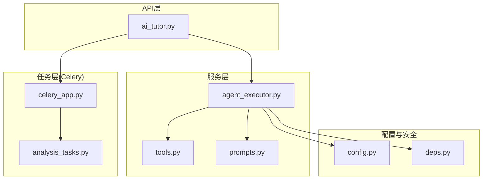
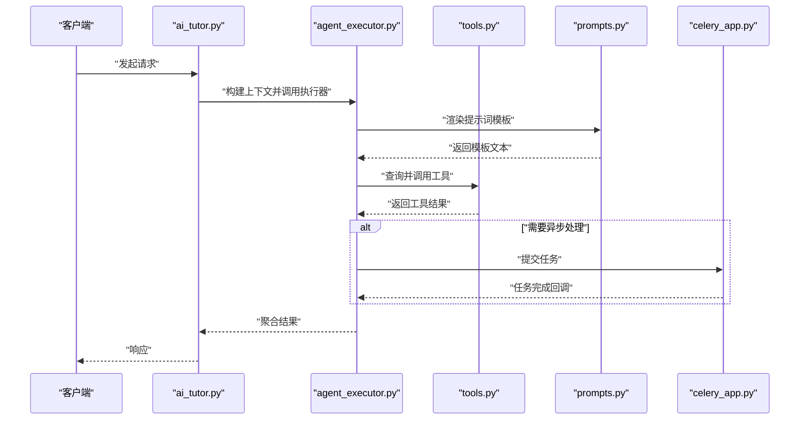
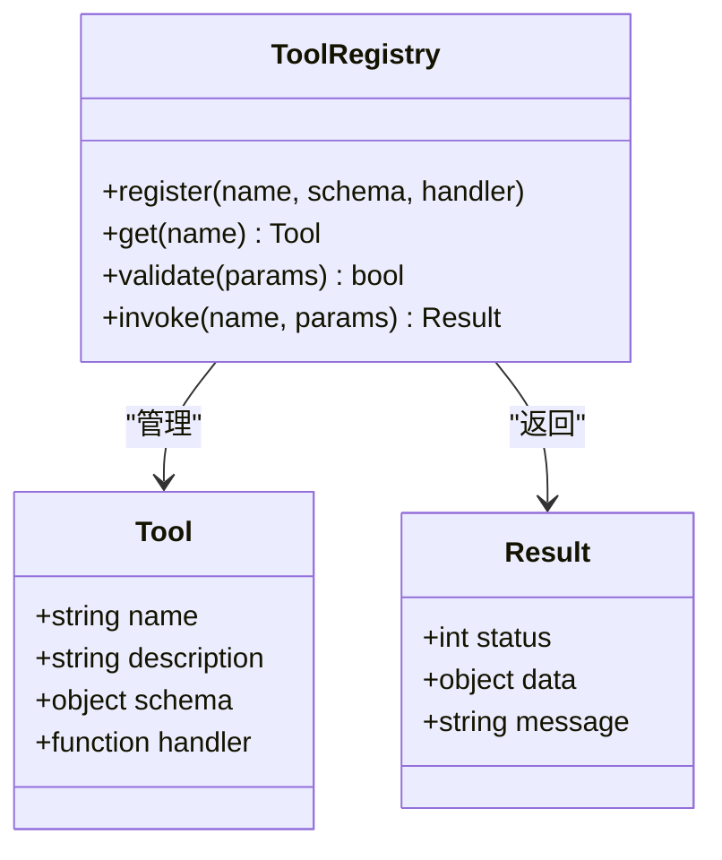
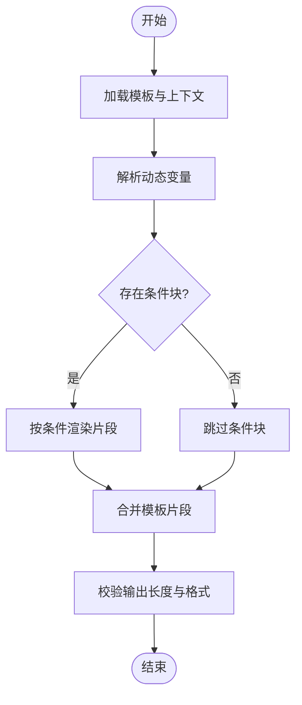
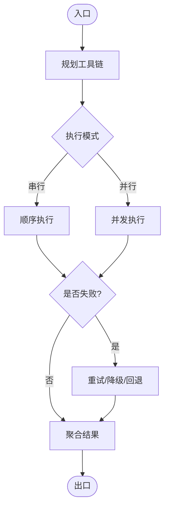
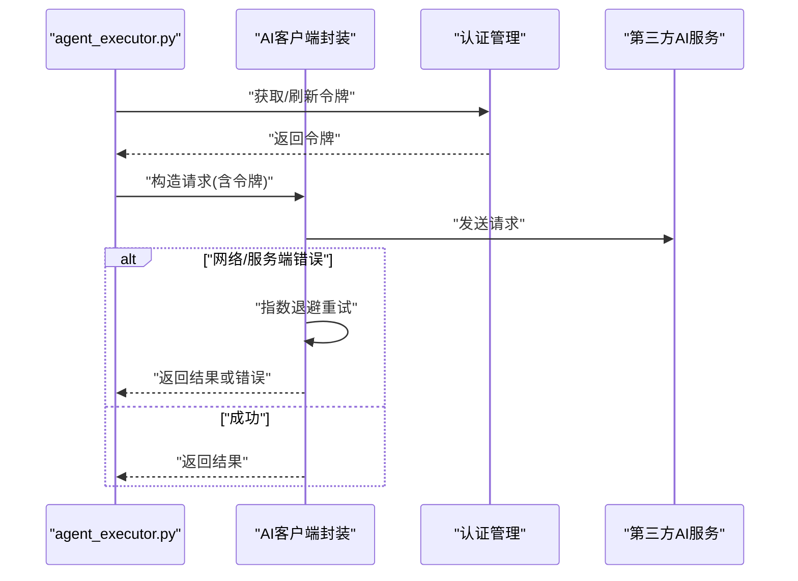
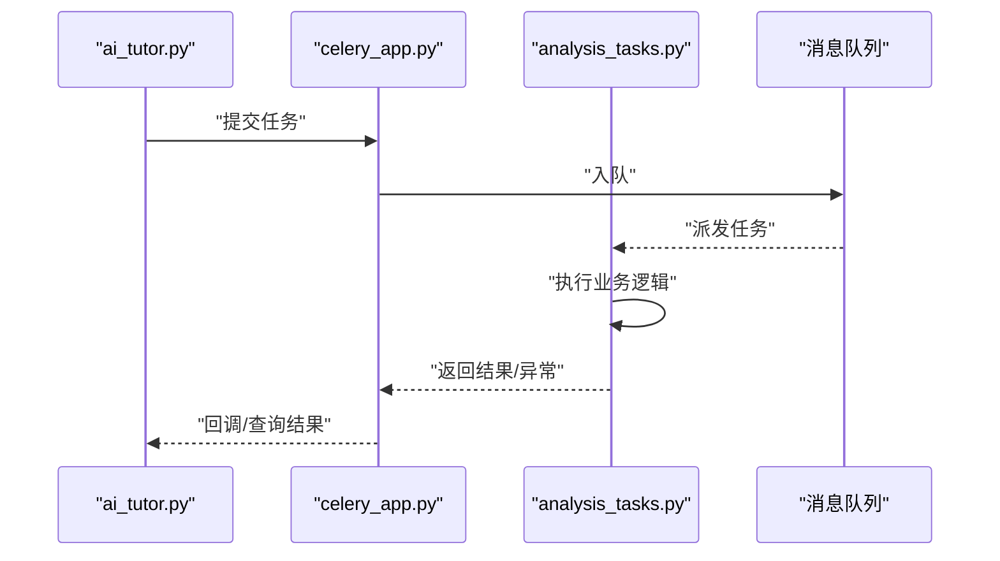
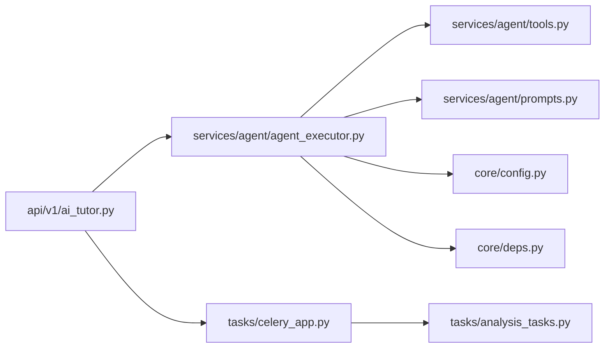

# AI工具扩展系统

<cite>
**本文引用的文件**   
- [agent_executor.py](file://backend/app/services/agent/agent_executor.py)
- [prompts.py](file://backend/app/services/agent/prompts.py)
- [tools.py](file://backend/app/services/agent/tools.py)
- [ai_tutor.py](file://backend/app/api/v1/ai_tutor.py)
- [config.py](file://backend/app/core/config.py)
- [deps.py](file://backend/app/core/deps.py)
- [celery_app.py](file://backend/app/tasks/celery_app.py)
- [analysis_tasks.py](file://backend/app/tasks/analysis_tasks.py)
</cite>

## 目录
1. [简介](#简介)
2. [项目结构](#项目结构)
3. [核心组件](#核心组件)
4. [架构总览](#架构总览)
5. [详细组件分析](#详细组件分析)
6. [依赖关系分析](#依赖关系分析)
7. [性能与监控](#性能与监控)
8. [故障排查指南](#故障排查指南)
9. [结论](#结论)
10. [附录：自定义工具开发指南](#附录自定义工具开发指南)

## 简介
本文件系统性地文档化AI工具扩展系统的实现，重点覆盖以下方面：
- Agent工具注册机制：工具接口定义、参数校验、返回值处理
- 提示词模板系统：动态变量替换、条件渲染、模板继承
- 工具链编排：串行执行、并行处理、错误恢复策略
- 第三方AI服务集成：API封装、认证管理、重试机制
- 性能监控与日志记录最佳实践
- 自定义工具开发与示例代码路径
- 面向开发者设计复杂AI工作流与多步骤任务的方法论

## 项目结构
后端采用分层架构：API层暴露REST接口，服务层组织业务逻辑，Agent子模块提供工具注册、提示词模板与执行器；任务层基于Celery进行异步编排。前端通过服务层调用后端API。

图表来源
- [ai_tutor.py](file://backend/app/api/v1/ai_tutor.py)
- [agent_executor.py](file://backend/app/services/agent/agent_executor.py)
- [tools.py](file://backend/app/services/agent/tools.py)
- [prompts.py](file://backend/app/services/agent/prompts.py)
- [config.py](file://backend/app/core/config.py)
- [deps.py](file://backend/app/core/deps.py)
- [celery_app.py](file://backend/app/tasks/celery_app.py)
- [analysis_tasks.py](file://backend/app/tasks/analysis_tasks.py)

章节来源
- [ai_tutor.py](file://backend/app/api/v1/ai_tutor.py)
- [agent_executor.py](file://backend/app/services/agent/agent_executor.py)
- [tools.py](file://backend/app/services/agent/tools.py)
- [prompts.py](file://backend/app/services/agent/prompts.py)
- [config.py](file://backend/app/core/config.py)
- [deps.py](file://backend/app/core/deps.py)
- [celery_app.py](file://backend/app/tasks/celery_app.py)
- [analysis_tasks.py](file://backend/app/tasks/analysis_tasks.py)

## 核心组件
- 工具注册中心：集中维护工具元数据与可调用对象，支持按名称查找与参数校验。
- 提示词模板引擎：提供变量注入、条件分支与模板继承能力，便于生成结构化Prompt。
- Agent执行器：负责将用户意图解析为工具调用序列，协调执行并汇总结果。
- 任务编排（Celery）：对耗时或并发任务进行异步调度与重试。
- 配置与安全：统一加载外部配置、密钥与依赖注入。

章节来源
- [tools.py](file://backend/app/services/agent/tools.py)
- [prompts.py](file://backend/app/services/agent/prompts.py)
- [agent_executor.py](file://backend/app/services/agent/agent_executor.py)
- [celery_app.py](file://backend/app/tasks/celery_app.py)
- [config.py](file://backend/app/core/config.py)
- [deps.py](file://backend/app/core/deps.py)

## 架构总览
整体流程从API进入，经服务层调用Agent执行器，执行器根据工具注册表选择具体工具，必要时使用提示词模板生成输入，最终返回聚合结果。长耗时任务下沉到Celery队列。

图表来源
- [ai_tutor.py](file://backend/app/api/v1/ai_tutor.py)
- [agent_executor.py](file://backend/app/services/agent/agent_executor.py)
- [tools.py](file://backend/app/services/agent/tools.py)
- [prompts.py](file://backend/app/services/agent/prompts.py)
- [celery_app.py](file://backend/app/tasks/celery_app.py)

## 详细组件分析

### 工具注册机制
- 工具接口定义：每个工具需声明名称、描述、参数Schema与可调用函数，确保类型约束与自动校验。
- 参数验证：在调用前依据Schema对输入进行校验，缺失必填项或类型不匹配时快速失败。
- 返回值处理：统一包装为标准响应结构，包含状态码、消息体与可选的元数据，便于上层聚合与序列化。
- 注册方式：通过注册中心集中登记，支持按名称检索与批量发现，避免硬编码耦合。

图表来源
- [tools.py](file://backend/app/services/agent/tools.py)

章节来源
- [tools.py](file://backend/app/services/agent/tools.py)

### 提示词模板系统
- 动态变量替换：支持在模板中注入上下文变量，如用户信息、历史对话、工具输出等。
- 条件渲染：根据布尔标志或枚举值选择性输出段落，减少冗余信息。
- 模板继承：基础模板定义通用结构与风格，派生模板仅覆盖差异部分，提升复用性。
- 安全注入：对注入变量进行白名单与长度限制，防止注入攻击与超限。

图表来源
- [prompts.py](file://backend/app/services/agent/prompts.py)

章节来源
- [prompts.py](file://backend/app/services/agent/prompts.py)

### Agent执行器与工具链编排
- 串行执行：按顺序依次调用工具，适合强依赖场景。
- 并行处理：对无依赖的工具并发执行，缩短端到端延迟。
- 错误恢复：支持重试、降级与回退策略，保证关键路径可用性。
- 超时控制：为每个工具调用设置超时阈值，避免阻塞。
- 结果聚合：将多个工具的输出合并为统一结构，供上层消费。

图表来源
- [agent_executor.py](file://backend/app/services/agent/agent_executor.py)

章节来源
- [agent_executor.py](file://backend/app/services/agent/agent_executor.py)

### 第三方AI服务集成
- API封装：统一抽象HTTP调用、序列化与反序列化，屏蔽底层差异。
- 认证管理：集中管理令牌、签名与过期刷新，避免泄露与重复实现。
- 重试机制：基于指数退避与抖动策略的重试，区分可重试与不可重试错误。
- 熔断与限流：在高负载下保护下游服务，避免雪崩。

图表来源
- [agent_executor.py](file://backend/app/services/agent/agent_executor.py)
- [config.py](file://backend/app/core/config.py)
- [deps.py](file://backend/app/core/deps.py)

章节来源
- [agent_executor.py](file://backend/app/services/agent/agent_executor.py)
- [config.py](file://backend/app/core/config.py)
- [deps.py](file://backend/app/core/deps.py)

### 任务编排（Celery）
- 任务定义：将耗时操作定义为Celery任务，支持参数校验与幂等键。
- 调度策略：根据优先级与资源占用选择合适队列与并发度。
- 重试与告警：失败自动重试，达到上限后触发告警与人工介入。
- 进度上报：通过中间件或回调上报任务进度，便于前端展示。

图表来源
- [ai_tutor.py](file://backend/app/api/v1/ai_tutor.py)
- [celery_app.py](file://backend/app/tasks/celery_app.py)
- [analysis_tasks.py](file://backend/app/tasks/analysis_tasks.py)

章节来源
- [ai_tutor.py](file://backend/app/api/v1/ai_tutor.py)
- [celery_app.py](file://backend/app/tasks/celery_app.py)
- [analysis_tasks.py](file://backend/app/tasks/analysis_tasks.py)

## 依赖关系分析
- 低耦合：API层仅依赖服务层接口，服务层通过注册中心访问工具，降低直接耦合。
- 明确边界：配置与安全由独立模块提供，便于替换与测试。
- 异步解耦：Celery任务与主流程解耦，提高吞吐与稳定性。

图表来源
- [ai_tutor.py](file://backend/app/api/v1/ai_tutor.py)
- [agent_executor.py](file://backend/app/services/agent/agent_executor.py)
- [tools.py](file://backend/app/services/agent/tools.py)
- [prompts.py](file://backend/app/services/agent/prompts.py)
- [config.py](file://backend/app/core/config.py)
- [deps.py](file://backend/app/core/deps.py)
- [celery_app.py](file://backend/app/tasks/celery_app.py)
- [analysis_tasks.py](file://backend/app/tasks/analysis_tasks.py)

章节来源
- [ai_tutor.py](file://backend/app/api/v1/ai_tutor.py)
- [agent_executor.py](file://backend/app/services/agent/agent_executor.py)
- [tools.py](file://backend/app/services/agent/tools.py)
- [prompts.py](file://backend/app/services/agent/prompts.py)
- [config.py](file://backend/app/core/config.py)
- [deps.py](file://backend/app/core/deps.py)
- [celery_app.py](file://backend/app/tasks/celery_app.py)
- [analysis_tasks.py](file://backend/app/tasks/analysis_tasks.py)

## 性能与监控
- 指标采集：为工具调用、模板渲染、任务执行埋点，统计QPS、P95/P99延迟与错误率。
- 日志规范：结构化日志，包含trace_id、阶段、耗时与关键字段，便于链路追踪。
- 资源隔离：为不同工具与任务分配独立线程池或进程池，避免相互影响。
- 缓存策略：对热点模板与工具结果进行短期缓存，降低重复计算。
- 容量规划：根据峰值流量调整Celery并发度与队列数量，预留缓冲。

[本节为通用指导，无需特定文件引用]

## 故障排查指南
- 常见问题定位：
  - 参数校验失败：检查工具Schema与传入参数类型、必填项。
  - 模板渲染异常：确认变量存在性与条件表达式正确性。
  - 第三方服务超时：查看重试次数、退避策略与熔断状态。
  - 任务堆积：检查队列深度、消费者数量与任务耗时。
- 诊断手段：
  - 启用详细日志与TraceID，关联前后端请求。
  - 使用指标面板观察关键KPI趋势。
  - 对可疑工具进行单测与压测，复现问题。

章节来源
- [agent_executor.py](file://backend/app/services/agent/agent_executor.py)
- [tools.py](file://backend/app/services/agent/tools.py)
- [prompts.py](file://backend/app/services/agent/prompts.py)
- [celery_app.py](file://backend/app/tasks/celery_app.py)
- [analysis_tasks.py](file://backend/app/tasks/analysis_tasks.py)

## 结论
本系统通过清晰的工具注册、模板渲染与执行编排，结合Celery异步任务与统一的配置安全模块，实现了可扩展、高可用的AI工具扩展平台。建议持续完善监控与自动化测试，保障复杂工作流的稳定运行。

[本节为总结，无需特定文件引用]

## 附录：自定义工具开发指南
- 开发步骤
  - 定义工具元数据：名称、描述、参数Schema与返回结构。
  - 实现工具处理器：接收参数、执行逻辑、返回标准结果。
  - 注册工具：在注册中心登记，确保唯一名称与权限控制。
  - 单元测试：覆盖正常路径、边界条件与异常场景。
  - 集成测试：在Agent执行器中串联验证端到端流程。
- 最佳实践
  - 参数校验前置，尽早失败。
  - 返回值标准化，便于聚合与序列化。
  - 对外部依赖增加重试与熔断。
  - 为关键路径添加日志与指标。
- 参考实现路径
  - 工具注册与调用：[tools.py](file://backend/app/services/agent/tools.py)
  - 模板渲染与继承：[prompts.py](file://backend/app/services/agent/prompts.py)
  - 执行器编排与错误恢复：[agent_executor.py](file://backend/app/services/agent/agent_executor.py)
  - 任务编排与重试：[celery_app.py](file://backend/app/tasks/celery_app.py)、[analysis_tasks.py](file://backend/app/tasks/analysis_tasks.py)
  - 配置与安全注入：[config.py](file://backend/app/core/config.py)、[deps.py](file://backend/app/core/deps.py)
  - API接入示例：[ai_tutor.py](file://backend/app/api/v1/ai_tutor.py)

章节来源
- [tools.py](file://backend/app/services/agent/tools.py)
- [prompts.py](file://backend/app/services/agent/prompts.py)
- [agent_executor.py](file://backend/app/services/agent/agent_executor.py)
- [celery_app.py](file://backend/app/tasks/celery_app.py)
- [analysis_tasks.py](file://backend/app/tasks/analysis_tasks.py)
- [config.py](file://backend/app/core/config.py)
- [deps.py](file://backend/app/core/deps.py)
- [ai_tutor.py](file://backend/app/api/v1/ai_tutor.py)