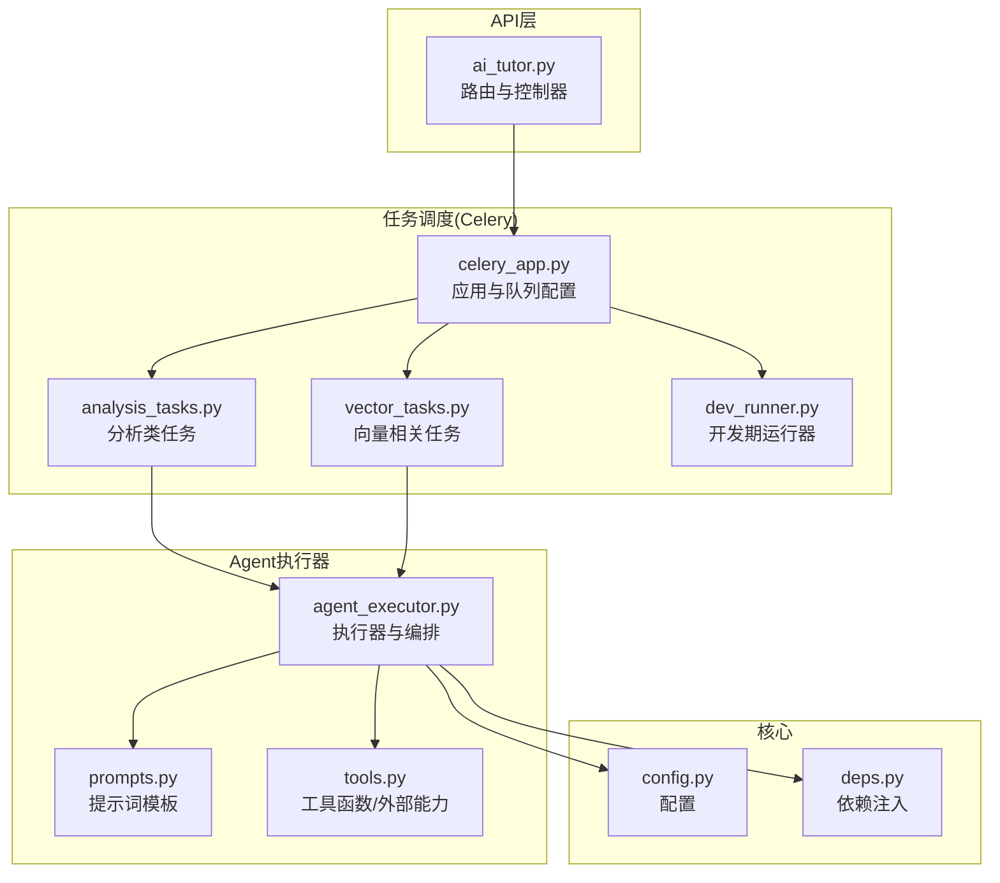
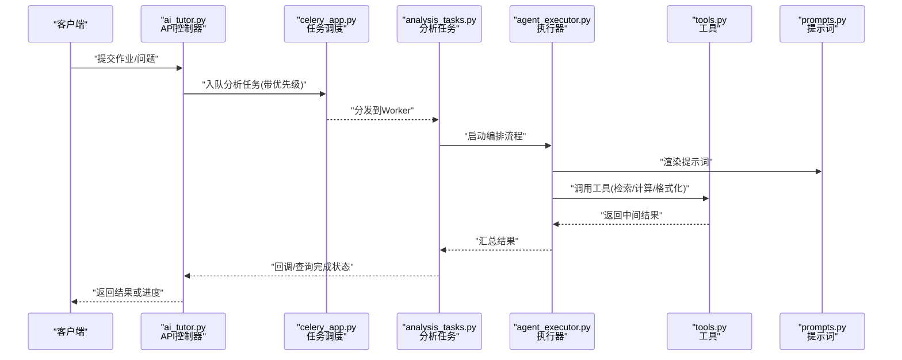
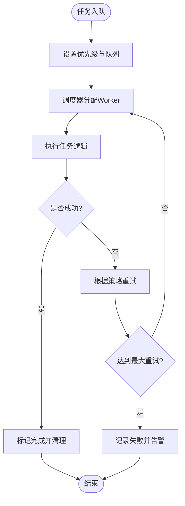
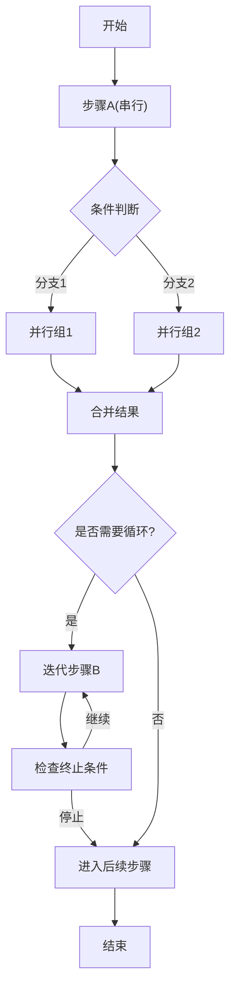
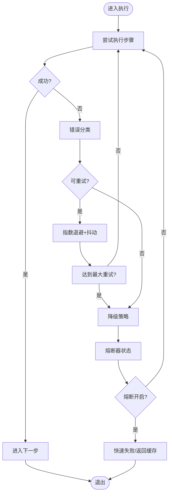
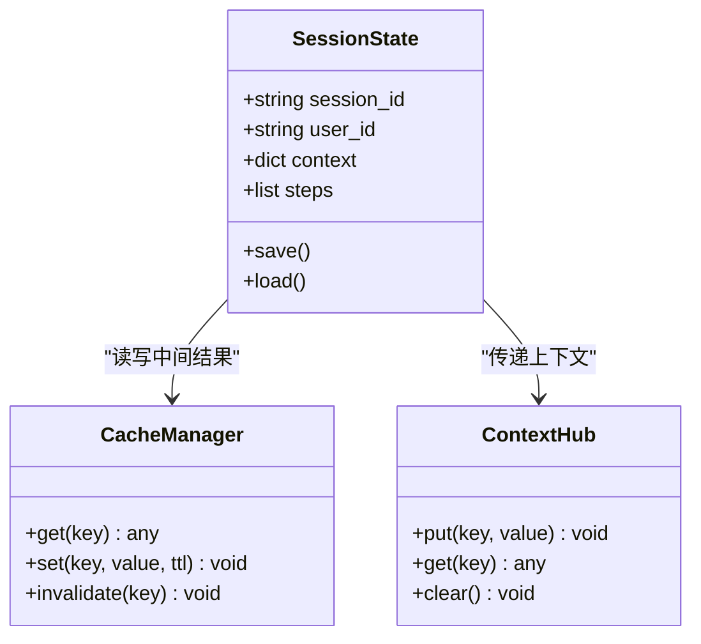
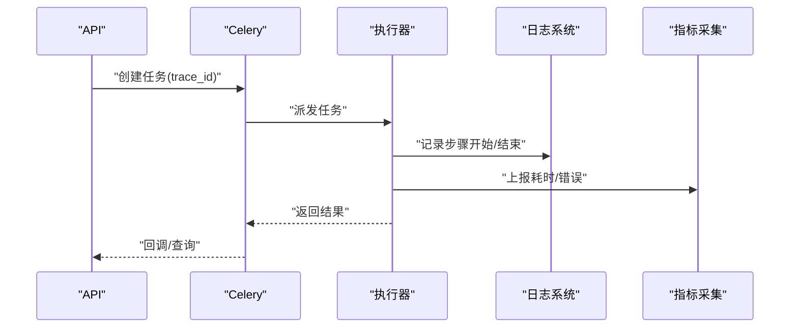
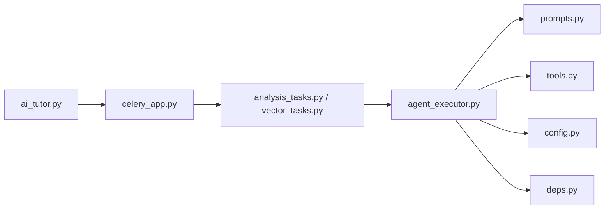

# Agent执行器

<cite>
**本文引用的文件**   
- [agent_executor.py](file://backend/app/services/agent/agent_executor.py)
- [prompts.py](file://backend/app/services/agent/prompts.py)
- [tools.py](file://backend/app/services/agent/tools.py)
- [celery_app.py](file://backend/app/tasks/celery_app.py)
- [analysis_tasks.py](file://backend/app/tasks/analysis_tasks.py)
- [vector_tasks.py](file://backend/app/tasks/vector_tasks.py)
- [dev_runner.py](file://backend/app/tasks/dev_runner.py)
- [ai_tutor.py](file://backend/app/api/v1/ai_tutor.py)
- [config.py](file://backend/app/core/config.py)
- [deps.py](file://backend/app/core/deps.py)
</cite>

## 目录
1. [简介](#简介)
2. [项目结构](#项目结构)
3. [核心组件](#核心组件)
4. [架构总览](#架构总览)
5. [详细组件分析](#详细组件分析)
6. [依赖关系分析](#依赖关系分析)
7. [性能考量](#性能考量)
8. [故障排查指南](#故障排查指南)
9. [结论](#结论)
10. [附录](#附录)

## 简介
本文件面向开发者，系统化阐述Agent执行器的任务调度、工作流编排、错误处理与恢复、状态管理以及性能监控与调试实践。内容覆盖：
- 任务队列管理与优先级排序
- 并发控制与资源隔离
- 串行执行、并行处理、条件分支与循环控制的工作流编排
- 异常捕获、重试机制、降级方案与熔断保护
- 会话状态持久化、上下文传递与中间结果缓存
- 执行追踪、性能分析与日志聚合
- 复杂AI工作流与多步骤任务的实现建议

## 项目结构
后端服务围绕FastAPI API层、Celery异步任务与Agent执行器展开。关键路径包括：
- API入口：接收用户请求并触发Agent工作流
- 任务调度：通过Celery将耗时任务入队，支持优先级与并发控制
- Agent执行器：编排工具调用、提示词生成、LLM交互与结果组装
- 配置与依赖注入：集中式配置与共享依赖（数据库、缓存、外部服务）

图表来源
- [ai_tutor.py](file://backend/app/api/v1/ai_tutor.py)
- [celery_app.py](file://backend/app/tasks/celery_app.py)
- [analysis_tasks.py](file://backend/app/tasks/analysis_tasks.py)
- [vector_tasks.py](file://backend/app/tasks/vector_tasks.py)
- [dev_runner.py](file://backend/app/tasks/dev_runner.py)
- [agent_executor.py](file://backend/app/services/agent/agent_executor.py)
- [prompts.py](file://backend/app/services/agent/prompts.py)
- [tools.py](file://backend/app/services/agent/tools.py)
- [config.py](file://backend/app/core/config.py)
- [deps.py](file://backend/app/core/deps.py)

章节来源
- [ai_tutor.py](file://backend/app/api/v1/ai_tutor.py)
- [celery_app.py](file://backend/app/tasks/celery_app.py)
- [agent_executor.py](file://backend/app/services/agent/agent_executor.py)
- [config.py](file://backend/app/core/config.py)
- [deps.py](file://backend/app/core/deps.py)

## 核心组件
- 任务调度器（Celery）
  - 负责将长耗时任务从HTTP请求中解耦，提供队列、优先级、并发与重试能力
  - 典型任务：分析任务、向量检索与索引更新等
- Agent执行器
  - 编排工具调用、提示词渲染、LLM交互与结果聚合
  - 支持串行/并行步骤、条件分支与循环控制
- 提示词与工具
  - 提示词模板用于统一输入输出格式
  - 工具封装外部能力（如检索、计算、格式化）
- 配置与依赖注入
  - 集中式配置项（模型、队列、缓存、限流等）
  - 依赖注入确保可测试性与可替换性

章节来源
- [celery_app.py](file://backend/app/tasks/celery_app.py)
- [analysis_tasks.py](file://backend/app/tasks/analysis_tasks.py)
- [vector_tasks.py](file://backend/app/tasks/vector_tasks.py)
- [agent_executor.py](file://backend/app/services/agent/agent_executor.py)
- [prompts.py](file://backend/app/services/agent/prompts.py)
- [tools.py](file://backend/app/services/agent/tools.py)
- [config.py](file://backend/app/core/config.py)
- [deps.py](file://backend/app/core/deps.py)

## 架构总览
下图展示从API到任务队列再到Agent执行器的端到端流程，体现任务入队、执行、编排与结果返回的关键路径。

图表来源
- [ai_tutor.py](file://backend/app/api/v1/ai_tutor.py)
- [celery_app.py](file://backend/app/tasks/celery_app.py)
- [analysis_tasks.py](file://backend/app/tasks/analysis_tasks.py)
- [agent_executor.py](file://backend/app/services/agent/agent_executor.py)
- [tools.py](file://backend/app/services/agent/tools.py)
- [prompts.py](file://backend/app/services/agent/prompts.py)

## 详细组件分析

### 任务调度机制（队列、优先级、并发）
- 队列管理
  - 使用Celery作为分布式任务队列，支持多队列与路由策略
  - 不同业务域的任务可分配到独立队列，避免相互阻塞
- 优先级排序
  - 通过任务装饰器参数设置优先级，高优先级任务优先消费
  - 结合队列权重与消费者数量进行流量整形
- 并发控制
  - Worker并发度由进程数与线程数共同决定
  - 针对I/O密集型任务（网络、数据库）提高并发；CPU密集型任务降低并发以避免争用
- 任务生命周期
  - 入队→调度→执行→成功/失败→重试/补偿→归档

图表来源
- [celery_app.py](file://backend/app/tasks/celery_app.py)
- [analysis_tasks.py](file://backend/app/tasks/analysis_tasks.py)

章节来源
- [celery_app.py](file://backend/app/tasks/celery_app.py)
- [analysis_tasks.py](file://backend/app/tasks/analysis_tasks.py)

### 工作流编排引擎（串行、并行、条件分支、循环）
- 串行执行
  - 按顺序依次执行步骤，前一步的输出作为下一步的输入
- 并行处理
  - 对无依赖的步骤并发执行，提升吞吐
  - 合并阶段收集所有子步骤结果
- 条件分支
  - 基于中间结果或外部信号选择不同分支
- 循环控制
  - 支持固定次数或条件终止的迭代
  - 每轮迭代可缓存中间结果，避免重复计算

图表来源
- [agent_executor.py](file://backend/app/services/agent/agent_executor.py)

章节来源
- [agent_executor.py](file://backend/app/services/agent/agent_executor.py)

### 错误处理与恢复策略（异常捕获、重试、降级、熔断）
- 异常捕获
  - 在任务与执行器层面统一捕获异常，分类记录（网络、超时、校验、业务）
- 重试机制
  - 指数退避与抖动策略，限制最大重试次数
  - 区分可重试与不可重试错误
- 降级方案
  - 当外部依赖不可用时，返回缓存结果或简化版答案
  - 切换至轻量模型或本地规则引擎
- 熔断保护
  - 对频繁失败的下游服务快速失败，避免雪崩
  - 半开探测逐步恢复流量

图表来源
- [agent_executor.py](file://backend/app/services/agent/agent_executor.py)
- [analysis_tasks.py](file://backend/app/tasks/analysis_tasks.py)

章节来源
- [agent_executor.py](file://backend/app/services/agent/agent_executor.py)
- [analysis_tasks.py](file://backend/app/tasks/analysis_tasks.py)

### 状态管理机制（会话持久化、上下文传递、中间结果缓存）
- 会话状态持久化
  - 将会话ID、用户信息、任务ID与执行进度持久化，便于断点续跑与回溯
- 上下文传递
  - 跨步骤传递结构化上下文（输入摘要、中间结果、元数据）
- 中间结果缓存
  - 对昂贵计算或外部调用结果进行缓存，减少重复开销
  - 缓存键包含输入指纹与版本，保证一致性

图表来源
- [agent_executor.py](file://backend/app/services/agent/agent_executor.py)

章节来源
- [agent_executor.py](file://backend/app/services/agent/agent_executor.py)

### 执行追踪、性能分析与日志聚合
- 执行追踪
  - 为每个任务与工作流步骤生成唯一trace_id，贯穿API→任务→执行器→工具链
- 性能分析
  - 采集关键指标：入队延迟、执行时长、重试次数、错误率、缓存命中率
- 日志聚合
  - 结构化日志输出，包含时间戳、级别、trace_id、步骤名、耗时
  - 集中存储与检索，支持按会话/任务维度过滤

图表来源
- [celery_app.py](file://backend/app/tasks/celery_app.py)
- [agent_executor.py](file://backend/app/services/agent/agent_executor.py)

章节来源
- [celery_app.py](file://backend/app/tasks/celery_app.py)
- [agent_executor.py](file://backend/app/services/agent/agent_executor.py)

### 面向开发者的工作流设计与实现指南
- 设计原则
  - 明确输入输出契约，保持步骤幂等
  - 将外部依赖抽象为工具接口，便于替换与测试
  - 合理拆分步骤粒度，平衡并行度与复杂度
- 实现要点
  - 使用统一的提示词模板，确保一致性与可维护性
  - 为关键步骤添加重试与降级，保障鲁棒性
  - 利用缓存与中间结果减少重复计算
- 最佳实践
  - 为每个工作流定义清晰的版本与变更日志
  - 引入灰度发布与A/B测试，逐步放量
  - 建立完善的监控与告警体系

章节来源
- [prompts.py](file://backend/app/services/agent/prompts.py)
- [tools.py](file://backend/app/services/agent/tools.py)
- [agent_executor.py](file://backend/app/services/agent/agent_executor.py)

## 依赖关系分析
- 组件耦合
  - API层仅依赖任务调度器，不直接持有执行器实例，松耦合
  - 执行器依赖提示词与工具模块，可通过依赖注入替换实现
- 外部依赖
  - Celery与消息代理（如Redis/RabbitMQ）
  - LLM服务、向量检索、缓存与数据库
- 潜在风险
  - 循环依赖需避免
  - 外部服务不稳定时需加强熔断与降级

图表来源
- [ai_tutor.py](file://backend/app/api/v1/ai_tutor.py)
- [celery_app.py](file://backend/app/tasks/celery_app.py)
- [analysis_tasks.py](file://backend/app/tasks/analysis_tasks.py)
- [vector_tasks.py](file://backend/app/tasks/vector_tasks.py)
- [agent_executor.py](file://backend/app/services/agent/agent_executor.py)
- [prompts.py](file://backend/app/services/agent/prompts.py)
- [tools.py](file://backend/app/services/agent/tools.py)
- [config.py](file://backend/app/core/config.py)
- [deps.py](file://backend/app/core/deps.py)

章节来源
- [ai_tutor.py](file://backend/app/api/v1/ai_tutor.py)
- [celery_app.py](file://backend/app/tasks/celery_app.py)
- [agent_executor.py](file://backend/app/services/agent/agent_executor.py)

## 性能考量
- 队列与并发
  - 根据任务类型调整Worker并发度，I/O密集可提高并发，CPU密集需谨慎
  - 使用多队列隔离热点任务，避免冷任务影响热路径
- 缓存与去重
  - 对相同输入的结果进行缓存，设置合理的TTL与失效策略
  - 对大对象采用分块与增量更新
- 资源隔离
  - 将重型任务放入专用Worker池，避免资源争用
- 观测与调优
  - 关注P95/P99延迟、错误率与资源利用率
  - 通过压测定位瓶颈，逐步优化

[本节为通用指导，无需特定文件引用]

## 故障排查指南
- 常见问题
  - 任务堆积：检查Worker数量与队列容量，确认是否有慢任务阻塞
  - 重试风暴：检查重试策略与退避参数，避免雪崩
  - 熔断误开：查看下游服务健康度与阈值配置
- 定位方法
  - 通过trace_id串联日志与指标，定位具体步骤
  - 对比正常与异常用例的输入差异，缩小范围
- 恢复措施
  - 临时扩容Worker，清理积压任务
  - 启用降级模式，保障核心功能可用

章节来源
- [celery_app.py](file://backend/app/tasks/celery_app.py)
- [agent_executor.py](file://backend/app/services/agent/agent_executor.py)

## 结论
本执行器以Celery为核心构建高可靠的任务调度体系，配合灵活的编排引擎与完善的错误恢复策略，能够支撑复杂的AI工作流与多步骤任务。通过状态管理、缓存与追踪观测，系统在性能与可维护性方面具备良好基础。建议在持续演进中强化监控告警、灰度发布与自动化测试，进一步提升稳定性与交付效率。

[本节为总结性内容，无需特定文件引用]

## 附录
- 术语表
  - 工作流：由多个步骤组成的有向图，描述任务执行顺序与依赖
  - 熔断：在检测到频繁失败时快速失败，防止级联故障
  - 降级：在依赖不可用时提供简化或替代方案
- 参考路径
  - 任务定义与调度：[celery_app.py](file://backend/app/tasks/celery_app.py)、[analysis_tasks.py](file://backend/app/tasks/analysis_tasks.py)、[vector_tasks.py](file://backend/app/tasks/vector_tasks.py)
  - 执行器与编排：[agent_executor.py](file://backend/app/services/agent/agent_executor.py)
  - 提示词与工具：[prompts.py](file://backend/app/services/agent/prompts.py)、[tools.py](file://backend/app/services/agent/tools.py)
  - 配置与依赖：[config.py](file://backend/app/core/config.py)、[deps.py](file://backend/app/core/deps.py)
  - API入口：[ai_tutor.py](file://backend/app/api/v1/ai_tutor.py)