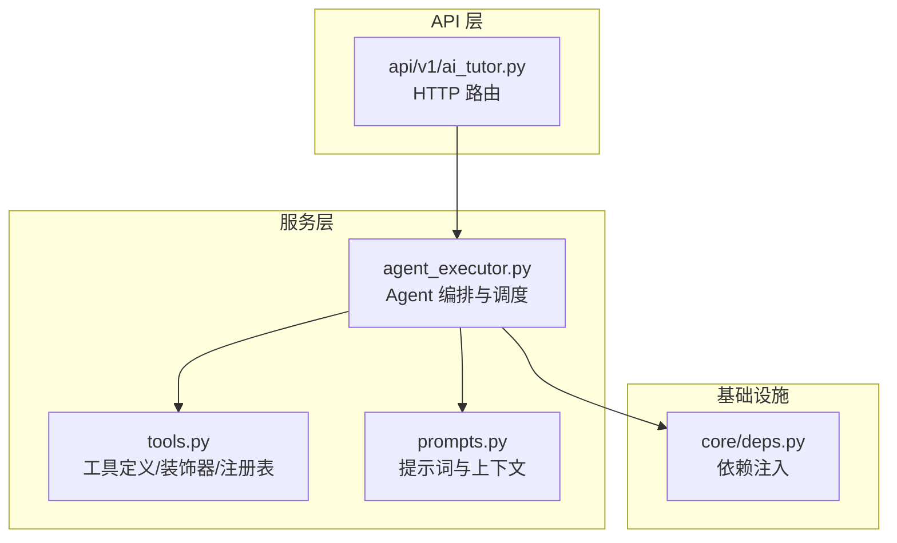
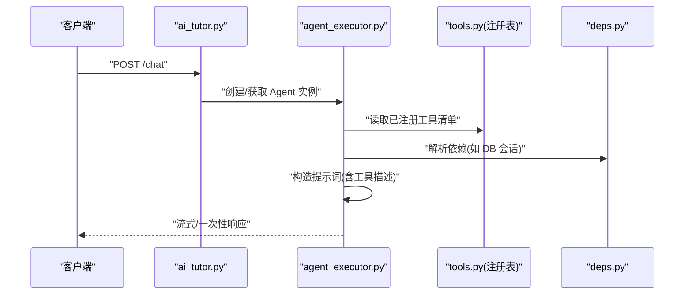
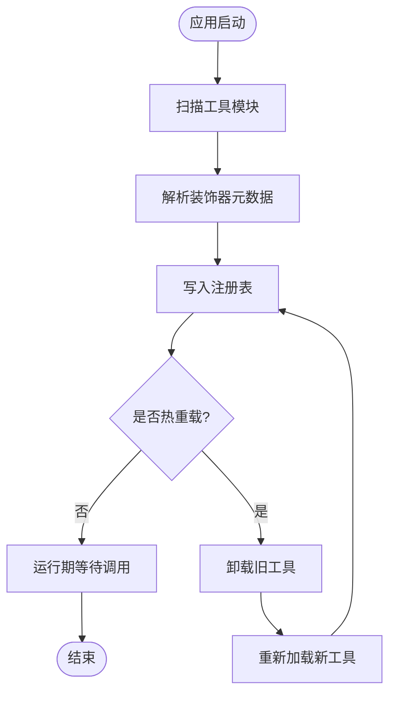
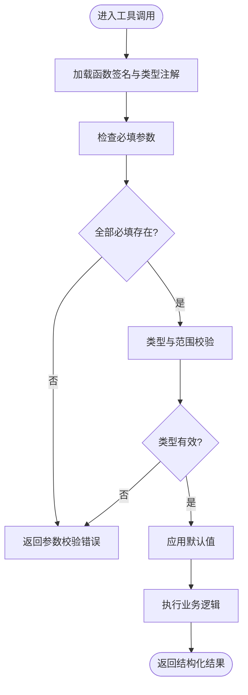
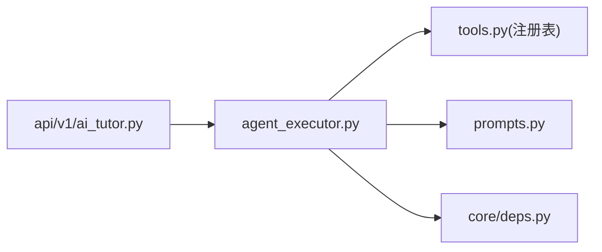

# 工具注册机制

<cite>
**本文引用的文件**   
- [backend/app/services/agent/tools.py](file://backend/app/services/agent/tools.py)
- [backend/app/services/agent/agent_executor.py](file://backend/app/services/agent/agent_executor.py)
- [backend/app/services/agent/prompts.py](file://backend/app/services/agent/prompts.py)
- [backend/app/api/v1/ai_tutor.py](file://backend/app/api/v1/ai_tutor.py)
- [backend/app/core/deps.py](file://backend/app/core/deps.py)
</cite>

## 目录
1. [简介](#简介)
2. [项目结构](#项目结构)
3. [核心组件](#核心组件)
4. [架构总览](#架构总览)
5. [详细组件分析](#详细组件分析)
6. [依赖关系分析](#依赖关系分析)
7. [性能考虑](#性能考虑)
8. [故障排查指南](#故障排查指南)
9. [结论](#结论)
10. [附录](#附录)

## 简介
本文件面向开发者，系统化说明本项目中“AI 工具”的注册与使用机制。内容覆盖：
- 工具接口定义规范（函数签名约定、参数类型验证、返回值格式处理）
- 工具装饰器使用方法（@tool 配置选项、元数据定义、依赖注入）
- 工具生命周期管理（发现、注册、卸载）
- 工具参数验证机制（类型检查、必填字段、默认值）
- 自定义工具开发指南（错误处理、日志记录、性能监控最佳实践）
- 可扩展的工具架构与插件化系统设计建议

## 项目结构
与工具注册机制相关的后端代码主要位于 services/agent 子模块，并在 API 层通过路由暴露给前端调用。关键文件如下：
- tools.py：工具定义、装饰器、注册表与执行入口
- agent_executor.py：Agent 编排与工具调度
- prompts.py：提示词模板与上下文组装
- ai_tutor.py：API 路由，接收请求并驱动 Agent 执行
- deps.py：依赖注入容器（数据库会话等）

图表来源
- [backend/app/services/agent/tools.py](file://backend/app/services/agent/tools.py)
- [backend/app/services/agent/agent_executor.py](file://backend/app/services/agent/agent_executor.py)
- [backend/app/services/agent/prompts.py](file://backend/app/services/agent/prompts.py)
- [backend/app/api/v1/ai_tutor.py](file://backend/app/api/v1/ai_tutor.py)
- [backend/app/core/deps.py](file://backend/app/core/deps.py)

章节来源
- [backend/app/services/agent/tools.py](file://backend/app/services/agent/tools.py)
- [backend/app/services/agent/agent_executor.py](file://backend/app/services/agent/agent_executor.py)
- [backend/app/services/agent/prompts.py](file://backend/app/services/agent/prompts.py)
- [backend/app/api/v1/ai_tutor.py](file://backend/app/api/v1/ai_tutor.py)
- [backend/app/core/deps.py](file://backend/app/core/deps.py)

## 核心组件
- 工具装饰器与注册表
  - 提供 @tool 装饰器用于声明式定义工具，自动收集到全局注册表
  - 支持为工具附加元数据（名称、描述、版本、权限等），便于发现与展示
  - 支持在装饰器或类方法上声明依赖项，由依赖注入容器解析
- 工具执行器
  - 根据 Agent 指令选择并调用具体工具
  - 负责参数校验、异常捕获、结果序列化与回传
- 提示词与上下文
  - 将可用工具列表与描述注入到系统提示词，指导模型正确选择工具
- API 路由
  - 接收用户请求，构建对话上下文，驱动 Agent 执行并返回流式或一次性响应

章节来源
- [backend/app/services/agent/tools.py](file://backend/app/services/agent/tools.py)
- [backend/app/services/agent/agent_executor.py](file://backend/app/services/agent/agent_executor.py)
- [backend/app/services/agent/prompts.py](file://backend/app/services/agent/prompts.py)
- [backend/app/api/v1/ai_tutor.py](file://backend/app/api/v1/ai_tutor.py)

## 架构总览
下图展示了从 HTTP 请求到工具执行的端到端流程，以及工具注册表在其中的作用。

图表来源
- [backend/app/api/v1/ai_tutor.py](file://backend/app/api/v1/ai_tutor.py)
- [backend/app/services/agent/agent_executor.py](file://backend/app/services/agent/agent_executor.py)
- [backend/app/services/agent/tools.py](file://backend/app/services/agent/tools.py)
- [backend/app/core/deps.py](file://backend/app/core/deps.py)

## 详细组件分析

### 工具接口定义规范
- 函数签名约定
  - 所有工具函数应遵循统一的命名与参数风格，便于反射与文档生成
  - 推荐显式标注参数类型与可选默认值，以支撑后续的类型校验
- 参数类型验证
  - 基于函数签名与类型注解进行静态推断
  - 运行时对输入参数进行二次校验，确保类型、范围、必填性满足约束
- 返回值格式处理
  - 统一包装为结构化响应（包含状态码、消息、数据体）
  - 支持流式输出时按块返回，非流式时聚合后返回

章节来源
- [backend/app/services/agent/tools.py](file://backend/app/services/agent/tools.py)
- [backend/app/services/agent/agent_executor.py](file://backend/app/services/agent/agent_executor.py)

### 工具装饰器使用方法
- @tool 装饰器配置选项
  - 名称与描述：用于提示词注入与 UI 展示
  - 版本与标签：用于兼容性与分类
  - 权限控制：限制特定角色或场景下可用
- 元数据定义
  - 通过装饰器参数或类属性声明工具的元信息
  - 元数据可被注册表持久化，供管理面板查询
- 依赖注入
  - 在装饰器或类方法上声明依赖项（如数据库会话、外部服务）
  - 由依赖注入容器在工具实例化或调用前完成装配

章节来源
- [backend/app/services/agent/tools.py](file://backend/app/services/agent/tools.py)
- [backend/app/core/deps.py](file://backend/app/core/deps.py)

### 工具生命周期管理
- 发现
  - 启动时扫描工具模块，收集带装饰器的函数/方法
  - 解析装饰器元数据，构建工具清单
- 注册
  - 将工具加入全局注册表，建立名称到可调用的映射
  - 预解析依赖项，缓存可复用资源
- 卸载
  - 提供注销接口，移除工具并释放相关资源
  - 支持热重载场景下的增量更新

图表来源
- [backend/app/services/agent/tools.py](file://backend/app/services/agent/tools.py)

章节来源
- [backend/app/services/agent/tools.py](file://backend/app/services/agent/tools.py)

### 工具参数验证机制
- 类型检查
  - 基于类型注解进行静态推断，结合运行时校验提升健壮性
- 必填字段验证
  - 无默认值的参数视为必填；缺失则返回明确的参数错误
- 默认值处理
  - 有默认值的参数允许省略；未传入时使用默认值
- 校验失败处理
  - 统一转换为参数校验错误，附带字段级错误信息

图表来源
- [backend/app/services/agent/tools.py](file://backend/app/services/agent/tools.py)
- [backend/app/services/agent/agent_executor.py](file://backend/app/services/agent/agent_executor.py)

章节来源
- [backend/app/services/agent/tools.py](file://backend/app/services/agent/tools.py)
- [backend/app/services/agent/agent_executor.py](file://backend/app/services/agent/agent_executor.py)

### 自定义工具开发指南
- 开发步骤
  - 在工具模块中定义函数或使用类方法，并用 @tool 装饰器声明
  - 明确参数类型与默认值，编写清晰的描述文本
  - 如需外部资源，通过依赖注入声明
- 错误处理
  - 业务异常转换为标准错误响应，避免泄露内部细节
  - 区分参数错误、权限错误、系统错误，便于前端差异化提示
- 日志记录
  - 记录关键路径与耗时，避免记录敏感信息
  - 为每个工具调用生成唯一追踪 ID，便于链路追踪
- 性能监控
  - 统计调用次数、成功率、P95/P99 延迟
  - 对慢调用进行告警与采样日志

章节来源
- [backend/app/services/agent/tools.py](file://backend/app/services/agent/tools.py)
- [backend/app/services/agent/agent_executor.py](file://backend/app/services/agent/agent_executor.py)

### 可扩展的工具架构与插件化系统
- 模块化组织
  - 按领域划分工具模块，降低耦合度
  - 通过包导入或配置文件动态加载
- 插件化设计
  - 定义插件接口与生命周期钩子（初始化、销毁）
  - 支持插件启用/禁用与版本兼容策略
- 扩展点
  - 注册表扩展：支持多源注册（本地、远程）
  - 校验器扩展：可插拔的参数校验规则
  - 鉴权扩展：可插拔的权限策略

[本节为概念性说明，不直接分析具体文件]

## 依赖关系分析
- 组件耦合
  - API 层仅依赖执行器，不直接感知工具实现，保持松耦合
  - 执行器依赖注册表与提示词模块，职责清晰
  - 工具模块通过装饰器与注册表解耦，新增工具无需改动核心逻辑
- 外部依赖
  - 依赖注入容器提供数据库会话等共享资源
  - 提示词模板与工具描述共同影响模型行为

图表来源
- [backend/app/api/v1/ai_tutor.py](file://backend/app/api/v1/ai_tutor.py)
- [backend/app/services/agent/agent_executor.py](file://backend/app/services/agent/agent_executor.py)
- [backend/app/services/agent/tools.py](file://backend/app/services/agent/tools.py)
- [backend/app/services/agent/prompts.py](file://backend/app/services/agent/prompts.py)
- [backend/app/core/deps.py](file://backend/app/core/deps.py)

章节来源
- [backend/app/api/v1/ai_tutor.py](file://backend/app/api/v1/ai_tutor.py)
- [backend/app/services/agent/agent_executor.py](file://backend/app/services/agent/agent_executor.py)
- [backend/app/services/agent/tools.py](file://backend/app/services/agent/tools.py)
- [backend/app/services/agent/prompts.py](file://backend/app/services/agent/prompts.py)
- [backend/app/core/deps.py](file://backend/app/core/deps.py)

## 性能考虑
- 注册阶段
  - 工具扫描与元数据解析应在启动时完成，避免运行时开销
- 执行阶段
  - 参数校验尽量前置，减少无效调用
  - 对 I/O 密集型工具采用异步或连接池优化
- 监控与限流
  - 为工具调用增加指标采集与熔断保护
  - 对高频工具实施速率限制与缓存策略

[本节提供通用指导，不直接分析具体文件]

## 故障排查指南
- 常见问题
  - 工具未注册：检查装饰器是否正确、模块是否被扫描
  - 参数校验失败：核对类型注解与默认值设置
  - 依赖注入失败：确认依赖项已在容器中注册
- 定位手段
  - 开启调试日志，查看工具调用链路与错误堆栈
  - 使用追踪 ID 关联一次调用的完整日志
- 恢复策略
  - 参数错误：返回字段级错误信息，引导修正
  - 系统错误：降级返回友好提示，并触发告警

章节来源
- [backend/app/services/agent/tools.py](file://backend/app/services/agent/tools.py)
- [backend/app/services/agent/agent_executor.py](file://backend/app/services/agent/agent_executor.py)

## 结论
通过装饰器与注册表机制，本项目实现了声明式、可扩展的工具体系。配合严格的参数校验与统一的错误处理，提升了系统的稳定性与可维护性。建议在后续迭代中进一步完善插件化能力与性能监控，以满足更大规模的工具生态需求。

## 附录
- 术语
  - 工具：对外暴露的可调用能力，通常封装业务逻辑
  - 注册表：维护工具名称到实现的映射
  - 依赖注入：在运行时为工具装配所需的外部资源
- 参考文件
  - 工具定义与注册：[backend/app/services/agent/tools.py](file://backend/app/services/agent/tools.py)
  - 执行与调度：[backend/app/services/agent/agent_executor.py](file://backend/app/services/agent/agent_executor.py)
  - 提示词与上下文：[backend/app/services/agent/prompts.py](file://backend/app/services/agent/prompts.py)
  - API 路由：[backend/app/api/v1/ai_tutor.py](file://backend/app/api/v1/ai_tutor.py)
  - 依赖注入：[backend/app/core/deps.py](file://backend/app/core/deps.py)