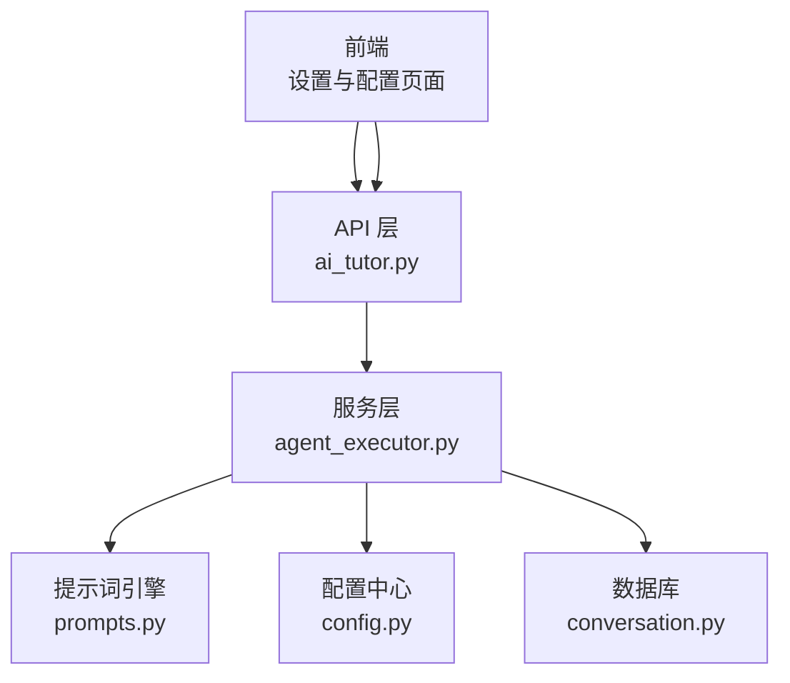
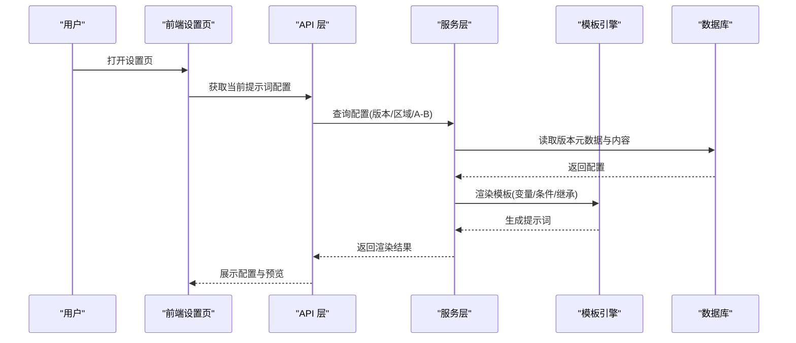
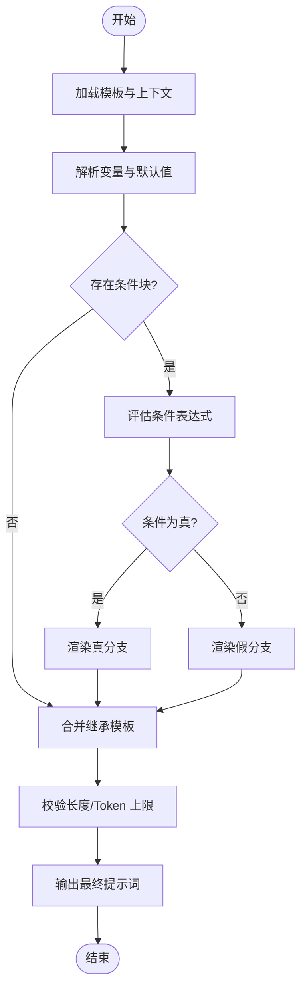
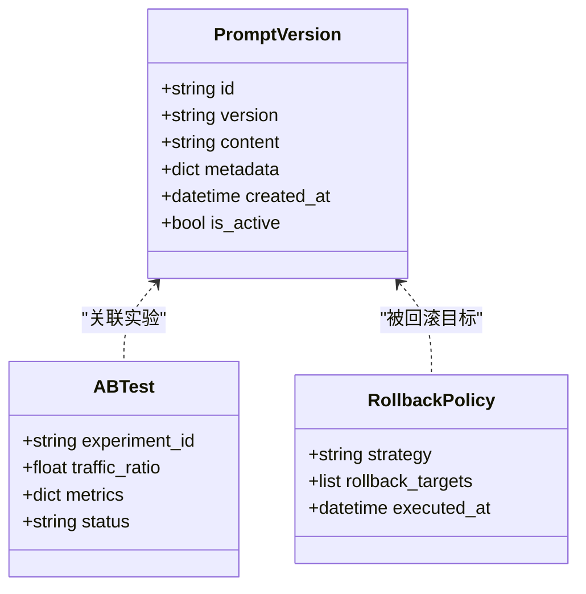
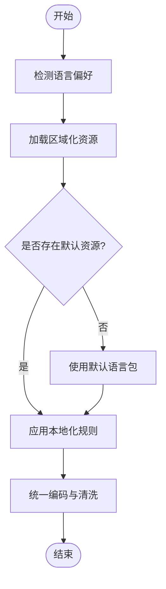
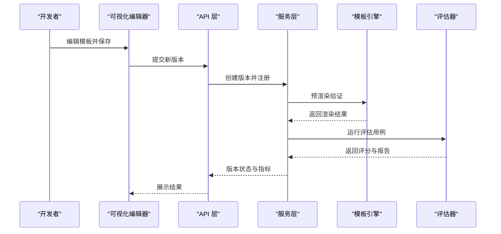
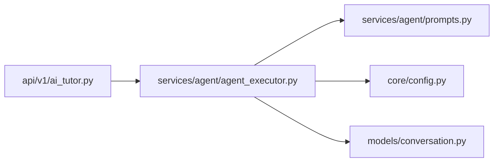

# 提示词工程系统

<cite>
**本文引用的文件**   
- [backend/app/services/agent/prompts.py](file://backend/app/services/agent/prompts.py)
- [backend/app/services/agent/agent_executor.py](file://backend/app/services/agent/agent_executor.py)
- [backend/app/api/v1/ai_tutor.py](file://backend/app/api/v1/ai_tutor.py)
- [backend/app/core/config.py](file://backend/app/core/config.py)
- [backend/app/models/conversation.py](file://backend/app/models/conversation.py)
- [frontend/src/pages/Settings/PersonalityConfig.tsx](file://frontend/src/pages/Settings/PersonalityConfig.tsx)
- [AI助教agent.md](file://AI助教agent.md)
</cite>

## 目录
1. [引言](#引言)
2. [项目结构](#项目结构)
3. [核心组件](#核心组件)
4. [架构总览](#架构总览)
5. [详细组件分析](#详细组件分析)
6. [依赖关系分析](#依赖关系分析)
7. [性能与成本优化](#性能与成本优化)
8. [故障排查指南](#故障排查指南)
9. [结论](#结论)
10. [附录](#附录)

## 引言
本文件面向开发者，系统化阐述“提示词工程系统”的设计与实践。围绕动态提示词模板引擎、版本管理、优化方法、多语言支持以及调试测试工具，提供从架构到落地的完整说明，帮助构建可维护、可扩展且可控的提示词管理系统。

## 项目结构
后端采用分层架构：API 层暴露接口，服务层封装业务逻辑，Agent 子模块负责提示词编排与执行；前端提供配置与管理界面。关键路径包括：
- API 路由：接收请求并调用服务层
- 服务层：组合提示词、上下文、模型参数等，驱动 Agent 执行
- Agent 层：加载模板、渲染变量、条件分支、继承合并、版本选择
- 配置中心：集中管理模型、区域化、缓存、限流等
- 数据持久化：会话、评测指标、版本元数据等

图表来源
- [backend/app/api/v1/ai_tutor.py](file://backend/app/api/v1/ai_tutor.py)
- [backend/app/services/agent/agent_executor.py](file://backend/app/services/agent/agent_executor.py)
- [backend/app/services/agent/prompts.py](file://backend/app/services/agent/prompts.py)
- [backend/app/core/config.py](file://backend/app/core/config.py)
- [backend/app/models/conversation.py](file://backend/app/models/conversation.py)

章节来源
- [backend/app/api/v1/ai_tutor.py](file://backend/app/api/v1/ai_tutor.py)
- [backend/app/services/agent/agent_executor.py](file://backend/app/services/agent/agent_executor.py)
- [backend/app/services/agent/prompts.py](file://backend/app/services/agent/prompts.py)
- [backend/app/core/config.py](file://backend/app/core/config.py)
- [backend/app/models/conversation.py](file://backend/app/models/conversation.py)

## 核心组件
- 动态提示词模板引擎
  - 变量替换语法：支持占位符注入、默认值、类型转换、安全校验
  - 条件渲染逻辑：基于上下文字段或外部开关进行分支输出
  - 模板继承机制：基础模板 + 场景覆盖 + 运行时合并
- 提示词版本管理
  - 版本控制：语义化版本、变更日志、灰度发布
  - 回滚策略：快速切回稳定版、按会话/用户维度回滚
  - A/B 测试：流量分流、指标采集、显著性评估
- 提示词优化
  - 上下文窗口管理：裁剪历史、摘要压缩、优先级排序
  - Token 计数：估算与上限保护、分段调用
  - 成本优化：缓存命中、批量处理、降级策略
- 多语言支持
  - 国际化配置：键值映射、区域化资源
  - 字符编码处理：统一 UTF-8、转义与清洗
  - 文化适配：语气、称谓、示例本地化
- 调试与测试
  - 可视化编辑器：在线编辑、预览、对比差异
  - 效果评估：质量打分、一致性、鲁棒性
  - 性能分析：延迟、吞吐、Token 消耗

章节来源
- [backend/app/services/agent/prompts.py](file://backend/app/services/agent/prompts.py)
- [backend/app/services/agent/agent_executor.py](file://backend/app/services/agent/agent_executor.py)
- [backend/app/core/config.py](file://backend/app/core/config.py)
- [AI助教agent.md](file://AI助教agent.md)

## 架构总览
整体流程：前端通过设置页提交提示词配置（含版本、区域化、A/B 标签），API 层转发至服务层，服务层根据配置选择模板版本，由模板引擎完成变量替换、条件渲染与继承合并，最终生成提示词并交由模型执行。结果与指标写入数据库，供后续分析与回滚使用。

图表来源
- [backend/app/api/v1/ai_tutor.py](file://backend/app/api/v1/ai_tutor.py)
- [backend/app/services/agent/agent_executor.py](file://backend/app/services/agent/agent_executor.py)
- [backend/app/services/agent/prompts.py](file://backend/app/services/agent/prompts.py)
- [backend/app/models/conversation.py](file://backend/app/models/conversation.py)

## 详细组件分析

### 动态提示词模板引擎
- 变量替换语法
  - 占位符注入：在模板中声明变量名，运行时从上下文注入
  - 默认值与安全：缺失变量时回退默认值，并对敏感信息进行脱敏
  - 类型与格式化：数字、日期、列表等类型的自动格式化
- 条件渲染逻辑
  - 基于上下文字段判断是否渲染某段文本
  - 基于外部开关（如功能特性、用户等级）切换不同段落
- 模板继承机制
  - 定义基础模板，场景模板仅覆盖差异部分
  - 运行时按优先级合并，避免重复定义

图表来源
- [backend/app/services/agent/prompts.py](file://backend/app/services/agent/prompts.py)

章节来源
- [backend/app/services/agent/prompts.py](file://backend/app/services/agent/prompts.py)

### 提示词版本管理与 A/B 测试
- 版本控制
  - 语义化版本：主版本（不兼容变更）、次版本（新增能力）、修订（修复问题）
  - 变更日志：记录每次变更的原因、影响范围、回滚建议
- 回滚策略
  - 一键回滚：将流量切回上一稳定版本
  - 细粒度回滚：按会话、用户、租户维度回滚
- A/B 测试
  - 流量分配：按比例或规则分流
  - 指标采集：质量评分、用户反馈、成本与延迟
  - 决策依据：统计显著性与业务阈值

图表来源
- [backend/app/models/conversation.py](file://backend/app/models/conversation.py)
- [backend/app/core/config.py](file://backend/app/core/config.py)

章节来源
- [backend/app/core/config.py](file://backend/app/core/config.py)
- [backend/app/models/conversation.py](file://backend/app/models/conversation.py)

### 多语言提示词支持
- 国际化配置
  - 键值映射：以键为中心，按区域加载对应文案
  - 动态选择：根据用户偏好或会话上下文选择语言
- 字符编码处理
  - 统一 UTF-8：输入输出均强制 UTF-8，避免乱码
  - 清洗与转义：过滤不可见字符、HTML 转义
- 文化适配
  - 语气与称谓：根据地区调整表达风格
  - 示例与格式：日期、货币、单位本地化

图表来源
- [backend/app/core/config.py](file://backend/app/core/config.py)

章节来源
- [backend/app/core/config.py](file://backend/app/core/config.py)

### 调试与测试工具
- 可视化编辑器
  - 在线编辑：实时预览、差异对比、语法高亮
  - 版本对比：并排查看变更点与影响范围
- 效果评估
  - 质量打分：基于规则与模型评分的多维指标
  - 回归测试：用例集自动化执行与报告
- 性能分析
  - 延迟与吞吐：P95/P99 延迟、QPS
  - Token 消耗：按版本与任务类型统计

图表来源
- [backend/app/api/v1/ai_tutor.py](file://backend/app/api/v1/ai_tutor.py)
- [backend/app/services/agent/agent_executor.py](file://backend/app/services/agent/agent_executor.py)
- [backend/app/services/agent/prompts.py](file://backend/app/services/agent/prompts.py)

章节来源
- [frontend/src/pages/Settings/PersonalityConfig.tsx](file://frontend/src/pages/Settings/PersonalityConfig.tsx)
- [backend/app/api/v1/ai_tutor.py](file://backend/app/api/v1/ai_tutor.py)
- [backend/app/services/agent/agent_executor.py](file://backend/app/services/agent/agent_executor.py)
- [backend/app/services/agent/prompts.py](file://backend/app/services/agent/prompts.py)

## 依赖关系分析
- 组件耦合
  - API 层与服务层松耦合，通过明确接口契约交互
  - 服务层对模板引擎与配置中心有强依赖
- 外部依赖
  - 数据库用于存储版本元数据与指标
  - 配置中心提供运行时参数与区域化资源
- 潜在风险
  - 模板引擎与执行器的紧耦合可能导致扩展困难
  - 版本与 A/B 配置需保证一致性与幂等

图表来源
- [backend/app/api/v1/ai_tutor.py](file://backend/app/api/v1/ai_tutor.py)
- [backend/app/services/agent/agent_executor.py](file://backend/app/services/agent/agent_executor.py)
- [backend/app/services/agent/prompts.py](file://backend/app/services/agent/prompts.py)
- [backend/app/core/config.py](file://backend/app/core/config.py)
- [backend/app/models/conversation.py](file://backend/app/models/conversation.py)

章节来源
- [backend/app/api/v1/ai_tutor.py](file://backend/app/api/v1/ai_tutor.py)
- [backend/app/services/agent/agent_executor.py](file://backend/app/services/agent/agent_executor.py)
- [backend/app/services/agent/prompts.py](file://backend/app/services/agent/prompts.py)
- [backend/app/core/config.py](file://backend/app/core/config.py)
- [backend/app/models/conversation.py](file://backend/app/models/conversation.py)

## 性能与成本优化
- 上下文窗口管理
  - 历史裁剪：保留关键对话片段，丢弃冗余
  - 摘要压缩：对长上下文生成结构化摘要
  - 优先级排序：按相关性、时效性、重要性排序
- Token 计数与上限保护
  - 预估 Token：在渲染阶段估算，超过阈值触发降级
  - 分段调用：拆分为多次小请求，降低单次成本
- 成本优化技巧
  - 缓存命中：相同模板+上下文复用结果
  - 批量处理：合并相似请求，减少模型调用次数
  - 降级策略：复杂模板失败时回退到轻量模板

[本节为通用指导，无需特定文件引用]

## 故障排查指南
- 常见问题定位
  - 变量未注入：检查上下文键名与模板占位符一致性
  - 条件分支异常：确认布尔表达式与外部开关状态
  - 继承冲突：核对模板覆盖顺序与命名空间
- 日志与追踪
  - 记录模板版本、渲染耗时、Token 用量
  - 关联会话 ID，便于端到端回溯
- 回滚与恢复
  - 快速切回上一稳定版本
  - 针对异常会话单独回滚，不影响全局

章节来源
- [backend/app/services/agent/prompts.py](file://backend/app/services/agent/prompts.py)
- [backend/app/services/agent/agent_executor.py](file://backend/app/services/agent/agent_executor.py)

## 结论
通过模块化设计、严格的版本管理与完善的调试测试体系，提示词工程系统能够在保证质量的同时实现高效迭代与成本控制。建议在团队内建立模板规范、评审流程与监控告警，持续提升系统的稳定性与可维护性。

[本节为总结性内容，无需特定文件引用]

## 附录
- 最佳实践清单
  - 模板命名与版本规范
  - 变量注入白名单与脱敏策略
  - A/B 实验设计与指标定义
  - 多语言资源治理与更新节奏
- 参考文档
  - AI 助教 Agent 设计要点与流程说明

章节来源
- [AI助教agent.md](file://AI助教agent.md)