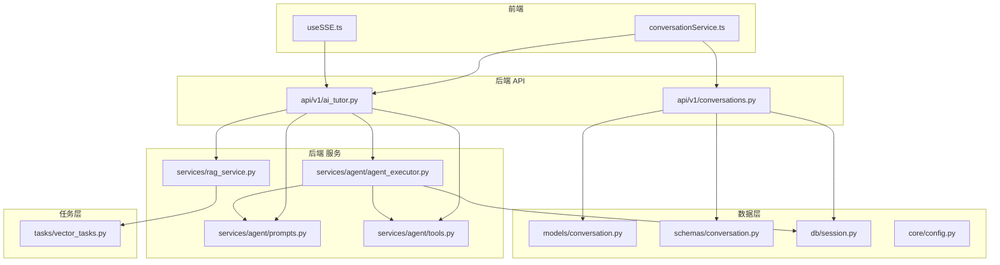
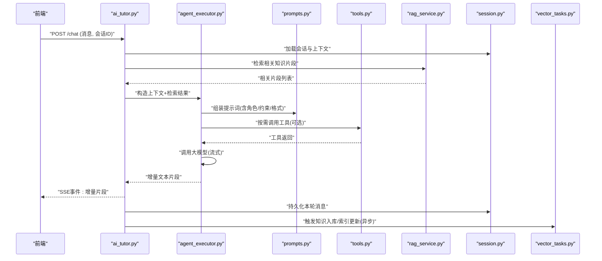
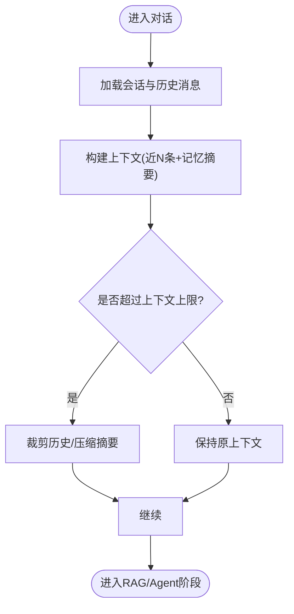
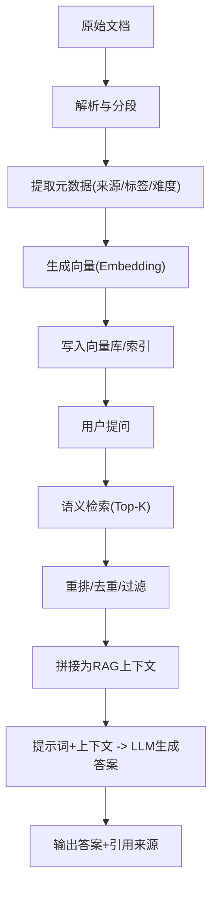
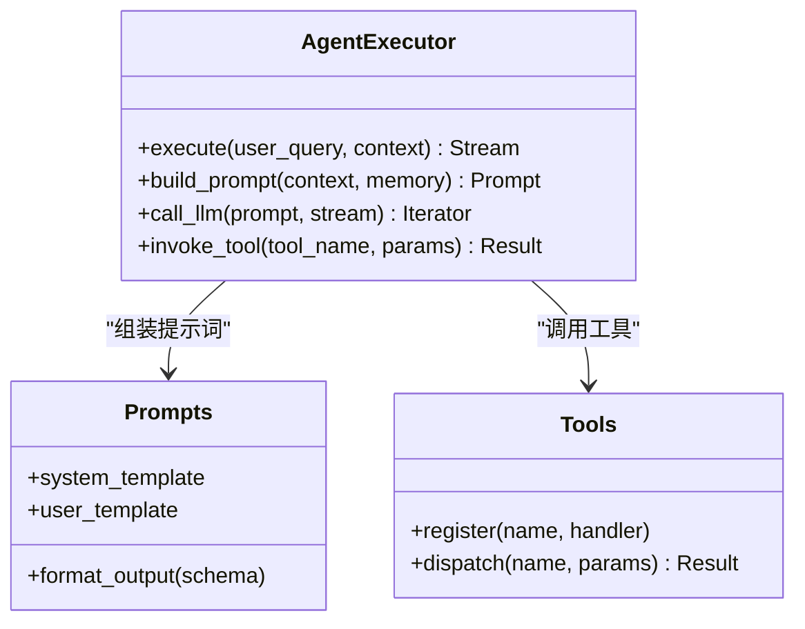
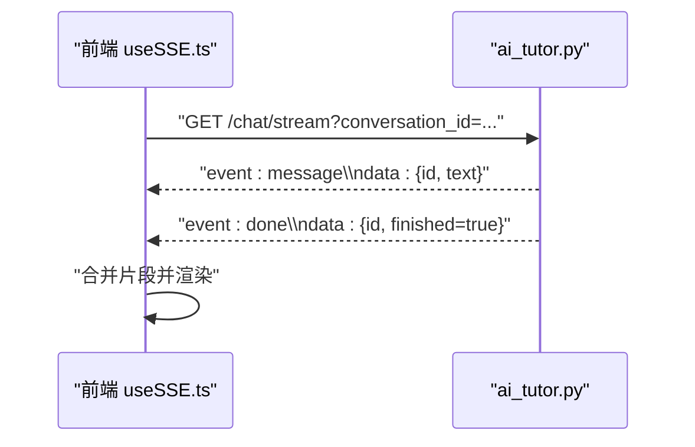
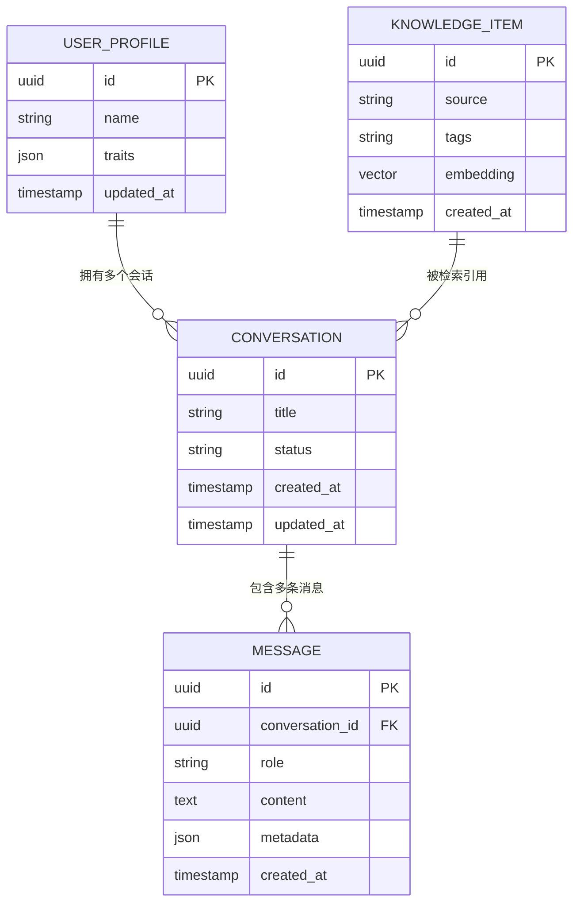
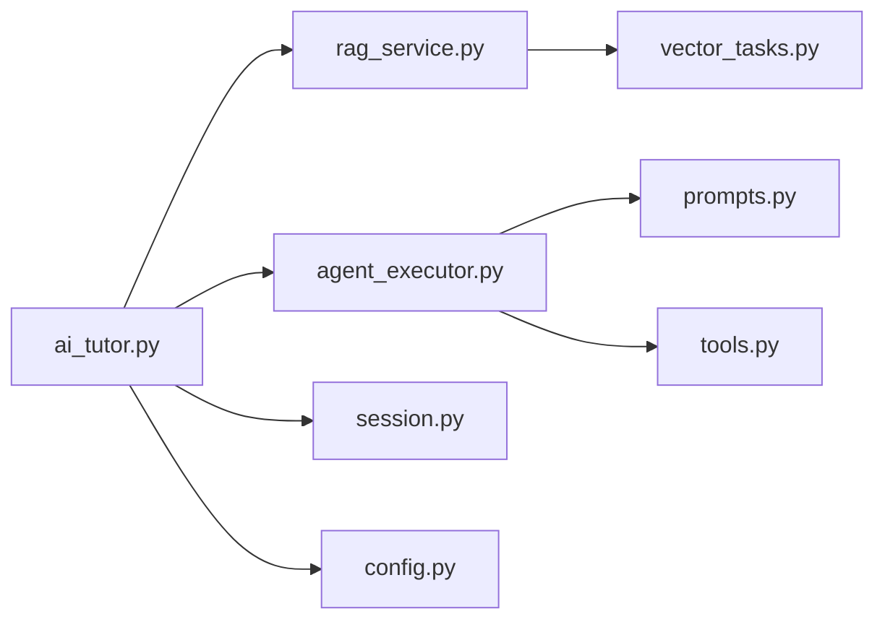

# AI辅导助手

<cite>
**本文引用的文件**   
- [backend/app/api/v1/ai_tutor.py](file://backend/app/api/v1/ai_tutor.py)
- [backend/app/api/v1/conversations.py](file://backend/app/api/v1/conversations.py)
- [backend/app/services/rag_service.py](file://backend/app/services/rag_service.py)
- [backend/app/services/agent/agent_executor.py](file://backend/app/services/agent/agent_executor.py)
- [backend/app/services/agent/prompts.py](file://backend/app/services/agent/prompts.py)
- [backend/app/services/agent/tools.py](file://backend/app/services/agent/tools.py)
- [backend/app/models/conversation.py](file://backend/app/models/conversation.py)
- [backend/app/schemas/conversation.py](file://backend/app/schemas/conversation.py)
- [backend/app/core/config.py](file://backend/app/core/config.py)
- [backend/app/db/session.py](file://backend/app/db/session.py)
- [backend/app/tasks/vector_tasks.py](file://backend/app/tasks/vector_tasks.py)
- [frontend/src/hooks/useSSE.ts](file://frontend/src/hooks/useSSE.ts)
- [frontend/src/services/conversationService.ts](file://frontend/src/services/conversationService.ts)
</cite>

## 目录
1. [简介](#简介)
2. [项目结构](#项目结构)
3. [核心组件](#核心组件)
4. [架构总览](#架构总览)
5. [详细组件分析](#详细组件分析)
6. [依赖关系分析](#依赖关系分析)
7. [性能考量](#性能考量)
8. [故障排查指南](#故障排查指南)
9. [结论](#结论)
10. [附录](#附录)

## 简介
本文件面向开发者与实施工程师，系统化阐述AI辅导助手的整体架构与关键实现，重点覆盖：
- 基于大语言模型的智能问答系统架构：对话管理、上下文维护、记忆机制
- RAG检索增强生成：知识库构建、向量检索、答案生成流程
- 实时对话通信：WebSocket/SSE消息推送机制
- 多轮对话状态管理与上下文理解
- 对话历史存储、搜索与回放的技术实现
- AI提示词工程最佳实践与调优方法
- 扩展新AI工具与集成第三方AI服务的方法

## 项目结构
后端采用分层架构：API层暴露REST接口；服务层封装业务逻辑（RAG、Agent执行等）；数据模型与Schema定义持久化结构与校验规则；任务层处理异步工作（如向量化入库）。前端通过HTTP与SSE进行交互，提供聊天界面与学习分析页面。

图表来源
- [backend/app/api/v1/ai_tutor.py](file://backend/app/api/v1/ai_tutor.py)
- [backend/app/api/v1/conversations.py](file://backend/app/api/v1/conversations.py)
- [backend/app/services/rag_service.py](file://backend/app/services/rag_service.py)
- [backend/app/services/agent/agent_executor.py](file://backend/app/services/agent/agent_executor.py)
- [backend/app/services/agent/prompts.py](file://backend/app/services/agent/prompts.py)
- [backend/app/services/agent/tools.py](file://backend/app/services/agent/tools.py)
- [backend/app/models/conversation.py](file://backend/app/models/conversation.py)
- [backend/app/schemas/conversation.py](file://backend/app/schemas/conversation.py)
- [backend/app/db/session.py](file://backend/app/db/session.py)
- [backend/app/tasks/vector_tasks.py](file://backend/app/tasks/vector_tasks.py)
- [frontend/src/hooks/useSSE.ts](file://frontend/src/hooks/useSSE.ts)
- [frontend/src/services/conversationService.ts](file://frontend/src/services/conversationService.ts)

章节来源
- [backend/app/api/v1/ai_tutor.py](file://backend/app/api/v1/ai_tutor.py)
- [backend/app/api/v1/conversations.py](file://backend/app/api/v1/conversations.py)
- [backend/app/services/rag_service.py](file://backend/app/services/rag_service.py)
- [backend/app/services/agent/agent_executor.py](file://backend/app/services/agent/agent_executor.py)
- [backend/app/services/agent/prompts.py](file://backend/app/services/agent/prompts.py)
- [backend/app/services/agent/tools.py](file://backend/app/services/agent/tools.py)
- [backend/app/models/conversation.py](file://backend/app/models/conversation.py)
- [backend/app/schemas/conversation.py](file://backend/app/schemas/conversation.py)
- [backend/app/db/session.py](file://backend/app/db/session.py)
- [backend/app/tasks/vector_tasks.py](file://backend/app/tasks/vector_tasks.py)
- [frontend/src/hooks/useSSE.ts](file://frontend/src/hooks/useSSE.ts)
- [frontend/src/services/conversationService.ts](file://frontend/src/services/conversationService.ts)

## 核心组件
- 对话管理API：负责会话创建、消息收发、历史查询与回放
- RAG服务：文档切分、向量化、相似度检索与结果融合
- Agent执行器：编排提示词、工具调用与大模型推理
- 提示词工程模块：结构化Prompt模板与策略
- 工具集：外部能力接入（如搜索、计算、评测）
- 数据库与会话持久化：会话、消息、用户画像等实体建模
- 异步任务：向量化入库、索引更新等耗时操作
- 前端SSE客户端：流式接收AI回复片段并渲染

章节来源
- [backend/app/api/v1/ai_tutor.py](file://backend/app/api/v1/ai_tutor.py)
- [backend/app/api/v1/conversations.py](file://backend/app/api/v1/conversations.py)
- [backend/app/services/rag_service.py](file://backend/app/services/rag_service.py)
- [backend/app/services/agent/agent_executor.py](file://backend/app/services/agent/agent_executor.py)
- [backend/app/services/agent/prompts.py](file://backend/app/services/agent/prompts.py)
- [backend/app/services/agent/tools.py](file://backend/app/services/agent/tools.py)
- [backend/app/models/conversation.py](file://backend/app/models/conversation.py)
- [backend/app/schemas/conversation.py](file://backend/app/schemas/conversation.py)
- [backend/app/db/session.py](file://backend/app/db/session.py)
- [backend/app/tasks/vector_tasks.py](file://backend/app/tasks/vector_tasks.py)
- [frontend/src/hooks/useSSE.ts](file://frontend/src/hooks/useSSE.ts)
- [frontend/src/services/conversationService.ts](file://frontend/src/services/conversationService.ts)

## 架构总览
系统采用“前端 + REST/SSE + 后端服务 + 向量库 + 任务队列”的解耦架构。前端通过HTTP发起对话请求，后端在Agent编排下完成RAG检索与LLM推理，并通过SSE将增量内容流式返回给前端。对话历史与知识索引分别落库与入向量库，支持后续检索与回放。

图表来源
- [backend/app/api/v1/ai_tutor.py](file://backend/app/api/v1/ai_tutor.py)
- [backend/app/services/agent/agent_executor.py](file://backend/app/services/agent/agent_executor.py)
- [backend/app/services/agent/prompts.py](file://backend/app/services/agent/prompts.py)
- [backend/app/services/agent/tools.py](file://backend/app/services/agent/tools.py)
- [backend/app/services/rag_service.py](file://backend/app/services/rag_service.py)
- [backend/app/db/session.py](file://backend/app/db/session.py)
- [backend/app/tasks/vector_tasks.py](file://backend/app/tasks/vector_tasks.py)

## 详细组件分析

### 对话管理与上下文维护
- 会话生命周期：创建会话、追加消息、按会话查询历史、清空或归档
- 上下文窗口：根据最近N条消息或时间窗口裁剪，保证不超出模型上下文限制
- 记忆机制：短期记忆（当前会话消息）、长期记忆（知识点摘要/错题记录/用户画像），由服务层聚合后注入提示词
- 状态管理：会话状态（活跃/结束/归档）、消息状态（待处理/已生成/失败重试）

章节来源
- [backend/app/api/v1/conversations.py](file://backend/app/api/v1/conversations.py)
- [backend/app/models/conversation.py](file://backend/app/models/conversation.py)
- [backend/app/schemas/conversation.py](file://backend/app/schemas/conversation.py)
- [backend/app/db/session.py](file://backend/app/db/session.py)

### RAG检索增强生成
- 知识库构建：文档解析、分段策略（按段落/标题/固定长度）、元数据标注（来源、难度、标签）
- 向量化与索引：使用Embedding模型生成向量，写入向量库；支持批量异步入库
- 检索策略：语义相似度检索、混合检索（关键词+向量）、重排（rerank）提升相关性
- 答案生成：将检索到的片段作为上下文注入提示词，引导模型生成有据可依的答案，并附带引用来源

章节来源
- [backend/app/services/rag_service.py](file://backend/app/services/rag_service.py)
- [backend/app/tasks/vector_tasks.py](file://backend/app/tasks/vector_tasks.py)

### Agent执行器与提示词工程
- 执行器职责：编排提示词、选择工具、调用大模型、处理流式响应、错误重试与超时控制
- 提示词工程：角色设定、任务目标、约束条件、输出格式、思维链引导、安全护栏
- 工具集成：可插拔工具注册表，统一输入输出契约，便于扩展搜索、计算、评测等能力

图表来源
- [backend/app/services/agent/agent_executor.py](file://backend/app/services/agent/agent_executor.py)
- [backend/app/services/agent/prompts.py](file://backend/app/services/agent/prompts.py)
- [backend/app/services/agent/tools.py](file://backend/app/services/agent/tools.py)

章节来源
- [backend/app/services/agent/agent_executor.py](file://backend/app/services/agent/agent_executor.py)
- [backend/app/services/agent/prompts.py](file://backend/app/services/agent/prompts.py)
- [backend/app/services/agent/tools.py](file://backend/app/services/agent/tools.py)

### 实时对话通信（SSE）
- 服务端：以SSE事件流形式推送增量文本片段，包含会话ID、消息ID、片段内容与完成标记
- 客户端：建立SSE连接，逐条渲染片段，合并为完整回答；断线自动重连与幂等恢复
- 前端服务封装：统一错误处理、进度回调、取消请求

图表来源
- [frontend/src/hooks/useSSE.ts](file://frontend/src/hooks/useSSE.ts)
- [backend/app/api/v1/ai_tutor.py](file://backend/app/api/v1/ai_tutor.py)

章节来源
- [frontend/src/hooks/useSSE.ts](file://frontend/src/hooks/useSSE.ts)
- [frontend/src/services/conversationService.ts](file://frontend/src/services/conversationService.ts)
- [backend/app/api/v1/ai_tutor.py](file://backend/app/api/v1/ai_tutor.py)

### 对话历史存储、搜索与回放
- 存储模型：会话、消息、用户画像、知识点关联等实体
- 搜索能力：按关键字、时间范围、标签、来源等多维度筛选
- 回放功能：按会话ID拉取历史消息，支持分页与增量同步

图表来源
- [backend/app/models/conversation.py](file://backend/app/models/conversation.py)
- [backend/app/schemas/conversation.py](file://backend/app/schemas/conversation.py)
- [backend/app/db/session.py](file://backend/app/db/session.py)

章节来源
- [backend/app/models/conversation.py](file://backend/app/models/conversation.py)
- [backend/app/schemas/conversation.py](file://backend/app/schemas/conversation.py)
- [backend/app/api/v1/conversations.py](file://backend/app/api/v1/conversations.py)

### 配置与安全
- 配置中心：集中管理模型端点、密钥、向量库地址、并发与超时参数
- 安全策略：鉴权中间件、输入校验、敏感信息脱敏、速率限制

章节来源
- [backend/app/core/config.py](file://backend/app/core/config.py)

## 依赖关系分析
- 低耦合高内聚：API层仅编排调用，具体逻辑下沉至服务层
- 明确边界：RAG与Agent解耦，前者专注检索与上下文构建，后者专注推理与工具编排
- 异步解耦：向量化入库走任务队列，避免阻塞主线程
- 可扩展性：工具注册表与提示词模板化，便于新增能力与A/B测试

图表来源
- [backend/app/api/v1/ai_tutor.py](file://backend/app/api/v1/ai_tutor.py)
- [backend/app/services/rag_service.py](file://backend/app/services/rag_service.py)
- [backend/app/services/agent/agent_executor.py](file://backend/app/services/agent/agent_executor.py)
- [backend/app/services/agent/prompts.py](file://backend/app/services/agent/prompts.py)
- [backend/app/services/agent/tools.py](file://backend/app/services/agent/tools.py)
- [backend/app/tasks/vector_tasks.py](file://backend/app/tasks/vector_tasks.py)
- [backend/app/db/session.py](file://backend/app/db/session.py)
- [backend/app/core/config.py](file://backend/app/core/config.py)

章节来源
- [backend/app/api/v1/ai_tutor.py](file://backend/app/api/v1/ai_tutor.py)
- [backend/app/services/rag_service.py](file://backend/app/services/rag_service.py)
- [backend/app/services/agent/agent_executor.py](file://backend/app/services/agent/agent_executor.py)
- [backend/app/services/agent/prompts.py](file://backend/app/services/agent/prompts.py)
- [backend/app/services/agent/tools.py](file://backend/app/services/agent/tools.py)
- [backend/app/tasks/vector_tasks.py](file://backend/app/tasks/vector_tasks.py)
- [backend/app/db/session.py](file://backend/app/db/session.py)
- [backend/app/core/config.py](file://backend/app/core/config.py)

## 性能考量
- 流式响应：优先使用SSE减少首字节延迟，提升用户体验
- 上下文裁剪：动态压缩历史与摘要，降低Token消耗与延迟
- 检索优化：Top-K与重排结合，控制召回数量与质量平衡
- 缓存策略：热点知识片段缓存、相似问题缓存，降低重复计算
- 异步批处理：向量化入库与索引更新批量提交，提高吞吐
- 资源隔离：不同模型/工具的并发与超时独立配置，避免相互影响

[本节为通用指导，无需代码来源]

## 故障排查指南
- SSE连接异常：检查网络连通、跨域配置、服务端事件流是否正常；前端需实现断线重连与幂等恢复
- 检索为空或质量差：确认文档分段与元数据是否正确、Embedding模型是否匹配、向量库索引是否更新
- 提示词效果不佳：调整角色/约束/输出格式，增加示例与思维链，逐步引入少样本提示
- 工具调用失败：核对工具注册与权限、参数校验、外部服务可用性；增加重试与降级策略
- 上下文溢出：缩短历史、启用摘要压缩、拆分长对话为子会话
- 日志与追踪：为关键路径埋点（检索耗时、模型调用耗时、工具调用成功率），定位瓶颈

章节来源
- [frontend/src/hooks/useSSE.ts](file://frontend/src/hooks/useSSE.ts)
- [backend/app/services/rag_service.py](file://backend/app/services/rag_service.py)
- [backend/app/services/agent/agent_executor.py](file://backend/app/services/agent/agent_executor.py)
- [backend/app/services/agent/prompts.py](file://backend/app/services/agent/prompts.py)
- [backend/app/services/agent/tools.py](file://backend/app/services/agent/tools.py)

## 结论
本系统以“检索增强+智能体编排”为核心，结合流式通信与完善的对话历史管理，实现了高效、可解释且可扩展的AI辅导助手。通过模块化设计与清晰的职责边界，既保证了稳定性与性能，也为后续扩展新工具与第三方AI服务提供了良好基础。

[本节为总结，无需代码来源]

## 附录

### 提示词工程最佳实践与调优
- 明确角色与目标：限定领域、语气与受众，避免泛化
- 结构化输出：定义JSON/Markdown模板，便于前端解析与展示
- 约束与护栏：禁止泄露内部信息、要求引用来源、拒绝不当内容
- 思维链与示例：用少量高质量示例引导推理步骤
- 渐进式迭代：先小步验证，再逐步加入复杂约束与工具调用
- 评估指标：准确性、可读性、引用覆盖率、时延与成本

章节来源
- [backend/app/services/agent/prompts.py](file://backend/app/services/agent/prompts.py)

### 扩展新AI工具与集成第三方服务
- 工具注册：在工具表中声明名称、描述、输入输出Schema
- 处理器实现：遵循统一契约，处理参数校验、异常与日志
- 安全与限流：对第三方调用设置超时、重试与熔断
- 测试与灰度：单元测试覆盖边界用例，灰度发布观察指标

章节来源
- [backend/app/services/agent/tools.py](file://backend/app/services/agent/tools.py)
- [backend/app/services/agent/agent_executor.py](file://backend/app/services/agent/agent_executor.py)