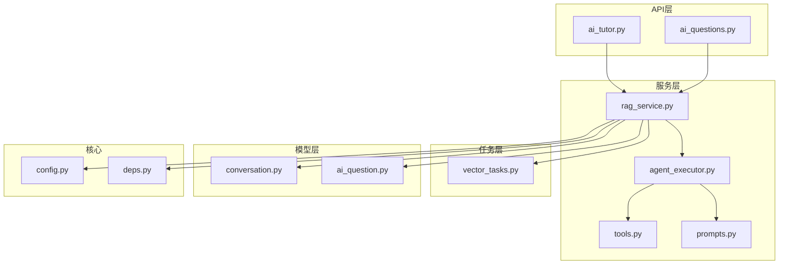
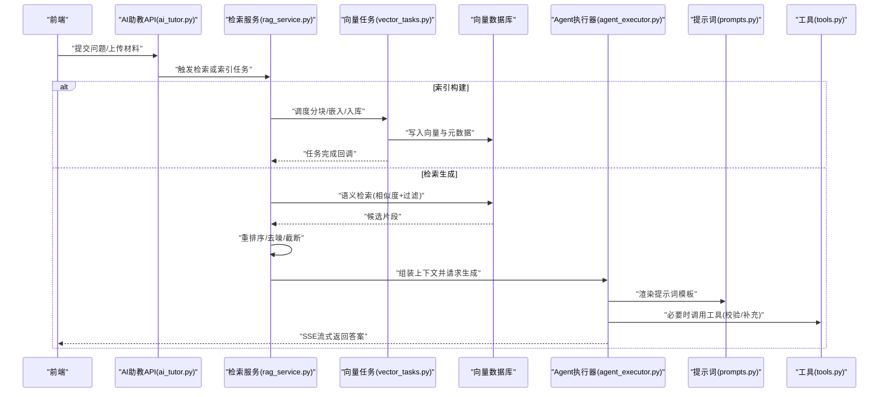
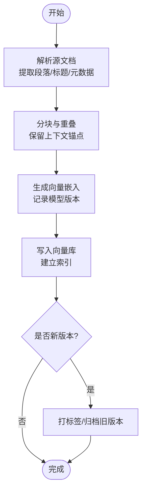
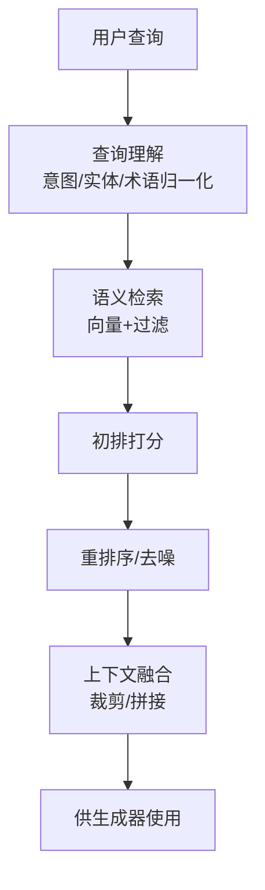
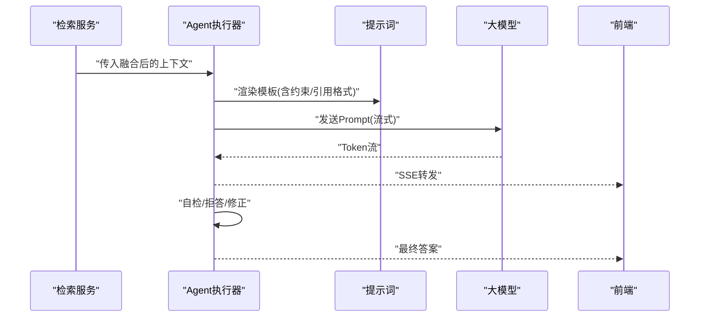
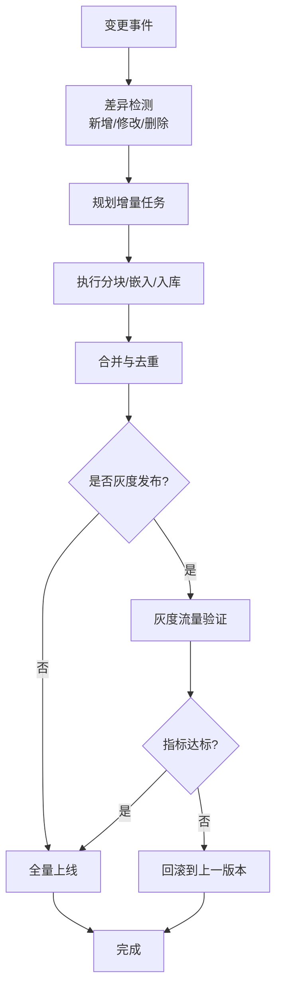
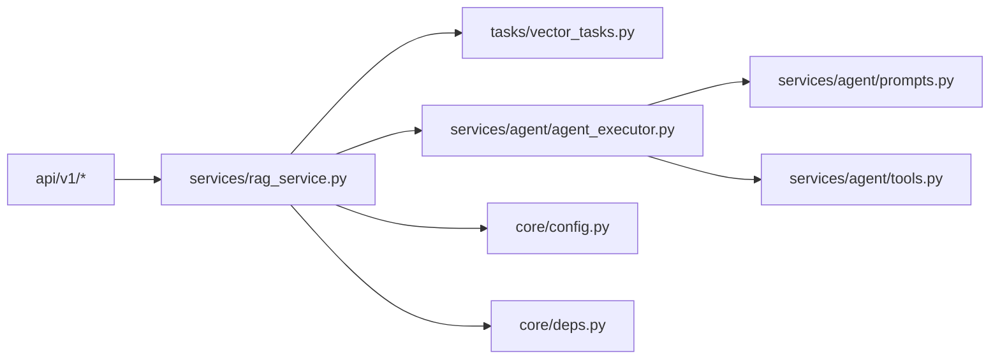

# RAG知识库系统

<cite>
**本文引用的文件**   
- [rag_service.py](file://backend/app/services/rag_service.py)
- [vector_tasks.py](file://backend/app/tasks/vector_tasks.py)
- [agent_executor.py](file://backend/app/services/agent/agent_executor.py)
- [prompts.py](file://backend/app/services/agent/prompts.py)
- [tools.py](file://backend/app/services/agent/tools.py)
- [config.py](file://backend/app/core/config.py)
- [deps.py](file://backend/app/core/deps.py)
- [ai_tutor.py](file://backend/app/api/v1/ai_tutor.py)
- [ai_questions.py](file://backend/app/api/v1/ai_questions.py)
- [conversation.py](file://backend/app/models/conversation.py)
- [ai_question.py](file://backend/app/models/ai_question.py)
</cite>

## 目录
1. [简介](#简介)
2. [项目结构](#项目结构)
3. [核心组件](#核心组件)
4. [架构总览](#架构总览)
5. [详细组件分析](#详细组件分析)
6. [依赖关系分析](#依赖关系分析)
7. [性能与可扩展性](#性能与可扩展性)
8. [故障排查指南](#故障排查指南)
9. [结论](#结论)
10. [附录](#附录)

## 简介
本文件面向开发者与技术负责人，系统化阐述本项目中的检索增强生成（RAG）知识库体系。内容覆盖向量数据库构建与索引机制、知识检索流程、答案生成过程、知识更新机制、质量评估与监控方法、领域适配与调优策略，以及扩展新知识与检索策略的实践指南。文档以代码级事实为依据，结合可视化图示帮助读者快速理解系统设计与实现要点。

## 项目结构
后端采用分层架构：API层暴露REST接口，服务层封装业务逻辑，任务层处理异步的向量化与索引构建，Agent层负责提示词编排与工具调用，配置与依赖注入贯穿全局。前端通过HTTP/SSE与后端交互，展示问答与分析结果。

图表来源
- [ai_tutor.py](file://backend/app/api/v1/ai_tutor.py)
- [ai_questions.py](file://backend/app/api/v1/ai_questions.py)
- [rag_service.py](file://backend/app/services/rag_service.py)
- [vector_tasks.py](file://backend/app/tasks/vector_tasks.py)
- [agent_executor.py](file://backend/app/services/agent/agent_executor.py)
- [tools.py](file://backend/app/services/agent/tools.py)
- [prompts.py](file://backend/app/services/agent/prompts.py)
- [conversation.py](file://backend/app/models/conversation.py)
- [ai_question.py](file://backend/app/models/ai_question.py)
- [config.py](file://backend/app/core/config.py)
- [deps.py](file://backend/app/core/deps.py)

章节来源
- [rag_service.py](file://backend/app/services/rag_service.py)
- [vector_tasks.py](file://backend/app/tasks/vector_tasks.py)
- [agent_executor.py](file://backend/app/services/agent/agent_executor.py)
- [prompts.py](file://backend/app/services/agent/prompts.py)
- [tools.py](file://backend/app/services/agent/tools.py)
- [config.py](file://backend/app/core/config.py)
- [deps.py](file://backend/app/core/deps.py)
- [ai_tutor.py](file://backend/app/api/v1/ai_tutor.py)
- [ai_questions.py](file://backend/app/api/v1/ai_questions.py)
- [conversation.py](file://backend/app/models/conversation.py)
- [ai_question.py](file://backend/app/models/ai_question.py)

## 核心组件
- 检索服务（RAG Service）
  - 职责：协调文本分块、嵌入生成、向量入库、查询检索、上下文融合与答案生成；维护版本与一致性。
  - 关键能力：增量索引、相似度检索、重排序、缓存命中、错误回退。
- 向量任务（Vector Tasks）
  - 职责：异步执行批量分块、嵌入计算、写入向量库、索引重建与清理。
  - 关键能力：任务队列、幂等写入、失败重试、进度上报。
- Agent执行器（Agent Executor）
  - 职责：解析用户意图、选择检索策略、组装提示词、调用外部工具、流式输出。
  - 关键能力：多步推理、工具路由、超时控制、安全校验。
- 提示词与工具（Prompts & Tools）
  - 职责：定义模板、约束生成风格、提供检索与验证工具。
  - 关键能力：模板参数化、动态上下文注入、幻觉抑制指令。
- 配置与依赖（Config & Deps）
  - 职责：集中管理模型、向量库、任务队列、日志与限流策略。
  - 关键能力：环境隔离、热重载、可观测性开关。

章节来源
- [rag_service.py](file://backend/app/services/rag_service.py)
- [vector_tasks.py](file://backend/app/tasks/vector_tasks.py)
- [agent_executor.py](file://backend/app/services/agent/agent_executor.py)
- [prompts.py](file://backend/app/services/agent/prompts.py)
- [tools.py](file://backend/app/services/agent/tools.py)
- [config.py](file://backend/app/core/config.py)
- [deps.py](file://backend/app/core/deps.py)

## 架构总览
RAG系统由“数据入湖—索引构建—检索—生成”四阶段组成，前后端通过API与SSE进行交互，任务层保障高吞吐与容错。

图表来源
- [ai_tutor.py](file://backend/app/api/v1/ai_tutor.py)
- [rag_service.py](file://backend/app/services/rag_service.py)
- [vector_tasks.py](file://backend/app/tasks/vector_tasks.py)
- [agent_executor.py](file://backend/app/services/agent/agent_executor.py)
- [prompts.py](file://backend/app/services/agent/prompts.py)
- [tools.py](file://backend/app/services/agent/tools.py)

## 详细组件分析

### 向量数据库构建与索引机制
- 文本分块策略
  - 按段落/标题/长度阈值切分，保留层级元数据（来源、章节、时间戳）。
  - 重叠窗口避免边界信息丢失，支持按领域规则自定义分段。
- 向量嵌入生成
  - 使用统一嵌入模型将文本转为稠密向量，记录维度与模型版本。
  - 对长文本进行摘要或分段嵌入后聚合。
- 相似度计算与索引
  - 基于内积或余弦相似度检索，结合BM25/关键词过滤提升召回。
  - 建立HNSW/IVF等近似最近邻索引，平衡延迟与精度。
- 版本管理与一致性
  - 为每次入库分配版本号，支持灰度切换与回滚。
  - 写入前做幂等检查，避免重复条目；删除时软标记并定期清理。

图表来源
- [vector_tasks.py](file://backend/app/tasks/vector_tasks.py)
- [rag_service.py](file://backend/app/services/rag_service.py)

章节来源
- [vector_tasks.py](file://backend/app/tasks/vector_tasks.py)
- [rag_service.py](file://backend/app/services/rag_service.py)

### 知识检索流程
- 查询理解
  - 意图识别、实体抽取、同义词扩展、领域术语归一化。
- 语义搜索
  - 将查询编码为向量，在向量库中进行相似度检索，结合元数据过滤（来源、时间、权限）。
- 结果排序与重排序
  - 初排：相似度分数 + 相关性启发式（关键词匹配、位置权重）。
  - 重排：交叉编码器或学习排序模型，考虑上下文连贯性与权威性。
- 上下文融合
  - 去重、冲突消解、冗余压缩，按重要性拼接为Prompt上下文。

图表来源
- [rag_service.py](file://backend/app/services/rag_service.py)
- [tools.py](file://backend/app/services/agent/tools.py)

章节来源
- [rag_service.py](file://backend/app/services/rag_service.py)
- [tools.py](file://backend/app/services/agent/tools.py)

### 答案生成过程
- 提示词模板设计
  - 结构化模板：角色设定、任务目标、约束条件、引用格式、拒绝回答策略。
  - 动态注入：检索到的片段、用户画像、历史对话摘要。
- 上下文融合
  - 按片段相关度降序插入，限制最大Token数，保留来源标注以便溯源。
- 幻觉抑制技术
  - 强制要求“仅依据给定上下文作答”，未命中则明确说明未知。
  - 引入自我校验步骤：事实一致性检查、数值单位校验、反例探测。
- 流式输出与中断
  - SSE逐块推送，支持中途停止与追问。

图表来源
- [agent_executor.py](file://backend/app/services/agent/agent_executor.py)
- [prompts.py](file://backend/app/services/agent/prompts.py)
- [ai_tutor.py](file://backend/app/api/v1/ai_tutor.py)

章节来源
- [agent_executor.py](file://backend/app/services/agent/agent_executor.py)
- [prompts.py](file://backend/app/services/agent/prompts.py)
- [ai_tutor.py](file://backend/app/api/v1/ai_tutor.py)

### 知识更新机制
- 增量索引
  - 基于变更检测（新增/修改/删除）触发增量任务，避免全量重建。
  - 合并策略：按主键去重、时间戳优先、软删除标记。
- 版本管理
  - 每个数据集或主题域维护版本快照，支持一键切换与回滚。
  - 发布前进行回归检索测试与抽样人工复核。
- 一致性保证
  - 事务性写入与幂等键，确保多次提交不产生重复。
  - 读写分离与索引预热，降低冷启动抖动。

图表来源
- [vector_tasks.py](file://backend/app/tasks/vector_tasks.py)
- [rag_service.py](file://backend/app/services/rag_service.py)

章节来源
- [vector_tasks.py](file://backend/app/tasks/vector_tasks.py)
- [rag_service.py](file://backend/app/services/rag_service.py)

### 知识库质量评估与性能监控
- 质量评估
  - 检索侧：命中率、平均倒数排名（MRR）、Top-K准确率、跨域泛化。
  - 生成侧：事实一致性、引用覆盖率、拒答率、可读性与合规性。
  - 评测集：构建领域基准题集，自动化跑批对比不同策略。
- 性能监控
  - 端到端延迟分布、P95/P99、吞吐量、向量库QPS与内存占用。
  - 任务队列积压、失败重试次数、嵌入模型耗时与配额。
  - 告警阈值与降级策略（如关闭重排序、缩短上下文）。

章节来源
- [rag_service.py](file://backend/app/services/rag_service.py)
- [vector_tasks.py](file://backend/app/tasks/vector_tasks.py)
- [agent_executor.py](file://backend/app/services/agent/agent_executor.py)

### 领域适配与调优策略
- 学科差异化
  - 数学/理科：强化公式与符号解析，增加步骤拆解与单位校验。
  - 语言/人文：侧重语义连贯与引用规范，减少过度精确化。
  - 工程/实操：强调步骤可复现与安全边界提示。
- 检索策略
  - 调整分块粒度与重叠比例，优化关键词与语义权重。
  - 引入领域词典与同义词表，提升召回稳定性。
- 生成策略
  - 定制提示词约束与拒答阈值，设置“不确定即说明”的策略。
  - 针对高风险场景启用二次校验与专家审核通道。

章节来源
- [prompts.py](file://backend/app/services/agent/prompts.py)
- [tools.py](file://backend/app/services/agent/tools.py)
- [rag_service.py](file://backend/app/services/rag_service.py)

### 扩展新知识与检索策略
- 接入新数据源
  - 定义数据适配器：统一清洗、字段映射、元数据标准化。
  - 注册增量管道：监听变更事件，复用现有分块/嵌入/入库流程。
- 新增检索策略
  - 插件化检索器：实现统一接口（编码、过滤、排序），按需组合。
  - 混合检索：向量+关键词+图谱路径，按场景加权。
- 配置与治理
  - 通过配置中心切换策略与阈值，A/B实验评估效果。
  - 审计与溯源：记录每次检索与生成的关键参数与来源。

章节来源
- [rag_service.py](file://backend/app/services/rag_service.py)
- [vector_tasks.py](file://backend/app/tasks/vector_tasks.py)
- [config.py](file://backend/app/core/config.py)
- [deps.py](file://backend/app/core/deps.py)

## 依赖关系分析
- 模块耦合
  - API层依赖服务层，服务层依赖任务层与Agent层，Agent层依赖提示词与工具。
  - 配置与依赖注入贯穿各层，便于替换实现与灰度发布。
- 外部依赖
  - 向量数据库、嵌入模型、任务队列、日志与监控平台。
- 潜在循环依赖
  - 服务层不应反向依赖API层；任务层只依赖基础设施与配置。

图表来源
- [ai_tutor.py](file://backend/app/api/v1/ai_tutor.py)
- [ai_questions.py](file://backend/app/api/v1/ai_questions.py)
- [rag_service.py](file://backend/app/services/rag_service.py)
- [vector_tasks.py](file://backend/app/tasks/vector_tasks.py)
- [agent_executor.py](file://backend/app/services/agent/agent_executor.py)
- [prompts.py](file://backend/app/services/agent/prompts.py)
- [tools.py](file://backend/app/services/agent/tools.py)
- [config.py](file://backend/app/core/config.py)
- [deps.py](file://backend/app/core/deps.py)

章节来源
- [rag_service.py](file://backend/app/services/rag_service.py)
- [vector_tasks.py](file://backend/app/tasks/vector_tasks.py)
- [agent_executor.py](file://backend/app/services/agent/agent_executor.py)
- [prompts.py](file://backend/app/services/agent/prompts.py)
- [tools.py](file://backend/app/services/agent/tools.py)
- [config.py](file://backend/app/core/config.py)
- [deps.py](file://backend/app/core/deps.py)

## 性能与可扩展性
- 索引与检索
  - 选择合适的索引结构与距离度量，权衡召回率与延迟。
  - 预取热门片段、缓存高频查询结果，降低热点压力。
- 并发与异步
  - 任务队列削峰填谷，合理设置并行度与重试策略。
  - 流式生成减少首字节延迟，提升用户体验。
- 资源与成本
  - 控制上下文长度与重排序开销，按需开启高阶策略。
  - 对嵌入模型进行批量化与量化，降低显存与CPU占用。

[本节为通用指导，无需特定文件来源]

## 故障排查指南
- 常见问题定位
  - 检索不到相关内容：检查分块粒度、重叠比例、过滤条件与同义词表。
  - 生成幻觉：收紧提示词约束、提高拒答阈值、增加自检步骤。
  - 任务堆积：查看队列容量、消费者数量、失败重试与死信队列。
- 日志与追踪
  - 记录检索参数、候选片段ID、重排序得分与生成Token统计。
  - 关联追踪ID贯穿API—服务—任务—模型调用链。
- 回滚与恢复
  - 版本快照与灰度回滚，确保异常时可快速恢复稳定版本。

章节来源
- [vector_tasks.py](file://backend/app/tasks/vector_tasks.py)
- [rag_service.py](file://backend/app/services/rag_service.py)
- [agent_executor.py](file://backend/app/services/agent/agent_executor.py)

## 结论
本RAG知识库系统围绕“高质量检索—可控生成—稳健更新—可观测运维”展开，通过模块化设计与插件化策略，兼顾准确性、效率与可维护性。建议在生产环境中持续完善评测集与监控指标，逐步引入更精细的重排序与自检机制，并结合领域特性定制分块与提示词策略，以获得稳定可靠的智能问答体验。

[本节为总结性内容，无需特定文件来源]

## 附录
- 相关模型与存储
  - 对话与题目模型用于持久化会话与问题记录，支撑分析与回溯。
- 参考文件
  - [conversation.py](file://backend/app/models/conversation.py)
  - [ai_question.py](file://backend/app/models/ai_question.py)

章节来源
- [conversation.py](file://backend/app/models/conversation.py)
- [ai_question.py](file://backend/app/models/ai_question.py)