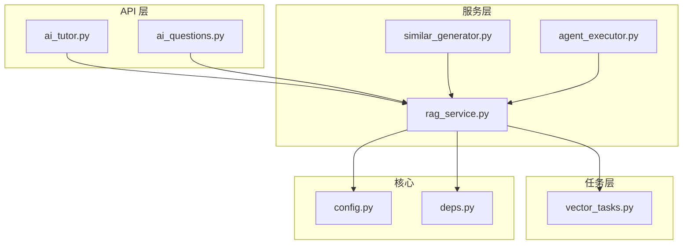
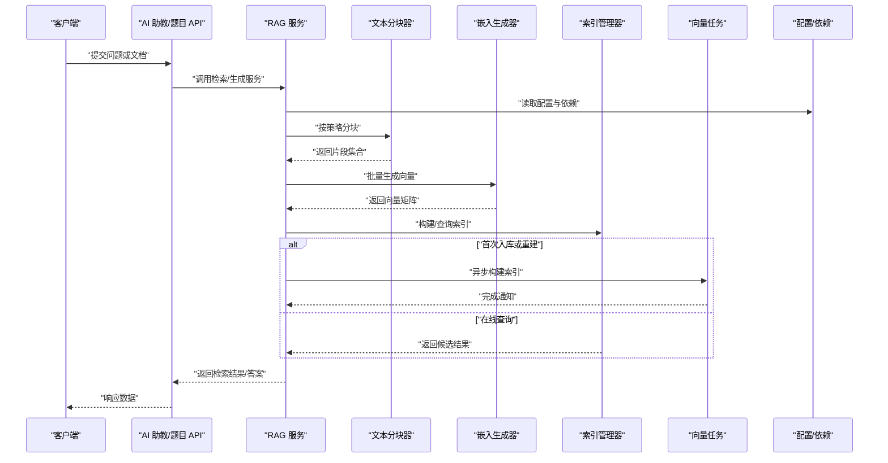
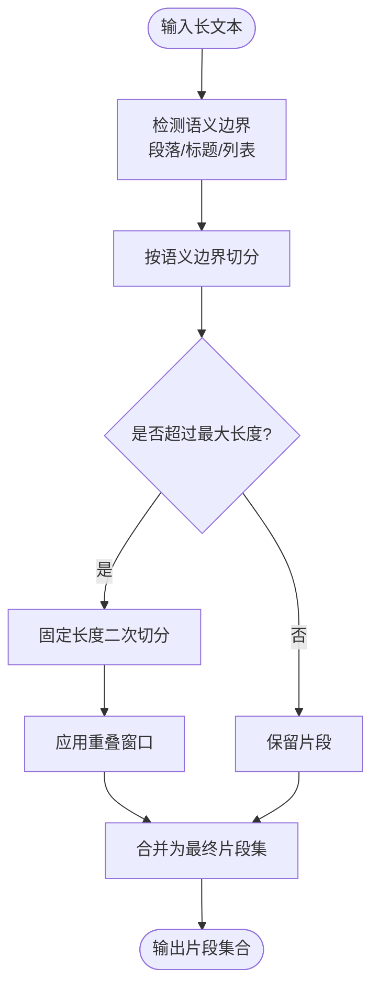
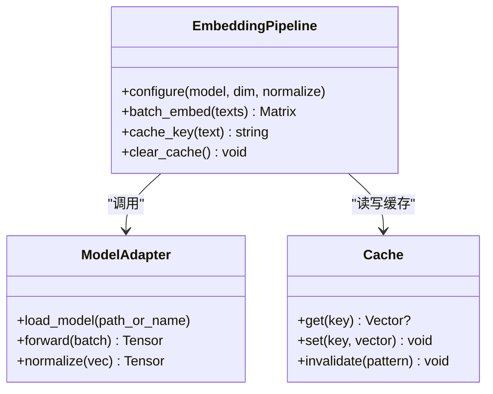
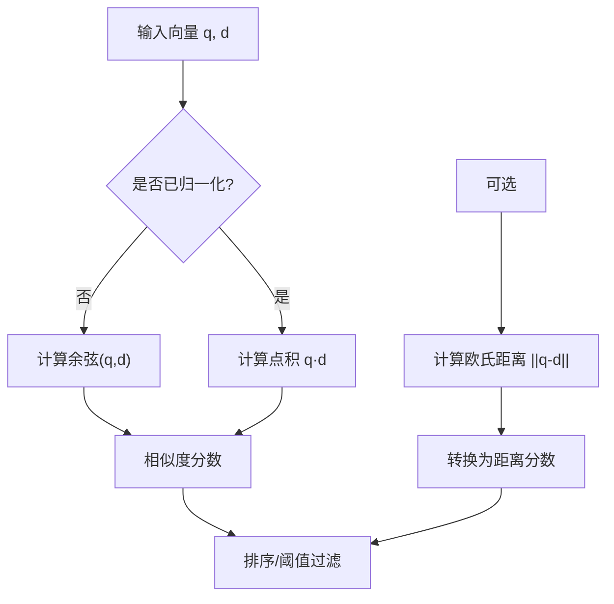
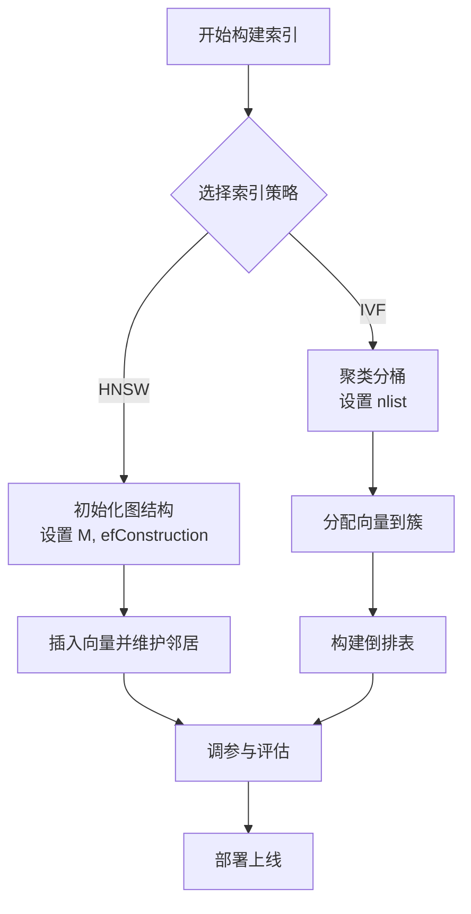
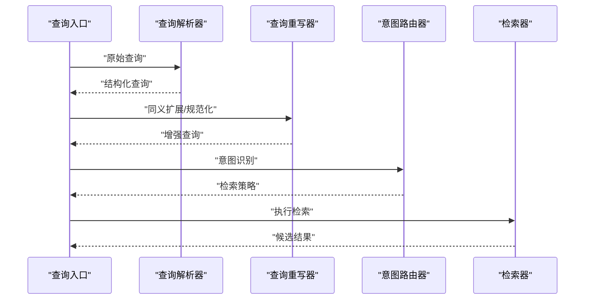
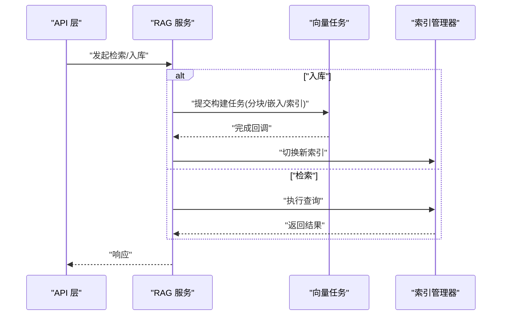
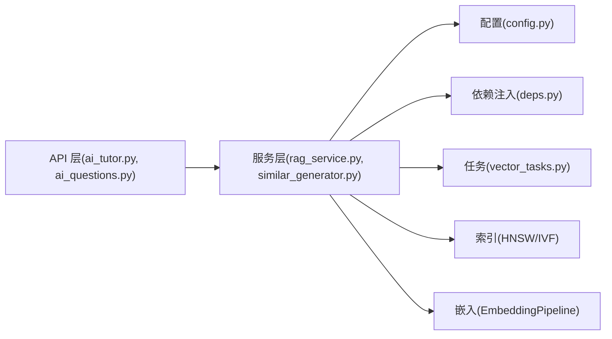

# 向量检索引擎

<cite>
**本文引用的文件**   
- [rag_service.py](file://backend/app/services/rag_service.py)
- [vector_tasks.py](file://backend/app/tasks/vector_tasks.py)
- [config.py](file://backend/app/core/config.py)
- [deps.py](file://backend/app/core/deps.py)
- [ai_tutor.py](file://backend/app/api/v1/ai_tutor.py)
- [ai_questions.py](file://backend/app/api/v1/ai_questions.py)
- [agent_executor.py](file://backend/app/services/agent/agent_executor.py)
- [similar_generator.py](file://backend/app/services/similar_generator.py)
</cite>

## 目录
1. [简介](#简介)
2. [项目结构](#项目结构)
3. [核心组件](#核心组件)
4. [架构总览](#架构总览)
5. [详细组件分析](#详细组件分析)
6. [依赖关系分析](#依赖关系分析)
7. [性能考量](#性能考量)
8. [故障排查指南](#故障排查指南)
9. [结论](#结论)
10. [附录](#附录)

## 简介
本文件面向“向量检索引擎”的构建与使用，围绕文本分块策略、向量嵌入生成、相似度计算、索引构建与优化、查询理解机制以及检索性能调优与监控指标进行系统化说明。文档以代码仓库中的服务层、任务层与配置为核心依据，结合工程实践给出可操作的实现建议与最佳实践。

## 项目结构
后端采用分层架构：API 层暴露接口，服务层封装业务逻辑（包括 RAG 与相似题生成），任务层负责异步处理（如向量化流水线），核心模块提供配置与依赖注入。前端通过 API 与服务交互，不直接参与向量检索实现。

图表来源
- [ai_tutor.py](file://backend/app/api/v1/ai_tutor.py)
- [ai_questions.py](file://backend/app/api/v1/ai_questions.py)
- [rag_service.py](file://backend/app/services/rag_service.py)
- [similar_generator.py](file://backend/app/services/similar_generator.py)
- [agent_executor.py](file://backend/app/services/agent/agent_executor.py)
- [vector_tasks.py](file://backend/app/tasks/vector_tasks.py)
- [config.py](file://backend/app/core/config.py)
- [deps.py](file://backend/app/core/deps.py)

章节来源
- [rag_service.py](file://backend/app/services/rag_service.py)
- [vector_tasks.py](file://backend/app/tasks/vector_tasks.py)
- [config.py](file://backend/app/core/config.py)
- [deps.py](file://backend/app/core/deps.py)
- [ai_tutor.py](file://backend/app/api/v1/ai_tutor.py)
- [ai_questions.py](file://backend/app/api/v1/ai_questions.py)
- [agent_executor.py](file://backend/app/services/agent/agent_executor.py)
- [similar_generator.py](file://backend/app/services/similar_generator.py)

## 核心组件
- 文本分块器：支持固定长度分块、语义边界分块、重叠窗口等策略，用于将长文本切分为适合嵌入与检索的片段。
- 嵌入生成器：选择合适模型与维度，支持批量处理与缓存，输出稳定维度的稠密向量。
- 相似度计算器：提供余弦相似度、欧氏距离、点积等方法，适配不同场景与性能需求。
- 索引管理器：基于近似最近邻算法（如 HNSW、IVF）构建与维护索引，支持增量更新与重建。
- 查询理解器：对查询进行重写、意图识别与多语言归一化，提升召回质量。
- 任务编排器：在后台队列中执行批量的分块、嵌入与索引构建任务，保障吞吐与稳定性。

章节来源
- [rag_service.py](file://backend/app/services/rag_service.py)
- [vector_tasks.py](file://backend/app/tasks/vector_tasks.py)
- [config.py](file://backend/app/core/config.py)
- [deps.py](file://backend/app/core/deps.py)

## 架构总览
整体流程从 API 接收请求开始，服务层协调分块、嵌入、相似度计算与索引检索，必要时调用任务层进行异步处理；配置与依赖注入贯穿各层，保证可扩展性与可观测性。

图表来源
- [ai_tutor.py](file://backend/app/api/v1/ai_tutor.py)
- [ai_questions.py](file://backend/app/api/v1/ai_questions.py)
- [rag_service.py](file://backend/app/services/rag_service.py)
- [vector_tasks.py](file://backend/app/tasks/vector_tasks.py)
- [config.py](file://backend/app/core/config.py)
- [deps.py](file://backend/app/core/deps.py)

## 详细组件分析

### 文本分块策略
- 固定长度分块：按字符或 token 数切分，简单高效，适合短文本或结构化内容。
- 语义边界分块：依据段落、标题、列表等结构或句法边界切分，保持语义完整性。
- 重叠窗口：在相邻片段间设置重叠区域，减少跨边界的语义丢失，提高召回鲁棒性。
- 组合策略：先语义切分再固定长度二次切分，并叠加重叠窗口，兼顾完整性和召回率。

章节来源
- [rag_service.py](file://backend/app/services/rag_service.py)
- [config.py](file://backend/app/core/config.py)

### 向量嵌入生成过程
- 模型选择：根据领域与语言特性选择预训练嵌入模型，平衡精度与延迟。
- 维度优化：统一输出维度，必要时降维以提升检索效率。
- 批量处理：按批次送入模型，控制内存占用与吞吐；结合缓存避免重复计算。
- 归一化：对向量进行 L2 归一化，便于使用余弦相似度或点积。

图表来源
- [rag_service.py](file://backend/app/services/rag_service.py)
- [config.py](file://backend/app/core/config.py)
- [deps.py](file://backend/app/core/deps.py)

章节来源
- [rag_service.py](file://backend/app/services/rag_service.py)
- [config.py](file://backend/app/core/config.py)
- [deps.py](file://backend/app/core/deps.py)

### 相似度计算算法
- 余弦相似度：衡量方向一致性，适合归一化后的向量，抗缩放影响。
- 欧氏距离：衡量绝对距离，适合关注数值差异的场景。
- 点积：在归一化向量下等价于余弦相似度，计算更快，常用于大规模检索。
- 适用场景与性能特征：
  - 高维稀疏：优先余弦或点积。
  - 低维密集：欧氏距离可能更敏感。
  - 实时性要求高：点积优于余弦（省去除法）。

章节来源
- [rag_service.py](file://backend/app/services/rag_service.py)
- [config.py](file://backend/app/core/config.py)

### 索引构建与优化（HNSW、IVF）
- HNSW（Hierarchical Navigable Small World）：
  - 特点：图结构索引，构建与查询均较快，适合高并发与低延迟。
  - 关键参数：M（每节点最大连接）、efConstruction（构建时搜索宽度）、efSearch（查询时搜索宽度）。
  - 适用：在线检索为主、动态更新的场景。
- IVF（Inverted File Index）：
  - 特点：聚类分桶+倒排，构建成本低，查询需遍历候选桶。
  - 关键参数：nlist（簇数量）、nprobe（查询时探测的簇数）。
  - 适用：离线批量构建、内存受限但吞吐要求高的场景。
- 混合策略：先用 IVF 粗筛，再用 HNSW 精排，平衡召回与延迟。

图表来源
- [rag_service.py](file://backend/app/services/rag_service.py)
- [vector_tasks.py](file://backend/app/tasks/vector_tasks.py)
- [config.py](file://backend/app/core/config.py)

章节来源
- [rag_service.py](file://backend/app/services/rag_service.py)
- [vector_tasks.py](file://backend/app/tasks/vector_tasks.py)
- [config.py](file://backend/app/core/config.py)

### 查询理解机制
- 查询重写：同义扩展、关键词抽取、去噪与规范化，提升召回覆盖面。
- 意图识别：判断用户意图（如“找错题”、“讲解知识点”），驱动不同的检索策略与后处理。
- 多语言支持：统一编码空间或语言路由，确保跨语言检索的一致性。
- 融合检索：结合关键词匹配与向量相似度，提升鲁棒性。

图表来源
- [rag_service.py](file://backend/app/services/rag_service.py)
- [agent_executor.py](file://backend/app/services/agent/agent_executor.py)
- [config.py](file://backend/app/core/config.py)

章节来源
- [rag_service.py](file://backend/app/services/rag_service.py)
- [agent_executor.py](file://backend/app/services/agent/agent_executor.py)
- [config.py](file://backend/app/core/config.py)

### 检索流程与任务编排
- 在线检索：API 接收请求，服务层执行查询理解、相似度计算与索引检索，返回结果。
- 离线构建：任务层在后台队列中执行分块、嵌入与索引构建，完成后通知服务层更新索引。
- 错误重试与幂等：任务具备重试与去重能力，保证构建过程的健壮性。

图表来源
- [ai_tutor.py](file://backend/app/api/v1/ai_tutor.py)
- [ai_questions.py](file://backend/app/api/v1/ai_questions.py)
- [rag_service.py](file://backend/app/services/rag_service.py)
- [vector_tasks.py](file://backend/app/tasks/vector_tasks.py)

章节来源
- [ai_tutor.py](file://backend/app/api/v1/ai_tutor.py)
- [ai_questions.py](file://backend/app/api/v1/ai_questions.py)
- [rag_service.py](file://backend/app/services/rag_service.py)
- [vector_tasks.py](file://backend/app/tasks/vector_tasks.py)

## 依赖关系分析
- 服务层依赖配置与依赖注入，解耦外部资源（模型、索引、缓存）。
- 任务层与任务队列集成，承担耗时操作，避免阻塞主线程。
- API 层仅做协议转换与路由，业务逻辑下沉至服务层。

图表来源
- [ai_tutor.py](file://backend/app/api/v1/ai_tutor.py)
- [ai_questions.py](file://backend/app/api/v1/ai_questions.py)
- [rag_service.py](file://backend/app/services/rag_service.py)
- [similar_generator.py](file://backend/app/services/similar_generator.py)
- [vector_tasks.py](file://backend/app/tasks/vector_tasks.py)
- [config.py](file://backend/app/core/config.py)
- [deps.py](file://backend/app/core/deps.py)

章节来源
- [rag_service.py](file://backend/app/services/rag_service.py)
- [vector_tasks.py](file://backend/app/tasks/vector_tasks.py)
- [config.py](file://backend/app/core/config.py)
- [deps.py](file://backend/app/core/deps.py)
- [ai_tutor.py](file://backend/app/api/v1/ai_tutor.py)
- [ai_questions.py](file://backend/app/api/v1/ai_questions.py)
- [similar_generator.py](file://backend/app/services/similar_generator.py)

## 性能考量
- 分块策略：合理设置最大长度与重叠比例，避免碎片过多导致检索噪声。
- 嵌入批量：增大 batch size 提升吞吐，同时监控显存/内存峰值。
- 相似度计算：优先点积或余弦，必要时使用近似检索降低延迟。
- 索引参数：HNSW 的 efSearch 与 IVF 的 nprobe 需在召回与延迟之间权衡。
- 缓存与去重：对常见查询与重复文本建立缓存，减少重复计算。
- 监控指标：定义 P95/P99 延迟、QPS、召回率、准确率、索引大小与构建时长等。

[本节为通用指导，无需特定文件引用]

## 故障排查指南
- 构建失败：检查任务队列状态、模型加载路径与权限、磁盘空间与索引写入权限。
- 检索超时：调整索引参数（如 efSearch/nprobe）、增加并发度或扩容资源。
- 结果不稳定：确认向量归一化与相似度方法一致；检查分块策略与重叠窗口。
- 内存溢出：降低 batch size、启用分页构建、清理缓存。
- 日志与追踪：在服务层与任务层埋点，记录关键步骤耗时与异常堆栈。

章节来源
- [vector_tasks.py](file://backend/app/tasks/vector_tasks.py)
- [rag_service.py](file://backend/app/services/rag_service.py)
- [config.py](file://backend/app/core/config.py)

## 结论
本引擎围绕“分块—嵌入—相似度—索引—查询理解”的主线，提供了可配置的模块化实现与任务化编排。通过合理的策略选择与参数调优，可在召回质量与检索延迟之间取得良好平衡。建议在生产环境持续监控关键指标，并结合业务反馈迭代分块与索引策略。

[本节为总结，无需特定文件引用]

## 附录
- 术语表：
  - 分块：将长文本切分为若干片段的过程。
  - 嵌入：将文本映射为稠密向量的过程。
  - 相似度：衡量两个向量相近程度的度量。
  - 索引：用于加速近邻搜索的数据结构。
  - HNSW/IVF：两种常见的近似最近邻索引算法。
- 参考实现路径：
  - 分块与检索主流程：[rag_service.py](file://backend/app/services/rag_service.py)
  - 异步任务编排：[vector_tasks.py](file://backend/app/tasks/vector_tasks.py)
  - 配置与依赖注入：[config.py](file://backend/app/core/config.py)、[deps.py](file://backend/app/core/deps.py)
  - API 入口示例：[ai_tutor.py](file://backend/app/api/v1/ai_tutor.py)、[ai_questions.py](file://backend/app/api/v1/ai_questions.py)
  - Agent 协同与工具：[agent_executor.py](file://backend/app/services/agent/agent_executor.py)
  - 相似题生成：[similar_generator.py](file://backend/app/services/similar_generator.py)