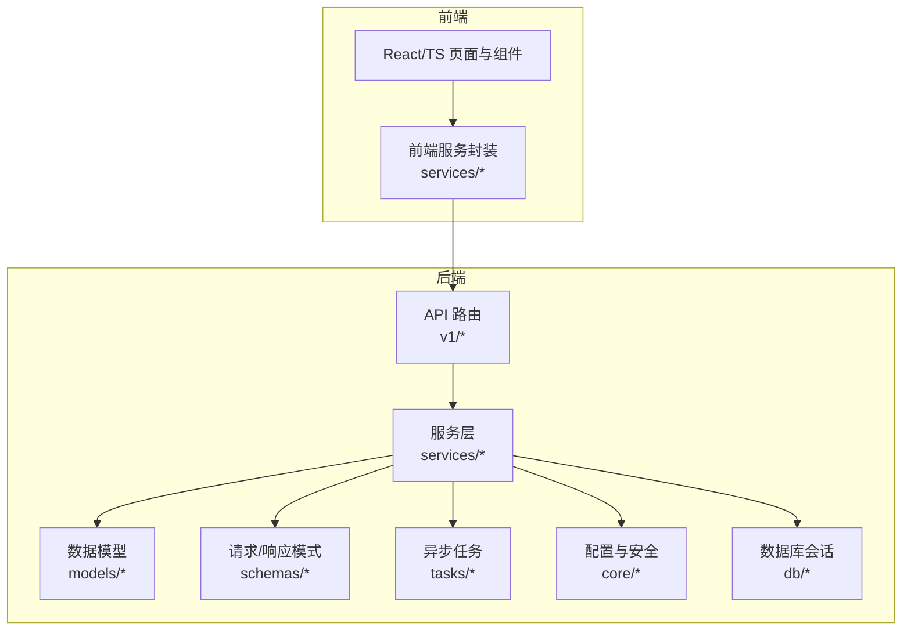
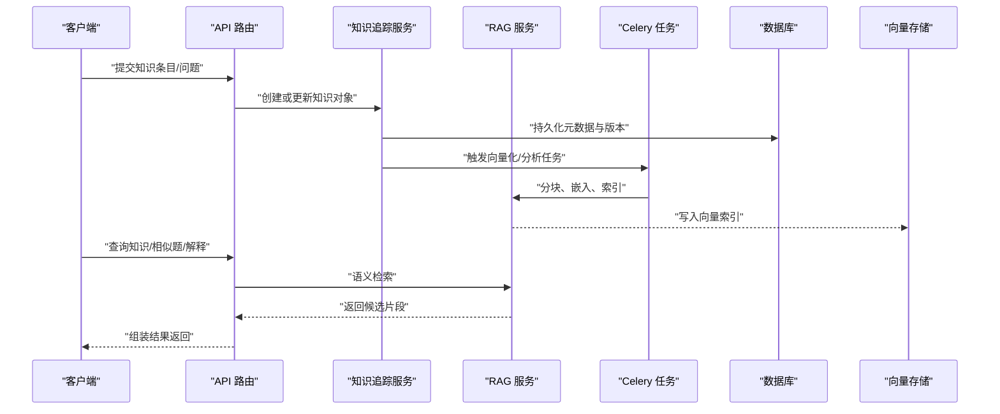
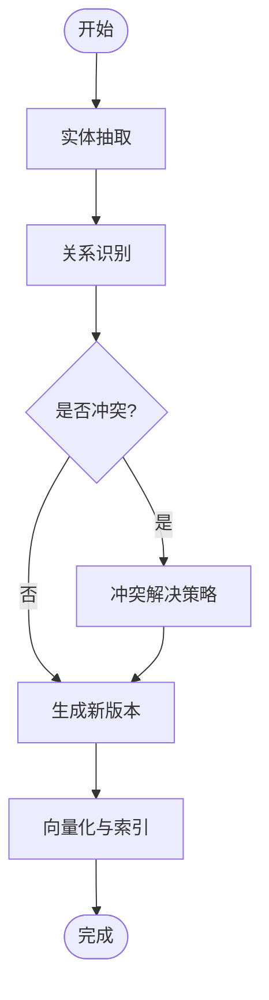
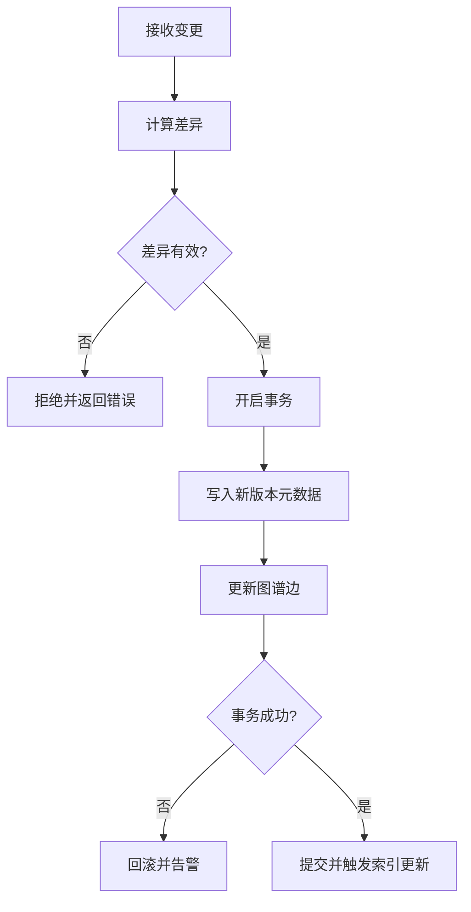
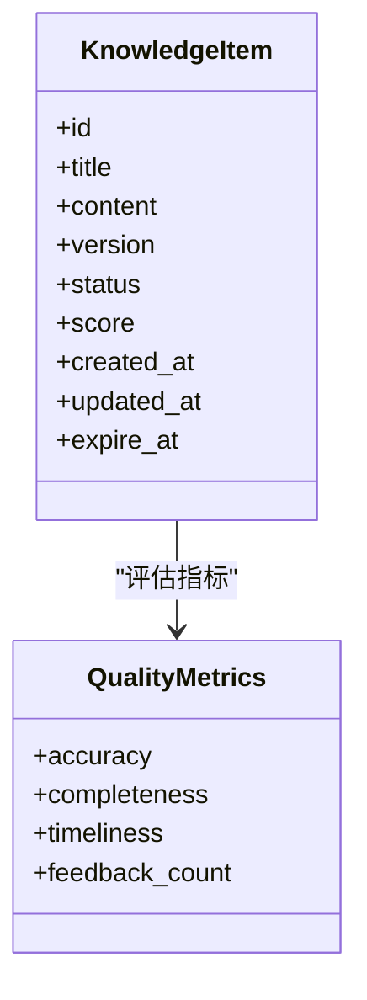
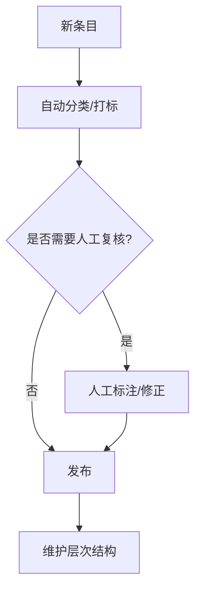
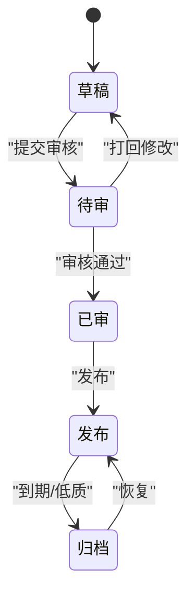
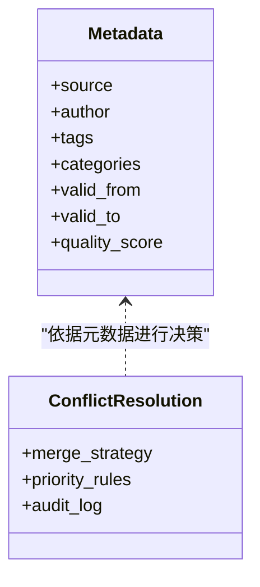
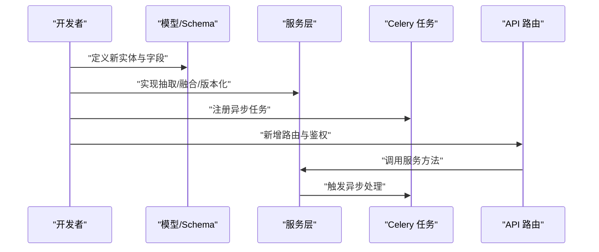
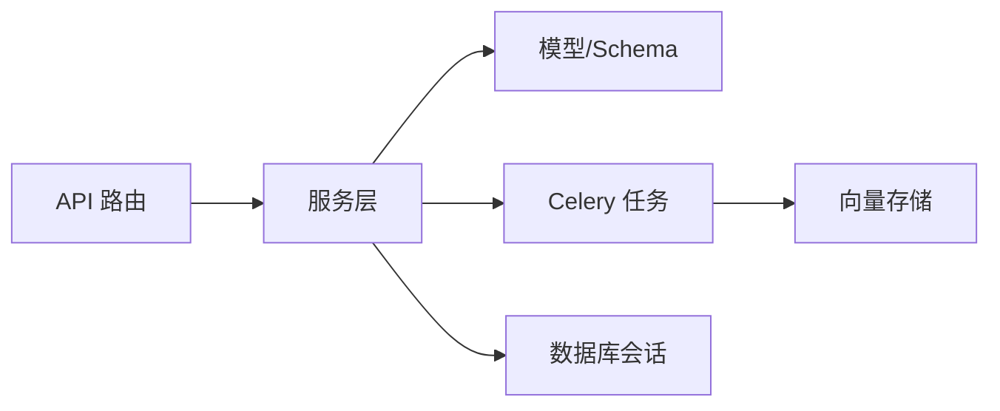

# 知识管理系统

<cite>
**本文引用的文件**   
- [backend/app/services/knowledge_tracker.py](file://backend/app/services/knowledge_tracker.py)
- [backend/app/services/rag_service.py](file://backend/app/services/rag_service.py)
- [backend/app/services/vector_tasks.py](file://backend/app/tasks/vector_tasks.py)
- [backend/app/models/question.py](file://backend/app/models/question.py)
- [backend/app/schemas/question.py](file://backend/app/schemas/question.py)
- [backend/app/api/v1/questions.py](file://backend/app/api/v1/questions.py)
- [backend/app/db/base.py](file://backend/app/db/base.py)
- [backend/app/db/session.py](file://backend/app/db/session.py)
- [backend/app/core/config.py](file://backend/app/core/config.py)
- [backend/app/core/deps.py](file://backend/app/core/deps.py)
- [backend/app/services/explain_service.py](file://backend/app/services/explain_service.py)
- [backend/app/services/composition_service.py](file://backend/app/services/composition_service.py)
- [backend/app/services/oral_service.py](file://backend/app/services/oral_service.py)
- [backend/app/services/ai_grader.py](file://backend/app/services/ai_grader.py)
- [backend/app/services/file_upload.py](file://backend/app/services/file_upload.py)
- [backend/app/services/pdf_renderer.py](file://backend/app/services/pdf_renderer.py)
- [backend/app/services/analytics_aggregator.py](file://backend/app/services/analytics_aggregator.py)
- [backend/app/services/similar_generator.py](file://backend/app/services/similar_generator.py)
- [backend/app/api/v1/analytics.py](file://backend/app/api/v1/analytics.py)
- [backend/app/api/v1/assignments.py](file://backend/app/api/v1/assignments.py)
- [backend/app/api/v1/conversations.py](file://backend/app/api/v1/conversations.py)
- [backend/app/api/v1/personality.py](file://backend/app/api/v1/personality.py)
- [backend/app/api/v1/auth.py](file://backend/app/api/v1/auth.py)
- [backend/app/api/v1/error_questions.py](file://backend/app/api/v1/error_questions.py)
- [backend/app/api/v1/ai_tutor.py](file://backend/app/api/v1/ai_tutor.py)
- [backend/app/api/v1/ai_questions.py](file://backend/app/api/v1/ai_questions.py)
- [backend/app/api/v1/compositions.py](file://backend/app/api/v1/compositions.py)
- [backend/app/api/v1/oral_assessments.py](file://backend/app/api/v1/oral_assessments.py)
- [backend/app/models/user.py](file://backend/app/models/user.py)
- [backend/app/models/assignment.py](file://backend/app/models/assignment.py)
- [backend/app/models/composition.py](file://backend/app/models/composition.py)
- [backend/app/models/conversation.py](file://backend/app/models/conversation.py)
- [backend/app/models/oral_assessment.py](file://backend/app/models/oral_assessment.py)
- [backend/app/models/personality.py](file://backend/app/models/personality.py)
- [backend/app/models/ai_question.py](file://backend/app/models/ai_question.py)
- [backend/app/schemas/user.py](file://backend/app/schemas/user.py)
- [backend/app/schemas/assignment.py](file://backend/app/schemas/assignment.py)
- [backend/app/schemas/composition.py](file://backend/app/schemas/composition.py)
- [backend/app/schemas/conversation.py](file://backend/app/schemas/conversation.py)
- [backend/app/schemas/oral_assessment.py](file://backend/app/schemas/oral_assessment.py)
- [backend/app/schemas/personality.py](file://backend/app/schemas/personality.py)
- [backend/app/schemas/ai.py](file://backend/app/schemas/ai.py)
- [backend/app/schemas/analytics.py](file://backend/app/schemas/analytics.py)
- [backend/app/schemas/ai_question.py](file://backend/app/schemas/ai_question.py)
- [backend/app/utils/main.py](file://backend/app/utils/main.py)
- [backend/app/core/security.py](file://backend/app/core/security.py)
- [backend/app/tasks/celery_app.py](file://backend/app/tasks/celery_app.py)
- [backend/app/tasks/dev_runner.py](file://backend/app/tasks/dev_runner.py)
- [backend/app/tasks/analysis_tasks.py](file://backend/app/tasks/analysis_tasks.py)
</cite>

## 目录
1. [简介](#简介)
2. [项目结构](#项目结构)
3. [核心组件](#核心组件)
4. [架构总览](#架构总览)
5. [详细组件分析](#详细组件分析)
6. [依赖关系分析](#依赖关系分析)
7. [性能考虑](#性能考虑)
8. [故障排查指南](#故障排查指南)
9. [结论](#结论)
10. [附录](#附录)

## 简介
本文件面向开发者与实施人员，系统化阐述知识管理系统的知识图谱构建、版本控制、质量评估、分类标签、生命周期管理与冲突解决机制，并给出扩展新知识与处理逻辑的实践建议。系统后端基于 FastAPI + SQLAlchemy + Celery 的异步任务体系，结合向量检索（RAG）与分析聚合能力，形成“结构化知识 + 非结构化内容”的统一治理框架。

## 项目结构
- 后端采用分层组织：API 层（路由）、服务层（业务逻辑）、模型层（ORM）、Schema 层（请求/响应校验）、数据库会话与配置、Celery 任务等。
- 前端为 React + TypeScript 应用，提供学习分析、作业管理、口语评测、AI 助教等页面与服务调用封装。
- 知识相关的关键路径集中在 services 与 tasks 目录，并通过 API 暴露对外能力。

图表来源
- [backend/app/api/v1/questions.py](file://backend/app/api/v1/questions.py)
- [backend/app/services/knowledge_tracker.py](file://backend/app/services/knowledge_tracker.py)
- [backend/app/services/rag_service.py](file://backend/app/services/rag_service.py)
- [backend/app/tasks/vector_tasks.py](file://backend/app/tasks/vector_tasks.py)
- [backend/app/db/base.py](file://backend/app/db/base.py)
- [backend/app/db/session.py](file://backend/app/db/session.py)
- [backend/app/core/config.py](file://backend/app/core/config.py)

章节来源
- [backend/app/api/v1/questions.py](file://backend/app/api/v1/questions.py)
- [backend/app/services/knowledge_tracker.py](file://backend/app/services/knowledge_tracker.py)
- [backend/app/services/rag_service.py](file://backend/app/services/rag_service.py)
- [backend/app/tasks/vector_tasks.py](file://backend/app/tasks/vector_tasks.py)
- [backend/app/db/base.py](file://backend/app/db/base.py)
- [backend/app/db/session.py](file://backend/app/db/session.py)
- [backend/app/core/config.py](file://backend/app/core/config.py)

## 核心组件
- 知识追踪与增量更新：通过知识追踪服务记录知识的创建、变更与关联，支撑版本化与一致性检查。
- RAG 检索与向量化：将文本片段进行分块、嵌入与索引，支持语义检索与答案生成。
- 异步任务编排：使用 Celery 执行耗时任务（如向量化、分析聚合），保障主流程响应性。
- 数据模型与 Schema：以 ORM 模型定义实体与关系，以 Pydantic Schema 约束输入输出。
- 分析与可视化：聚合学习行为与知识掌握度，输出统计与热力图数据。

章节来源
- [backend/app/services/knowledge_tracker.py](file://backend/app/services/knowledge_tracker.py)
- [backend/app/services/rag_service.py](file://backend/app/services/rag_service.py)
- [backend/app/tasks/vector_tasks.py](file://backend/app/tasks/vector_tasks.py)
- [backend/app/models/question.py](file://backend/app/models/question.py)
- [backend/app/schemas/question.py](file://backend/app/schemas/question.py)
- [backend/app/services/analytics_aggregator.py](file://backend/app/services/analytics_aggregator.py)

## 架构总览
系统围绕“知识对象”展开，涵盖抽取、融合、版本化、检索与应用。关键交互如下：

图表来源
- [backend/app/api/v1/questions.py](file://backend/app/api/v1/questions.py)
- [backend/app/services/knowledge_tracker.py](file://backend/app/services/knowledge_tracker.py)
- [backend/app/services/rag_service.py](file://backend/app/services/rag_service.py)
- [backend/app/tasks/vector_tasks.py](file://backend/app/tasks/vector_tasks.py)

## 详细组件分析

### 知识图谱构建流程（实体抽取、关系识别、知识融合）
- 实体抽取
  - 从题目、解析、对话与作业材料中抽取知识点实体，统一命名与归一化。
  - 抽取过程可借助 LLM 提示模板与工具函数，产出结构化实体列表。
- 关系识别
  - 基于领域规则与上下文语义，识别“前置-后置”“包含-被包含”“易错-关联”等关系。
  - 关系三元组与实体共同入库，形成图谱边。
- 知识融合
  - 对同义实体进行合并，冲突属性按策略（最新、权威源、多数投票）融合。
  - 融合后生成新版本，保留历史快照以供回滚与审计。

图表来源
- [backend/app/services/knowledge_tracker.py](file://backend/app/services/knowledge_tracker.py)
- [backend/app/services/rag_service.py](file://backend/app/services/rag_service.py)
- [backend/app/tasks/vector_tasks.py](file://backend/app/tasks/vector_tasks.py)

章节来源
- [backend/app/services/knowledge_tracker.py](file://backend/app/services/knowledge_tracker.py)
- [backend/app/services/rag_service.py](file://backend/app/services/rag_service.py)
- [backend/app/tasks/vector_tasks.py](file://backend/app/tasks/vector_tasks.py)

### 知识版本控制机制（增量更新、回滚策略、一致性保证）
- 增量更新
  - 仅对变更字段与新增关系进行追加，避免全量重写。
  - 版本号自增，附带变更摘要与操作者信息。
- 回滚策略
  - 支持按版本号回滚到任意稳定点；回滚前自动校验依赖完整性。
- 一致性保证
  - 事务内完成元数据与图谱边更新；失败时原子回滚。
  - 引入并发锁与幂等键，防止重复写入导致不一致。

图表来源
- [backend/app/services/knowledge_tracker.py](file://backend/app/services/knowledge_tracker.py)
- [backend/app/db/session.py](file://backend/app/db/session.py)
- [backend/app/db/base.py](file://backend/app/db/base.py)

章节来源
- [backend/app/services/knowledge_tracker.py](file://backend/app/services/knowledge_tracker.py)
- [backend/app/db/session.py](file://backend/app/db/session.py)
- [backend/app/db/base.py](file://backend/app/db/base.py)

### 知识质量评估体系（准确性评分、完整性检查、时效性管理）
- 准确性评分
  - 基于专家标注与模型置信度加权，结合用户反馈（点赞/纠错）动态调整。
- 完整性检查
  - 必填字段校验、关系连通性检测、缺失前置知识预警。
- 时效性管理
  - 设置有效期与刷新周期；过期条目进入复审队列，必要时降级或归档。

图表来源
- [backend/app/models/question.py](file://backend/app/models/question.py)
- [backend/app/schemas/question.py](file://backend/app/schemas/question.py)
- [backend/app/services/analytics_aggregator.py](file://backend/app/services/analytics_aggregator.py)

章节来源
- [backend/app/models/question.py](file://backend/app/models/question.py)
- [backend/app/schemas/question.py](file://backend/app/schemas/question.py)
- [backend/app/services/analytics_aggregator.py](file://backend/app/services/analytics_aggregator.py)

### 知识分类与标签系统（自动分类、人工标注、层次结构管理）
- 自动分类
  - 基于主题模型与向量相似度，将知识条目映射到预定义类目。
- 人工标注
  - 提供审核界面，允许编辑分类与标签，记录标注者与时序。
- 层次结构管理
  - 支持树形类目与多标签并存；维护父子关系与继承规则。

图表来源
- [backend/app/services/knowledge_tracker.py](file://backend/app/services/knowledge_tracker.py)
- [backend/app/api/v1/questions.py](file://backend/app/api/v1/questions.py)

章节来源
- [backend/app/services/knowledge_tracker.py](file://backend/app/services/knowledge_tracker.py)
- [backend/app/api/v1/questions.py](file://backend/app/api/v1/questions.py)

### 知识生命周期管理（创建、审核、发布、归档）
- 创建
  - 支持批量导入与单条录入，自动生成初始版本与默认标签。
- 审核
  - 工作流驱动，状态机推进（草稿→待审→已审→发布）。
- 发布
  - 发布后进入检索索引，供问答与推荐使用。
- 归档
  - 到期或低质条目归档，保留历史版本与审计日志。

图表来源
- [backend/app/services/knowledge_tracker.py](file://backend/app/services/knowledge_tracker.py)
- [backend/app/api/v1/questions.py](file://backend/app/api/v1/questions.py)

章节来源
- [backend/app/services/knowledge_tracker.py](file://backend/app/services/knowledge_tracker.py)
- [backend/app/api/v1/questions.py](file://backend/app/api/v1/questions.py)

### 知识冲突解决机制与元数据管理方案
- 冲突解决
  - 同义实体合并策略：优先权威源、最近更新时间、多数一致。
  - 关系冲突：以时间戳与来源可信度排序，保留高置信边。
- 元数据管理
  - 统一元数据模型（标题、描述、作者、来源、版本、标签、类目、有效期、质量分）。
  - 元数据变更审计日志，支持溯源与回溯。

图表来源
- [backend/app/services/knowledge_tracker.py](file://backend/app/services/knowledge_tracker.py)
- [backend/app/models/question.py](file://backend/app/models/question.py)

章节来源
- [backend/app/services/knowledge_tracker.py](file://backend/app/services/knowledge_tracker.py)
- [backend/app/models/question.py](file://backend/app/models/question.py)

### 面向开发者的扩展指南（新知识与处理逻辑）
- 新增知识类型
  - 在模型层定义新实体与字段，在 Schema 层定义请求/响应结构。
  - 在服务层实现抽取、融合与版本化逻辑，注册至知识追踪器。
- 扩展处理逻辑
  - 通过 Celery 任务扩展向量化、分析、渲染等耗时步骤。
  - 在 API 层增加路由，绑定服务方法，完成权限与鉴权。
- 最佳实践
  - 保持幂等与事务边界清晰；为所有变更添加审计字段。
  - 为新类型提供默认标签与类目映射，便于检索与展示。

图表来源
- [backend/app/models/question.py](file://backend/app/models/question.py)
- [backend/app/schemas/question.py](file://backend/app/schemas/question.py)
- [backend/app/services/knowledge_tracker.py](file://backend/app/services/knowledge_tracker.py)
- [backend/app/tasks/celery_app.py](file://backend/app/tasks/celery_app.py)
- [backend/app/api/v1/questions.py](file://backend/app/api/v1/questions.py)

章节来源
- [backend/app/models/question.py](file://backend/app/models/question.py)
- [backend/app/schemas/question.py](file://backend/app/schemas/question.py)
- [backend/app/services/knowledge_tracker.py](file://backend/app/services/knowledge_tracker.py)
- [backend/app/tasks/celery_app.py](file://backend/app/tasks/celery_app.py)
- [backend/app/api/v1/questions.py](file://backend/app/api/v1/questions.py)

## 依赖关系分析
- 模块耦合
  - API 层依赖服务层；服务层依赖模型与 Schema；服务层通过 Celery 任务与外部向量库交互。
- 外部依赖
  - 数据库会话与迁移；Celery 消息队列；向量检索与 LLM 推理服务。
- 潜在循环
  - 服务层应避免反向依赖 API；任务模块仅依赖服务接口，不直接访问路由。

图表来源
- [backend/app/api/v1/questions.py](file://backend/app/api/v1/questions.py)
- [backend/app/services/knowledge_tracker.py](file://backend/app/services/knowledge_tracker.py)
- [backend/app/tasks/celery_app.py](file://backend/app/tasks/celery_app.py)
- [backend/app/db/session.py](file://backend/app/db/session.py)

章节来源
- [backend/app/api/v1/questions.py](file://backend/app/api/v1/questions.py)
- [backend/app/services/knowledge_tracker.py](file://backend/app/services/knowledge_tracker.py)
- [backend/app/tasks/celery_app.py](file://backend/app/tasks/celery_app.py)
- [backend/app/db/session.py](file://backend/app/db/session.py)

## 性能考虑
- 向量化与索引
  - 批量分块与并行嵌入，增量索引更新，避免全量重建。
- 缓存与预热
  - 高频知识热点缓存，发布后预热索引，降低首查延迟。
- 异步与限流
  - 重任务走 Celery；API 层加限流与超时保护，保障稳定性。
- 存储优化
  - 大文本分片存储，元数据与正文分离；冷热数据分层。

[本节为通用指导，无需特定文件引用]

## 故障排查指南
- 常见问题
  - 向量化失败：检查任务队列、向量库连接与分块大小。
  - 版本不一致：核对事务日志与幂等键，确认并发锁生效。
  - 检索结果偏差：调整相似度阈值与权重，补充高质量样本。
- 定位手段
  - 查看任务执行日志与错误堆栈；启用调试模式输出中间结果。
  - 使用分析聚合接口验证数据一致性与覆盖率。

章节来源
- [backend/app/tasks/vector_tasks.py](file://backend/app/tasks/vector_tasks.py)
- [backend/app/services/analytics_aggregator.py](file://backend/app/services/analytics_aggregator.py)

## 结论
本系统以“知识对象”为核心，贯穿抽取、融合、版本化、检索与应用全流程，结合异步任务与质量评估，形成可扩展、可治理的知识管理体系。通过清晰的职责划分与标准化接口，开发者可快速扩展新的知识类型与处理逻辑，满足多样化教学场景需求。

## 附录
- 相关 API 与服务参考
  - 题目与知识条目：questions 路由与 question 模型/Schema
  - 分析与可视化：analytics 路由与聚合服务
  - 作业与对话：assignments、conversations 路由与对应模型/Schema
  - 人格与个性化：personality 路由与模型/Schema
  - 认证与安全：auth 路由与安全模块
  - AI 助教与题目生成：ai_tutor、ai_questions 路由与 AI 服务
  - 作文与口语：compositions、oral_assessments 路由与对应服务
  - 文件与 PDF：file_upload、pdf_renderer 服务
  - 错题与相似题：error_questions、similar_generator 服务

章节来源
- [backend/app/api/v1/questions.py](file://backend/app/api/v1/questions.py)
- [backend/app/api/v1/analytics.py](file://backend/app/api/v1/analytics.py)
- [backend/app/api/v1/assignments.py](file://backend/app/api/v1/assignments.py)
- [backend/app/api/v1/conversations.py](file://backend/app/api/v1/conversations.py)
- [backend/app/api/v1/personality.py](file://backend/app/api/v1/personality.py)
- [backend/app/api/v1/auth.py](file://backend/app/api/v1/auth.py)
- [backend/app/api/v1/ai_tutor.py](file://backend/app/api/v1/ai_tutor.py)
- [backend/app/api/v1/ai_questions.py](file://backend/app/api/v1/ai_questions.py)
- [backend/app/api/v1/compositions.py](file://backend/app/api/v1/compositions.py)
- [backend/app/api/v1/oral_assessments.py](file://backend/app/api/v1/oral_assessments.py)
- [backend/app/api/v1/error_questions.py](file://backend/app/api/v1/error_questions.py)
- [backend/app/services/explain_service.py](file://backend/app/services/explain_service.py)
- [backend/app/services/composition_service.py](file://backend/app/services/composition_service.py)
- [backend/app/services/oral_service.py](file://backend/app/services/oral_service.py)
- [backend/app/services/ai_grader.py](file://backend/app/services/ai_grader.py)
- [backend/app/services/file_upload.py](file://backend/app/services/file_upload.py)
- [backend/app/services/pdf_renderer.py](file://backend/app/services/pdf_renderer.py)
- [backend/app/services/similar_generator.py](file://backend/app/services/similar_generator.py)
- [backend/app/models/user.py](file://backend/app/models/user.py)
- [backend/app/models/assignment.py](file://backend/app/models/assignment.py)
- [backend/app/models/composition.py](file://backend/app/models/composition.py)
- [backend/app/models/conversation.py](file://backend/app/models/conversation.py)
- [backend/app/models/oral_assessment.py](file://backend/app/models/oral_assessment.py)
- [backend/app/models/personality.py](file://backend/app/models/personality.py)
- [backend/app/models/ai_question.py](file://backend/app/models/ai_question.py)
- [backend/app/schemas/user.py](file://backend/app/schemas/user.py)
- [backend/app/schemas/assignment.py](file://backend/app/schemas/assignment.py)
- [backend/app/schemas/composition.py](file://backend/app/schemas/composition.py)
- [backend/app/schemas/conversation.py](file://backend/app/schemas/conversation.py)
- [backend/app/schemas/oral_assessment.py](file://backend/app/schemas/oral_assessment.py)
- [backend/app/schemas/personality.py](file://backend/app/schemas/personality.py)
- [backend/app/schemas/ai.py](file://backend/app/schemas/ai.py)
- [backend/app/schemas/analytics.py](file://backend/app/schemas/analytics.py)
- [backend/app/schemas/ai_question.py](file://backend/app/schemas/ai_question.py)
- [backend/app/core/security.py](file://backend/app/core/security.py)
- [backend/app/utils/main.py](file://backend/app/utils/main.py)