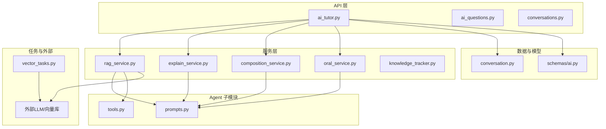
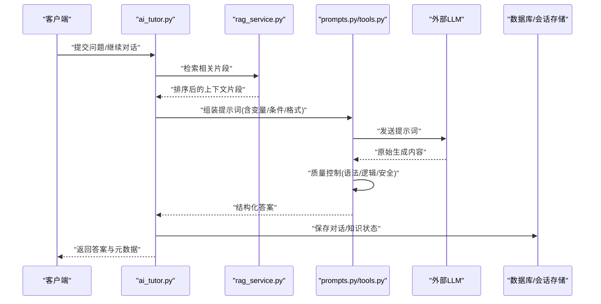
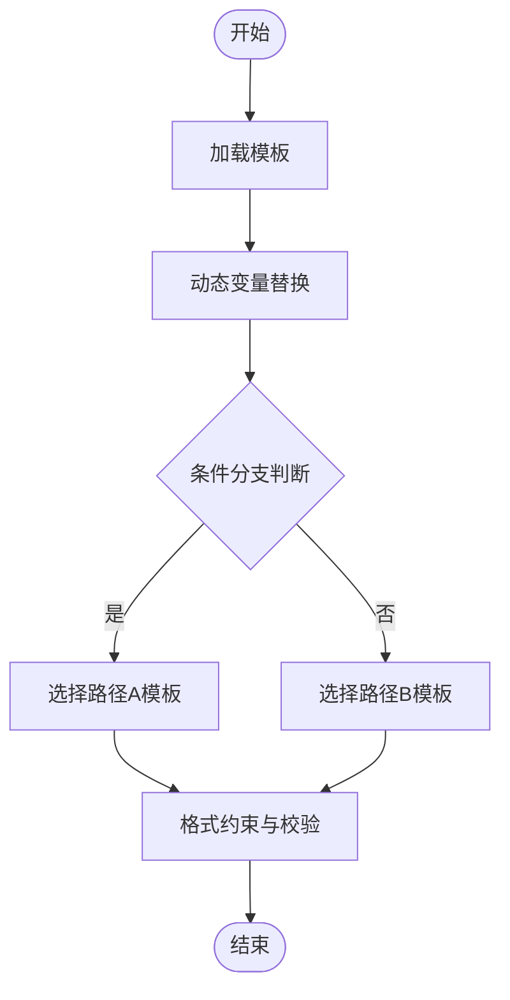
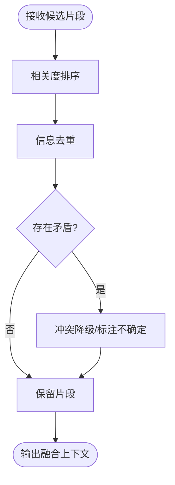
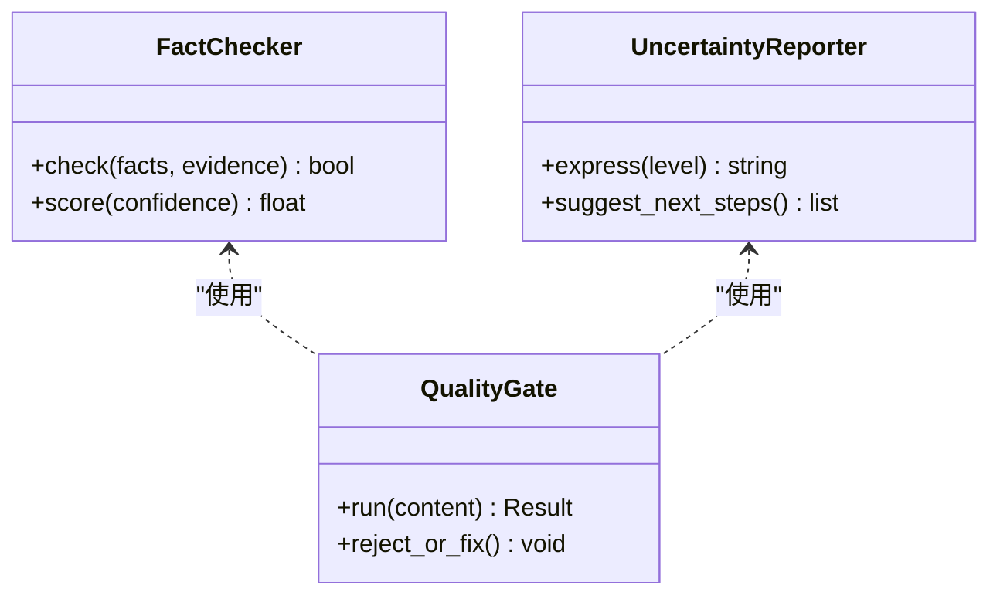
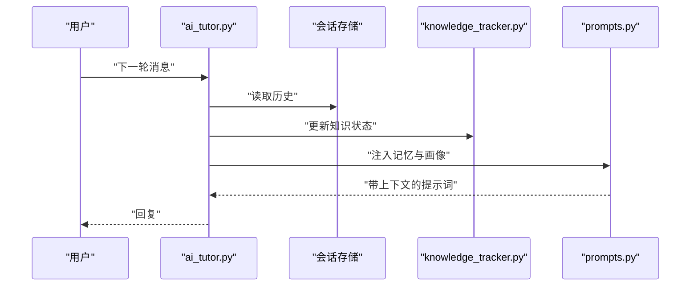
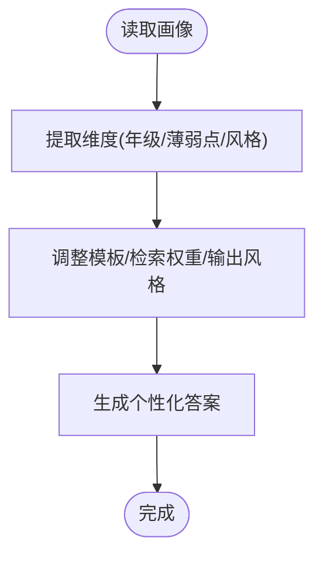
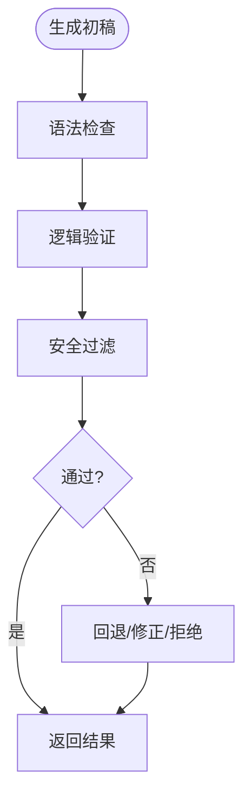
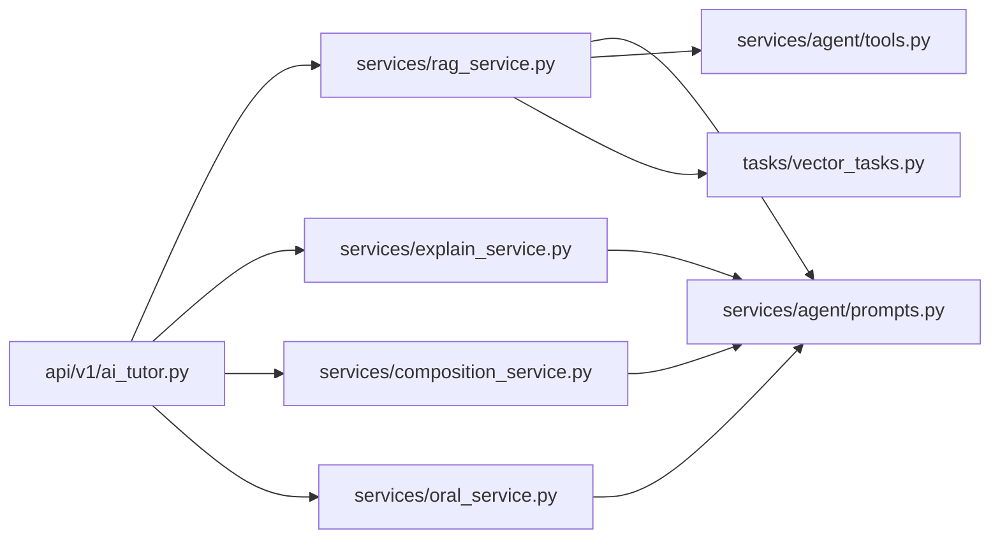

# 答案生成器

<cite>
**本文引用的文件**   
- [backend/app/services/agent/prompts.py](file://backend/app/services/agent/prompts.py)
- [backend/app/services/agent/tools.py](file://backend/app/services/agent/tools.py)
- [backend/app/services/rag_service.py](file://backend/app/services/rag_service.py)
- [backend/app/api/v1/ai_tutor.py](file://backend/app/api/v1/ai_tutor.py)
- [backend/app/schemas/ai.py](file://backend/app/schemas/ai.py)
- [backend/app/models/conversation.py](file://backend/app/models/conversation.py)
- [backend/app/services/explain_service.py](file://backend/app/services/explain_service.py)
- [backend/app/services/composition_service.py](file://backend/app/services/composition_service.py)
- [backend/app/services/oral_service.py](file://backend/app/services/oral_service.py)
- [backend/app/services/knowledge_tracker.py](file://backend/app/services/knowledge_tracker.py)
- [backend/app/tasks/vector_tasks.py](file://backend/app/tasks/vector_tasks.py)
</cite>

## 目录
1. [简介](#简介)
2. [项目结构](#项目结构)
3. [核心组件](#核心组件)
4. [架构总览](#架构总览)
5. [详细组件分析](#详细组件分析)
6. [依赖关系分析](#依赖关系分析)
7. [性能考量](#性能考量)
8. [故障排查指南](#故障排查指南)
9. [结论](#结论)
10. [附录](#附录)

## 简介
本文件面向开发者，系统化阐述“答案生成器”的设计与实现，覆盖以下关键主题：
- 提示词模板设计系统：动态变量替换、条件分支、多格式输出
- 上下文融合机制：相关度排序、信息去重、矛盾检测
- 幻觉抑制技术：事实核查、置信度评估、不确定性表达
- 多轮对话管理：上下文维护、话题切换、记忆机制
- 个性化生成策略：用户画像适配、难度调节、风格定制
- 生成质量控制：语法检查、逻辑验证、安全过滤
- 自定义规则与评估标准：如何扩展生成规则与评测指标

## 项目结构
后端采用分层架构：API 层暴露接口，服务层封装业务逻辑，Agent 子模块负责提示词编排与工具调用，RAG 服务提供检索增强能力，任务队列处理向量索引等异步工作。前端通过 API 与服务交互，展示对话与结果。

图表来源
- [backend/app/api/v1/ai_tutor.py](file://backend/app/api/v1/ai_tutor.py)
- [backend/app/services/rag_service.py](file://backend/app/services/rag_service.py)
- [backend/app/services/agent/prompts.py](file://backend/app/services/agent/prompts.py)
- [backend/app/services/agent/tools.py](file://backend/app/services/agent/tools.py)
- [backend/app/models/conversation.py](file://backend/app/models/conversation.py)
- [backend/app/schemas/ai.py](file://backend/app/schemas/ai.py)
- [backend/app/tasks/vector_tasks.py](file://backend/app/tasks/vector_tasks.py)

章节来源
- [backend/app/api/v1/ai_tutor.py](file://backend/app/api/v1/ai_tutor.py)
- [backend/app/services/rag_service.py](file://backend/app/services/rag_service.py)
- [backend/app/services/agent/prompts.py](file://backend/app/services/agent/prompts.py)
- [backend/app/services/agent/tools.py](file://backend/app/services/agent/tools.py)
- [backend/app/models/conversation.py](file://backend/app/models/conversation.py)
- [backend/app/schemas/ai.py](file://backend/app/schemas/ai.py)
- [backend/app/tasks/vector_tasks.py](file://backend/app/tasks/vector_tasks.py)

## 核心组件
- 提示词模板系统（prompts.py）：集中管理模板、变量注入、条件分支与输出格式约束，为各服务提供一致的提示构造能力。
- 工具集（tools.py）：封装可被 Agent 调用的函数式能力（如检索、计算、格式化），支持参数校验与错误返回。
- RAG 服务（rag_service.py）：将用户问题与知识库进行语义匹配，执行相关度排序、去重与冲突检测，产出结构化上下文片段。
- 解释服务（explain_service.py）：基于上下文生成讲解内容，内置质量校验与安全过滤。
- 作文服务（composition_service.py）：面向写作任务的生成与评分辅助。
- 口语服务（oral_service.py）：面向口语练习的生成与反馈。
- 知识追踪（knowledge_tracker.py）：记录学习轨迹，支撑个性化策略。
- 向量任务（vector_tasks.py）：后台构建与维护向量索引，提升检索效率。

章节来源
- [backend/app/services/agent/prompts.py](file://backend/app/services/agent/prompts.py)
- [backend/app/services/agent/tools.py](file://backend/app/services/agent/tools.py)
- [backend/app/services/rag_service.py](file://backend/app/services/rag_service.py)
- [backend/app/services/explain_service.py](file://backend/app/services/explain_service.py)
- [backend/app/services/composition_service.py](file://backend/app/services/composition_service.py)
- [backend/app/services/oral_service.py](file://backend/app/services/oral_service.py)
- [backend/app/services/knowledge_tracker.py](file://backend/app/services/knowledge_tracker.py)
- [backend/app/tasks/vector_tasks.py](file://backend/app/tasks/vector_tasks.py)

## 架构总览
答案生成器的端到端流程如下：
- 客户端发起请求（例如提问或继续对话）
- API 路由解析并校验入参
- 服务层组装上下文（RAG 检索 + 历史对话 + 用户画像）
- Agent 根据模板生成提示词，调用工具与 LLM
- 生成后执行质量控制（语法、逻辑、安全）
- 持久化对话与知识状态，返回结构化响应

图表来源
- [backend/app/api/v1/ai_tutor.py](file://backend/app/api/v1/ai_tutor.py)
- [backend/app/services/rag_service.py](file://backend/app/services/rag_service.py)
- [backend/app/services/agent/prompts.py](file://backend/app/services/agent/prompts.py)
- [backend/app/services/agent/tools.py](file://backend/app/services/agent/tools.py)

## 详细组件分析

### 提示词模板设计系统
- 动态变量替换：模板中定义占位符，运行时由上下文、用户画像、题目信息等填充，确保每次生成的针对性。
- 条件分支：依据输入特征（如学科、年级、是否错题）选择不同模板路径，避免无关信息干扰。
- 多格式输出：统一约束输出结构（如 JSON Schema 或分段标记），便于下游解析与渲染。

图表来源
- [backend/app/services/agent/prompts.py](file://backend/app/services/agent/prompts.py)

章节来源
- [backend/app/services/agent/prompts.py](file://backend/app/services/agent/prompts.py)

### 上下文融合机制
- 相关度排序：对候选片段按语义相似度与领域相关性打分排序，优先保留高相关片段。
- 信息去重：基于文本相似度与主题聚类去除冗余，控制上下文长度与噪声。
- 矛盾检测：对比片段间的关键断言，识别不一致处并降级或剔除冲突信息，必要时在回答中标注不确定性。

图表来源
- [backend/app/services/rag_service.py](file://backend/app/services/rag_service.py)

章节来源
- [backend/app/services/rag_service.py](file://backend/app/services/rag_service.py)

### 幻觉抑制技术
- 事实核查：将生成内容与检索到的权威片段进行比对，发现偏离时触发修正或降权。
- 置信度评估：结合检索得分、片段一致性与模型自置信，给出整体可信度区间。
- 不确定性表达：当证据不足或存在冲突时，明确告知用户当前结论的不确定性并提供进一步建议。

图表来源
- [backend/app/services/explain_service.py](file://backend/app/services/explain_service.py)
- [backend/app/services/rag_service.py](file://backend/app/services/rag_service.py)

章节来源
- [backend/app/services/explain_service.py](file://backend/app/services/explain_service.py)
- [backend/app/services/rag_service.py](file://backend/app/services/rag_service.py)

### 多轮对话管理
- 上下文维护：聚合历史消息、关键知识点与用户偏好，形成稳定的对话记忆。
- 话题切换：识别新话题信号，自动调整检索范围与模板路径，避免旧话题污染。
- 记忆机制：长期记忆（知识图谱/画像）与短期记忆（最近N轮）协同，保证连贯性与个性化。

图表来源
- [backend/app/api/v1/ai_tutor.py](file://backend/app/api/v1/ai_tutor.py)
- [backend/app/models/conversation.py](file://backend/app/models/conversation.py)
- [backend/app/services/knowledge_tracker.py](file://backend/app/services/knowledge_tracker.py)
- [backend/app/services/agent/prompts.py](file://backend/app/services/agent/prompts.py)

章节来源
- [backend/app/api/v1/ai_tutor.py](file://backend/app/api/v1/ai_tutor.py)
- [backend/app/models/conversation.py](file://backend/app/models/conversation.py)
- [backend/app/services/knowledge_tracker.py](file://backend/app/services/knowledge_tracker.py)
- [backend/app/services/agent/prompts.py](file://backend/app/services/agent/prompts.py)

### 个性化生成策略
- 用户画像适配：依据年级、薄弱点、兴趣标签调整示例与解释深度。
- 难度调节：根据掌握度曲线动态调整题目与讲解复杂度。
- 风格定制：支持鼓励型、严谨型、启发型等不同风格，提升学习体验。

图表来源
- [backend/app/services/knowledge_tracker.py](file://backend/app/services/knowledge_tracker.py)
- [backend/app/services/agent/prompts.py](file://backend/app/services/agent/prompts.py)

章节来源
- [backend/app/services/knowledge_tracker.py](file://backend/app/services/knowledge_tracker.py)
- [backend/app/services/agent/prompts.py](file://backend/app/services/agent/prompts.py)

### 生成质量控制
- 语法检查：语言规范性校验，纠正错别字与语病。
- 逻辑验证：论证链条完整性检查，避免跳跃性推理。
- 安全过滤：敏感词与不当内容拦截，保障合规。

图表来源
- [backend/app/services/explain_service.py](file://backend/app/services/explain_service.py)
- [backend/app/services/composition_service.py](file://backend/app/services/composition_service.py)
- [backend/app/services/oral_service.py](file://backend/app/services/oral_service.py)

章节来源
- [backend/app/services/explain_service.py](file://backend/app/services/explain_service.py)
- [backend/app/services/composition_service.py](file://backend/app/services/composition_service.py)
- [backend/app/services/oral_service.py](file://backend/app/services/oral_service.py)

### 工具与集成点
- 工具集（tools.py）：提供检索、格式化、计算等原子能力，供 Agent 按需调用。
- 向量任务（vector_tasks.py）：后台构建索引，提升检索吞吐与稳定性。
- 数据模型与模式（conversation.py、schemas/ai.py）：规范数据结构与校验规则，保障一致性。

章节来源
- [backend/app/services/agent/tools.py](file://backend/app/services/agent/tools.py)
- [backend/app/tasks/vector_tasks.py](file://backend/app/tasks/vector_tasks.py)
- [backend/app/models/conversation.py](file://backend/app/models/conversation.py)
- [backend/app/schemas/ai.py](file://backend/app/schemas/ai.py)

## 依赖关系分析
- 低耦合高内聚：API 层仅协调服务；服务层专注业务；Agent 聚焦提示词与工具编排；RAG 专注检索增强。
- 外部依赖：外部 LLM 与向量库通过服务与任务模块接入，便于替换与扩展。
- 潜在循环：应避免服务层直接反向依赖 API 层；当前以单向调用为主。

图表来源
- [backend/app/api/v1/ai_tutor.py](file://backend/app/api/v1/ai_tutor.py)
- [backend/app/services/rag_service.py](file://backend/app/services/rag_service.py)
- [backend/app/services/agent/prompts.py](file://backend/app/services/agent/prompts.py)
- [backend/app/services/agent/tools.py](file://backend/app/services/agent/tools.py)
- [backend/app/tasks/vector_tasks.py](file://backend/app/tasks/vector_tasks.py)

章节来源
- [backend/app/api/v1/ai_tutor.py](file://backend/app/api/v1/ai_tutor.py)
- [backend/app/services/rag_service.py](file://backend/app/services/rag_service.py)
- [backend/app/services/agent/prompts.py](file://backend/app/services/agent/prompts.py)
- [backend/app/services/agent/tools.py](file://backend/app/services/agent/tools.py)
- [backend/app/tasks/vector_tasks.py](file://backend/app/tasks/vector_tasks.py)

## 性能考量
- 检索优化：利用向量任务预构建索引，减少在线延迟；对热点知识做缓存。
- 上下文裁剪：严格限制上下文长度，优先保留高相关片段，降低 LLM 成本与时延。
- 并行与异步：非阻塞任务（如索引构建、统计聚合）放入任务队列，避免阻塞主链路。
- 流式输出：对长回答采用流式返回，提升用户体验。

[本节为通用指导，不直接分析具体文件]

## 故障排查指南
- 常见问题定位
  - 检索不到相关内容：检查向量索引是否构建成功、查询语句是否合理。
  - 生成内容不稳定：检查模板变量是否完整、条件分支是否正确、上下文是否存在矛盾。
  - 安全拦截误报：审查过滤规则与白名单配置。
- 日志与监控
  - 记录关键步骤耗时与失败原因，便于快速定位瓶颈与异常。
- 回滚与降级
  - 当外部 LLM 不可用时，启用降级策略（如简化模板、缩短上下文）。

章节来源
- [backend/app/tasks/vector_tasks.py](file://backend/app/tasks/vector_tasks.py)
- [backend/app/services/rag_service.py](file://backend/app/services/rag_service.py)
- [backend/app/services/agent/prompts.py](file://backend/app/services/agent/prompts.py)

## 结论
本答案生成器以“提示词模板 + 工具编排 + RAG 增强 + 质量控制”为核心，实现了高质量、可控、个性化的生成能力。通过清晰的层次划分与可扩展的接口，开发者可以便捷地定制生成规则与评估标准，持续优化效果与性能。

[本节为总结性内容，不直接分析具体文件]

## 附录
- 自定义生成规则
  - 新增模板：在提示词模板系统中添加新模板与变量映射，并在条件分支中注册路径。
  - 新增工具：在工具集中实现函数式能力，完善参数校验与错误码，供 Agent 调用。
  - 扩展质量控制：在质量控制流水线中插入新的检查项（如领域术语一致性）。
- 自定义评估标准
  - 定义指标：准确性、可读性、安全性、个性化程度等。
  - 离线评测：基于历史对话与标准答案集进行批量评估，沉淀基线。
  - 在线监控：采集关键指标，设置告警阈值，持续迭代。

章节来源
- [backend/app/services/agent/prompts.py](file://backend/app/services/agent/prompts.py)
- [backend/app/services/agent/tools.py](file://backend/app/services/agent/tools.py)
- [backend/app/services/explain_service.py](file://backend/app/services/explain_service.py)