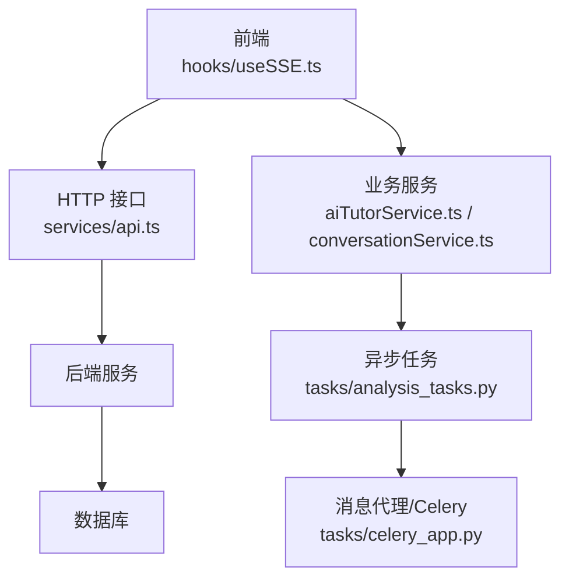
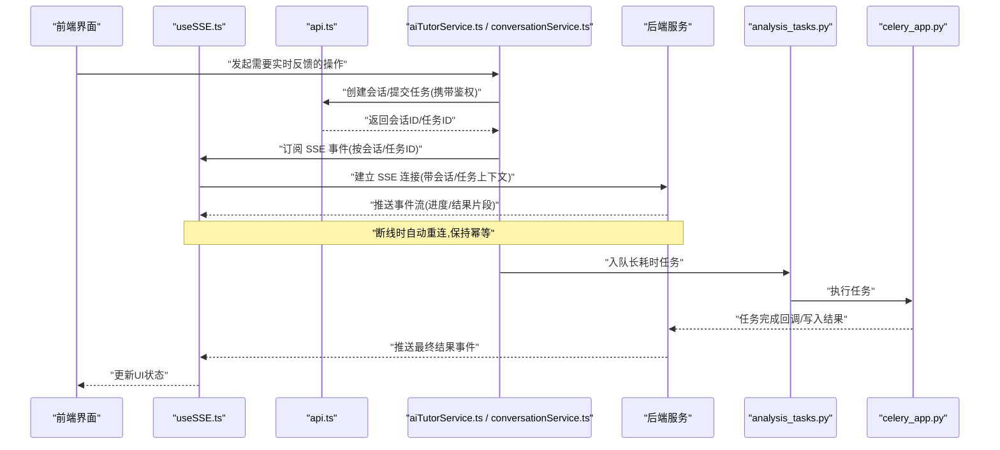
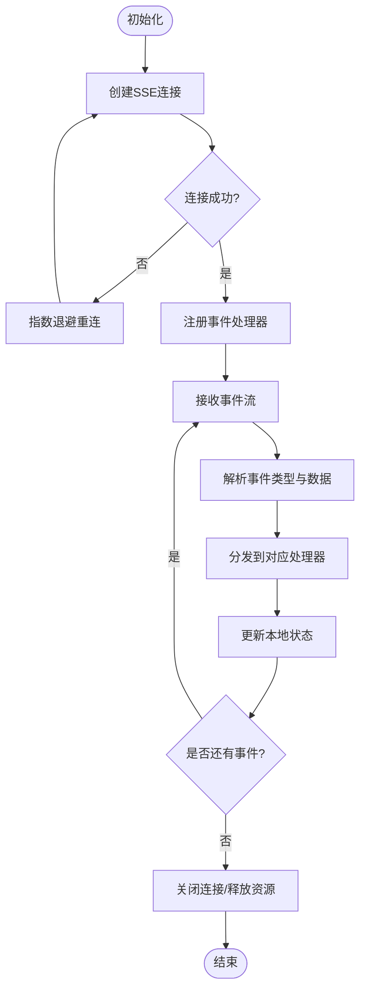
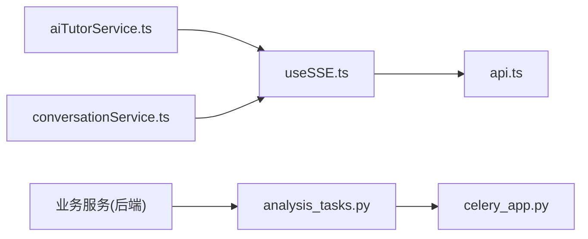

# 实时通信机制

<cite>
**本文引用的文件**
- [useSSE.ts](file://frontend/src/hooks/useSSE.ts)
- [api.ts](file://frontend/src/services/api.ts)
- [aiTutorService.ts](file://frontend/src/services/aiTutorService.ts)
- [conversationService.ts](file://frontend/src/services/conversationService.ts)
- [analysis_tasks.py](file://backend/app/tasks/analysis_tasks.py)
- [celery_app.py](file://backend/app/tasks/celery_app.py)
- [config.py](file://backend/app/core/config.py)
</cite>

## 目录
1. [简介](#简介)
2. [项目结构](#项目结构)
3. [核心组件](#核心组件)
4. [架构总览](#架构总览)
5. [详细组件分析](#详细组件分析)
6. [依赖关系分析](#依赖关系分析)
7. [性能考虑](#性能考虑)
8. [故障排查指南](#故障排查指南)
9. [结论](#结论)
10. [附录](#附录)

## 简介
本文件面向开发者，系统化梳理并文档化本项目中的实时通信机制。重点覆盖：
- Server-Sent Events（SSE）在后端与前端的工作原理、连接建立、事件推送与断线重连策略
- 前端消息队列、状态同步与错误处理
- 消息协议设计（格式、事件类型、传输优化）
- 并发控制与流量限制（请求限流、连接池管理、资源清理）
- 性能优化技巧（压缩、批量、缓存）
- 调试工具与监控指标配置
- 如何扩展新的实时功能与事件类型

## 项目结构
与实时通信相关的代码主要分布在前后端：
- 前端
  - hooks/useSSE.ts：封装 SSE 客户端能力（连接、事件订阅、重连、错误处理）
  - services/api.ts：HTTP 基础封装（鉴权、重试、超时等）
  - services/aiTutorService.ts、services/conversationService.ts：业务层调用，触发 SSE 或异步任务
- 后端
  - tasks/analysis_tasks.py：异步任务定义（如长耗时分析），可配合 Celery 执行
  - tasks/celery_app.py：Celery 应用初始化与配置
  - core/config.py：全局配置（含可能影响实时性的参数）

图表来源
- [useSSE.ts](file://frontend/src/hooks/useSSE.ts)
- [api.ts](file://frontend/src/services/api.ts)
- [aiTutorService.ts](file://frontend/src/services/aiTutorService.ts)
- [conversationService.ts](file://frontend/src/services/conversationService.ts)
- [analysis_tasks.py](file://backend/app/tasks/analysis_tasks.py)
- [celery_app.py](file://backend/app/tasks/celery_app.py)

章节来源
- [useSSE.ts](file://frontend/src/hooks/useSSE.ts)
- [api.ts](file://frontend/src/services/api.ts)
- [aiTutorService.ts](file://frontend/src/services/aiTutorService.ts)
- [conversationService.ts](file://frontend/src/services/conversationService.ts)
- [analysis_tasks.py](file://backend/app/tasks/analysis_tasks.py)
- [celery_app.py](file://backend/app/tasks/celery_app.py)
- [config.py](file://backend/app/core/config.py)

## 核心组件
- SSE 客户端（前端）
  - 负责发起 SSE 连接、解析事件流、维护连接状态、自动重连、错误恢复
  - 提供统一的订阅/取消订阅接口，供业务组件使用
- HTTP 基础封装（前端）
  - 统一请求头、鉴权注入、超时与重试策略
  - 为触发 SSE 的初始请求提供稳定保障
- 业务服务（前端）
  - aiTutorService.ts、conversationService.ts：将用户操作转换为对后端的调用，必要时启动 SSE 监听
- 异步任务（后端）
  - analysis_tasks.py：承载长耗时计算，完成后通过消息通道或回调通知前端（结合 SSE 或轮询）
- Celery 应用（后端）
  - celery_app.py：任务调度与执行环境配置

章节来源
- [useSSE.ts](file://frontend/src/hooks/useSSE.ts)
- [api.ts](file://frontend/src/services/api.ts)
- [aiTutorService.ts](file://frontend/src/services/aiTutorService.ts)
- [conversationService.ts](file://frontend/src/services/conversationService.ts)
- [analysis_tasks.py](file://backend/app/tasks/analysis_tasks.py)
- [celery_app.py](file://backend/app/tasks/celery_app.py)

## 架构总览
下图展示了从前端到后端的端到端实时通信流程，包括 SSE 连接、事件推送与异步任务协作。

图表来源
- [useSSE.ts](file://frontend/src/hooks/useSSE.ts)
- [api.ts](file://frontend/src/services/api.ts)
- [aiTutorService.ts](file://frontend/src/services/aiTutorService.ts)
- [conversationService.ts](file://frontend/src/services/conversationService.ts)
- [analysis_tasks.py](file://backend/app/tasks/analysis_tasks.py)
- [celery_app.py](file://backend/app/tasks/celery_app.py)

## 详细组件分析

### SSE 客户端（useSSE.ts）
- 职责
  - 建立与维护 SSE 连接
  - 解析事件流，分发至已注册的处理器
  - 实现指数退避重连、心跳检测、错误恢复
  - 暴露订阅/取消订阅接口，避免内存泄漏
- 关键行为
  - 连接生命周期：创建 -> 就绪 -> 接收事件 -> 关闭/异常 -> 重连
  - 事件模型：通用事件类型 + 业务事件类型（由业务服务约定）
  - 状态同步：内部维护连接状态、最近一次事件序列号（用于断点续传）
  - 错误处理：网络错误、服务端错误、超时、重复事件去重
- 扩展点
  - 新增事件类型：在事件路由中注册新处理器
  - 自定义重连策略：调整退避参数与最大重试次数
  - 日志与埋点：接入前端监控

图表来源
- [useSSE.ts](file://frontend/src/hooks/useSSE.ts)

章节来源
- [useSSE.ts](file://frontend/src/hooks/useSSE.ts)

### HTTP 基础封装（api.ts）
- 职责
  - 统一请求拦截器：注入鉴权头、追踪ID、超时设置
  - 响应拦截器：统一错误码处理、重试策略
  - 为 SSE 初始请求提供稳定的 HTTP 通道
- 关键点
  - 鉴权：确保 SSE 连接具备身份上下文
  - 重试：针对瞬时错误的幂等重试
  - 超时：防止长时间挂起占用资源

章节来源
- [api.ts](file://frontend/src/services/api.ts)

### 业务服务（aiTutorService.ts / conversationService.ts）
- 职责
  - 将用户意图转化为后端调用（创建会话、提交问题、获取结果）
  - 协调 SSE 订阅与任务入队，保证状态一致性
- 关键点
  - 会话/任务 ID 贯穿整个流程，作为 SSE 事件路由键
  - 失败回退：当 SSE 不可用时降级为轮询或提示重试
  - 幂等性：同一会话/任务多次触发不会产生副作用

章节来源
- [aiTutorService.ts](file://frontend/src/services/aiTutorService.ts)
- [conversationService.ts](file://frontend/src/services/conversationService.ts)

### 异步任务与 Celery（analysis_tasks.py / celery_app.py）
- 职责
  - 承载长耗时计算（如分析、批处理）
  - 通过 Celery 进行分布式执行与结果持久化
- 关键点
  - 任务入队：业务服务将任务参数序列化后入队
  - 结果回调：任务完成后写库或触发后端事件源，再由 SSE 推送给前端
  - 配置：worker 数量、重试策略、超时时间等

章节来源
- [analysis_tasks.py](file://backend/app/tasks/analysis_tasks.py)
- [celery_app.py](file://backend/app/tasks/celery_app.py)

## 依赖关系分析
- 前端
  - useSSE.ts 依赖 api.ts 提供的 HTTP 能力（用于建立 SSE 连接的初始请求）
  - aiTutorService.ts 与 conversationService.ts 依赖 useSSE.ts 进行事件订阅
- 后端
  - 业务服务（未在本仓库直接展示）依赖 analysis_tasks.py 进行任务入队
  - analysis_tasks.py 依赖 celery_app.py 的任务执行环境
- 外部依赖
  - SSE 基于 HTTP 长连接
  - Celery 依赖消息代理（如 Redis/RabbitMQ）与 worker 集群

图表来源
- [useSSE.ts](file://frontend/src/hooks/useSSE.ts)
- [api.ts](file://frontend/src/services/api.ts)
- [aiTutorService.ts](file://frontend/src/services/aiTutorService.ts)
- [conversationService.ts](file://frontend/src/services/conversationService.ts)
- [analysis_tasks.py](file://backend/app/tasks/analysis_tasks.py)
- [celery_app.py](file://backend/app/tasks/celery_app.py)

章节来源
- [useSSE.ts](file://frontend/src/hooks/useSSE.ts)
- [api.ts](file://frontend/src/services/api.ts)
- [aiTutorService.ts](file://frontend/src/services/aiTutorService.ts)
- [conversationService.ts](file://frontend/src/services/conversationService.ts)
- [analysis_tasks.py](file://backend/app/tasks/analysis_tasks.py)
- [celery_app.py](file://backend/app/tasks/celery_app.py)

## 性能考虑
- 消息压缩
  - 对大体积事件体启用 gzip/deflate，减少带宽占用
  - 注意 CPU 与延迟权衡，小事件不建议压缩
- 批量传输
  - 将多个小事件合并为批次推送，降低连接开销
  - 需保证事件顺序与幂等性
- 缓存策略
  - 前端对只读数据进行短期缓存，减少重复请求
  - 后端对热点查询结果做缓存，缩短响应时间
- 连接池与复用
  - 合理复用 SSE 连接，避免频繁创建销毁
  - 根据业务场景设置合理的空闲回收策略
- 背压与限流
  - 前端对高频事件进行节流/防抖
  - 后端对单用户/全局速率进行限制，保护系统稳定性

[本节为通用指导，不直接分析具体文件]

## 故障排查指南
- 常见问题定位
  - 连接无法建立：检查鉴权、跨域、防火墙与代理
  - 事件丢失或乱序：确认事件序列号与幂等处理
  - 频繁重连：检查网络抖动、服务端负载与重连退避参数
  - 内存泄漏：确认取消订阅与连接关闭逻辑
- 调试建议
  - 开启前端控制台日志与网络面板，记录事件流
  - 为每个 SSE 连接分配唯一追踪ID，便于链路追踪
  - 在后端增加事件落盘与审计日志
- 监控指标
  - 连接数、平均连接时长、重连次数
  - 事件吞吐、延迟分布、丢包率
  - 任务队列长度、执行时长、失败率

章节来源
- [useSSE.ts](file://frontend/src/hooks/useSSE.ts)
- [api.ts](file://frontend/src/services/api.ts)
- [analysis_tasks.py](file://backend/app/tasks/analysis_tasks.py)
- [celery_app.py](file://backend/app/tasks/celery_app.py)

## 结论
本项目通过 SSE 与异步任务的组合，实现了高效、可扩展的实时通信方案。前端以 useSSE.ts 为核心，提供稳定的事件订阅与重连能力；后端通过 Celery 承担长耗时任务，并在完成后通过事件源推送结果。建议在现有基础上进一步完善限流、监控与可观测性，以提升系统的稳定性与可维护性。

[本节为总结性内容，不直接分析具体文件]

## 附录

### 消息协议设计（建议规范）
- 事件类型
  - 连接类：connected、disconnected、reconnecting
  - 任务类：task_started、task_progress、task_completed、task_failed
  - 会话类：session_updated、message_received、message_sent
- 消息格式
  - 字段建议：type、id、timestamp、payload、seq
  - type：事件类型标识
  - id：会话/任务唯一标识
  - timestamp：服务端时间戳
  - payload：业务数据（可压缩）
  - seq：事件序列号（用于去重与排序）
- 传输优化
  - 小事件直推，大事件分批推送
  - 可选压缩开关，按事件大小动态选择
  - 使用 JSON 或 MessagePack 提升解析效率

[本节为概念性说明，不直接分析具体文件]

### 并发控制与流量限制（建议策略）
- 请求限流
  - 基于令牌桶/漏桶算法，限制单用户与全局 QPS
  - 对 SSE 连接数进行上限控制
- 连接池管理
  - 复用 SSE 连接，避免频繁握手
  - 空闲连接定期清理
- 资源清理
  - 页面卸载时主动关闭连接
  - 任务失败时及时释放中间资源

[本节为概念性说明，不直接分析具体文件]

### 扩展新实时功能与事件类型（步骤）
- 前端
  - 在 useSSE.ts 的事件路由中注册新事件处理器
  - 在业务服务中触发新事件类型，并确保幂等
- 后端
  - 在任务或服务中生成新事件，并通过事件源推送
  - 为新事件添加必要的元数据（如 seq、id）
- 测试与监控
  - 编写端到端用例验证事件流转
  - 新增监控指标与告警规则

[本节为概念性说明，不直接分析具体文件]