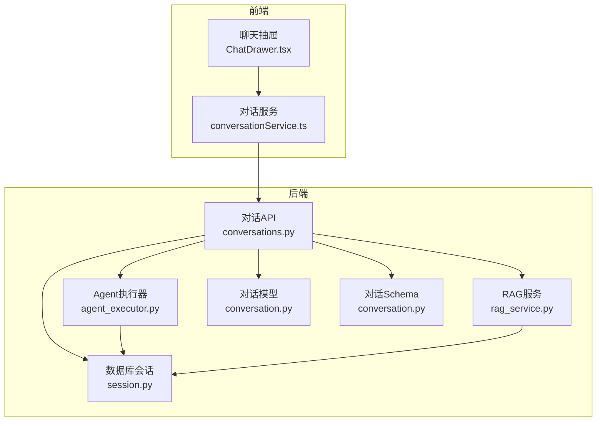
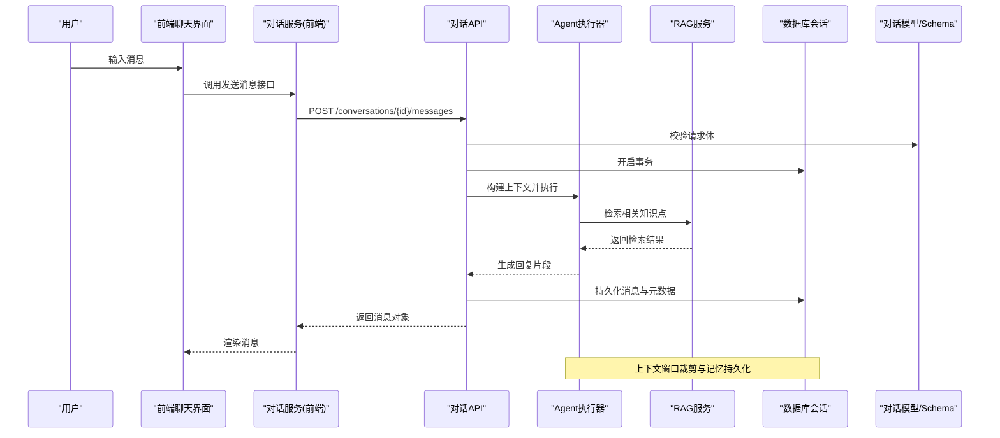
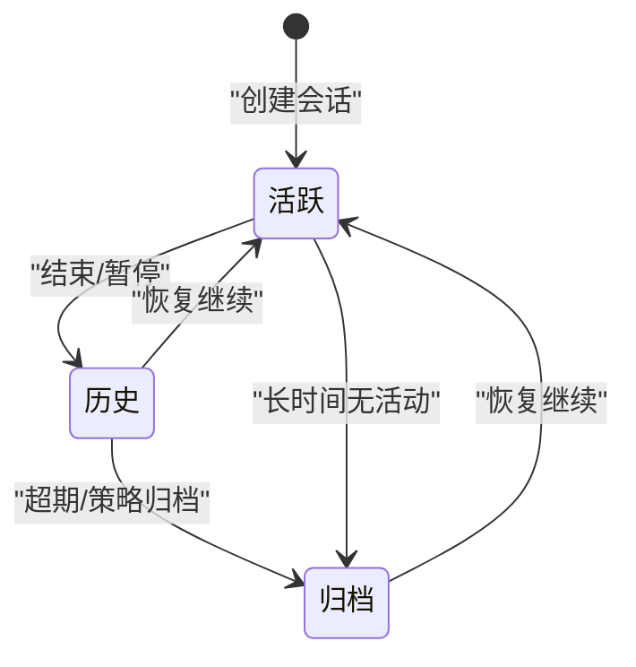
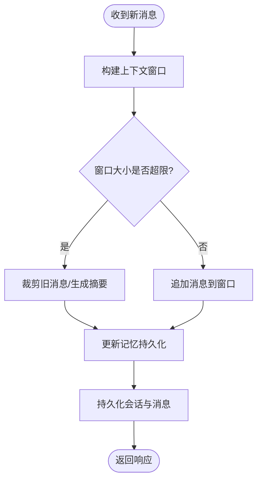
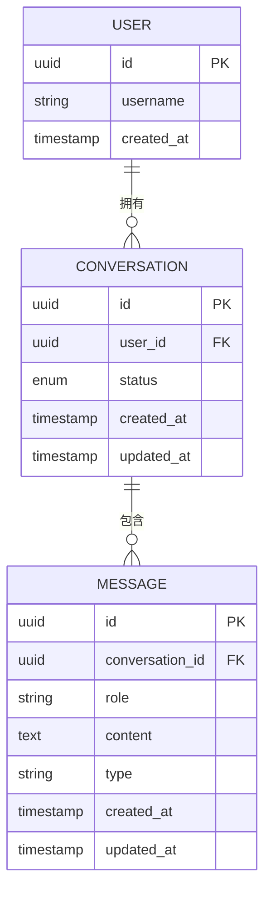
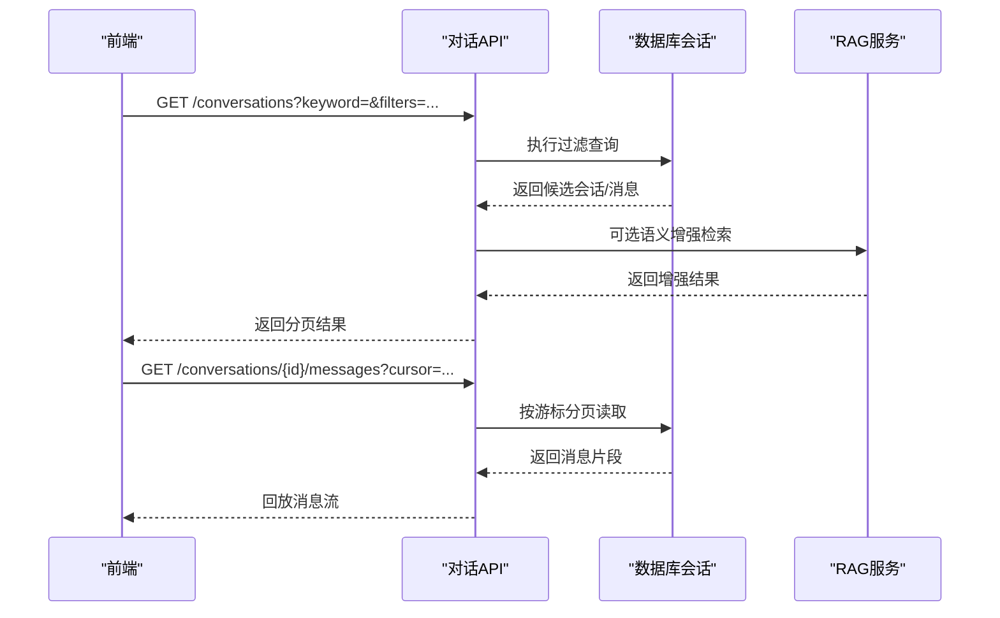
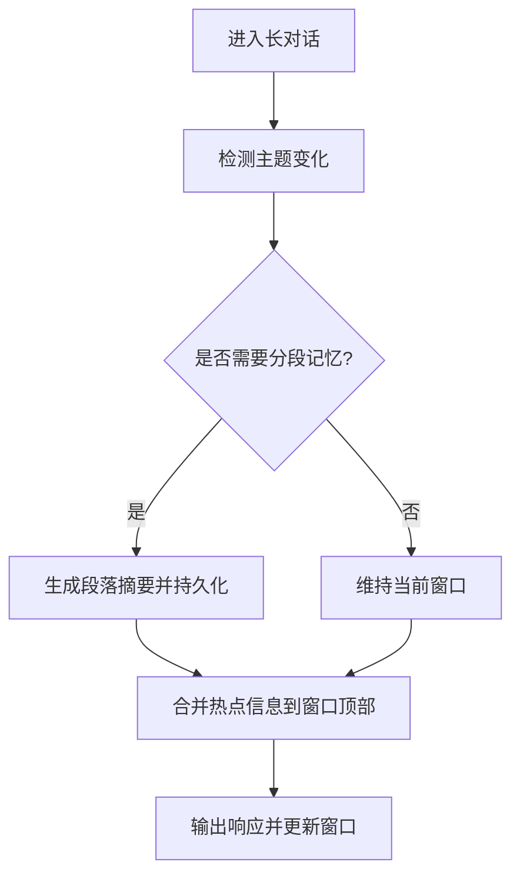
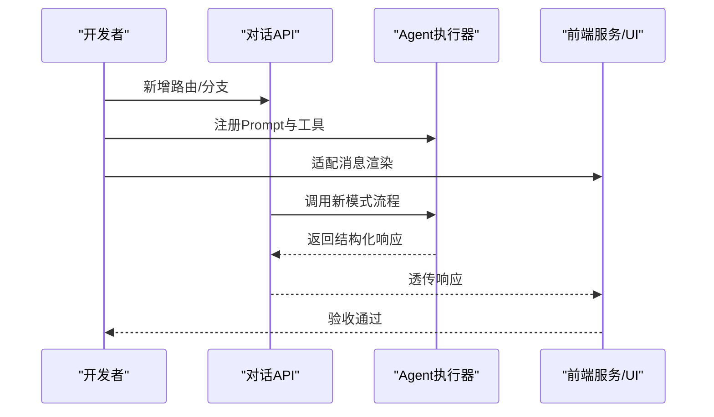
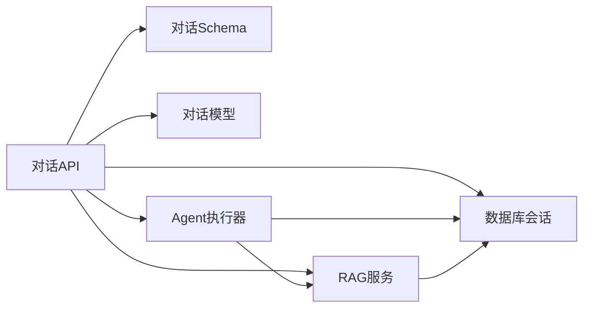

# 对话管理系统

<cite>
**本文引用的文件**   
- [backend/app/api/v1/conversations.py](file://backend/app/api/v1/conversations.py)
- [backend/app/models/conversation.py](file://backend/app/models/conversation.py)
- [backend/app/schemas/conversation.py](file://backend/app/schemas/conversation.py)
- [backend/app/services/agent/agent_executor.py](file://backend/app/services/agent/agent_executor.py)
- [backend/app/services/rag_service.py](file://backend/app/services/rag_service.py)
- [backend/app/db/session.py](file://backend/app/db/session.py)
- [frontend/src/services/conversationService.ts](file://frontend/src/services/conversationService.ts)
- [frontend/src/components/ChatDrawer.tsx](file://frontend/src/components/ChatDrawer.tsx)
</cite>

## 目录
1. [简介](#简介)
2. [项目结构](#项目结构)
3. [核心组件](#核心组件)
4. [架构总览](#架构总览)
5. [详细组件分析](#详细组件分析)
6. [依赖关系分析](#依赖关系分析)
7. [性能考虑](#性能考虑)
8. [故障排查指南](#故障排查指南)
9. [结论](#结论)
10. [附录](#附录)

## 简介
本文件面向开发者，系统化阐述对话管理系统的状态管理与数据模型设计，覆盖会话生命周期、上下文维护与记忆持久化、对话历史存储结构、状态机设计、上下文窗口与长对话优化、搜索过滤回放能力，以及扩展新对话模式与交互流程的集成方法。文档以代码级事实为依据，结合可视化图示帮助理解系统行为与数据流。

## 项目结构
后端采用分层架构：API 层暴露 REST 接口；服务层封装业务逻辑（包括 Agent 执行与检索增强生成）；数据模型与 Schema 定义持久化结构与校验规则；数据库会话由统一会话管理器提供。前端通过服务层调用 API，并在 UI 中展示对话列表与聊天面板。

图表来源
- [backend/app/api/v1/conversations.py](file://backend/app/api/v1/conversations.py)
- [backend/app/services/agent/agent_executor.py](file://backend/app/services/agent/agent_executor.py)
- [backend/app/services/rag_service.py](file://backend/app/services/rag_service.py)
- [backend/app/db/session.py](file://backend/app/db/session.py)
- [backend/app/models/conversation.py](file://backend/app/models/conversation.py)
- [backend/app/schemas/conversation.py](file://backend/app/schemas/conversation.py)
- [frontend/src/services/conversationService.ts](file://frontend/src/services/conversationService.ts)
- [frontend/src/components/ChatDrawer.tsx](file://frontend/src/components/ChatDrawer.tsx)

章节来源
- [backend/app/api/v1/conversations.py](file://backend/app/api/v1/conversations.py)
- [backend/app/models/conversation.py](file://backend/app/models/conversation.py)
- [backend/app/schemas/conversation.py](file://backend/app/schemas/conversation.py)
- [backend/app/services/agent/agent_executor.py](file://backend/app/services/agent/agent_executor.py)
- [backend/app/services/rag_service.py](file://backend/app/services/rag_service.py)
- [backend/app/db/session.py](file://backend/app/db/session.py)
- [frontend/src/services/conversationService.ts](file://frontend/src/services/conversationService.ts)
- [frontend/src/components/ChatDrawer.tsx](file://frontend/src/components/ChatDrawer.tsx)

## 核心组件
- 对话API层：负责会话创建、消息发送、历史查询、搜索过滤与回放等入口。
- 对话模型与Schema：定义会话实体、消息记录、时间戳、用户关联及校验规则。
- Agent执行器：编排多轮对话流程，维护上下文窗口，调用外部工具或LLM。
- RAG服务：为对话提供检索增强能力，支撑知识注入与答案质量提升。
- 数据库会话：统一管理事务与连接，确保读写一致性与并发安全。
- 前端对话服务与UI：封装HTTP调用，渲染对话列表与聊天面板，支持实时流式更新。

章节来源
- [backend/app/api/v1/conversations.py](file://backend/app/api/v1/conversations.py)
- [backend/app/models/conversation.py](file://backend/app/models/conversation.py)
- [backend/app/schemas/conversation.py](file://backend/app/schemas/conversation.py)
- [backend/app/services/agent/agent_executor.py](file://backend/app/services/agent/agent_executor.py)
- [backend/app/services/rag_service.py](file://backend/app/services/rag_service.py)
- [backend/app/db/session.py](file://backend/app/db/session.py)
- [frontend/src/services/conversationService.ts](file://frontend/src/services/conversationService.ts)
- [frontend/src/components/ChatDrawer.tsx](file://frontend/src/components/ChatDrawer.tsx)

## 架构总览
下图展示了从前端发起对话到后端处理、持久化与返回结果的完整链路，并体现状态转换的关键节点。

图表来源
- [backend/app/api/v1/conversations.py](file://backend/app/api/v1/conversations.py)
- [backend/app/services/agent/agent_executor.py](file://backend/app/services/agent/agent_executor.py)
- [backend/app/services/rag_service.py](file://backend/app/services/rag_service.py)
- [backend/app/db/session.py](file://backend/app/db/session.py)
- [backend/app/models/conversation.py](file://backend/app/models/conversation.py)
- [backend/app/schemas/conversation.py](file://backend/app/schemas/conversation.py)
- [frontend/src/services/conversationService.ts](file://frontend/src/services/conversationService.ts)
- [frontend/src/components/ChatDrawer.tsx](file://frontend/src/components/ChatDrawer.tsx)

## 详细组件分析

### 会话生命周期与状态机
- 活跃会话：当前正在进行的对话，支持追加消息与上下文更新。
- 历史会话：已完成或暂停的对话，保留完整历史用于回放与分析。
- 归档会话：长期保存的对话，降低热数据压力，支持按需加载。

状态转换要点
- 创建：新建会话进入“活跃”状态。
- 完成：用户主动结束或达到最大轮次后转入“历史”。
- 归档：超过阈值或策略触发后转入“归档”，减少查询开销。
- 恢复：从“历史/归档”恢复至“活跃”继续对话。

章节来源
- [backend/app/api/v1/conversations.py](file://backend/app/api/v1/conversations.py)
- [backend/app/models/conversation.py](file://backend/app/models/conversation.py)
- [backend/app/schemas/conversation.py](file://backend/app/schemas/conversation.py)

### 上下文维护与记忆持久化
- 上下文窗口：按时间顺序维护最近N条消息，超出窗口时进行裁剪（如保留首尾摘要）。
- 记忆持久化：将关键上下文摘要、用户偏好与领域知识写入持久化存储，避免重复计算。
- 增量更新：每次新消息到来时，仅更新受影响的部分上下文与摘要，提高吞吐。

章节来源
- [backend/app/services/agent/agent_executor.py](file://backend/app/services/agent/agent_executor.py)
- [backend/app/services/rag_service.py](file://backend/app/services/rag_service.py)
- [backend/app/db/session.py](file://backend/app/db/session.py)

### 对话历史存储结构设计
- 消息格式：包含角色（用户/助手）、内容、时间戳、会话ID、用户ID、消息类型（文本/工具调用/系统提示）等字段。
- 时间戳管理：每条消息具备创建时间与更新时间，支持排序与分页。
- 用户关联关系：会话与用户一对多，消息与会话一对多，便于权限控制与统计。

章节来源
- [backend/app/models/conversation.py](file://backend/app/models/conversation.py)
- [backend/app/schemas/conversation.py](file://backend/app/schemas/conversation.py)

### 对话搜索、过滤与回放
- 搜索：基于全文检索或向量相似度匹配，支持关键词与语义检索。
- 过滤：按时间范围、角色、消息类型、标签等维度筛选。
- 回放：按会话ID拉取历史消息，支持分页与游标定位，可重放特定片段。

章节来源
- [backend/app/api/v1/conversations.py](file://backend/app/api/v1/conversations.py)
- [backend/app/services/rag_service.py](file://backend/app/services/rag_service.py)
- [backend/app/db/session.py](file://backend/app/db/session.py)

### 上下文窗口管理与长对话优化
- 窗口策略：固定长度滑动窗口、重要性评分裁剪、摘要压缩。
- 长对话优化：分段记忆、主题切换检测、热点信息置顶、异步摘要生成。
- 资源控制：限制单次上下文体积，避免内存溢出与延迟升高。

章节来源
- [backend/app/services/agent/agent_executor.py](file://backend/app/services/agent/agent_executor.py)
- [backend/app/services/rag_service.py](file://backend/app/services/rag_service.py)

### 数据模型设计规范与扩展方法
- 命名规范：实体使用复数名词，字段使用下划线风格，枚举值使用大写常量。
- 版本兼容：新增字段需向后兼容，废弃字段标记过期并提供迁移脚本。
- 扩展点：在Schema中预留扩展字段，在模型中增加索引与约束，在API中增加校验与默认值。

章节来源
- [backend/app/models/conversation.py](file://backend/app/models/conversation.py)
- [backend/app/schemas/conversation.py](file://backend/app/schemas/conversation.py)

### 集成新的对话模式与交互流程
- 步骤一：定义新模式的消息类型与Schema字段，确保校验规则完备。
- 步骤二：在Agent执行器中注册新模式的Prompt模板与工具链。
- 步骤三：在对话API中新增路由或分支逻辑，处理新模式的请求与响应。
- 步骤四：在前端服务与UI中适配新消息类型的渲染与交互。
- 步骤五：编写单元测试与端到端测试，验证状态转换与持久化一致性。

章节来源
- [backend/app/api/v1/conversations.py](file://backend/app/api/v1/conversations.py)
- [backend/app/services/agent/agent_executor.py](file://backend/app/services/agent/agent_executor.py)
- [frontend/src/services/conversationService.ts](file://frontend/src/services/conversationService.ts)
- [frontend/src/components/ChatDrawer.tsx](file://frontend/src/components/ChatDrawer.tsx)

## 依赖关系分析
- 低耦合高内聚：API层仅依赖Schema与模型进行校验与映射，业务逻辑下沉至服务层。
- 外部依赖：RAG服务作为独立模块，提供检索增强能力，便于替换与升级。
- 数据库访问：统一会话管理，避免分散的连接与事务处理。

图表来源
- [backend/app/api/v1/conversations.py](file://backend/app/api/v1/conversations.py)
- [backend/app/services/agent/agent_executor.py](file://backend/app/services/agent/agent_executor.py)
- [backend/app/services/rag_service.py](file://backend/app/services/rag_service.py)
- [backend/app/db/session.py](file://backend/app/db/session.py)
- [backend/app/models/conversation.py](file://backend/app/models/conversation.py)
- [backend/app/schemas/conversation.py](file://backend/app/schemas/conversation.py)

章节来源
- [backend/app/api/v1/conversations.py](file://backend/app/api/v1/conversations.py)
- [backend/app/services/agent/agent_executor.py](file://backend/app/services/agent/agent_executor.py)
- [backend/app/services/rag_service.py](file://backend/app/services/rag_service.py)
- [backend/app/db/session.py](file://backend/app/db/session.py)
- [backend/app/models/conversation.py](file://backend/app/models/conversation.py)
- [backend/app/schemas/conversation.py](file://backend/app/schemas/conversation.py)

## 性能考虑
- 上下文窗口裁剪：优先保留关键信息与摘要，降低传输与处理成本。
- 分页与游标：历史消息采用游标分页，避免全量加载。
- 异步任务：对耗时操作（如摘要生成、批量归档）使用异步队列。
- 缓存策略：热点会话与常用检索结果短期缓存，提升响应速度。

[本节为通用指导，不直接分析具体文件]

## 故障排查指南
- 常见错误
  - 会话不存在：检查会话ID与用户权限。
  - 上下文过大：调整窗口大小与裁剪策略。
  - 持久化失败：检查数据库连接与事务回滚日志。
- 诊断建议
  - 启用详细日志，记录上下文窗口大小与裁剪原因。
  - 监控RAG检索命中率与延迟，评估知识库质量。
  - 前端网络重试与断线重连机制，保障用户体验。

章节来源
- [backend/app/db/session.py](file://backend/app/db/session.py)
- [backend/app/services/agent/agent_executor.py](file://backend/app/services/agent/agent_executor.py)
- [backend/app/services/rag_service.py](file://backend/app/services/rag_service.py)

## 结论
本系统围绕会话生命周期、上下文管理与记忆持久化构建了稳健的对话管理能力。通过清晰的状态机、可扩展的数据模型与服务分层，既能满足当前多轮对话需求，也为未来新增对话模式与交互流程提供了良好基础。建议在后续迭代中持续优化上下文窗口策略与检索增强效果，以提升长对话体验与整体性能。

[本节为总结性内容，不直接分析具体文件]

## 附录
- 术语表
  - 会话：一次完整的对话单元，包含多条消息。
  - 上下文窗口：用于传递给模型的最近消息集合。
  - 记忆持久化：将重要上下文与摘要保存到存储介质。
  - 检索增强生成：结合外部知识库提升生成质量。

[本节为概念性说明，不直接分析具体文件]