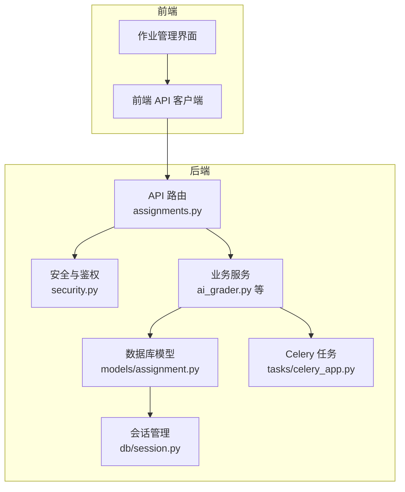
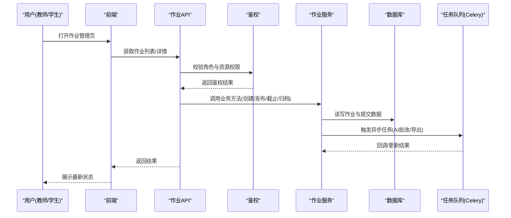
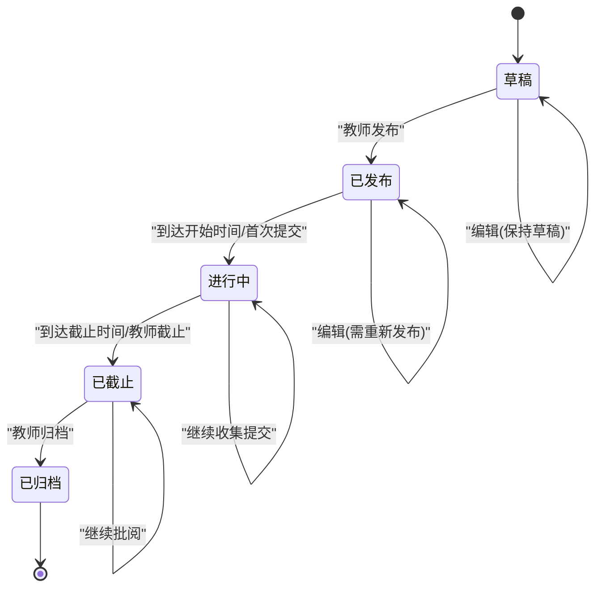
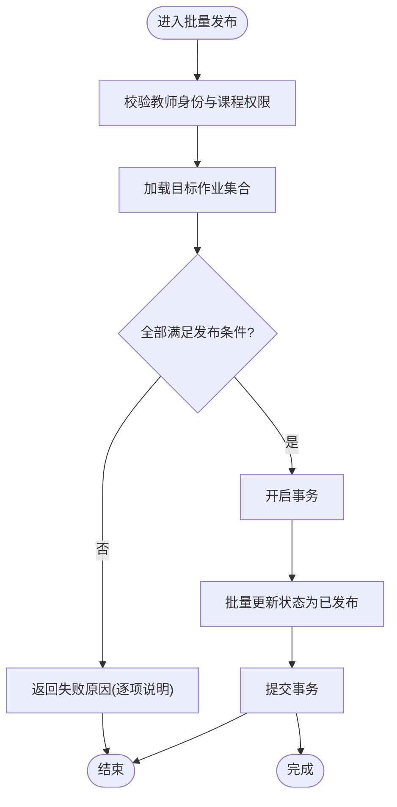
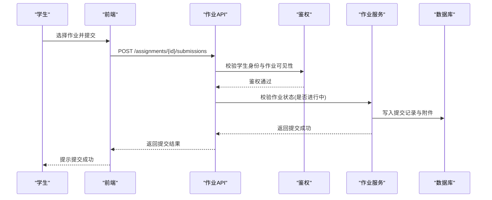
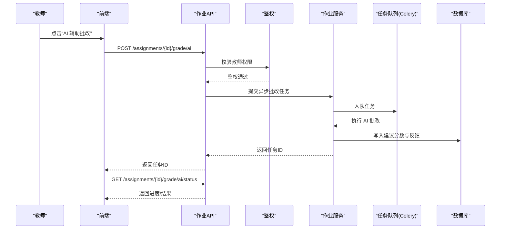
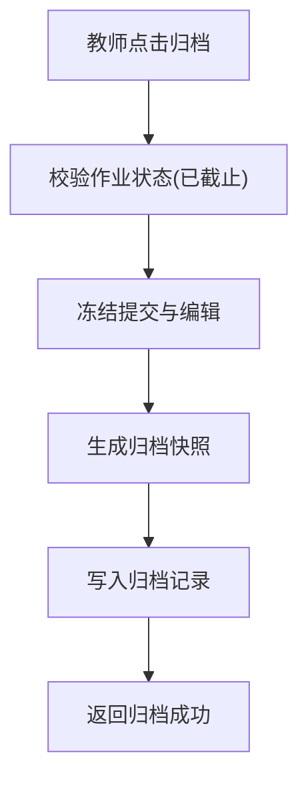
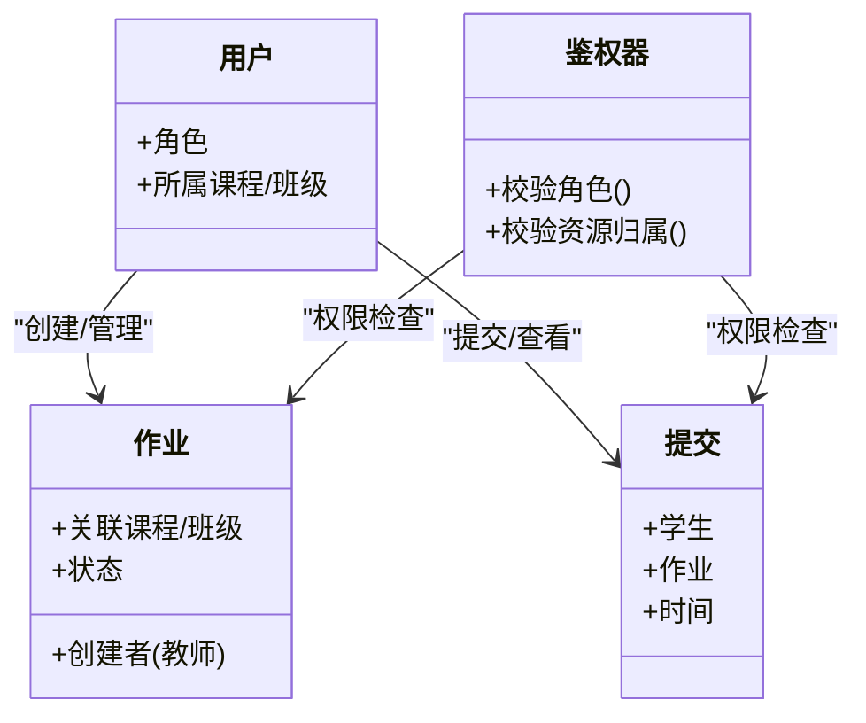
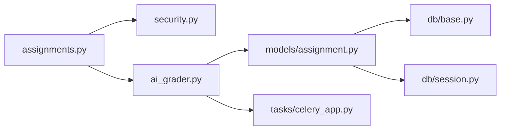

# 作业生命周期管理

<cite>
**本文引用的文件**   
- [backend/app/models/assignment.py](file://backend/app/models/assignment.py)
- [backend/app/schemas/assignment.py](file://backend/app/schemas/assignment.py)
- [backend/app/api/v1/assignments.py](file://backend/app/api/v1/assignments.py)
- [backend/app/core/security.py](file://backend/app/core/security.py)
- [backend/app/services/ai_grader.py](file://backend/app/services/ai_grader.py)
- [backend/app/tasks/celery_app.py](file://backend/app/tasks/celery_app.py)
- [backend/app/db/base.py](file://backend/app/db/base.py)
- [backend/app/db/session.py](file://backend/app/db/session.py)
</cite>

## 目录
1. [简介](#简介)
2. [项目结构](#项目结构)
3. [核心组件](#核心组件)
4. [架构总览](#架构总览)
5. [详细组件分析](#详细组件分析)
6. [依赖分析](#依赖分析)
7. [性能考虑](#性能考虑)
8. [故障排查指南](#故障排查指南)
9. [结论](#结论)
10. [附录](#附录)

## 简介
本文件面向开发者，系统化阐述“作业”在系统中的完整生命周期：从创建、配置与发布，到学生提交、教师批改、成绩计算与归档保存；同时给出状态机设计（草稿、已发布、进行中、已截止、已归档）、权限控制机制、版本管理与历史记录追踪策略，以及批量操作接口的设计与实现要点。文档以代码级视角解释模型设计与状态管理的实现细节，并辅以架构图、时序图与流程图帮助理解。

## 项目结构
后端采用分层架构：API 层暴露 REST 接口，服务层封装业务逻辑，数据访问层基于 SQLAlchemy 模型与会话管理，任务层通过 Celery 处理异步任务（如 AI 批改）。前端提供作业管理、上传、记录与分析等页面与服务调用封装。

图表来源
- [backend/app/api/v1/assignments.py](file://backend/app/api/v1/assignments.py)
- [backend/app/core/security.py](file://backend/app/core/security.py)
- [backend/app/services/ai_grader.py](file://backend/app/services/ai_grader.py)
- [backend/app/models/assignment.py](file://backend/app/models/assignment.py)
- [backend/app/db/session.py](file://backend/app/db/session.py)
- [backend/app/tasks/celery_app.py](file://backend/app/tasks/celery_app.py)

章节来源
- [backend/app/api/v1/assignments.py](file://backend/app/api/v1/assignments.py)
- [backend/app/core/security.py](file://backend/app/core/security.py)
- [backend/app/services/ai_grader.py](file://backend/app/services/ai_grader.py)
- [backend/app/models/assignment.py](file://backend/app/models/assignment.py)
- [backend/app/db/session.py](file://backend/app/db/session.py)
- [backend/app/tasks/celery_app.py](file://backend/app/tasks/celery_app.py)

## 核心组件
- 作业模型与模式定义
  - 模型负责持久化作业元数据、时间窗口、状态、版本与归档信息。
  - Schema 用于请求/响应校验与序列化。
- API 路由
  - 提供作业的增删改查、发布/撤回、批量操作、提交查询、导出等接口。
- 安全与鉴权
  - 统一鉴权中间件，按角色（教师/学生）与资源归属进行授权检查。
- 服务层
  - 编排作业关键流程：发布、截止、归档、AI 辅助批改、成绩汇总等。
- 任务队列
  - 将耗时任务（如 AI 批改、批量导出）放入 Celery 异步执行。
- 数据访问
  - 基于 SQLAlchemy 的 Base 与 Session 管理，确保事务一致性与连接复用。

章节来源
- [backend/app/models/assignment.py](file://backend/app/models/assignment.py)
- [backend/app/schemas/assignment.py](file://backend/app/schemas/assignment.py)
- [backend/app/api/v1/assignments.py](file://backend/app/api/v1/assignments.py)
- [backend/app/core/security.py](file://backend/app/core/security.py)
- [backend/app/services/ai_grader.py](file://backend/app/services/ai_grader.py)
- [backend/app/tasks/celery_app.py](file://backend/app/tasks/celery_app.py)
- [backend/app/db/base.py](file://backend/app/db/base.py)
- [backend/app/db/session.py](file://backend/app/db/session.py)

## 架构总览
作业生命周期由 API 层驱动，服务层协调模型与任务队列完成状态流转与数据处理。

图表来源
- [backend/app/api/v1/assignments.py](file://backend/app/api/v1/assignments.py)
- [backend/app/core/security.py](file://backend/app/core/security.py)
- [backend/app/services/ai_grader.py](file://backend/app/services/ai_grader.py)
- [backend/app/tasks/celery_app.py](file://backend/app/tasks/celery_app.py)
- [backend/app/models/assignment.py](file://backend/app/models/assignment.py)
- [backend/app/db/session.py](file://backend/app/db/session.py)

## 详细组件分析

### 作业模型与状态机
- 状态枚举
  - 草稿、已发布、进行中、已截止、已归档
- 状态转换规则
  - 草稿 → 已发布：教师发起发布，校验截止时间与必填项
  - 已发布 → 进行中：到达开始时间或首次有学生提交时自动切换
  - 进行中 → 已截止：到达截止时间或教师手动截止
  - 已截止 → 已归档：教师触发归档，冻结提交与修改
  - 任意可编辑状态 → 草稿：仅允许未发布前撤回
- 版本与历史
  - 每次重要变更（标题、描述、截止时间、评分规则）生成版本记录，支持回滚与审计
- 归档语义
  - 归档后禁止新增提交与修改，保留只读快照与成绩

图表来源
- [backend/app/models/assignment.py](file://backend/app/models/assignment.py)

章节来源
- [backend/app/models/assignment.py](file://backend/app/models/assignment.py)

### 作业 API 与批量操作
- 单作业操作
  - 创建、更新、删除、详情查询、发布/撤回、截止、归档
- 批量操作
  - 批量发布：对多个作业一次性设置发布状态
  - 批量截止：对多个作业统一截止
  - 批量导出：导出作业清单、提交明细、成绩表为 Excel/CSV
- 提交相关
  - 学生提交、查看提交历史、下载附件
- 权限控制
  - 教师：管理自己负责的课程/班级下的作业
  - 学生：仅能查看与提交自己被授权的作业

图表来源
- [backend/app/api/v1/assignments.py](file://backend/app/api/v1/assignments.py)
- [backend/app/core/security.py](file://backend/app/core/security.py)
- [backend/app/models/assignment.py](file://backend/app/models/assignment.py)

章节来源
- [backend/app/api/v1/assignments.py](file://backend/app/api/v1/assignments.py)
- [backend/app/core/security.py](file://backend/app/core/security.py)
- [backend/app/models/assignment.py](file://backend/app/models/assignment.py)

### 学生提交处理流程
- 提交流程
  - 学生在“进行中”阶段提交作业，系统记录提交时间与附件
  - 若处于“已截止”，拒绝新提交并提示
- 提交校验
  - 格式、大小、完整性校验
- 提交历史
  - 同一作业多次提交保留历史，便于回溯与重交策略

图表来源
- [backend/app/api/v1/assignments.py](file://backend/app/api/v1/assignments.py)
- [backend/app/core/security.py](file://backend/app/core/security.py)
- [backend/app/models/assignment.py](file://backend/app/models/assignment.py)

章节来源
- [backend/app/api/v1/assignments.py](file://backend/app/api/v1/assignments.py)
- [backend/app/core/security.py](file://backend/app/core/security.py)
- [backend/app/models/assignment.py](file://backend/app/models/assignment.py)

### 教师批改与成绩计算
- 人工批改
  - 教师查看提交内容，填写分数与评语，系统记录批改历史
- AI 辅助批改
  - 教师可触发 AI 预评分，异步任务执行后回填建议分数与反馈
- 成绩计算
  - 支持多种计分策略（平均分、去最高最低、权重组合），最终成绩落库并参与统计

图表来源
- [backend/app/api/v1/assignments.py](file://backend/app/api/v1/assignments.py)
- [backend/app/core/security.py](file://backend/app/core/security.py)
- [backend/app/services/ai_grader.py](file://backend/app/services/ai_grader.py)
- [backend/app/tasks/celery_app.py](file://backend/app/tasks/celery_app.py)
- [backend/app/models/assignment.py](file://backend/app/models/assignment.py)

章节来源
- [backend/app/api/v1/assignments.py](file://backend/app/api/v1/assignments.py)
- [backend/app/core/security.py](file://backend/app/core/security.py)
- [backend/app/services/ai_grader.py](file://backend/app/services/ai_grader.py)
- [backend/app/tasks/celery_app.py](file://backend/app/tasks/celery_app.py)
- [backend/app/models/assignment.py](file://backend/app/models/assignment.py)

### 归档与版本管理
- 归档
  - 归档后锁定作业，禁止新增提交与修改，保留只读快照
- 版本管理
  - 每次关键变更生成版本记录，支持对比与回滚
- 历史追踪
  - 记录状态变更、操作人、时间戳，形成审计日志

图表来源
- [backend/app/api/v1/assignments.py](file://backend/app/api/v1/assignments.py)
- [backend/app/models/assignment.py](file://backend/app/models/assignment.py)

章节来源
- [backend/app/api/v1/assignments.py](file://backend/app/api/v1/assignments.py)
- [backend/app/models/assignment.py](file://backend/app/models/assignment.py)

### 权限控制机制
- 角色与资源绑定
  - 教师：拥有其负责课程/班级的作业管理权限
  - 学生：仅能访问被授权的课程/班级内的作业
- 鉴权流程
  - 每个 API 入口先校验身份与角色，再校验资源归属
- 细粒度控制
  - 针对作业、提交、成绩等资源的独立权限判断

图表来源
- [backend/app/core/security.py](file://backend/app/core/security.py)
- [backend/app/models/assignment.py](file://backend/app/models/assignment.py)

章节来源
- [backend/app/core/security.py](file://backend/app/core/security.py)
- [backend/app/models/assignment.py](file://backend/app/models/assignment.py)

## 依赖分析
- 模块耦合
  - API 依赖鉴权与安全模块，服务依赖模型与任务队列
  - 模型依赖会话管理，任务队列依赖服务提供的任务函数
- 外部集成点
  - Celery 任务队列用于异步处理
  - 数据库通过 SQLAlchemy 会话管理

图表来源
- [backend/app/api/v1/assignments.py](file://backend/app/api/v1/assignments.py)
- [backend/app/core/security.py](file://backend/app/core/security.py)
- [backend/app/services/ai_grader.py](file://backend/app/services/ai_grader.py)
- [backend/app/models/assignment.py](file://backend/app/models/assignment.py)
- [backend/app/db/base.py](file://backend/app/db/base.py)
- [backend/app/db/session.py](file://backend/app/db/session.py)
- [backend/app/tasks/celery_app.py](file://backend/app/tasks/celery_app.py)

章节来源
- [backend/app/api/v1/assignments.py](file://backend/app/api/v1/assignments.py)
- [backend/app/core/security.py](file://backend/app/core/security.py)
- [backend/app/services/ai_grader.py](file://backend/app/services/ai_grader.py)
- [backend/app/models/assignment.py](file://backend/app/models/assignment.py)
- [backend/app/db/base.py](file://backend/app/db/base.py)
- [backend/app/db/session.py](file://backend/app/db/session.py)
- [backend/app/tasks/celery_app.py](file://backend/app/tasks/celery_app.py)

## 性能考虑
- 批量操作
  - 使用事务批量更新，减少往返开销
  - 分批处理大集合，避免单次事务过大
- 异步任务
  - 将 AI 批改、导出等耗时任务放入 Celery，提高响应速度
- 缓存与索引
  - 对高频查询字段建立索引（如作业状态、课程 ID、学生 ID）
  - 对只读快照与统计结果引入缓存层
- 分页与流式导出
  - 大数据量导出采用流式输出，降低内存占用

[本节为通用指导，不直接分析具体文件]

## 故障排查指南
- 常见错误
  - 鉴权失败：检查用户角色与资源归属
  - 状态非法转换：确认当前状态是否符合转换规则
  - 任务失败：查看 Celery 日志与重试策略
- 定位步骤
  - 核对 API 返回码与消息
  - 检查数据库事务是否提交
  - 验证任务队列消费情况

章节来源
- [backend/app/core/security.py](file://backend/app/core/security.py)
- [backend/app/tasks/celery_app.py](file://backend/app/tasks/celery_app.py)
- [backend/app/db/session.py](file://backend/app/db/session.py)

## 结论
本方案围绕作业的生命周期构建了清晰的状态机、严格的权限控制、完善的版本与历史记录追踪，并通过异步任务提升整体性能。API 层提供丰富的单作业与批量操作能力，服务层保证业务流程的一致性与可扩展性。建议在后续迭代中持续优化批量操作的容错与监控，完善审计日志与告警机制。

[本节为总结，不直接分析具体文件]

## 附录
- 术语
  - 作业：包含题目、要求、时间窗口、评分规则的教学任务
  - 提交：学生对作业的答案或附件
  - 归档：冻结作业并保留只读快照
- 最佳实践
  - 发布前充分校验必填项与时间窗口
  - 批量操作提供幂等键与重试机制
  - 对敏感操作（发布、截止、归档）记录审计日志

[本节为补充说明，不直接分析具体文件]