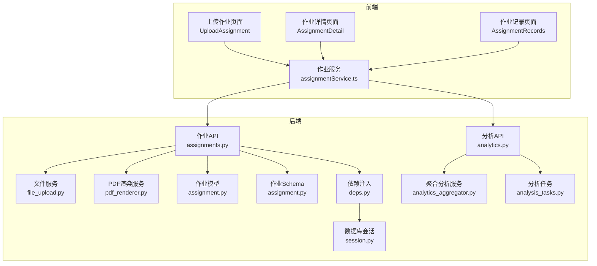
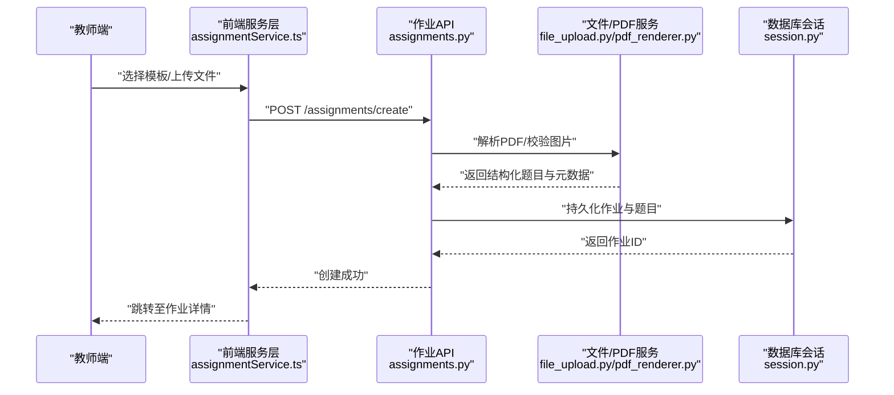
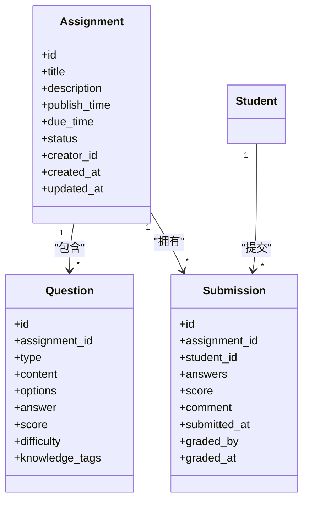
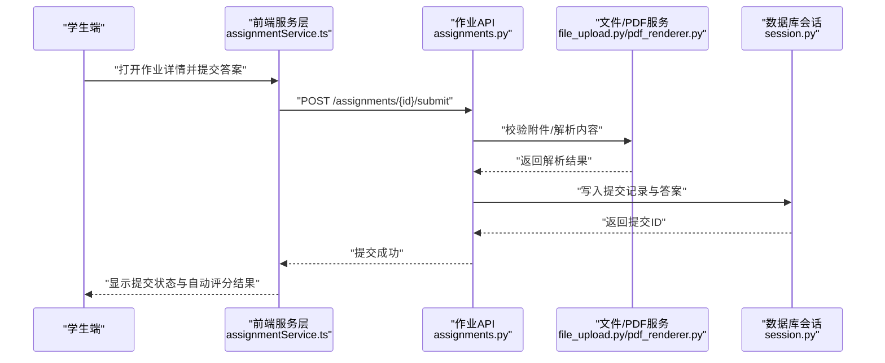
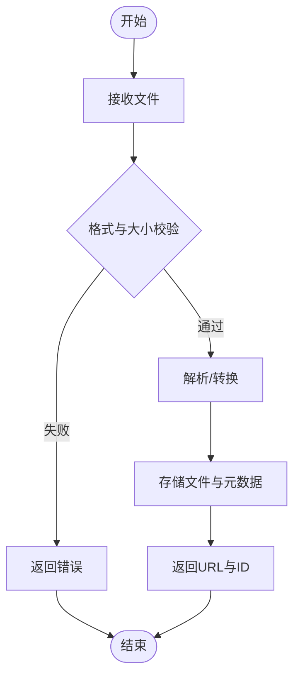
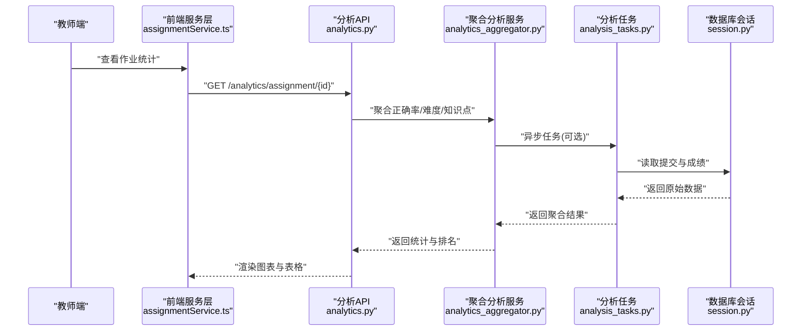
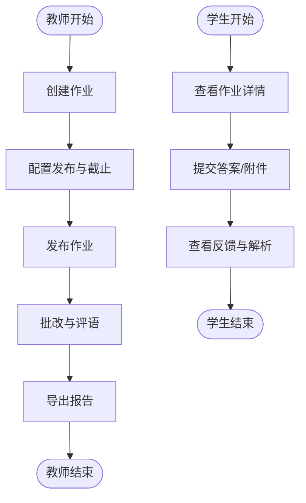
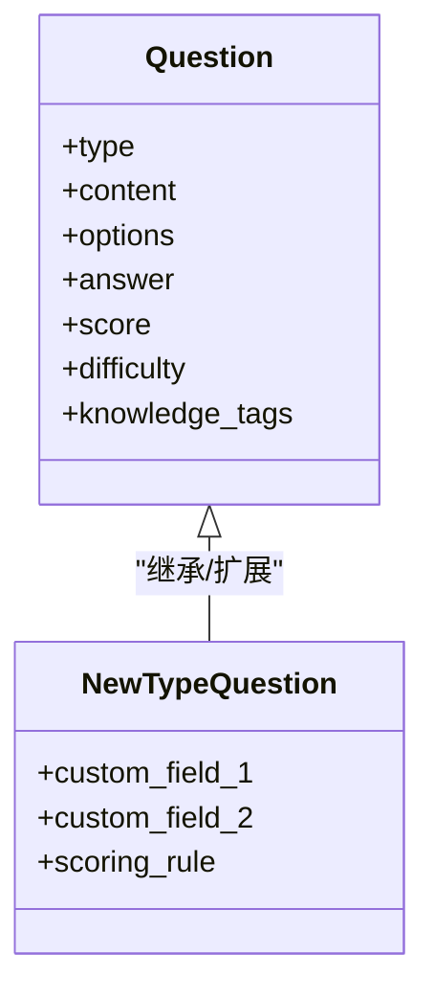
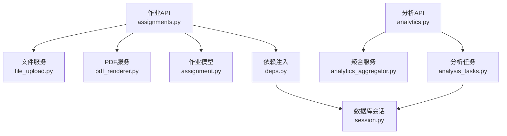

# 作业管理系统

<cite>
**本文引用的文件**   
- [backend/app/api/v1/assignments.py](file://backend/app/api/v1/assignments.py)
- [backend/app/models/assignment.py](file://backend/app/models/assignment.py)
- [backend/app/schemas/assignment.py](file://backend/app/schemas/assignment.py)
- [backend/app/services/file_upload.py](file://backend/app/services/file_upload.py)
- [backend/app/services/pdf_renderer.py](file://backend/app/services/pdf_renderer.py)
- [backend/app/api/v1/analytics.py](file://backend/app/api/v1/analytics.py)
- [backend/app/services/analytics_aggregator.py](file://backend/app/services/analytics_aggregator.py)
- [backend/app/tasks/analysis_tasks.py](file://backend/app/tasks/analysis_tasks.py)
- [backend/app/core/deps.py](file://backend/app/core/deps.py)
- [backend/app/db/session.py](file://backend/app/db/session.py)
- [frontend/src/pages/AssignmentManagement/UploadAssignment/index.tsx](file://frontend/src/pages/AssignmentManagement/UploadAssignment/index.tsx)
- [frontend/src/pages/AssignmentManagement/AssignmentDetail/index.tsx](file://frontend/src/pages/AssignmentManagement/AssignmentDetail/index.tsx)
- [frontend/src/pages/AssignmentManagement/AssignmentRecords/index.tsx](file://frontend/src/pages/AssignmentManagement/AssignmentRecords/index.tsx)
- [frontend/src/services/assignmentService.ts](file://frontend/src/services/assignmentService.ts)
</cite>

## 目录
1. [简介](#简介)
2. [项目结构](#项目结构)
3. [核心组件](#核心组件)
4. [架构总览](#架构总览)
5. [详细组件分析](#详细组件分析)
6. [依赖关系分析](#依赖关系分析)
7. [性能考虑](#性能考虑)
8. [故障排查指南](#故障排查指南)
9. [结论](#结论)
10. [附录](#附录)

## 简介
本系统面向教师与学生，提供作业从创建、发布、提交、批改到归档的完整生命周期管理。支持多种题型（选择题、填空题、作文题、口语题等），内置AI辅助评分与解析能力；提供PDF解析、图片处理与批量导入导出；具备作业统计分析、成绩计算与排名生成等数据处理逻辑。文档同时覆盖教师端与学生端的操作流程，以及面向开发者的数据模型设计与扩展新题型的方法。

## 项目结构
后端采用分层架构：API层负责路由与请求校验，服务层封装业务逻辑，模型层定义数据库实体，任务层处理异步分析，前端通过服务层调用API并渲染页面。

图表来源
- [backend/app/api/v1/assignments.py](file://backend/app/api/v1/assignments.py)
- [backend/app/api/v1/analytics.py](file://backend/app/api/v1/analytics.py)
- [backend/app/services/file_upload.py](file://backend/app/services/file_upload.py)
- [backend/app/services/pdf_renderer.py](file://backend/app/services/pdf_renderer.py)
- [backend/app/services/analytics_aggregator.py](file://backend/app/services/analytics_aggregator.py)
- [backend/app/tasks/analysis_tasks.py](file://backend/app/tasks/analysis_tasks.py)
- [backend/app/models/assignment.py](file://backend/app/models/assignment.py)
- [backend/app/schemas/assignment.py](file://backend/app/schemas/assignment.py)
- [backend/app/core/deps.py](file://backend/app/core/deps.py)
- [backend/app/db/session.py](file://backend/app/db/session.py)
- [frontend/src/pages/AssignmentManagement/UploadAssignment/index.tsx](file://frontend/src/pages/AssignmentManagement/UploadAssignment/index.tsx)
- [frontend/src/pages/AssignmentManagement/AssignmentDetail/index.tsx](file://frontend/src/pages/AssignmentManagement/AssignmentDetail/index.tsx)
- [frontend/src/pages/AssignmentManagement/AssignmentRecords/index.tsx](file://frontend/src/pages/AssignmentManagement/AssignmentRecords/index.tsx)
- [frontend/src/services/assignmentService.ts](file://frontend/src/services/assignmentService.ts)

章节来源
- [backend/app/api/v1/assignments.py](file://backend/app/api/v1/assignments.py)
- [backend/app/api/v1/analytics.py](file://backend/app/api/v1/analytics.py)
- [backend/app/services/file_upload.py](file://backend/app/services/file_upload.py)
- [backend/app/services/pdf_renderer.py](file://backend/app/services/pdf_renderer.py)
- [backend/app/services/analytics_aggregator.py](file://backend/app/services/analytics_aggregator.py)
- [backend/app/tasks/analysis_tasks.py](file://backend/app/tasks/analysis_tasks.py)
- [backend/app/models/assignment.py](file://backend/app/models/assignment.py)
- [backend/app/schemas/assignment.py](file://backend/app/schemas/assignment.py)
- [backend/app/core/deps.py](file://backend/app/core/deps.py)
- [backend/app/db/session.py](file://backend/app/db/session.py)
- [frontend/src/pages/AssignmentManagement/UploadAssignment/index.tsx](file://frontend/src/pages/AssignmentManagement/UploadAssignment/index.tsx)
- [frontend/src/pages/AssignmentManagement/AssignmentDetail/index.tsx](file://frontend/src/pages/AssignmentManagement/AssignmentDetail/index.tsx)
- [frontend/src/pages/AssignmentManagement/AssignmentRecords/index.tsx](file://frontend/src/pages/AssignmentManagement/AssignmentRecords/index.tsx)
- [frontend/src/services/assignmentService.ts](file://frontend/src/services/assignmentService.ts)

## 核心组件
- 作业生命周期管理
  - 创建：教师通过上传或模板构建作业，系统持久化作业元数据与题目集合。
  - 发布：设置发布时间、截止时间与可见范围，学生端可访问。
  - 提交：学生在线作答或上传附件，系统记录提交时间与版本。
  - 批改：自动评分（客观题）与人工/AI辅助评分（主观题），生成分数与评语。
  - 归档：截止后锁定提交，允许导出成绩与分析报告。
- 多题型处理机制
  - 选择题/填空题：基于答案匹配与容错规则进行自动评分。
  - 作文题：文本质量评估、要点覆盖度与语言规范检查，结合AI评分。
  - 口语题：音频转写与语音评测指标（流利度、准确度、完整性）综合打分。
- 文件上传下载
  - PDF解析：提取文本与版面信息，用于题目预览与OCR增强。
  - 图片处理：格式校验、尺寸压缩、水印与缩略图生成。
  - 批量操作：批量导入题目、批量导出成绩与报告。
- 作业模板与批量导入导出
  - 模板：预置题型结构与评分规则，快速复用。
  - 导入：Excel/CSV批量导入题目与答案。
  - 导出：按班级/学号导出成绩、错题集与学习报告。
- 统计分析与成绩计算
  - 聚合：正确率、难度分布、知识点掌握热力图。
  - 排名：按总分或单题得分排序，支持分页与筛选。
  - 异步任务：大规模分析在后台执行，避免阻塞接口。

章节来源
- [backend/app/api/v1/assignments.py](file://backend/app/api/v1/assignments.py)
- [backend/app/models/assignment.py](file://backend/app/models/assignment.py)
- [backend/app/schemas/assignment.py](file://backend/app/schemas/assignment.py)
- [backend/app/services/file_upload.py](file://backend/app/services/file_upload.py)
- [backend/app/services/pdf_renderer.py](file://backend/app/services/pdf_renderer.py)
- [backend/app/services/analytics_aggregator.py](file://backend/app/services/analytics_aggregator.py)
- [backend/app/tasks/analysis_tasks.py](file://backend/app/tasks/analysis_tasks.py)

## 架构总览
系统前后端分离，前端通过RESTful API与后端交互；后端以FastAPI风格组织API与服务，使用依赖注入获取数据库会话；分析类任务通过任务队列异步执行。

图表来源
- [frontend/src/services/assignmentService.ts](file://frontend/src/services/assignmentService.ts)
- [backend/app/api/v1/assignments.py](file://backend/app/api/v1/assignments.py)
- [backend/app/services/file_upload.py](file://backend/app/services/file_upload.py)
- [backend/app/services/pdf_renderer.py](file://backend/app/services/pdf_renderer.py)
- [backend/app/db/session.py](file://backend/app/db/session.py)

## 详细组件分析

### 作业数据模型与Schema
- 模型职责
  - 作业实体：包含标题、描述、发布时间、截止时间、状态、创建者等信息。
  - 题目集合：关联多个题目，支持不同题型字段与评分规则。
  - 提交与成绩：记录学生作答、分数、评语与时间戳。
- Schema职责
  - 输入校验：确保必填字段、类型与约束。
  - 输出序列化：统一响应结构，便于前端消费。

图表来源
- [backend/app/models/assignment.py](file://backend/app/models/assignment.py)
- [backend/app/schemas/assignment.py](file://backend/app/schemas/assignment.py)

章节来源
- [backend/app/models/assignment.py](file://backend/app/models/assignment.py)
- [backend/app/schemas/assignment.py](file://backend/app/schemas/assignment.py)

### 作业API与生命周期流程
- 关键接口
  - 创建作业：接收模板ID或上传文件，解析并保存作业与题目。
  - 发布作业：更新状态为已发布，开放学生端访问。
  - 提交作业：写入学生答案与附件，触发自动评分（如适用）。
  - 批改作业：人工/AI评分，更新分数与评语。
  - 归档作业：截止后锁定，允许导出成绩与分析。
- 控制流
  - 前端调用作业服务，服务转发至后端API。
  - API调用文件/PDF服务进行解析与校验。
  - 通过依赖注入获取数据库会话，完成读写。

图表来源
- [frontend/src/services/assignmentService.ts](file://frontend/src/services/assignmentService.ts)
- [backend/app/api/v1/assignments.py](file://backend/app/api/v1/assignments.py)
- [backend/app/services/file_upload.py](file://backend/app/services/file_upload.py)
- [backend/app/services/pdf_renderer.py](file://backend/app/services/pdf_renderer.py)
- [backend/app/db/session.py](file://backend/app/db/session.py)

章节来源
- [backend/app/api/v1/assignments.py](file://backend/app/api/v1/assignments.py)
- [backend/app/services/file_upload.py](file://backend/app/services/file_upload.py)
- [backend/app/services/pdf_renderer.py](file://backend/app/services/pdf_renderer.py)
- [backend/app/db/session.py](file://backend/app/db/session.py)
- [frontend/src/services/assignmentService.ts](file://frontend/src/services/assignmentService.ts)

### 文件上传与PDF解析
- 文件上传
  - 支持PDF与图片格式，进行大小、类型与安全性校验。
  - 生成缩略图与存储路径，返回可访问URL。
- PDF解析
  - 提取文本与版面信息，用于题目预览与OCR增强。
  - 将解析结果转换为结构化题目对象，便于入库。

图表来源
- [backend/app/services/file_upload.py](file://backend/app/services/file_upload.py)
- [backend/app/services/pdf_renderer.py](file://backend/app/services/pdf_renderer.py)

章节来源
- [backend/app/services/file_upload.py](file://backend/app/services/file_upload.py)
- [backend/app/services/pdf_renderer.py](file://backend/app/services/pdf_renderer.py)

### 统计分析、成绩计算与排名
- 聚合分析
  - 计算正确率、难度分布、知识点掌握情况。
  - 生成热力图与趋势图数据。
- 成绩计算
  - 根据题型权重与评分规则汇总总分。
  - 支持重算与版本对比。
- 排名生成
  - 按总分或单题得分排序，支持分页与筛选。
  - 异步任务处理大规模数据，避免阻塞。

图表来源
- [backend/app/api/v1/analytics.py](file://backend/app/api/v1/analytics.py)
- [backend/app/services/analytics_aggregator.py](file://backend/app/services/analytics_aggregator.py)
- [backend/app/tasks/analysis_tasks.py](file://backend/app/tasks/analysis_tasks.py)
- [backend/app/db/session.py](file://backend/app/db/session.py)
- [frontend/src/services/assignmentService.ts](file://frontend/src/services/assignmentService.ts)

章节来源
- [backend/app/api/v1/analytics.py](file://backend/app/api/v1/analytics.py)
- [backend/app/services/analytics_aggregator.py](file://backend/app/services/analytics_aggregator.py)
- [backend/app/tasks/analysis_tasks.py](file://backend/app/tasks/analysis_tasks.py)
- [backend/app/db/session.py](file://backend/app/db/session.py)
- [frontend/src/services/assignmentService.ts](file://frontend/src/services/assignmentService.ts)

### 教师端与学生端使用流程
- 教师端
  - 创建作业：选择模板或上传文件，配置发布时间与截止时间。
  - 发布作业：确认无误后发布，学生端可见。
  - 批改作业：查看提交列表，进行人工/AI评分与评语。
  - 导出报告：导出成绩、错题集与学习分析。
- 学生端
  - 查看作业：进入作业详情，阅读题目与要求。
  - 提交答案：在线作答或上传附件，确认提交。
  - 查看反馈：查看分数、评语与解析。

章节来源
- [frontend/src/pages/AssignmentManagement/UploadAssignment/index.tsx](file://frontend/src/pages/AssignmentManagement/UploadAssignment/index.tsx)
- [frontend/src/pages/AssignmentManagement/AssignmentDetail/index.tsx](file://frontend/src/pages/AssignmentManagement/AssignmentDetail/index.tsx)
- [frontend/src/pages/AssignmentManagement/AssignmentRecords/index.tsx](file://frontend/src/pages/AssignmentManagement/AssignmentRecords/index.tsx)
- [frontend/src/services/assignmentService.ts](file://frontend/src/services/assignmentService.ts)

### 扩展新题型的方法
- 数据模型扩展
  - 在题目模型中新增题型字段与特定属性（如选项、填空位置、评分规则）。
  - 在提交模型中增加对应答案结构，支持复杂类型。
- 服务层适配
  - 在文件/PDF服务中增加新题型的解析逻辑。
  - 在聚合分析服务中为新题型添加统计维度。
- API层适配
  - 在作业API中增加对新题型的校验与处理分支。
  - 在前端服务与页面中增加对应的表单与展示逻辑。

图表来源
- [backend/app/models/assignment.py](file://backend/app/models/assignment.py)
- [backend/app/schemas/assignment.py](file://backend/app/schemas/assignment.py)

章节来源
- [backend/app/models/assignment.py](file://backend/app/models/assignment.py)
- [backend/app/schemas/assignment.py](file://backend/app/schemas/assignment.py)

## 依赖关系分析
- 组件耦合
  - API层依赖服务层与模型层，服务层依赖文件/PDF解析与数据库会话。
  - 分析API依赖聚合服务与任务队列，任务队列依赖数据库会话。
- 外部集成点
  - 文件存储与CDN（上传/下载）。
  - AI评分服务（作文/口语）。
  - 向量检索与知识追踪（可选扩展）。

图表来源
- [backend/app/api/v1/assignments.py](file://backend/app/api/v1/assignments.py)
- [backend/app/services/file_upload.py](file://backend/app/services/file_upload.py)
- [backend/app/services/pdf_renderer.py](file://backend/app/services/pdf_renderer.py)
- [backend/app/models/assignment.py](file://backend/app/models/assignment.py)
- [backend/app/core/deps.py](file://backend/app/core/deps.py)
- [backend/app/db/session.py](file://backend/app/db/session.py)
- [backend/app/api/v1/analytics.py](file://backend/app/api/v1/analytics.py)
- [backend/app/services/analytics_aggregator.py](file://backend/app/services/analytics_aggregator.py)
- [backend/app/tasks/analysis_tasks.py](file://backend/app/tasks/analysis_tasks.py)

章节来源
- [backend/app/api/v1/assignments.py](file://backend/app/api/v1/assignments.py)
- [backend/app/services/file_upload.py](file://backend/app/services/file_upload.py)
- [backend/app/services/pdf_renderer.py](file://backend/app/services/pdf_renderer.py)
- [backend/app/models/assignment.py](file://backend/app/models/assignment.py)
- [backend/app/core/deps.py](file://backend/app/core/deps.py)
- [backend/app/db/session.py](file://backend/app/db/session.py)
- [backend/app/api/v1/analytics.py](file://backend/app/api/v1/analytics.py)
- [backend/app/services/analytics_aggregator.py](file://backend/app/services/analytics_aggregator.py)
- [backend/app/tasks/analysis_tasks.py](file://backend/app/tasks/analysis_tasks.py)

## 性能考虑
- 大文件上传
  - 分块上传与断点续传，减少超时风险。
  - 异步处理与进度回调，提升用户体验。
- PDF解析
  - 缓存解析结果，避免重复计算。
  - 限制文件大小与页数，防止资源耗尽。
- 统计分析
  - 异步任务与批处理，降低主线程压力。
  - 索引优化与分页查询，提高大数据量下的响应速度。

[本节为通用指导，不直接分析具体文件]

## 故障排查指南
- 常见问题
  - 上传失败：检查文件格式、大小与权限；查看文件服务日志。
  - 解析异常：确认PDF版本与内容结构；尝试降级解析策略。
  - 分析超时：检查任务队列状态与数据库连接池；调整批处理大小。
- 定位方法
  - 查看API响应码与错误消息。
  - 检查依赖注入与数据库会话是否正常。
  - 使用前端网络面板跟踪请求与响应。

章节来源
- [backend/app/core/deps.py](file://backend/app/core/deps.py)
- [backend/app/db/session.py](file://backend/app/db/session.py)

## 结论
本作业管理系统提供了完整的作业生命周期管理与多题型处理能力，结合文件解析与统计分析，满足教学场景中的多样化需求。通过清晰的架构与可扩展的数据模型，开发者可以快速接入新题型与功能模块，持续提升系统的可用性与性能。

[本节为总结性内容，不直接分析具体文件]

## 附录
- 术语表
  - 作业：教师布置的学习任务，包含题目与评分规则。
  - 提交：学生对作业的作答与附件。
  - 批改：对提交的评分与评语。
  - 归档：截止后对作业数据的锁定与导出。
- 参考页面
  - 上传作业：[frontend/src/pages/AssignmentManagement/UploadAssignment/index.tsx](file://frontend/src/pages/AssignmentManagement/UploadAssignment/index.tsx)
  - 作业详情：[frontend/src/pages/AssignmentManagement/AssignmentDetail/index.tsx](file://frontend/src/pages/AssignmentManagement/AssignmentDetail/index.tsx)
  - 作业记录：[frontend/src/pages/AssignmentManagement/AssignmentRecords/index.tsx](file://frontend/src/pages/AssignmentManagement/AssignmentRecords/index.tsx)
  - 作业服务：[frontend/src/services/assignmentService.ts](file://frontend/src/services/assignmentService.ts)