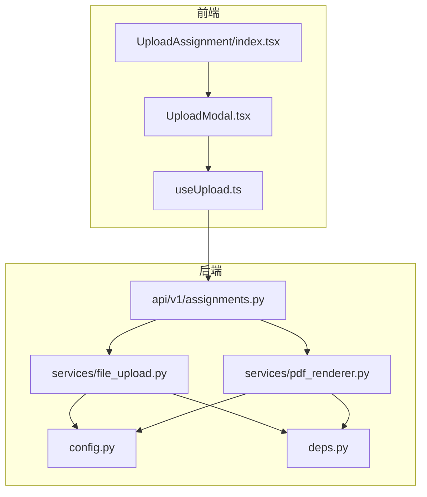
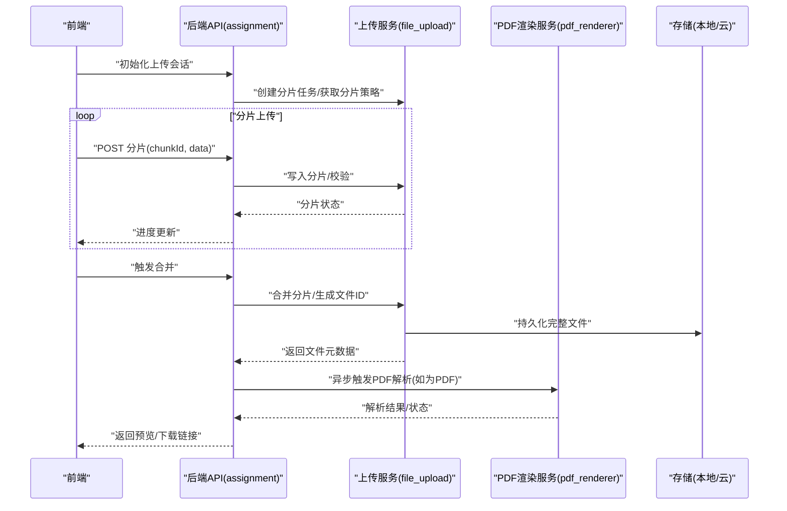
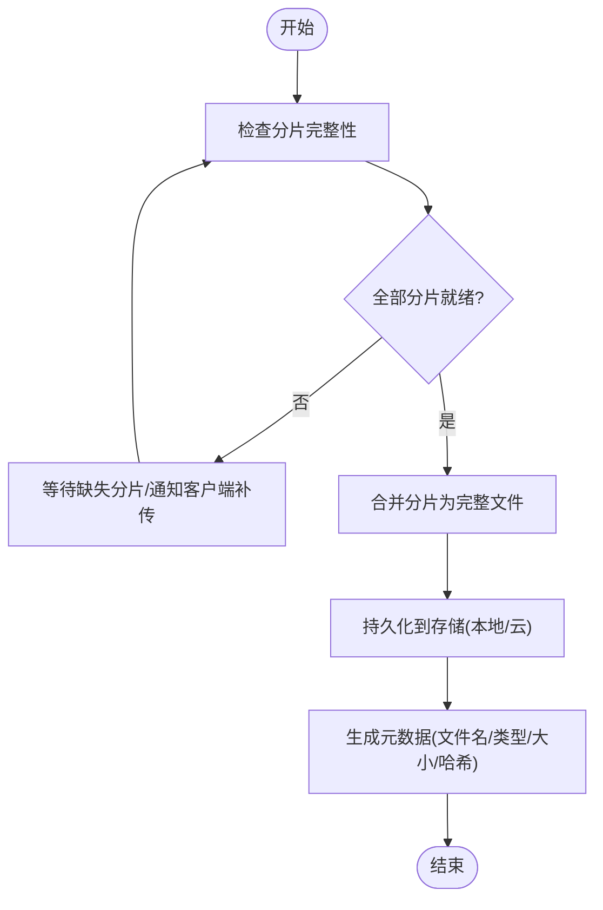
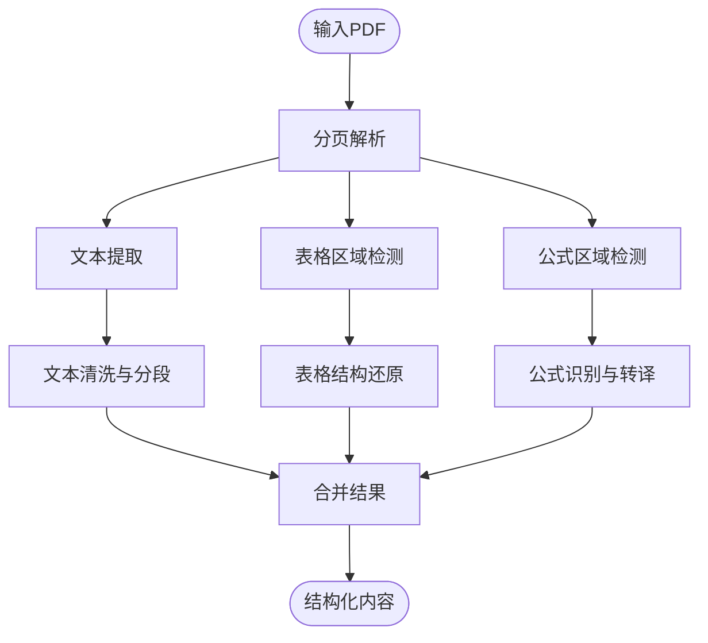
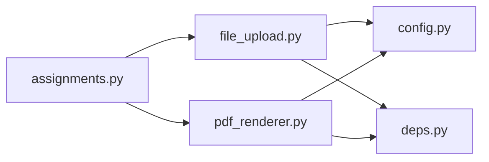

# 文件处理系统

<cite>
**本文引用的文件**   
- [backend/app/services/file_upload.py](file://backend/app/services/file_upload.py)
- [backend/app/services/pdf_renderer.py](file://backend/app/services/pdf_renderer.py)
- [backend/app/api/v1/assignments.py](file://backend/app/api/v1/assignments.py)
- [frontend/src/components/UploadModal.tsx](file://frontend/src/components/UploadModal.tsx)
- [frontend/src/hooks/useUpload.ts](file://frontend/src/hooks/useUpload.ts)
- [frontend/src/pages/AssignmentManagement/UploadAssignment/index.tsx](file://frontend/src/pages/AssignmentManagement/UploadAssignment/index.tsx)
- [backend/app/core/config.py](file://backend/app/core/config.py)
- [backend/app/core/deps.py](file://backend/app/core/deps.py)
</cite>

## 目录
1. [简介](#简介)
2. [项目结构](#项目结构)
3. [核心组件](#核心组件)
4. [架构总览](#架构总览)
5. [详细组件分析](#详细组件分析)
6. [依赖关系分析](#依赖关系分析)
7. [性能考虑](#性能考虑)
8. [故障排查指南](#故障排查指南)
9. [结论](#结论)
10. [附录](#附录)

## 简介
本文件处理系统面向作业与文档场景，提供统一的上传下载、解析渲染与预览编辑能力。后端以 FastAPI 为核心，结合任务队列进行异步处理；前端通过模块化组件与服务层完成交互。系统支持单文件与批量上传、断点续传、格式校验、安全扫描（可扩展）、PDF 文本提取、表格识别、公式解析等能力，并提供本地与云存储的扩展接口。

## 项目结构
围绕“文件处理”的关键代码分布在以下位置：
- 后端服务
  - 上传服务：负责分片、合并、校验、元数据记录与下载
  - PDF 渲染服务：负责文本提取、表格识别、公式解析与结果结构化
  - API 路由：暴露上传、下载、进度查询等接口
  - 配置与依赖注入：统一读取大小限制、存储路径、第三方服务凭据等
- 前端
  - 上传弹窗与页面：实现拖拽、分片、并发、重试、进度展示
  - 上传 Hook：封装通用上传逻辑与错误处理
  - 业务页面：调用上传服务并展示结果

图表来源
- [backend/app/api/v1/assignments.py](file://backend/app/api/v1/assignments.py)
- [backend/app/services/file_upload.py](file://backend/app/services/file_upload.py)
- [backend/app/services/pdf_renderer.py](file://backend/app/services/pdf_renderer.py)
- [backend/app/core/config.py](file://backend/app/core/config.py)
- [backend/app/core/deps.py](file://backend/app/core/deps.py)
- [frontend/src/components/UploadModal.tsx](file://frontend/src/components/UploadModal.tsx)
- [frontend/src/hooks/useUpload.ts](file://frontend/src/hooks/useUpload.ts)
- [frontend/src/pages/AssignmentManagement/UploadAssignment/index.tsx](file://frontend/src/pages/AssignmentManagement/UploadAssignment/index.tsx)

章节来源
- [backend/app/api/v1/assignments.py](file://backend/app/api/v1/assignments.py)
- [backend/app/services/file_upload.py](file://backend/app/services/file_upload.py)
- [backend/app/services/pdf_renderer.py](file://backend/app/services/pdf_renderer.py)
- [backend/app/core/config.py](file://backend/app/core/config.py)
- [backend/app/core/deps.py](file://backend/app/core/deps.py)
- [frontend/src/components/UploadModal.tsx](file://frontend/src/components/UploadModal.tsx)
- [frontend/src/hooks/useUpload.ts](file://frontend/src/hooks/useUpload.ts)
- [frontend/src/pages/AssignmentManagement/UploadAssignment/index.tsx](file://frontend/src/pages/AssignmentManagement/UploadAssignment/index.tsx)

## 核心组件
- 上传服务（file_upload.py）
  - 职责：接收分片、校验完整性、合并为完整文件、生成唯一标识、持久化到存储、返回可下载链接或预览信息
  - 关键能力：分片上传、断点续传、并发控制、去重、元数据管理、下载流式输出
- PDF 渲染服务（pdf_renderer.py）
  - 职责：对 PDF 进行文本提取、表格识别、公式解析，输出结构化内容供后续 AI 或渲染使用
  - 关键能力：多页处理、OCR 可选、表格边界检测、数学公式识别与 LaTeX 转换
- API 路由（assignments.py）
  - 职责：暴露上传、下载、进度查询、状态同步等 REST 接口，协调上传服务与渲染服务
- 配置与依赖（config.py, deps.py）
  - 职责：集中管理文件大小限制、允许格式、存储路径、云存储凭据、并发参数等
- 前端上传模块（UploadModal.tsx, useUpload.ts, UploadAssignment/index.tsx）
  - 职责：用户交互、分片切分、并发上传、失败重试、进度上报、错误提示

章节来源
- [backend/app/services/file_upload.py](file://backend/app/services/file_upload.py)
- [backend/app/services/pdf_renderer.py](file://backend/app/services/pdf_renderer.py)
- [backend/app/api/v1/assignments.py](file://backend/app/api/v1/assignments.py)
- [backend/app/core/config.py](file://backend/app/core/config.py)
- [backend/app/core/deps.py](file://backend/app/core/deps.py)
- [frontend/src/components/UploadModal.tsx](file://frontend/src/components/UploadModal.tsx)
- [frontend/src/hooks/useUpload.ts](file://frontend/src/hooks/useUpload.ts)
- [frontend/src/pages/AssignmentManagement/UploadAssignment/index.tsx](file://frontend/src/pages/AssignmentManagement/UploadAssignment/index.tsx)

## 架构总览
整体采用前后端分离架构：前端通过 HTTP 接口与后端交互，后端将上传与渲染拆分为独立服务，便于横向扩展与替换实现。

图表来源
- [backend/app/api/v1/assignments.py](file://backend/app/api/v1/assignments.py)
- [backend/app/services/file_upload.py](file://backend/app/services/file_upload.py)
- [backend/app/services/pdf_renderer.py](file://backend/app/services/pdf_renderer.py)

## 详细组件分析

### 上传服务（file_upload.py）
- 设计要点
  - 分片策略：按固定大小切分，支持并发与乱序到达
  - 断点续传：基于分片索引与哈希校验，缺失分片自动补传
  - 合并流程：所有分片就绪后触发合并，生成最终文件与唯一 ID
  - 存储抽象：通过依赖注入切换本地磁盘或云存储实现
  - 下载接口：支持范围请求与流式传输，提升大文件体验
- 关键流程（合并与下载）

图表来源
- [backend/app/services/file_upload.py](file://backend/app/services/file_upload.py)

章节来源
- [backend/app/services/file_upload.py](file://backend/app/services/file_upload.py)

### PDF 渲染服务（pdf_renderer.py）
- 功能范围
  - 文本提取：逐页提取正文、标题、段落结构
  - 表格识别：检测表格区域，输出行列结构与单元格内容
  - 公式解析：识别数学公式并转换为结构化表示（如 LaTeX）
- 处理流程

图表来源
- [backend/app/services/pdf_renderer.py](file://backend/app/services/pdf_renderer.py)

章节来源
- [backend/app/services/pdf_renderer.py](file://backend/app/services/pdf_renderer.py)

### API 路由（assignments.py）
- 主要接口
  - 上传相关：初始化上传、上传分片、合并触发、进度查询
  - 下载相关：按文件 ID 下载、预览链接生成
  - 状态相关：解析任务状态、结果拉取
- 与服务的协作
  - 上传接口委托上传服务执行分片写入与合并
  - 解析接口触发 PDF 渲染服务并返回任务状态
  - 下载接口从存储读取并流式返回

章节来源
- [backend/app/api/v1/assignments.py](file://backend/app/api/v1/assignments.py)

### 前端上传模块（UploadModal.tsx, useUpload.ts, UploadAssignment/index.tsx）
- 组件职责
  - UploadModal：选择文件、显示进度、错误提示、取消上传
  - useUpload：封装分片切分、并发上传、重试、断点续传、进度上报
  - UploadAssignment：聚合上传流程，提交至后端并展示结果
- 关键交互
  - 分片切分：根据配置计算分片大小与总数
  - 并发控制：限制同时上传的分片数，避免阻塞
  - 断点续传：记录已上传分片，仅补传缺失部分
  - 进度反馈：实时上报与展示上传百分比

章节来源
- [frontend/src/components/UploadModal.tsx](file://frontend/src/components/UploadModal.tsx)
- [frontend/src/hooks/useUpload.ts](file://frontend/src/hooks/useUpload.ts)
- [frontend/src/pages/AssignmentManagement/UploadAssignment/index.tsx](file://frontend/src/pages/AssignmentManagement/UploadAssignment/index.tsx)

### 配置与依赖（config.py, deps.py）
- 配置项建议
  - 文件大小限制：最大单文件、最大批量化
  - 允许格式：PDF、图片、Word 等及其 MIME 类型映射
  - 存储路径：本地根目录、云存储桶名、访问域名
  - 并发参数：分片并发度、超时时间、重试次数
- 依赖注入
  - 存储服务接口：统一本地与云存储实现
  - 渲染引擎接口：统一 PDF 解析器与 OCR/公式引擎

章节来源
- [backend/app/core/config.py](file://backend/app/core/config.py)
- [backend/app/core/deps.py](file://backend/app/core/deps.py)

## 依赖关系分析
- 组件耦合
  - API 路由对上传与渲染服务存在直接依赖，但通过依赖注入降低耦合度
  - 上传服务对存储抽象有依赖，便于替换本地/云存储
  - 前端对后端接口契约稳定，内部实现变更不影响前端
- 外部集成点
  - 云存储 SDK（如对象存储）
  - PDF 解析与 OCR/公式引擎（可插拔）
  - 病毒扫描服务（可扩展）

图表来源
- [backend/app/api/v1/assignments.py](file://backend/app/api/v1/assignments.py)
- [backend/app/services/file_upload.py](file://backend/app/services/file_upload.py)
- [backend/app/services/pdf_renderer.py](file://backend/app/services/pdf_renderer.py)
- [backend/app/core/config.py](file://backend/app/core/config.py)
- [backend/app/core/deps.py](file://backend/app/core/deps.py)

章节来源
- [backend/app/api/v1/assignments.py](file://backend/app/api/v1/assignments.py)
- [backend/app/services/file_upload.py](file://backend/app/services/file_upload.py)
- [backend/app/services/pdf_renderer.py](file://backend/app/services/pdf_renderer.py)
- [backend/app/core/config.py](file://backend/app/core/config.py)
- [backend/app/core/deps.py](file://backend/app/core/deps.py)

## 性能考虑
- 分片大小与并发
  - 合理设置分片大小（如 1–5MB）与并发度，平衡网络吞吐与内存占用
- 断点续传
  - 利用分片索引与哈希校验减少重复传输，提升弱网稳定性
- 流式下载
  - 使用范围请求与流式响应，避免一次性加载大文件
- 异步渲染
  - PDF 解析与 OCR/公式识别应异步执行，避免阻塞上传链路
- 存储优化
  - 本地存储启用顺序写与预分配；云存储启用分片上传与压缩

[本节为通用指导，不直接分析具体文件]

## 故障排查指南
- 上传失败
  - 检查分片是否齐全、哈希是否一致、网络是否中断
  - 查看服务端日志中的分片写入与合并阶段错误
- 断点续传无效
  - 确认分片命名规则与索引一致性
  - 核对服务端分片清理策略与过期时间
- 解析异常
  - 验证 PDF 版本与加密状态
  - 检查 OCR/公式引擎可用性与资源配额
- 下载缓慢
  - 评估网络带宽与服务器 I/O
  - 确认是否启用流式响应与缓存头

章节来源
- [backend/app/services/file_upload.py](file://backend/app/services/file_upload.py)
- [backend/app/services/pdf_renderer.py](file://backend/app/services/pdf_renderer.py)
- [backend/app/api/v1/assignments.py](file://backend/app/api/v1/assignments.py)

## 结论
本文件处理系统通过分片上传、断点续传、异步渲染与存储抽象，构建了高可用、可扩展的文件处理能力。前端与后端职责清晰，服务间通过依赖注入解耦，便于接入云存储与第三方解析引擎。建议在生产环境完善安全扫描、权限控制与审计日志，进一步提升系统健壮性。

[本节为总结性内容，不直接分析具体文件]

## 附录

### 支持的格式与处理流程
- PDF
  - 文本提取、表格识别、公式解析，输出结构化内容用于预览与 AI 处理
- 图片
  - 缩略图生成、格式校验、尺寸与 DPI 检查
- Word
  - 文本与表格提取、样式保留（视引擎能力）

章节来源
- [backend/app/services/pdf_renderer.py](file://backend/app/services/pdf_renderer.py)

### 安全机制
- 文件大小限制：在配置中统一设定上限，防止资源耗尽
- 格式验证：基于 MIME 与扩展名双重校验，拒绝非法类型
- 病毒扫描：可扩展接入杀毒服务，在合并完成后进行扫描
- 访问控制：下载需鉴权，支持临时签名链接

章节来源
- [backend/app/core/config.py](file://backend/app/core/config.py)
- [backend/app/api/v1/assignments.py](file://backend/app/api/v1/assignments.py)

### 预览与在线编辑方案
- 预览
  - PDF：服务端渲染为 HTML/图片，前端嵌入 iframe 或 canvas
  - 图片：直接浏览器原生预览
  - Word：转为 HTML 或 PDF 后再预览
- 在线编辑
  - 基于富文本编辑器（如 Quill/TinyMCE）与后端保存接口
  - 版本管理与冲突解决策略

章节来源
- [backend/app/services/pdf_renderer.py](file://backend/app/services/pdf_renderer.py)
- [backend/app/api/v1/assignments.py](file://backend/app/api/v1/assignments.py)

### 扩展方法与自定义文件类型
- 新增文件类型
  - 在配置中添加允许格式与 MIME 映射
  - 在渲染服务中注册新的解析器（文本/表格/公式）
- 替换存储后端
  - 实现存储接口并在依赖注入中注册新实现
- 增强安全扫描
  - 在合并完成后插入扫描步骤，失败则删除文件并返回错误码

章节来源
- [backend/app/core/config.py](file://backend/app/core/config.py)
- [backend/app/core/deps.py](file://backend/app/core/deps.py)
- [backend/app/services/pdf_renderer.py](file://backend/app/services/pdf_renderer.py)