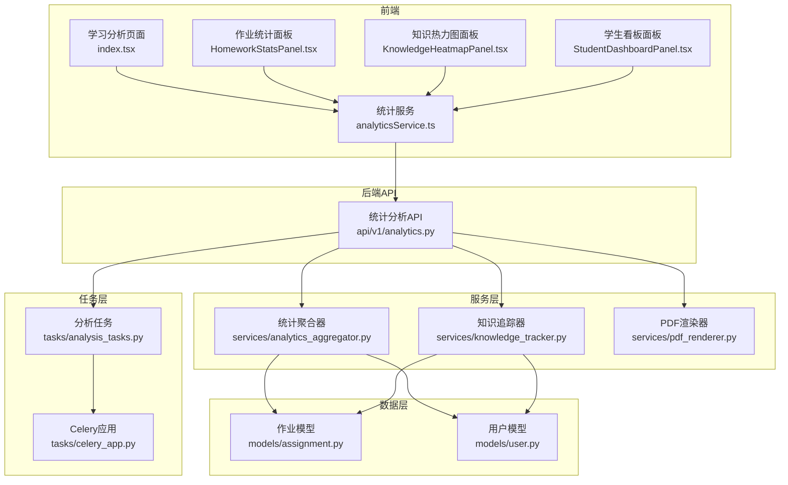
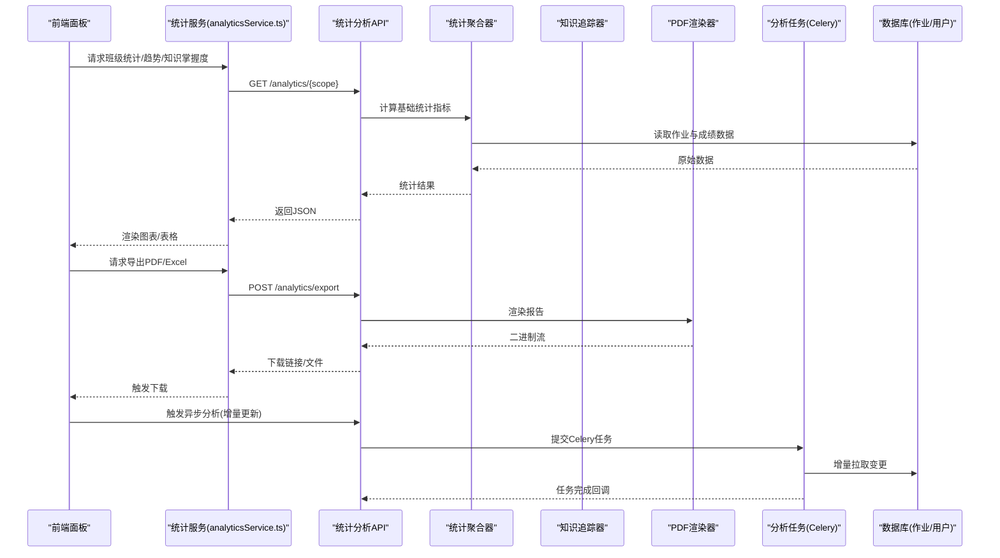
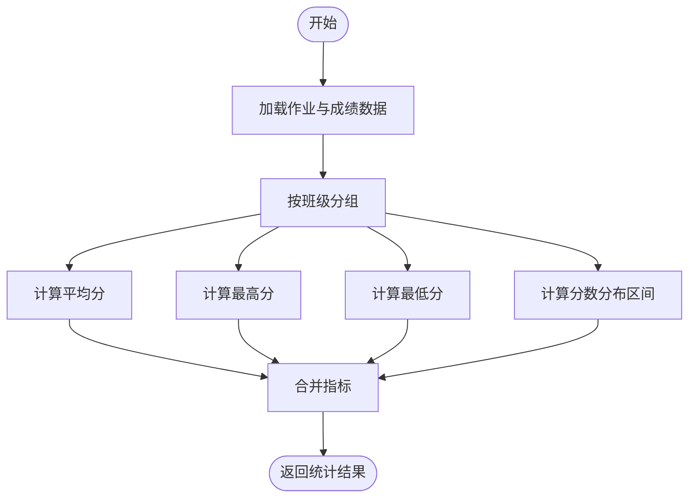
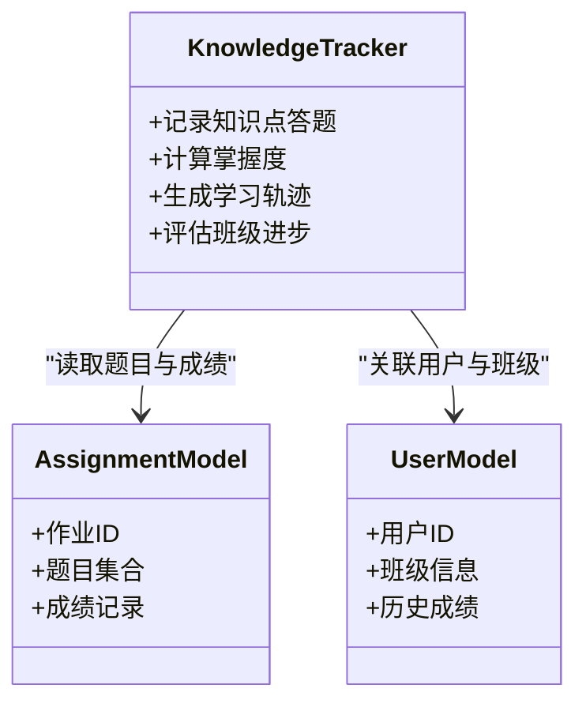
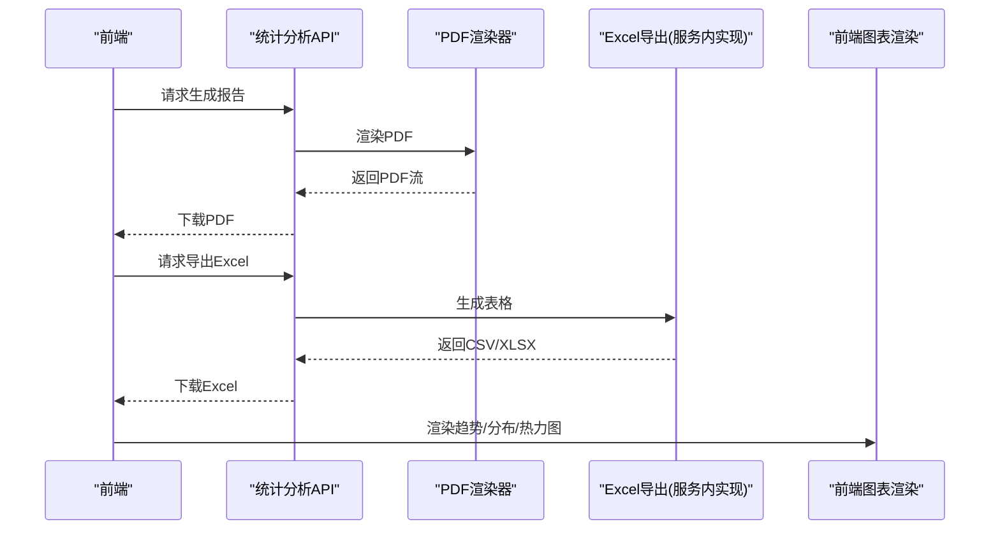
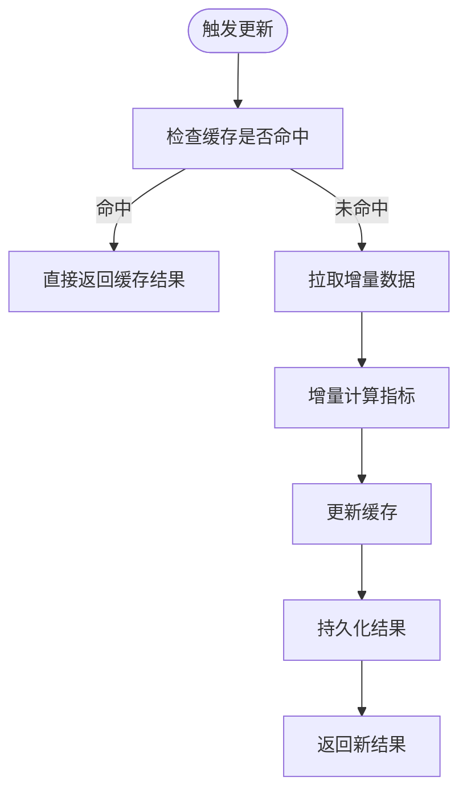
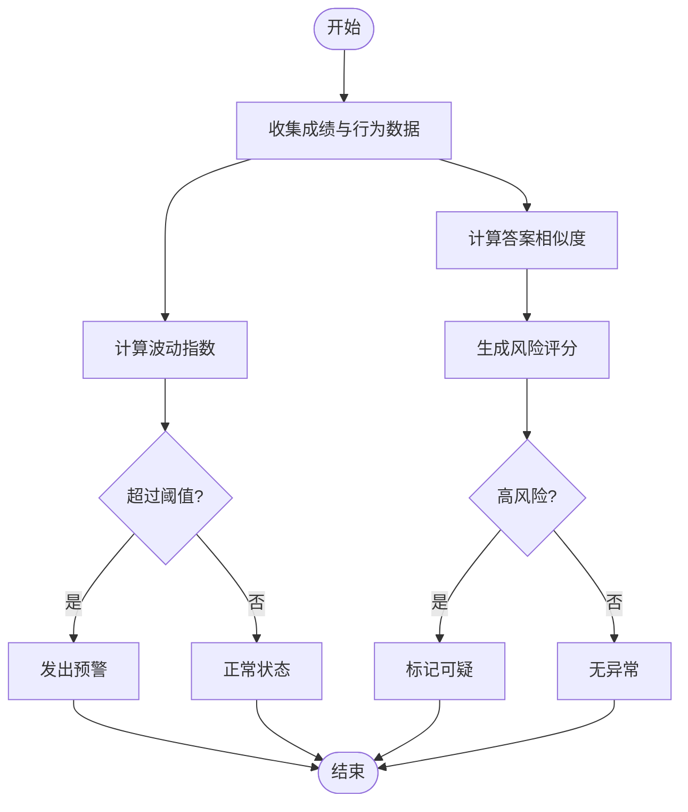
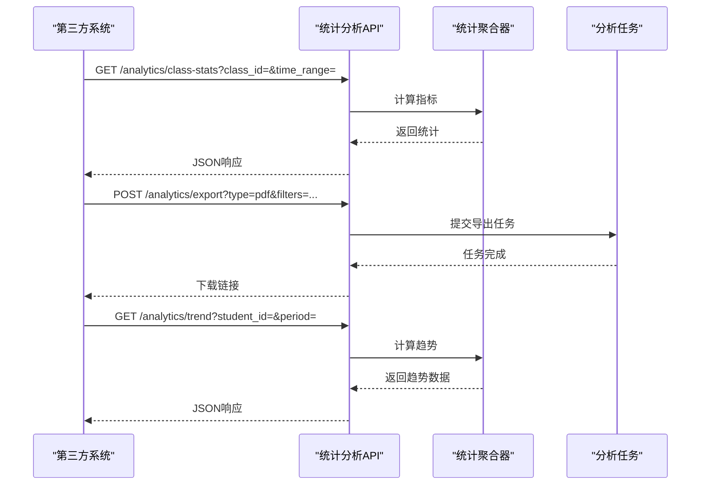
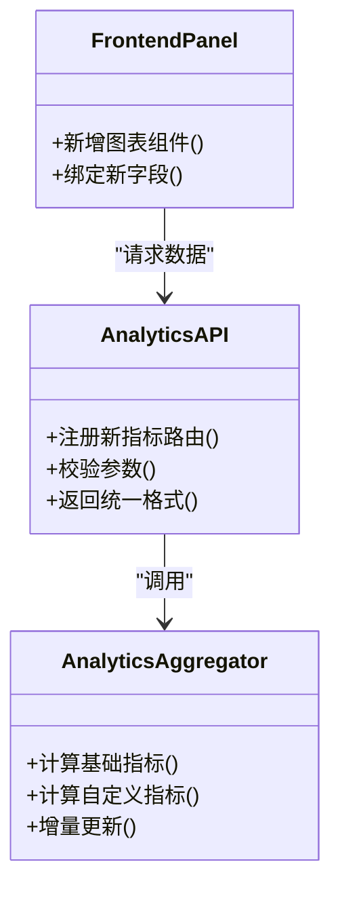
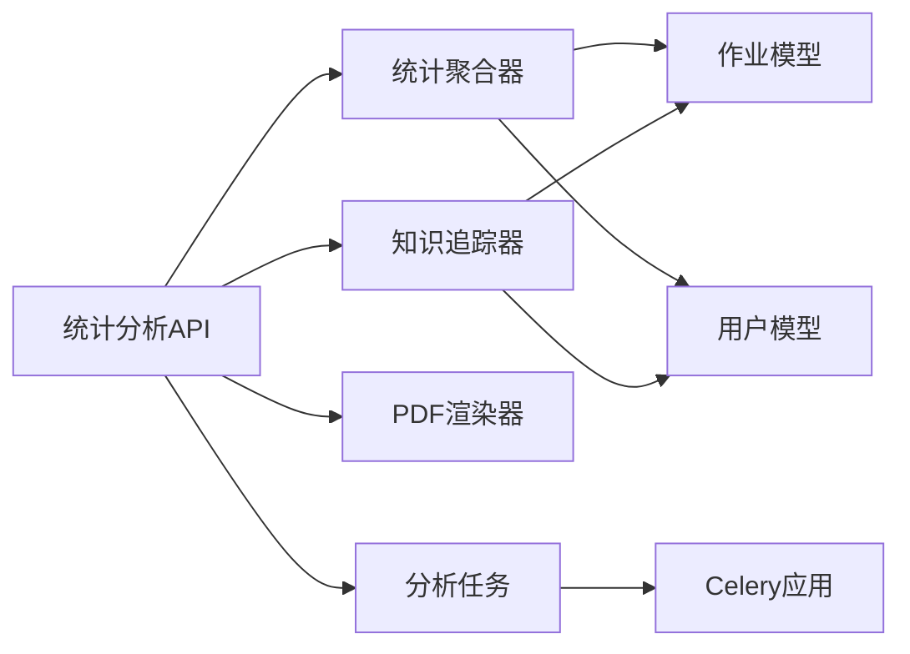

# 统计分析功能

<cite>
**本文引用的文件**   
- [analytics.py](file://backend/app/api/v1/analytics.py)
- [analytics_aggregator.py](file://backend/app/services/analytics_aggregator.py)
- [knowledge_tracker.py](file://backend/app/services/knowledge_tracker.py)
- [pdf_renderer.py](file://backend/app/services/pdf_renderer.py)
- [analysis_tasks.py](file://backend/app/tasks/analysis_tasks.py)
- [celery_app.py](file://backend/app/tasks/celery_app.py)
- [assignment.py](file://backend/app/models/assignment.py)
- [user.py](file://backend/app/models/user.py)
- [analytics.py](file://backend/app/schemas/analytics.py)
- [analyticsService.ts](file://frontend/src/services/analyticsService.ts)
- [LearningAnalytics/index.tsx](file://frontend/src/pages/LearningAnalytics/index.tsx)
- [HomeworkStatsPanel.tsx](file://frontend/src/pages/LearningAnalytics/HomeworkStatsPanel.tsx)
- [KnowledgeHeatmapPanel.tsx](file://frontend/src/pages/LearningAnalytics/KnowledgeHeatmapPanel.tsx)
- [StudentDashboardPanel.tsx](file://frontend/src/pages/LearningAnalytics/StudentDashboardPanel.tsx)
</cite>

## 目录
1. [简介](#简介)
2. [项目结构](#项目结构)
3. [核心组件](#核心组件)
4. [架构总览](#架构总览)
5. [详细组件分析](#详细组件分析)
6. [依赖关系分析](#依赖关系分析)
7. [性能考虑](#性能考虑)
8. [故障排查指南](#故障排查指南)
9. [结论](#结论)
10. [附录](#附录)

## 简介
本文件面向“统计分析”能力，覆盖作业相关的统计指标（班级平均分、最高分、最低分、分数分布）、成绩趋势分析（个人学习轨迹、班级进步情况、知识点掌握度）、报告生成机制（PDF、Excel、可视化图表）、实时统计更新（增量计算、缓存策略、性能优化）、异常检测（成绩波动预警、作弊行为识别）以及对外API接口与扩展方法。文档同时提供前后端交互流程、数据模型与关键算法的图示化说明，帮助开发者快速理解并扩展系统。

## 项目结构
统计分析相关代码主要分布在后端API、服务层、任务调度层、数据模型与前端页面/服务中：
- API层：提供统计分析查询与导出接口
- 服务层：聚合统计、知识追踪、PDF渲染等
- 任务层：异步分析与定时刷新
- 数据层：作业、用户等实体模型
- 前端：学习分析页面与面板、统计服务封装

**图表来源**
- [analytics.py](file://backend/app/api/v1/analytics.py)
- [analytics_aggregator.py](file://backend/app/services/analytics_aggregator.py)
- [knowledge_tracker.py](file://backend/app/services/knowledge_tracker.py)
- [pdf_renderer.py](file://backend/app/services/pdf_renderer.py)
- [analysis_tasks.py](file://backend/app/tasks/analysis_tasks.py)
- [celery_app.py](file://backend/app/tasks/celery_app.py)
- [assignment.py](file://backend/app/models/assignment.py)
- [user.py](file://backend/app/models/user.py)
- [LearningAnalytics/index.tsx](file://frontend/src/pages/LearningAnalytics/index.tsx)
- [HomeworkStatsPanel.tsx](file://frontend/src/pages/LearningAnalytics/HomeworkStatsPanel.tsx)
- [KnowledgeHeatmapPanel.tsx](file://frontend/src/pages/LearningAnalytics/KnowledgeHeatmapPanel.tsx)
- [StudentDashboardPanel.tsx](file://frontend/src/pages/LearningAnalytics/StudentDashboardPanel.tsx)
- [analyticsService.ts](file://frontend/src/services/analyticsService.ts)

**章节来源**
- [analytics.py](file://backend/app/api/v1/analytics.py)
- [analytics_aggregator.py](file://backend/app/services/analytics_aggregator.py)
- [knowledge_tracker.py](file://backend/app/services/knowledge_tracker.py)
- [pdf_renderer.py](file://backend/app/services/pdf_renderer.py)
- [analysis_tasks.py](file://backend/app/tasks/analysis_tasks.py)
- [celery_app.py](file://backend/app/tasks/celery_app.py)
- [assignment.py](file://backend/app/models/assignment.py)
- [user.py](file://backend/app/models/user.py)
- [LearningAnalytics/index.tsx](file://frontend/src/pages/LearningAnalytics/index.tsx)
- [HomeworkStatsPanel.tsx](file://frontend/src/pages/LearningAnalytics/HomeworkStatsPanel.tsx)
- [KnowledgeHeatmapPanel.tsx](file://frontend/src/pages/LearningAnalytics/KnowledgeHeatmapPanel.tsx)
- [StudentDashboardPanel.tsx](file://frontend/src/pages/LearningAnalytics/StudentDashboardPanel.tsx)
- [analyticsService.ts](file://frontend/src/services/analyticsService.ts)

## 核心组件
- 统计分析API：提供基础统计、趋势分析、知识掌握度、报告导出等接口
- 统计聚合器：负责从作业与用户数据中计算班级平均分、最高分、最低分、分数分布等指标
- 知识追踪器：维护知识点掌握度、学习轨迹与班级进步情况
- PDF渲染器：将统计结果渲染为PDF报告
- 分析任务：基于Celery执行异步分析与增量更新
- 前端面板与服务：展示统计结果、触发导出与分析任务

**章节来源**
- [analytics.py](file://backend/app/api/v1/analytics.py)
- [analytics_aggregator.py](file://backend/app/services/analytics_aggregator.py)
- [knowledge_tracker.py](file://backend/app/services/knowledge_tracker.py)
- [pdf_renderer.py](file://backend/app/services/pdf_renderer.py)
- [analysis_tasks.py](file://backend/app/tasks/analysis_tasks.py)
- [celery_app.py](file://backend/app/tasks/celery_app.py)
- [analyticsService.ts](file://frontend/src/services/analyticsService.ts)
- [LearningAnalytics/index.tsx](file://frontend/src/pages/LearningAnalytics/index.tsx)

## 架构总览
统计分析采用“API + 服务 + 任务 + 数据模型”的分层架构，前端通过服务调用API获取统计结果或触发异步任务。

**图表来源**
- [analytics.py](file://backend/app/api/v1/analytics.py)
- [analytics_aggregator.py](file://backend/app/services/analytics_aggregator.py)
- [knowledge_tracker.py](file://backend/app/services/knowledge_tracker.py)
- [pdf_renderer.py](file://backend/app/services/pdf_renderer.py)
- [analysis_tasks.py](file://backend/app/tasks/analysis_tasks.py)
- [celery_app.py](file://backend/app/tasks/celery_app.py)
- [analyticsService.ts](file://frontend/src/services/analyticsService.ts)

## 详细组件分析

### 基础统计指标（班级平均分、最高分、最低分、分数分布）
- 数据来源：作业与用户成绩记录
- 计算逻辑：按班级维度聚合分数，计算均值、极值与分布区间计数
- 输出格式：结构化JSON，包含各指标与时间范围

**图表来源**
- [analytics_aggregator.py](file://backend/app/services/analytics_aggregator.py)
- [assignment.py](file://backend/app/models/assignment.py)
- [user.py](file://backend/app/models/user.py)

**章节来源**
- [analytics_aggregator.py](file://backend/app/services/analytics_aggregator.py)
- [assignment.py](file://backend/app/models/assignment.py)
- [user.py](file://backend/app/models/user.py)

### 成绩趋势分析（个人学习轨迹、班级进步情况、知识点掌握度）
- 个人学习轨迹：按时间序列汇总个人得分变化，支持滑动窗口与趋势拟合
- 班级进步情况：对比不同时间段的班级整体表现，识别提升或退步
- 知识点掌握度：基于题目标签/知识点映射，统计正确率与掌握等级

**图表来源**
- [knowledge_tracker.py](file://backend/app/services/knowledge_tracker.py)
- [assignment.py](file://backend/app/models/assignment.py)
- [user.py](file://backend/app/models/user.py)

**章节来源**
- [knowledge_tracker.py](file://backend/app/services/knowledge_tracker.py)
- [assignment.py](file://backend/app/models/assignment.py)
- [user.py](file://backend/app/models/user.py)

### 报告生成机制（PDF、Excel、可视化图表）
- PDF报告：将统计结果与图表渲染为可打印的报告文件
- Excel报表：导出结构化数据供二次分析
- 可视化图表：前端使用图表库渲染趋势、分布与热力图

**图表来源**
- [pdf_renderer.py](file://backend/app/services/pdf_renderer.py)
- [analytics.py](file://backend/app/api/v1/analytics.py)
- [LearningAnalytics/index.tsx](file://frontend/src/pages/LearningAnalytics/index.tsx)

**章节来源**
- [pdf_renderer.py](file://backend/app/services/pdf_renderer.py)
- [analytics.py](file://backend/app/api/v1/analytics.py)
- [LearningAnalytics/index.tsx](file://frontend/src/pages/LearningAnalytics/index.tsx)

### 实时统计更新机制（增量计算、缓存策略、性能优化）
- 增量计算：仅处理新增或变更的作业与成绩记录，降低全量重算成本
- 缓存策略：对热点统计结果进行短期缓存，减少重复计算
- 性能优化：分页读取、并行聚合、索引优化

**图表来源**
- [analysis_tasks.py](file://backend/app/tasks/analysis_tasks.py)
- [celery_app.py](file://backend/app/tasks/celery_app.py)
- [analytics_aggregator.py](file://backend/app/services/analytics_aggregator.py)

**章节来源**
- [analysis_tasks.py](file://backend/app/tasks/analysis_tasks.py)
- [celery_app.py](file://backend/app/tasks/celery_app.py)
- [analytics_aggregator.py](file://backend/app/services/analytics_aggregator.py)

### 异常检测（成绩波动预警、作弊行为识别）
- 成绩波动预警：基于时间序列的方差与阈值判断，识别显著波动
- 作弊行为识别：结合答题时长、相似度、异常模式进行风险评分

**图表来源**
- [knowledge_tracker.py](file://backend/app/services/knowledge_tracker.py)
- [analytics_aggregator.py](file://backend/app/services/analytics_aggregator.py)

**章节来源**
- [knowledge_tracker.py](file://backend/app/services/knowledge_tracker.py)
- [analytics_aggregator.py](file://backend/app/services/analytics_aggregator.py)

### 统计数据的API接口（第三方集成）
- 基础统计：按班级/时间范围查询平均分、最高分、最低分、分布
- 趋势分析：个人轨迹、班级进步、知识点掌握度
- 报告导出：PDF/Excel导出接口
- 任务管理：触发异步分析与进度查询

**图表来源**
- [analytics.py](file://backend/app/api/v1/analytics.py)
- [analytics_aggregator.py](file://backend/app/services/analytics_aggregator.py)
- [analysis_tasks.py](file://backend/app/tasks/analysis_tasks.py)

**章节来源**
- [analytics.py](file://backend/app/api/v1/analytics.py)
- [analytics_aggregator.py](file://backend/app/services/analytics_aggregator.py)
- [analysis_tasks.py](file://backend/app/tasks/analysis_tasks.py)

### 自定义分析指标的扩展方法
- 在统计聚合器中新增指标计算函数，定义输入输出契约
- 在API层暴露新的查询参数与返回字段
- 在前端面板中增加对应图表与筛选条件
- 在任务层支持增量更新新指标

**图表来源**
- [analytics_aggregator.py](file://backend/app/services/analytics_aggregator.py)
- [analytics.py](file://backend/app/api/v1/analytics.py)
- [LearningAnalytics/index.tsx](file://frontend/src/pages/LearningAnalytics/index.tsx)

**章节来源**
- [analytics_aggregator.py](file://backend/app/services/analytics_aggregator.py)
- [analytics.py](file://backend/app/api/v1/analytics.py)
- [LearningAnalytics/index.tsx](file://frontend/src/pages/LearningAnalytics/index.tsx)

## 依赖关系分析
- API层依赖服务层进行计算与渲染
- 服务层依赖数据模型访问作业与用户信息
- 任务层通过Celery执行异步分析，避免阻塞主线程
- 前端通过服务封装统一调用API，并在面板中展示结果

**图表来源**
- [analytics.py](file://backend/app/api/v1/analytics.py)
- [analytics_aggregator.py](file://backend/app/services/analytics_aggregator.py)
- [knowledge_tracker.py](file://backend/app/services/knowledge_tracker.py)
- [pdf_renderer.py](file://backend/app/services/pdf_renderer.py)
- [analysis_tasks.py](file://backend/app/tasks/analysis_tasks.py)
- [celery_app.py](file://backend/app/tasks/celery_app.py)
- [assignment.py](file://backend/app/models/assignment.py)
- [user.py](file://backend/app/models/user.py)

**章节来源**
- [analytics.py](file://backend/app/api/v1/analytics.py)
- [analytics_aggregator.py](file://backend/app/services/analytics_aggregator.py)
- [knowledge_tracker.py](file://backend/app/services/knowledge_tracker.py)
- [pdf_renderer.py](file://backend/app/services/pdf_renderer.py)
- [analysis_tasks.py](file://backend/app/tasks/analysis_tasks.py)
- [celery_app.py](file://backend/app/tasks/celery_app.py)
- [assignment.py](file://backend/app/models/assignment.py)
- [user.py](file://backend/app/models/user.py)

## 性能考虑
- 增量计算优先：仅在数据变更时重新计算受影响指标
- 缓存热点结果：对高频查询设置合理过期时间
- 并行聚合：对多班级或多时间段的数据进行并行处理
- 索引优化：为作业ID、用户ID、时间戳建立合适索引
- 分页与限流：避免一次性加载大量数据导致内存压力

[本节为通用指导，不直接分析具体文件]

## 故障排查指南
- 统计结果为空：检查作业与成绩数据是否存在、时间范围是否正确
- 导出失败：确认PDF渲染器依赖是否安装、模板路径是否正确
- 异步任务堆积：检查Celery工作进程数量与队列配置
- 缓存不一致：清理缓存后重试，或调整缓存失效策略
- 前端图表不显示：确认API返回字段与前端绑定一致

**章节来源**
- [pdf_renderer.py](file://backend/app/services/pdf_renderer.py)
- [analysis_tasks.py](file://backend/app/tasks/analysis_tasks.py)
- [celery_app.py](file://backend/app/tasks/celery_app.py)
- [analyticsService.ts](file://frontend/src/services/analyticsService.ts)

## 结论
统计分析功能通过分层架构与异步任务实现了高效、可扩展的成绩与知识掌握度分析。基础指标、趋势分析、报告导出与异常检测共同构成完整的数据洞察体系。开发者可通过聚合器与API扩展自定义指标，并结合前端面板实现可视化呈现。

[本节为总结性内容，不直接分析具体文件]

## 附录
- 前端面板参考：
  - 学习分析主页：[LearningAnalytics/index.tsx](file://frontend/src/pages/LearningAnalytics/index.tsx)
  - 作业统计面板：[HomeworkStatsPanel.tsx](file://frontend/src/pages/LearningAnalytics/HomeworkStatsPanel.tsx)
  - 知识热力图面板：[KnowledgeHeatmapPanel.tsx](file://frontend/src/pages/LearningAnalytics/KnowledgeHeatmapPanel.tsx)
  - 学生看板面板：[StudentDashboardPanel.tsx](file://frontend/src/pages/LearningAnalytics/StudentDashboardPanel.tsx)
- 统计服务封装：[analyticsService.ts](file://frontend/src/services/analyticsService.ts)
- 数据模型：
  - 作业模型：[assignment.py](file://backend/app/models/assignment.py)
  - 用户模型：[user.py](file://backend/app/models/user.py)
- 统计Schema：[analytics.py](file://backend/app/schemas/analytics.py)

**章节来源**
- [LearningAnalytics/index.tsx](file://frontend/src/pages/LearningAnalytics/index.tsx)
- [HomeworkStatsPanel.tsx](file://frontend/src/pages/LearningAnalytics/HomeworkStatsPanel.tsx)
- [KnowledgeHeatmapPanel.tsx](file://frontend/src/pages/LearningAnalytics/KnowledgeHeatmapPanel.tsx)
- [StudentDashboardPanel.tsx](file://frontend/src/pages/LearningAnalytics/StudentDashboardPanel.tsx)
- [analyticsService.ts](file://frontend/src/services/analyticsService.ts)
- [assignment.py](file://backend/app/models/assignment.py)
- [user.py](file://backend/app/models/user.py)
- [analytics.py](file://backend/app/schemas/analytics.py)