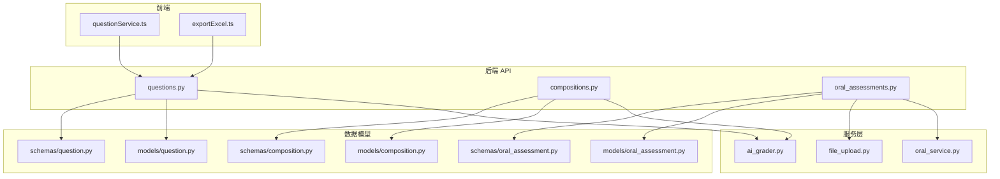
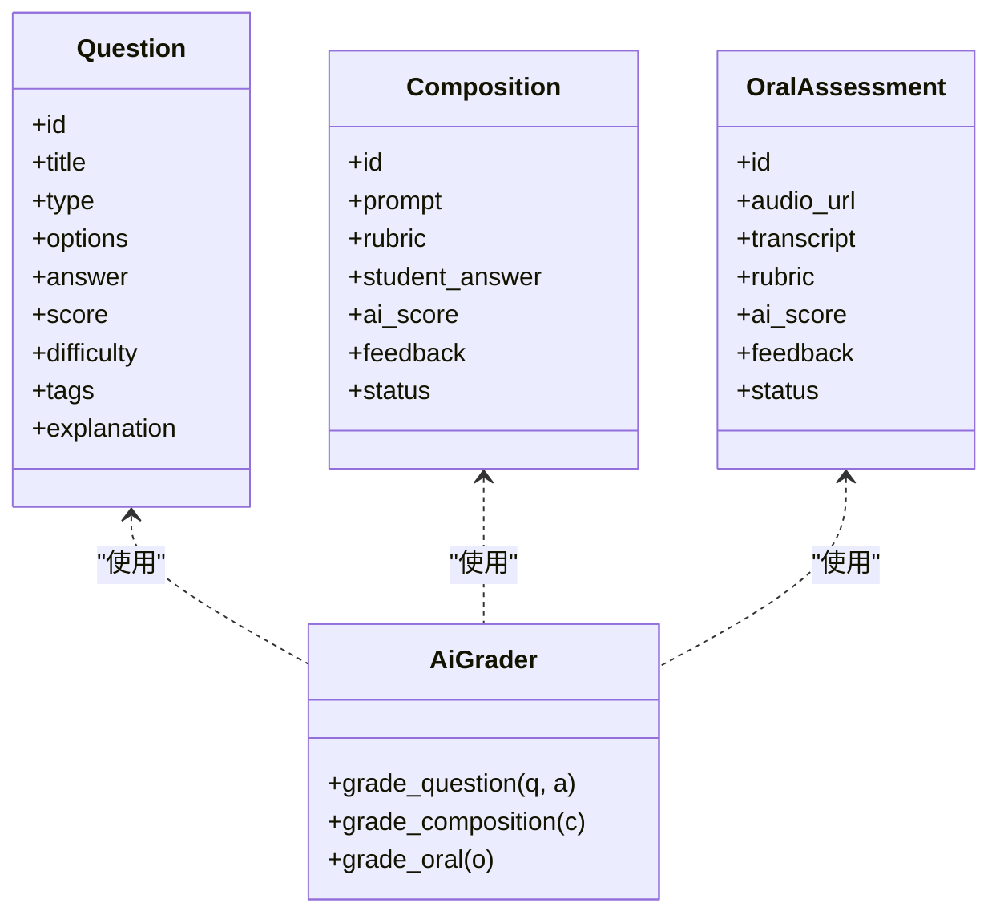
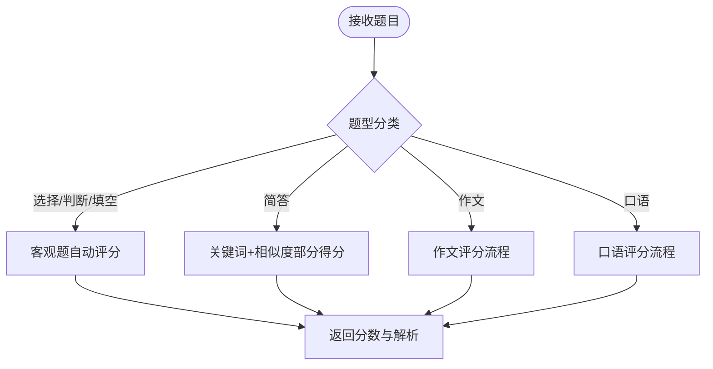
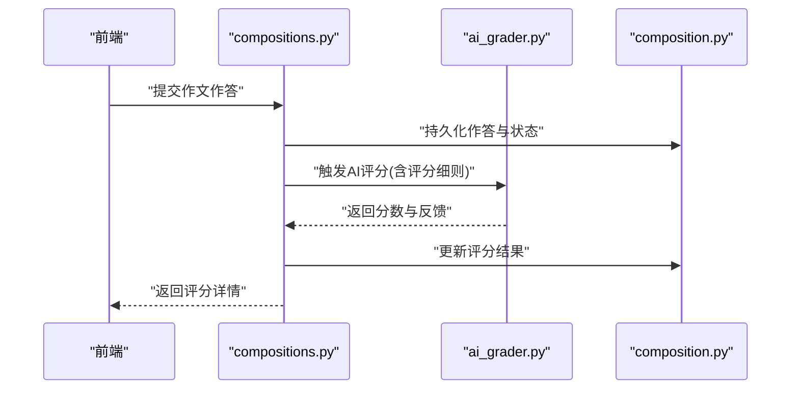
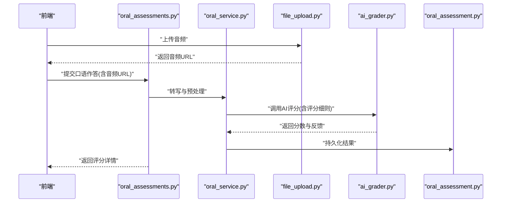
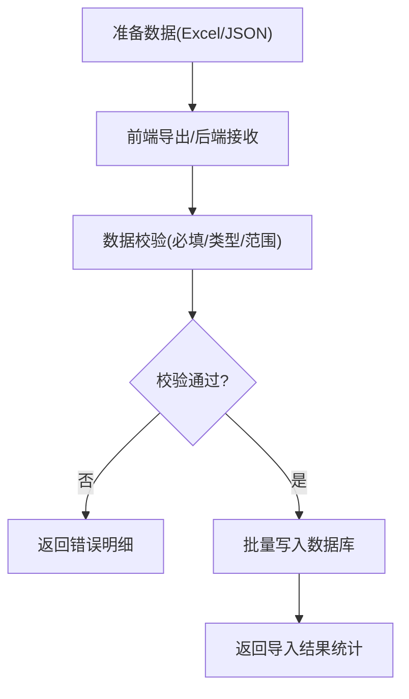
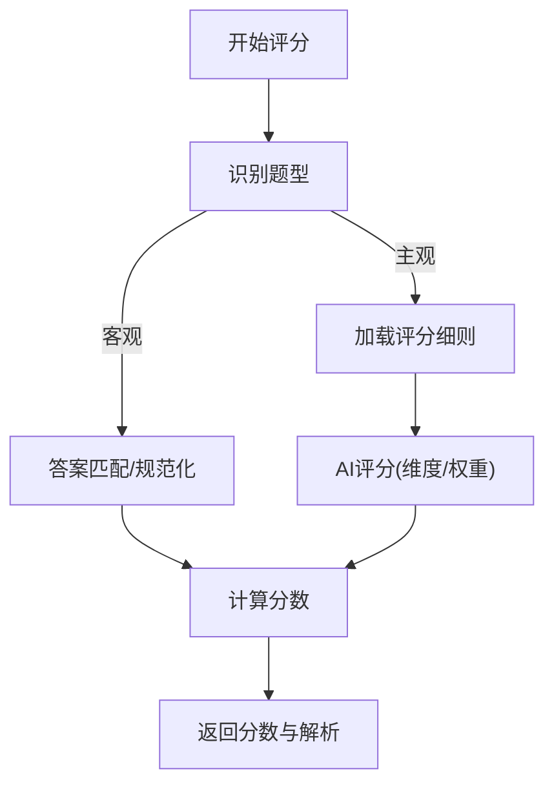
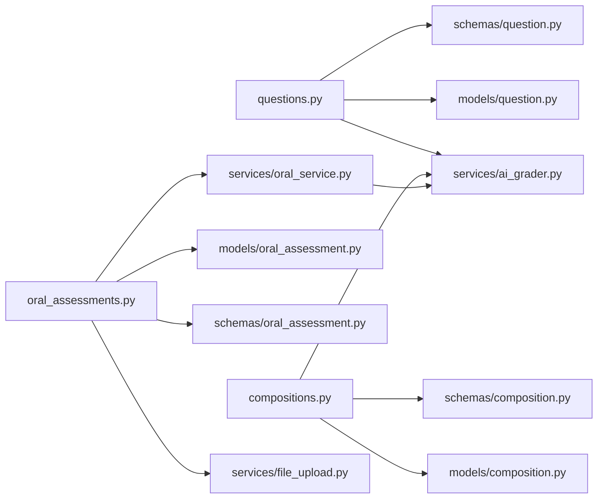

# 题型管理系统

<cite>
**本文引用的文件**   
- [backend/app/models/question.py](file://backend/app/models/question.py)
- [backend/app/schemas/question.py](file://backend/app/schemas/question.py)
- [backend/app/api/v1/questions.py](file://backend/app/api/v1/questions.py)
- [backend/app/services/ai_grader.py](file://backend/app/services/ai_grader.py)
- [backend/app/models/composition.py](file://backend/app/models/composition.py)
- [backend/app/schemas/composition.py](file://backend/app/schemas/composition.py)
- [backend/app/api/v1/compositions.py](file://backend/app/api/v1/compositions.py)
- [backend/app/models/oral_assessment.py](file://backend/app/models/oral_assessment.py)
- [backend/app/schemas/oral_assessment.py](file://backend/app/schemas/oral_assessment.py)
- [backend/app/api/v1/oral_assessments.py](file://backend/app/api/v1/oral_assessments.py)
- [backend/app/services/oral_service.py](file://backend/app/services/oral_service.py)
- [backend/app/services/file_upload.py](file://backend/app/services/file_upload.py)
- [frontend/src/utils/exportExcel.ts](file://frontend/src/utils/exportExcel.ts)
- [frontend/src/services/questionService.ts](file://frontend/src/services/questionService.ts)
</cite>

## 目录
1. [简介](#简介)
2. [项目结构](#项目结构)
3. [核心组件](#核心组件)
4. [架构总览](#架构总览)
5. [详细组件分析](#详细组件分析)
6. [依赖关系分析](#依赖关系分析)
7. [性能考虑](#性能考虑)
8. [故障排查指南](#故障排查指南)
9. [结论](#结论)
10. [附录](#附录)

## 简介
本文件面向开发者与教研人员，系统化说明“题型管理系统”的架构、数据模型、评分算法、模板机制、导入导出、版本兼容与新题型扩展方法。系统覆盖选择题、填空题、判断题、简答题、作文题、口语题等常见题型，提供客观题自动评分、主观题AI辅助评分与部分得分机制，并支持教师自定义题型结构与评分标准。

## 项目结构
后端采用分层架构：API层负责路由与参数校验，服务层封装业务逻辑（含AI评分、文件处理），模型与Schema定义数据结构；前端通过服务层调用API，并提供Excel导出能力。

图表来源
- [backend/app/api/v1/questions.py](file://backend/app/api/v1/questions.py)
- [backend/app/api/v1/compositions.py](file://backend/app/api/v1/compositions.py)
- [backend/app/api/v1/oral_assessments.py](file://backend/app/api/v1/oral_assessments.py)
- [backend/app/services/ai_grader.py](file://backend/app/services/ai_grader.py)
- [backend/app/services/oral_service.py](file://backend/app/services/oral_service.py)
- [backend/app/services/file_upload.py](file://backend/app/services/file_upload.py)
- [backend/app/models/question.py](file://backend/app/models/question.py)
- [backend/app/models/composition.py](file://backend/app/models/composition.py)
- [backend/app/models/oral_assessment.py](file://backend/app/models/oral_assessment.py)
- [backend/app/schemas/question.py](file://backend/app/schemas/question.py)
- [backend/app/schemas/composition.py](file://backend/app/schemas/composition.py)
- [backend/app/schemas/oral_assessment.py](file://backend/app/schemas/oral_assessment.py)
- [frontend/src/services/questionService.ts](file://frontend/src/services/questionService.ts)
- [frontend/src/utils/exportExcel.ts](file://frontend/src/utils/exportExcel.ts)

章节来源
- [backend/app/api/v1/questions.py](file://backend/app/api/v1/questions.py)
- [backend/app/api/v1/compositions.py](file://backend/app/api/v1/compositions.py)
- [backend/app/api/v1/oral_assessments.py](file://backend/app/api/v1/oral_assessments.py)
- [backend/app/services/ai_grader.py](file://backend/app/services/ai_grader.py)
- [backend/app/services/oral_service.py](file://backend/app/services/oral_service.py)
- [backend/app/services/file_upload.py](file://backend/app/services/file_upload.py)
- [backend/app/models/question.py](file://backend/app/models/question.py)
- [backend/app/models/composition.py](file://backend/app/models/composition.py)
- [backend/app/models/oral_assessment.py](file://backend/app/models/oral_assessment.py)
- [backend/app/schemas/question.py](file://backend/app/schemas/question.py)
- [backend/app/schemas/composition.py](file://backend/app/schemas/composition.py)
- [backend/app/schemas/oral_assessment.py](file://backend/app/schemas/oral_assessment.py)
- [frontend/src/services/questionService.ts](file://frontend/src/services/questionService.ts)
- [frontend/src/utils/exportExcel.ts](file://frontend/src/utils/exportExcel.ts)

## 核心组件
- 题目数据模型与Schema：统一描述题干、选项、答案、分值、难度、标签、解析等字段，支撑多种题型。
- 评分服务：包含客观题自动评分与主观题AI辅助评分，支持部分得分与评分细则。
- 作文与口语专项：针对写作与口语场景提供专用模型、服务与API。
- 文件上传与导出：支持批量导入与结果导出，便于教学管理。

章节来源
- [backend/app/models/question.py](file://backend/app/models/question.py)
- [backend/app/schemas/question.py](file://backend/app/schemas/question.py)
- [backend/app/services/ai_grader.py](file://backend/app/services/ai_grader.py)
- [backend/app/models/composition.py](file://backend/app/models/composition.py)
- [backend/app/schemas/composition.py](file://backend/app/schemas/composition.py)
- [backend/app/models/oral_assessment.py](file://backend/app/models/oral_assessment.py)
- [backend/app/schemas/oral_assessment.py](file://backend/app/schemas/oral_assessment.py)
- [backend/app/services/file_upload.py](file://backend/app/services/file_upload.py)
- [frontend/src/utils/exportExcel.ts](file://frontend/src/utils/exportExcel.ts)

## 架构总览
系统以“题型抽象 + 评分策略 + 领域扩展”的方式组织。通用题目模型承载基础信息，具体题型通过结构化字段表达；评分由策略化服务完成，AI评分作为可扩展的后端能力；作文与口语作为独立领域模块，复用通用能力并扩展自身流程。

图表来源
- [backend/app/models/question.py](file://backend/app/models/question.py)
- [backend/app/models/composition.py](file://backend/app/models/composition.py)
- [backend/app/models/oral_assessment.py](file://backend/app/models/oral_assessment.py)
- [backend/app/services/ai_grader.py](file://backend/app/services/ai_grader.py)

## 详细组件分析

### 通用题目模型与题型类型
- 支持的题型
  - 选择题：通过选项集合与正确答案匹配进行自动评分。
  - 填空题：基于关键词或正则匹配进行自动评分，支持多答案与容错。
  - 判断题：二值答案比对，快速判定对错。
  - 简答题：结合关键词命中与语义相似度进行部分得分。
  - 作文题：进入作文领域模型，按评分细则进行AI辅助评分。
  - 口语题：进入口语领域模型，结合语音转写与评分细则进行AI辅助评分。
- 数据结构要点
  - 题干、题型标识、选项集、参考答案、分值、难度、标签、解析等字段构成通用题目骨架。
  - 不同题型通过结构化字段组合实现差异化表达。

图表来源
- [backend/app/models/question.py](file://backend/app/models/question.py)
- [backend/app/schemas/question.py](file://backend/app/schemas/question.py)
- [backend/app/services/ai_grader.py](file://backend/app/services/ai_grader.py)

章节来源
- [backend/app/models/question.py](file://backend/app/models/question.py)
- [backend/app/schemas/question.py](file://backend/app/schemas/question.py)

### 作文题评分流程
- 输入：作文题目、评分细则、学生作答文本。
- 处理：调用AI评分服务，依据细则生成分数与反馈。
- 输出：分数、维度评分、改进建议与状态。

图表来源
- [backend/app/api/v1/compositions.py](file://backend/app/api/v1/compositions.py)
- [backend/app/services/ai_grader.py](file://backend/app/services/ai_grader.py)
- [backend/app/models/composition.py](file://backend/app/models/composition.py)
- [backend/app/schemas/composition.py](file://backend/app/schemas/composition.py)

章节来源
- [backend/app/api/v1/compositions.py](file://backend/app/api/v1/compositions.py)
- [backend/app/services/ai_grader.py](file://backend/app/services/ai_grader.py)
- [backend/app/models/composition.py](file://backend/app/models/composition.py)
- [backend/app/schemas/composition.py](file://backend/app/schemas/composition.py)

### 口语题评分流程
- 输入：音频文件、评分细则。
- 处理：语音转写、内容理解、发音/流利度等维度评估，综合生成分数与反馈。
- 输出：分数、维度评分、改进建议与状态。

图表来源
- [backend/app/api/v1/oral_assessments.py](file://backend/app/api/v1/oral_assessments.py)
- [backend/app/services/oral_service.py](file://backend/app/services/oral_service.py)
- [backend/app/services/file_upload.py](file://backend/app/services/file_upload.py)
- [backend/app/services/ai_grader.py](file://backend/app/services/ai_grader.py)
- [backend/app/models/oral_assessment.py](file://backend/app/models/oral_assessment.py)
- [backend/app/schemas/oral_assessment.py](file://backend/app/schemas/oral_assessment.py)

章节来源
- [backend/app/api/v1/oral_assessments.py](file://backend/app/api/v1/oral_assessments.py)
- [backend/app/services/oral_service.py](file://backend/app/services/oral_service.py)
- [backend/app/services/file_upload.py](file://backend/app/services/file_upload.py)
- [backend/app/services/ai_grader.py](file://backend/app/services/ai_grader.py)
- [backend/app/models/oral_assessment.py](file://backend/app/models/oral_assessment.py)
- [backend/app/schemas/oral_assessment.py](file://backend/app/schemas/oral_assessment.py)

### 题型模板系统与评分标准
- 模板目标：允许教师自定义题型结构与评分标准，如选项数量、是否允许多选、填空题空位数量、评分细则维度与权重等。
- 实现思路：在题目结构中引入模板字段，用于约束渲染与评分规则；评分服务读取模板中的细则进行打分。
- 兼容性：模板版本化，旧模板仍可被解析与降级处理。

章节来源
- [backend/app/models/question.py](file://backend/app/models/question.py)
- [backend/app/schemas/question.py](file://backend/app/schemas/question.py)
- [backend/app/services/ai_grader.py](file://backend/app/services/ai_grader.py)

### 导入导出功能
- Excel批量导入：前端提供导出工具，后端提供接口接收批量数据并进行校验与入库。
- JSON格式交换：通过通用题目Schema进行序列化与反序列化，便于跨系统迁移。
- 错误处理：对缺失字段、非法值、重复数据进行提示与回滚。

图表来源
- [frontend/src/utils/exportExcel.ts](file://frontend/src/utils/exportExcel.ts)
- [backend/app/api/v1/questions.py](file://backend/app/api/v1/questions.py)
- [backend/app/schemas/question.py](file://backend/app/schemas/question.py)

章节来源
- [frontend/src/utils/exportExcel.ts](file://frontend/src/utils/exportExcel.ts)
- [backend/app/api/v1/questions.py](file://backend/app/api/v1/questions.py)
- [backend/app/schemas/question.py](file://backend/app/schemas/question.py)

### 题型版本管理与兼容性
- 版本字段：在题目或模板中记录版本号，用于区分结构变更。
- 兼容策略：
  - 向前兼容：新结构可解析旧数据（默认值填充）。
  - 向后兼容：旧服务可忽略新增字段。
- 迁移机制：当模板升级时，提供迁移脚本或运行时转换逻辑，确保历史数据可用。

章节来源
- [backend/app/models/question.py](file://backend/app/models/question.py)
- [backend/app/schemas/question.py](file://backend/app/schemas/question.py)

### 评分算法与部分得分机制
- 客观题自动评分：严格匹配或规范化后匹配（大小写、空白、同义词映射）后进行计分。
- 主观题AI辅助评分：依据评分细则（维度、权重、阈值）生成分数与反馈。
- 部分得分：根据关键词命中、段落覆盖、语义相似度等指标按比例赋分。

图表来源
- [backend/app/services/ai_grader.py](file://backend/app/services/ai_grader.py)
- [backend/app/models/question.py](file://backend/app/models/question.py)
- [backend/app/schemas/question.py](file://backend/app/schemas/question.py)

章节来源
- [backend/app/services/ai_grader.py](file://backend/app/services/ai_grader.py)
- [backend/app/models/question.py](file://backend/app/models/question.py)
- [backend/app/schemas/question.py](file://backend/app/schemas/question.py)

### 新题型扩展开发指南
- 数据模型设计
  - 在通用题目模型中增加题型标识与专属字段，必要时扩展Schema。
  - 为模板字段预留扩展点，支持动态渲染与校验。
- 评分逻辑实现
  - 在评分服务中新增题型分支，实现匹配或AI评分逻辑。
  - 若涉及复杂规则，将规则外置为配置或模板，便于教师调整。
- 前端展示适配
  - 根据题型标识渲染对应表单与交互。
  - 对接导出/导入工具，确保数据一致性。
- 测试与回归
  - 编写单元测试覆盖边界条件与异常路径。
  - 进行端到端验证，确保与现有题型互不干扰。

章节来源
- [backend/app/models/question.py](file://backend/app/models/question.py)
- [backend/app/schemas/question.py](file://backend/app/schemas/question.py)
- [backend/app/services/ai_grader.py](file://backend/app/services/ai_grader.py)
- [frontend/src/services/questionService.ts](file://frontend/src/services/questionService.ts)
- [frontend/src/utils/exportExcel.ts](file://frontend/src/utils/exportExcel.ts)

## 依赖关系分析
- 模块耦合
  - API层依赖服务层与模型/Schema，职责清晰，低耦合。
  - 作文与口语模块复用AI评分服务，避免重复实现。
- 外部依赖
  - 文件上传服务用于音频等资源处理。
  - 前端导出工具依赖浏览器环境生成Excel。

图表来源
- [backend/app/api/v1/questions.py](file://backend/app/api/v1/questions.py)
- [backend/app/api/v1/compositions.py](file://backend/app/api/v1/compositions.py)
- [backend/app/api/v1/oral_assessments.py](file://backend/app/api/v1/oral_assessments.py)
- [backend/app/models/question.py](file://backend/app/models/question.py)
- [backend/app/models/composition.py](file://backend/app/models/composition.py)
- [backend/app/models/oral_assessment.py](file://backend/app/models/oral_assessment.py)
- [backend/app/schemas/question.py](file://backend/app/schemas/question.py)
- [backend/app/schemas/composition.py](file://backend/app/schemas/composition.py)
- [backend/app/schemas/oral_assessment.py](file://backend/app/schemas/oral_assessment.py)
- [backend/app/services/ai_grader.py](file://backend/app/services/ai_grader.py)
- [backend/app/services/oral_service.py](file://backend/app/services/oral_service.py)
- [backend/app/services/file_upload.py](file://backend/app/services/file_upload.py)

章节来源
- [backend/app/api/v1/questions.py](file://backend/app/api/v1/questions.py)
- [backend/app/api/v1/compositions.py](file://backend/app/api/v1/compositions.py)
- [backend/app/api/v1/oral_assessments.py](file://backend/app/api/v1/oral_assessments.py)
- [backend/app/models/question.py](file://backend/app/models/question.py)
- [backend/app/models/composition.py](file://backend/app/models/composition.py)
- [backend/app/models/oral_assessment.py](file://backend/app/models/oral_assessment.py)
- [backend/app/schemas/question.py](file://backend/app/schemas/question.py)
- [backend/app/schemas/composition.py](file://backend/app/schemas/composition.py)
- [backend/app/schemas/oral_assessment.py](file://backend/app/schemas/oral_assessment.py)
- [backend/app/services/ai_grader.py](file://backend/app/services/ai_grader.py)
- [backend/app/services/oral_service.py](file://backend/app/services/oral_service.py)
- [backend/app/services/file_upload.py](file://backend/app/services/file_upload.py)

## 性能考虑
- 批量导入优化：分批写入、事务控制、失败回滚与断点续传。
- AI评分并发：异步队列与限流，避免峰值阻塞。
- 缓存策略：对静态模板与评分细则进行缓存，减少重复解析。
- 存储优化：大文件（音频）对象存储，数据库仅保存元数据与URL。

## 故障排查指南
- 导入失败
  - 检查必填字段、数据类型与取值范围。
  - 查看错误明细定位问题行与字段。
- 评分异常
  - 确认题型标识与模板版本一致。
  - 核对评分细则权重与阈值设置。
- 口语评分失败
  - 检查音频上传成功与转写结果。
  - 确认AI服务可用性与配额限制。

章节来源
- [backend/app/api/v1/questions.py](file://backend/app/api/v1/questions.py)
- [backend/app/api/v1/compositions.py](file://backend/app/api/v1/compositions.py)
- [backend/app/api/v1/oral_assessments.py](file://backend/app/api/v1/oral_assessments.py)
- [backend/app/services/ai_grader.py](file://backend/app/services/ai_grader.py)
- [backend/app/services/oral_service.py](file://backend/app/services/oral_service.py)
- [backend/app/services/file_upload.py](file://backend/app/services/file_upload.py)

## 结论
题型管理系统以通用题目模型为核心，结合评分策略与领域扩展，实现了多题型支持与AI辅助评分。通过模板化与版本化管理，系统具备良好的可扩展性与兼容性。导入导出与前后端协作提升了教学效率。建议在后续迭代中完善模板可视化编辑、评分细则版本对比与更丰富的评测指标。

## 附录
- 术语
  - 题型：题目类型，如选择、填空、判断、简答、作文、口语等。
  - 模板：题型结构与评分标准的可配置描述。
  - 评分细则：维度、权重、阈值等构成的打分规则。
- 参考路径
  - 题目模型与Schema：[backend/app/models/question.py](file://backend/app/models/question.py)、[backend/app/schemas/question.py](file://backend/app/schemas/question.py)
  - 作文模型与Schema：[backend/app/models/composition.py](file://backend/app/models/composition.py)、[backend/app/schemas/composition.py](file://backend/app/schemas/composition.py)
  - 口语模型与Schema：[backend/app/models/oral_assessment.py](file://backend/app/models/oral_assessment.py)、[backend/app/schemas/oral_assessment.py](file://backend/app/schemas/oral_assessment.py)
  - 评分服务：[backend/app/services/ai_grader.py](file://backend/app/services/ai_grader.py)
  - 口语服务与文件上传：[backend/app/services/oral_service.py](file://backend/app/services/oral_service.py)、[backend/app/services/file_upload.py](file://backend/app/services/file_upload.py)
  - 前端导出与服务：[frontend/src/utils/exportExcel.ts](file://frontend/src/utils/exportExcel.ts)、[frontend/src/services/questionService.ts](file://frontend/src/services/questionService.ts)