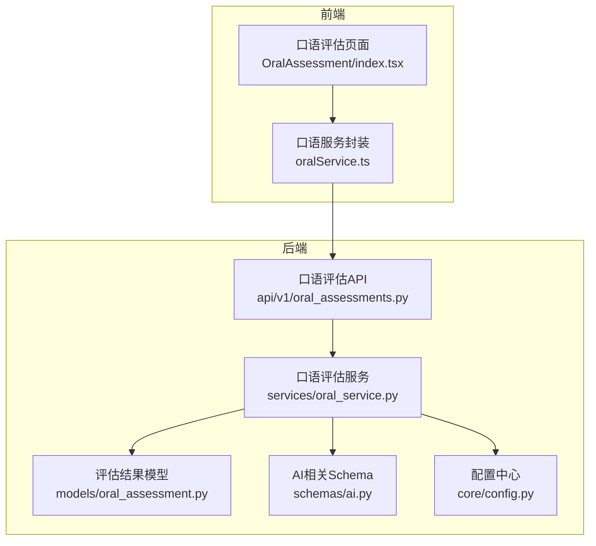
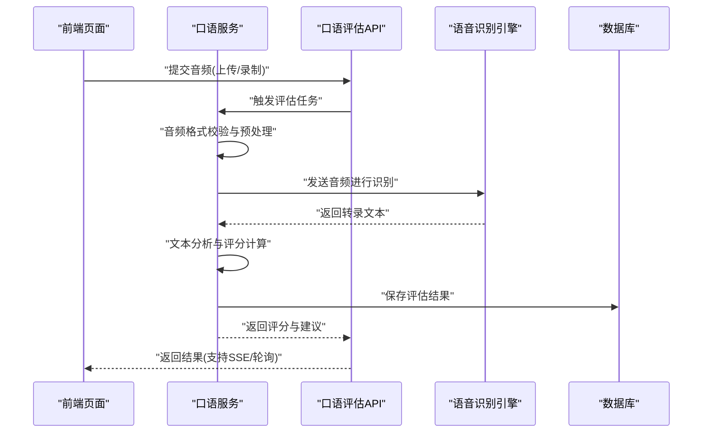
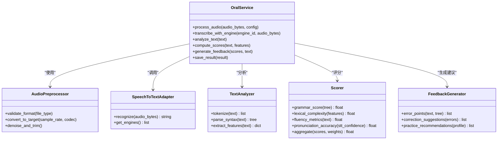
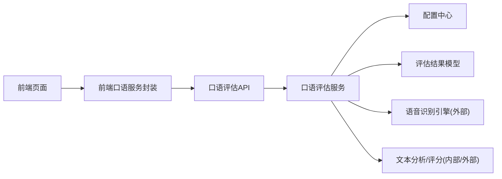

# 口语评估系统

<cite>
**本文引用的文件**   
- [backend/app/api/v1/oral_assessments.py](file://backend/app/api/v1/oral_assessments.py)
- [backend/app/services/oral_service.py](file://backend/app/services/oral_service.py)
- [backend/app/models/oral_assessment.py](file://backend/app/models/oral_assessment.py)
- [backend/app/schemas/ai.py](file://backend/app/schemas/ai.py)
- [backend/app/core/config.py](file://backend/app/core/config.py)
- [frontend/src/pages/OralAssessment/index.tsx](file://frontend/src/pages/OralAssessment/index.tsx)
- [frontend/src/services/oralService.ts](file://frontend/src/services/oralService.ts)
</cite>

## 目录
1. [简介](#简介)
2. [项目结构](#项目结构)
3. [核心组件](#核心组件)
4. [架构总览](#架构总览)
5. [详细组件分析](#详细组件分析)
6. [依赖关系分析](#依赖关系分析)
7. [性能考虑](#性能考虑)
8. [故障排查指南](#故障排查指南)
9. [结论](#结论)
10. [附录](#附录)

## 简介
本文件面向开发者，系统化阐述“口语评估系统”的语音转文字集成、英语口语评估算法、实时录音与音频流处理、多维度评分体系与权重计算、发音纠正建议与个性化练习推荐、以及前后端交互实现。文档同时提供扩展指南，帮助接入不同语音识别服务并扩展评估维度。

## 项目结构
后端采用分层架构：API 层暴露 REST 接口，服务层封装业务逻辑（含口语评估流程），模型层定义数据实体，配置与依赖注入位于 core 层。前端基于 React + TypeScript，包含口语评估页面与服务调用封装。

图表来源
- [backend/app/api/v1/oral_assessments.py](file://backend/app/api/v1/oral_assessments.py)
- [backend/app/services/oral_service.py](file://backend/app/services/oral_service.py)
- [backend/app/models/oral_assessment.py](file://backend/app/models/oral_assessment.py)
- [backend/app/schemas/ai.py](file://backend/app/schemas/ai.py)
- [backend/app/core/config.py](file://backend/app/core/config.py)
- [frontend/src/pages/OralAssessment/index.tsx](file://frontend/src/pages/OralAssessment/index.tsx)
- [frontend/src/services/oralService.ts](file://frontend/src/services/oralService.ts)

章节来源
- [backend/app/api/v1/oral_assessments.py](file://backend/app/api/v1/oral_assessments.py)
- [backend/app/services/oral_service.py](file://backend/app/services/oral_service.py)
- [backend/app/models/oral_assessment.py](file://backend/app/models/oral_assessment.py)
- [backend/app/schemas/ai.py](file://backend/app/schemas/ai.py)
- [backend/app/core/config.py](file://backend/app/core/config.py)
- [frontend/src/pages/OralAssessment/index.tsx](file://frontend/src/pages/OralAssessment/index.tsx)
- [frontend/src/services/oralService.ts](file://frontend/src/services/oralService.ts)

## 核心组件
- 口语评估API：负责接收上传或录制的音频、触发识别与评估、返回结构化评分与建议。
- 口语评估服务：编排音频预处理、语音识别、文本分析、评分计算、建议生成与持久化。
- 评估结果模型：定义评分字段、错误点、建议等数据结构。
- AI相关Schema：统一请求/响应结构与校验规则。
- 配置中心：管理第三方服务密钥、超时、重试、采样率等参数。
- 前端口语评估页面：提供上传、在线录制、播放控制、进度展示与结果可视化。
- 前端口语服务封装：封装REST调用、错误处理、SSE/轮询状态同步。

章节来源
- [backend/app/api/v1/oral_assessments.py](file://backend/app/api/v1/oral_assessments.py)
- [backend/app/services/oral_service.py](file://backend/app/services/oral_service.py)
- [backend/app/models/oral_assessment.py](file://backend/app/models/oral_assessment.py)
- [backend/app/schemas/ai.py](file://backend/app/schemas/ai.py)
- [backend/app/core/config.py](file://backend/app/core/config.py)
- [frontend/src/pages/OralAssessment/index.tsx](file://frontend/src/pages/OralAssessment/index.tsx)
- [frontend/src/services/oralService.ts](file://frontend/src/services/oralService.ts)

## 架构总览
整体流程：前端采集音频（上传或实时录制）→ 后端接收并预处理 → 调用语音识别引擎获取文本 → 执行英语评估算法（语法、词汇复杂度、流利度、发音准确度）→ 生成多维评分与建议 → 持久化并返回结果。

图表来源
- [backend/app/api/v1/oral_assessments.py](file://backend/app/api/v1/oral_assessments.py)
- [backend/app/services/oral_service.py](file://backend/app/services/oral_service.py)
- [backend/app/models/oral_assessment.py](file://backend/app/models/oral_assessment.py)

## 详细组件分析

### 口语评估API
职责
- 接收音频文件或流式数据，校验入参与权限。
- 将任务委派给口语服务，支持异步任务与状态查询。
- 返回标准化响应体，包含评分、错误点、建议与元数据。

关键流程
- 上传/录制入口：解析表单或多部分数据，落盘或缓存。
- 任务调度：根据配置选择同步或异步处理。
- 结果聚合：合并评分、错误点、建议，按Schema返回。

章节来源
- [backend/app/api/v1/oral_assessments.py](file://backend/app/api/v1/oral_assessments.py)

### 口语评估服务
职责
- 编排端到端评估流程：音频预处理、语音识别、文本分析、评分计算、建议生成、结果持久化。
- 管理第三方服务调用（语音识别、LLM/规则引擎）。
- 维护评估上下文与中间结果，支持重试与降级。

核心模块
- 音频预处理：格式转换、降噪、重采样、静音裁剪。
- 语音识别：适配多引擎（如本地或云端ASR），统一输入输出。
- 文本分析：分词、句法树构建、词性标注、语义特征提取。
- 评分计算：语法、词汇复杂度、流利度、发音准确度等多维指标。
- 建议生成：错误定位、纠音提示、练习推荐。
- 结果持久化：写入评估结果模型，关联用户与任务ID。

图表来源
- [backend/app/services/oral_service.py](file://backend/app/services/oral_service.py)

章节来源
- [backend/app/services/oral_service.py](file://backend/app/services/oral_service.py)

### 评估结果模型
职责
- 定义评分字段（语法、词汇复杂度、流利度、发音准确度）、总分、错误点、建议、元数据（任务ID、时间戳、引擎版本）。
- 提供序列化/反序列化工具，便于API与存储层交互。

关键字段（示例说明）
- grammar_score：语法正确性与结构多样性得分。
- lexical_complexity：词汇丰富度与学术词占比。
- fluency：语速、停顿分布、连贯性。
- pronunciation_accuracy：基于置信度与声学特征的发音准确度。
- total_score：加权总分。
- feedback：错误点与纠音建议。
- metadata：任务追踪信息。

章节来源
- [backend/app/models/oral_assessment.py](file://backend/app/models/oral_assessment.py)

### AI相关Schema
职责
- 统一请求/响应结构，包括音频上传、任务ID、评分对象、分页与错误码。
- 提供校验规则与默认值，确保前后端契约一致。

章节来源
- [backend/app/schemas/ai.py](file://backend/app/schemas/ai.py)

### 配置中心
职责
- 管理第三方服务密钥、超时、重试次数、采样率、目标编码、最大时长、并发限制等。
- 支持环境隔离（开发/测试/生产）与动态重载。

章节来源
- [backend/app/core/config.py](file://backend/app/core/config.py)

### 前端口语评估页面
职责
- 提供音频上传、在线录制、播放控制、进度展示、结果可视化。
- 与后端口语服务对接，处理错误与重试。

关键功能
- 上传：选择本地音频文件，显示进度条与错误提示。
- 录制：使用浏览器媒体API采集麦克风，分段缓冲，支持暂停/继续。
- 播放：波形预览、播放/暂停、音量控制。
- 结果：展示多维评分雷达图、错误点列表、纠音建议与练习推荐。

章节来源
- [frontend/src/pages/OralAssessment/index.tsx](file://frontend/src/pages/OralAssessment/index.tsx)

### 前端口语服务封装
职责
- 封装REST调用，统一错误处理、重试策略、SSE/轮询状态同步。
- 提供类型安全的请求/响应方法，简化页面逻辑。

章节来源
- [frontend/src/services/oralService.ts](file://frontend/src/services/oralService.ts)

## 依赖关系分析
- 耦合与内聚
  - API层仅做路由与参数校验，业务集中在服务层，内聚度高。
  - 服务层通过适配器模式解耦语音识别引擎，降低外部依赖影响。
- 直接/间接依赖
  - 服务层依赖配置中心与模型层；API层依赖服务层与Schema。
  - 前端依赖服务封装与页面组件。
- 外部集成点
  - 语音识别引擎（可插拔）。
  - 文本分析/评分引擎（规则或LLM）。
  - 存储层（数据库）。

图表来源
- [backend/app/api/v1/oral_assessments.py](file://backend/app/api/v1/oral_assessments.py)
- [backend/app/services/oral_service.py](file://backend/app/services/oral_service.py)
- [backend/app/models/oral_assessment.py](file://backend/app/models/oral_assessment.py)
- [backend/app/core/config.py](file://backend/app/core/config.py)
- [frontend/src/pages/OralAssessment/index.tsx](file://frontend/src/pages/OralAssessment/index.tsx)
- [frontend/src/services/oralService.ts](file://frontend/src/services/oralService.ts)

章节来源
- [backend/app/api/v1/oral_assessments.py](file://backend/app/api/v1/oral_assessments.py)
- [backend/app/services/oral_service.py](file://backend/app/services/oral_service.py)
- [backend/app/models/oral_assessment.py](file://backend/app/models/oral_assessment.py)
- [backend/app/core/config.py](file://backend/app/core/config.py)
- [frontend/src/pages/OralAssessment/index.tsx](file://frontend/src/pages/OralAssessment/index.tsx)
- [frontend/src/services/oralService.ts](file://frontend/src/services/oralService.ts)

## 性能考虑
- 音频预处理
  - 合理设置采样率与编码，避免过大体积导致传输与处理延迟。
  - 使用流式处理与增量解码，降低内存峰值。
- 语音识别
  - 对长音频进行分段识别，结合VAD（语音活动检测）减少无效片段。
  - 为高并发场景启用连接池与限流。
- 文本分析与评分
  - 缓存常见语言特征与词典，减少重复计算。
  - 对复杂句法分析采用异步队列与批处理。
- 前端体验
  - 录制时采用低延迟编解码，边录边传（可选）。
  - 结果渲染采用虚拟列表与懒加载，提升大数据量下的流畅度。

[本节为通用指导，不直接分析具体文件]

## 故障排查指南
- 常见问题
  - 音频格式不支持：检查上传文件的编码与采样率，确认预处理模块是否允许该格式。
  - 识别失败或超时：查看引擎健康状态、网络连通性与重试策略。
  - 评分异常：核对权重配置与特征提取逻辑，验证边界样本。
  - 前端无响应：检查SSE/轮询连接、错误重试与日志上报。
- 诊断步骤
  - 在API层记录入参与出参摘要（脱敏）。
  - 在服务层增加关键节点耗时与错误码埋点。
  - 使用配置中心切换调试模式，输出更详细的中间结果。
  - 前端捕获网络错误与媒体权限问题，给出明确提示。

章节来源
- [backend/app/api/v1/oral_assessments.py](file://backend/app/api/v1/oral_assessments.py)
- [backend/app/services/oral_service.py](file://backend/app/services/oral_service.py)
- [backend/app/core/config.py](file://backend/app/core/config.py)
- [frontend/src/services/oralService.ts](file://frontend/src/services/oralService.ts)

## 结论
本系统以清晰的分层架构与适配器模式实现了可扩展的口语评估能力。通过模块化设计，能够灵活接入多种语音识别服务，并持续扩展评估维度。前端提供完善的交互体验，后端具备健壮的错误处理与性能优化策略，适合在生产环境中稳定运行。

[本节为总结性内容，不直接分析具体文件]

## 附录

### 语音转文字技术集成与实现
- 音频格式处理
  - 支持的输入格式与目标格式由配置中心管理。
  - 预处理包括降噪、重采样、静音裁剪与分段。
- 语音识别引擎调用
  - 通过适配器统一接口，支持多引擎切换。
  - 识别结果包含文本与置信度，用于后续发音准确度评估。

章节来源
- [backend/app/services/oral_service.py](file://backend/app/services/oral_service.py)
- [backend/app/core/config.py](file://backend/app/core/config.py)

### 英语口语评估算法实现
- 语法分析
  - 基于句法树与词性标注，统计从句、并列结构、主谓一致等指标。
- 词汇复杂度
  - 统计词频分布、学术词占比、同义词替换率与平均词长。
- 流利度评分
  - 依据语速、停顿分布、填充词频率与句子长度方差计算。
- 发音准确度
  - 结合识别置信度与声学特征，映射到发音准确度分数。
- 多维度评分与权重
  - 各维度权重可通过配置中心调整，总分采用加权聚合。

章节来源
- [backend/app/services/oral_service.py](file://backend/app/services/oral_service.py)
- [backend/app/models/oral_assessment.py](file://backend/app/models/oral_assessment.py)
- [backend/app/core/config.py](file://backend/app/core/config.py)

### 实时录音与音频流处理机制
- 前端采集
  - 使用浏览器媒体API进行麦克风采集，支持分段缓冲与暂停/继续。
- 流式传输
  - 可选边录边传，后端按片段处理并累积结果。
- 播放控制
  - 提供波形预览、播放/暂停、音量调节与回放对比。

章节来源
- [frontend/src/pages/OralAssessment/index.tsx](file://frontend/src/pages/OralAssessment/index.tsx)
- [frontend/src/services/oralService.ts](file://frontend/src/services/oralService.ts)

### 发音纠正建议与个性化练习推荐
- 错误定位
  - 基于句法与词性标注，定位语法错误与用词不当。
- 纠音建议
  - 针对发音准确度低的片段，提供音标与口型提示。
- 个性化推荐
  - 结合用户历史表现与薄弱项，推送针对性练习。

章节来源
- [backend/app/services/oral_service.py](file://backend/app/services/oral_service.py)
- [backend/app/models/oral_assessment.py](file://backend/app/models/oral_assessment.py)

### 前端交互实现要点
- 音频上传
  - 支持拖拽与选择文件，显示进度与错误提示。
- 在线录制
  - 权限申请、设备选择、录制状态管理与中断恢复。
- 播放控制
  - 波形可视化、播放控制与回放对比。
- 结果展示
  - 多维评分可视化、错误点列表、纠音建议与练习推荐。

章节来源
- [frontend/src/pages/OralAssessment/index.tsx](file://frontend/src/pages/OralAssessment/index.tsx)
- [frontend/src/services/oralService.ts](file://frontend/src/services/oralService.ts)

### 开发者集成与扩展指南
- 接入不同语音识别服务
  - 实现适配器接口，注册新引擎并在配置中心启用。
  - 统一输入输出格式，确保与现有流程兼容。
- 扩展评估维度
  - 新增评分模块，更新权重聚合逻辑与结果模型。
  - 在前端增加对应可视化与反馈展示。
- 最佳实践
  - 保持API契约稳定，使用Schema进行严格校验。
  - 引入监控与告警，跟踪关键指标与错误率。

章节来源
- [backend/app/services/oral_service.py](file://backend/app/services/oral_service.py)
- [backend/app/models/oral_assessment.py](file://backend/app/models/oral_assessment.py)
- [backend/app/schemas/ai.py](file://backend/app/schemas/ai.py)
- [backend/app/core/config.py](file://backend/app/core/config.py)
- [frontend/src/pages/OralAssessment/index.tsx](file://frontend/src/pages/OralAssessment/index.tsx)
- [frontend/src/services/oralService.ts](file://frontend/src/services/oralService.ts)