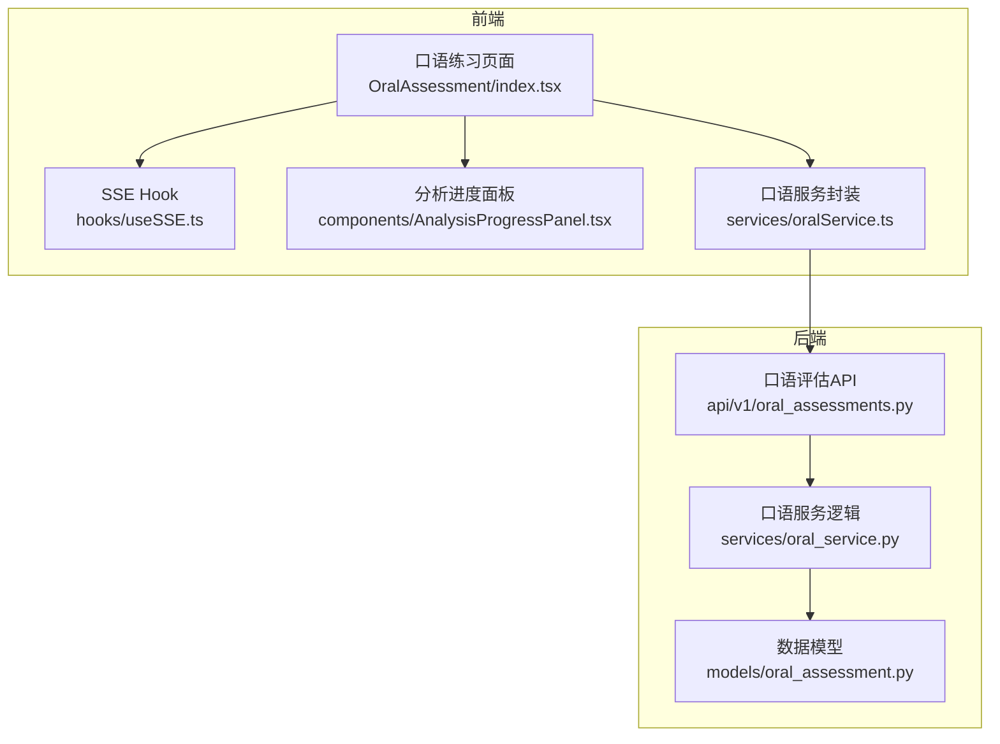
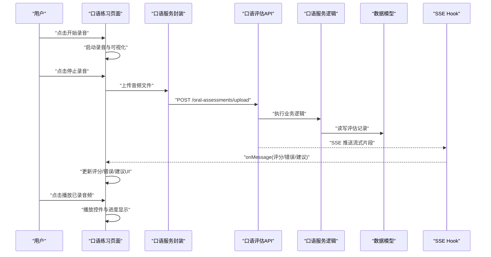
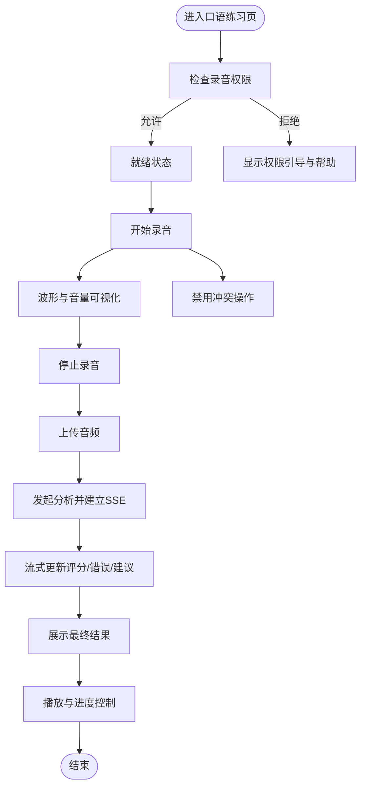
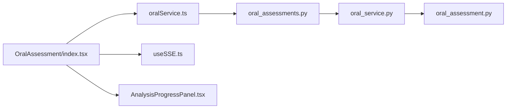

# 实时交互界面

<cite>
**本文引用的文件**   
- [frontend/src/pages/OralAssessment/index.tsx](file://frontend/src/pages/OralAssessment/index.tsx)
- [frontend/src/services/oralService.ts](file://frontend/src/services/oralService.ts)
- [backend/app/api/v1/oral_assessments.py](file://backend/app/api/v1/oral_assessments.py)
- [backend/app/services/oral_service.py](file://backend/app/services/oral_service.py)
- [backend/app/models/oral_assessment.py](file://backend/app/models/oral_assessment.py)
- [frontend/src/hooks/useSSE.ts](file://frontend/src/hooks/useSSE.ts)
- [frontend/src/components/AnalysisProgressPanel.tsx](file://frontend/src/components/AnalysisProgressPanel.tsx)
</cite>

## 目录
1. [简介](#简介)
2. [项目结构](#项目结构)
3. [核心组件](#核心组件)
4. [架构总览](#架构总览)
5. [详细组件分析](#详细组件分析)
6. [依赖关系分析](#依赖关系分析)
7. [性能考虑](#性能考虑)
8. [故障排查指南](#故障排查指南)
9. [结论](#结论)
10. [附录](#附录)

## 简介
本文件面向前端开发者，系统化说明“口语练习”实时交互界面的设计与实现，覆盖以下关键主题：
- 用户交互设计：录音控制按钮、播放控件、进度显示等UI组件的职责与状态流转
- 实时反馈机制：即时评分显示、错误提示、改进建议的动态更新（基于服务端流式返回）
- 音频可视化：波形图显示、音量指示器、录音状态反馈的实现要点
- 响应式设计与移动端适配策略
- 用户体验优化：操作引导与错误处理
- 定制指南：如何扩展样式与新增交互功能

## 项目结构
本项目采用前后端分离架构。前端负责录音、播放、可视化与实时反馈展示；后端提供口语评估接口与流式结果推送。

图表来源
- [frontend/src/pages/OralAssessment/index.tsx](file://frontend/src/pages/OralAssessment/index.tsx)
- [frontend/src/hooks/useSSE.ts](file://frontend/src/hooks/useSSE.ts)
- [frontend/src/components/AnalysisProgressPanel.tsx](file://frontend/src/components/AnalysisProgressPanel.tsx)
- [frontend/src/services/oralService.ts](file://frontend/src/services/oralService.ts)
- [backend/app/api/v1/oral_assessments.py](file://backend/app/api/v1/oral_assessments.py)
- [backend/app/services/oral_service.py](file://backend/app/services/oral_service.py)
- [backend/app/models/oral_assessment.py](file://backend/app/models/oral_assessment.py)

章节来源
- [frontend/src/pages/OralAssessment/index.tsx](file://frontend/src/pages/OralAssessment/index.tsx)
- [frontend/src/services/oralService.ts](file://frontend/src/services/oralService.ts)
- [backend/app/api/v1/oral_assessments.py](file://backend/app/api/v1/oral_assessments.py)
- [backend/app/services/oral_service.py](file://backend/app/services/oral_service.py)
- [backend/app/models/oral_assessment.py](file://backend/app/models/oral_assessment.py)
- [frontend/src/hooks/useSSE.ts](file://frontend/src/hooks/useSSE.ts)
- [frontend/src/components/AnalysisProgressPanel.tsx](file://frontend/src/components/AnalysisProgressPanel.tsx)

## 核心组件
- 口语练习页面（OralAssessment）
  - 职责：聚合录音、播放、可视化、实时反馈与结果展示；管理整体交互状态机
  - 关键状态：录音中/停止、播放中/暂停、上传中、分析中、完成、错误
  - 事件：开始录音、停止录音、上传音频、开始播放、暂停播放、结束播放、接收流式评分与建议
- 口语服务封装（oralService）
  - 职责：统一调用后端接口，封装上传与流式读取（SSE），暴露给页面使用
- SSE Hook（useSSE）
  - 职责：维护EventSource连接，解析服务端推送的流式片段，触发回调更新UI
- 分析进度面板（AnalysisProgressPanel）
  - 职责：在分析阶段展示进度、阶段性提示与最终结果摘要

章节来源
- [frontend/src/pages/OralAssessment/index.tsx](file://frontend/src/pages/OralAssessment/index.tsx)
- [frontend/src/services/oralService.ts](file://frontend/src/services/oralService.ts)
- [frontend/src/hooks/useSSE.ts](file://frontend/src/hooks/useSSE.ts)
- [frontend/src/components/AnalysisProgressPanel.tsx](file://frontend/src/components/AnalysisProgressPanel.tsx)

## 架构总览
口语练习的端到端流程如下：用户录制音频并上传至后端，后端进行语音转文本与AI评估，通过SSE将评分、错误点与建议逐步推送到前端，前端实时更新UI。

图表来源
- [frontend/src/pages/OralAssessment/index.tsx](file://frontend/src/pages/OralAssessment/index.tsx)
- [frontend/src/services/oralService.ts](file://frontend/src/services/oralService.ts)
- [backend/app/api/v1/oral_assessments.py](file://backend/app/api/v1/oral_assessments.py)
- [backend/app/services/oral_service.py](file://backend/app/services/oral_service.py)
- [backend/app/models/oral_assessment.py](file://backend/app/models/oral_assessment.py)
- [frontend/src/hooks/useSSE.ts](file://frontend/src/hooks/useSSE.ts)

## 详细组件分析

### 口语练习页面（OralAssessment）
- 交互设计
  - 录音控制按钮：开始/停止录音，带防抖与权限校验；录音中禁用其他冲突操作
  - 播放控件：播放/暂停、拖拽进度条、显示当前时间与总时长
  - 进度显示：上传与分析阶段的进度条与文案提示
- 实时反馈
  - 通过SSE Hook接收流式消息，按类型渲染：即时评分、错误提示、改进建议
  - 支持增量更新与最终汇总视图切换
- 音频可视化
  - 录音时绘制波形图，显示音量指示器，根据分贝阈值高亮提示
  - 播放时同步波形滚动与时间轴
- 响应式与移动端适配
  - 使用弹性布局与媒体查询，在小屏下折叠次要信息，增大触控区域
  - 对触摸手势（滑动调节音量/进度）做兼容处理
- 用户体验优化
  - 操作引导：首次进入时显示简短步骤提示
  - 错误处理：网络异常、权限拒绝、格式不支持等场景给出友好提示与重试入口

图表来源
- [frontend/src/pages/OralAssessment/index.tsx](file://frontend/src/pages/OralAssessment/index.tsx)
- [frontend/src/hooks/useSSE.ts](file://frontend/src/hooks/useSSE.ts)
- [frontend/src/components/AnalysisProgressPanel.tsx](file://frontend/src/components/AnalysisProgressPanel.tsx)

章节来源
- [frontend/src/pages/OralAssessment/index.tsx](file://frontend/src/pages/OralAssessment/index.tsx)
- [frontend/src/hooks/useSSE.ts](file://frontend/src/hooks/useSSE.ts)
- [frontend/src/components/AnalysisProgressPanel.tsx](file://frontend/src/components/AnalysisProgressPanel.tsx)

### 口语服务封装（oralService）
- 职责
  - 封装上传接口与SSE订阅，统一错误码映射与重试策略
  - 提供Promise化与事件回调两种调用方式，便于不同场景复用
- 关键点
  - 上传：multipart/form-data，携带必要元数据（题目ID、会话ID等）
  - SSE：自动重连、断线恢复、超时保护
  - 错误：网络错误、服务端错误、业务错误分类处理

章节来源
- [frontend/src/services/oralService.ts](file://frontend/src/services/oralService.ts)
- [backend/app/api/v1/oral_assessments.py](file://backend/app/api/v1/oral_assessments.py)

### SSE Hook（useSSE）
- 职责
  - 管理EventSource生命周期，解析服务端推送的消息片段
  - 将消息分发到UI层，支持去重与合并策略
- 关键点
  - 心跳检测与自动重连
  - 消息类型路由：评分、错误、建议、进度
  - 内存占用控制：限制历史片段数量

章节来源
- [frontend/src/hooks/useSSE.ts](file://frontend/src/hooks/useSSE.ts)

### 分析进度面板（AnalysisProgressPanel）
- 职责
  - 在分析阶段展示进度条、阶段文案与最终结果摘要
- 关键点
  - 支持多阶段进度映射（如：转写、评分、纠错、建议生成）
  - 可折叠展开，避免遮挡主内容

章节来源
- [frontend/src/components/AnalysisProgressPanel.tsx](file://frontend/src/components/AnalysisProgressPanel.tsx)

### 后端接口与服务
- 口语评估API（oral_assessments.py）
  - 提供上传与SSE推送能力，校验请求参数与权限
- 口语服务逻辑（oral_service.py）
  - 编排语音转文本、AI评分、错误定位与建议生成
- 数据模型（oral_assessment.py）
  - 定义评估记录字段与关联关系

章节来源
- [backend/app/api/v1/oral_assessments.py](file://backend/app/api/v1/oral_assessments.py)
- [backend/app/services/oral_service.py](file://backend/app/services/oral_service.py)
- [backend/app/models/oral_assessment.py](file://backend/app/models/oral_assessment.py)

## 依赖关系分析
- 前端内部依赖
  - OralAssessment 依赖 oralService 与 useSSE，同时渲染 AnalysisProgressPanel
- 前后端耦合点
  - 上传接口与SSE事件契约（消息类型、字段约定）
- 外部依赖
  - 浏览器MediaRecorder与Web Audio API用于录音与可视化
  - EventSource用于SSE通信

图表来源
- [frontend/src/pages/OralAssessment/index.tsx](file://frontend/src/pages/OralAssessment/index.tsx)
- [frontend/src/services/oralService.ts](file://frontend/src/services/oralService.ts)
- [frontend/src/hooks/useSSE.ts](file://frontend/src/hooks/useSSE.ts)
- [frontend/src/components/AnalysisProgressPanel.tsx](file://frontend/src/components/AnalysisProgressPanel.tsx)
- [backend/app/api/v1/oral_assessments.py](file://backend/app/api/v1/oral_assessments.py)
- [backend/app/services/oral_service.py](file://backend/app/services/oral_service.py)
- [backend/app/models/oral_assessment.py](file://backend/app/models/oral_assessment.py)

章节来源
- [frontend/src/pages/OralAssessment/index.tsx](file://frontend/src/pages/OralAssessment/index.tsx)
- [frontend/src/services/oralService.ts](file://frontend/src/services/oralService.ts)
- [frontend/src/hooks/useSSE.ts](file://frontend/src/hooks/useSSE.ts)
- [frontend/src/components/AnalysisProgressPanel.tsx](file://frontend/src/components/AnalysisProgressPanel.tsx)
- [backend/app/api/v1/oral_assessments.py](file://backend/app/api/v1/oral_assessments.py)
- [backend/app/services/oral_service.py](file://backend/app/services/oral_service.py)
- [backend/app/models/oral_assessment.py](file://backend/app/models/oral_assessment.py)

## 性能考虑
- 录音与可视化
  - 使用离屏Canvas或WebGL降低主线程压力
  - 合理设置采样率与缓冲区大小，平衡音质与性能
- 流式更新
  - 节流与批处理：合并短时间内多次更新，减少DOM重排
  - 虚拟列表：当错误与建议条目较多时，仅渲染可视区域
- 资源释放
  - 离开页面时主动关闭EventSource与释放AudioContext
- 缓存与重试
  - 对失败的网络请求实施指数退避重试
  - 本地缓存最近一次分析结果，提升二次访问体验

[本节为通用指导，不直接分析具体文件]

## 故障排查指南
- 常见问题
  - 无法录音：检查浏览器权限与HTTPS环境
  - 无流式反馈：确认SSE连接是否建立，查看网络面板中的Server-Sent Events
  - 播放无声：检查音频编码格式与浏览器兼容性
- 日志与调试
  - 在前端增加关键路径日志（上传、SSE消息、播放事件）
  - 在后端记录请求ID与SSE推送序列号，便于追踪
- 错误处理
  - 统一错误码映射，向用户展示清晰的可操作提示
  - 提供“重试”和“反馈问题”入口，收集上下文信息

章节来源
- [frontend/src/services/oralService.ts](file://frontend/src/services/oralService.ts)
- [frontend/src/hooks/useSSE.ts](file://frontend/src/hooks/useSSE.ts)
- [frontend/src/components/AnalysisProgressPanel.tsx](file://frontend/src/components/AnalysisProgressPanel.tsx)

## 结论
本方案以“口语练习页面”为核心，结合服务封装与SSE Hook，实现了从录音、上传、分析到结果展示的完整闭环。通过流式反馈与可视化增强，提升了用户的参与感与学习成效。建议在后续迭代中持续优化性能与可访问性，并完善错误处理与用户引导。

[本节为总结，不直接分析具体文件]

## 附录

### 自定义样式与新增交互
- 样式定制
  - 通过CSS变量或主题配置覆盖主色调、圆角、阴影等
  - 针对小屏设备提供独立的布局与字号规范
- 新增交互
  - 在口语练习页面注册新的事件处理器（如“一键纠错”、“导出报告”）
  - 在服务封装中新增对应API调用，并在SSE Hook中扩展消息类型路由
- 最佳实践
  - 保持组件职责单一，状态集中管理
  - 所有用户可见文案与提示集中管理，便于国际化与版本升级

[本节为通用指导，不直接分析具体文件]