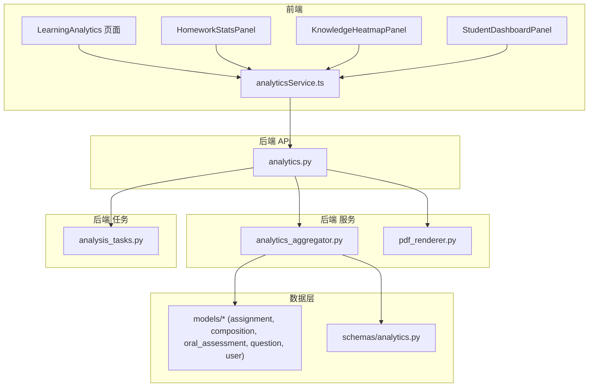
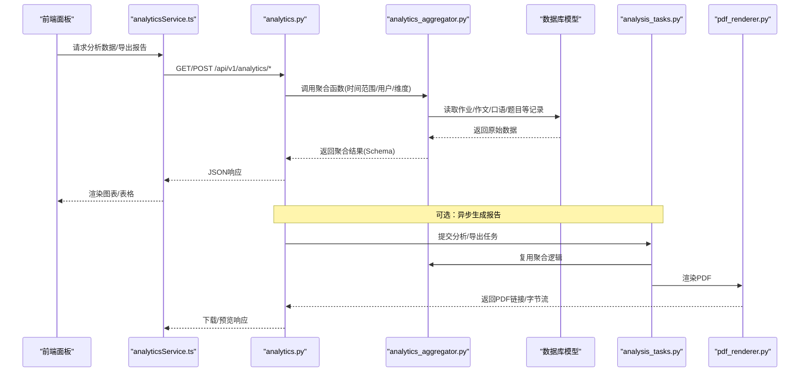
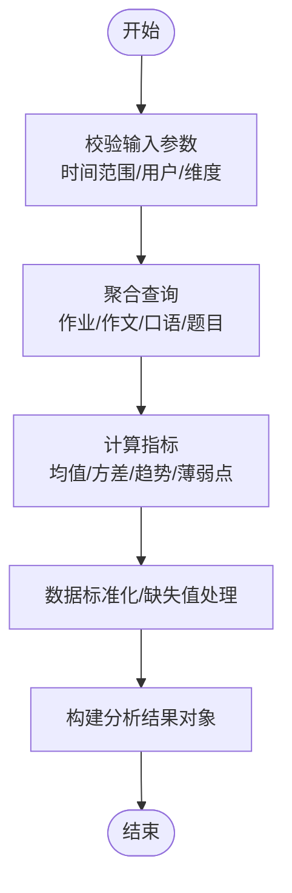
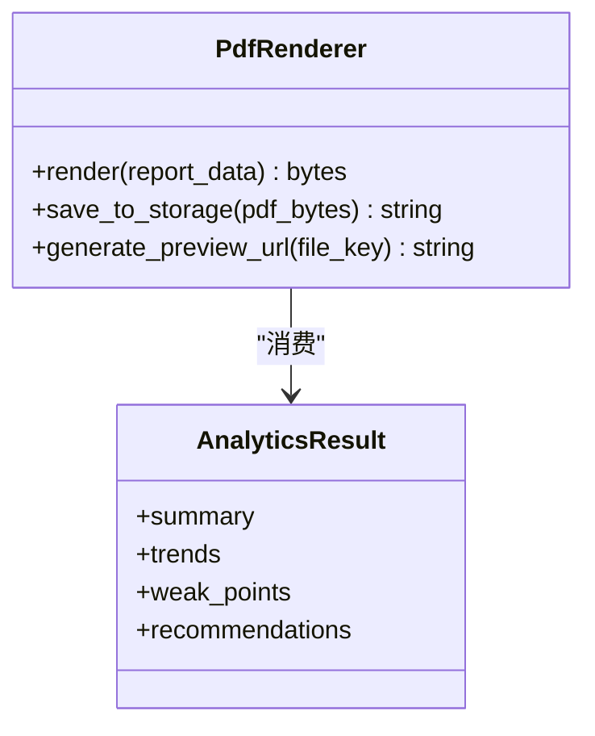
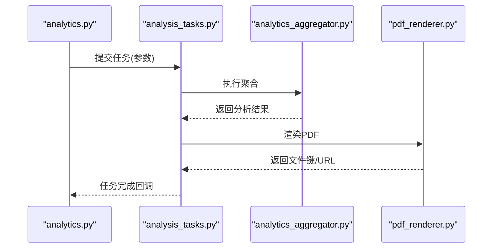
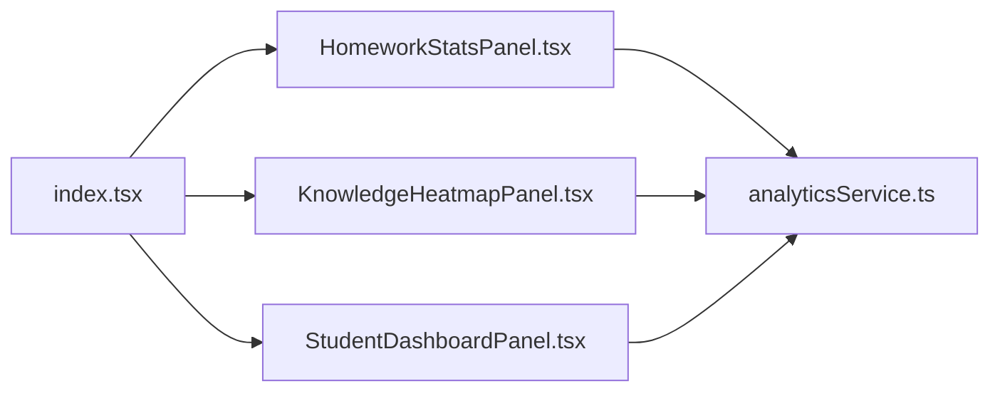
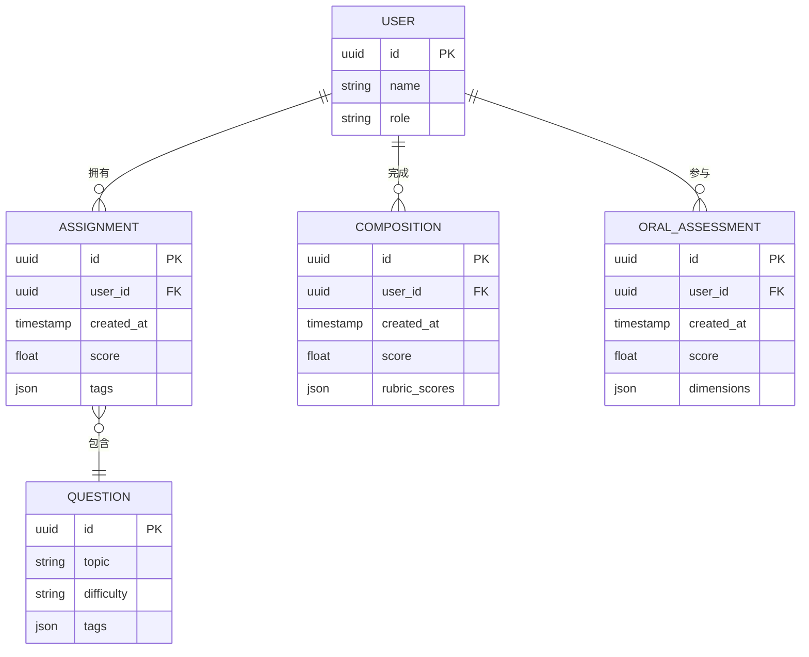
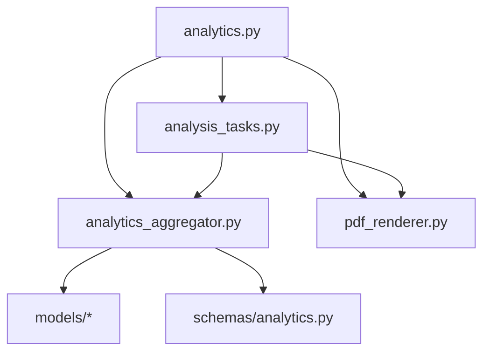
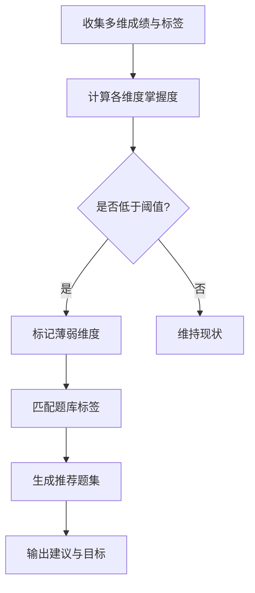

# 结果分析与报告

<cite>
**本文引用的文件**   
- [backend/app/api/v1/analytics.py](file://backend/app/api/v1/analytics.py)
- [backend/app/services/analytics_aggregator.py](file://backend/app/services/analytics_aggregator.py)
- [backend/app/services/pdf_renderer.py](file://backend/app/services/pdf_renderer.py)
- [backend/app/schemas/analytics.py](file://backend/app/schemas/analytics.py)
- [backend/app/models/assignment.py](file://backend/app/models/assignment.py)
- [backend/app/models/composition.py](file://backend/app/models/composition.py)
- [backend/app/models/oral_assessment.py](file://backend/app/models/oral_assessment.py)
- [backend/app/models/question.py](file://backend/app/models/question.py)
- [backend/app/models/user.py](file://backend/app/models/user.py)
- [backend/app/tasks/analysis_tasks.py](file://backend/app/tasks/analysis_tasks.py)
- [frontend/src/pages/LearningAnalytics/index.tsx](file://frontend/src/pages/LearningAnalytics/index.tsx)
- [frontend/src/pages/LearningAnalytics/HomeworkStatsPanel.tsx](file://frontend/src/pages/LearningAnalytics/HomeworkStatsPanel.tsx)
- [frontend/src/pages/LearningAnalytics/KnowledgeHeatmapPanel.tsx](file://frontend/src/pages/LearningAnalytics/KnowledgeHeatmapPanel.tsx)
- [frontend/src/pages/LearningAnalytics/StudentDashboardPanel.tsx](file://frontend/src/pages/LearningAnalytics/StudentDashboardPanel.tsx)
- [frontend/src/services/analyticsService.ts](file://frontend/src/services/analyticsService.ts)
</cite>

## 目录
1. [简介](#简介)
2. [项目结构](#项目结构)
3. [核心组件](#核心组件)
4. [架构总览](#架构总览)
5. [详细组件分析](#详细组件分析)
6. [依赖关系分析](#依赖关系分析)
7. [性能考虑](#性能考虑)
8. [故障排查指南](#故障排查指南)
9. [结论](#结论)
10. [附录](#附录)

## 简介
本文件面向“结果分析与报告”子系统，覆盖评估数据的采集、存储与分析流程，历史成绩追踪与学习进度统计，报告生成机制（含PDF导出、图表可视化、学习趋势分析），个性化学习建议的生成算法（薄弱环节识别与针对性练习推荐），数据持久化策略与查询优化，以及前端展示组件的实现。同时提供扩展指南，帮助开发者新增报告模板与分析维度。

## 项目结构
后端采用分层架构：API层暴露REST接口，服务层实现聚合与渲染逻辑，任务层处理异步分析，模型与Schema定义数据契约；前端以页面面板组织分析视图，并通过服务层调用后端API。

**图示来源**
- [backend/app/api/v1/analytics.py](file://backend/app/api/v1/analytics.py)
- [backend/app/services/analytics_aggregator.py](file://backend/app/services/analytics_aggregator.py)
- [backend/app/services/pdf_renderer.py](file://backend/app/services/pdf_renderer.py)
- [backend/app/tasks/analysis_tasks.py](file://backend/app/tasks/analysis_tasks.py)
- [backend/app/schemas/analytics.py](file://backend/app/schemas/analytics.py)
- [backend/app/models/assignment.py](file://backend/app/models/assignment.py)
- [backend/app/models/composition.py](file://backend/app/models/composition.py)
- [backend/app/models/oral_assessment.py](file://backend/app/models/oral_assessment.py)
- [backend/app/models/question.py](file://backend/app/models/question.py)
- [backend/app/models/user.py](file://backend/app/models/user.py)
- [frontend/src/pages/LearningAnalytics/index.tsx](file://frontend/src/pages/LearningAnalytics/index.tsx)
- [frontend/src/pages/LearningAnalytics/HomeworkStatsPanel.tsx](file://frontend/src/pages/LearningAnalytics/HomeworkStatsPanel.tsx)
- [frontend/src/pages/LearningAnalytics/KnowledgeHeatmapPanel.tsx](file://frontend/src/pages/LearningAnalytics/KnowledgeHeatmapPanel.tsx)
- [frontend/src/pages/LearningAnalytics/StudentDashboardPanel.tsx](file://frontend/src/pages/LearningAnalytics/StudentDashboardPanel.tsx)
- [frontend/src/services/analyticsService.ts](file://frontend/src/services/analyticsService.ts)

**章节来源**
- [backend/app/api/v1/analytics.py](file://backend/app/api/v1/analytics.py)
- [backend/app/services/analytics_aggregator.py](file://backend/app/services/analytics_aggregator.py)
- [backend/app/services/pdf_renderer.py](file://backend/app/services/pdf_renderer.py)
- [backend/app/tasks/analysis_tasks.py](file://backend/app/tasks/analysis_tasks.py)
- [backend/app/schemas/analytics.py](file://backend/app/schemas/analytics.py)
- [backend/app/models/assignment.py](file://backend/app/models/assignment.py)
- [backend/app/models/composition.py](file://backend/app/models/composition.py)
- [backend/app/models/oral_assessment.py](file://backend/app/models/oral_assessment.py)
- [backend/app/models/question.py](file://backend/app/models/question.py)
- [backend/app/models/user.py](file://backend/app/models/user.py)
- [frontend/src/pages/LearningAnalytics/index.tsx](file://frontend/src/pages/LearningAnalytics/index.tsx)
- [frontend/src/pages/LearningAnalytics/HomeworkStatsPanel.tsx](file://frontend/src/pages/LearningAnalytics/HomeworkStatsPanel.tsx)
- [frontend/src/pages/LearningAnalytics/KnowledgeHeatmapPanel.tsx](file://frontend/src/pages/LearningAnalytics/KnowledgeHeatmapPanel.tsx)
- [frontend/src/pages/LearningAnalytics/StudentDashboardPanel.tsx](file://frontend/src/pages/LearningAnalytics/StudentDashboardPanel.tsx)
- [frontend/src/services/analyticsService.ts](file://frontend/src/services/analyticsService.ts)

## 核心组件
- 分析聚合服务：负责从多源模型中抽取指标、计算统计量、构建分析结果对象，并输出到统一Schema。
- PDF渲染服务：将结构化分析结果转换为可导出的PDF文档。
- 分析任务：在后台执行耗时分析或批量汇总，避免阻塞请求。
- 前端分析面板：作业统计、知识热力图、学生看板等可视化组件，通过服务层调用后端接口。

**章节来源**
- [backend/app/services/analytics_aggregator.py](file://backend/app/services/analytics_aggregator.py)
- [backend/app/services/pdf_renderer.py](file://backend/app/services/pdf_renderer.py)
- [backend/app/tasks/analysis_tasks.py](file://backend/app/tasks/analysis_tasks.py)
- [frontend/src/pages/LearningAnalytics/HomeworkStatsPanel.tsx](file://frontend/src/pages/LearningAnalytics/HomeworkStatsPanel.tsx)
- [frontend/src/pages/LearningAnalytics/KnowledgeHeatmapPanel.tsx](file://frontend/src/pages/LearningAnalytics/KnowledgeHeatmapPanel.tsx)
- [frontend/src/pages/LearningAnalytics/StudentDashboardPanel.tsx](file://frontend/src/pages/LearningAnalytics/StudentDashboardPanel.tsx)

## 架构总览
下图展示了从前端触发到后端聚合、渲染与持久化的端到端流程，包括异步任务与PDF导出路径。

**图示来源**
- [backend/app/api/v1/analytics.py](file://backend/app/api/v1/analytics.py)
- [backend/app/services/analytics_aggregator.py](file://backend/app/services/analytics_aggregator.py)
- [backend/app/services/pdf_renderer.py](file://backend/app/services/pdf_renderer.py)
- [backend/app/tasks/analysis_tasks.py](file://backend/app/tasks/analysis_tasks.py)
- [frontend/src/services/analyticsService.ts](file://frontend/src/services/analyticsService.ts)

## 详细组件分析

### 分析聚合服务（指标计算与数据建模）
- 职责
  - 按用户/班级/时间窗口聚合作业、作文、口语等成绩与完成度。
  - 计算趋势指标（如滚动平均、环比/同比）、薄弱知识点分布、掌握度曲线。
  - 输出符合统一Schema的结构化结果，便于前端渲染与PDF导出。
- 关键流程
  - 输入参数校验（时间范围、实体ID、维度选择）。
  - 多表/多模型查询与合并（作业、作文、口语、题目标签）。
  - 指标计算与异常值处理（缺失值填充、平滑）。
  - 组装为分析结果对象，供API与任务使用。
- 复杂度与优化
  - 对大时间窗口的聚合建议分批查询与索引优化。
  - 热点指标可引入缓存层（如Redis）以减少重复计算。

**图示来源**
- [backend/app/services/analytics_aggregator.py](file://backend/app/services/analytics_aggregator.py)

**章节来源**
- [backend/app/services/analytics_aggregator.py](file://backend/app/services/analytics_aggregator.py)
- [backend/app/schemas/analytics.py](file://backend/app/schemas/analytics.py)

### PDF报告渲染服务
- 职责
  - 接收结构化分析结果，生成包含封面、概览、图表、明细与建议的报告。
  - 支持分页、页眉页脚、图表嵌入与样式控制。
- 关键流程
  - 解析分析结果，映射到模板占位符。
  - 渲染图表为图片并插入文档。
  - 输出PDF字节流或保存至对象存储，返回访问链接。
- 扩展点
  - 新增模板类型（如“月度总结”、“期末总评”）。
  - 自定义图表主题与布局。

**图示来源**
- [backend/app/services/pdf_renderer.py](file://backend/app/services/pdf_renderer.py)

**章节来源**
- [backend/app/services/pdf_renderer.py](file://backend/app/services/pdf_renderer.py)

### 分析任务（异步处理）
- 职责
  - 在后台执行耗时分析、批量汇总与报告生成。
  - 提供任务状态查询与失败重试机制。
- 关键流程
  - 接收任务参数（用户/时间范围/报告类型）。
  - 调用聚合服务获取数据。
  - 调用PDF渲染服务生成报告。
  - 更新任务状态并通知前端。

**图示来源**
- [backend/app/tasks/analysis_tasks.py](file://backend/app/tasks/analysis_tasks.py)
- [backend/app/api/v1/analytics.py](file://backend/app/api/v1/analytics.py)

**章节来源**
- [backend/app/tasks/analysis_tasks.py](file://backend/app/tasks/analysis_tasks.py)
- [backend/app/api/v1/analytics.py](file://backend/app/api/v1/analytics.py)

### 前端分析面板与可视化
- 页面组织
  - LearningAnalytics主页面集成多个面板。
  - 作业统计面板：展示得分分布、完成率、趋势折线。
  - 知识热力图面板：按知识点/题型展示掌握度热力。
  - 学生看板面板：个人/班级整体表现概览与对比。
- 数据交互
  - analyticsService封装API调用，统一错误处理与加载态。
  - 面板按需拉取数据，支持刷新与筛选。

**图示来源**
- [frontend/src/pages/LearningAnalytics/index.tsx](file://frontend/src/pages/LearningAnalytics/index.tsx)
- [frontend/src/pages/LearningAnalytics/HomeworkStatsPanel.tsx](file://frontend/src/pages/LearningAnalytics/HomeworkStatsPanel.tsx)
- [frontend/src/pages/LearningAnalytics/KnowledgeHeatmapPanel.tsx](file://frontend/src/pages/LearningAnalytics/KnowledgeHeatmapPanel.tsx)
- [frontend/src/pages/LearningAnalytics/StudentDashboardPanel.tsx](file://frontend/src/pages/LearningAnalytics/StudentDashboardPanel.tsx)
- [frontend/src/services/analyticsService.ts](file://frontend/src/services/analyticsService.ts)

**章节来源**
- [frontend/src/pages/LearningAnalytics/index.tsx](file://frontend/src/pages/LearningAnalytics/index.tsx)
- [frontend/src/pages/LearningAnalytics/HomeworkStatsPanel.tsx](file://frontend/src/pages/LearningAnalytics/HomeworkStatsPanel.tsx)
- [frontend/src/pages/LearningAnalytics/KnowledgeHeatmapPanel.tsx](file://frontend/src/pages/LearningAnalytics/KnowledgeHeatmapPanel.tsx)
- [frontend/src/pages/LearningAnalytics/StudentDashboardPanel.tsx](file://frontend/src/pages/LearningAnalytics/StudentDashboardPanel.tsx)
- [frontend/src/services/analyticsService.ts](file://frontend/src/services/analyticsService.ts)

### 数据模型与Schema
- 模型
  - 作业、作文、口语评估、题目、用户等实体用于支撑成绩与过程性数据采集。
- Schema
  - 分析结果统一结构，包含摘要、趋势、薄弱点、建议等字段，确保前后端一致。

**图示来源**
- [backend/app/models/user.py](file://backend/app/models/user.py)
- [backend/app/models/assignment.py](file://backend/app/models/assignment.py)
- [backend/app/models/composition.py](file://backend/app/models/composition.py)
- [backend/app/models/oral_assessment.py](file://backend/app/models/oral_assessment.py)
- [backend/app/models/question.py](file://backend/app/models/question.py)
- [backend/app/schemas/analytics.py](file://backend/app/schemas/analytics.py)

**章节来源**
- [backend/app/models/user.py](file://backend/app/models/user.py)
- [backend/app/models/assignment.py](file://backend/app/models/assignment.py)
- [backend/app/models/composition.py](file://backend/app/models/composition.py)
- [backend/app/models/oral_assessment.py](file://backend/app/models/oral_assessment.py)
- [backend/app/models/question.py](file://backend/app/models/question.py)
- [backend/app/schemas/analytics.py](file://backend/app/schemas/analytics.py)

## 依赖关系分析
- 耦合与内聚
  - API层仅编排调用，聚合服务高内聚于指标计算，PDF渲染独立于业务逻辑，任务层解耦耗时操作。
- 外部依赖
  - 数据库ORM、任务队列、PDF渲染库、前端图表库。
- 潜在循环依赖
  - 当前分层清晰，未见直接循环导入；需保持服务间单向依赖。

**图示来源**
- [backend/app/api/v1/analytics.py](file://backend/app/api/v1/analytics.py)
- [backend/app/services/analytics_aggregator.py](file://backend/app/services/analytics_aggregator.py)
- [backend/app/services/pdf_renderer.py](file://backend/app/services/pdf_renderer.py)
- [backend/app/tasks/analysis_tasks.py](file://backend/app/tasks/analysis_tasks.py)
- [backend/app/schemas/analytics.py](file://backend/app/schemas/analytics.py)
- [backend/app/models/assignment.py](file://backend/app/models/assignment.py)
- [backend/app/models/composition.py](file://backend/app/models/composition.py)
- [backend/app/models/oral_assessment.py](file://backend/app/models/oral_assessment.py)
- [backend/app/models/question.py](file://backend/app/models/question.py)
- [backend/app/models/user.py](file://backend/app/models/user.py)

**章节来源**
- [backend/app/api/v1/analytics.py](file://backend/app/api/v1/analytics.py)
- [backend/app/services/analytics_aggregator.py](file://backend/app/services/analytics_aggregator.py)
- [backend/app/services/pdf_renderer.py](file://backend/app/services/pdf_renderer.py)
- [backend/app/tasks/analysis_tasks.py](file://backend/app/tasks/analysis_tasks.py)
- [backend/app/schemas/analytics.py](file://backend/app/schemas/analytics.py)
- [backend/app/models/assignment.py](file://backend/app/models/assignment.py)
- [backend/app/models/composition.py](file://backend/app/models/composition.py)
- [backend/app/models/oral_assessment.py](file://backend/app/models/oral_assessment.py)
- [backend/app/models/question.py](file://backend/app/models/question.py)
- [backend/app/models/user.py](file://backend/app/models/user.py)

## 性能考虑
- 查询优化
  - 针对时间范围与用户ID建立复合索引，减少全表扫描。
  - 对高频聚合字段（分数、标签）进行物化视图或预聚合表。
- 缓存策略
  - 对热点分析结果设置短期缓存，结合版本号失效。
- 异步化
  - 将重计算与PDF生成放入任务队列，降低请求延迟。
- 前端优化
  - 分页与增量加载，按需渲染图表，避免一次性绘制大量数据。

[本节为通用指导，不直接分析具体文件]

## 故障排查指南
- 常见问题
  - 分析结果为空：检查时间范围与用户权限过滤条件。
  - PDF导出失败：确认渲染库可用性与资源路径。
  - 任务超时：调整队列并发与超时配置，拆分大任务。
- 定位方法
  - 查看任务状态与日志，核对聚合输入与输出Schema一致性。
  - 在前端打开网络面板，确认API响应结构与错误码。

**章节来源**
- [backend/app/tasks/analysis_tasks.py](file://backend/app/tasks/analysis_tasks.py)
- [backend/app/services/pdf_renderer.py](file://backend/app/services/pdf_renderer.py)
- [backend/app/api/v1/analytics.py](file://backend/app/api/v1/analytics.py)

## 结论
该子系统通过清晰的层次划分与统一的Schema，实现了从数据采集、聚合分析到报告生成的完整闭环。借助异步任务与PDF渲染能力，系统既能满足实时分析需求，也能稳定产出高质量报告。前端面板提供了直观的学习成果展示，便于教师与学生洞察学习进展与薄弱环节。

[本节为总结性内容，不直接分析具体文件]

## 附录

### 个性化学习建议生成算法
- 薄弱环节识别
  - 基于知识点/题型维度的正确率与用时分布，识别低于阈值的领域。
  - 结合最近N次表现的趋势，区分偶发失误与系统性薄弱。
- 针对性练习推荐
  - 根据薄弱维度匹配题库标签，优先推荐难度适中且覆盖不足的题项。
  - 动态调整推荐权重，随练习反馈实时更新。
- 输出格式
  - 结构化建议列表，包含维度、原因、推荐题集与预期目标。

**图示来源**
- [backend/app/services/analytics_aggregator.py](file://backend/app/services/analytics_aggregator.py)
- [backend/app/schemas/analytics.py](file://backend/app/schemas/analytics.py)

**章节来源**
- [backend/app/services/analytics_aggregator.py](file://backend/app/services/analytics_aggregator.py)
- [backend/app/schemas/analytics.py](file://backend/app/schemas/analytics.py)

### 数据持久化策略与查询优化
- 持久化
  - 使用ORM模型管理作业、作文、口语、题目与用户数据，保证事务一致性与迁移管理。
- 查询优化
  - 为常用过滤字段建立索引，避免N+1查询。
  - 对复杂聚合使用子查询或物化视图，减少运行时计算压力。
- 版本演进
  - 通过迁移脚本维护Schema变更，确保向后兼容。

**章节来源**
- [backend/app/models/assignment.py](file://backend/app/models/assignment.py)
- [backend/app/models/composition.py](file://backend/app/models/composition.py)
- [backend/app/models/oral_assessment.py](file://backend/app/models/oral_assessment.py)
- [backend/app/models/question.py](file://backend/app/models/question.py)
- [backend/app/models/user.py](file://backend/app/models/user.py)

### 前端学习成果展示组件
- 作业统计面板
  - 展示总分、平均分、完成率与趋势，支持按班级/个人切换。
- 知识热力图面板
  - 以矩阵形式呈现知识点掌握度，颜色深浅表示水平高低。
- 学生看板面板
  - 综合展示个人排名、进步曲线与薄弱点清单。
- 数据服务
  - analyticsService统一封装请求、错误处理与缓存策略。

**章节来源**
- [frontend/src/pages/LearningAnalytics/HomeworkStatsPanel.tsx](file://frontend/src/pages/LearningAnalytics/HomeworkStatsPanel.tsx)
- [frontend/src/pages/LearningAnalytics/KnowledgeHeatmapPanel.tsx](file://frontend/src/pages/LearningAnalytics/KnowledgeHeatmapPanel.tsx)
- [frontend/src/pages/LearningAnalytics/StudentDashboardPanel.tsx](file://frontend/src/pages/LearningAnalytics/StudentDashboardPanel.tsx)
- [frontend/src/services/analyticsService.ts](file://frontend/src/services/analyticsService.ts)

### 扩展指南：新增报告模板与分析维度
- 新增报告模板
  - 在PDF渲染服务中注册新模板，定义占位符与布局。
  - 在API层增加对应导出接口，支持参数化模板选择。
- 新增分析维度
  - 在聚合服务中扩展维度计算逻辑，更新Schema以承载新字段。
  - 在前端面板中新增图表与筛选器，适配新数据结构。
- 测试与回归
  - 为新增维度编写单元测试与集成测试，确保向后兼容。

**章节来源**
- [backend/app/services/pdf_renderer.py](file://backend/app/services/pdf_renderer.py)
- [backend/app/services/analytics_aggregator.py](file://backend/app/services/analytics_aggregator.py)
- [backend/app/schemas/analytics.py](file://backend/app/schemas/analytics.py)
- [backend/app/api/v1/analytics.py](file://backend/app/api/v1/analytics.py)
- [frontend/src/pages/LearningAnalytics/index.tsx](file://frontend/src/pages/LearningAnalytics/index.tsx)