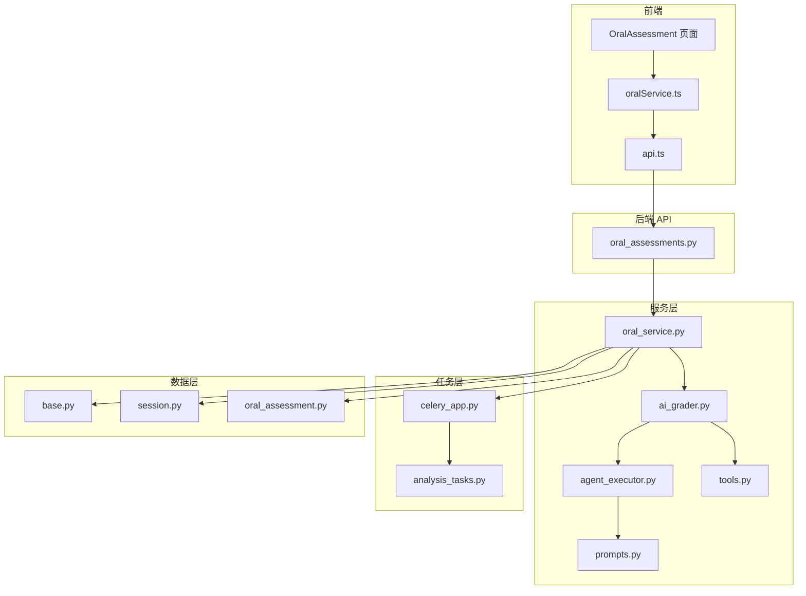
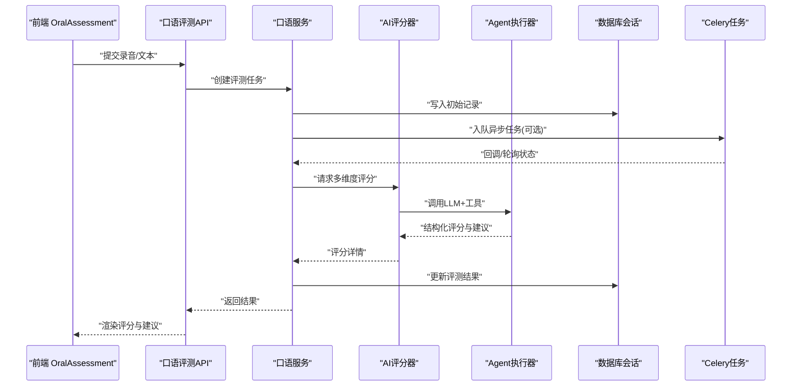
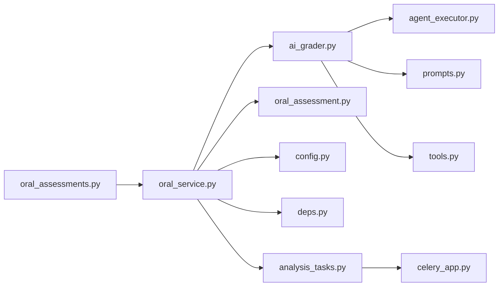

# 发音检测与纠正

<cite>
**本文引用的文件**   
- [oral_assessments.py](file://backend/app/api/v1/oral_assessments.py)
- [oral_service.py](file://backend/app/services/oral_service.py)
- [oral_assessment.py](file://backend/app/models/oral_assessment.py)
- [ai_grader.py](file://backend/app/services/ai_grader.py)
- [agent_executor.py](file://backend/app/services/agent/agent_executor.py)
- [prompts.py](file://backend/app/services/agent/prompts.py)
- [tools.py](file://backend/app/services/agent/tools.py)
- [analysis_tasks.py](file://backend/app/tasks/analysis_tasks.py)
- [celery_app.py](file://backend/app/tasks/celery_app.py)
- [config.py](file://backend/app/core/config.py)
- [deps.py](file://backend/app/core/deps.py)
- [session.py](file://backend/app/db/session.py)
- [base.py](file://backend/app/db/base.py)
- [api.py](file://frontend/src/services/api.ts)
- [oralService.ts](file://frontend/src/services/oralService.ts)
- [OralAssessment/index.tsx](file://frontend/src/pages/OralAssessment/index.tsx)
</cite>

## 目录
1. [简介](#简介)
2. [项目结构](#项目结构)
3. [核心组件](#核心组件)
4. [架构总览](#架构总览)
5. [详细组件分析](#详细组件分析)
6. [依赖关系分析](#依赖关系分析)
7. [性能考虑](#性能考虑)
8. [故障排查指南](#故障排查指南)
9. [结论](#结论)
10. [附录](#附录)

## 简介
本文件面向“发音检测与纠正”子系统，系统性阐述语音识别在发音评估中的应用、音素级分析与声学特征提取思路、发音相似度计算、准确度评分算法（元音辅音区分、重音位置判断、语调模式识别）、错误自动检测机制（常见偏差识别、方言口音处理、个体差异适应）、个性化纠正建议生成逻辑，以及发音数据库的构建与维护。同时提供开发者集成新语音模型与自定义评估规则的实施指引。

## 项目结构
后端采用分层架构：API 层暴露 REST 接口，服务层封装业务逻辑（含口语评估与 AI 评分），任务层使用 Celery 异步执行耗时任务，数据层通过 SQLAlchemy 管理持久化；前端提供口语评测页面与服务调用封装。

图表来源
- [oral_assessments.py:1-200](file://backend/app/api/v1/oral_assessments.py#L1-L200)
- [oral_service.py:1-300](file://backend/app/services/oral_service.py#L1-L300)
- [ai_grader.py:1-200](file://backend/app/services/ai_grader.py#L1-L200)
- [agent_executor.py:1-200](file://backend/app/services/agent/agent_executor.py#L1-L200)
- [prompts.py:1-200](file://backend/app/services/agent/prompts.py#L1-L200)
- [tools.py:1-200](file://backend/app/services/agent/tools.py#L1-L200)
- [analysis_tasks.py:1-200](file://backend/app/tasks/analysis_tasks.py#L1-L200)
- [celery_app.py:1-100](file://backend/app/tasks/celery_app.py#L1-L100)
- [oral_assessment.py:1-200](file://backend/app/models/oral_assessment.py#L1-L200)
- [base.py:1-100](file://backend/app/db/base.py#L1-L100)
- [session.py:1-100](file://backend/app/db/session.py#L1-L100)
- [api.ts:1-200](file://frontend/src/services/api.ts#L1-L200)
- [oralService.ts:1-200](file://frontend/src/services/oralService.ts#L1-L200)
- [OralAssessment/index.tsx:1-200](file://frontend/src/pages/OralAssessment/index.tsx#L1-L200)

章节来源
- [oral_assessments.py:1-200](file://backend/app/api/v1/oral_assessments.py#L1-L200)
- [oral_service.py:1-300](file://backend/app/services/oral_service.py#L1-L300)
- [ai_grader.py:1-200](file://backend/app/services/ai_grader.py#L1-L200)
- [agent_executor.py:1-200](file://backend/app/services/agent/agent_executor.py#L1-L200)
- [prompts.py:1-200](file://backend/app/services/agent/prompts.py#L1-L200)
- [tools.py:1-200](file://backend/app/services/agent/tools.py#L1-L200)
- [analysis_tasks.py:1-200](file://backend/app/tasks/analysis_tasks.py#L1-L200)
- [celery_app.py:1-100](file://backend/app/tasks/celery_app.py#L1-L100)
- [oral_assessment.py:1-200](file://backend/app/models/oral_assessment.py#L1-L200)
- [base.py:1-100](file://backend/app/db/base.py#L1-L100)
- [session.py:1-100](file://backend/app/db/session.py#L1-L100)
- [api.ts:1-200](file://frontend/src/services/api.ts#L1-L200)
- [oralService.ts:1-200](file://frontend/src/services/oralService.ts#L1-L200)
- [OralAssessment/index.tsx:1-200](file://frontend/src/pages/OralAssessment/index.tsx#L1-L200)

## 核心组件
- 口语评测 API：接收录音或文本输入，触发评估流程并返回结构化结果。
- 口语服务：编排评估流程，协调 ASR、对齐、评分、纠错建议生成与持久化。
- AI 评分器：基于提示词与工具链对口语输出进行多维度打分与建议生成。
- Agent 执行器：驱动 LLM 工作流，结合工具完成复杂推理与格式化输出。
- 任务队列：将耗时任务（如长音频处理、批量评测）异步化，提升吞吐与稳定性。
- 数据模型与会话：定义评测记录结构与数据库访问。
- 前端页面与服务：提供录制、上传、进度展示与结果渲染能力。

章节来源
- [oral_assessments.py:1-200](file://backend/app/api/v1/oral_assessments.py#L1-L200)
- [oral_service.py:1-300](file://backend/app/services/oral_service.py#L1-L300)
- [ai_grader.py:1-200](file://backend/app/services/ai_grader.py#L1-L200)
- [agent_executor.py:1-200](file://backend/app/services/agent/agent_executor.py#L1-L200)
- [analysis_tasks.py:1-200](file://backend/app/tasks/analysis_tasks.py#L1-L200)
- [oral_assessment.py:1-200](file://backend/app/models/oral_assessment.py#L1-L200)
- [OralAssessment/index.tsx:1-200](file://frontend/src/pages/OralAssessment/index.tsx#L1-L200)

## 架构总览
系统围绕“录音/文本输入 → 语音转写与对齐 → 特征抽取与相似度计算 → 评分与建议 → 结果持久化与展示”的主链路展开。关键交互如下：

图表来源
- [oral_assessments.py:1-200](file://backend/app/api/v1/oral_assessments.py#L1-L200)
- [oral_service.py:1-300](file://backend/app/services/oral_service.py#L1-L300)
- [ai_grader.py:1-200](file://backend/app/services/ai_grader.py#L1-L200)
- [agent_executor.py:1-200](file://backend/app/services/agent/agent_executor.py#L1-L200)
- [analysis_tasks.py:1-200](file://backend/app/tasks/analysis_tasks.py#L1-L200)
- [oral_assessment.py:1-200](file://backend/app/models/oral_assessment.py#L1-L200)

## 详细组件分析

### 口语评测 API 与前端交互
- 职责：接收前端上传的音频文件或文本，校验参数，调用服务层，返回统一响应格式。
- 关键点：支持同步快速路径与异步任务路径；对大音频或高并发场景建议使用任务队列。
- 前端：页面负责录音采集、上传、进度条与结果可视化；服务封装统一 API 调用。

章节来源
- [oral_assessments.py:1-200](file://backend/app/api/v1/oral_assessments.py#L1-L200)
- [api.ts:1-200](file://frontend/src/services/api.ts#L1-L200)
- [oralService.ts:1-200](file://frontend/src/services/oralService.ts#L1-L200)
- [OralAssessment/index.tsx:1-200](file://frontend/src/pages/OralAssessment/index.tsx#L1-L200)

### 口语服务（Oral Service）
- 职责：编排评估全流程，包括：
  - 输入预处理（音频解码、降噪、分片）
  - 语音转写（ASR）与时间戳对齐
  - 音素级切分与声学特征提取（如 MFCC、F0、能量）
  - 发音相似度计算（参考音素序列 vs 实际音素序列）
  - 维度评分（元音/辅音准确度、重音位置、语调模式）
  - 错误检测与归因（常见偏差、方言口音、个体差异）
  - 生成个性化纠正建议与练习材料
  - 结果持久化与版本管理
- 设计要点：可插拔的 ASR/对齐/评分模块；配置驱动的评估规则；任务队列解耦耗时步骤。

章节来源
- [oral_service.py:1-300](file://backend/app/services/oral_service.py#L1-L300)
- [config.py:1-200](file://backend/app/core/config.py#L1-L200)
- [deps.py:1-200](file://backend/app/core/deps.py#L1-L200)

### AI 评分器与 Agent 工作流
- 职责：基于 LLM 与工具链，对转写文本与声学特征进行综合评分，输出结构化结果（分数、维度明细、错误定位、纠正建议）。
- 提示工程：通过提示模板组织评估维度、约束输出格式、注入用户画像与历史表现。
- 工具链：封装词典、音素映射、重音规则、语调模式库等外部知识。
- 执行器：管理上下文、重试、超时、缓存与幂等性。

章节来源
- [ai_grader.py:1-200](file://backend/app/services/ai_grader.py#L1-L200)
- [agent_executor.py:1-200](file://backend/app/services/agent/agent_executor.py#L1-L200)
- [prompts.py:1-200](file://backend/app/services/agent/prompts.py#L1-L200)
- [tools.py:1-200](file://backend/app/services/agent/tools.py#L1-L200)

### 任务队列与异步处理
- 职责：将长音频处理、批量评测、离线校准等任务放入队列，避免阻塞主线程。
- 特性：失败重试、退避策略、进度回传、结果回调。
- 适用场景：多轨录音、跨语种混合、大规模历史数据再评分。

章节来源
- [celery_app.py:1-100](file://backend/app/tasks/celery_app.py#L1-L100)
- [analysis_tasks.py:1-200](file://backend/app/tasks/analysis_tasks.py#L1-L200)

### 数据模型与持久化
- 评测记录：包含用户信息、题目/语料、录音路径、转写文本、音素序列、声学特征摘要、评分明细、错误列表、纠正建议、版本与时间戳。
- 会话与基类：统一数据库连接与会话生命周期管理。

章节来源
- [oral_assessment.py:1-200](file://backend/app/models/oral_assessment.py#L1-L200)
- [base.py:1-100](file://backend/app/db/base.py#L1-L100)
- [session.py:1-100](file://backend/app/db/session.py#L1-L100)

## 依赖关系分析
- 耦合与内聚：
  - API 仅依赖服务层，保持薄控制器风格。
  - 服务层聚合多个子模块（ASR、对齐、评分、建议），通过配置与依赖注入降低硬耦合。
  - AI 评分器与 Agent 执行器松耦合，便于替换不同 LLM 提供商或提示模板。
- 外部依赖：
  - 语音处理库（解码、特征提取）
  - ASR 引擎（本地或云端）
  - 向量/知识库（用于发音词典、示例语料检索）
  - 消息队列（Celery/RabbitMQ/Redis）
- 潜在循环依赖：服务层不应反向导入 API；任务模块仅依赖服务与模型。

图表来源
- [oral_assessments.py:1-200](file://backend/app/api/v1/oral_assessments.py#L1-L200)
- [oral_service.py:1-300](file://backend/app/services/oral_service.py#L1-L300)
- [ai_grader.py:1-200](file://backend/app/services/ai_grader.py#L1-L200)
- [agent_executor.py:1-200](file://backend/app/services/agent/agent_executor.py#L1-L200)
- [prompts.py:1-200](file://backend/app/services/agent/prompts.py#L1-L200)
- [tools.py:1-200](file://backend/app/services/agent/tools.py#L1-L200)
- [analysis_tasks.py:1-200](file://backend/app/tasks/analysis_tasks.py#L1-L200)
- [celery_app.py:1-100](file://backend/app/tasks/celery_app.py#L1-L100)
- [oral_assessment.py:1-200](file://backend/app/models/oral_assessment.py#L1-L200)
- [config.py:1-200](file://backend/app/core/config.py#L1-L200)
- [deps.py:1-200](file://backend/app/core/deps.py#L1-L200)

## 性能考虑
- 批处理与流水线：对长音频进行分片并行处理，减少端到端延迟。
- 缓存策略：对相同语料与参考发音的特征与评分结果进行缓存，避免重复计算。
- 资源隔离：CPU/GPU 密集型任务与 I/O 密集任务分离，合理设置线程池与进程池。
- 降级与熔断：当 ASR 或 LLM 服务不可用时，退回轻量规则评分，保证可用性。
- 存储优化：声学特征以列式或压缩格式存储，按需加载。

[本节为通用指导，不直接分析具体文件]

## 故障排查指南
- 常见问题
  - 录音质量差导致 ASR 失败：检查采样率、信噪比与静音段裁剪。
  - 对齐不稳定：调整 VAD 阈值与音素边界平滑策略。
  - 评分波动：固定随机种子、增加提示词约束与输出校验。
  - 任务堆积：监控队列长度与消费者实例数，扩容 Worker。
- 日志与追踪
  - 关键节点埋点：输入校验、ASR 耗时、对齐误差、评分维度耗时、建议生成耗时。
  - 错误码与重试策略：区分可重试与不可重试错误，记录上下文快照。
- 数据一致性
  - 评测记录幂等：基于任务 ID 去重，避免重复入库。
  - 版本控制：每次评估生成新版本，便于回溯与 A/B 对比。

章节来源
- [analysis_tasks.py:1-200](file://backend/app/tasks/analysis_tasks.py#L1-L200)
- [celery_app.py:1-100](file://backend/app/tasks/celery_app.py#L1-L100)
- [oral_service.py:1-300](file://backend/app/services/oral_service.py#L1-L300)

## 结论
本系统以“可插拔的语音处理 + 可配置的评估规则 + 智能的 LLM 辅助评分”为核心，实现了从音素级分析到个性化纠正建议的全链路闭环。通过任务队列与缓存策略保障性能与稳定性，借助提示工程与工具链增强评分的可解释性与可操作性。后续可在方言适配、个体差异建模与实时反馈方面持续演进。

[本节为总结性内容，不直接分析具体文件]

## 附录

### 发音评估技术要点
- 音素级分析
  - 目标：将连续语音切分为音素片段，建立与参考音素的对应关系。
  - 方法：动态时间规整（DTW）、隐马尔可夫模型（HMM）或端到端对齐模型。
  - 复杂度：O(nm) 级别的时间与空间开销，需结合分片与索引优化。
- 声学特征提取
  - 常用特征：MFCC、梅尔谱、F0（基频）、能量、共振峰。
  - 用途：用于相似度度量、重音与语调识别、说话人归一化。
- 发音相似度计算
  - 音素级：编辑距离、加权编辑距离（按混淆矩阵权重）。
  - 帧级：DTW 距离、余弦相似度（特征向量）。
  - 词/句级：BLEU/PER/WER 作为粗粒度指标，配合细粒度音素指标。
- 准确度评分算法
  - 元音/辅音区分：基于混淆矩阵与混淆代价函数，对不同类别赋予不同权重。
  - 重音位置判断：利用 F0 与能量峰值检测，与参考重音位置比对。
  - 语调模式识别：基频轮廓拟合与模式匹配（升调、降调、平调）。
- 错误自动检测
  - 常见偏差：同化、弱化、连读、吞音、错音位。
  - 方言口音：引入方言变体词典与区域混淆矩阵，动态调整阈值。
  - 个体差异：基于用户历史数据自适应阈值与权重，避免误判。
- 个性化纠正建议
  - 错误示范：播放正确发音片段，标注问题音素与时间戳。
  - 指导说明：给出发音部位、气流与舌位要点。
  - 练习材料：推荐最小对立对、绕口令、句子跟读与渐进难度训练。
- 发音数据库构建与维护
  - 数据来源：标准母语者录音、学习者语料、公开数据集。
  - 标注规范：音素边界、重音标记、语调标签、方言标签。
  - 质量控制：多人标注、一致性检验、冲突仲裁。
  - 版本管理：数据版本、模型版本、评估规则版本联动。

[本节为概念性内容，不直接分析具体文件]

### 开发者集成指南
- 集成新的语音模型
  - 在配置中注册新 ASR 后端与特征提取器。
  - 实现统一的接口契约（输入/输出标准化）。
  - 在任务队列中新增处理管道，确保幂等与可观测性。
- 自定义发音评估规则
  - 扩展提示模板与工具链，新增维度与权重。
  - 通过配置开关控制规则生效范围与灰度发布。
  - 使用 A/B 测试与离线回放验证效果。
- 前端接入
  - 使用统一服务封装发起评测请求与轮询任务状态。
  - 渲染多维评分、错误定位与纠正建议。
  - 支持导出报告与历史记录对比。

章节来源
- [config.py:1-200](file://backend/app/core/config.py#L1-L200)
- [deps.py:1-200](file://backend/app/core/deps.py#L1-L200)
- [oral_service.py:1-300](file://backend/app/services/oral_service.py#L1-L300)
- [ai_grader.py:1-200](file://backend/app/services/ai_grader.py#L1-L200)
- [prompts.py:1-200](file://backend/app/services/agent/prompts.py#L1-L200)
- [tools.py:1-200](file://backend/app/services/agent/tools.py#L1-L200)
- [oralService.ts:1-200](file://frontend/src/services/oralService.ts#L1-L200)
- [OralAssessment/index.tsx:1-200](file://frontend/src/pages/OralAssessment/index.tsx#L1-L200)