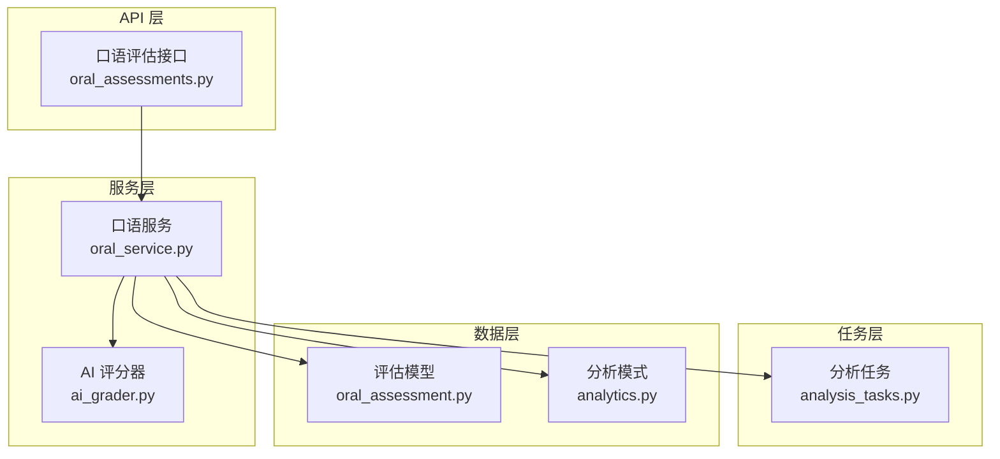
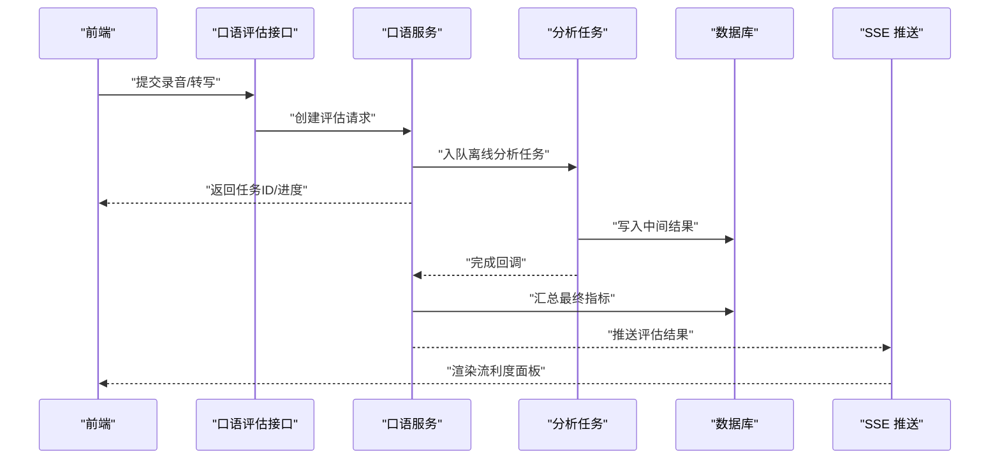
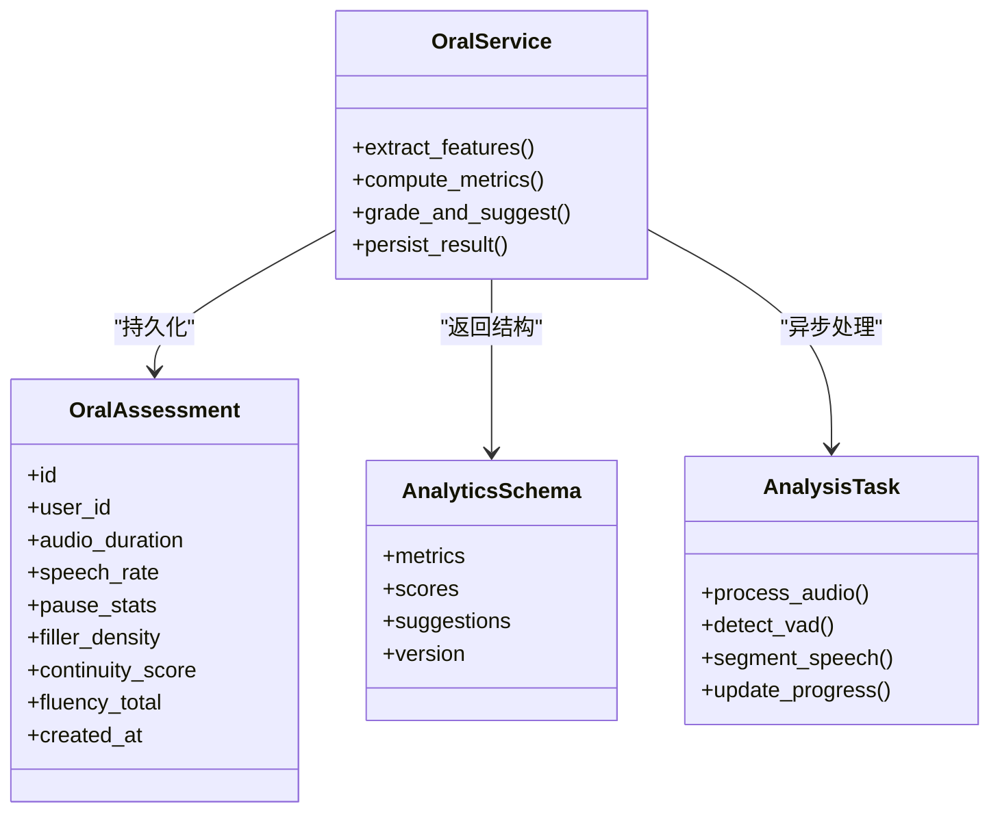
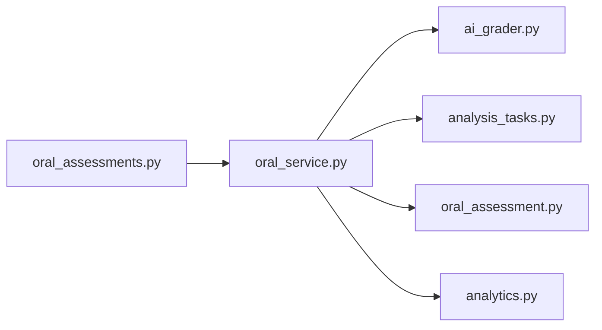

# 流利度度量系统

<cite>
**本文引用的文件**   
- [oral_assessments.py](file://backend/app/api/v1/oral_assessments.py)
- [oral_service.py](file://backend/app/services/oral_service.py)
- [oral_assessment.py](file://backend/app/models/oral_assessment.py)
- [analytics.py](file://backend/app/schemas/analytics.py)
- [ai_grader.py](file://backend/app/services/ai_grader.py)
- [analysis_tasks.py](file://backend/app/tasks/analysis_tasks.py)
</cite>

## 目录
1. [简介](#简介)
2. [项目结构](#项目结构)
3. [核心组件](#核心组件)
4. [架构总览](#架构总览)
5. [详细组件分析](#详细组件分析)
6. [依赖关系分析](#依赖关系分析)
7. [性能考量](#性能考量)
8. [故障排查指南](#故障排查指南)
9. [结论](#结论)
10. [附录](#附录)

## 简介
本文件面向开发者与产品工程师，系统化阐述“口语流利度度量系统”的设计与实现。内容覆盖：
- 流利度量化指标：语速、停顿、填充词、语流连续性等
- 评分算法：时间序列分析、语音特征提取、模式识别的应用思路
- 影响因素分析：语言熟练度、思维组织、表达习惯对流利度的影响
- 改进建议生成：语速调节、停顿优化、流畅性训练方法
- 实时监控机制：前端采集、后端处理、增量评估
- 参数化与可配置：如何调整评估参数与自定义标准

## 项目结构
围绕口语评估与流利度度量，后端主要涉及以下模块：
- API 层：接收录音或转写数据，触发评估流程
- 服务层：执行特征提取、指标计算、评分与建议生成
- 任务层：异步处理耗时分析（如音频切片、声学特征）
- 模型与模式：持久化评估结果与结构化指标
- 前端页面与服务：录制、上传、展示与交互

图表来源
- [oral_assessments.py](file://backend/app/api/v1/oral_assessments.py)
- [oral_service.py](file://backend/app/services/oral_service.py)
- [analysis_tasks.py](file://backend/app/tasks/analysis_tasks.py)
- [oral_assessment.py](file://backend/app/models/oral_assessment.py)
- [analytics.py](file://backend/app/schemas/analytics.py)

章节来源
- [oral_assessments.py](file://backend/app/api/v1/oral_assessments.py)
- [oral_service.py](file://backend/app/services/oral_service.py)
- [analysis_tasks.py](file://backend/app/tasks/analysis_tasks.py)
- [oral_assessment.py](file://backend/app/models/oral_assessment.py)
- [analytics.py](file://backend/app/schemas/analytics.py)

## 核心组件
- 口语评估接口：负责接收录音/转写输入、校验参数、调度评估任务并返回结果
- 口语服务：编排特征提取、指标计算、评分与建议生成；协调任务队列与缓存
- AI 评分器：基于规则与模型融合给出综合评分与维度分
- 分析任务：异步执行耗时操作（音频切分、静音检测、VAD、声学特征）
- 评估模型与分析模式：定义持久化字段与返回结构，支撑前端可视化

章节来源
- [oral_assessments.py](file://backend/app/api/v1/oral_assessments.py)
- [oral_service.py](file://backend/app/services/oral_service.py)
- [ai_grader.py](file://backend/app/services/ai_grader.py)
- [analysis_tasks.py](file://backend/app/tasks/analysis_tasks.py)
- [oral_assessment.py](file://backend/app/models/oral_assessment.py)
- [analytics.py](file://backend/app/schemas/analytics.py)

## 架构总览
整体采用“接口-服务-任务-数据”的分层架构，支持批处理与实时流式两种路径：
- 批处理：上传录音/转写后，由服务层调用任务层进行离线分析，完成后落库并返回
- 实时流式：前端按帧推送音频片段，服务端增量更新指标并推送 SSE 事件

图表来源
- [oral_assessments.py](file://backend/app/api/v1/oral_assessments.py)
- [oral_service.py](file://backend/app/services/oral_service.py)
- [analysis_tasks.py](file://backend/app/tasks/analysis_tasks.py)
- [analytics.py](file://backend/app/schemas/analytics.py)

## 详细组件分析

### 指标体系与计算方法
- 语速（音节/分钟或字/秒）
  - 依据有效发音时长与文本长度计算，剔除静音与填充段
  - 考虑说话人个体差异，提供相对基线对比
- 停顿分析
  - 基于静音检测与 VAD 划分话轮，统计停顿次数、平均/中位停顿时长、长停顿占比
  - 区分句内停顿与句间停顿，结合语义边界定位
- 填充词检测
  - 通过词典与上下文规则识别“嗯、啊、那个”等填充词，统计频次与密度
  - 结合韵律特征降低误检
- 语流连续性
  - 使用滑动窗口计算能量/过零率方差，衡量连贯性
  - 引入停顿分布熵与重读/弱读比例作为辅助指标

章节来源
- [oral_service.py](file://backend/app/services/oral_service.py)
- [analysis_tasks.py](file://backend/app/tasks/analysis_tasks.py)
- [analytics.py](file://backend/app/schemas/analytics.py)

### 评分算法设计
- 时间序列分析
  - 将音频分段为固定时长窗口，提取短时能量、频谱质心、MFCC 均值/方差等特征
  - 使用变化点检测识别异常停顿与卡顿
- 语音特征提取
  - 静音检测、VAD、基频/共振峰估计、音素级对齐（可选）
- 模式识别
  - 基于规则与轻量模型的混合策略：填充词模式、重复模式、自我修正模式
  - 多指标加权融合得到维度分与总分，支持个性化权重

章节来源
- [oral_service.py](file://backend/app/services/oral_service.py)
- [ai_grader.py](file://backend/app/services/ai_grader.py)
- [analysis_tasks.py](file://backend/app/tasks/analysis_tasks.py)

### 影响因素分析
- 语言熟练度
  - 词汇检索速度、语法自动化程度影响语速与停顿分布
- 思维组织
  - 逻辑结构清晰可降低长停顿与填充词密度
- 表达习惯
  - 个人节奏、口头禅、强调方式会影响填充词与重读模式
- 环境与设备
  - 噪声、采样率、麦克风质量影响静音检测与 VAD 精度

章节来源
- [oral_service.py](file://backend/app/services/oral_service.py)
- [ai_grader.py](file://backend/app/services/ai_grader.py)

### 改进建议生成逻辑
- 语速调节指导
  - 若平均语速低于目标区间，建议放慢思考节奏、减少冗余停顿
  - 若语速过快导致吞音，建议适度降速、加强咬字
- 停顿优化建议
  - 针对长停顿集中区域，建议拆分句子、增加连接词
  - 对高频短停顿，建议练习意群断句
- 表达流畅性训练
  - 填充词密集时，建议“沉默替代”训练与复述练习
  - 结合回听标注，建立个人“卡顿热点图”，针对性训练

章节来源
- [oral_service.py](file://backend/app/services/oral_service.py)
- [ai_grader.py](file://backend/app/services/ai_grader.py)

### 实时流利度监控机制
- 前端按帧采集音频，压缩后以 WebSocket/SSE 推送
- 服务端维护滑动窗口状态，增量更新指标
- 当检测到显著停顿或填充词峰值时，即时提示
- 会话结束聚合输出完整报告

章节来源
- [oral_assessments.py](file://backend/app/api/v1/oral_assessments.py)
- [oral_service.py](file://backend/app/services/oral_service.py)
- [analysis_tasks.py](file://backend/app/tasks/analysis_tasks.py)

### 参数化与自定义评估标准
- 可调参数示例
  - 静音阈值、最小停顿时长、填充词词典版本、语速目标区间、指标权重
- 自定义标准
  - 通过配置文件或数据库表注入权重与阈值
  - 支持不同语种/年龄段的预设模板
- 版本管理
  - 评估版本与参数快照绑定，便于回溯与对比

章节来源
- [oral_service.py](file://backend/app/services/oral_service.py)
- [analytics.py](file://backend/app/schemas/analytics.py)

#### 类与数据结构关系

图表来源
- [oral_assessment.py](file://backend/app/models/oral_assessment.py)
- [analytics.py](file://backend/app/schemas/analytics.py)
- [oral_service.py](file://backend/app/services/oral_service.py)
- [analysis_tasks.py](file://backend/app/tasks/analysis_tasks.py)

章节来源
- [oral_assessment.py](file://backend/app/models/oral_assessment.py)
- [analytics.py](file://backend/app/schemas/analytics.py)
- [oral_service.py](file://backend/app/services/oral_service.py)
- [analysis_tasks.py](file://backend/app/tasks/analysis_tasks.py)

## 依赖关系分析
- 耦合与内聚
  - 接口层仅做路由与校验，业务集中在服务层，任务层专注耗时操作，数据层负责持久化
- 外部依赖
  - 音频处理库（静音/VAD）、信号处理工具、消息队列（Celery/RQ）、数据库（SQLAlchemy）
- 循环依赖
  - 通过接口与模式对象解耦，避免服务与任务直接互相引用

图表来源
- [oral_assessments.py](file://backend/app/api/v1/oral_assessments.py)
- [oral_service.py](file://backend/app/services/oral_service.py)
- [ai_grader.py](file://backend/app/services/ai_grader.py)
- [analysis_tasks.py](file://backend/app/tasks/analysis_tasks.py)
- [oral_assessment.py](file://backend/app/models/oral_assessment.py)
- [analytics.py](file://backend/app/schemas/analytics.py)

章节来源
- [oral_assessments.py](file://backend/app/api/v1/oral_assessments.py)
- [oral_service.py](file://backend/app/services/oral_service.py)
- [ai_grader.py](file://backend/app/services/ai_grader.py)
- [analysis_tasks.py](file://backend/app/tasks/analysis_tasks.py)
- [oral_assessment.py](file://backend/app/models/oral_assessment.py)
- [analytics.py](file://backend/app/schemas/analytics.py)

## 性能考量
- 批处理优化
  - 分块读取音频、并行特征提取、结果合并
- 实时流式优化
  - 滑动窗口大小与步长权衡，增量更新避免全量重算
- 存储与索引
  - 指标结果按会话与用户索引，便于历史趋势分析
- 资源控制
  - 任务队列限流、超时重试、失败隔离

[本节为通用指导，不直接分析具体文件]

## 故障排查指南
- 常见问题
  - 静音阈值不当导致误判停顿：检查阈值与 VAD 参数
  - 填充词漏检/误检：核对词典版本与上下文规则
  - 语速异常：确认采样率与时长换算
- 日志与追踪
  - 记录关键步骤耗时与中间指标，定位瓶颈
- 恢复策略
  - 失败任务自动重试，保留中间结果以便断点续算

章节来源
- [analysis_tasks.py](file://backend/app/tasks/analysis_tasks.py)
- [oral_service.py](file://backend/app/services/oral_service.py)

## 结论
本系统以模块化分层架构实现口语流利度度量，覆盖从特征提取到评分建议的全链路。通过参数化与模板化，可灵活适配不同场景与人群。建议在上线前进行多维度基准测试，持续迭代指标与权重，确保评估的稳定性与公平性。

[本节为总结性内容，不直接分析具体文件]

## 附录
- 术语
  - VAD：语音活动检测
  - MFCC：梅尔频率倒谱系数
  - SSE：服务器发送事件
- 参考实践
  - 滑动窗口与变化点检测在语音分析中的应用
  - 基于规则的填充词识别与机器学习增强

[本节为补充信息，不直接分析具体文件]