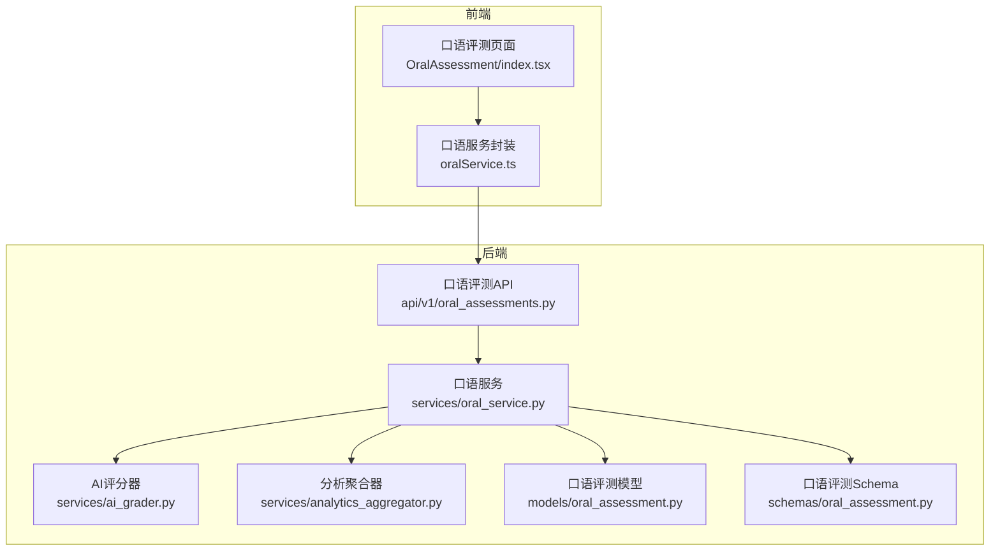
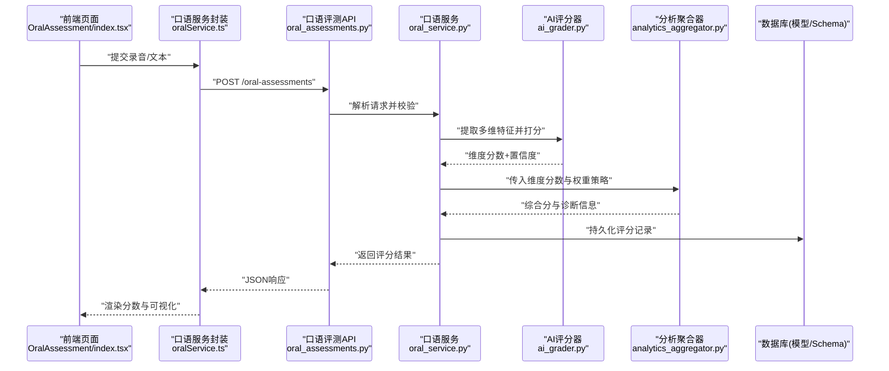
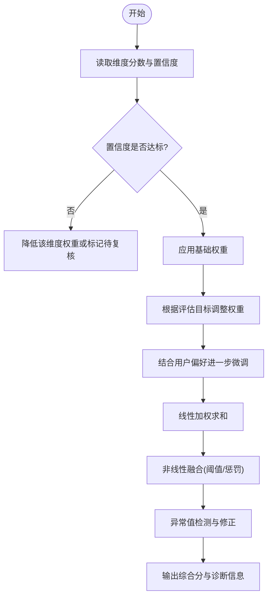
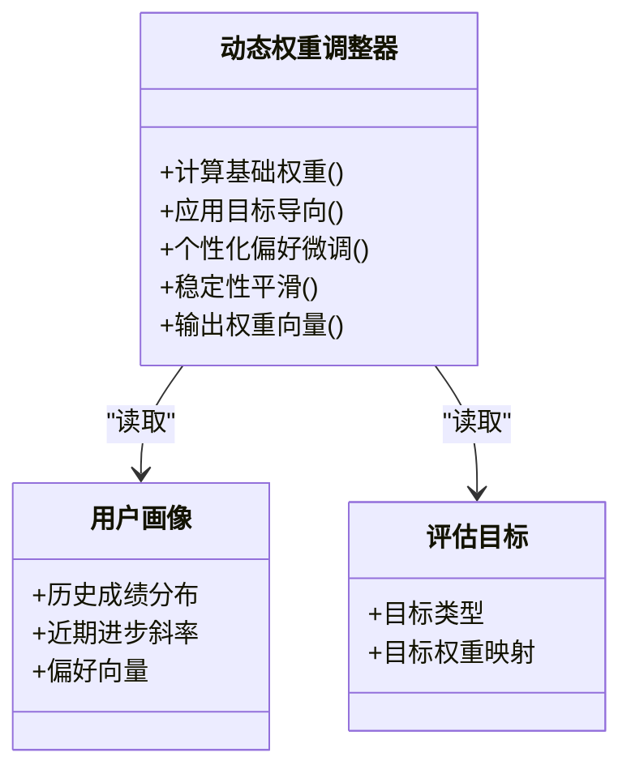
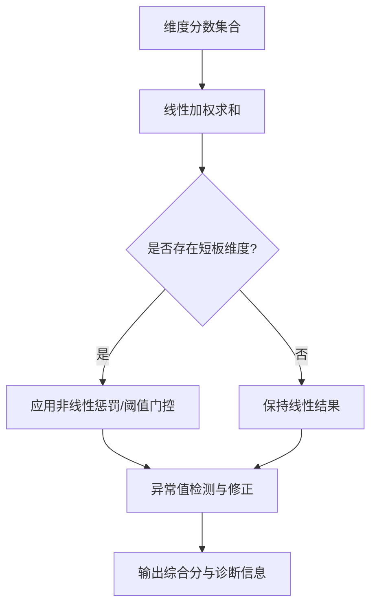
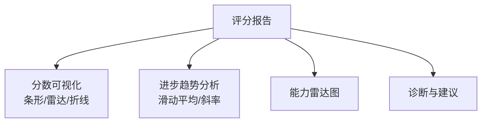
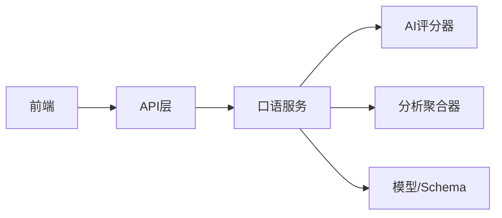

# 综合评分聚合

<cite>
**本文引用的文件**   
- [backend/app/services/ai_grader.py](file://backend/app/services/ai_grader.py)
- [backend/app/services/oral_service.py](file://backend/app/services/oral_service.py)
- [backend/app/services/analytics_aggregator.py](file://backend/app/services/analytics_aggregator.py)
- [backend/app/models/oral_assessment.py](file://backend/app/models/oral_assessment.py)
- [backend/app/schemas/oral_assessment.py](file://backend/app/schemas/oral_assessment.py)
- [backend/app/api/v1/oral_assessments.py](file://backend/app/api/v1/oral_assessments.py)
- [frontend/src/pages/OralAssessment/index.tsx](file://frontend/src/pages/OralAssessment/index.tsx)
- [frontend/src/services/oralService.ts](file://frontend/src/services/oralService.ts)
</cite>

## 目录
1. [简介](#简介)
2. [项目结构](#项目结构)
3. [核心组件](#核心组件)
4. [架构总览](#架构总览)
5. [详细组件分析](#详细组件分析)
6. [依赖关系分析](#依赖关系分析)
7. [性能考虑](#性能考虑)
8. [故障排查指南](#故障排查指南)
9. [结论](#结论)
10. [附录](#附录)

## 简介
本文件面向开发者与产品工程师，系统化阐述“综合评分聚合系统”的设计与实现。内容覆盖多维度评分的加权计算机制、动态权重调整算法、最终评分合成策略、评分报告生成逻辑、评分校准与质量控制机制，以及面向开发者的规则配置与自定义聚合扩展方式。目标是帮助读者快速理解并安全扩展该评分体系，确保评估结果的准确性、一致性与可解释性。

## 项目结构
本项目采用前后端分离架构：后端基于 Python（FastAPI）提供评分与聚合能力，前端使用 React 展示学习分析与口语评测结果。与“综合评分聚合”直接相关的代码主要位于后端 services、models、schemas 与 API 层，以及前端的口语评测页面与服务调用封装。

图表来源
- [backend/app/api/v1/oral_assessments.py](file://backend/app/api/v1/oral_assessments.py)
- [backend/app/services/oral_service.py](file://backend/app/services/oral_service.py)
- [backend/app/services/ai_grader.py](file://backend/app/services/ai_grader.py)
- [backend/app/services/analytics_aggregator.py](file://backend/app/services/analytics_aggregator.py)
- [backend/app/models/oral_assessment.py](file://backend/app/models/oral_assessment.py)
- [backend/app/schemas/oral_assessment.py](file://backend/app/schemas/oral_assessment.py)
- [frontend/src/pages/OralAssessment/index.tsx](file://frontend/src/pages/OralAssessment/index.tsx)
- [frontend/src/services/oralService.ts](file://frontend/src/services/oralService.ts)

章节来源
- [backend/app/api/v1/oral_assessments.py](file://backend/app/api/v1/oral_assessments.py)
- [backend/app/services/oral_service.py](file://backend/app/services/oral_service.py)
- [backend/app/services/ai_grader.py](file://backend/app/services/ai_grader.py)
- [backend/app/services/analytics_aggregator.py](file://backend/app/services/analytics_aggregator.py)
- [backend/app/models/oral_assessment.py](file://backend/app/models/oral_assessment.py)
- [backend/app/schemas/oral_assessment.py](file://backend/app/schemas/oral_assessment.py)
- [frontend/src/pages/OralAssessment/index.tsx](file://frontend/src/pages/OralAssessment/index.tsx)
- [frontend/src/services/oralService.ts](file://frontend/src/services/oralService.ts)

## 核心组件
- AI评分器：负责从语音或文本输入中提取多维特征并输出维度分数（语法、词汇、流利度、发音等），同时返回置信度与诊断信息。
- 口语服务：编排评分流程，协调评分器、聚合器与持久化模型，支持动态权重调整与个性化偏好注入。
- 分析聚合器：将多维分数按规则进行线性加权与非线性融合，执行异常值处理与质量门控，产出最终综合分与子项得分。
- 数据模型与Schema：定义评分记录的结构、字段约束与校验规则，保障数据一致性。
- API层：暴露评分提交、查询、重评与报告获取接口，承载请求参数校验与响应序列化。
- 前端展示：呈现单项分数、雷达图、趋势折线图等可视化元素，并提供用户偏好设置入口。

章节来源
- [backend/app/services/ai_grader.py](file://backend/app/services/ai_grader.py)
- [backend/app/services/oral_service.py](file://backend/app/services/oral_service.py)
- [backend/app/services/analytics_aggregator.py](file://backend/app/services/analytics_aggregator.py)
- [backend/app/models/oral_assessment.py](file://backend/app/models/oral_assessment.py)
- [backend/app/schemas/oral_assessment.py](file://backend/app/schemas/oral_assessment.py)
- [backend/app/api/v1/oral_assessments.py](file://backend/app/api/v1/oral_assessments.py)
- [frontend/src/pages/OralAssessment/index.tsx](file://frontend/src/pages/OralAssessment/index.tsx)
- [frontend/src/services/oralService.ts](file://frontend/src/services/oralService.ts)

## 架构总览
下图展示了从前端发起口语评测到后端完成评分聚合与报告生成的端到端流程。

图表来源
- [backend/app/api/v1/oral_assessments.py](file://backend/app/api/v1/oral_assessments.py)
- [backend/app/services/oral_service.py](file://backend/app/services/oral_service.py)
- [backend/app/services/ai_grader.py](file://backend/app/services/ai_grader.py)
- [backend/app/services/analytics_aggregator.py](file://backend/app/services/analytics_aggregator.py)
- [backend/app/models/oral_assessment.py](file://backend/app/models/oral_assessment.py)
- [backend/app/schemas/oral_assessment.py](file://backend/app/schemas/oral_assessment.py)
- [frontend/src/pages/OralAssessment/index.tsx](file://frontend/src/pages/OralAssessment/index.tsx)
- [frontend/src/services/oralService.ts](file://frontend/src/services/oralService.ts)

## 详细组件分析

### 多维度评分与加权计算机制
- 维度定义：语法、词汇、流利度、发音等维度由评分器独立打分，通常归一化至统一量纲（如0-100）。
- 权重分配策略：
  - 基础权重：根据教学大纲或任务类型设定默认权重（例如写作侧重语法与词汇，口语侧重发音与流利度）。
  - 目标导向权重：依据当前学习目标（如“提升发音准确度”）临时提高对应维度权重。
  - 个性化偏好：结合用户历史表现与反馈，对弱势维度给予更高权重以强化训练效果。
- 线性加权公式：综合分 = Σ(维度分数 × 维度权重)，权重总和为1。
- 非线性融合：在关键维度存在显著短板时引入惩罚因子或阈值门控，避免高分掩盖弱项。
- 异常值处理：对极端低分或高置信度不足的维度进行平滑或降权，防止噪声影响整体评价。

图表来源
- [backend/app/services/ai_grader.py](file://backend/app/services/ai_grader.py)
- [backend/app/services/oral_service.py](file://backend/app/services/oral_service.py)
- [backend/app/services/analytics_aggregator.py](file://backend/app/services/analytics_aggregator.py)

章节来源
- [backend/app/services/ai_grader.py](file://backend/app/services/ai_grader.py)
- [backend/app/services/oral_service.py](file://backend/app/services/oral_service.py)
- [backend/app/services/analytics_aggregator.py](file://backend/app/services/analytics_aggregator.py)

### 动态权重调整算法
- 用户水平自适应：
  - 通过历史成绩分布与近期进步斜率估计用户当前水平，自动调节各维度权重，使评估更贴合实际能力区间。
- 评估目标导向：
  - 当用户选择特定目标（如“备考口语”），系统会临时提升发音与流利度权重，并在报告中突出相关建议。
- 个性化偏好考虑：
  - 基于用户反馈（如“希望加强词汇多样性”）与行为数据（重复练习某类题型），持续更新偏好向量，驱动权重微调。
- 稳定性控制：
  - 引入平滑因子与上限限制，避免权重频繁大幅波动；对短期异常波动进行回退与缓冲。

图表来源
- [backend/app/services/oral_service.py](file://backend/app/services/oral_service.py)
- [backend/app/services/analytics_aggregator.py](file://backend/app/services/analytics_aggregator.py)

章节来源
- [backend/app/services/oral_service.py](file://backend/app/services/oral_service.py)
- [backend/app/services/analytics_aggregator.py](file://backend/app/services/analytics_aggregator.py)

### 最终评分的合成算法
- 线性加权：适用于大多数场景，保证可解释性与透明度。
- 非线性融合：
  - 阈值门控：若任一维度低于阈值，则触发额外惩罚或降级处理。
  - 指数惩罚：对短板维度施加非线性惩罚，强调补齐弱项的重要性。
- 异常值处理：
  - 基于置信度与历史分布识别异常，采用中位数或稳健统计方法替代极端值。
  - 对低置信度维度进行降权或要求人工复核。
- 输出产物：
  - 综合分、维度分、诊断摘要、改进建议与置信度说明。

图表来源
- [backend/app/services/analytics_aggregator.py](file://backend/app/services/analytics_aggregator.py)

章节来源
- [backend/app/services/analytics_aggregator.py](file://backend/app/services/analytics_aggregator.py)

### 评分报告生成逻辑
- 分数可视化：
  - 单项分数条、雷达图展示各维度相对强弱。
  - 趋势折线图展示多次评测的综合分与维度分变化。
- 进步趋势分析：
  - 计算滑动平均与斜率，识别稳定提升或波动情况。
  - 对比基准线与目标线，给出达成度评估。
- 能力雷达图：
  - 将各维度分数标准化后绘制多边形，直观呈现能力轮廓。
- 报告内容：
  - 综合分与维度分、置信度说明、诊断要点、改进建议与下一步学习计划。

章节来源
- [frontend/src/pages/OralAssessment/index.tsx](file://frontend/src/pages/OralAssessment/index.tsx)
- [frontend/src/services/oralService.ts](file://frontend/src/services/oralService.ts)

### 评分校准与质量控制机制
- 校准策略：
  - 定期抽样人工复核，建立评分偏差模型，对系统评分进行偏移校正。
  - 跨时间窗口的一致性检验，确保不同批次评测结果可比。
- 质量控制：
  - 置信度阈值与异常检测，触发二次评估或人工审核。
  - 版本化评分规则与聚合算法，支持灰度发布与回滚。
- 审计与追溯：
  - 记录每次评分的输入、规则版本、权重配置与中间结果，便于问题定位与复现。

章节来源
- [backend/app/services/analytics_aggregator.py](file://backend/app/services/analytics_aggregator.py)
- [backend/app/models/oral_assessment.py](file://backend/app/models/oral_assessment.py)
- [backend/app/schemas/oral_assessment.py](file://backend/app/schemas/oral_assessment.py)

### 开发者配置与自定义聚合扩展
- 配置评分规则：
  - 在配置中心或数据库表中维护维度权重、阈值与惩罚策略。
  - 支持按用户组、任务类型或学习目标切换规则集。
- 自定义聚合算法：
  - 在聚合器中注册新的融合函数（如模糊积分、层次分析法），并通过策略模式加载。
  - 提供单元测试与回归测试，确保新算法不影响既有结果。
- 动态权重开关：
  - 通过特性开关控制自适应与个性化调整模块的启用与参数范围。
- 监控与告警：
  - 对评分分布漂移、置信度下降与异常比例上升进行监控与告警。

章节来源
- [backend/app/services/analytics_aggregator.py](file://backend/app/services/analytics_aggregator.py)
- [backend/app/services/oral_service.py](file://backend/app/services/oral_service.py)

## 依赖关系分析
- 组件耦合：
  - 口语服务依赖评分器与聚合器，承担编排职责；聚合器依赖评分器输出与配置规则。
  - API层仅做请求校验与响应序列化，业务逻辑下沉至服务层，保持清晰边界。
- 外部依赖：
  - 数据库用于持久化评分记录与配置；前端通过服务封装访问API。
- 潜在循环依赖：
  - 当前分层清晰，未见循环导入；建议在新增功能时继续保持单向依赖。

图表来源
- [backend/app/api/v1/oral_assessments.py](file://backend/app/api/v1/oral_assessments.py)
- [backend/app/services/oral_service.py](file://backend/app/services/oral_service.py)
- [backend/app/services/ai_grader.py](file://backend/app/services/ai_grader.py)
- [backend/app/services/analytics_aggregator.py](file://backend/app/services/analytics_aggregator.py)
- [backend/app/models/oral_assessment.py](file://backend/app/models/oral_assessment.py)
- [backend/app/schemas/oral_assessment.py](file://backend/app/schemas/oral_assessment.py)
- [frontend/src/pages/OralAssessment/index.tsx](file://frontend/src/pages/OralAssessment/index.tsx)
- [frontend/src/services/oralService.ts](file://frontend/src/services/oralService.ts)

章节来源
- [backend/app/api/v1/oral_assessments.py](file://backend/app/api/v1/oral_assessments.py)
- [backend/app/services/oral_service.py](file://backend/app/services/oral_service.py)
- [backend/app/services/ai_grader.py](file://backend/app/services/ai_grader.py)
- [backend/app/services/analytics_aggregator.py](file://backend/app/services/analytics_aggregator.py)
- [backend/app/models/oral_assessment.py](file://backend/app/models/oral_assessment.py)
- [backend/app/schemas/oral_assessment.py](file://backend/app/schemas/oral_assessment.py)
- [frontend/src/pages/OralAssessment/index.tsx](file://frontend/src/pages/OralAssessment/index.tsx)
- [frontend/src/services/oralService.ts](file://frontend/src/services/oralService.ts)

## 性能考虑
- 批处理与缓存：
  - 对高频维度特征计算结果进行缓存，减少重复计算开销。
- 异步与队列：
  - 将耗时评分任务放入异步队列，避免阻塞主线程；前端通过轮询或SSE获取进度。
- 资源优化：
  - 对音频预处理与特征提取进行并行化；合理设置超时与重试策略。
- 监控与限流：
  - 对评分接口实施速率限制与熔断保护，防止雪崩效应。

[本节为通用指导，不直接分析具体文件]

## 故障排查指南
- 常见问题：
  - 维度分数缺失或置信度过低：检查评分器输入质量与前置处理链路。
  - 综合分异常波动：核查动态权重调整器的平滑参数与阈值配置。
  - 报告渲染异常：确认前端数据格式与可视化库兼容性。
- 调试步骤：
  - 查看评分记录的中间结果与规则版本，定位变更点。
  - 开启详细日志，追踪评分器与聚合器的关键决策路径。
  - 使用最小数据集复现问题，逐步隔离模块。

章节来源
- [backend/app/services/ai_grader.py](file://backend/app/services/ai_grader.py)
- [backend/app/services/analytics_aggregator.py](file://backend/app/services/analytics_aggregator.py)
- [backend/app/models/oral_assessment.py](file://backend/app/models/oral_assessment.py)
- [backend/app/schemas/oral_assessment.py](file://backend/app/schemas/oral_assessment.py)

## 结论
本综合评分聚合系统通过多维度评分、动态权重调整与非线性融合，实现了既具可解释性又兼顾个性化的评估能力。配合严格的校准与质量控制机制，确保了结果的一致性与可信度。面向开发者，系统提供了清晰的配置与扩展点，便于在不同教学场景下灵活定制评分策略与报告呈现。

[本节为总结性内容，不直接分析具体文件]

## 附录
- 术语表：
  - 维度分数：各能力维度的量化评分。
  - 动态权重：随用户水平、目标与偏好变化的权重策略。
  - 非线性融合：在阈值或短板条件下对线性加权结果进行修正的方法。
- 参考实现路径：
  - 评分器与聚合器核心逻辑参见相应服务文件。
  - 前端可视化与交互逻辑参见口语评测页面与服务封装。

[本节为补充信息，不直接分析具体文件]