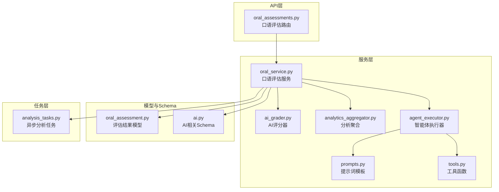
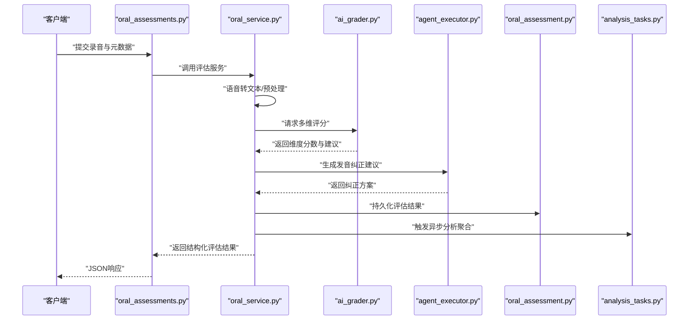
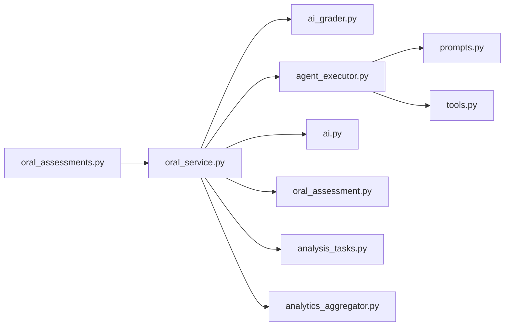

# 评估算法系统

<cite>
**本文引用的文件**   
- [oral_assessments.py](file://backend/app/api/v1/oral_assessments.py)
- [oral_service.py](file://backend/app/services/oral_service.py)
- [ai_grader.py](file://backend/app/services/ai_grader.py)
- [oral_assessment.py](file://backend/app/models/oral_assessment.py)
- [ai.py](file://backend/app/schemas/ai.py)
- [agent_executor.py](file://backend/app/services/agent/agent_executor.py)
- [prompts.py](file://backend/app/services/agent/prompts.py)
- [tools.py](file://backend/app/services/agent/tools.py)
- [analytics_aggregator.py](file://backend/app/services/analytics_aggregator.py)
- [analysis_tasks.py](file://backend/app/tasks/analysis_tasks.py)
</cite>

## 目录
1. [简介](#简介)
2. [项目结构](#项目结构)
3. [核心组件](#核心组件)
4. [架构总览](#架构总览)
5. [详细组件分析](#详细组件分析)
6. [依赖关系分析](#依赖关系分析)
7. [性能考量](#性能考量)
8. [故障排查指南](#故障排查指南)
9. [结论](#结论)
10. [附录](#附录)

## 简介
本文件面向开发者与产品工程师，系统化阐述“评估算法系统”的设计与实现。重点覆盖：
- 多维度评分体系构建（语法准确性、词汇复杂度、流利度、发音准确度等）的量化方法与指标定义
- AI驱动的评估算法实现（NLP技术、机器学习模型集成方式）
- 评分权重计算机制与个性化调整策略
- 发音纠正建议生成逻辑（常见错误模式识别、纠正方案推荐）
- 评估结果的数据结构与存储格式
- 扩展新评估维度与自定义评分规则的方法

## 项目结构
后端采用分层架构：API层暴露接口，服务层封装业务与AI能力，模型层定义数据实体，任务层处理异步分析，Agent层提供可编排的智能体工具链。前端通过服务调用后端API进行口语评估与结果展示。

图表来源
- [oral_assessments.py](file://backend/app/api/v1/oral_assessments.py)
- [oral_service.py](file://backend/app/services/oral_service.py)
- [ai_grader.py](file://backend/app/services/ai_grader.py)
- [oral_assessment.py](file://backend/app/models/oral_assessment.py)
- [ai.py](file://backend/app/schemas/ai.py)
- [agent_executor.py](file://backend/app/services/agent/agent_executor.py)
- [prompts.py](file://backend/app/services/agent/prompts.py)
- [tools.py](file://backend/app/services/agent/tools.py)
- [analytics_aggregator.py](file://backend/app/services/analytics_aggregator.py)
- [analysis_tasks.py](file://backend/app/tasks/analysis_tasks.py)

章节来源
- [oral_assessments.py](file://backend/app/api/v1/oral_assessments.py)
- [oral_service.py](file://backend/app/services/oral_service.py)
- [ai_grader.py](file://backend/app/services/ai_grader.py)
- [oral_assessment.py](file://backend/app/models/oral_assessment.py)
- [ai.py](file://backend/app/schemas/ai.py)
- [agent_executor.py](file://backend/app/services/agent/agent_executor.py)
- [prompts.py](file://backend/app/services/agent/prompts.py)
- [tools.py](file://backend/app/services/agent/tools.py)
- [analytics_aggregator.py](file://backend/app/services/analytics_aggregator.py)
- [analysis_tasks.py](file://backend/app/tasks/analysis_tasks.py)

## 核心组件
- 口语评估服务（oral_service.py）：协调语音转文本、文本质量分析、发音评估、结果聚合与持久化；支持异步任务触发与分析聚合。
- AI评分器（ai_grader.py）：封装NLP与机器学习能力，输出语法、词汇、流利度等维度的分数与建议。
- 智能体执行器（agent_executor.py）：基于提示词与工具链，驱动LLM完成复杂推理与纠错建议生成。
- 分析聚合（analytics_aggregator.py）：汇总历史评估数据，形成学习画像与趋势统计。
- 评估结果模型（oral_assessment.py）：定义评估结果的数据库结构与字段约束。
- AI Schema（ai.py）：统一AI输入输出结构，便于前后端契约稳定。
- 异步分析任务（analysis_tasks.py）：将耗时分析放入队列，避免阻塞请求。

章节来源
- [oral_service.py](file://backend/app/services/oral_service.py)
- [ai_grader.py](file://backend/app/services/ai_grader.py)
- [agent_executor.py](file://backend/app/services/agent/agent_executor.py)
- [analytics_aggregator.py](file://backend/app/services/analytics_aggregator.py)
- [oral_assessment.py](file://backend/app/models/oral_assessment.py)
- [ai.py](file://backend/app/schemas/ai.py)
- [analysis_tasks.py](file://backend/app/tasks/analysis_tasks.py)

## 架构总览
评估流程从API入口开始，进入服务层进行多模态数据处理与AI评分，随后由智能体生成纠偏建议，最终写入数据库并返回结构化结果。

图表来源
- [oral_assessments.py](file://backend/app/api/v1/oral_assessments.py)
- [oral_service.py](file://backend/app/services/oral_service.py)
- [ai_grader.py](file://backend/app/services/ai_grader.py)
- [agent_executor.py](file://backend/app/services/agent/agent_executor.py)
- [oral_assessment.py](file://backend/app/models/oral_assessment.py)
- [analysis_tasks.py](file://backend/app/tasks/analysis_tasks.py)

## 详细组件分析

### 多维度评分体系
- 维度定义
  - 语法准确性：句法结构、时态一致性、主谓一致、从句使用等。
  - 词汇复杂度：词频分布、学术词汇占比、同义替换多样性、搭配合理性。
  - 流利度：语速稳定性、停顿频率、填充词比例、连贯性。
  - 发音准确度：音素级对齐误差、重音与语调偏差、连读与弱读问题。
- 量化方法
  - 文本侧：基于NLP特征工程与预训练模型抽取句法树、依存关系、词性标注、语义相似度等。
  - 语音侧：基于ASR置信度、音素对齐得分、韵律特征（基频、能量、时长）建模。
  - 融合策略：分维度打分后按权重加权求和，得到总分；同时保留维度明细与建议。
- 权重与个性化
  - 默认权重在配置中集中管理，可按用户水平、学习目标动态调整。
  - 个性化策略包括：对初学者提高语法权重，对进阶者提升词汇复杂度与流利度权重；根据历史表现自适应微调。

章节来源
- [ai_grader.py](file://backend/app/services/ai_grader.py)
- [oral_service.py](file://backend/app/services/oral_service.py)
- [ai.py](file://backend/app/schemas/ai.py)

### AI驱动的评估算法实现
- NLP技术应用
  - 句法分析、依存解析、词性标注用于语法准确性评估。
  - 词汇统计与语义嵌入用于词汇复杂度评估。
  - 时序特征与停顿检测用于流利度评估。
- 机器学习模型集成
  - 使用预训练语言模型进行文本质量打分与异常检测。
  - 使用声学模型与对齐模型进行发音准确度评估。
  - 模型输出经校准与阈值处理后映射到标准化分数。
- 智能体辅助
  - 通过提示词模板与工具链，让LLM生成解释性反馈与纠偏建议，增强可解释性与可操作性。

章节来源
- [ai_grader.py](file://backend/app/services/ai_grader.py)
- [agent_executor.py](file://backend/app/services/agent/agent_executor.py)
- [prompts.py](file://backend/app/services/agent/prompts.py)
- [tools.py](file://backend/app/services/agent/tools.py)

### 评分权重计算机制与个性化调整策略
- 权重计算
  - 基础公式：总分 = Σ(维度得分 × 维度权重)。
  - 归一化：各维度先归一到统一量纲，再进行加权。
  - 容错：缺失维度或低置信度时采用降级策略（如回退到次优模型或保守估计）。
- 个性化调整
  - 基于用户画像（水平等级、目标场景、历史表现）动态调整权重。
  - 在线学习：根据用户反馈与后续表现更新权重参数。
  - 课程阶段：不同教学阶段启用不同权重组合以匹配教学目标。

章节来源
- [oral_service.py](file://backend/app/services/oral_service.py)
- [ai.py](file://backend/app/schemas/ai.py)

### 发音纠正建议生成逻辑
- 错误模式识别
  - 音素级对比：参考发音与产出发音的差异定位。
  - 韵律问题：重音错位、语调不自然、连读不当。
  - 常见母语迁移错误：特定音位混淆、辅音簇简化等。
- 纠正方案推荐
  - 针对具体错误点给出最小可行练习（如绕口令、跟读片段）。
  - 结合上下文提供替代表达与句型优化建议。
  - 通过智能体生成个性化讲解与示例，提升理解与记忆。
- 生成流程
  - 输入：文本转录、音素对齐结果、韵律特征。
  - 处理：错误聚类、模式匹配、规则与模型联合决策。
  - 输出：结构化纠正建议列表，包含错误类型、原因说明、练习建议。

章节来源
- [ai_grader.py](file://backend/app/services/ai_grader.py)
- [agent_executor.py](file://backend/app/services/agent/agent_executor.py)
- [prompts.py](file://backend/app/services/agent/prompts.py)
- [tools.py](file://backend/app/services/agent/tools.py)

### 评估结果的数据结构与存储格式
- 数据结构要点
  - 总分与各维度分数（语法、词汇、流利度、发音准确度）。
  - 置信度与模型版本信息，便于追踪与回溯。
  - 纠正建议列表，包含错误类型、位置、建议内容。
  - 元数据：用户ID、会话ID、录音时长、采样率、时间戳。
- 存储格式
  - 数据库表由评估模型定义，确保字段约束与索引优化。
  - 对外API返回JSON结构，遵循统一的AI Schema约定。
- 可扩展性
  - 新增维度时，在Schema与模型中增加字段，并在评分器中实现对应计算逻辑。
  - 权重配置外置，支持热更新与A/B测试。

章节来源
- [oral_assessment.py](file://backend/app/models/oral_assessment.py)
- [ai.py](file://backend/app/schemas/ai.py)
- [oral_service.py](file://backend/app/services/oral_service.py)

### 扩展新评估维度与自定义评分规则
- 步骤概览
  - 定义维度与指标：在Schema中声明新字段与校验规则。
  - 实现评分逻辑：在服务或评分器中编写计算函数，输出标准化分数与建议。
  - 接入权重配置：在权重表中注册新维度，设置默认权重与个性化策略。
  - 集成智能体：为LLM提供必要工具与提示词，使其能解释与指导新维度。
  - 持久化与可视化：更新模型与API响应结构，前端适配展示。
- 最佳实践
  - 保持模块解耦：评分逻辑与服务编排分离，便于单元测试与回归测试。
  - 可观测性：记录关键中间特征与模型版本，便于问题定位与效果评估。
  - 渐进式上线：先灰度发布，监控指标后再全量推广。

章节来源
- [ai.py](file://backend/app/schemas/ai.py)
- [oral_service.py](file://backend/app/services/oral_service.py)
- [ai_grader.py](file://backend/app/services/ai_grader.py)
- [agent_executor.py](file://backend/app/services/agent/agent_executor.py)
- [prompts.py](file://backend/app/services/agent/prompts.py)
- [tools.py](file://backend/app/services/agent/tools.py)

## 依赖关系分析

图表来源
- [oral_assessments.py](file://backend/app/api/v1/oral_assessments.py)
- [oral_service.py](file://backend/app/services/oral_service.py)
- [ai_grader.py](file://backend/app/services/ai_grader.py)
- [agent_executor.py](file://backend/app/services/agent/agent_executor.py)
- [prompts.py](file://backend/app/services/agent/prompts.py)
- [tools.py](file://backend/app/services/agent/tools.py)
- [ai.py](file://backend/app/schemas/ai.py)
- [oral_assessment.py](file://backend/app/models/oral_assessment.py)
- [analysis_tasks.py](file://backend/app/tasks/analysis_tasks.py)
- [analytics_aggregator.py](file://backend/app/services/analytics_aggregator.py)

章节来源
- [oral_assessments.py](file://backend/app/api/v1/oral_assessments.py)
- [oral_service.py](file://backend/app/services/oral_service.py)
- [ai_grader.py](file://backend/app/services/ai_grader.py)
- [agent_executor.py](file://backend/app/services/agent/agent_executor.py)
- [prompts.py](file://backend/app/services/agent/prompts.py)
- [tools.py](file://backend/app/services/agent/tools.py)
- [ai.py](file://backend/app/schemas/ai.py)
- [oral_assessment.py](file://backend/app/models/oral_assessment.py)
- [analysis_tasks.py](file://backend/app/tasks/analysis_tasks.py)
- [analytics_aggregator.py](file://backend/app/services/analytics_aggregator.py)

## 性能考量
- 批处理与缓存
  - 对批量录音进行并行处理，利用缓存减少重复计算。
- 异步与队列
  - 将耗时分析放入任务队列，避免阻塞HTTP请求。
- 模型优化
  - 使用轻量模型进行快速初筛，再对高价值样本调用重型模型。
- 资源监控
  - 记录CPU/GPU占用、内存峰值与延迟分布，设定告警阈值。

[本节为通用指导，无需源码引用]

## 故障排查指南
- 常见问题
  - 评分异常：检查维度置信度与模型版本，确认权重配置是否生效。
  - 建议不可用：验证智能体提示词与工具链可用性，查看日志中的错误码。
  - 存储失败：核对数据库字段约束与必填项，确认事务回滚情况。
- 诊断步骤
  - 拉取请求链路日志，定位失败节点。
  - 复现实例并开启详细日志，捕获中间特征与模型输出。
  - 使用最小数据集回归测试，逐步缩小问题范围。

章节来源
- [oral_service.py](file://backend/app/services/oral_service.py)
- [ai_grader.py](file://backend/app/services/ai_grader.py)
- [agent_executor.py](file://backend/app/services/agent/agent_executor.py)
- [oral_assessment.py](file://backend/app/models/oral_assessment.py)

## 结论
本评估算法系统通过服务化编排与AI能力集成，实现了多维度、可解释、可个性化的口语评估。其模块化设计便于扩展新维度与自定义规则，智能体辅助提升了纠偏建议的可操作性。建议在持续迭代中强化可观测性与A/B测试能力，以保障评估质量与用户体验。

[本节为总结性内容，无需源码引用]

## 附录
- 术语表
  - 音素：语音的最小单位。
  - 依存关系：词语之间的语法依赖关系。
  - 置信度：模型输出的可靠性度量。
- 参考路径
  - 评分器实现：[ai_grader.py](file://backend/app/services/ai_grader.py)
  - 评估服务：[oral_service.py](file://backend/app/services/oral_service.py)
  - 智能体执行器：[agent_executor.py](file://backend/app/services/agent/agent_executor.py)
  - 提示词模板：[prompts.py](file://backend/app/services/agent/prompts.py)
  - 工具函数：[tools.py](file://backend/app/services/agent/tools.py)
  - 评估结果模型：[oral_assessment.py](file://backend/app/models/oral_assessment.py)
  - AI Schema：[ai.py](file://backend/app/schemas/ai.py)
  - 异步分析任务：[analysis_tasks.py](file://backend/app/tasks/analysis_tasks.py)
  - 分析聚合：[analytics_aggregator.py](file://backend/app/services/analytics_aggregator.py)

[本节为补充信息，无需源码引用]