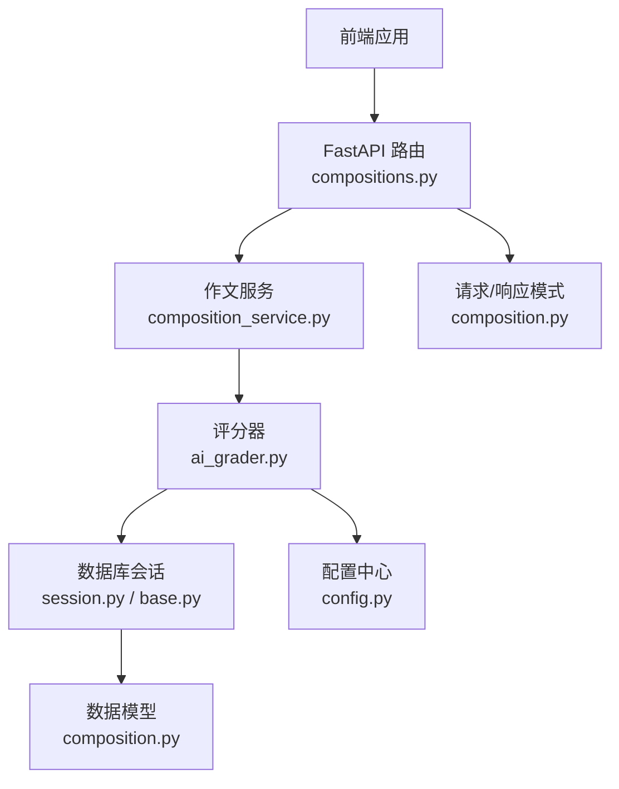
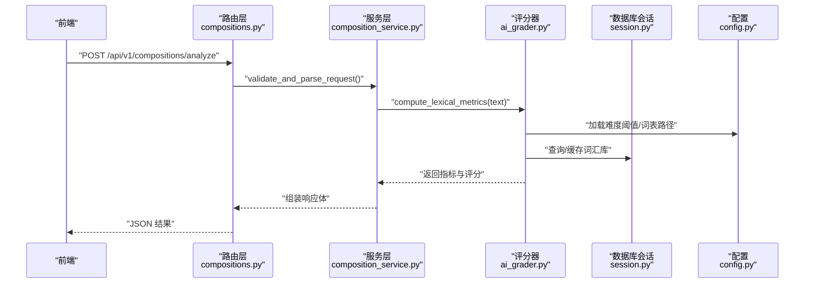
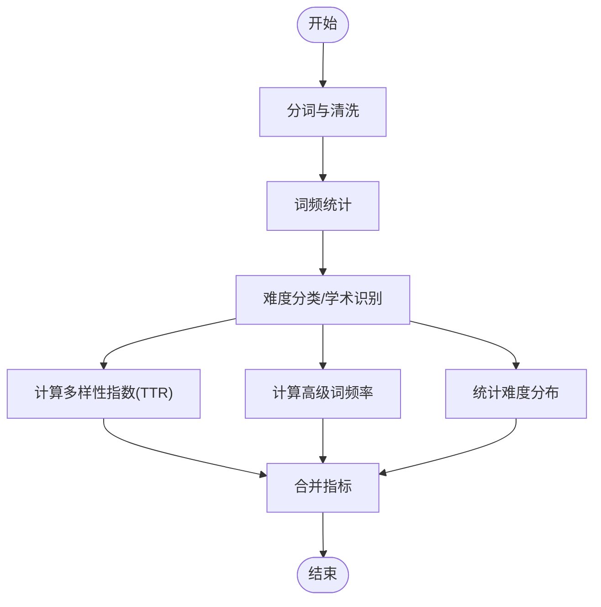
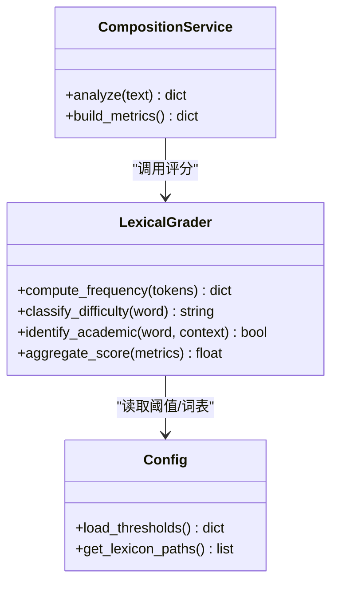
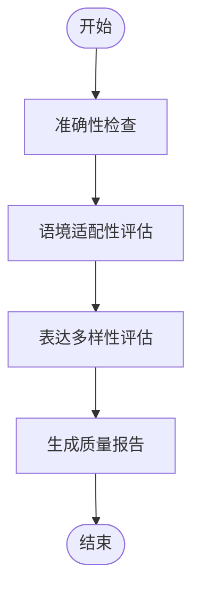
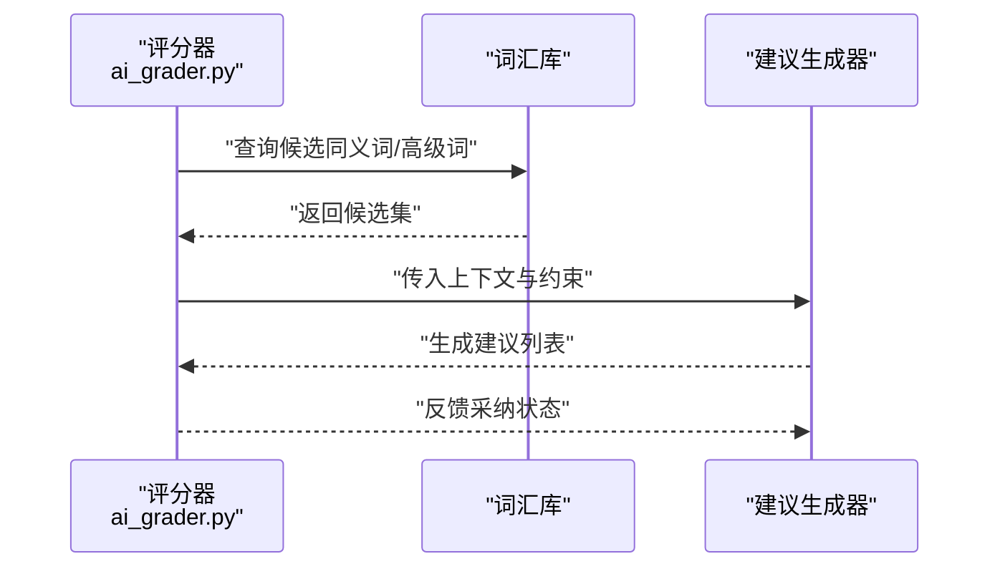
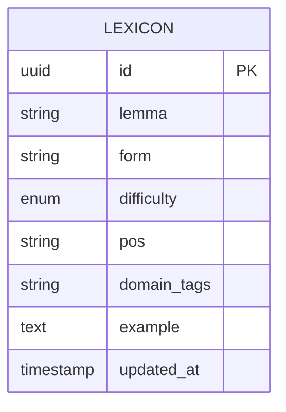
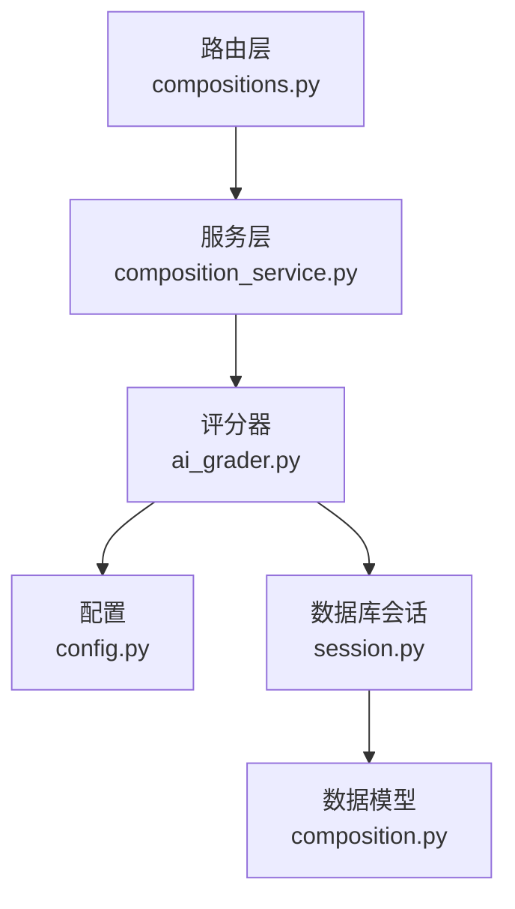

# 词汇复杂度评估

<cite>
**本文引用的文件**   
- [backend/app/services/ai_grader.py](file://backend/app/services/ai_grader.py)
- [backend/app/services/composition_service.py](file://backend/app/services/composition_service.py)
- [backend/app/api/v1/compositions.py](file://backend/app/api/v1/compositions.py)
- [backend/app/models/composition.py](file://backend/app/models/composition.py)
- [backend/app/schemas/composition.py](file://backend/app/schemas/composition.py)
- [backend/app/core/config.py](file://backend/app/core/config.py)
- [backend/app/db/base.py](file://backend/app/db/base.py)
- [backend/app/db/session.py](file://backend/app/db/session.py)
</cite>

## 目录
1. [简介](#简介)
2. [项目结构](#项目结构)
3. [核心组件](#核心组件)
4. [架构总览](#架构总览)
5. [详细组件分析](#详细组件分析)
6. [依赖关系分析](#依赖关系分析)
7. [性能考虑](#性能考虑)
8. [故障排查指南](#故障排查指南)
9. [结论](#结论)
10. [附录](#附录)

## 简介
本文件面向“词汇复杂度评估系统”的开发者与使用者，系统化阐述以下能力：
- 词汇丰富度计算方法：词汇多样性指数、高级词汇使用频率、词汇难度等级分布等指标的定义与计算方式。
- 词汇复杂度评分算法：基于词频统计、词汇级别分类、学术词汇识别的技术路线与实现要点。
- 词汇使用质量评估：用词准确性、语境适配性、表达多样性等维度的评估方法与输出。
- 改进建议生成机制：同义词替换推荐、高级词汇引导、表达优化建议的生成流程。
- 词汇数据库结构与更新机制：数据模型、版本化与增量更新策略。
- 集成指南：如何接入新的词汇资源与自定义词汇难度标准。

## 项目结构
本项目采用前后端分离架构，后端以 FastAPI 提供 API，服务层封装业务逻辑（包括作文分析与评分），数据持久化通过 SQLAlchemy 管理。与词汇复杂度评估相关的核心代码位于后端 services 与 api 层，以及对应的 models/schemas 定义。

图表来源
- [backend/app/api/v1/compositions.py](file://backend/app/api/v1/compositions.py)
- [backend/app/services/composition_service.py](file://backend/app/services/composition_service.py)
- [backend/app/services/ai_grader.py](file://backend/app/services/ai_grader.py)
- [backend/app/db/session.py](file://backend/app/db/session.py)
- [backend/app/db/base.py](file://backend/app/db/base.py)
- [backend/app/models/composition.py](file://backend/app/models/composition.py)
- [backend/app/schemas/composition.py](file://backend/app/schemas/composition.py)
- [backend/app/core/config.py](file://backend/app/core/config.py)

章节来源
- [backend/app/api/v1/compositions.py](file://backend/app/api/v1/compositions.py)
- [backend/app/services/composition_service.py](file://backend/app/services/composition_service.py)
- [backend/app/services/ai_grader.py](file://backend/app/services/ai_grader.py)
- [backend/app/models/composition.py](file://backend/app/models/composition.py)
- [backend/app/schemas/composition.py](file://backend/app/schemas/composition.py)
- [backend/app/core/config.py](file://backend/app/core/config.py)
- [backend/app/db/base.py](file://backend/app/db/base.py)
- [backend/app/db/session.py](file://backend/app/db/session.py)

## 核心组件
- 词汇丰富度指标
  - 词汇多样性指数：衡量文本中不同词汇占总体词汇的比例，反映用词变化程度。
  - 高级词汇使用频率：统计被标记为“高级”或“学术”的词汇在全文中的占比与频次。
  - 词汇难度等级分布：将词汇按难度分级（如基础/中等/高级）并统计各等级数量与比例。
- 词汇复杂度评分算法
  - 词频统计：对分词结果进行计数，构建词频分布。
  - 词汇级别分类：依据内置词典或外部资源将词汇映射到难度等级。
  - 学术词汇识别：结合学术词表与上下文特征识别学术型词汇。
- 词汇使用质量评估
  - 用词准确性：检测搭配不当、语义冲突与语法错误导致的用词问题。
  - 语境适配性：评估词汇是否符合文体、主题与受众要求。
  - 表达多样性：避免重复与单调，鼓励多样化表达。
- 改进建议生成机制
  - 同义词替换推荐：根据目标难度与风格提供可替换候选。
  - 高级词汇引导：针对薄弱段落提示可提升的高级词汇。
  - 表达优化建议：从连贯性、正式度与可读性角度给出修改方向。
- 词汇数据库与更新机制
  - 数据结构：包含词条、难度等级、词性、领域标签、示例句等字段。
  - 更新策略：支持批量导入、增量更新与版本控制，确保一致性。

章节来源
- [backend/app/services/ai_grader.py](file://backend/app/services/ai_grader.py)
- [backend/app/services/composition_service.py](file://backend/app/services/composition_service.py)
- [backend/app/models/composition.py](file://backend/app/models/composition.py)
- [backend/app/schemas/composition.py](file://backend/app/schemas/composition.py)
- [backend/app/core/config.py](file://backend/app/core/config.py)

## 架构总览
词汇复杂度评估的整体流程如下：
- 前端提交待评估文本至 compositions API。
- 路由层解析请求参数并调用 composition_service。
- 服务层组织分词、词频统计、难度分类与学术词汇识别。
- ai_grader 聚合各项指标，计算复杂度评分与质量评估。
- 结果经 schemas 校验后返回给前端。

图表来源
- [backend/app/api/v1/compositions.py](file://backend/app/api/v1/compositions.py)
- [backend/app/services/composition_service.py](file://backend/app/services/composition_service.py)
- [backend/app/services/ai_grader.py](file://backend/app/services/ai_grader.py)
- [backend/app/db/session.py](file://backend/app/db/session.py)
- [backend/app/core/config.py](file://backend/app/core/config.py)

## 详细组件分析

### 词汇丰富度计算
- 词汇多样性指数
  - 输入：分词后的词序列。
  - 计算：唯一词数除以总词数，得到类型-令牌比（TTR）。
  - 扩展：可对滑动窗口计算移动 TTR，降低长度偏差。
- 高级词汇使用频率
  - 输入：难度分类结果与学术词表匹配结果。
  - 计算：高级词出现次数与总词数的比值；可按段落粒度统计。
- 词汇难度等级分布
  - 输入：每个词的难度等级。
  - 计算：统计各等级词的数量与占比，形成分布直方图。

图表来源
- [backend/app/services/ai_grader.py](file://backend/app/services/ai_grader.py)
- [backend/app/services/composition_service.py](file://backend/app/services/composition_service.py)

章节来源
- [backend/app/services/ai_grader.py](file://backend/app/services/ai_grader.py)
- [backend/app/services/composition_service.py](file://backend/app/services/composition_service.py)

### 词汇复杂度评分算法
- 词频统计
  - 对分词结果进行计数，过滤停用词与噪声符号。
  - 输出：词频字典、Top-N 高频词列表。
- 词汇级别分类
  - 依据内置词典或外部资源，将词汇映射到难度等级。
  - 支持多源融合与权重加权，提高鲁棒性。
- 学术词汇识别
  - 结合学术词表与上下文特征（如名词密度、术语共现）识别学术词汇。
  - 输出：学术词集合与置信度。
- 综合评分
  - 将多样性、高级词频率、难度分布与学术词占比加权组合，得到最终复杂度分数。
  - 可配置权重与阈值以适应不同学段或文体。

图表来源
- [backend/app/services/ai_grader.py](file://backend/app/services/ai_grader.py)
- [backend/app/services/composition_service.py](file://backend/app/services/composition_service.py)
- [backend/app/core/config.py](file://backend/app/core/config.py)

章节来源
- [backend/app/services/ai_grader.py](file://backend/app/services/ai_grader.py)
- [backend/app/services/composition_service.py](file://backend/app/services/composition_service.py)
- [backend/app/core/config.py](file://backend/app/core/config.py)

### 词汇使用质量评估
- 用词准确性
  - 检测搭配不当、语义冲突与语法错误导致的用词问题。
  - 输出：错误位置、错误类型与建议修正。
- 语境适配性
  - 评估词汇是否符合文体、主题与受众要求。
  - 输出：适配度评分与改进方向。
- 表达多样性
  - 避免重复与单调，鼓励多样化表达。
  - 输出：重复热点词与替换建议。

图表来源
- [backend/app/services/ai_grader.py](file://backend/app/services/ai_grader.py)

章节来源
- [backend/app/services/ai_grader.py](file://backend/app/services/ai_grader.py)

### 改进建议生成机制
- 同义词替换推荐
  - 基于目标难度与风格，提供可替换候选词及其适用场景。
- 高级词汇引导
  - 针对薄弱段落提示可提升的高级词汇，附带例句与用法说明。
- 表达优化建议
  - 从连贯性、正式度与可读性角度给出修改方向，帮助提升整体表达质量。

图表来源
- [backend/app/services/ai_grader.py](file://backend/app/services/ai_grader.py)

章节来源
- [backend/app/services/ai_grader.py](file://backend/app/services/ai_grader.py)

### 词汇数据库结构与更新机制
- 数据结构
  - 词条：词形、词根、变体。
  - 难度等级：基础/中等/高级等。
  - 词性与领域标签：标注词性与所属领域。
  - 示例句与用法说明：辅助理解与教学。
- 更新机制
  - 批量导入：支持 CSV/JSON 批量导入。
  - 增量更新：基于版本号与时间戳进行增量同步。
  - 版本控制：记录变更历史，支持回滚与审计。

图表来源
- [backend/app/models/composition.py](file://backend/app/models/composition.py)
- [backend/app/db/base.py](file://backend/app/db/base.py)

章节来源
- [backend/app/models/composition.py](file://backend/app/models/composition.py)
- [backend/app/db/base.py](file://backend/app/db/base.py)
- [backend/app/db/session.py](file://backend/app/db/session.py)

### 集成指南：新增词汇资源与自定义难度标准
- 接入新词汇资源
  - 准备标准化数据源（CSV/JSON），包含词条、难度、词性、领域标签与示例。
  - 编写导入脚本，调用数据库会话执行批量插入或更新。
  - 在配置中心注册新词表路径与优先级。
- 自定义难度标准
  - 在配置中心调整难度阈值与权重。
  - 在评分器中扩展分类规则，支持多源融合与置信度加权。
- 验证与回归测试
  - 使用样例文本验证指标稳定性与评分一致性。
  - 建立回归测试集，确保更新不破坏既有功能。

章节来源
- [backend/app/core/config.py](file://backend/app/core/config.py)
- [backend/app/db/session.py](file://backend/app/db/session.py)
- [backend/app/services/ai_grader.py](file://backend/app/services/ai_grader.py)

## 依赖关系分析
- 组件耦合
  - 路由层依赖服务层，服务层依赖评分器与配置中心。
  - 评分器依赖数据库会话与配置中心，负责指标计算与评分。
- 外部依赖
  - 数据库会话用于读写词汇库与元数据。
  - 配置中心提供阈值、词表路径与权重等运行时参数。

图表来源
- [backend/app/api/v1/compositions.py](file://backend/app/api/v1/compositions.py)
- [backend/app/services/composition_service.py](file://backend/app/services/composition_service.py)
- [backend/app/services/ai_grader.py](file://backend/app/services/ai_grader.py)
- [backend/app/core/config.py](file://backend/app/core/config.py)
- [backend/app/db/session.py](file://backend/app/db/session.py)
- [backend/app/models/composition.py](file://backend/app/models/composition.py)

章节来源
- [backend/app/api/v1/compositions.py](file://backend/app/api/v1/compositions.py)
- [backend/app/services/composition_service.py](file://backend/app/services/composition_service.py)
- [backend/app/services/ai_grader.py](file://backend/app/services/ai_grader.py)
- [backend/app/core/config.py](file://backend/app/core/config.py)
- [backend/app/db/session.py](file://backend/app/db/session.py)
- [backend/app/models/composition.py](file://backend/app/models/composition.py)

## 性能考虑
- 分词与词频统计
  - 使用高效分词器与计数器，避免重复计算。
  - 对长文本采用流式处理与批处理策略。
- 难度分类与学术识别
  - 预加载词表至内存缓存，减少 I/O 开销。
  - 对高频词进行索引加速查找。
- 指标聚合与评分
  - 并行计算各维度指标，最后统一聚合。
  - 对权重与阈值进行懒加载与按需更新。
- 数据库访问
  - 使用连接池与事务批处理，减少连接切换成本。
  - 对只读查询启用缓存，降低负载。

[本节为通用性能指导，无需特定文件引用]

## 故障排查指南
- 常见问题
  - 词表缺失或路径错误：检查配置中心的词表路径与权限。
  - 分词异常：确认输入文本编码与分词器兼容性。
  - 数据库连接失败：检查会话初始化与连接池配置。
- 日志与诊断
  - 在关键步骤添加结构化日志，便于定位问题。
  - 对异常进行分类与重试策略，提升系统健壮性。

章节来源
- [backend/app/core/config.py](file://backend/app/core/config.py)
- [backend/app/db/session.py](file://backend/app/db/session.py)

## 结论
本系统围绕词汇复杂度评估构建了完整的指标体系与评分算法，涵盖词汇丰富度、难度分布、学术词汇识别与质量评估，并提供改进建议生成机制。通过模块化设计与可扩展的数据模型，系统能够灵活接入新词汇资源与自定义难度标准，满足不同教学与应用场景的需求。

[本节为总结性内容，无需特定文件引用]

## 附录
- API 参考
  - 分析接口：POST /api/v1/compositions/analyze
  - 请求体：包含待评估文本与可选参数（如难度阈值、权重）。
  - 响应体：包含指标详情、复杂度评分与改进建议。
- 数据模型参考
  - 词汇库模型：包含词条、难度、词性、领域标签与示例。
  - 作文模型：包含文本、分析结果与版本信息。

章节来源
- [backend/app/api/v1/compositions.py](file://backend/app/api/v1/compositions.py)
- [backend/app/schemas/composition.py](file://backend/app/schemas/composition.py)
- [backend/app/models/composition.py](file://backend/app/models/composition.py)