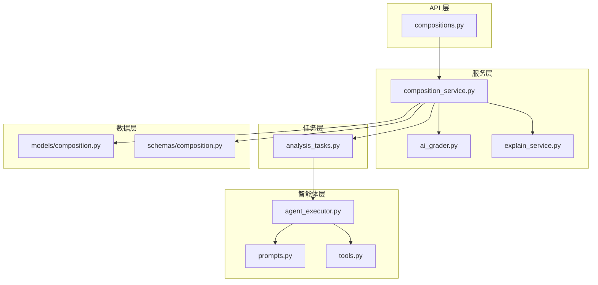
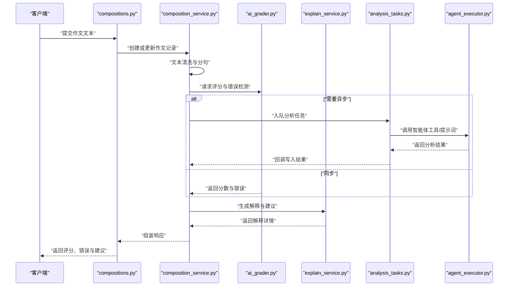
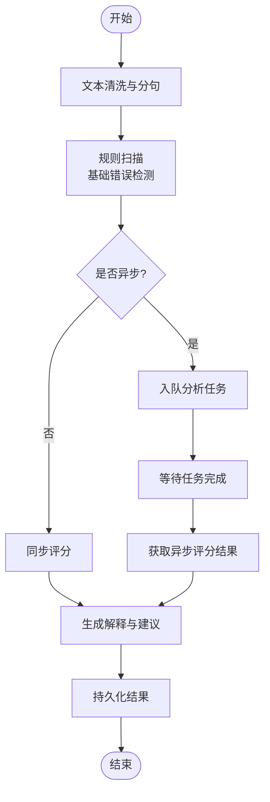
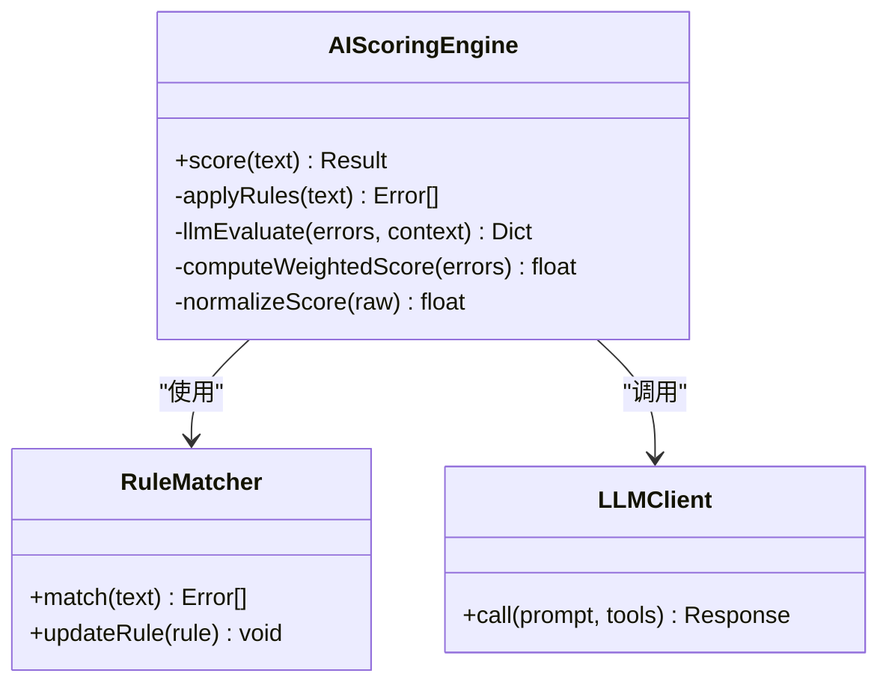
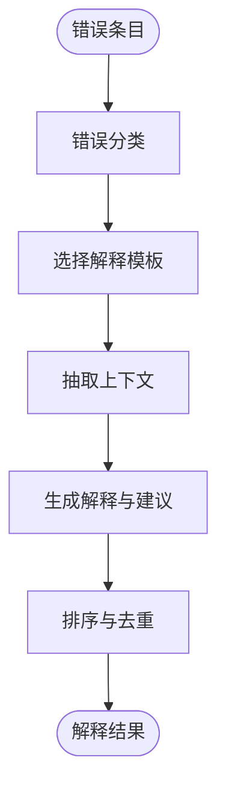
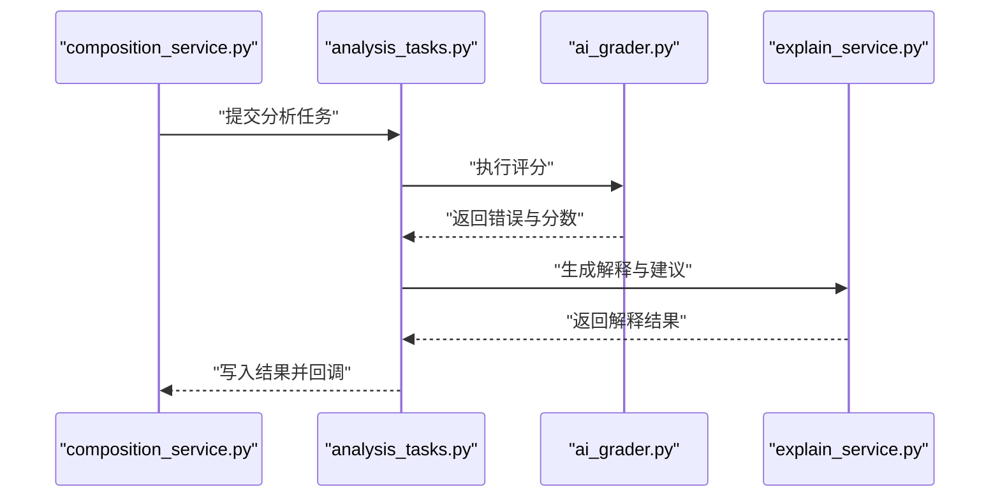
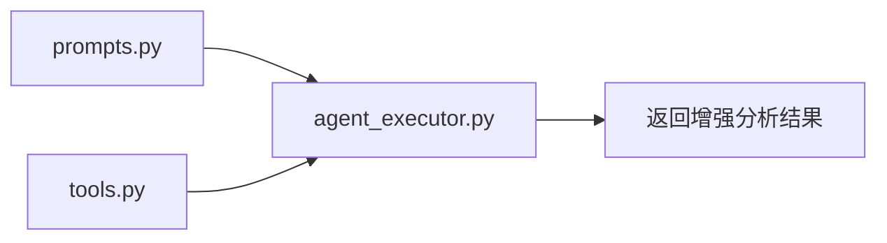
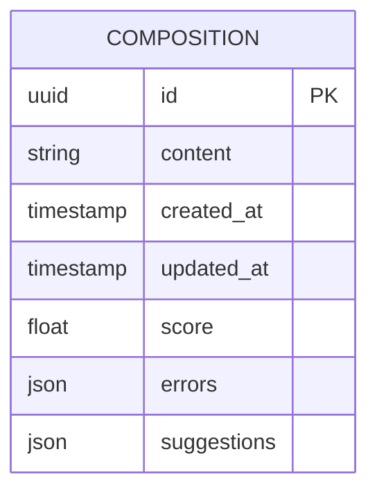
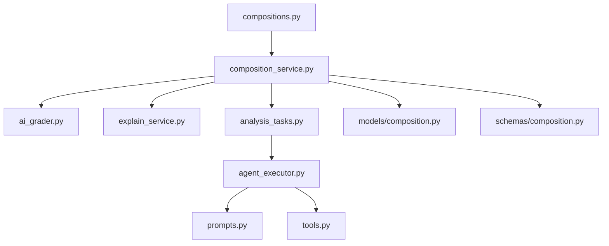

# 语法分析算法

<cite>
**本文引用的文件**   
- [ai_grader.py](file://backend/app/services/ai_grader.py)
- [explain_service.py](file://backend/app/services/explain_service.py)
- [composition_service.py](file://backend/app/services/composition_service.py)
- [composition.py](file://backend/app/models/composition.py)
- [composition.py](file://backend/app/schemas/composition.py)
- [compositions.py](file://backend/app/api/v1/compositions.py)
- [analysis_tasks.py](file://backend/app/tasks/analysis_tasks.py)
- [agent_executor.py](file://backend/app/services/agent/agent_executor.py)
- [prompts.py](file://backend/app/services/agent/prompts.py)
- [tools.py](file://backend/app/services/agent/tools.py)
</cite>

## 目录
1. [简介](#简介)
2. [项目结构](#项目结构)
3. [核心组件](#核心组件)
4. [架构总览](#架构总览)
5. [详细组件分析](#详细组件分析)
6. [依赖关系分析](#依赖关系分析)
7. [性能考量](#性能考量)
8. [故障排查指南](#故障排查指南)
9. [结论](#结论)
10. [附录](#附录)

## 简介
本文件面向开发者，系统化阐述本项目中“英语语法检查”的语法分析算法与实现思路。内容覆盖：
- 自然语言处理技术在英语语法检查中的应用：词性标注、句法分析、语法规则匹配等
- 语法错误检测机制：时态错误、主谓一致、句子结构等常见问题的识别策略
- 语法评分计算方法：错误类型权重分配与严重程度评估
- 纠正建议生成逻辑：错误定位、修正方案推荐与解释说明
- 扩展指南：如何新增语法规则与自定义语法检查器
- 代码示例与测试用例指引（以路径引用为主）

## 项目结构
后端采用分层架构：API 层暴露接口，服务层封装业务逻辑，任务层负责异步分析，Agent 层提供可编排的智能体能力，模型与模式定义数据契约。

图表来源
- [compositions.py](file://backend/app/api/v1/compositions.py)
- [composition_service.py](file://backend/app/services/composition_service.py)
- [ai_grader.py](file://backend/app/services/ai_grader.py)
- [explain_service.py](file://backend/app/services/explain_service.py)
- [analysis_tasks.py](file://backend/app/tasks/analysis_tasks.py)
- [agent_executor.py](file://backend/app/services/agent/agent_executor.py)
- [prompts.py](file://backend/app/services/agent/prompts.py)
- [tools.py](file://backend/app/services/agent/tools.py)
- [composition.py](file://backend/app/models/composition.py)
- [composition.py](file://backend/app/schemas/composition.py)

章节来源
- [compositions.py](file://backend/app/api/v1/compositions.py)
- [composition_service.py](file://backend/app/services/composition_service.py)
- [ai_grader.py](file://backend/app/services/ai_grader.py)
- [explain_service.py](file://backend/app/services/explain_service.py)
- [analysis_tasks.py](file://backend/app/tasks/analysis_tasks.py)
- [agent_executor.py](file://backend/app/services/agent/agent_executor.py)
- [prompts.py](file://backend/app/services/agent/prompts.py)
- [tools.py](file://backend/app/services/agent/tools.py)
- [composition.py](file://backend/app/models/composition.py)
- [composition.py](file://backend/app/schemas/composition.py)

## 核心组件
- 作文服务 composition_service：协调文本预处理、规则校验、AI 评分与解释、结果持久化与返回。
- AI 评分 ai_grader：基于规则与 LLM 的混合评分引擎，输出分数、错误列表与建议。
- 解释服务 explain_service：将错误映射为可读的解释与纠正建议。
- 分析任务 analysis_tasks：异步执行长耗时分析流程，支持进度上报与重试。
- Agent 执行器 agent_executor + prompts + tools：通过提示词与工具调用增强分析与纠错能力。
- 数据模型与模式 models/composition.py 与 schemas/composition.py：定义作文实体与 API 输入输出结构。

章节来源
- [composition_service.py](file://backend/app/services/composition_service.py)
- [ai_grader.py](file://backend/app/services/ai_grader.py)
- [explain_service.py](file://backend/app/services/explain_service.py)
- [analysis_tasks.py](file://backend/app/tasks/analysis_tasks.py)
- [agent_executor.py](file://backend/app/services/agent/agent_executor.py)
- [prompts.py](file://backend/app/services/agent/prompts.py)
- [tools.py](file://backend/app/services/agent/tools.py)
- [composition.py](file://backend/app/models/composition.py)
- [composition.py](file://backend/app/schemas/composition.py)

## 架构总览
整体流程从 API 接收作文文本开始，进入服务层进行预处理与规则扫描，随后触发 AI 评分与解释模块；必要时通过任务队列异步执行，最终返回结构化结果（分数、错误、建议）。

图表来源
- [compositions.py](file://backend/app/api/v1/compositions.py)
- [composition_service.py](file://backend/app/services/composition_service.py)
- [ai_grader.py](file://backend/app/services/ai_grader.py)
- [explain_service.py](file://backend/app/services/explain_service.py)
- [analysis_tasks.py](file://backend/app/tasks/analysis_tasks.py)
- [agent_executor.py](file://backend/app/services/agent/agent_executor.py)

## 详细组件分析

### 作文服务 composition_service
职责
- 编排作文分析全流程：预处理、规则校验、AI 评分、解释生成、结果落库。
- 管理同步/异步执行分支，确保大文本或复杂分析走任务队列。
- 聚合来自不同子系统的结果，形成统一响应结构。

关键流程
- 输入校验与清洗：去除多余空白、标准化标点、按句子切分。
- 规则扫描：调用内置规则集进行初步错误发现。
- 触发评分：根据配置选择同步或异步路径。
- 解释生成：结合错误上下文生成可读说明与修改建议。
- 结果持久化：保存评分、错误与建议到数据库。

图表来源
- [composition_service.py](file://backend/app/services/composition_service.py)
- [analysis_tasks.py](file://backend/app/tasks/analysis_tasks.py)

章节来源
- [composition_service.py](file://backend/app/services/composition_service.py)

### AI 评分 ai_grader
职责
- 综合规则与 LLM 的混合评分：规则用于快速定位高频错误，LLM 用于语义级判断与个性化反馈。
- 输出结构化评分：总分、分项得分、错误清单、建议清单。

评分方法
- 错误类型权重：如时态错误、主谓一致、冠词使用、拼写与标点等，分别赋予不同权重。
- 严重程度评估：依据错误对理解的影响程度分级（轻微/中等/严重），影响扣分幅度。
- 归一化与封顶：将加权错误分映射到目标分数区间，并设置上限与下限。

图表来源
- [ai_grader.py](file://backend/app/services/ai_grader.py)

章节来源
- [ai_grader.py](file://backend/app/services/ai_grader.py)

### 解释服务 explain_service
职责
- 将机器可读的错误信息转换为人类可读的解释与纠正建议。
- 提供错误定位（句子、位置）、原因说明、修改建议与示例。

生成逻辑
- 错误分类映射：将错误类型映射到解释模板。
- 上下文抽取：提取错误前后文，辅助生成更准确的建议。
- 多候选建议：提供多个修正方案，并按适用性与置信度排序。

图表来源
- [explain_service.py](file://backend/app/services/explain_service.py)

章节来源
- [explain_service.py](file://backend/app/services/explain_service.py)

### 分析任务 analysis_tasks
职责
- 异步执行长耗时分析流程，避免阻塞 API 响应。
- 支持进度上报、失败重试与结果回写。

执行要点
- 任务入队：由服务层根据文本长度或复杂度决定。
- 任务执行：调用评分与解释服务，必要时借助 Agent 工具。
- 结果回写：将评分与解释写入数据库，并通知前端进度。

图表来源
- [analysis_tasks.py](file://backend/app/tasks/analysis_tasks.py)
- [composition_service.py](file://backend/app/services/composition_service.py)
- [ai_grader.py](file://backend/app/services/ai_grader.py)
- [explain_service.py](file://backend/app/services/explain_service.py)

章节来源
- [analysis_tasks.py](file://backend/app/tasks/analysis_tasks.py)

### 智能体层 agent_executor / prompts / tools
职责
- 通过提示词工程与工具调用增强分析与纠错能力。
- 支持动态加载外部工具（如词典、语料库、规则库）以提升准确性。

交互方式
- 提示词：定义分析目标、约束与输出格式。
- 工具：提供具体能力（如检索、替换、验证）。
- 执行器：编排提示词与工具的调用顺序与条件分支。

图表来源
- [agent_executor.py](file://backend/app/services/agent/agent_executor.py)
- [prompts.py](file://backend/app/services/agent/prompts.py)
- [tools.py](file://backend/app/services/agent/tools.py)

章节来源
- [agent_executor.py](file://backend/app/services/agent/agent_executor.py)
- [prompts.py](file://backend/app/services/agent/prompts.py)
- [tools.py](file://backend/app/services/agent/tools.py)

### 数据模型与模式 models/composition.py / schemas/composition.py
职责
- 定义作文实体的字段、关系与约束。
- 定义 API 请求与响应的数据结构，保证前后端一致性。

关键字段（概念性描述）
- 文本内容与元数据（作者、时间戳、版本）
- 评分结果（总分、分项分、错误计数）
- 错误与建议列表（类型、位置、建议文本）

图表来源
- [composition.py](file://backend/app/models/composition.py)
- [composition.py](file://backend/app/schemas/composition.py)

章节来源
- [composition.py](file://backend/app/models/composition.py)
- [composition.py](file://backend/app/schemas/composition.py)

## 依赖关系分析
- 低耦合高内聚：服务层通过接口调用评分与解释模块，任务层解耦长耗时操作。
- 可扩展点：规则匹配器与 LLM 客户端作为独立组件，便于替换与升级。
- 外部依赖：数据库持久化、消息队列（任务）、LLM 服务（可选）。

图表来源
- [compositions.py](file://backend/app/api/v1/compositions.py)
- [composition_service.py](file://backend/app/services/composition_service.py)
- [ai_grader.py](file://backend/app/services/ai_grader.py)
- [explain_service.py](file://backend/app/services/explain_service.py)
- [analysis_tasks.py](file://backend/app/tasks/analysis_tasks.py)
- [agent_executor.py](file://backend/app/services/agent/agent_executor.py)
- [prompts.py](file://backend/app/services/agent/prompts.py)
- [tools.py](file://backend/app/services/agent/tools.py)
- [composition.py](file://backend/app/models/composition.py)
- [composition.py](file://backend/app/schemas/composition.py)

章节来源
- [compositions.py](file://backend/app/api/v1/compositions.py)
- [composition_service.py](file://backend/app/services/composition_service.py)
- [ai_grader.py](file://backend/app/services/ai_grader.py)
- [explain_service.py](file://backend/app/services/explain_service.py)
- [analysis_tasks.py](file://backend/app/tasks/analysis_tasks.py)
- [agent_executor.py](file://backend/app/services/agent/agent_executor.py)
- [prompts.py](file://backend/app/services/agent/prompts.py)
- [tools.py](file://backend/app/services/agent/tools.py)
- [composition.py](file://backend/app/models/composition.py)
- [composition.py](file://backend/app/schemas/composition.py)

## 性能考量
- 文本预处理优化：分句与清洗尽量在内存中进行，避免频繁 IO。
- 规则匹配并行化：对长文本可分块并行扫描，合并结果后去重。
- 异步任务：大文本或复杂分析走任务队列，减少 API 延迟。
- LLM 调用节流：缓存相似文本的分析结果，降低重复请求。
- 结果分页与增量更新：仅返回必要字段，支持后续增量补充。

[本节为通用指导，不直接分析具体文件]

## 故障排查指南
常见问题与定位
- 规则未命中：检查规则库加载与正则表达式有效性。
- LLM 超时或异常：查看网络状态与限流策略，增加重试与降级逻辑。
- 任务堆积：监控队列长度与消费者数量，扩容工作进程。
- 结果不一致：确认随机种子与提示词版本，固定环境参数。

建议措施
- 增加日志与追踪：记录关键步骤输入输出，便于回溯。
- 单元测试覆盖：针对规则匹配、评分计算与解释生成编写用例。
- 回归测试：使用标准语料集定期评估准确率与召回率。

章节来源
- [analysis_tasks.py](file://backend/app/tasks/analysis_tasks.py)
- [ai_grader.py](file://backend/app/services/ai_grader.py)
- [explain_service.py](file://backend/app/services/explain_service.py)

## 结论
本项目通过“规则+LLM”的混合架构实现了较为完善的英语语法检查能力。服务层编排清晰，任务层解耦长耗时操作，智能体层提供可扩展的工具与提示词能力。未来可在规则库丰富度、LLM 质量与性能优化方面持续迭代，进一步提升准确率与用户体验。

[本节为总结性内容，不直接分析具体文件]

## 附录

### 语法错误检测机制（技术要点）
- 词性标注与句法分析：用于识别动词短语、名词短语、从句边界，辅助主谓一致与时态判断。
- 语法规则匹配：基于正则与依存关系的规则集合，覆盖高频错误场景。
- 时态错误检测：对比上下文时态标记与动词形态，识别不一致。
- 主谓一致检测：比较主语与谓语的人称与数，识别不一致。
- 句子结构检测：识别残缺句、粘连句、冗余修饰等结构性问题。

[本节为概念性说明，不直接分析具体文件]

### 语法评分计算方法
- 错误类型权重：为不同错误类型设定权重系数。
- 严重程度评估：根据错误对理解的影响划分等级，调整扣分幅度。
- 归一化映射：将加权错误分映射到目标分数区间，设置上下限。
- 分项得分：按维度（语法、词汇、连贯性等）给出细粒度分数。

[本节为概念性说明，不直接分析具体文件]

### 纠正建议生成逻辑
- 错误定位：精确定位到句子与字符范围。
- 修正方案推荐：提供多种修正选项，按适用性与置信度排序。
- 解释说明：用自然语言解释错误原因与修改理由。

[本节为概念性说明，不直接分析具体文件]

### 扩展指南：新增语法规则与自定义检查器
- 新增规则
  - 在规则匹配器中添加新规则定义（类型、正则/依存条件、权重、严重级别）。
  - 更新规则注册表，确保被扫描器加载。
- 自定义检查器
  - 实现检查器接口（输入文本，输出错误列表）。
  - 在服务层注册检查器，参与评分与解释流程。
- 测试用例
  - 准备正负样本语料，覆盖边界情况。
  - 编写单元测试断言错误检出与建议正确性。
  - 集成测试验证端到端流程与性能指标。

[本节为概念性说明，不直接分析具体文件]

### 代码示例与测试用例指引（路径引用）
- 规则匹配与评分入口参考：
  - [ai_grader.py](file://backend/app/services/ai_grader.py)
- 解释与建议生成参考：
  - [explain_service.py](file://backend/app/services/explain_service.py)
- 服务编排与异步任务参考：
  - [composition_service.py](file://backend/app/services/composition_service.py)
  - [analysis_tasks.py](file://backend/app/tasks/analysis_tasks.py)
- 智能体工具与提示词参考：
  - [agent_executor.py](file://backend/app/services/agent/agent_executor.py)
  - [prompts.py](file://backend/app/services/agent/prompts.py)
  - [tools.py](file://backend/app/services/agent/tools.py)
- 数据模型与模式参考：
  - [composition.py](file://backend/app/models/composition.py)
  - [composition.py](file://backend/app/schemas/composition.py)

[本节为路径引用，不直接分析具体文件]