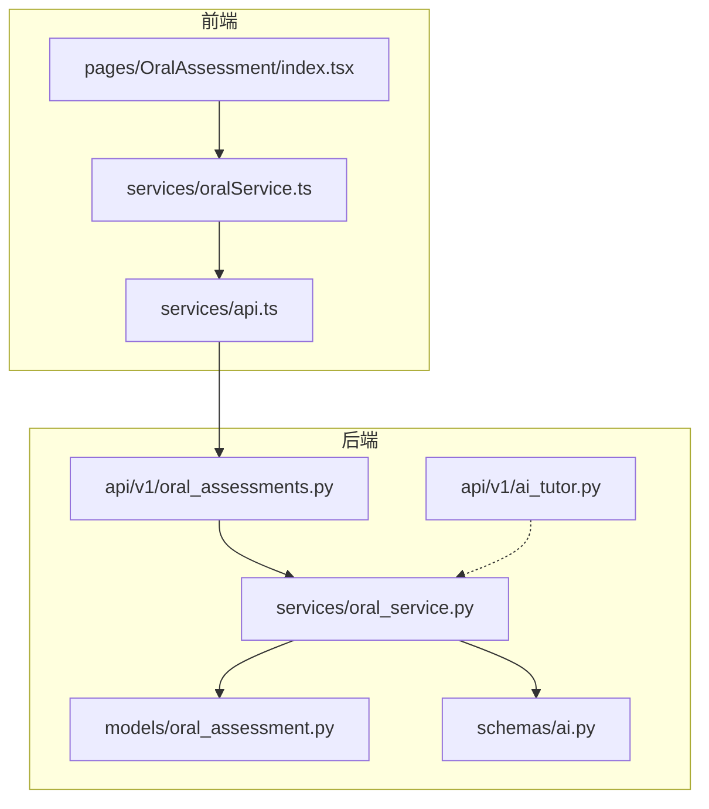
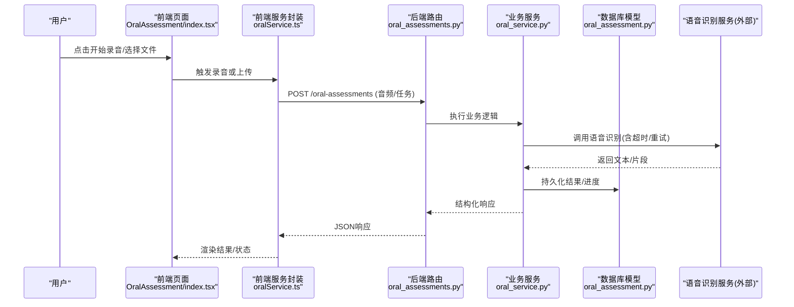
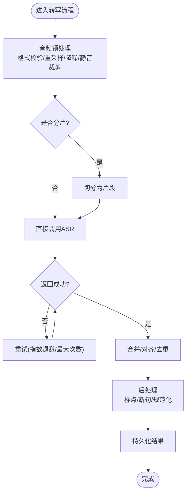
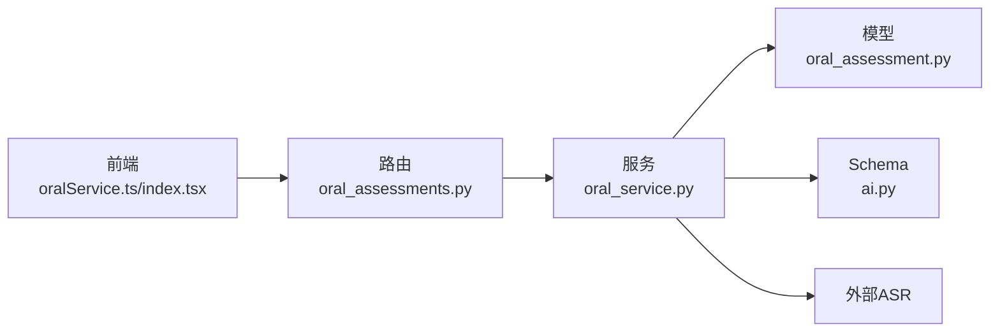

# 语音处理模块

<cite>
**本文引用的文件**   
- [oral_service.py](file://backend/app/services/oral_service.py)
- [oral_assessments.py](file://backend/app/api/v1/oral_assessments.py)
- [oral_assessment.py](file://backend/app/models/oral_assessment.py)
- [ai.py](file://backend/app/schemas/ai.py)
- [ai_tutor.py](file://backend/app/api/v1/ai_tutor.py)
- [api.ts](file://frontend/src/services/api.ts)
- [oralService.ts](file://frontend/src/services/oralService.ts)
- [index.tsx](file://frontend/src/pages/OralAssessment/index.tsx)
</cite>

## 目录
1. [简介](#简介)
2. [项目结构](#项目结构)
3. [核心组件](#核心组件)
4. [架构总览](#架构总览)
5. [详细组件分析](#详细组件分析)
6. [依赖关系分析](#依赖关系分析)
7. [性能考虑](#性能考虑)
8. [故障排查指南](#故障排查指南)
9. [结论](#结论)
10. [附录](#附录)

## 简介
本文件面向开发者，系统化梳理“语音处理模块”的实现与集成方式。内容覆盖：
- 音频格式处理与转换（支持的格式、采样率、压缩策略）
- 语音识别引擎集成（API调用流程、错误处理、超时重试）
- 实时录音能力（Web Audio API、麦克风权限、流式捕获）
- 音频预处理（降噪、音量标准化、静音检测）
- 音频文件上传与下载
- 如何接入不同语音识别服务与自定义处理管道

说明：当前仓库未包含前端浏览器端录音实现代码；本节提供基于通用实践的设计与对接建议，并在后端接口层面给出可落地的集成点。

## 项目结构
与语音处理相关的后端主要位于 services、api、models、schemas 等目录；前端相关页面与服务封装位于 pages 与 services 目录。

图表来源
- [oral_service.py](file://backend/app/services/oral_service.py)
- [oral_assessments.py](file://backend/app/api/v1/oral_assessments.py)
- [oral_assessment.py](file://backend/app/models/oral_assessment.py)
- [ai.py](file://backend/app/schemas/ai.py)
- [ai_tutor.py](file://backend/app/api/v1/ai_tutor.py)
- [index.tsx](file://frontend/src/pages/OralAssessment/index.tsx)
- [oralService.ts](file://frontend/src/services/oralService.ts)
- [api.ts](file://frontend/src/services/api.ts)

章节来源
- [oral_service.py](file://backend/app/services/oral_service.py)
- [oral_assessments.py](file://backend/app/api/v1/oral_assessments.py)
- [oral_assessment.py](file://backend/app/models/oral_assessment.py)
- [ai.py](file://backend/app/schemas/ai.py)
- [ai_tutor.py](file://backend/app/api/v1/ai_tutor.py)
- [index.tsx](file://frontend/src/pages/OralAssessment/index.tsx)
- [oralService.ts](file://frontend/src/services/oralService.ts)
- [api.ts](file://frontend/src/services/api.ts)

## 核心组件
- 口语评估服务（后端）
  - 负责接收音频数据、执行预处理、调用外部语音识别或内部转写逻辑、持久化结果并返回结构化响应。
- 口语评估路由（后端）
  - 暴露REST接口，承载上传、查询、状态管理等HTTP语义。
- 模型与Schema
  - 定义数据库实体与请求/响应数据结构，确保前后端契约一致。
- 前端口语评测页面与服务封装
  - 提供用户交互入口，封装对后端的调用，管理录音与上传流程。

章节来源
- [oral_service.py](file://backend/app/services/oral_service.py)
- [oral_assessments.py](file://backend/app/api/v1/oral_assessments.py)
- [oral_assessment.py](file://backend/app/models/oral_assessment.py)
- [ai.py](file://backend/app/schemas/ai.py)
- [index.tsx](file://frontend/src/pages/OralAssessment/index.tsx)
- [oralService.ts](file://frontend/src/services/oralService.ts)

## 架构总览
整体采用“前端页面 -> 前端服务封装 -> 后端路由 -> 业务服务 -> 模型/Schema”的分层架构。语音识别作为外部依赖通过服务层解耦，便于替换不同厂商的SDK或本地引擎。

图表来源
- [oral_assessments.py](file://backend/app/api/v1/oral_assessments.py)
- [oral_service.py](file://backend/app/services/oral_service.py)
- [oral_assessment.py](file://backend/app/models/oral_assessment.py)
- [index.tsx](file://frontend/src/pages/OralAssessment/index.tsx)
- [oralService.ts](file://frontend/src/services/oralService.ts)

## 详细组件分析

### 后端：口语评估服务（oral_service.py）
职责
- 统一编排音频预处理、转写、评分与结果聚合。
- 管理外部ASR调用的超时、重试与错误分类。
- 将中间态与最终结果写入持久化存储。

关键设计点
- 输入校验与格式归一化：在调用ASR前进行格式检查与必要的重采样。
- 异步任务：长耗时转写建议走异步队列，避免阻塞请求。
- 幂等与去抖：同一任务ID多次提交应返回相同结果。
- 指标与日志：记录耗时、失败原因、重试次数，便于排障。

章节来源
- [oral_service.py](file://backend/app/services/oral_service.py)

### 后端：口语评估路由（oral_assessments.py）
职责
- 定义REST接口：上传音频、创建转写任务、查询进度与结果、删除等。
- 参数校验、鉴权、限流与错误码映射。

接口约定（示例）
- POST /api/v1/oral-assessments/upload：上传音频文件，返回任务ID。
- GET /api/v1/oral-assessments/{task_id}：查询任务状态与结果。
- DELETE /api/v1/oral-assessments/{task_id}：清理临时文件与记录。

章节来源
- [oral_assessments.py](file://backend/app/api/v1/oral_assessments.py)

### 数据模型与Schema（oral_assessment.py, ai.py）
- 模型字段建议包含：任务ID、用户ID、音频路径/URL、原始格式、采样率、转写文本、分段信息、评分、状态、时间戳等。
- Schema用于约束请求/响应体，保证前后端一致性。

章节来源
- [oral_assessment.py](file://backend/app/models/oral_assessment.py)
- [ai.py](file://backend/app/schemas/ai.py)

### 前端：口语评测页面与服务封装（index.tsx, oralService.ts, api.ts）
- 页面负责UI与交互，服务封装负责网络请求、错误提示与重试策略。
- 若需要实时录音，可在页面中集成Web Audio API与MediaRecorder，按固定时长切片上传或走WebSocket推送。

章节来源
- [index.tsx](file://frontend/src/pages/OralAssessment/index.tsx)
- [oralService.ts](file://frontend/src/services/oralService.ts)
- [api.ts](file://frontend/src/services/api.ts)

### 语音识别引擎集成（外部服务）
- 支持多厂商SDK或本地引擎，通过服务层抽象接口，便于切换。
- 典型流程：预处理 -> 分片/拼接 -> 调用ASR -> 合并结果 -> 后处理（标点、断句）。

图表来源
- [oral_service.py](file://backend/app/services/oral_service.py)

章节来源
- [oral_service.py](file://backend/app/services/oral_service.py)

### 实时录音功能（Web Audio API）
说明：当前仓库未包含前端录音实现代码。以下为推荐实现要点，供集成参考：
- 权限管理
  - 使用 navigator.mediaDevices.getUserMedia 获取麦克风权限，处理拒绝与异常。
- 音频流捕获
  - 使用 MediaRecorder 录制为 WebM/OGG/MP4 等容器，或基于 AudioWorklet 做低延迟处理。
- 流式传输
  - 短轮询：定时上传已录片段至后端。
  - WebSocket：建立双向通道，边录边传，服务端流式转写并回推增量文本。
- 错误与恢复
  - 监听中断事件，自动重连与续录；记录错误日志与上报。

章节来源
- [index.tsx](file://frontend/src/pages/OralAssessment/index.tsx)
- [oralService.ts](file://frontend/src/services/oralService.ts)

### 音频格式处理与转换机制
- 支持的常见格式
  - 输入：WAV、MP3、AAC、FLAC、OGG、WebM（视浏览器与后端解码库而定）。
  - 输出：WAV（无损）、MP3/AAC（有损压缩）、OPUS（适合实时）。
- 采样率设置
  - 推荐：16kHz（ASR常用）、44.1kHz（高保真回放）。
  - 重采样策略：先降采样再降噪，减少计算量。
- 压缩算法
  - 有损：MP3/AAC/Opus，权衡音质与体积。
  - 无损：FLAC/WAV，适合离线精修。
- 元数据处理
  - 保留采样率、声道数、时长、编码器等元信息，便于后续分析与审计。

章节来源
- [oral_service.py](file://backend/app/services/oral_service.py)

### 音频预处理技术
- 降噪
  - 频谱减法、维纳滤波、深度学习降噪（如RNNoise），在低信噪比环境下提升识别率。
- 音量标准化
  - RMS/LUFS归一化，避免过响或过小导致ASR误判。
- 静音检测与裁剪
  - 基于能量阈值或VAD（Voice Activity Detection）剔除静音段，缩短转写时长。
- 端点检测（E2E）
  - 结合VAD与停顿检测，合理切分句子边界，提高可读性。

章节来源
- [oral_service.py](file://backend/app/services/oral_service.py)

### 音频文件上传与下载
- 上传
  - 表单/分块上传，限制大小与类型，服务端校验MIME与魔数。
  - 生成唯一文件名与路径，保存至对象存储或本地磁盘。
- 下载
  - 提供受保护的下载链接，支持范围请求与断点续传。
- 生命周期
  - 临时文件定期清理，归档到冷存储。

章节来源
- [oral_assessments.py](file://backend/app/api/v1/oral_assessments.py)
- [oral_service.py](file://backend/app/services/oral_service.py)

### 错误处理与超时重试机制
- 超时
  - 客户端与服务器均设置合理超时；大文件启用分块与心跳。
- 重试
  - 指数退避+抖动，限定最大重试次数；区分可重试与不可重试错误。
- 降级
  - 主ASR失败时切换到备用引擎或排队等待。
- 可观测性
  - 记录错误码、堆栈、上下文（任务ID、文件大小、采样率等）。

章节来源
- [oral_service.py](file://backend/app/services/oral_service.py)

### 与AI助教服务的协作（可选）
- 可将转写文本送入AI助教服务进行点评、纠错或生成学习建议。
- 通过独立API调用，避免耦合转写与教学逻辑。

章节来源
- [ai_tutor.py](file://backend/app/api/v1/ai_tutor.py)

## 依赖关系分析
- 组件内聚
  - 服务层集中了ASR调用、预处理与持久化，内聚度高。
- 外部依赖
  - 语音识别SDK/HTTP服务、对象存储、消息队列（可选）。
- 潜在循环依赖
  - 路由仅依赖服务层，服务层不反向依赖路由，避免循环。

图表来源
- [oral_assessments.py](file://backend/app/api/v1/oral_assessments.py)
- [oral_service.py](file://backend/app/services/oral_service.py)
- [oral_assessment.py](file://backend/app/models/oral_assessment.py)
- [ai.py](file://backend/app/schemas/ai.py)
- [oralService.ts](file://frontend/src/services/oralService.ts)
- [index.tsx](file://frontend/src/pages/OralAssessment/index.tsx)

章节来源
- [oral_assessments.py](file://backend/app/api/v1/oral_assessments.py)
- [oral_service.py](file://backend/app/services/oral_service.py)
- [oral_assessment.py](file://backend/app/models/oral_assessment.py)
- [ai.py](file://backend/app/schemas/ai.py)
- [oralService.ts](file://frontend/src/services/oralService.ts)
- [index.tsx](file://frontend/src/pages/OralAssessment/index.tsx)

## 性能考虑
- 预处理优化
  - 优先降采样与静音裁剪，降低ASR输入规模。
  - 批量并行处理多个片段，充分利用CPU/GPU。
- 传输优化
  - 使用分块上传与断点续传；必要时启用压缩传输。
- 缓存与复用
  - 对相同音频指纹的结果进行缓存，避免重复转写。
- 资源隔离
  - 将转写任务放入独立进程/容器，避免影响主服务。

[本节为通用指导，无需源码引用]

## 故障排查指南
- 常见问题
  - 麦克风权限被拒：检查浏览器安全上下文（HTTPS）与用户授权。
  - 上传失败：核对文件大小、类型、网络稳定性与后端限流。
  - 转写超时：检查ASR服务健康度、网络延迟与重试配置。
- 定位手段
  - 查看任务ID关联日志，确认各阶段耗时与错误码。
  - 对比输入音频元信息与预处理参数，验证是否符合ASR要求。
- 恢复策略
  - 自动重试与降级；失败任务入队补偿消费。

章节来源
- [oral_service.py](file://backend/app/services/oral_service.py)
- [oral_assessments.py](file://backend/app/api/v1/oral_assessments.py)

## 结论
本模块以清晰的分层与解耦设计，将音频处理、转写与结果持久化整合在一起，并通过服务层屏蔽外部ASR差异，便于扩展与替换。建议在工程实践中完善监控告警、灰度发布与容量规划，持续提升稳定性与用户体验。

[本节为总结性内容，无需源码引用]

## 附录
- 集成不同语音识别服务
  - 在服务层定义统一接口，按厂商实现适配器；通过配置开关切换。
- 自定义音频处理管道
  - 以插件化方式注册降噪、VAD、标准化等节点，支持动态编排。
- 前端实时录音最佳实践
  - 使用稳定的容器格式（如WebM/OGG），控制片段时长（如2-5秒），配合WebSocket回推增量文本。

[本节为补充说明，无需源码引用]