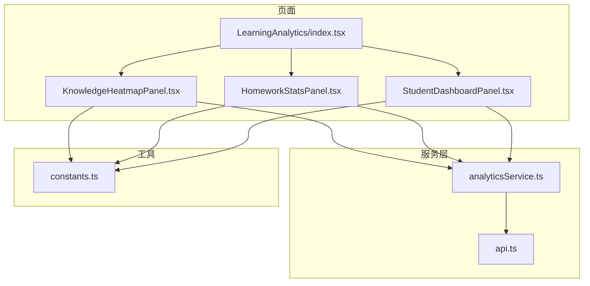
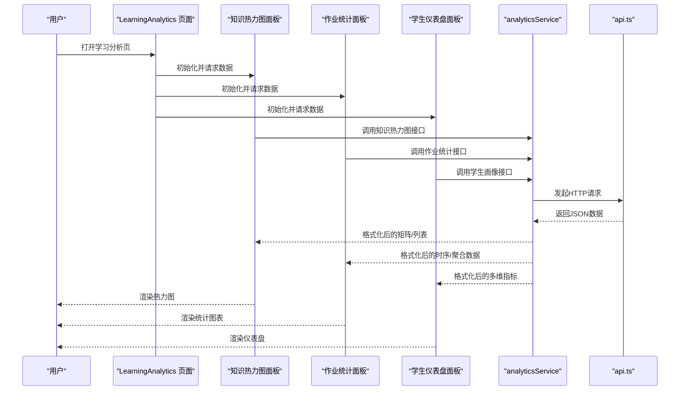
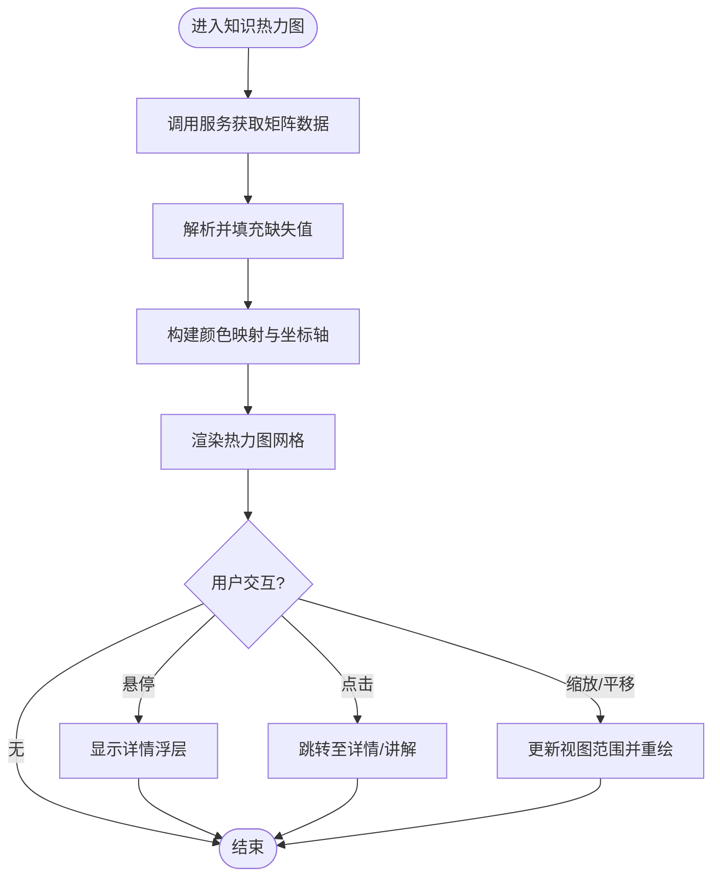
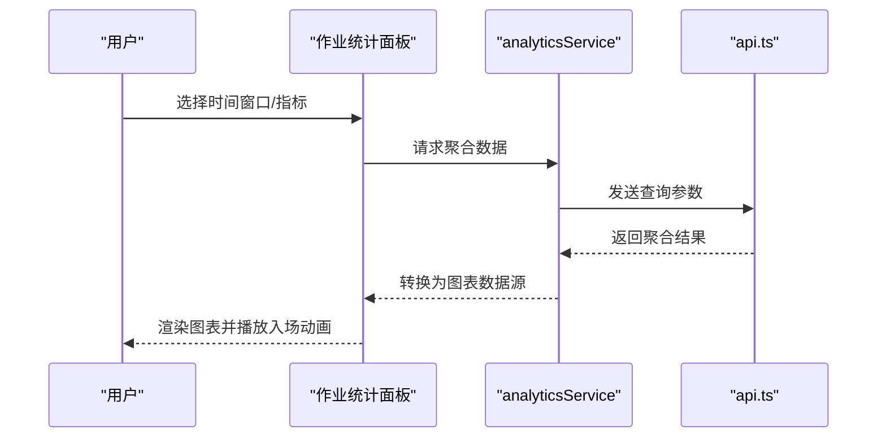
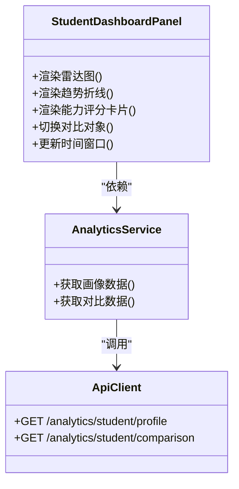
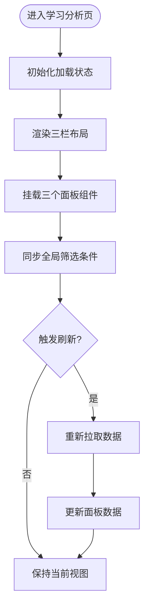
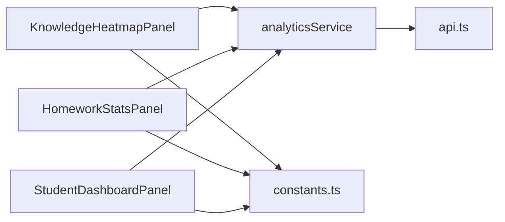

# 可视化展示

<cite>
**本文引用的文件**   
- [LearningAnalytics/index.tsx](file://frontend/src/pages/LearningAnalytics/index.tsx)
- [KnowledgeHeatmapPanel.tsx](file://frontend/src/pages/LearningAnalytics/KnowledgeHeatmapPanel.tsx)
- [HomeworkStatsPanel.tsx](file://frontend/src/pages/LearningAnalytics/HomeworkStatsPanel.tsx)
- [StudentDashboardPanel.tsx](file://frontend/src/pages/LearningAnalytics/StudentDashboardPanel.tsx)
- [analyticsService.ts](file://frontend/src/services/analyticsService.ts)
- [api.ts](file://frontend/src/services/api.ts)
- [constants.ts](file://frontend/src/utils/constants.ts)
</cite>

## 目录
1. [简介](#简介)
2. [项目结构](#项目结构)
3. [核心组件](#核心组件)
4. [架构总览](#架构总览)
5. [详细组件分析](#详细组件分析)
6. [依赖关系分析](#依赖关系分析)
7. [性能考虑](#性能考虑)
8. [故障排查指南](#故障排查指南)
9. [结论](#结论)
10. [附录](#附录)

## 简介
本章节面向学习分析平台的“可视化展示模块”，聚焦以下目标：
- 知识热力图、作业统计面板、学生仪表盘等核心可视化组件的设计与实现
- 数据到可视化的映射：数据格式转换、图表配置项、交互行为
- 响应式布局与移动端适配方案
- 动画效果与用户体验优化
- 自定义图表组件开发方法与集成指南
- 数据实时更新与动态刷新机制
- 大数据量渲染与性能优化最佳实践

## 项目结构
可视化模块位于前端页面 LearningAnalytics 下，包含三个主要面板组件以及一个聚合入口。服务层通过 analyticsService 统一对接后端 API，使用 api.ts 提供的 HTTP 客户端进行请求封装。常量定义在 constants.ts 中，便于统一主题色、阈值与默认配置。

图示来源
- [LearningAnalytics/index.tsx](file://frontend/src/pages/LearningAnalytics/index.tsx)
- [KnowledgeHeatmapPanel.tsx](file://frontend/src/pages/LearningAnalytics/KnowledgeHeatmapPanel.tsx)
- [HomeworkStatsPanel.tsx](file://frontend/src/pages/LearningAnalytics/HomeworkStatsPanel.tsx)
- [StudentDashboardPanel.tsx](file://frontend/src/pages/LearningAnalytics/StudentDashboardPanel.tsx)
- [analyticsService.ts](file://frontend/src/services/analyticsService.ts)
- [api.ts](file://frontend/src/services/api.ts)
- [constants.ts](file://frontend/src/utils/constants.ts)

章节来源
- [LearningAnalytics/index.tsx](file://frontend/src/pages/LearningAnalytics/index.tsx)
- [KnowledgeHeatmapPanel.tsx](file://frontend/src/pages/LearningAnalytics/KnowledgeHeatmapPanel.tsx)
- [HomeworkStatsPanel.tsx](file://frontend/src/pages/LearningAnalytics/HomeworkStatsPanel.tsx)
- [StudentDashboardPanel.tsx](file://frontend/src/pages/LearningAnalytics/StudentDashboardPanel.tsx)
- [analyticsService.ts](file://frontend/src/services/analyticsService.ts)
- [api.ts](file://frontend/src/services/api.ts)
- [constants.ts](file://frontend/src/utils/constants.ts)

## 核心组件
- 知识热力图（KnowledgeHeatmapPanel）
  - 用途：以网格形式呈现知识点掌握度或错误密度，支持按时间维度筛选与点击钻取
  - 数据模型：二维矩阵（行=知识点/题目类型，列=时间段），值域为掌握度或错误率
  - 交互：悬停提示详情、点击跳转错题详情、缩放与平移
- 作业统计面板（HomeworkStatsPanel）
  - 用途：汇总作业提交量、正确率、用时分布、班级对比等
  - 数据模型：时间序列与分类聚合（如按题型/难度）
  - 交互：多指标切换、区间选择、导出报表
- 学生仪表盘（StudentDashboardPanel）
  - 用途：个人学习画像，包括趋势折线、雷达图、能力维度评分
  - 数据模型：多维指标向量与历史轨迹
  - 交互：维度选择、时间窗口调整、对比模式

章节来源
- [KnowledgeHeatmapPanel.tsx](file://frontend/src/pages/LearningAnalytics/KnowledgeHeatmapPanel.tsx)
- [HomeworkStatsPanel.tsx](file://frontend/src/pages/LearningAnalytics/HomeworkStatsPanel.tsx)
- [StudentDashboardPanel.tsx](file://frontend/src/pages/LearningAnalytics/StudentDashboardPanel.tsx)

## 架构总览
整体采用“页面聚合 + 面板组件 + 服务层”的分层设计。页面负责布局与状态协调，面板组件专注图表渲染与交互，服务层负责数据获取与缓存策略。

图示来源
- [LearningAnalytics/index.tsx](file://frontend/src/pages/LearningAnalytics/index.tsx)
- [KnowledgeHeatmapPanel.tsx](file://frontend/src/pages/LearningAnalytics/KnowledgeHeatmapPanel.tsx)
- [HomeworkStatsPanel.tsx](file://frontend/src/pages/LearningAnalytics/HomeworkStatsPanel.tsx)
- [StudentDashboardPanel.tsx](file://frontend/src/pages/LearningAnalytics/StudentDashboardPanel.tsx)
- [analyticsService.ts](file://frontend/src/services/analyticsService.ts)
- [api.ts](file://frontend/src/services/api.ts)

## 详细组件分析

### 知识热力图（KnowledgeHeatmapPanel）
- 数据到可视化映射
  - 输入：二维矩阵（行=知识点，列=时间片），值=掌握度/错误率
  - 输出：单元格颜色映射、坐标轴标签、图例
  - 转换：将后端原始记录聚合成矩阵；处理缺失值与异常值
- 配置项
  - 颜色标尺（低中高掌握度）、时间粒度（日/周/月）、阈值分段、是否显示数值
- 交互行为
  - 悬停显示详情（知识点名称、时间段、样本量）
  - 点击跳转到错题详情或知识点讲解
  - 缩放和平移以查看细粒度时间切片
- 响应式与移动端适配
  - 小屏自动隐藏部分标签、启用滚动容器
  - 触摸手势支持滑动与双击放大
- 动画与体验优化
  - 首次加载渐入动画、数据更新平滑过渡
  - 懒加载与虚拟滚动减少重绘
- 性能优化
  - 大数据量时采用分块渲染与离屏Canvas
  - 去抖/节流避免频繁重算

图示来源
- [KnowledgeHeatmapPanel.tsx](file://frontend/src/pages/LearningAnalytics/KnowledgeHeatmapPanel.tsx)
- [analyticsService.ts](file://frontend/src/services/analyticsService.ts)
- [api.ts](file://frontend/src/services/api.ts)

章节来源
- [KnowledgeHeatmapPanel.tsx](file://frontend/src/pages/LearningAnalytics/KnowledgeHeatmapPanel.tsx)
- [analyticsService.ts](file://frontend/src/services/analyticsService.ts)
- [api.ts](file://frontend/src/services/api.ts)

### 作业统计面板（HomeworkStatsPanel）
- 数据到可视化映射
  - 输入：提交量、正确率、用时分布、班级对比等聚合结果
  - 输出：柱状/折线/面积图组合，支持多指标切换
- 配置项
  - 指标集合、时间窗口、分组维度（题型/难度）、对比开关
- 交互行为
  - 指标切换、区间选择、排序与过滤
  - 导出为Excel/PDF
- 响应式与移动端适配
  - 图表堆叠自适应、横轴标签旋转、触控拖拽
- 动画与体验优化
  - 数据更新时的增量动画、空态占位与骨架屏
- 性能优化
  - 按需加载数据集、合并多次请求、分页与游标

图示来源
- [HomeworkStatsPanel.tsx](file://frontend/src/pages/LearningAnalytics/HomeworkStatsPanel.tsx)
- [analyticsService.ts](file://frontend/src/services/analyticsService.ts)
- [api.ts](file://frontend/src/services/api.ts)

章节来源
- [HomeworkStatsPanel.tsx](file://frontend/src/pages/LearningAnalytics/HomeworkStatsPanel.tsx)
- [analyticsService.ts](file://frontend/src/services/analyticsService.ts)
- [api.ts](file://frontend/src/services/api.ts)

### 学生仪表盘（StudentDashboardPanel）
- 数据到可视化映射
  - 输入：多维指标向量（如阅读、写作、口语等）、历史轨迹
  - 输出：雷达图、趋势折线、能力评分卡片
- 配置项
  - 维度集合、权重设置、对比对象（同学/班级均值）
- 交互行为
  - 维度勾选、时间跨度调整、对比模式切换
- 响应式与移动端适配
  - 雷达图半径自适应、卡片流式布局
- 动画与体验优化
  - 指标变化时的缓动过渡、关键指标高亮
- 性能优化
  - 缓存最近一次画像数据、增量更新

图示来源
- [StudentDashboardPanel.tsx](file://frontend/src/pages/LearningAnalytics/StudentDashboardPanel.tsx)
- [analyticsService.ts](file://frontend/src/services/analyticsService.ts)
- [api.ts](file://frontend/src/services/api.ts)

章节来源
- [StudentDashboardPanel.tsx](file://frontend/src/pages/LearningAnalytics/StudentDashboardPanel.tsx)
- [analyticsService.ts](file://frontend/src/services/analyticsService.ts)
- [api.ts](file://frontend/src/services/api.ts)

### 页面聚合（LearningAnalytics/index.tsx）
- 职责
  - 组织三个面板的布局与共享状态（如全局时间筛选、主题）
  - 控制加载状态与错误边界
- 交互
  - 全局筛选联动各面板
  - 一键刷新与导出汇总
- 响应式
  - 栅格布局在大屏三列、中屏两列、小屏一列

图示来源
- [LearningAnalytics/index.tsx](file://frontend/src/pages/LearningAnalytics/index.tsx)

章节来源
- [LearningAnalytics/index.tsx](file://frontend/src/pages/LearningAnalytics/index.tsx)

## 依赖关系分析
- 组件耦合
  - 面板组件与服务层松耦合，通过函数式接口传递数据与回调
  - 页面聚合仅管理布局与共享状态，不直接操作图表实例
- 外部依赖
  - analyticsService 统一封装请求与错误处理
  - api.ts 提供基础HTTP客户端与拦截器
  - constants.ts 集中管理主题色、阈值与默认配置

图示来源
- [KnowledgeHeatmapPanel.tsx](file://frontend/src/pages/LearningAnalytics/KnowledgeHeatmapPanel.tsx)
- [HomeworkStatsPanel.tsx](file://frontend/src/pages/LearningAnalytics/HomeworkStatsPanel.tsx)
- [StudentDashboardPanel.tsx](file://frontend/src/pages/LearningAnalytics/StudentDashboardPanel.tsx)
- [analyticsService.ts](file://frontend/src/services/analyticsService.ts)
- [api.ts](file://frontend/src/services/api.ts)
- [constants.ts](file://frontend/src/utils/constants.ts)

章节来源
- [KnowledgeHeatmapPanel.tsx](file://frontend/src/pages/LearningAnalytics/KnowledgeHeatmapPanel.tsx)
- [HomeworkStatsPanel.tsx](file://frontend/src/pages/LearningAnalytics/HomeworkStatsPanel.tsx)
- [StudentDashboardPanel.tsx](file://frontend/src/pages/LearningAnalytics/StudentDashboardPanel.tsx)
- [analyticsService.ts](file://frontend/src/services/analyticsService.ts)
- [api.ts](file://frontend/src/services/api.ts)
- [constants.ts](file://frontend/src/utils/constants.ts)

## 性能考虑
- 大数据量渲染
  - 知识热力图：分块渲染、离屏Canvas、虚拟滚动、降采样
  - 作业统计：分页/游标、增量更新、按需加载
  - 学生仪表盘：缓存画像数据、对比数据懒加载
- 动画与流畅度
  - 使用requestAnimationFrame批量更新
  - 避免在高频事件中创建新对象
- 内存管理
  - 及时销毁图表实例与事件监听
  - 释放大数组引用，避免泄漏
- 网络与缓存
  - 合理设置缓存策略与失效时间
  - 失败重试与退避策略

[本节为通用指导，无需具体文件来源]

## 故障排查指南
- 常见问题
  - 数据为空或字段缺失：检查后端返回结构与前端解析逻辑
  - 图表不渲染：确认容器尺寸与CSS可见性
  - 交互无响应：检查事件绑定与作用域
  - 性能卡顿：定位重绘热点，启用虚拟化与去抖
- 调试建议
  - 在服务层打印请求/响应摘要
  - 在面板组件内添加关键节点日志
  - 使用浏览器性能面板分析帧率与内存占用

章节来源
- [analyticsService.ts](file://frontend/src/services/analyticsService.ts)
- [api.ts](file://frontend/src/services/api.ts)

## 结论
本可视化模块通过清晰的分层与组件化设计，实现了知识热力图、作业统计与学生仪表盘三大核心场景。数据到可视化的映射明确，交互与响应式体验完善，具备可扩展性与可维护性。后续可在实时推送、离线缓存与更丰富的图表类型上持续演进。

[本节为总结性内容，无需具体文件来源]

## 附录
- 自定义图表组件开发方法
  - 定义数据契约与配置接口
  - 封装渲染管线（数据准备→映射→绘制→交互）
  - 提供主题与样式注入点
  - 编写单元测试与示例页面
- 集成指南
  - 在服务层新增接口封装
  - 在页面聚合中注册新面板
  - 在常量中补充主题与阈值
- 实时更新与动态刷新
  - 基于轮询或WebSocket/SSE的增量更新
  - 局部刷新与增量动画
  - 冲突解决与版本戳

[本节为概念性说明，无需具体文件来源]