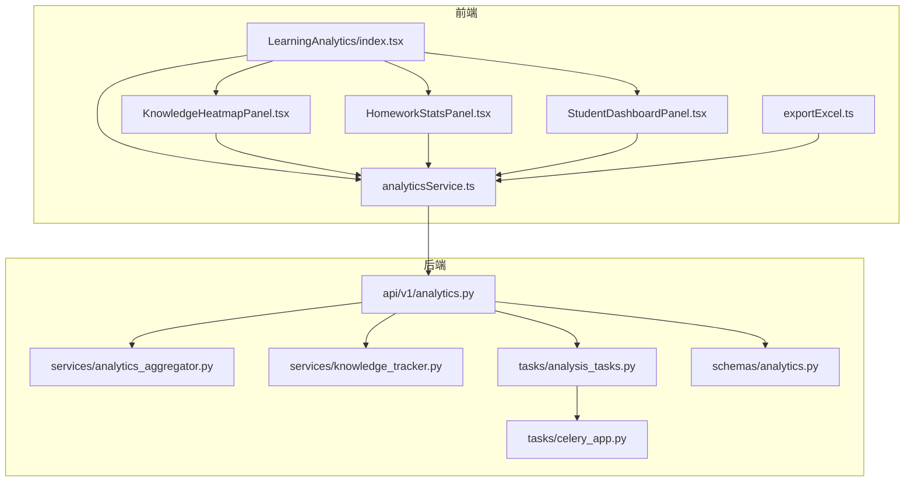
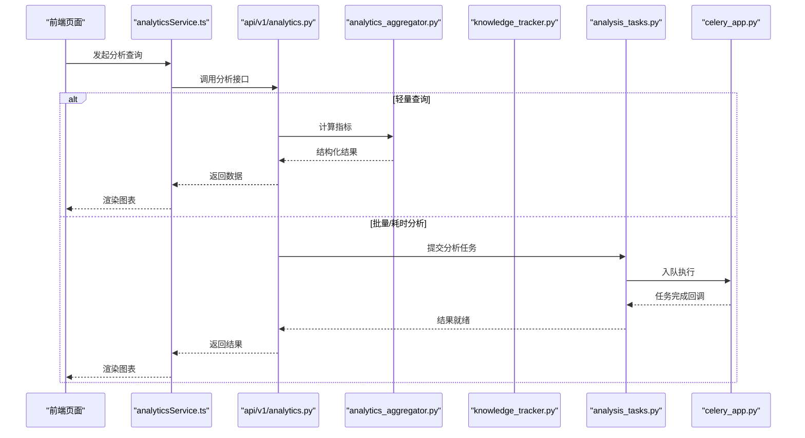
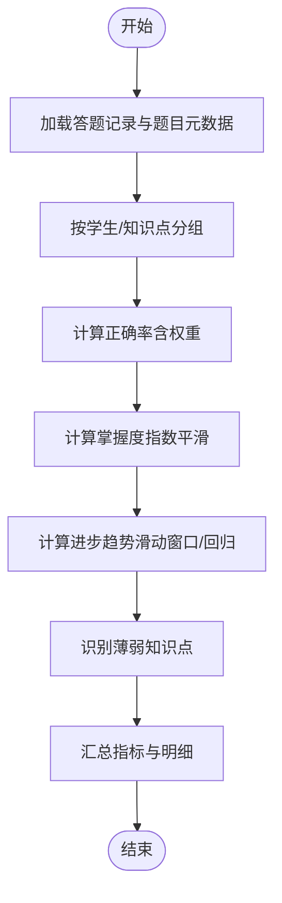
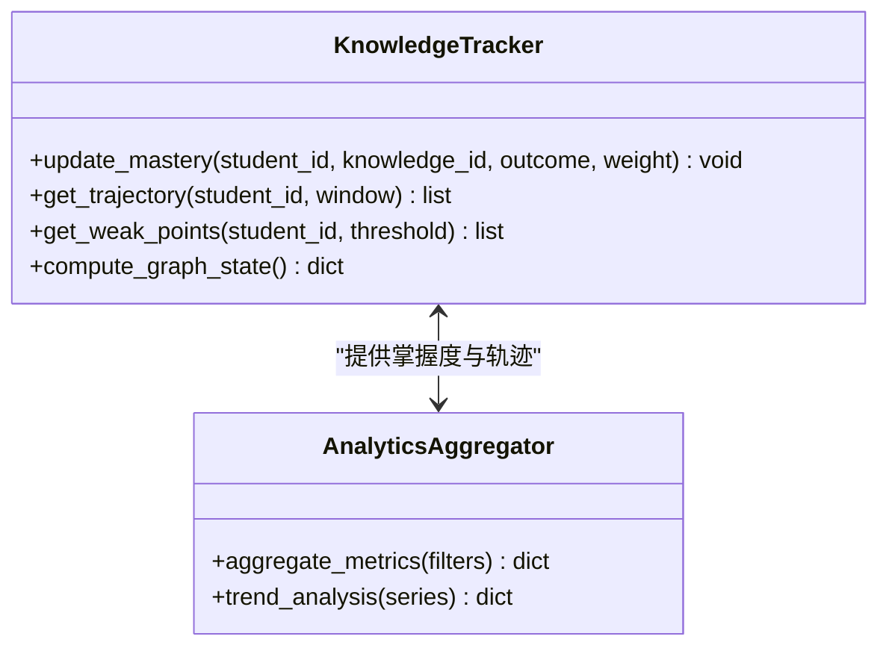
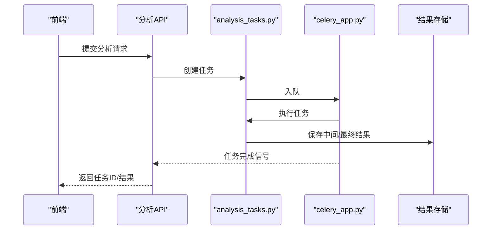
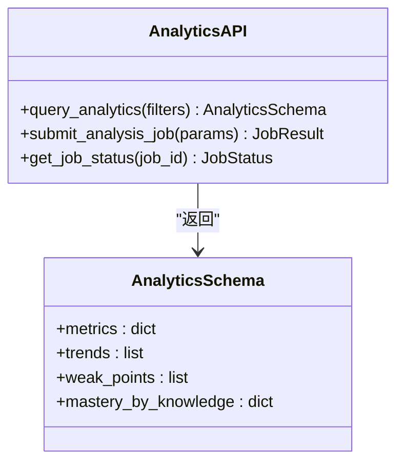
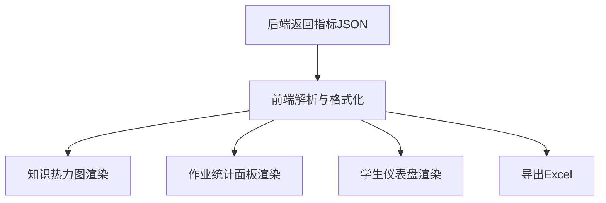
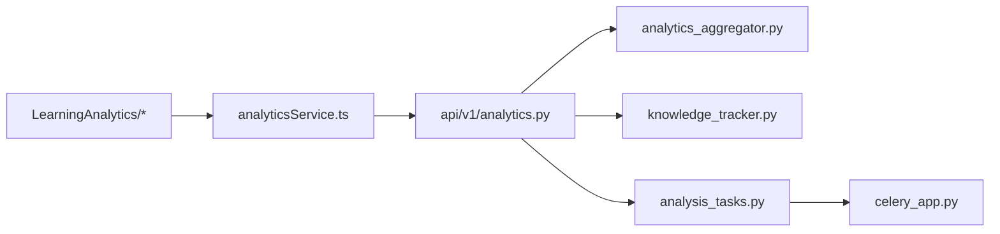

# 学习分析平台

<cite>
**本文引用的文件**   
- [backend/app/api/v1/analytics.py](file://backend/app/api/v1/analytics.py)
- [backend/app/services/analytics_aggregator.py](file://backend/app/services/analytics_aggregator.py)
- [backend/app/tasks/analysis_tasks.py](file://backend/app/tasks/analysis_tasks.py)
- [backend/app/tasks/celery_app.py](file://backend/app/tasks/celery_app.py)
- [backend/app/services/knowledge_tracker.py](file://backend/app/services/knowledge_tracker.py)
- [backend/app/schemas/analytics.py](file://backend/app/schemas/analytics.py)
- [frontend/src/pages/LearningAnalytics/index.tsx](file://frontend/src/pages/LearningAnalytics/index.tsx)
- [frontend/src/pages/LearningAnalytics/KnowledgeHeatmapPanel.tsx](file://frontend/src/pages/LearningAnalytics/KnowledgeHeatmapPanel.tsx)
- [frontend/src/pages/LearningAnalytics/HomeworkStatsPanel.tsx](file://frontend/src/pages/LearningAnalytics/HomeworkStatsPanel.tsx)
- [frontend/src/pages/LearningAnalytics/StudentDashboardPanel.tsx](file://frontend/src/pages/LearningAnalytics/StudentDashboardPanel.tsx)
- [frontend/src/services/analyticsService.ts](file://frontend/src/services/analyticsService.ts)
- [frontend/src/utils/exportExcel.ts](file://frontend/src/utils/exportExcel.ts)
</cite>

## 目录
1. [简介](#简介)
2. [项目结构](#项目结构)
3. [核心组件](#核心组件)
4. [架构总览](#架构总览)
5. [详细组件分析](#详细组件分析)
6. [依赖关系分析](#依赖关系分析)
7. [性能考虑](#性能考虑)
8. [故障排查指南](#故障排查指南)
9. [结论](#结论)
10. [附录](#附录)

## 简介
本文件面向开发者与实施人员，系统化阐述学习分析平台的数据采集、处理与可视化全流程。重点覆盖：
- 知识图谱构建算法与学习轨迹追踪机制
- 关键分析指标（正确率、掌握度、进步趋势等）的计算方法
- 基于 Celery 的异步任务处理与分析聚合流程
- 前端可视化图表的数据格式与渲染机制
- 个性化学习建议生成与报告自动生成
- 数据导出与报表定制使用指南
- 扩展新分析维度与自定义统计指标的规范

## 项目结构
后端采用分层架构：API 层暴露 REST 接口；服务层实现业务逻辑（分析聚合、知识追踪、AI 评分等）；任务层通过 Celery 执行耗时分析；模型与 Schema 定义数据契约。前端以 React + TypeScript 组织页面与组件，提供学习分析看板、知识热力图、作业统计面板与学生仪表盘等视图，并通过服务层调用后端 API。

图示来源
- [backend/app/api/v1/analytics.py](file://backend/app/api/v1/analytics.py)
- [backend/app/services/analytics_aggregator.py](file://backend/app/services/analytics_aggregator.py)
- [backend/app/services/knowledge_tracker.py](file://backend/app/services/knowledge_tracker.py)
- [backend/app/tasks/analysis_tasks.py](file://backend/app/tasks/analysis_tasks.py)
- [backend/app/tasks/celery_app.py](file://backend/app/tasks/celery_app.py)
- [backend/app/schemas/analytics.py](file://backend/app/schemas/analytics.py)
- [frontend/src/pages/LearningAnalytics/index.tsx](file://frontend/src/pages/LearningAnalytics/index.tsx)
- [frontend/src/pages/LearningAnalytics/KnowledgeHeatmapPanel.tsx](file://frontend/src/pages/LearningAnalytics/KnowledgeHeatmapPanel.tsx)
- [frontend/src/pages/LearningAnalytics/HomeworkStatsPanel.tsx](file://frontend/src/pages/LearningAnalytics/HomeworkStatsPanel.tsx)
- [frontend/src/pages/LearningAnalytics/StudentDashboardPanel.tsx](file://frontend/src/pages/LearningAnalytics/StudentDashboardPanel.tsx)
- [frontend/src/services/analyticsService.ts](file://frontend/src/services/analyticsService.ts)
- [frontend/src/utils/exportExcel.ts](file://frontend/src/utils/exportExcel.ts)

章节来源
- [backend/app/api/v1/analytics.py](file://backend/app/api/v1/analytics.py)
- [backend/app/services/analytics_aggregator.py](file://backend/app/services/analytics_aggregator.py)
- [backend/app/services/knowledge_tracker.py](file://backend/app/services/knowledge_tracker.py)
- [backend/app/tasks/analysis_tasks.py](file://backend/app/tasks/analysis_tasks.py)
- [backend/app/tasks/celery_app.py](file://backend/app/tasks/celery_app.py)
- [backend/app/schemas/analytics.py](file://backend/app/schemas/analytics.py)
- [frontend/src/pages/LearningAnalytics/index.tsx](file://frontend/src/pages/LearningAnalytics/index.tsx)
- [frontend/src/pages/LearningAnalytics/KnowledgeHeatmapPanel.tsx](file://frontend/src/pages/LearningAnalytics/KnowledgeHeatmapPanel.tsx)
- [frontend/src/pages/LearningAnalytics/HomeworkStatsPanel.tsx](file://frontend/src/pages/LearningAnalytics/HomeworkStatsPanel.tsx)
- [frontend/src/pages/LearningAnalytics/StudentDashboardPanel.tsx](file://frontend/src/pages/LearningAnalytics/StudentDashboardPanel.tsx)
- [frontend/src/services/analyticsService.ts](file://frontend/src/services/analyticsService.ts)
- [frontend/src/utils/exportExcel.ts](file://frontend/src/utils/exportExcel.ts)

## 核心组件
- 分析聚合服务：负责从原始答题记录中计算正确率、知识点掌握度、时间序列趋势等指标，并输出统一的分析结果结构。
- 知识追踪服务：维护学生-知识点状态机，更新掌握度、薄弱点识别与学习轨迹。
- 分析任务队列：将耗时分析拆分为 Celery 任务，支持批量处理、进度上报与失败重试。
- 分析 API：对外暴露查询与触发分析的接口，返回符合 Schema 的结构化数据。
- 前端分析页面与组件：展示知识热力图、作业统计、学生仪表盘，并提供导出能力。

章节来源
- [backend/app/services/analytics_aggregator.py](file://backend/app/services/analytics_aggregator.py)
- [backend/app/services/knowledge_tracker.py](file://backend/app/services/knowledge_tracker.py)
- [backend/app/tasks/analysis_tasks.py](file://backend/app/tasks/analysis_tasks.py)
- [backend/app/tasks/celery_app.py](file://backend/app/tasks/celery_app.py)
- [backend/app/api/v1/analytics.py](file://backend/app/api/v1/analytics.py)
- [backend/app/schemas/analytics.py](file://backend/app/schemas/analytics.py)
- [frontend/src/pages/LearningAnalytics/index.tsx](file://frontend/src/pages/LearningAnalytics/index.tsx)
- [frontend/src/pages/LearningAnalytics/KnowledgeHeatmapPanel.tsx](file://frontend/src/pages/LearningAnalytics/KnowledgeHeatmapPanel.tsx)
- [frontend/src/pages/LearningAnalytics/HomeworkStatsPanel.tsx](file://frontend/src/pages/LearningAnalytics/HomeworkStatsPanel.tsx)
- [frontend/src/pages/LearningAnalytics/StudentDashboardPanel.tsx](file://frontend/src/pages/LearningAnalytics/StudentDashboardPanel.tsx)
- [frontend/src/services/analyticsService.ts](file://frontend/src/services/analyticsService.ts)
- [frontend/src/utils/exportExcel.ts](file://frontend/src/utils/exportExcel.ts)

## 架构总览
系统围绕“数据采集 → 异步处理 → 指标聚合 → 可视化展示”的主线展开。前端通过 analyticsService 调用后端分析 API，后端根据请求类型选择同步或异步路径：轻量查询直接由分析聚合服务计算；重负载分析提交至 Celery 任务队列，完成后通过统一响应结构返回结果。

图示来源
- [backend/app/api/v1/analytics.py](file://backend/app/api/v1/analytics.py)
- [backend/app/services/analytics_aggregator.py](file://backend/app/services/analytics_aggregator.py)
- [backend/app/services/knowledge_tracker.py](file://backend/app/services/knowledge_tracker.py)
- [backend/app/tasks/analysis_tasks.py](file://backend/app/tasks/analysis_tasks.py)
- [backend/app/tasks/celery_app.py](file://backend/app/tasks/celery_app.py)
- [frontend/src/services/analyticsService.ts](file://frontend/src/services/analyticsService.ts)
- [frontend/src/pages/LearningAnalytics/index.tsx](file://frontend/src/pages/LearningAnalytics/index.tsx)

## 详细组件分析

### 分析聚合服务（指标计算）
职责
- 输入：按学生/班级/时间窗口的答题记录与题目元数据
- 输出：正确率、知识点掌握度、时间序列趋势、薄弱知识点列表、进步趋势等
- 关键点：对知识点进行加权聚合，支持滑动窗口与增量更新

算法要点
- 正确率：按题目难度或权重归一化后的答对比例
- 掌握度：基于最近 N 次表现与历史衰减的指数平滑估计
- 进步趋势：对时间序列做线性回归或移动平均斜率判断
- 薄弱点：掌握度低于阈值且近期错误率较高的知识点集合

图示来源
- [backend/app/services/analytics_aggregator.py](file://backend/app/services/analytics_aggregator.py)

章节来源
- [backend/app/services/analytics_aggregator.py](file://backend/app/services/analytics_aggregator.py)

### 知识追踪服务（知识图谱与轨迹）
职责
- 维护学生-知识点状态机，记录每次作答对知识点掌握度的影响
- 生成学习轨迹（时间序列），支撑可视化与趋势分析
- 为知识图谱提供节点（知识点）与边（先决/关联关系）的状态与权重

数据结构与复杂度
- 状态表：O(学生数 × 知识点数) 空间，单次更新 O(1)
- 轨迹表：按时间戳排序，查询窗口内 O(N)

图示来源
- [backend/app/services/knowledge_tracker.py](file://backend/app/services/knowledge_tracker.py)
- [backend/app/services/analytics_aggregator.py](file://backend/app/services/analytics_aggregator.py)

章节来源
- [backend/app/services/knowledge_tracker.py](file://backend/app/services/knowledge_tracker.py)

### 异步任务与 Celery 队列
职责
- 将大规模数据分析拆分为可并行执行的任务
- 支持任务进度上报、失败重试与结果持久化
- 与 API 层解耦，避免阻塞请求线程

典型流程
- 前端触发分析 → API 提交任务 → Celery 消费任务 → 写入结果 → 前端轮询或事件通知获取结果

图示来源
- [backend/app/tasks/analysis_tasks.py](file://backend/app/tasks/analysis_tasks.py)
- [backend/app/tasks/celery_app.py](file://backend/app/tasks/celery_app.py)
- [backend/app/api/v1/analytics.py](file://backend/app/api/v1/analytics.py)

章节来源
- [backend/app/tasks/analysis_tasks.py](file://backend/app/tasks/analysis_tasks.py)
- [backend/app/tasks/celery_app.py](file://backend/app/tasks/celery_app.py)
- [backend/app/api/v1/analytics.py](file://backend/app/api/v1/analytics.py)

### 分析 API 与数据契约
职责
- 定义查询参数、过滤条件与分页
- 校验输入、路由到聚合服务或任务队列
- 返回符合 Schema 的统一结构，便于前端稳定渲染

图示来源
- [backend/app/api/v1/analytics.py](file://backend/app/api/v1/analytics.py)
- [backend/app/schemas/analytics.py](file://backend/app/schemas/analytics.py)

章节来源
- [backend/app/api/v1/analytics.py](file://backend/app/api/v1/analytics.py)
- [backend/app/schemas/analytics.py](file://backend/app/schemas/analytics.py)

### 前端可视化与数据格式
职责
- 接收后端返回的结构化数据，映射到图表组件所需格式
- 提供知识热力图、作业统计面板与学生仪表盘
- 支持导出 Excel 报表

数据格式约定（示例字段）
- 指标：正确率、掌握度、进步趋势值
- 时间序列：日期、指标值
- 薄弱点：知识点名称、掌握度、错误次数
- 作业统计：作业 ID、完成率、平均用时、得分分布

图示来源
- [frontend/src/pages/LearningAnalytics/KnowledgeHeatmapPanel.tsx](file://frontend/src/pages/LearningAnalytics/KnowledgeHeatmapPanel.tsx)
- [frontend/src/pages/LearningAnalytics/HomeworkStatsPanel.tsx](file://frontend/src/pages/LearningAnalytics/HomeworkStatsPanel.tsx)
- [frontend/src/pages/LearningAnalytics/StudentDashboardPanel.tsx](file://frontend/src/pages/LearningAnalytics/StudentDashboardPanel.tsx)
- [frontend/src/services/analyticsService.ts](file://frontend/src/services/analyticsService.ts)
- [frontend/src/utils/exportExcel.ts](file://frontend/src/utils/exportExcel.ts)

章节来源
- [frontend/src/pages/LearningAnalytics/index.tsx](file://frontend/src/pages/LearningAnalytics/index.tsx)
- [frontend/src/pages/LearningAnalytics/KnowledgeHeatmapPanel.tsx](file://frontend/src/pages/LearningAnalytics/KnowledgeHeatmapPanel.tsx)
- [frontend/src/pages/LearningAnalytics/HomeworkStatsPanel.tsx](file://frontend/src/pages/LearningAnalytics/HomeworkStatsPanel.tsx)
- [frontend/src/pages/LearningAnalytics/StudentDashboardPanel.tsx](file://frontend/src/pages/LearningAnalytics/StudentDashboardPanel.tsx)
- [frontend/src/services/analyticsService.ts](file://frontend/src/services/analyticsService.ts)
- [frontend/src/utils/exportExcel.ts](file://frontend/src/utils/exportExcel.ts)

### 个性化学习建议与报告自动生成
- 建议生成：基于薄弱知识点与掌握度变化，结合先决关系与错因标签，生成针对性练习推荐与复习计划
- 报告生成：汇总指标、趋势、薄弱点与建议，输出 PDF/HTML 或结构化 JSON，供下载与归档

章节来源
- [backend/app/services/knowledge_tracker.py](file://backend/app/services/knowledge_tracker.py)
- [backend/app/services/analytics_aggregator.py](file://backend/app/services/analytics_aggregator.py)
- [backend/app/api/v1/analytics.py](file://backend/app/api/v1/analytics.py)

### 数据导出与报表定制
- 导出范围：按学生/班级/时间窗口筛选
- 导出内容：指标明细、时间序列、薄弱点清单、建议摘要
- 定制选项：列选择、排序、分组、模板切换

章节来源
- [frontend/src/utils/exportExcel.ts](file://frontend/src/utils/exportExcel.ts)
- [frontend/src/services/analyticsService.ts](file://frontend/src/services/analyticsService.ts)

### 扩展指南：新增分析维度与自定义指标
步骤
- 定义新维度与指标：在分析聚合服务中增加计算逻辑，确保幂等与可缓存
- 更新数据契约：在 Schema 中补充字段，保持向后兼容
- 接入 API：在分析 API 中暴露查询参数与返回字段
- 前端适配：在对应面板中渲染新字段，必要时调整导出模板
- 测试验证：覆盖边界条件（空数据、缺失字段、异常值）

章节来源
- [backend/app/services/analytics_aggregator.py](file://backend/app/services/analytics_aggregator.py)
- [backend/app/schemas/analytics.py](file://backend/app/schemas/analytics.py)
- [backend/app/api/v1/analytics.py](file://backend/app/api/v1/analytics.py)
- [frontend/src/pages/LearningAnalytics/index.tsx](file://frontend/src/pages/LearningAnalytics/index.tsx)
- [frontend/src/utils/exportExcel.ts](file://frontend/src/utils/exportExcel.ts)

## 依赖关系分析
- 模块耦合
  - API 层依赖聚合服务与任务队列，低耦合高内聚
  - 聚合服务依赖知识追踪服务，形成“状态→指标”的单向依赖
  - 前端仅依赖 API 契约，不感知内部实现
- 外部依赖
  - Celery 用于异步任务调度
  - 数据库用于持久化轨迹与结果
  - 前端导出库用于 Excel 生成

图示来源
- [backend/app/api/v1/analytics.py](file://backend/app/api/v1/analytics.py)
- [backend/app/services/analytics_aggregator.py](file://backend/app/services/analytics_aggregator.py)
- [backend/app/services/knowledge_tracker.py](file://backend/app/services/knowledge_tracker.py)
- [backend/app/tasks/analysis_tasks.py](file://backend/app/tasks/analysis_tasks.py)
- [backend/app/tasks/celery_app.py](file://backend/app/tasks/celery_app.py)
- [frontend/src/services/analyticsService.ts](file://frontend/src/services/analyticsService.ts)
- [frontend/src/pages/LearningAnalytics/index.tsx](file://frontend/src/pages/LearningAnalytics/index.tsx)

## 性能考虑
- 增量计算：对掌握度与趋势采用滑动窗口与指数平滑，降低全量重算开销
- 缓存策略：对热点指标设置短期缓存，减少重复计算
- 异步批处理：大样本分析走 Celery 队列，分片并行与失败重试
- 前端优化：按需加载面板数据，懒渲染大图表，导出时流式生成

[本节为通用指导，无需具体文件引用]

## 故障排查指南
常见问题
- 任务堆积：检查 Celery Worker 数量与并发配置，确认队列优先级
- 指标异常：核对输入数据完整性与权重配置，检查边界条件处理
- 前端渲染失败：确认后端返回字段与前端期望一致，处理缺失字段默认值
- 导出失败：检查导出库版本与内存占用，限制导出行数

定位建议
- 查看任务日志与错误堆栈
- 打印聚合中间结果与时间序列切片
- 对比前后端字段映射与类型转换

章节来源
- [backend/app/tasks/analysis_tasks.py](file://backend/app/tasks/analysis_tasks.py)
- [backend/app/services/analytics_aggregator.py](file://backend/app/services/analytics_aggregator.py)
- [frontend/src/services/analyticsService.ts](file://frontend/src/services/analyticsService.ts)

## 结论
本平台以“知识追踪 + 指标聚合 + 异步任务 + 可视化”为核心，形成闭环的学习分析体系。通过标准化数据契约与可扩展的服务设计，既能满足现有指标与可视化需求，也便于快速扩展新的分析维度与报表样式。

## 附录
- 术语
  - 掌握度：学生对某知识点的掌握水平估计值
  - 薄弱点：掌握度低于阈值且近期错误率偏高的知识点
  - 进步趋势：一段时间内指标变化的方向与幅度
- 最佳实践
  - 指标计算尽量幂等与可复现
  - 前端对缺失字段提供默认值与降级展示
  - 异步任务需具备幂等与去重能力