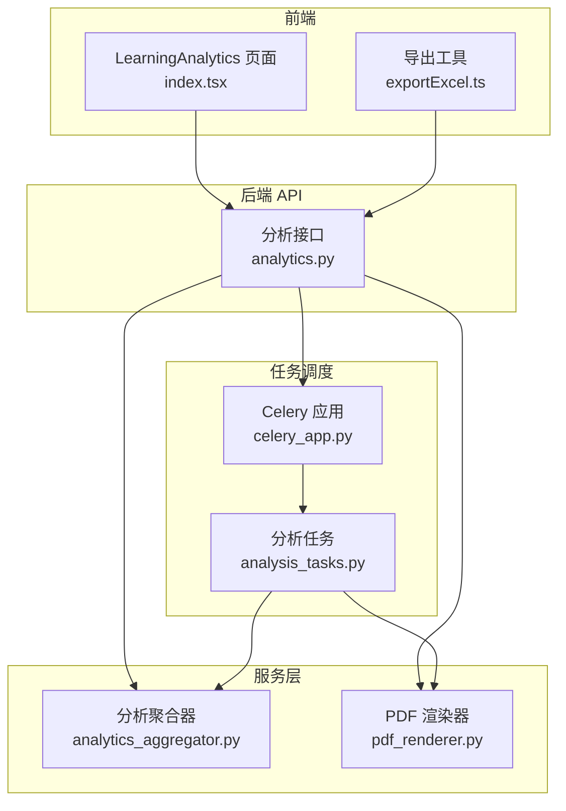
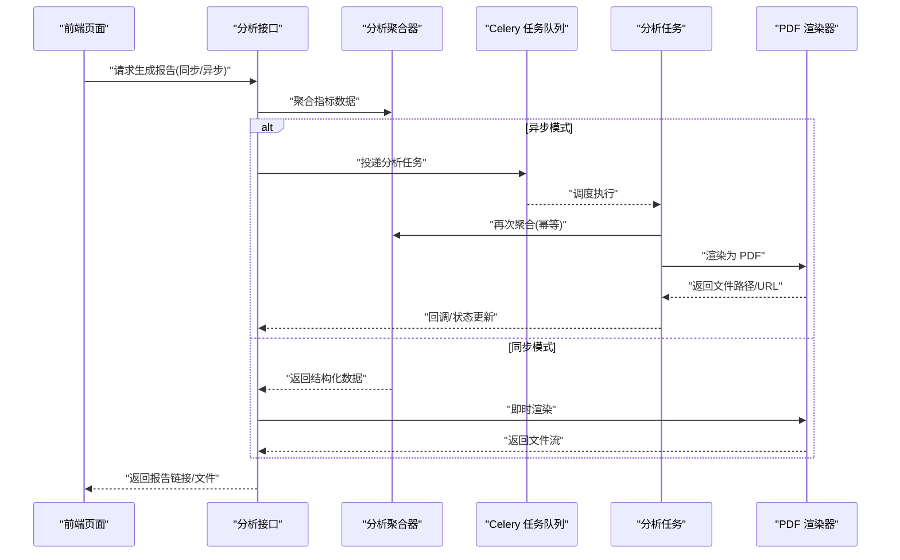
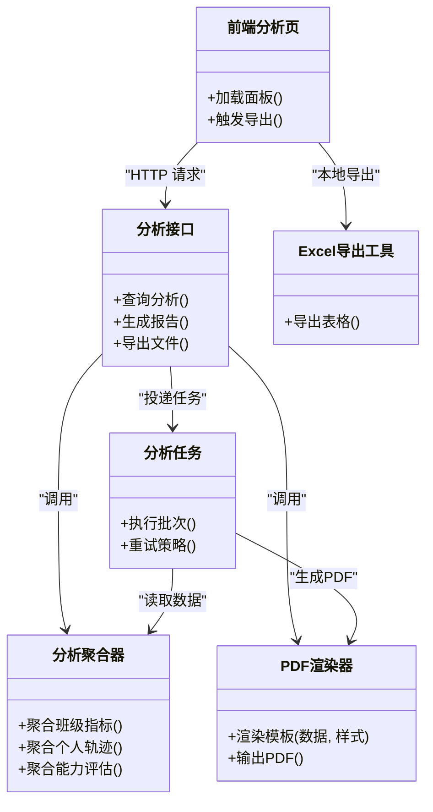
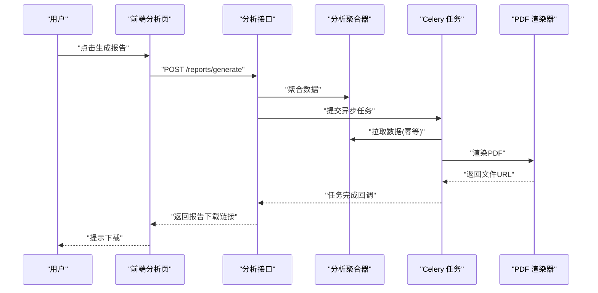
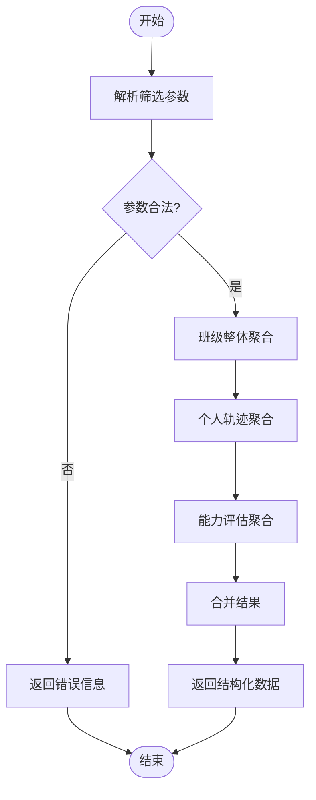
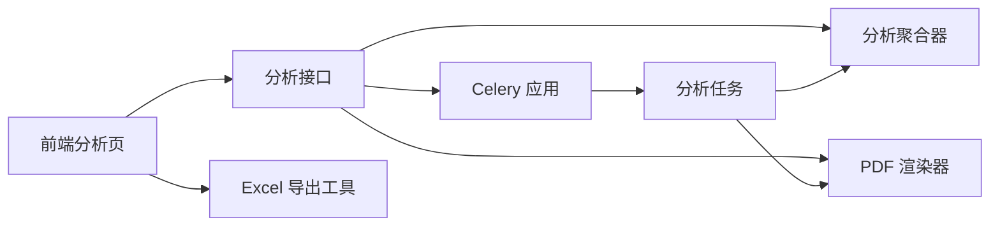

# 报告生成与分析

<cite>
**本文引用的文件**   
- [backend/app/api/v1/analytics.py](file://backend/app/api/v1/analytics.py)
- [backend/app/services/pdf_renderer.py](file://backend/app/services/pdf_renderer.py)
- [backend/app/services/analytics_aggregator.py](file://backend/app/services/analytics_aggregator.py)
- [backend/app/tasks/analysis_tasks.py](file://backend/app/tasks/analysis_tasks.py)
- [backend/app/tasks/celery_app.py](file://backend/app/tasks/celery_app.py)
- [frontend/src/pages/LearningAnalytics/index.tsx](file://frontend/src/pages/LearningAnalytics/index.tsx)
- [frontend/src/utils/exportExcel.ts](file://frontend/src/utils/exportExcel.ts)
</cite>

## 目录
1. [简介](#简介)
2. [项目结构](#项目结构)
3. [核心组件](#核心组件)
4. [架构总览](#架构总览)
5. [详细组件分析](#详细组件分析)
6. [依赖关系分析](#依赖关系分析)
7. [性能考虑](#性能考虑)
8. [故障排查指南](#故障排查指南)
9. [结论](#结论)
10. [附录](#附录)

## 简介
本模块面向学习分析平台，提供“报告自动生成与多维度分析”的端到端能力。重点覆盖：
- 报告模板设计与数据填充、格式化输出
- PDF 报告与 Excel 报表的生成流程（样式定制与内容布局控制）
- 多维度数据分析：班级整体分析、个人学习轨迹追踪、能力评估报告
- 定时生成与批量导出
- 指标自定义配置与报表模板扩展方法
- 报告分享与协作集成
- 版本管理与历史对比

## 项目结构
后端围绕 FastAPI 构建，关键路径包括 API 层、服务层、任务调度层；前端通过页面聚合展示分析结果并提供导出能力。

图表来源
- [backend/app/api/v1/analytics.py](file://backend/app/api/v1/analytics.py)
- [backend/app/services/analytics_aggregator.py](file://backend/app/services/analytics_aggregator.py)
- [backend/app/services/pdf_renderer.py](file://backend/app/services/pdf_renderer.py)
- [backend/app/tasks/celery_app.py](file://backend/app/tasks/celery_app.py)
- [backend/app/tasks/analysis_tasks.py](file://backend/app/tasks/analysis_tasks.py)
- [frontend/src/pages/LearningAnalytics/index.tsx](file://frontend/src/pages/LearningAnalytics/index.tsx)
- [frontend/src/utils/exportExcel.ts](file://frontend/src/utils/exportExcel.ts)

章节来源
- [backend/app/api/v1/analytics.py](file://backend/app/api/v1/analytics.py)
- [backend/app/services/analytics_aggregator.py](file://backend/app/services/analytics_aggregator.py)
- [backend/app/services/pdf_renderer.py](file://backend/app/services/pdf_renderer.py)
- [backend/app/tasks/celery_app.py](file://backend/app/tasks/celery_app.py)
- [backend/app/tasks/analysis_tasks.py](file://backend/app/tasks/analysis_tasks.py)
- [frontend/src/pages/LearningAnalytics/index.tsx](file://frontend/src/pages/LearningAnalytics/index.tsx)
- [frontend/src/utils/exportExcel.ts](file://frontend/src/utils/exportExcel.ts)

## 核心组件
- 分析聚合器：负责从多源数据计算班级整体、个人轨迹、能力维度等指标，并产出结构化结果供渲染使用。
- PDF 渲染器：将聚合结果转换为 PDF，支持样式与布局控制。
- 分析任务：基于 Celery 的异步任务，用于定时生成与批量导出。
- 分析 API：对外暴露查询、生成、导出等接口，协调服务层与任务层。
- 前端分析页：聚合可视化面板，支持触发分析与导出。
- Excel 导出工具：前端侧实现表格导出。

章节来源
- [backend/app/services/analytics_aggregator.py](file://backend/app/services/analytics_aggregator.py)
- [backend/app/services/pdf_renderer.py](file://backend/app/services/pdf_renderer.py)
- [backend/app/tasks/analysis_tasks.py](file://backend/app/tasks/analysis_tasks.py)
- [backend/app/api/v1/analytics.py](file://backend/app/api/v1/analytics.py)
- [frontend/src/pages/LearningAnalytics/index.tsx](file://frontend/src/pages/LearningAnalytics/index.tsx)
- [frontend/src/utils/exportExcel.ts](file://frontend/src/utils/exportExcel.ts)

## 架构总览
系统采用前后端分离与异步任务解耦的设计：前端发起分析或导出请求，后端 API 校验参数后调用服务层进行数据聚合与渲染；对耗时操作通过 Celery 任务队列执行，避免阻塞主线程。

图表来源
- [backend/app/api/v1/analytics.py](file://backend/app/api/v1/analytics.py)
- [backend/app/services/analytics_aggregator.py](file://backend/app/services/analytics_aggregator.py)
- [backend/app/services/pdf_renderer.py](file://backend/app/services/pdf_renderer.py)
- [backend/app/tasks/celery_app.py](file://backend/app/tasks/celery_app.py)
- [backend/app/tasks/analysis_tasks.py](file://backend/app/tasks/analysis_tasks.py)

## 详细组件分析

### 分析聚合器（多维度数据分析）
职责
- 班级整体分析：统计正确率、难度分布、知识点掌握度等。
- 个人学习轨迹：按时间序列汇总练习、测评、错题等事件，形成轨迹。
- 能力评估报告：基于多维指标（如知识维度、题型维度）生成雷达/趋势图所需数据。

数据结构与复杂度
- 输入：筛选条件（班级/学生/时间范围/指标集合）。
- 处理：聚合计算通常涉及分组与窗口统计，时间复杂度近似 O(N log N) 或 O(N)，取决于索引与预聚合策略。
- 输出：标准化 JSON 结构，便于渲染与导出。

优化建议
- 引入物化视图或缓存层，减少重复聚合开销。
- 对热点指标建立增量更新机制。

章节来源
- [backend/app/services/analytics_aggregator.py](file://backend/app/services/analytics_aggregator.py)

### PDF 渲染器（样式定制与布局控制）
职责
- 将聚合结果渲染为 PDF，支持标题、分页、图表占位、表格样式等。
- 提供模板变量注入与布局控制（页眉页脚、边距、字体、颜色主题等）。

关键点
- 模板设计：以可插拔方式定义各章节区块（概览、班级、个人、能力）。
- 数据填充：将结构化数据映射到模板字段。
- 输出：返回二进制流或持久化文件路径。

章节来源
- [backend/app/services/pdf_renderer.py](file://backend/app/services/pdf_renderer.py)

### 分析任务（定时生成与批量导出）
职责
- 基于 Celery 的任务编排，支持定时任务与批量导出。
- 保证幂等性：同一批次多次触发不产生重复报告。
- 失败重试与告警：记录任务日志，异常时回滚或标记失败。

典型流程
- 接收批次参数（班级/时间/指标集）。
- 调用聚合器获取数据。
- 调用渲染器生成 PDF。
- 持久化并通知前端进度。

章节来源
- [backend/app/tasks/analysis_tasks.py](file://backend/app/tasks/analysis_tasks.py)
- [backend/app/tasks/celery_app.py](file://backend/app/tasks/celery_app.py)

### 分析接口（API 层）
职责
- 统一入口：查询分析结果、触发报告生成、下载导出文件。
- 权限与参数校验：确保仅授权用户访问指定范围的数据。
- 同步/异步双模式：小量数据走同步，大批量走任务队列。

章节来源
- [backend/app/api/v1/analytics.py](file://backend/app/api/v1/analytics.py)

### 前端分析页与导出工具
职责
- 分析页：聚合多个面板（班级、个人、能力），提供筛选与刷新。
- 导出工具：将表格数据导出为 Excel，便于二次加工。

章节来源
- [frontend/src/pages/LearningAnalytics/index.tsx](file://frontend/src/pages/LearningAnalytics/index.tsx)
- [frontend/src/utils/exportExcel.ts](file://frontend/src/utils/exportExcel.ts)

#### 类图（概念映射）

图表来源
- [backend/app/api/v1/analytics.py](file://backend/app/api/v1/analytics.py)
- [backend/app/services/analytics_aggregator.py](file://backend/app/services/analytics_aggregator.py)
- [backend/app/services/pdf_renderer.py](file://backend/app/services/pdf_renderer.py)
- [backend/app/tasks/analysis_tasks.py](file://backend/app/tasks/analysis_tasks.py)
- [frontend/src/pages/LearningAnalytics/index.tsx](file://frontend/src/pages/LearningAnalytics/index.tsx)
- [frontend/src/utils/exportExcel.ts](file://frontend/src/utils/exportExcel.ts)

#### 时序图（报告生成）

图表来源
- [backend/app/api/v1/analytics.py](file://backend/app/api/v1/analytics.py)
- [backend/app/services/analytics_aggregator.py](file://backend/app/services/analytics_aggregator.py)
- [backend/app/services/pdf_renderer.py](file://backend/app/services/pdf_renderer.py)
- [backend/app/tasks/analysis_tasks.py](file://backend/app/tasks/analysis_tasks.py)

#### 流程图（指标聚合）

图表来源
- [backend/app/services/analytics_aggregator.py](file://backend/app/services/analytics_aggregator.py)

## 依赖关系分析
- 耦合与内聚
  - API 层与任务层通过消息队列解耦，降低耦合度。
  - 聚合器与渲染器职责清晰，内聚度高。
- 外部依赖
  - Celery 作为任务调度器。
  - PDF 渲染库（具体实现由渲染器封装）。
  - 前端导出依赖浏览器环境。

图表来源
- [backend/app/api/v1/analytics.py](file://backend/app/api/v1/analytics.py)
- [backend/app/services/analytics_aggregator.py](file://backend/app/services/analytics_aggregator.py)
- [backend/app/services/pdf_renderer.py](file://backend/app/services/pdf_renderer.py)
- [backend/app/tasks/celery_app.py](file://backend/app/tasks/celery_app.py)
- [backend/app/tasks/analysis_tasks.py](file://backend/app/tasks/analysis_tasks.py)
- [frontend/src/pages/LearningAnalytics/index.tsx](file://frontend/src/pages/LearningAnalytics/index.tsx)
- [frontend/src/utils/exportExcel.ts](file://frontend/src/utils/exportExcel.ts)

## 性能考虑
- 聚合计算
  - 对热点指标建立缓存或物化视图，避免全表扫描。
  - 分时段增量聚合，降低单次计算压力。
- 渲染与 I/O
  - PDF 渲染尽量复用模板与资源，减少重复初始化。
  - 大文件导出采用流式传输与分片下载。
- 任务队列
  - 合理设置并发与重试策略，避免雪崩。
  - 监控任务堆积与失败率，及时扩容或降级。

## 故障排查指南
- 常见问题
  - 任务长时间挂起：检查 Celery Worker 状态与队列积压。
  - PDF 渲染失败：核对模板变量是否齐全、样式资源是否可用。
  - 数据不一致：确认聚合器幂等性与缓存一致性。
- 定位步骤
  - 查看任务日志与错误堆栈。
  - 复现最小参数集，逐步缩小问题范围。
  - 对聚合中间结果落盘，便于回溯。

章节来源
- [backend/app/tasks/analysis_tasks.py](file://backend/app/tasks/analysis_tasks.py)
- [backend/app/services/pdf_renderer.py](file://backend/app/services/pdf_renderer.py)
- [backend/app/services/analytics_aggregator.py](file://backend/app/services/analytics_aggregator.py)

## 结论
本模块通过“聚合—渲染—任务”的分层设计，实现了学习报告的自动化生成与多维度分析。借助 Celery 异步化与前端导出工具，既保证了大规模数据的处理能力，也兼顾了用户体验。后续可在模板扩展、指标配置与版本管理等方面进一步增强灵活性。

## 附录

### 报告模板设计与扩展
- 模板分层：概览、班级、个人、能力四大区块，每个区块独立可插拔。
- 变量注入：通过键值映射将聚合结果填入模板字段。
- 样式定制：支持主题、字体、边距、分页规则等。
- 扩展方法：新增区块只需注册新模板与对应数据适配器。

章节来源
- [backend/app/services/pdf_renderer.py](file://backend/app/services/pdf_renderer.py)

### 指标自定义配置
- 指标字典：以键值形式定义指标名称、聚合函数、过滤条件。
- 动态组合：前端选择指标集合，后端按需聚合。
- 版本化：指标变更需保留旧版兼容，避免破坏既有报告。

章节来源
- [backend/app/services/analytics_aggregator.py](file://backend/app/services/analytics_aggregator.py)

### 报告分享与协作
- 分享链接：生成一次性或有效期受限的下载链接。
- 权限控制：基于角色与范围限制访问。
- 协作评论：在报告元数据中附加评论与标签（可扩展）。

章节来源
- [backend/app/api/v1/analytics.py](file://backend/app/api/v1/analytics.py)

### 版本管理与历史对比
- 版本标识：每次生成附带版本号与时间戳。
- 差异对比：按指标维度计算差值与变化趋势。
- 归档策略：历史报告按周期归档，支持检索与回放。

章节来源
- [backend/app/services/pdf_renderer.py](file://backend/app/services/pdf_renderer.py)
- [backend/app/services/analytics_aggregator.py](file://backend/app/services/analytics_aggregator.py)